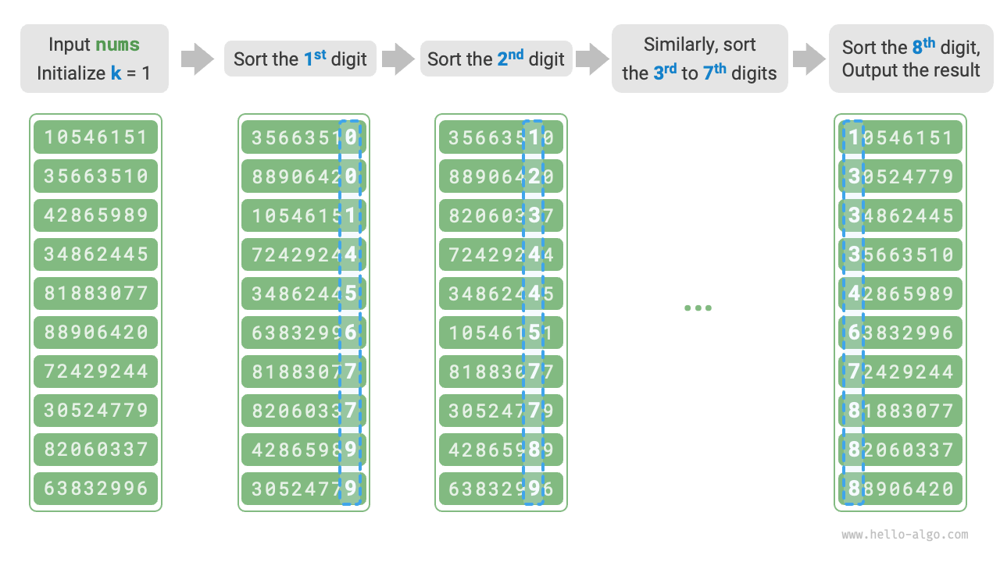

# 11.10 &nbsp; 基数ソート

前節では計数ソートを紹介しました。これは、データ量 $n$ が大きく、データ範囲 $m$ が小さい場合に適しています。$n = 10^6$ 個の学籍番号をソートすると仮定すると、学籍番号は $8$ 桁の数字なので、データ範囲 $m = 10^8$ は非常に大きくなります。計数ソートでは大量のメモリ空間を確保する必要がありますが、基数ソートではこの問題を回避できます。

<u>基数ソート（radix sort）</u>の基本的な考え方は計数ソートと同じで、個数を数えることによってソートを実現します。そのうえで、基数ソートは各桁の段階的な関係を利用し、各桁を順にソートすることで、最終的なソート結果を得ます。

## 11.10.1 &nbsp; アルゴリズムの流れ

学籍番号データを例にすると、数字の最下位桁を第 $1$ 位、最上位桁を第 $8$ 位としたとき、基数ソートの流れは次図のようになります。

1. 桁番号 $k = 1$ を初期化します。
2. 学籍番号の第 $k$ 位に対して「計数ソート」を実行します。完了すると、データは第 $k$ 位に従って昇順に並びます。
3. $k$ を $1$ 増やし、手順 `2.` に戻って反復を続けます。すべての桁のソートが完了したら終了します。

{ class="animation-figure" }

<p align="center"> 図 11-18 &nbsp; 基数ソートのアルゴリズムの流れ </p>

以下ではコード実装を分解して見ていきます。$d$ 進数の数値 $x$ について、その第 $k$ 位 $x_k$ を取得するには、次の計算式を用います。

$$
x_k = \lfloor\frac{x}{d^{k-1}}\rfloor \bmod d
$$

ここで、$\lfloor a \rfloor$ は浮動小数点数 $a$ の切り捨てを表し、$\bmod \: d$ は $d$ による剰余を表します。学籍番号データでは、$d = 10$ かつ $k \in [1, 8]$ です。

さらに、数字の第 $k$ 位に基づいてソートできるように、計数ソートのコードを少し変更する必要があります。

=== "Python"

    ```python title="radix_sort.py"
    def digit(num: int, exp: int) -> int:
        """要素 num の下から k 桁目を取得（exp = 10^(k-1)）"""
        # ここで高コストな累乗計算を繰り返さないよう、k ではなく exp を渡す
        return (num // exp) % 10

    def counting_sort_digit(nums: list[int], exp: int):
        """計数ソート（nums の k 桁目でソート）"""
        # 10 進数の各桁は 0~9 の範囲なので、長さ 10 のバケット配列が必要
        counter = [0] * 10
        n = len(nums)
        # 0~9 の各数字の出現回数を集計する
        for i in range(n):
            d = digit(nums[i], exp)  # nums[i] の第 k 位を取得し、d とする
            counter[d] += 1  # 数字 d の出現回数を数える
        # 累積和を求め、「出現回数」を「配列インデックス」に変換する
        for i in range(1, 10):
            counter[i] += counter[i - 1]
        # 逆順に走査し、バケット内の集計結果に従って各要素を res に格納する
        res = [0] * n
        for i in range(n - 1, -1, -1):
            d = digit(nums[i], exp)
            j = counter[d] - 1  # d の配列内インデックス j を取得する
            res[j] = nums[i]  # 現在の要素をインデックス j に格納する
            counter[d] -= 1  # d の個数を 1 減らす
        # 結果で元の配列 nums を上書きする
        for i in range(n):
            nums[i] = res[i]

    def radix_sort(nums: list[int]):
        """基数ソート"""
        # 最大桁数の判定用に配列の最大要素を取得
        m = max(nums)
        # 下位桁から上位桁の順に走査する
        exp = 1
        while exp <= m:
            # 配列要素の k 桁目に対して計数ソートを行う
            # k = 1 -> exp = 1
            # k = 2 -> exp = 10
            # つまり exp = 10^(k-1)
            counting_sort_digit(nums, exp)
            exp *= 10
    ```

=== "C++"

    ```cpp title="radix_sort.cpp"
    /* 要素 num の下から k 桁目を取得（exp = 10^(k-1)） */
    int digit(int num, int exp) {
        // ここで高コストな累乗計算を繰り返さないよう、k ではなく exp を渡す
        return (num / exp) % 10;
    }

    /* 計数ソート（nums の k 桁目でソート） */
    void countingSortDigit(vector<int> &nums, int exp) {
        // 10 進数の各桁は 0~9 の範囲なので、長さ 10 のバケット配列が必要
        vector<int> counter(10, 0);
        int n = nums.size();
        // 0~9 の各数字の出現回数を集計する
        for (int i = 0; i < n; i++) {
            int d = digit(nums[i], exp); // nums[i] の第 k 位を取得し、d とする
            counter[d]++;                // 数字 d の出現回数を数える
        }
        // 累積和を求め、「出現回数」を「配列インデックス」に変換する
        for (int i = 1; i < 10; i++) {
            counter[i] += counter[i - 1];
        }
        // 逆順に走査し、バケット内の集計結果に従って各要素を res に格納する
        vector<int> res(n, 0);
        for (int i = n - 1; i >= 0; i--) {
            int d = digit(nums[i], exp);
            int j = counter[d] - 1; // d の配列内インデックス j を取得する
            res[j] = nums[i];       // 現在の要素をインデックス j に格納する
            counter[d]--;           // d の個数を 1 減らす
        }
        // 結果で元の配列 nums を上書きする
        for (int i = 0; i < n; i++)
            nums[i] = res[i];
    }

    /* 基数ソート */
    void radixSort(vector<int> &nums) {
        // 最大桁数の判定用に配列の最大要素を取得
        int m = *max_element(nums.begin(), nums.end());
        // 下位桁から上位桁の順に走査する
        for (int exp = 1; exp <= m; exp *= 10)
            // 配列要素の k 桁目に対して計数ソートを行う
            // k = 1 -> exp = 1
            // k = 2 -> exp = 10
            // つまり exp = 10^(k-1)
            countingSortDigit(nums, exp);
    }
    ```

=== "Java"

    ```java title="radix_sort.java"
    /* 要素 num の下から k 桁目を取得（exp = 10^(k-1)） */
    int digit(int num, int exp) {
        // ここで高コストな累乗計算を繰り返さないよう、k ではなく exp を渡す
        return (num / exp) % 10;
    }

    /* 計数ソート（nums の k 桁目でソート） */
    void countingSortDigit(int[] nums, int exp) {
        // 10 進数の各桁は 0~9 の範囲なので、長さ 10 のバケット配列が必要
        int[] counter = new int[10];
        int n = nums.length;
        // 0~9 の各数字の出現回数を集計する
        for (int i = 0; i < n; i++) {
            int d = digit(nums[i], exp); // nums[i] の第 k 位を取得し、d とする
            counter[d]++;                // 数字 d の出現回数を数える
        }
        // 累積和を求め、「出現回数」を「配列インデックス」に変換する
        for (int i = 1; i < 10; i++) {
            counter[i] += counter[i - 1];
        }
        // 逆順に走査し、バケット内の集計結果に従って各要素を res に格納する
        int[] res = new int[n];
        for (int i = n - 1; i >= 0; i--) {
            int d = digit(nums[i], exp);
            int j = counter[d] - 1; // d の配列内インデックス j を取得する
            res[j] = nums[i];       // 現在の要素をインデックス j に格納する
            counter[d]--;           // d の個数を 1 減らす
        }
        // 結果で元の配列 nums を上書きする
        for (int i = 0; i < n; i++)
            nums[i] = res[i];
    }

    /* 基数ソート */
    void radixSort(int[] nums) {
        // 最大桁数の判定用に配列の最大要素を取得
        int m = Integer.MIN_VALUE;
        for (int num : nums)
            if (num > m)
                m = num;
        // 下位桁から上位桁の順に走査する
        for (int exp = 1; exp <= m; exp *= 10) {
            // 配列要素の k 桁目に対して計数ソートを行う
            // k = 1 -> exp = 1
            // k = 2 -> exp = 10
            // つまり exp = 10^(k-1)
            countingSortDigit(nums, exp);
        }
    }
    ```

=== "C#"

    ```csharp title="radix_sort.cs"
    /* 要素 num の下から k 桁目を取得（exp = 10^(k-1)） */
    int Digit(int num, int exp) {
        // ここで高コストな累乗計算を繰り返さないよう、k ではなく exp を渡す
        return (num / exp) % 10;
    }

    /* 計数ソート（nums の k 桁目でソート） */
    void CountingSortDigit(int[] nums, int exp) {
        // 10 進数の各桁は 0~9 の範囲なので、長さ 10 のバケット配列が必要
        int[] counter = new int[10];
        int n = nums.Length;
        // 0~9 の各数字の出現回数を集計する
        for (int i = 0; i < n; i++) {
            int d = Digit(nums[i], exp); // nums[i] の第 k 位を取得し、d とする
            counter[d]++;                // 数字 d の出現回数を数える
        }
        // 累積和を求め、「出現回数」を「配列インデックス」に変換する
        for (int i = 1; i < 10; i++) {
            counter[i] += counter[i - 1];
        }
        // 逆順に走査し、バケット内の集計結果に従って各要素を res に格納する
        int[] res = new int[n];
        for (int i = n - 1; i >= 0; i--) {
            int d = Digit(nums[i], exp);
            int j = counter[d] - 1; // d の配列内インデックス j を取得する
            res[j] = nums[i];       // 現在の要素をインデックス j に格納する
            counter[d]--;           // d の個数を 1 減らす
        }
        // 結果で元の配列 nums を上書きする
        for (int i = 0; i < n; i++) {
            nums[i] = res[i];
        }
    }

    /* 基数ソート */
    void RadixSort(int[] nums) {
        // 最大桁数の判定用に配列の最大要素を取得
        int m = int.MinValue;
        foreach (int num in nums) {
            if (num > m) m = num;
        }
        // 下位桁から上位桁の順に走査する
        for (int exp = 1; exp <= m; exp *= 10) {
            // 配列要素の k 桁目に対して計数ソートを行う
            // k = 1 -> exp = 1
            // k = 2 -> exp = 10
            // つまり exp = 10^(k-1)
            CountingSortDigit(nums, exp);
        }
    }
    ```

=== "Go"

    ```go title="radix_sort.go"
    /* 要素 num の下から k 桁目を取得（exp = 10^(k-1)） */
    func digit(num, exp int) int {
        // ここで高コストな累乗計算を繰り返さないよう、k ではなく exp を渡す
        return (num / exp) % 10
    }

    /* 計数ソート（nums の k 桁目でソート） */
    func countingSortDigit(nums []int, exp int) {
        // 10 進数の各桁は 0~9 の範囲なので、長さ 10 のバケット配列が必要
        counter := make([]int, 10)
        n := len(nums)
        // 0~9 の各数字の出現回数を集計する
        for i := 0; i < n; i++ {
            d := digit(nums[i], exp) // nums[i] の第 k 位を取得し、d とする
            counter[d]++             // 数字 d の出現回数を数える
        }
        // 累積和を求め、「出現回数」を「配列インデックス」に変換する
        for i := 1; i < 10; i++ {
            counter[i] += counter[i-1]
        }
        // 逆順に走査し、バケット内の集計結果に従って各要素を res に格納する
        res := make([]int, n)
        for i := n - 1; i >= 0; i-- {
            d := digit(nums[i], exp)
            j := counter[d] - 1 // d の配列内インデックス j を取得する
            res[j] = nums[i]    // 現在の要素をインデックス j に格納する
            counter[d]--        // d の個数を 1 減らす
        }
        // 結果で元の配列 nums を上書きする
        for i := 0; i < n; i++ {
            nums[i] = res[i]
        }
    }

    /* 基数ソート */
    func radixSort(nums []int) {
        // 最大桁数の判定用に配列の最大要素を取得
        max := math.MinInt
        for _, num := range nums {
            if num > max {
                max = num
            }
        }
        // 下位桁から上位桁の順に走査する
        for exp := 1; max >= exp; exp *= 10 {
            // 配列要素の k 桁目に対して計数ソートを行う
            // k = 1 -> exp = 1
            // k = 2 -> exp = 10
            // つまり exp = 10^(k-1)
            countingSortDigit(nums, exp)
        }
    }
    ```

=== "Swift"

    ```swift title="radix_sort.swift"
    /* 要素 num の下から k 桁目を取得（exp = 10^(k-1)） */
    func digit(num: Int, exp: Int) -> Int {
        // ここで高コストな累乗計算を繰り返さないよう、k ではなく exp を渡す
        (num / exp) % 10
    }

    /* 計数ソート（nums の k 桁目でソート） */
    func countingSortDigit(nums: inout [Int], exp: Int) {
        // 10 進数の各桁は 0~9 の範囲なので、長さ 10 のバケット配列が必要
        var counter = Array(repeating: 0, count: 10)
        // 0~9 の各数字の出現回数を集計する
        for i in nums.indices {
            let d = digit(num: nums[i], exp: exp) // nums[i] の第 k 位を取得し、d とする
            counter[d] += 1 // 数字 d の出現回数を数える
        }
        // 累積和を求め、「出現回数」を「配列インデックス」に変換する
        for i in 1 ..< 10 {
            counter[i] += counter[i - 1]
        }
        // 逆順に走査し、バケット内の集計結果に従って各要素を res に格納する
        var res = Array(repeating: 0, count: nums.count)
        for i in nums.indices.reversed() {
            let d = digit(num: nums[i], exp: exp)
            let j = counter[d] - 1 // d の配列内インデックス j を取得する
            res[j] = nums[i] // 現在の要素をインデックス j に格納する
            counter[d] -= 1 // d の個数を 1 減らす
        }
        // 結果で元の配列 nums を上書きする
        for i in nums.indices {
            nums[i] = res[i]
        }
    }

    /* 基数ソート */
    func radixSort(nums: inout [Int]) {
        // 最大桁数の判定用に配列の最大要素を取得
        var m = Int.min
        for num in nums {
            if num > m {
                m = num
            }
        }
        // 下位桁から上位桁の順に走査する
        for exp in sequence(first: 1, next: { m >= ($0 * 10) ? $0 * 10 : nil }) {
            // 配列要素の k 桁目に対して計数ソートを行う
            // k = 1 -> exp = 1
            // k = 2 -> exp = 10
            // つまり exp = 10^(k-1)
            countingSortDigit(nums: &nums, exp: exp)
        }
    }
    ```

=== "JS"

    ```javascript title="radix_sort.js"
    /* 要素 num の下から k 桁目を取得（exp = 10^(k-1)） */
    function digit(num, exp) {
        // ここで高コストな累乗計算を繰り返さないよう、k ではなく exp を渡す
        return Math.floor(num / exp) % 10;
    }

    /* 計数ソート（nums の k 桁目でソート） */
    function countingSortDigit(nums, exp) {
        // 10 進数の各桁は 0~9 の範囲なので、長さ 10 のバケット配列が必要
        const counter = new Array(10).fill(0);
        const n = nums.length;
        // 0~9 の各数字の出現回数を集計する
        for (let i = 0; i < n; i++) {
            const d = digit(nums[i], exp); // nums[i] の第 k 位を取得し、d とする
            counter[d]++; // 数字 d の出現回数を数える
        }
        // 累積和を求め、「出現回数」を「配列インデックス」に変換する
        for (let i = 1; i < 10; i++) {
            counter[i] += counter[i - 1];
        }
        // 逆順に走査し、バケット内の集計結果に従って各要素を res に格納する
        const res = new Array(n).fill(0);
        for (let i = n - 1; i >= 0; i--) {
            const d = digit(nums[i], exp);
            const j = counter[d] - 1; // d の配列内インデックス j を取得する
            res[j] = nums[i]; // 現在の要素をインデックス j に格納する
            counter[d]--; // d の個数を 1 減らす
        }
        // 結果で元の配列 nums を上書きする
        for (let i = 0; i < n; i++) {
            nums[i] = res[i];
        }
    }

    /* 基数ソート */
    function radixSort(nums) {
        // 最大桁数の判定用に配列の最大要素を取得
        let m = Math.max(... nums);
        // 下位桁から上位桁の順に走査する
        for (let exp = 1; exp <= m; exp *= 10) {
            // 配列要素の k 桁目に対して計数ソートを行う
            // k = 1 -> exp = 1
            // k = 2 -> exp = 10
            // つまり exp = 10^(k-1)
            countingSortDigit(nums, exp);
        }
    }
    ```

=== "TS"

    ```typescript title="radix_sort.ts"
    /* 要素 num の下から k 桁目を取得（exp = 10^(k-1)） */
    function digit(num: number, exp: number): number {
        // ここで高コストな累乗計算を繰り返さないよう、k ではなく exp を渡す
        return Math.floor(num / exp) % 10;
    }

    /* 計数ソート（nums の k 桁目でソート） */
    function countingSortDigit(nums: number[], exp: number): void {
        // 10 進数の各桁は 0~9 の範囲なので、長さ 10 のバケット配列が必要
        const counter = new Array(10).fill(0);
        const n = nums.length;
        // 0~9 の各数字の出現回数を集計する
        for (let i = 0; i < n; i++) {
            const d = digit(nums[i], exp); // nums[i] の第 k 位を取得し、d とする
            counter[d]++; // 数字 d の出現回数を数える
        }
        // 累積和を求め、「出現回数」を「配列インデックス」に変換する
        for (let i = 1; i < 10; i++) {
            counter[i] += counter[i - 1];
        }
        // 逆順に走査し、バケット内の集計結果に従って各要素を res に格納する
        const res = new Array(n).fill(0);
        for (let i = n - 1; i >= 0; i--) {
            const d = digit(nums[i], exp);
            const j = counter[d] - 1; // d の配列内インデックス j を取得する
            res[j] = nums[i]; // 現在の要素をインデックス j に格納する
            counter[d]--; // d の個数を 1 減らす
        }
        // 結果で元の配列 nums を上書きする
        for (let i = 0; i < n; i++) {
            nums[i] = res[i];
        }
    }

    /* 基数ソート */
    function radixSort(nums: number[]): void {
        // 最大桁数の判定用に配列の最大要素を取得
        let m: number = Math.max(... nums);
        // 下位桁から上位桁の順に走査する
        for (let exp = 1; exp <= m; exp *= 10) {
            // 配列要素の k 桁目に対して計数ソートを行う
            // k = 1 -> exp = 1
            // k = 2 -> exp = 10
            // つまり exp = 10^(k-1)
            countingSortDigit(nums, exp);
        }
    }
    ```

=== "Dart"

    ```dart title="radix_sort.dart"
    /* 要素 `_num` の第 k 桁を取得する。ここで `exp = 10^(k-1)` */
    int digit(int _num, int exp) {
      // ここで高コストな累乗計算を繰り返さないよう、k ではなく exp を渡す
      return (_num ~/ exp) % 10;
    }

    /* 計数ソート（nums の k 桁目でソート） */
    void countingSortDigit(List<int> nums, int exp) {
      // 10 進数の各桁は 0~9 の範囲なので、長さ 10 のバケット配列が必要
      List<int> counter = List<int>.filled(10, 0);
      int n = nums.length;
      // 0~9 の各数字の出現回数を集計する
      for (int i = 0; i < n; i++) {
        int d = digit(nums[i], exp); // nums[i] の第 k 位を取得し、d とする
        counter[d]++; // 数字 d の出現回数を数える
      }
      // 累積和を求め、「出現回数」を「配列インデックス」に変換する
      for (int i = 1; i < 10; i++) {
        counter[i] += counter[i - 1];
      }
      // 逆順に走査し、バケット内の集計結果に従って各要素を res に格納する
      List<int> res = List<int>.filled(n, 0);
      for (int i = n - 1; i >= 0; i--) {
        int d = digit(nums[i], exp);
        int j = counter[d] - 1; // d の配列内インデックス j を取得する
        res[j] = nums[i]; // 現在の要素をインデックス j に格納する
        counter[d]--; // d の個数を 1 減らす
      }
      // 結果で元の配列 nums を上書きする
      for (int i = 0; i < n; i++) nums[i] = res[i];
    }

    /* 基数ソート */
    void radixSort(List<int> nums) {
      // 最大桁数の判定用に配列の最大要素を取得する
      // dart の `int` の長さは 64 ビット
      int m = -1 << 63;
      for (int _num in nums) if (_num > m) m = _num;
      // 下位桁から上位桁の順に走査する
      for (int exp = 1; exp <= m; exp *= 10)
        // 配列要素の k 桁目に対して計数ソートを行う
        // k = 1 -> exp = 1
        // k = 2 -> exp = 10
        // つまり exp = 10^(k-1)
        countingSortDigit(nums, exp);
    }
    ```

=== "Rust"

    ```rust title="radix_sort.rs"
    /* 要素 num の下から k 桁目を取得（exp = 10^(k-1)） */
    fn digit(num: i32, exp: i32) -> usize {
        // ここで高コストな累乗計算を繰り返さないよう、k ではなく exp を渡す
        return ((num / exp) % 10) as usize;
    }

    /* 計数ソート（nums の k 桁目でソート） */
    fn counting_sort_digit(nums: &mut [i32], exp: i32) {
        // 10 進数の各桁は 0~9 の範囲なので、長さ 10 のバケット配列が必要
        let mut counter = [0; 10];
        let n = nums.len();
        // 0~9 の各数字の出現回数を集計する
        for i in 0..n {
            let d = digit(nums[i], exp); // nums[i] の第 k 位を取得し、d とする
            counter[d] += 1; // 数字 d の出現回数を数える
        }
        // 累積和を求め、「出現回数」を「配列インデックス」に変換する
        for i in 1..10 {
            counter[i] += counter[i - 1];
        }
        // 逆順に走査し、バケット内の集計結果に従って各要素を res に格納する
        let mut res = vec![0; n];
        for i in (0..n).rev() {
            let d = digit(nums[i], exp);
            let j = counter[d] - 1; // d の配列内インデックス j を取得する
            res[j] = nums[i]; // 現在の要素をインデックス j に格納する
            counter[d] -= 1; // d の個数を 1 減らす
        }
        // 結果で元の配列 nums を上書きする
        nums.copy_from_slice(&res);
    }

    /* 基数ソート */
    fn radix_sort(nums: &mut [i32]) {
        // 最大桁数の判定用に配列の最大要素を取得
        let m = *nums.into_iter().max().unwrap();
        // 下位桁から上位桁の順に走査する
        let mut exp = 1;
        while exp <= m {
            counting_sort_digit(nums, exp);
            exp *= 10;
        }
    }
    ```

=== "C"

    ```c title="radix_sort.c"
    /* 要素 num の下から k 桁目を取得（exp = 10^(k-1)） */
    int digit(int num, int exp) {
        // ここで高コストな累乗計算を繰り返さないよう、k ではなく exp を渡す
        return (num / exp) % 10;
    }

    /* 計数ソート（nums の k 桁目でソート） */
    void countingSortDigit(int nums[], int size, int exp) {
        // 10 進数の各桁は 0~9 の範囲なので、長さ 10 のバケット配列が必要
        int *counter = (int *)malloc((sizeof(int) * 10));
        memset(counter, 0, sizeof(int) * 10); // 後続のメモリ解放に備えて 0 で初期化する
        // 0~9 の各数字の出現回数を集計する
        for (int i = 0; i < size; i++) {
            // nums[i] の第 k 位を取得し、d とする
            int d = digit(nums[i], exp);
            // 数字 d の出現回数を数える
            counter[d]++;
        }
        // 累積和を求め、「出現回数」を「配列インデックス」に変換する
        for (int i = 1; i < 10; i++) {
            counter[i] += counter[i - 1];
        }
        // 逆順に走査し、バケット内の集計結果に従って各要素を res に格納する
        int *res = (int *)malloc(sizeof(int) * size);
        for (int i = size - 1; i >= 0; i--) {
            int d = digit(nums[i], exp);
            int j = counter[d] - 1; // d の配列内インデックス j を取得する
            res[j] = nums[i];       // 現在の要素をインデックス j に格納する
            counter[d]--;           // d の個数を 1 減らす
        }
        // 結果で元の配列 nums を上書きする
        for (int i = 0; i < size; i++) {
            nums[i] = res[i];
        }
        // メモリを解放する
        free(res);
        free(counter);
    }

    /* 基数ソート */
    void radixSort(int nums[], int size) {
        // 最大桁数の判定用に配列の最大要素を取得
        int max = INT32_MIN;
        for (int i = 0; i < size; i++) {
            if (nums[i] > max) {
                max = nums[i];
            }
        }
        // 下位桁から上位桁の順に走査する
        for (int exp = 1; max >= exp; exp *= 10)
            // 配列要素の k 桁目に対して計数ソートを行う
            // k = 1 -> exp = 1
            // k = 2 -> exp = 10
            // つまり exp = 10^(k-1)
            countingSortDigit(nums, size, exp);
    }
    ```

=== "Kotlin"

    ```kotlin title="radix_sort.kt"
    /* 要素 num の下から k 桁目を取得（exp = 10^(k-1)） */
    fun digit(num: Int, exp: Int): Int {
        // ここで高コストな累乗計算を繰り返さないよう、k ではなく exp を渡す
        return (num / exp) % 10
    }

    /* 計数ソート（nums の k 桁目でソート） */
    fun countingSortDigit(nums: IntArray, exp: Int) {
        // 10 進数の各桁は 0~9 の範囲なので、長さ 10 のバケット配列が必要
        val counter = IntArray(10)
        val n = nums.size
        // 0~9 の各数字の出現回数を集計する
        for (i in 0..<n) {
            val d = digit(nums[i], exp) // nums[i] の第 k 位を取得し、d とする
            counter[d]++                // 数字 d の出現回数を数える
        }
        // 累積和を求め、「出現回数」を「配列インデックス」に変換する
        for (i in 1..9) {
            counter[i] += counter[i - 1]
        }
        // 逆順に走査し、バケット内の集計結果に従って各要素を res に格納する
        val res = IntArray(n)
        for (i in n - 1 downTo 0) {
            val d = digit(nums[i], exp)
            val j = counter[d] - 1 // d の配列内インデックス j を取得する
            res[j] = nums[i]       // 現在の要素をインデックス j に格納する
            counter[d]--           // d の個数を 1 減らす
        }
        // 結果で元の配列 nums を上書きする
        for (i in 0..<n)
            nums[i] = res[i]
    }

    /* 基数ソート */
    fun radixSort(nums: IntArray) {
        // 最大桁数の判定用に配列の最大要素を取得
        var m = Int.MIN_VALUE
        for (num in nums) if (num > m) m = num
        var exp = 1
        // 下位桁から上位桁の順に走査する
        while (exp <= m) {
            // 配列要素の k 桁目に対して計数ソートを行う
            // k = 1 -> exp = 1
            // k = 2 -> exp = 10
            // つまり exp = 10^(k-1)
            countingSortDigit(nums, exp)
            exp *= 10
        }
    }
    ```

=== "Ruby"

    ```ruby title="radix_sort.rb"
    ### num の第 k 桁を取得する。ここで exp = 10^(k-1) ###
    def digit(num, exp)
      # k ではなく exp を渡すことで、ここで高コストな累乗計算を繰り返し実行するのを避けられる
      (num / exp) % 10
    end

    ### num の第 k 桁を取得する。ここで exp = 10^(k-1) ###
    def digit(num, exp)
      # k ではなく exp を渡すことで、ここで高コストな累乗計算を繰り返し実行するのを避けられる
      (num / exp) % 10
    end

    # ## 計数ソート（nums の k 桁目でソート）###
    def counting_sort_digit(nums, exp)
      # 10 進数の各桁は 0~9 の範囲なので、長さ 10 のバケット配列が必要
      counter = Array.new(10, 0)
      n = nums.length
      # 0~9 の各数字の出現回数を集計する
      for i in 0...n
        d = digit(nums[i], exp) # nums[i] の第 k 位を取得し、d とする
        counter[d] += 1 # 数字 d の出現回数を数える
      end
      # 累積和を求め、「出現回数」を「配列インデックス」に変換する
      (1...10).each { |i| counter[i] += counter[i - 1] }
      # 逆順に走査し、バケット内の集計結果に従って各要素を res に格納する
      res = Array.new(n, 0)
      for i in (n - 1).downto(0)
        d = digit(nums[i], exp)
        j = counter[d] - 1 # d の配列内インデックス j を取得する
        res[j] = nums[i] # 現在の要素をインデックス j に格納する
        counter[d] -= 1 # d の個数を 1 減らす
      end
      # 結果で元の配列 nums を上書きする
      (0...n).each { |i| nums[i] = res[i] }
    end

    ### 基数ソート ###
    def radix_sort(nums)
      # 最大桁数の判定用に配列の最大要素を取得
      m = nums.max
      # 下位桁から上位桁の順に走査する
      exp = 1
      while exp <= m
        # 配列要素の k 桁目に対して計数ソートを行う
        # k = 1 -> exp = 1
        # k = 2 -> exp = 10
        # つまり exp = 10^(k-1)
        counting_sort_digit(nums, exp)
        exp *= 10
      end
    end
    ```

??? pythontutor "コードの可視化"

    <div style="height: 549px; width: 100%;"><iframe class="pythontutor-iframe" src="https://pythontutor.com/iframe-embed.html#code=def%20digit%28num%3A%20int%2C%20exp%3A%20int%29%20-%3E%20int%3A%0A%20%20%20%20%22%22%22%E8%A6%81%E7%B4%A0%20num%20%E3%81%AE%E4%B8%8B%E3%81%8B%E3%82%89%20k%20%E6%A1%81%E7%9B%AE%E3%82%92%E5%8F%96%E5%BE%97%EF%BC%88exp%20%3D%2010%5E%28k-1%29%EF%BC%89%22%22%22%0A%20%20%20%20%23%20%E3%81%93%E3%81%93%E3%81%A7%E9%AB%98%E3%82%B3%E3%82%B9%E3%83%88%E3%81%AA%E7%B4%AF%E4%B9%97%E8%A8%88%E7%AE%97%E3%82%92%E7%B9%B0%E3%82%8A%E8%BF%94%E3%81%95%E3%81%AA%E3%81%84%E3%82%88%E3%81%86%E3%80%81k%20%E3%81%A7%E3%81%AF%E3%81%AA%E3%81%8F%20exp%20%E3%82%92%E6%B8%A1%E3%81%99%0A%20%20%20%20return%20%28num%20%2F%2F%20exp%29%20%25%2010%0A%0Adef%20counting_sort_digit%28nums%3A%20list%5Bint%5D%2C%20exp%3A%20int%29%3A%0A%20%20%20%20%22%22%22%E8%A8%88%E6%95%B0%E3%82%BD%E3%83%BC%E3%83%88%EF%BC%88nums%20%E3%81%AE%20k%20%E6%A1%81%E7%9B%AE%E3%81%A7%E3%82%BD%E3%83%BC%E3%83%88%EF%BC%89%22%22%22%0A%20%20%20%20%23%2010%20%E9%80%B2%E6%95%B0%E3%81%AE%E5%90%84%E6%A1%81%E3%81%AF%200~9%20%E3%81%AE%E7%AF%84%E5%9B%B2%E3%81%AA%E3%81%AE%E3%81%A7%E3%80%81%E9%95%B7%E3%81%95%2010%20%E3%81%AE%E3%83%90%E3%82%B1%E3%83%83%E3%83%88%E9%85%8D%E5%88%97%E3%81%8C%E5%BF%85%E8%A6%81%0A%20%20%20%20counter%20%3D%20%5B0%5D%20%2A%2010%0A%20%20%20%20n%20%3D%20len%28nums%29%0A%20%20%20%20%23%200~9%20%E3%81%AE%E5%90%84%E6%95%B0%E5%AD%97%E3%81%AE%E5%87%BA%E7%8F%BE%E5%9B%9E%E6%95%B0%E3%82%92%E9%9B%86%E8%A8%88%E3%81%99%E3%82%8B%0A%20%20%20%20for%20i%20in%20range%28n%29%3A%0A%20%20%20%20%20%20%20%20d%20%3D%20digit%28nums%5Bi%5D%2C%20exp%29%20%20%23%20nums%5Bi%5D%20%E3%81%AE%E7%AC%AC%20k%20%E4%BD%8D%E3%82%92%E5%8F%96%E5%BE%97%E3%81%97%E3%80%81d%20%E3%81%A8%E3%81%99%E3%82%8B%0A%20%20%20%20%20%20%20%20counter%5Bd%5D%20%2B%3D%201%20%20%23%20%E6%95%B0%E5%AD%97%20d%20%E3%81%AE%E5%87%BA%E7%8F%BE%E5%9B%9E%E6%95%B0%E3%82%92%E6%95%B0%E3%81%88%E3%82%8B%0A%20%20%20%20%23%20%E7%B4%AF%E7%A9%8D%E5%92%8C%E3%82%92%E6%B1%82%E3%82%81%E3%80%81%E3%80%8C%E5%87%BA%E7%8F%BE%E5%9B%9E%E6%95%B0%E3%80%8D%E3%82%92%E3%80%8C%E9%85%8D%E5%88%97%E3%82%A4%E3%83%B3%E3%83%87%E3%83%83%E3%82%AF%E3%82%B9%E3%80%8D%E3%81%AB%E5%A4%89%E6%8F%9B%E3%81%99%E3%82%8B%0A%20%20%20%20for%20i%20in%20range%281%2C%2010%29%3A%0A%20%20%20%20%20%20%20%20counter%5Bi%5D%20%2B%3D%20counter%5Bi%20-%201%5D%0A%20%20%20%20%23%20%E9%80%86%E9%A0%86%E3%81%AB%E8%B5%B0%E6%9F%BB%E3%81%97%E3%80%81%E3%83%90%E3%82%B1%E3%83%83%E3%83%88%E5%86%85%E3%81%AE%E9%9B%86%E8%A8%88%E7%B5%90%E6%9E%9C%E3%81%AB%E5%BE%93%E3%81%A3%E3%81%A6%E5%90%84%E8%A6%81%E7%B4%A0%E3%82%92%20res%20%E3%81%AB%E6%A0%BC%E7%B4%8D%E3%81%99%E3%82%8B%0A%20%20%20%20res%20%3D%20%5B0%5D%20%2A%20n%0A%20%20%20%20for%20i%20in%20range%28n%20-%201%2C%20-1%2C%20-1%29%3A%0A%20%20%20%20%20%20%20%20d%20%3D%20digit%28nums%5Bi%5D%2C%20exp%29%0A%20%20%20%20%20%20%20%20j%20%3D%20counter%5Bd%5D%20-%201%20%20%23%20d%20%E3%81%AE%E9%85%8D%E5%88%97%E5%86%85%E3%82%A4%E3%83%B3%E3%83%87%E3%83%83%E3%82%AF%E3%82%B9%20j%20%E3%82%92%E5%8F%96%E5%BE%97%E3%81%99%E3%82%8B%0A%20%20%20%20%20%20%20%20res%5Bj%5D%20%3D%20nums%5Bi%5D%20%20%23%20%E7%8F%BE%E5%9C%A8%E3%81%AE%E8%A6%81%E7%B4%A0%E3%82%92%E3%82%A4%E3%83%B3%E3%83%87%E3%83%83%E3%82%AF%E3%82%B9%20j%20%E3%81%AB%E6%A0%BC%E7%B4%8D%E3%81%99%E3%82%8B%0A%20%20%20%20%20%20%20%20counter%5Bd%5D%20-%3D%201%20%20%23%20d%20%E3%81%AE%E5%80%8B%E6%95%B0%E3%82%92%201%20%E6%B8%9B%E3%82%89%E3%81%99%0A%20%20%20%20%23%20%E7%B5%90%E6%9E%9C%E3%81%A7%E5%85%83%E3%81%AE%E9%85%8D%E5%88%97%20nums%20%E3%82%92%E4%B8%8A%E6%9B%B8%E3%81%8D%E3%81%99%E3%82%8B%0A%20%20%20%20for%20i%20in%20range%28n%29%3A%0A%20%20%20%20%20%20%20%20nums%5Bi%5D%20%3D%20res%5Bi%5D%0A%0Adef%20radix_sort%28nums%3A%20list%5Bint%5D%29%3A%0A%20%20%20%20%22%22%22%E5%9F%BA%E6%95%B0%E3%82%BD%E3%83%BC%E3%83%88%22%22%22%0A%20%20%20%20%23%20%E6%9C%80%E5%A4%A7%E6%A1%81%E6%95%B0%E3%81%AE%E5%88%A4%E5%AE%9A%E7%94%A8%E3%81%AB%E9%85%8D%E5%88%97%E3%81%AE%E6%9C%80%E5%A4%A7%E8%A6%81%E7%B4%A0%E3%82%92%E5%8F%96%E5%BE%97%0A%20%20%20%20m%20%3D%20max%28nums%29%0A%20%20%20%20%23%20%E4%B8%8B%E4%BD%8D%E6%A1%81%E3%81%8B%E3%82%89%E4%B8%8A%E4%BD%8D%E6%A1%81%E3%81%AE%E9%A0%86%E3%81%AB%E8%B5%B0%E6%9F%BB%E3%81%99%E3%82%8B%0A%20%20%20%20exp%20%3D%201%0A%20%20%20%20while%20exp%20%3C%3D%20m%3A%0A%20%20%20%20%20%20%20%20%23%20%E9%85%8D%E5%88%97%E8%A6%81%E7%B4%A0%E3%81%AE%20k%20%E6%A1%81%E7%9B%AE%E3%81%AB%E5%AF%BE%E3%81%97%E3%81%A6%E8%A8%88%E6%95%B0%E3%82%BD%E3%83%BC%E3%83%88%E3%82%92%E8%A1%8C%E3%81%86%0A%20%20%20%20%20%20%20%20%23%20k%20%3D%201%20-%3E%20exp%20%3D%201%0A%20%20%20%20%20%20%20%20%23%20k%20%3D%202%20-%3E%20exp%20%3D%2010%0A%20%20%20%20%20%20%20%20%23%20%E3%81%A4%E3%81%BE%E3%82%8A%20exp%20%3D%2010%5E%28k-1%29%0A%20%20%20%20%20%20%20%20counting_sort_digit%28nums%2C%20exp%29%0A%20%20%20%20%20%20%20%20exp%20%2A%3D%2010%0A%0Aif%20__name__%20%3D%3D%20%22__main__%22%3A%0A%20%20%20%20%23%20%E5%9F%BA%E6%95%B0%E3%82%BD%E3%83%BC%E3%83%88%0A%20%20%20%20nums%20%3D%20%5B%0A%20%20%20%20%20%20%20%20105%2C%0A%20%20%20%20%20%20%20%20356%2C%0A%20%20%20%20%20%20%20%20428%2C%0A%20%20%20%20%20%20%20%20348%2C%0A%20%20%20%20%20%20%20%20818%2C%0A%20%20%20%20%5D%0A%20%20%20%20radix_sort%28nums%29%0A%20%20%20%20print%28%22%E5%9F%BA%E6%95%B0%E3%82%BD%E3%83%BC%E3%83%88%E5%AE%8C%E4%BA%86%E5%BE%8C%20nums%20%3D%22%2C%20nums%29&codeDivHeight=472&codeDivWidth=350&cumulative=false&curInstr=6&heapPrimitives=nevernest&origin=opt-frontend.js&py=311&rawInputLstJSON=%5B%5D&textReferences=false"> </iframe></div>
    <div style="margin-top: 5px;"><a href="https://pythontutor.com/iframe-embed.html#code=def%20digit%28num%3A%20int%2C%20exp%3A%20int%29%20-%3E%20int%3A%0A%20%20%20%20%22%22%22%E8%A6%81%E7%B4%A0%20num%20%E3%81%AE%E4%B8%8B%E3%81%8B%E3%82%89%20k%20%E6%A1%81%E7%9B%AE%E3%82%92%E5%8F%96%E5%BE%97%EF%BC%88exp%20%3D%2010%5E%28k-1%29%EF%BC%89%22%22%22%0A%20%20%20%20%23%20%E3%81%93%E3%81%93%E3%81%A7%E9%AB%98%E3%82%B3%E3%82%B9%E3%83%88%E3%81%AA%E7%B4%AF%E4%B9%97%E8%A8%88%E7%AE%97%E3%82%92%E7%B9%B0%E3%82%8A%E8%BF%94%E3%81%95%E3%81%AA%E3%81%84%E3%82%88%E3%81%86%E3%80%81k%20%E3%81%A7%E3%81%AF%E3%81%AA%E3%81%8F%20exp%20%E3%82%92%E6%B8%A1%E3%81%99%0A%20%20%20%20return%20%28num%20%2F%2F%20exp%29%20%25%2010%0A%0Adef%20counting_sort_digit%28nums%3A%20list%5Bint%5D%2C%20exp%3A%20int%29%3A%0A%20%20%20%20%22%22%22%E8%A8%88%E6%95%B0%E3%82%BD%E3%83%BC%E3%83%88%EF%BC%88nums%20%E3%81%AE%20k%20%E6%A1%81%E7%9B%AE%E3%81%A7%E3%82%BD%E3%83%BC%E3%83%88%EF%BC%89%22%22%22%0A%20%20%20%20%23%2010%20%E9%80%B2%E6%95%B0%E3%81%AE%E5%90%84%E6%A1%81%E3%81%AF%200~9%20%E3%81%AE%E7%AF%84%E5%9B%B2%E3%81%AA%E3%81%AE%E3%81%A7%E3%80%81%E9%95%B7%E3%81%95%2010%20%E3%81%AE%E3%83%90%E3%82%B1%E3%83%83%E3%83%88%E9%85%8D%E5%88%97%E3%81%8C%E5%BF%85%E8%A6%81%0A%20%20%20%20counter%20%3D%20%5B0%5D%20%2A%2010%0A%20%20%20%20n%20%3D%20len%28nums%29%0A%20%20%20%20%23%200~9%20%E3%81%AE%E5%90%84%E6%95%B0%E5%AD%97%E3%81%AE%E5%87%BA%E7%8F%BE%E5%9B%9E%E6%95%B0%E3%82%92%E9%9B%86%E8%A8%88%E3%81%99%E3%82%8B%0A%20%20%20%20for%20i%20in%20range%28n%29%3A%0A%20%20%20%20%20%20%20%20d%20%3D%20digit%28nums%5Bi%5D%2C%20exp%29%20%20%23%20nums%5Bi%5D%20%E3%81%AE%E7%AC%AC%20k%20%E4%BD%8D%E3%82%92%E5%8F%96%E5%BE%97%E3%81%97%E3%80%81d%20%E3%81%A8%E3%81%99%E3%82%8B%0A%20%20%20%20%20%20%20%20counter%5Bd%5D%20%2B%3D%201%20%20%23%20%E6%95%B0%E5%AD%97%20d%20%E3%81%AE%E5%87%BA%E7%8F%BE%E5%9B%9E%E6%95%B0%E3%82%92%E6%95%B0%E3%81%88%E3%82%8B%0A%20%20%20%20%23%20%E7%B4%AF%E7%A9%8D%E5%92%8C%E3%82%92%E6%B1%82%E3%82%81%E3%80%81%E3%80%8C%E5%87%BA%E7%8F%BE%E5%9B%9E%E6%95%B0%E3%80%8D%E3%82%92%E3%80%8C%E9%85%8D%E5%88%97%E3%82%A4%E3%83%B3%E3%83%87%E3%83%83%E3%82%AF%E3%82%B9%E3%80%8D%E3%81%AB%E5%A4%89%E6%8F%9B%E3%81%99%E3%82%8B%0A%20%20%20%20for%20i%20in%20range%281%2C%2010%29%3A%0A%20%20%20%20%20%20%20%20counter%5Bi%5D%20%2B%3D%20counter%5Bi%20-%201%5D%0A%20%20%20%20%23%20%E9%80%86%E9%A0%86%E3%81%AB%E8%B5%B0%E6%9F%BB%E3%81%97%E3%80%81%E3%83%90%E3%82%B1%E3%83%83%E3%83%88%E5%86%85%E3%81%AE%E9%9B%86%E8%A8%88%E7%B5%90%E6%9E%9C%E3%81%AB%E5%BE%93%E3%81%A3%E3%81%A6%E5%90%84%E8%A6%81%E7%B4%A0%E3%82%92%20res%20%E3%81%AB%E6%A0%BC%E7%B4%8D%E3%81%99%E3%82%8B%0A%20%20%20%20res%20%3D%20%5B0%5D%20%2A%20n%0A%20%20%20%20for%20i%20in%20range%28n%20-%201%2C%20-1%2C%20-1%29%3A%0A%20%20%20%20%20%20%20%20d%20%3D%20digit%28nums%5Bi%5D%2C%20exp%29%0A%20%20%20%20%20%20%20%20j%20%3D%20counter%5Bd%5D%20-%201%20%20%23%20d%20%E3%81%AE%E9%85%8D%E5%88%97%E5%86%85%E3%82%A4%E3%83%B3%E3%83%87%E3%83%83%E3%82%AF%E3%82%B9%20j%20%E3%82%92%E5%8F%96%E5%BE%97%E3%81%99%E3%82%8B%0A%20%20%20%20%20%20%20%20res%5Bj%5D%20%3D%20nums%5Bi%5D%20%20%23%20%E7%8F%BE%E5%9C%A8%E3%81%AE%E8%A6%81%E7%B4%A0%E3%82%92%E3%82%A4%E3%83%B3%E3%83%87%E3%83%83%E3%82%AF%E3%82%B9%20j%20%E3%81%AB%E6%A0%BC%E7%B4%8D%E3%81%99%E3%82%8B%0A%20%20%20%20%20%20%20%20counter%5Bd%5D%20-%3D%201%20%20%23%20d%20%E3%81%AE%E5%80%8B%E6%95%B0%E3%82%92%201%20%E6%B8%9B%E3%82%89%E3%81%99%0A%20%20%20%20%23%20%E7%B5%90%E6%9E%9C%E3%81%A7%E5%85%83%E3%81%AE%E9%85%8D%E5%88%97%20nums%20%E3%82%92%E4%B8%8A%E6%9B%B8%E3%81%8D%E3%81%99%E3%82%8B%0A%20%20%20%20for%20i%20in%20range%28n%29%3A%0A%20%20%20%20%20%20%20%20nums%5Bi%5D%20%3D%20res%5Bi%5D%0A%0Adef%20radix_sort%28nums%3A%20list%5Bint%5D%29%3A%0A%20%20%20%20%22%22%22%E5%9F%BA%E6%95%B0%E3%82%BD%E3%83%BC%E3%83%88%22%22%22%0A%20%20%20%20%23%20%E6%9C%80%E5%A4%A7%E6%A1%81%E6%95%B0%E3%81%AE%E5%88%A4%E5%AE%9A%E7%94%A8%E3%81%AB%E9%85%8D%E5%88%97%E3%81%AE%E6%9C%80%E5%A4%A7%E8%A6%81%E7%B4%A0%E3%82%92%E5%8F%96%E5%BE%97%0A%20%20%20%20m%20%3D%20max%28nums%29%0A%20%20%20%20%23%20%E4%B8%8B%E4%BD%8D%E6%A1%81%E3%81%8B%E3%82%89%E4%B8%8A%E4%BD%8D%E6%A1%81%E3%81%AE%E9%A0%86%E3%81%AB%E8%B5%B0%E6%9F%BB%E3%81%99%E3%82%8B%0A%20%20%20%20exp%20%3D%201%0A%20%20%20%20while%20exp%20%3C%3D%20m%3A%0A%20%20%20%20%20%20%20%20%23%20%E9%85%8D%E5%88%97%E8%A6%81%E7%B4%A0%E3%81%AE%20k%20%E6%A1%81%E7%9B%AE%E3%81%AB%E5%AF%BE%E3%81%97%E3%81%A6%E8%A8%88%E6%95%B0%E3%82%BD%E3%83%BC%E3%83%88%E3%82%92%E8%A1%8C%E3%81%86%0A%20%20%20%20%20%20%20%20%23%20k%20%3D%201%20-%3E%20exp%20%3D%201%0A%20%20%20%20%20%20%20%20%23%20k%20%3D%202%20-%3E%20exp%20%3D%2010%0A%20%20%20%20%20%20%20%20%23%20%E3%81%A4%E3%81%BE%E3%82%8A%20exp%20%3D%2010%5E%28k-1%29%0A%20%20%20%20%20%20%20%20counting_sort_digit%28nums%2C%20exp%29%0A%20%20%20%20%20%20%20%20exp%20%2A%3D%2010%0A%0Aif%20__name__%20%3D%3D%20%22__main__%22%3A%0A%20%20%20%20%23%20%E5%9F%BA%E6%95%B0%E3%82%BD%E3%83%BC%E3%83%88%0A%20%20%20%20nums%20%3D%20%5B%0A%20%20%20%20%20%20%20%20105%2C%0A%20%20%20%20%20%20%20%20356%2C%0A%20%20%20%20%20%20%20%20428%2C%0A%20%20%20%20%20%20%20%20348%2C%0A%20%20%20%20%20%20%20%20818%2C%0A%20%20%20%20%5D%0A%20%20%20%20radix_sort%28nums%29%0A%20%20%20%20print%28%22%E5%9F%BA%E6%95%B0%E3%82%BD%E3%83%BC%E3%83%88%E5%AE%8C%E4%BA%86%E5%BE%8C%20nums%20%3D%22%2C%20nums%29&codeDivHeight=800&codeDivWidth=600&cumulative=false&curInstr=6&heapPrimitives=nevernest&origin=opt-frontend.js&py=311&rawInputLstJSON=%5B%5D&textReferences=false" target="_blank" rel="noopener noreferrer">全画面で見る ></a></div>

!!! question "なぜ最下位桁からソートするのですか？"

    連続するソートの各ラウンドでは、後のラウンドの結果が前のラウンドの結果を上書きします。たとえば、第1ラウンドで $a < b$ となっていても、第2ラウンドで $a > b$ となれば、第2ラウンドの結果が優先されます。数字では高位の優先度が低位より高いため、先に低位をソートし、その後で高位をソートする必要があります。

## 11.10.2 &nbsp; アルゴリズムの特徴

計数ソートと比べると、基数ソートは値の範囲が大きい場合に適しています。**ただし、データが固定桁数の形式で表せること、かつ桁数が大きすぎないことが前提です**。たとえば、浮動小数点数は基数ソートに適していません。桁数 $k$ が大きすぎて、時間計算量が $O(nk) \gg O(n^2)$ になる可能性があるためです。

- **時間計算量は $O(nk)$、非適応ソート**：データ量を $n$、データが $d$ 進数、最大桁数を $k$ とすると、ある1桁に対して計数ソートを実行する時間は $O(n + d)$ であり、全 $k$ 桁をソートする時間は $O((n + d)k)$ です。通常、$d$ と $k$ はどちらも比較的小さいため、時間計算量は $O(n)$ に近づきます。
- **空間計算量は $O(n + d)$、非原地ソート**：計数ソートと同様に、基数ソートでは長さ $n$ と $d$ の配列 `res` と `counter` を補助的に用います。
- **安定ソート**：計数ソートが安定であれば基数ソートも安定です。計数ソートが不安定な場合、基数ソートでは正しいソート結果を保証できません。
