# 11.2 &nbsp; 選択ソート

<u>選択ソート（selection sort）</u>の仕組みは非常に単純です。ループを開始し、各ラウンドで未ソート区間から最小の要素を選び、整列済み区間の末尾に配置します。

配列の長さを $n$ とすると、選択ソートの手順は次の図のようになります。

1. 初期状態では、すべての要素が未ソートであり、未ソートな（インデックス）区間は $[0, n-1]$ です。
2. 区間 $[0, n-1]$ 内の最小要素を選び、インデックス $0$ の要素と交換します。これにより、配列の先頭 1 要素が整列済みになります。
3. 区間 $[1, n-1]$ 内の最小要素を選び、インデックス $1$ の要素と交換します。これにより、配列の先頭 2 要素が整列済みになります。
4. これを繰り返します。$n - 1$ 回の選択と交換を経ると、配列の先頭 $n - 1$ 要素が整列済みになります。
5. 残った 1 つの要素は必ず最大要素なので、ソートは不要です。これで配列のソートは完了します。

=== "<1>"
    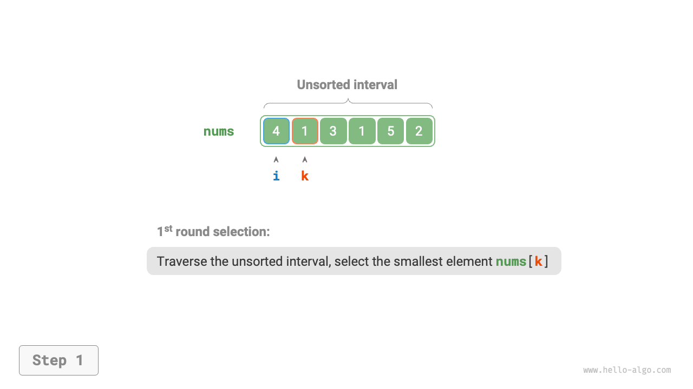{ class="animation-figure" }

=== "<2>"
    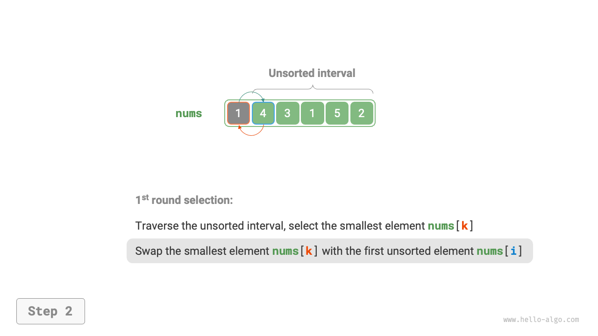{ class="animation-figure" }

=== "<3>"
    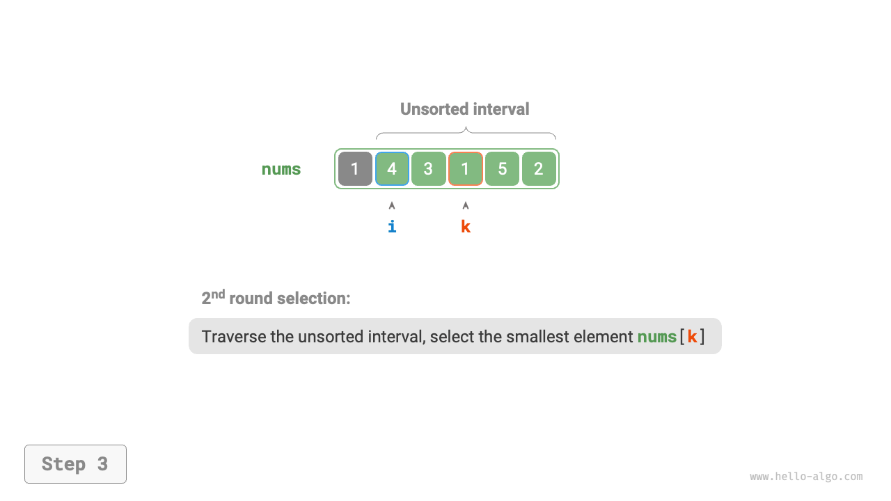{ class="animation-figure" }

=== "<4>"
    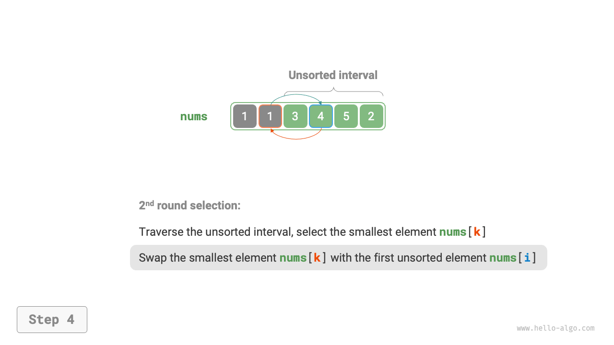{ class="animation-figure" }

=== "<5>"
    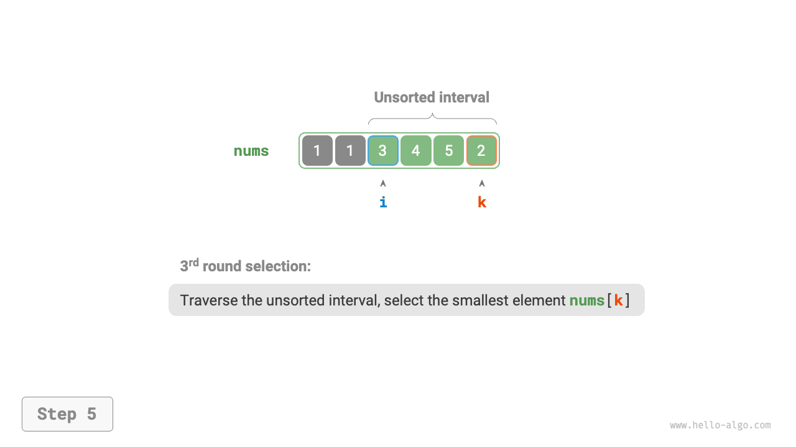{ class="animation-figure" }

=== "<6>"
    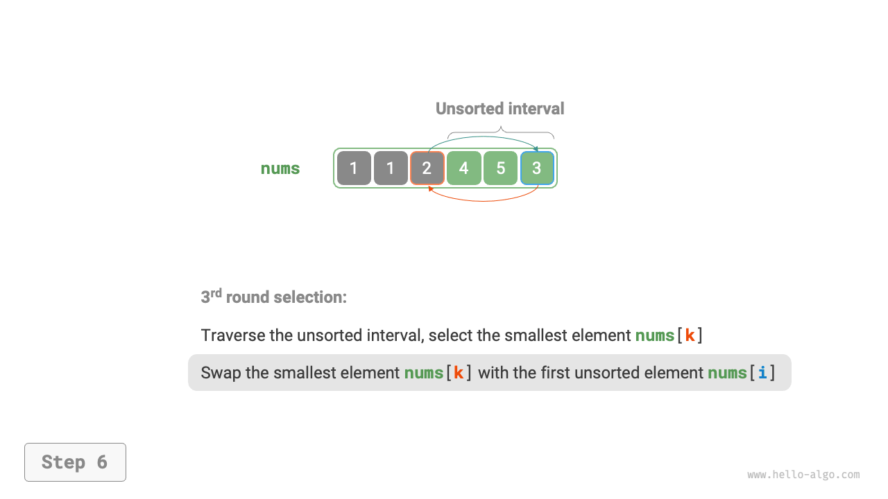{ class="animation-figure" }

=== "<7>"
    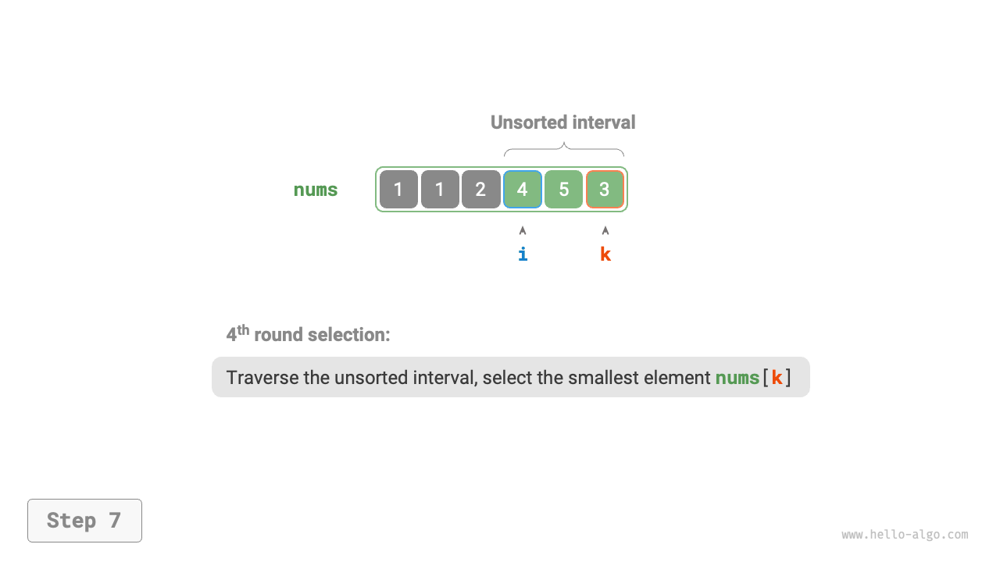{ class="animation-figure" }

=== "<8>"
    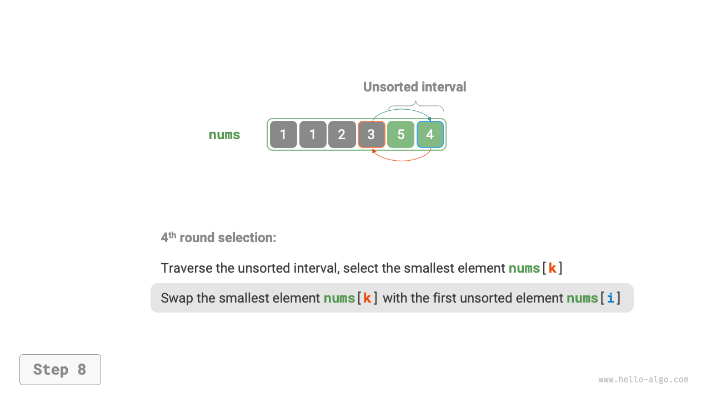{ class="animation-figure" }

=== "<9>"
    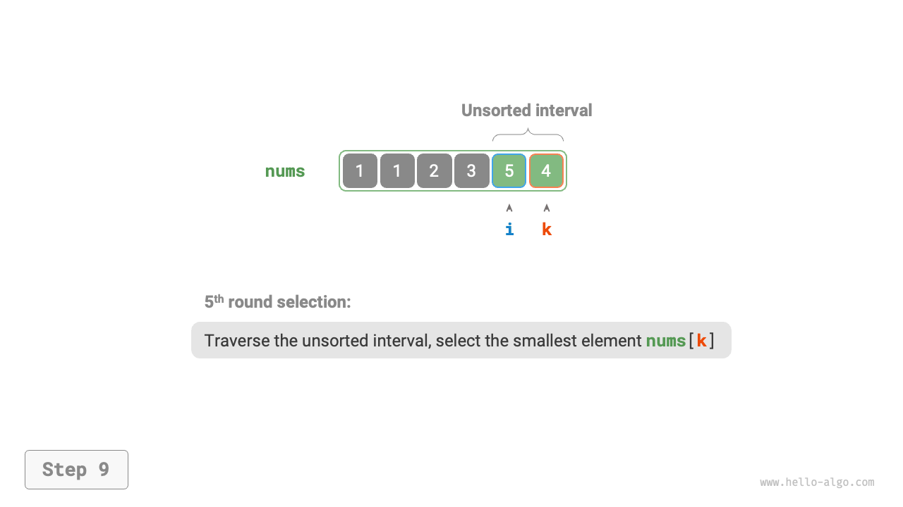{ class="animation-figure" }

=== "<10>"
    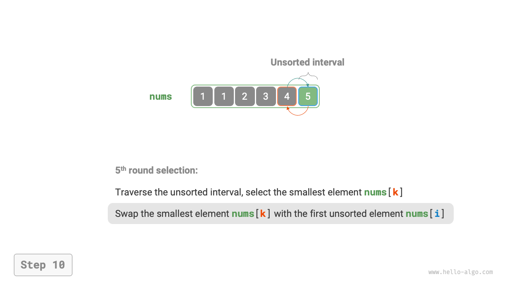{ class="animation-figure" }

=== "<11>"
    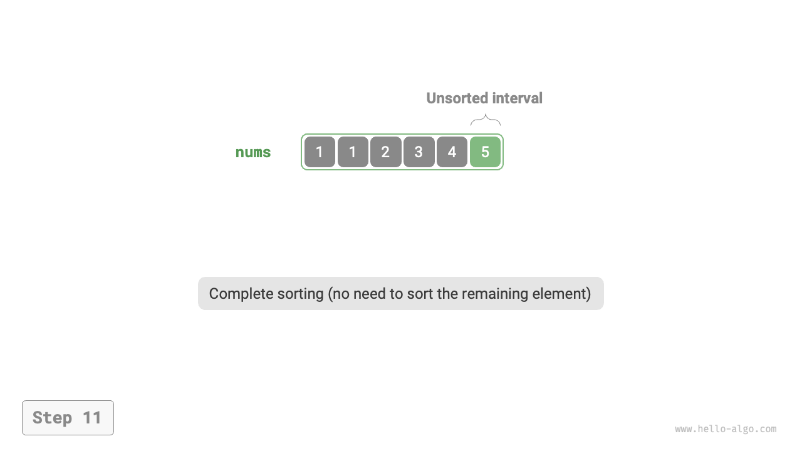{ class="animation-figure" }

<p align="center"> 図 11-2 &nbsp; 選択ソートの手順 </p>

コードでは、$k$ を用いて未ソート区間内の最小要素を記録します。

=== "Python"

    ```python title="selection_sort.py"
    def selection_sort(nums: list[int]):
        """選択ソート"""
        n = len(nums)
        # 外側ループ：未整列区間は [i, n-1]
        for i in range(n - 1):
            # 内側のループ：未ソート区間の最小要素を見つける
            k = i
            for j in range(i + 1, n):
                if nums[j] < nums[k]:
                    k = j  # 最小要素のインデックスを記録
            # その最小要素を未整列区間の先頭要素と交換する
            nums[i], nums[k] = nums[k], nums[i]
    ```

=== "C++"

    ```cpp title="selection_sort.cpp"
    /* 選択ソート */
    void selectionSort(vector<int> &nums) {
        int n = nums.size();
        // 外側ループ：未整列区間は [i, n-1]
        for (int i = 0; i < n - 1; i++) {
            // 内側のループ：未ソート区間の最小要素を見つける
            int k = i;
            for (int j = i + 1; j < n; j++) {
                if (nums[j] < nums[k])
                    k = j; // 最小要素のインデックスを記録
            }
            // その最小要素を未整列区間の先頭要素と交換する
            swap(nums[i], nums[k]);
        }
    }
    ```

=== "Java"

    ```java title="selection_sort.java"
    /* 選択ソート */
    void selectionSort(int[] nums) {
        int n = nums.length;
        // 外側ループ：未整列区間は [i, n-1]
        for (int i = 0; i < n - 1; i++) {
            // 内側のループ：未ソート区間の最小要素を見つける
            int k = i;
            for (int j = i + 1; j < n; j++) {
                if (nums[j] < nums[k])
                    k = j; // 最小要素のインデックスを記録
            }
            // その最小要素を未整列区間の先頭要素と交換する
            int temp = nums[i];
            nums[i] = nums[k];
            nums[k] = temp;
        }
    }
    ```

=== "C#"

    ```csharp title="selection_sort.cs"
    /* 選択ソート */
    void SelectionSort(int[] nums) {
        int n = nums.Length;
        // 外側ループ：未整列区間は [i, n-1]
        for (int i = 0; i < n - 1; i++) {
            // 内側のループ：未ソート区間の最小要素を見つける
            int k = i;
            for (int j = i + 1; j < n; j++) {
                if (nums[j] < nums[k])
                    k = j; // 最小要素のインデックスを記録
            }
            // その最小要素を未整列区間の先頭要素と交換する
            (nums[k], nums[i]) = (nums[i], nums[k]);
        }
    }
    ```

=== "Go"

    ```go title="selection_sort.go"
    /* 選択ソート */
    func selectionSort(nums []int) {
        n := len(nums)
        // 外側ループ：未整列区間は [i, n-1]
        for i := 0; i < n-1; i++ {
            // 内側のループ：未ソート区間の最小要素を見つける
            k := i
            for j := i + 1; j < n; j++ {
                if nums[j] < nums[k] {
                    // 最小要素のインデックスを記録
                    k = j
                }
            }
            // その最小要素を未整列区間の先頭要素と交換する
            nums[i], nums[k] = nums[k], nums[i]

        }
    }
    ```

=== "Swift"

    ```swift title="selection_sort.swift"
    /* 選択ソート */
    func selectionSort(nums: inout [Int]) {
        // 外側ループ：未整列区間は [i, n-1]
        for i in nums.indices.dropLast() {
            // 内側のループ：未ソート区間の最小要素を見つける
            var k = i
            for j in nums.indices.dropFirst(i + 1) {
                if nums[j] < nums[k] {
                    k = j // 最小要素のインデックスを記録
                }
            }
            // その最小要素を未整列区間の先頭要素と交換する
            nums.swapAt(i, k)
        }
    }
    ```

=== "JS"

    ```javascript title="selection_sort.js"
    /* 選択ソート */
    function selectionSort(nums) {
        let n = nums.length;
        // 外側ループ：未整列区間は [i, n-1]
        for (let i = 0; i < n - 1; i++) {
            // 内側のループ：未ソート区間の最小要素を見つける
            let k = i;
            for (let j = i + 1; j < n; j++) {
                if (nums[j] < nums[k]) {
                    k = j; // 最小要素のインデックスを記録
                }
            }
            // その最小要素を未整列区間の先頭要素と交換する
            [nums[i], nums[k]] = [nums[k], nums[i]];
        }
    }
    ```

=== "TS"

    ```typescript title="selection_sort.ts"
    /* 選択ソート */
    function selectionSort(nums: number[]): void {
        let n = nums.length;
        // 外側ループ：未整列区間は [i, n-1]
        for (let i = 0; i < n - 1; i++) {
            // 内側のループ：未ソート区間の最小要素を見つける
            let k = i;
            for (let j = i + 1; j < n; j++) {
                if (nums[j] < nums[k]) {
                    k = j; // 最小要素のインデックスを記録
                }
            }
            // その最小要素を未整列区間の先頭要素と交換する
            [nums[i], nums[k]] = [nums[k], nums[i]];
        }
    }
    ```

=== "Dart"

    ```dart title="selection_sort.dart"
    /* 選択ソート */
    void selectionSort(List<int> nums) {
      int n = nums.length;
      // 外側ループ：未整列区間は [i, n-1]
      for (int i = 0; i < n - 1; i++) {
        // 内側のループ：未ソート区間の最小要素を見つける
        int k = i;
        for (int j = i + 1; j < n; j++) {
          if (nums[j] < nums[k]) k = j; // 最小要素のインデックスを記録
        }
        // その最小要素を未整列区間の先頭要素と交換する
        int temp = nums[i];
        nums[i] = nums[k];
        nums[k] = temp;
      }
    }
    ```

=== "Rust"

    ```rust title="selection_sort.rs"
    /* 選択ソート */
    fn selection_sort(nums: &mut [i32]) {
        if nums.is_empty() {
            return;
        }
        let n = nums.len();
        // 外側ループ：未整列区間は [i, n-1]
        for i in 0..n - 1 {
            // 内側のループ：未ソート区間の最小要素を見つける
            let mut k = i;
            for j in i + 1..n {
                if nums[j] < nums[k] {
                    k = j; // 最小要素のインデックスを記録
                }
            }
            // その最小要素を未整列区間の先頭要素と交換する
            nums.swap(i, k);
        }
    }
    ```

=== "C"

    ```c title="selection_sort.c"
    /* 選択ソート */
    void selectionSort(int nums[], int n) {
        // 外側ループ：未整列区間は [i, n-1]
        for (int i = 0; i < n - 1; i++) {
            // 内側のループ：未ソート区間の最小要素を見つける
            int k = i;
            for (int j = i + 1; j < n; j++) {
                if (nums[j] < nums[k])
                    k = j; // 最小要素のインデックスを記録
            }
            // その最小要素を未整列区間の先頭要素と交換する
            int temp = nums[i];
            nums[i] = nums[k];
            nums[k] = temp;
        }
    }
    ```

=== "Kotlin"

    ```kotlin title="selection_sort.kt"
    /* 選択ソート */
    fun selectionSort(nums: IntArray) {
        val n = nums.size
        // 外側ループ：未整列区間は [i, n-1]
        for (i in 0..<n - 1) {
            var k = i
            // 内側のループ：未ソート区間の最小要素を見つける
            for (j in i + 1..<n) {
                if (nums[j] < nums[k])
                    k = j // 最小要素のインデックスを記録
            }
            // その最小要素を未整列区間の先頭要素と交換する
            val temp = nums[i]
            nums[i] = nums[k]
            nums[k] = temp
        }
    }
    ```

=== "Ruby"

    ```ruby title="selection_sort.rb"
    ### 選択ソート ###
    def selection_sort(nums)
      n = nums.length
      # 外側ループ：未整列区間は [i, n-1]
      for i in 0...(n - 1)
        # 内側のループ：未ソート区間の最小要素を見つける
        k = i
        for j in (i + 1)...n
          if nums[j] < nums[k]
            k = j # 最小要素のインデックスを記録
          end
        end
        # その最小要素を未整列区間の先頭要素と交換する
        nums[i], nums[k] = nums[k], nums[i]
      end
    end
    ```

??? pythontutor "コードの可視化"

    <div style="height: 513px; width: 100%;"><iframe class="pythontutor-iframe" src="https://pythontutor.com/iframe-embed.html#code=def%20selection_sort%28nums%3A%20list%5Bint%5D%29%3A%0A%20%20%20%20%22%22%22%E9%81%B8%E6%8A%9E%E3%82%BD%E3%83%BC%E3%83%88%22%22%22%0A%20%20%20%20n%20%3D%20len%28nums%29%0A%20%20%20%20%23%20%E5%A4%96%E5%81%B4%E3%83%AB%E3%83%BC%E3%83%97%EF%BC%9A%E6%9C%AA%E6%95%B4%E5%88%97%E5%8C%BA%E9%96%93%E3%81%AF%20%5Bi%2C%20n-1%5D%0A%20%20%20%20for%20i%20in%20range%28n%20-%201%29%3A%0A%20%20%20%20%20%20%20%20%23%20%E5%86%85%E5%81%B4%E3%81%AE%E3%83%AB%E3%83%BC%E3%83%97%EF%BC%9A%E6%9C%AA%E3%82%BD%E3%83%BC%E3%83%88%E5%8C%BA%E9%96%93%E3%81%AE%E6%9C%80%E5%B0%8F%E8%A6%81%E7%B4%A0%E3%82%92%E8%A6%8B%E3%81%A4%E3%81%91%E3%82%8B%0A%20%20%20%20%20%20%20%20k%20%3D%20i%0A%20%20%20%20%20%20%20%20for%20j%20in%20range%28i%20%2B%201%2C%20n%29%3A%0A%20%20%20%20%20%20%20%20%20%20%20%20if%20nums%5Bj%5D%20%3C%20nums%5Bk%5D%3A%0A%20%20%20%20%20%20%20%20%20%20%20%20%20%20%20%20k%20%3D%20j%20%20%23%20%E6%9C%80%E5%B0%8F%E8%A6%81%E7%B4%A0%E3%81%AE%E3%82%A4%E3%83%B3%E3%83%87%E3%83%83%E3%82%AF%E3%82%B9%E3%82%92%E8%A8%98%E9%8C%B2%0A%20%20%20%20%20%20%20%20%23%20%E3%81%9D%E3%81%AE%E6%9C%80%E5%B0%8F%E8%A6%81%E7%B4%A0%E3%82%92%E6%9C%AA%E6%95%B4%E5%88%97%E5%8C%BA%E9%96%93%E3%81%AE%E5%85%88%E9%A0%AD%E8%A6%81%E7%B4%A0%E3%81%A8%E4%BA%A4%E6%8F%9B%E3%81%99%E3%82%8B%0A%20%20%20%20%20%20%20%20nums%5Bi%5D%2C%20nums%5Bk%5D%20%3D%20nums%5Bk%5D%2C%20nums%5Bi%5D%0A%0A%0Aif%20__name__%20%3D%3D%20%22__main__%22%3A%0A%20%20%20%20nums%20%3D%20%5B4%2C%201%2C%203%2C%201%2C%205%2C%202%5D%0A%20%20%20%20selection_sort%28nums%29%0A%20%20%20%20print%28%22%E9%81%B8%E6%8A%9E%E3%82%BD%E3%83%BC%E3%83%88%E5%AE%8C%E4%BA%86%E5%BE%8C%20nums%20%3D%22%2C%20nums%29&codeDivHeight=472&codeDivWidth=350&cumulative=false&curInstr=4&heapPrimitives=nevernest&origin=opt-frontend.js&py=311&rawInputLstJSON=%5B%5D&textReferences=false"> </iframe></div>
    <div style="margin-top: 5px;"><a href="https://pythontutor.com/iframe-embed.html#code=def%20selection_sort%28nums%3A%20list%5Bint%5D%29%3A%0A%20%20%20%20%22%22%22%E9%81%B8%E6%8A%9E%E3%82%BD%E3%83%BC%E3%83%88%22%22%22%0A%20%20%20%20n%20%3D%20len%28nums%29%0A%20%20%20%20%23%20%E5%A4%96%E5%81%B4%E3%83%AB%E3%83%BC%E3%83%97%EF%BC%9A%E6%9C%AA%E6%95%B4%E5%88%97%E5%8C%BA%E9%96%93%E3%81%AF%20%5Bi%2C%20n-1%5D%0A%20%20%20%20for%20i%20in%20range%28n%20-%201%29%3A%0A%20%20%20%20%20%20%20%20%23%20%E5%86%85%E5%81%B4%E3%81%AE%E3%83%AB%E3%83%BC%E3%83%97%EF%BC%9A%E6%9C%AA%E3%82%BD%E3%83%BC%E3%83%88%E5%8C%BA%E9%96%93%E3%81%AE%E6%9C%80%E5%B0%8F%E8%A6%81%E7%B4%A0%E3%82%92%E8%A6%8B%E3%81%A4%E3%81%91%E3%82%8B%0A%20%20%20%20%20%20%20%20k%20%3D%20i%0A%20%20%20%20%20%20%20%20for%20j%20in%20range%28i%20%2B%201%2C%20n%29%3A%0A%20%20%20%20%20%20%20%20%20%20%20%20if%20nums%5Bj%5D%20%3C%20nums%5Bk%5D%3A%0A%20%20%20%20%20%20%20%20%20%20%20%20%20%20%20%20k%20%3D%20j%20%20%23%20%E6%9C%80%E5%B0%8F%E8%A6%81%E7%B4%A0%E3%81%AE%E3%82%A4%E3%83%B3%E3%83%87%E3%83%83%E3%82%AF%E3%82%B9%E3%82%92%E8%A8%98%E9%8C%B2%0A%20%20%20%20%20%20%20%20%23%20%E3%81%9D%E3%81%AE%E6%9C%80%E5%B0%8F%E8%A6%81%E7%B4%A0%E3%82%92%E6%9C%AA%E6%95%B4%E5%88%97%E5%8C%BA%E9%96%93%E3%81%AE%E5%85%88%E9%A0%AD%E8%A6%81%E7%B4%A0%E3%81%A8%E4%BA%A4%E6%8F%9B%E3%81%99%E3%82%8B%0A%20%20%20%20%20%20%20%20nums%5Bi%5D%2C%20nums%5Bk%5D%20%3D%20nums%5Bk%5D%2C%20nums%5Bi%5D%0A%0A%0Aif%20__name__%20%3D%3D%20%22__main__%22%3A%0A%20%20%20%20nums%20%3D%20%5B4%2C%201%2C%203%2C%201%2C%205%2C%202%5D%0A%20%20%20%20selection_sort%28nums%29%0A%20%20%20%20print%28%22%E9%81%B8%E6%8A%9E%E3%82%BD%E3%83%BC%E3%83%88%E5%AE%8C%E4%BA%86%E5%BE%8C%20nums%20%3D%22%2C%20nums%29&codeDivHeight=800&codeDivWidth=600&cumulative=false&curInstr=4&heapPrimitives=nevernest&origin=opt-frontend.js&py=311&rawInputLstJSON=%5B%5D&textReferences=false" target="_blank" rel="noopener noreferrer">全画面で見る ></a></div>

## 11.2.1 &nbsp; アルゴリズムの特徴

- **時間計算量は $O(n^2)$、非適応ソート**：外側のループは合計 $n - 1$ 回です。最初のラウンドの未ソート区間の長さは $n$、最後のラウンドでは $2$ であり、各ラウンドの内側のループ回数はそれぞれ $n$、$n - 1$、$\dots$、$3$、$2$ となります。総和は $\frac{(n - 1)(n + 2)}{2}$ です。
- **空間計算量は $O(1)$、インプレースソート**：ポインタ $i$ と $j$ は定数サイズの追加領域しか使用しません。
- **不安定ソート**：次の図のように、要素 `nums[i]` がそれと等しい要素の右側へ交換され、両者の相対的な順序が変わる可能性があります。

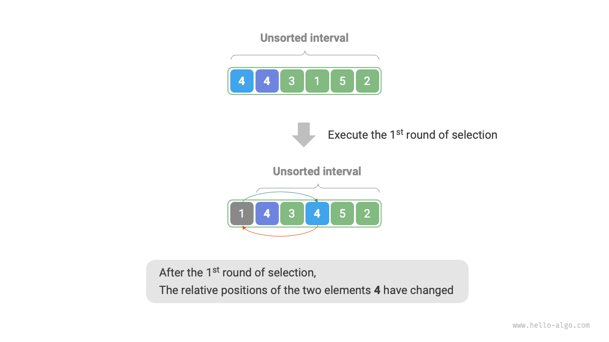{ class="animation-figure" }

<p align="center"> 図 11-3 &nbsp; 選択ソートの不安定な例 </p>
