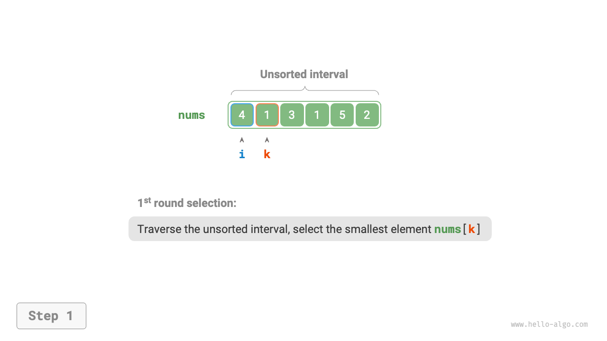
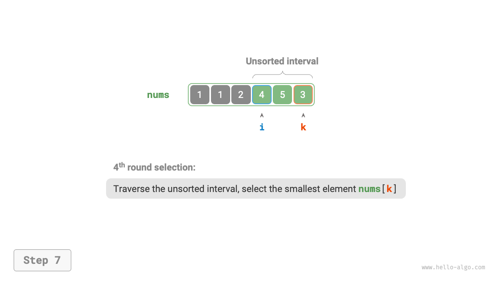

# 選択ソート

<u>選択ソート</u>は非常にシンプルな原理で動作します：各反復で未ソート区間から最小要素を選択し、ソート済みセクションの末尾に移動するループを使用します。

配列の長さを$n$とすると、選択ソートのステップは下図に示されます。

1. 最初に、すべての要素は未ソートで、つまり未ソート（インデックス）区間は$[0, n-1]$です。
2. 区間$[0, n-1]$の最小要素を選択し、インデックス$0$の要素と交換します。この後、配列の最初の要素がソートされます。
3. 区間$[1, n-1]$の最小要素を選択し、インデックス$1$の要素と交換します。この後、配列の最初の2つの要素がソートされます。
4. この方法で続行します。$n - 1$ラウンドの選択と交換の後、最初の$n - 1$個の要素がソートされます。
5. 残りの唯一の要素は結果的に最大要素であり、ソートする必要がないため、配列はソートされます。

=== "<1>"
    

=== "<2>"
    

=== "<3>"
    

=== "<4>"
    

=== "<5>"
    

=== "<6>"
    

=== "<7>"
    

=== "<8>"
    

=== "<9>"
    

=== "<10>"
    

=== "<11>"
    

コードでは、$k$を使用して未ソート区間内の最小要素を記録します：

```src
[file]{selection_sort}-[class]{}-[func]{selection_sort}
```

## アルゴリズムの特性

- **$O(n^2)$の時間計算量、非適応ソート**：外側ループに$n - 1$回の反復があり、未ソートセクションの長さは最初の反復で$n$から始まり、最後の反復で$2$まで減少します。つまり、各外側ループ反復にはそれぞれ$n$、$n - 1$、$\dots$、$3$、$2$回の内側ループ反復が含まれ、合計は$\frac{(n - 1)(n + 2)}{2}$となります。
- **$O(1)$の空間計算量、インプレースソート**：ポインタ$i$と$j$で定数の追加空間を使用します。
- **非安定ソート**：下図に示すように、要素`nums[i]`は等しい要素の右側に交換される可能性があり、相対順序が変わる原因となります。


