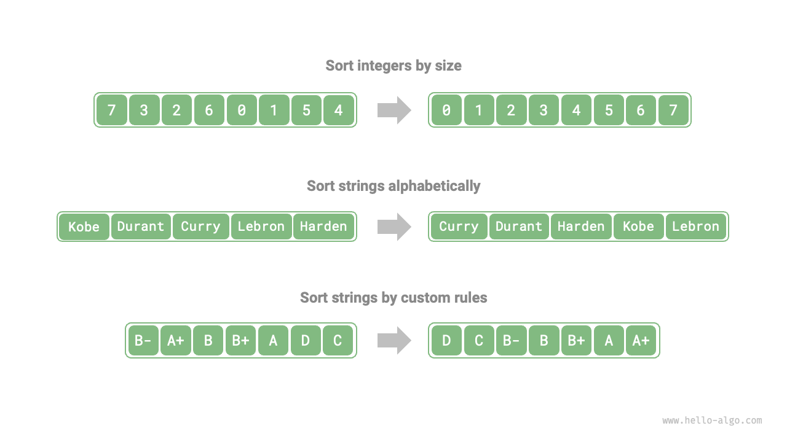

# ソートアルゴリズム

<u>ソートアルゴリズム（sorting algorithm）</u>は、データの集合を特定の順序に従って並べ替えるために用いられます。ソートアルゴリズムは幅広く応用されており、整列済みデータは通常、より効率的に検索、分析、処理できるためです。

下図に示すように、ソートアルゴリズムにおけるデータ型は整数、浮動小数点数、文字、文字列などです。ソートの判定規則は、数値の大小、文字の ASCII コード順、またはカスタムルールなど、要件に応じて設定できます。



## 評価軸

**実行効率**：ソートアルゴリズムの時間計算量はできるだけ低く、かつ全体の操作回数も少ないこと（時間計算量における定数項が小さいこと）が望まれます。大量データの場合、実行効率はとりわけ重要です。

**インプレース性**：その名のとおり、<u>インプレースソート</u>は元の配列を直接操作して並べ替えを行うため、追加の補助配列を必要とせず、メモリを節約できます。通常、インプレースソートはデータの移動操作が少なく、実行速度もより高速です。

**安定性**：<u>安定ソート</u>は、並べ替え完了後も、等しい要素の配列内での相対順序が変化しません。

安定ソートは多段ソートの場面で必要条件となります。学生情報を保存した表があり、第 1 列と第 2 列がそれぞれ氏名と年齢であると仮定します。この場合、<u>不安定ソート</u>によって入力データの順序性が失われる可能性があります。

```shell
# 入力データは氏名順にソートされている
# (name, age)
  ('A', 19)
  ('B', 18)
  ('C', 21)
  ('D', 19)
  ('E', 23)

# 不安定ソートアルゴリズムで年齢順にリストを並べ替えると仮定すると、
# 結果では ('D', 19) と ('A', 19) の相対位置が変わり、
# 入力データが氏名順である性質が失われる
  ('B', 18)
  ('D', 19)
  ('A', 19)
  ('C', 21)
  ('E', 23)
```

**適応性**：<u>適応的ソート</u>は、入力データに既に存在する順序情報を利用して計算量を減らし、より優れた時間効率を実現できます。適応的ソートアルゴリズムの最良時間計算量は、通常、平均時間計算量より優れています。

**比較ベースかどうか**：<u>比較ベースのソート</u>は、比較演算子（$<$、$=$、$>$）に依存して要素の相対順序を判定し、それによって配列全体をソートします。理論上の最良時間計算量は $O(n \log n)$ です。一方、<u>非比較ソート</u>は比較演算子を使用せず、時間計算量は $O(n)$ に達しますが、汎用性は相対的に低くなります。

## 理想的なソートアルゴリズム

**高速、インプレース、安定、適応的、高い汎用性**。明らかに、これまでのところ、以上のすべての特性を兼ね備えたソートアルゴリズムはまだ見つかっていません。そのため、ソートアルゴリズムを選択する際には、具体的なデータの特徴と問題の要件に応じて判断する必要があります。

次に、さまざまなソートアルゴリズムを一緒に学び、上記の評価軸に基づいて各ソートアルゴリズムの長所と短所を分析していきます。
