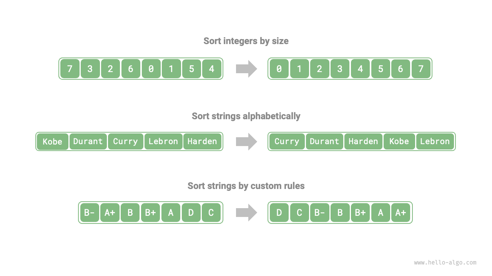

# ソートアルゴリズム

<u>ソートアルゴリズム</u>は、データセットを特定の順序で配列するために使用されます。ソートアルゴリズムは、順序付けられたデータは通常、より効率的に探索、分析、処理できるため、幅広い応用があります。

下図に示すように、ソートアルゴリズムのデータ型は整数、浮動小数点数、文字、文字列などです。ソート基準は、数値サイズ、文字ASCII順序、またはカスタム基準など、必要に応じて設定できます。



## 評価次元

**実行効率**：ソートアルゴリズムの時間計算量ができるだけ低いことを期待し、全体的な操作数も少ないこと（時間計算量の定数項を下げる）を望みます。大容量データでは、実行効率が特に重要です。

**インプレース性**：名前が示すとおり、<u>インプレースソート</u>は元の配列を直接操作することで実現され、追加のヘルパー配列が不要であるため、メモリを節約します。一般的に、インプレースソートはデータ移動操作が少なく、高速です。

**安定性**：<u>安定ソート</u>は、ソート後に配列内の等しい要素の相対順序が変わらないことを保証します。

安定ソートは、マルチキーソートシナリオにおいて必要条件です。学生情報を格納するテーブルがあり、第1列と第2列がそれぞれ名前と年齢であるとします。この場合、<u>不安定ソート</u>は入力データの順序を失う可能性があります：

```shell
# 入力データは名前でソート済み
# (名前, 年齢)
  ('A', 19)
  ('B', 18)
  ('C', 21)
  ('D', 19)
  ('E', 23)

# 不安定ソートアルゴリズムを使用してリストを年齢でソートすると仮定すると、
# 結果は('D', 19)と('A', 19)の相対位置を変更し、
# 入力データが名前でソート済みであるという性質が失われる
  ('B', 18)
  ('D', 19)
  ('A', 19)
  ('C', 21)
  ('E', 23)
```

**適応性**：<u>適応ソート</u>は入力データ内の既存の順序情報を活用して計算負荷を削減し、より最適な時間効率を実現します。適応ソートアルゴリズムの最良ケース時間計算量は、通常平均ケース時間計算量よりも優れています。

**比較ベースまたは非比較ベース**：<u>比較ベースソート</u>は比較演算子（$<$、$=$、$>$）に依存して要素の相対順序を決定し、配列全体をソートします。理論的最適時間計算量は$O(n \log n)$です。一方、<u>非比較ソート</u>は比較演算子を使用せず、$O(n)$の時間計算量を実現できますが、汎用性は比較的劣ります。

## 理想的なソートアルゴリズム

**高速実行、インプレース、安定、適応、汎用**。明らかに、これらのすべての特徴を組み合わせたソートアルゴリズムは今日まで見つかっていません。したがって、ソートアルゴリズムを選択する際は、データの特定の特徴と問題の要件に基づいて決定する必要があります。

次に、さまざまなソートアルゴリズムを一緒に学び、上記の評価次元に基づいてそれぞれの利点と欠点を分析します。
