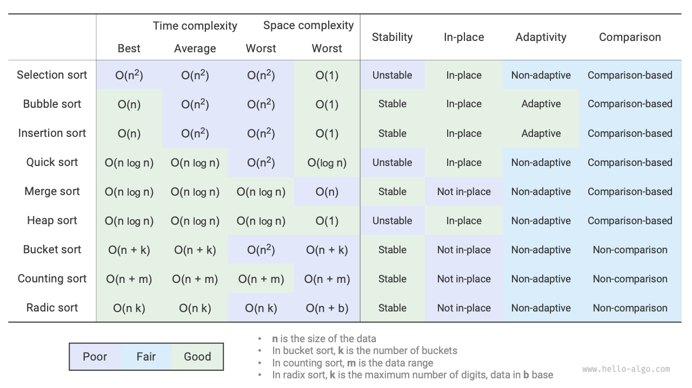

# まとめ

### 重要な復習

- バブルソートは隣接する要素を交換することで動作します。フラグを追加して早期リターンを可能にすることで、バブルソートの最良ケースの時間計算量を $O(n)$ に最適化できます。
- 挿入ソートは、未ソート区間から要素を取り出してソート済み区間の正しい位置に挿入することで各ラウンドをソートします。挿入ソートの時間計算量は $O(n^2)$ ですが、単位あたりの操作が比較的少ないため、少量のデータのソートでは非常に人気があります。
- クイックソートは歩哨分割操作に基づいています。歩哨分割では、常に最悪のピボットを選ぶ可能性があり、時間計算量が $O(n^2)$ に劣化する可能性があります。中央値やランダムピボットを導入することで、そのような劣化の確率を減らすことができます。末尾再帰は再帰の深さを効果的に減らし、空間計算量を $O(\log n)$ に最適化します。
- マージソートには分割とマージの2つの段階があり、通常分割統治戦略を体現しています。マージソートでは、配列のソートには補助配列の作成が必要で、空間計算量は $O(n)$ になります。しかし、リストのソートの空間計算量は $O(1)$ に最適化できます。
- バケットソートは3つの手順から構成されます：データをバケットに分散、各バケット内でのソート、バケット順での結果のマージ。これも分割統治戦略を体現し、非常に大きなデータセットに適しています。バケットソートの鍵はデータの均等分散です。
- 計数ソートはバケットソートの変形で、各データポイントの出現回数をカウントすることでソートします。計数ソートは限られた範囲のデータを持つ大きなデータセットに適しており、データを正の整数に変換する必要があります。
- 基数ソートは桁ごとにソートすることでデータを処理し、データが固定長の数値として表現される必要があります。
- 全体的に、私たちは高効率、安定性、インプレース操作、適応性を持つソートアルゴリズムを求めています。しかし、他のデータ構造やアルゴリズムと同様に、これらすべての条件を同時に満たすソートアルゴリズムは存在しません。実際の応用では、データの特性に基づいて適切なソートアルゴリズムを選択する必要があります。
- 以下の図は、効率性、安定性、インプレース性、適応性の観点から主流のソートアルゴリズムを比較しています。

### Q & A

**Q**: ソートアルゴリズムの安定性はいつ必要ですか？

実際には、オブジェクトの一つの属性に基づいてソートする場合があります。例えば、学生は名前と身長の属性を持ち、多段階ソートを実装することを目指します：最初に名前で `(A, 180) (B, 185) (C, 170) (D, 170)` を取得し、次に身長で。ソートアルゴリズムが不安定なため、`(D, 170) (C, 170) (A, 180) (B, 185)` になってしまう可能性があります。

学生DとCの位置が交換され、名前の順序性が破られているのが分かります。これは望ましくありません。

**Q**: 歩哨分割での「右から左への検索」と「左から右への検索」の順序を交換できますか？

いいえ、最左要素をピボットとして使用する場合、最初に「右から左への検索」を行い、次に「左から右への検索」を行う必要があります。この結論はやや直観に反するので、理由を分析してみましょう。

歩哨分割 `partition()` の最後のステップは `nums[left]` と `nums[i]` を交換することです。交換後、ピボットの左側の要素はすべてピボット以下になります。**これには最後の交換前に `nums[left] >= nums[i]` が成り立つ必要があります**。「左から右への検索」を最初に行い、ピボットより大きい要素が見つからない場合、**`i == j` でループを終了し、`nums[j] == nums[i] > nums[left]` となる可能性があります**。つまり、最終交換操作はピボットより大きい要素を配列の左端に交換し、歩哨分割を失敗させます。

例えば、配列 `[0, 0, 0, 0, 1]` が与えられた場合、最初に「左から右への検索」を行うと、歩哨分割後の配列は `[1, 0, 0, 0, 0]` となり、これは正しくありません。

さらに考えると、`nums[right]` をピボットとして選択する場合、まったく逆で、最初に「左から右への検索」を行う必要があります。

**Q**: 末尾再帰最適化について、短い配列を選択することで再帰の深さが $\log n$ を超えないことを保証するのはなぜですか？

再帰の深さは現在リターンしていない再帰メソッドの数です。歩哨分割の各ラウンドは元の配列を2つの副配列に分割します。末尾再帰最適化により、再帰的に続行する副配列の長さは最大でも元の配列長の半分です。最悪の場合常に長さを半分にすると仮定すると、最終的な再帰の深さは $\log n$ になります。

元のクイックソートを見直すと、より大きな配列を継続的に再帰処理する可能性があり、最悪の場合 $n$、$n - 1$、...、$2$、$1$ で、再帰の深さは $n$ になります。末尾再帰最適化はこのシナリオを回避できます。

**Q**: 配列のすべての要素が等しい場合、クイックソートの時間計算量は $O(n^2)$ ですか？この劣化ケースをどう処理すべきですか？

はい。この状況については、歩哨分割を使用して配列をピボットより小さい、等しい、大きいの3つの部分に分割することを検討してください。小さい部分と大きい部分のみを再帰的に進めます。この方法では、すべての入力要素が等しい配列を1ラウンドの歩哨分割だけでソートできます。

**Q**: なぜバケットソートの最悪ケース時間計算量は $O(n^2)$ ですか？

最悪の場合、すべての要素が同じバケットに配置されます。これらの要素をソートするために $O(n^2)$ アルゴリズムを使用する場合、時間計算量は $O(n^2)$ になります。
