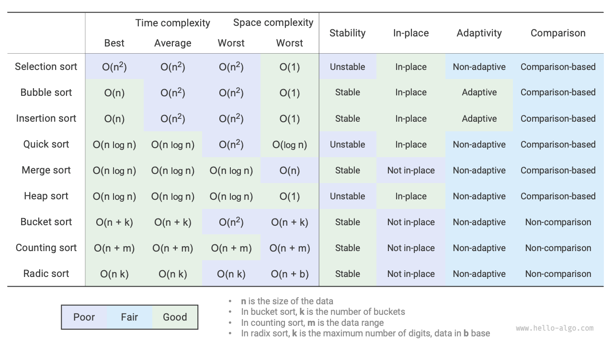

# まとめ

### 重要なポイントの振り返り

- バブルソートは隣接する要素を交換することで整列を行います。フラグを追加して早期リターンを可能にすると、バブルソートの最良時間計算量を $O(n)$ に最適化できます。
- 挿入ソートは各ラウンドで未整列区間の要素を整列済み区間の正しい位置に挿入することで整列を完了します。挿入ソートの時間計算量は $O(n^2)$ ですが、基本操作が比較的少ないため、小規模データのソート処理で非常に人気があります。
- クイックソートは番兵分割操作に基づいて整列を行います。番兵分割では毎回最悪の基準値を選んでしまう可能性があり、その結果、時間計算量は $O(n^2)$ まで劣化することがあります。中央値の基準値やランダムな基準値を導入すると、この劣化の確率を下げられます。短い部分配列を優先して再帰すれば、再帰の深さを効果的に抑え、空間計算量を $O(\log n)$ に最適化できます。
- マージソートは分割とマージという 2 つの段階からなり、分割統治戦略を典型的に体現しています。マージソートでは配列を整列する際に補助配列の作成が必要で、空間計算量は $O(n)$ です。一方、連結リストを整列する場合の空間計算量は $O(1)$ まで最適化できます。
- バケットソートはデータのバケット分配、バケット内ソート、結果の結合という 3 つの手順を含みます。これも分割統治戦略を体現しており、データ量が非常に大きい場合に適しています。バケットソートの鍵は、データを平均的に分配することにあります。
- カウントソートはバケットソートの特例であり、データの出現回数を数えることで整列を行います。カウントソートはデータ量が大きく、かつデータ範囲が限られている場合に適しており、データを正の整数に変換できることが前提です。
- 基数ソートは各桁ごとの整列によってデータを整列し、データが固定桁数の数値として表せることを前提とします。
- 総じて言えば、私たちは高効率で、安定で、インプレースで、さらに適応的であるといった利点を備えたソートアルゴリズムを見つけたいと考えます。しかし、ほかのデータ構造やアルゴリズムと同様に、これらすべての条件を同時に満たせるソートアルゴリズムは存在しません。実際の応用では、データの特性に応じて適切なソートアルゴリズムを選ぶ必要があります。
- 下図では、主流のソートアルゴリズムについて、効率、安定性、インプレース性、適応性などを比較しています。

### Q & A

**Q**：ソートアルゴリズムの安定性は、どのような場合に必須ですか？

現実には、オブジェクトのある属性に基づいて整列することがあります。たとえば、学生には氏名と身長という 2 つの属性があり、多段階のソートを行いたいとします。まず氏名で整列して `(A, 180) (B, 185) (C, 170) (D, 170)` を得て、その後に身長で整列します。ソートアルゴリズムが不安定である場合、結果は `(D, 170) (C, 170) (A, 180) (B, 185)` になる可能性があります。

このように、学生 D と C の位置が入れ替わり、氏名に関する順序性が壊れてしまいます。これは望ましくありません。

**Q**：番兵分割において、「右から左へ探索する」順序と「左から右へ探索する」順序は入れ替えられますか？

できません。最も左端の要素を基準値とする場合は、必ず先に「右から左へ探索する」を行い、その後に「左から右へ探索する」を行う必要があります。この結論はやや直感に反するので、理由を分析してみましょう。

番兵分割 `partition()` の最後の手順は、`nums[left]` と `nums[i]` を交換することです。交換が終わると、基準値の左側にある要素はすべて基準値 `<=` になります。**したがって、最後の交換の前に `nums[left] >= nums[i]` が必ず成り立っていなければなりません**。仮に先に「左から右へ探索する」を行うと、基準値より大きい要素が見つからない場合、**`i == j` の時点でループを抜け、このとき `nums[j] == nums[i] > nums[left]` となる可能性があります**。つまり、この最後の交換によって、基準値より大きい要素が配列の最左端へ移されてしまい、番兵分割は失敗します。

たとえば、配列 `[0, 0, 0, 0, 1]` が与えられたとき、先に「左から右へ探索する」を行うと、番兵分割後の配列は `[1, 0, 0, 0, 0]` になります。これは誤った結果です。

さらに考えると、`nums[right]` を基準値に選ぶ場合はちょうど逆になり、必ず先に「左から右へ探索する」を行う必要があります。

**Q**：クイックソートの再帰深度最適化について、短い配列を選ぶとなぜ再帰深度が $\log n$ を超えないと保証できるのですか？

再帰深度とは、現在まだ戻っていない再帰呼び出しの数のことです。各ラウンドの番兵分割では、元の配列を 2 つの部分配列に分けます。再帰深度の最適化後は、下方向に再帰する部分配列の長さは最大でも元の配列長の半分です。最悪の場合でも毎回半分の長さになると仮定すれば、最終的な再帰深度は $\log n$ になります。

元のクイックソートを振り返ると、長いほうの配列に対して連続して再帰してしまう可能性があり、最悪の場合は $n$、$n - 1$、$\dots$、$2$、$1$ と続き、再帰深度は $n$ になります。再帰深度の最適化により、このような状況を避けられます。

**Q**：配列内のすべての要素が等しい場合、クイックソートの時間計算量は $O(n^2)$ になりますか？このような退化はどう処理すべきですか？

はい。この場合は、番兵分割によって配列を「基準値より小さい」「基準値に等しい」「基準値より大きい」の 3 つの部分に分ける方法を検討できます。下方向に再帰するのは、小さい部分と大きい部分だけです。この方法では、入力要素がすべて等しい配列は、1 回の番兵分割だけで整列を完了できます。

**Q**：バケットソートの最悪時間計算量が $O(n^2)$ なのはなぜですか？

最悪の場合、すべての要素が同じバケットに振り分けられます。その要素群を整列するのに $O(n^2)$ のアルゴリズムを使えば、時間計算量は $O(n^2)$ になります。
