# 両端キュー

キューでは、先頭要素を削除するか末尾に要素を追加することしかできません。次の図に示すように、<u>両端キュー（double-ended queue）</u>はより高い柔軟性を備えており、先頭と末尾の両方で要素の追加や削除を行えます。

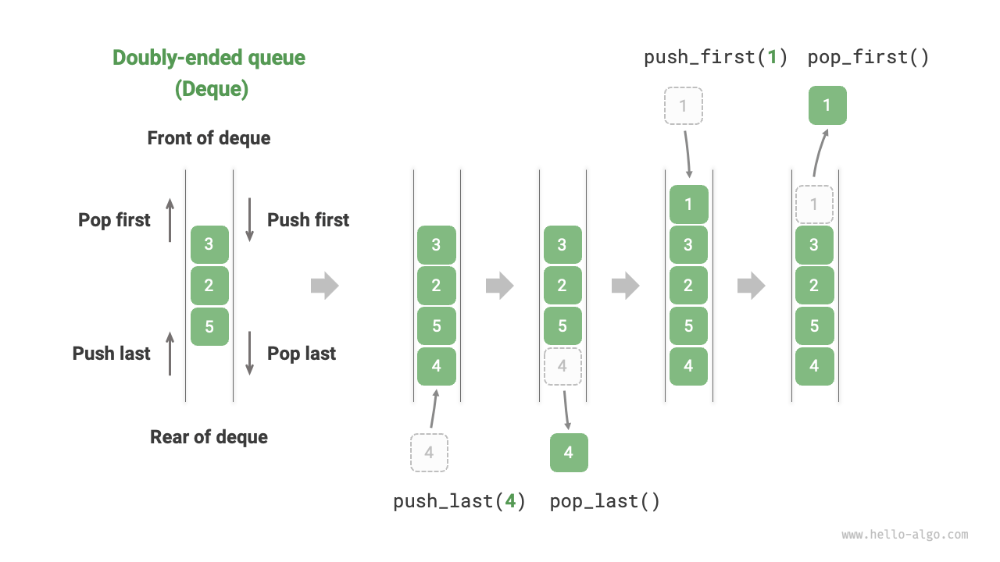

## 両端キューの基本操作

両端キューの基本操作を次の表に示します。具体的なメソッド名は、使用するプログラミング言語によって異なります。

<p align="center"> 表 <id> &nbsp; 両端キューの操作効率 </p>

| メソッド名     | 説明             | 時間計算量 |
| -------------- | ---------------- | ---------- |
| `push_first()` | 先頭に要素を追加 | $O(1)$     |
| `push_last()`  | 末尾に要素を追加 | $O(1)$     |
| `pop_first()`  | 先頭要素を削除   | $O(1)$     |
| `pop_last()`   | 末尾要素を削除   | $O(1)$     |
| `peek_first()` | 先頭要素にアクセス | $O(1)$     |
| `peek_last()`  | 末尾要素にアクセス | $O(1)$     |

同様に、プログラミング言語に組み込み実装されている両端キューのクラスを直接使うこともできます：

=== "Python"

    ```python title="deque.py"
    from collections import deque

    # 両端キューを初期化
    deq: deque[int] = deque()

    # 要素をエンキュー
    deq.append(2)      # 末尾に追加
    deq.append(5)
    deq.append(4)
    deq.appendleft(3)  # 先頭に追加
    deq.appendleft(1)

    # 要素にアクセス
    front: int = deq[0]  # 先頭要素
    rear: int = deq[-1]  # 末尾要素

    # 要素をデキュー
    pop_front: int = deq.popleft()  # 先頭要素をデキュー
    pop_rear: int = deq.pop()       # 末尾要素をデキュー

    # 両端キューの長さを取得
    size: int = len(deq)

    # 両端キューが空かどうかを判定
    is_empty: bool = len(deq) == 0
    ```

=== "C++"

    ```cpp title="deque.cpp"
    /* 両端キューを初期化 */
    deque<int> deque;

    /* 要素をエンキュー */
    deque.push_back(2);   // 末尾に追加
    deque.push_back(5);
    deque.push_back(4);
    deque.push_front(3);  // 先頭に追加
    deque.push_front(1);

    /* 要素にアクセス */
    int front = deque.front(); // 先頭要素
    int back = deque.back();   // 末尾要素

    /* 要素をデキュー */
    deque.pop_front();  // 先頭要素をデキュー
    deque.pop_back();   // 末尾要素をデキュー

    /* 両端キューの長さを取得 */
    int size = deque.size();

    /* 両端キューが空かどうかを判定 */
    bool empty = deque.empty();
    ```

=== "Java"

    ```java title="deque.java"
    /* 両端キューを初期化 */
    Deque<Integer> deque = new LinkedList<>();

    /* 要素をエンキュー */
    deque.offerLast(2);   // 末尾に追加
    deque.offerLast(5);
    deque.offerLast(4);
    deque.offerFirst(3);  // 先頭に追加
    deque.offerFirst(1);

    /* 要素にアクセス */
    int peekFirst = deque.peekFirst();  // 先頭要素
    int peekLast = deque.peekLast();    // 末尾要素

    /* 要素をデキュー */
    int popFirst = deque.pollFirst();  // 先頭要素をデキュー
    int popLast = deque.pollLast();    // 末尾要素をデキュー

    /* 両端キューの長さを取得 */
    int size = deque.size();

    /* 両端キューが空かどうかを判定 */
    boolean isEmpty = deque.isEmpty();
    ```

=== "C#"

    ```csharp title="deque.cs"
    /* 両端キューを初期化 */
    // C# では、連結リスト LinkedList を両端キューとして使用する
    LinkedList<int> deque = new();

    /* 要素をエンキュー */
    deque.AddLast(2);   // 末尾に追加
    deque.AddLast(5);
    deque.AddLast(4);
    deque.AddFirst(3);  // 先頭に追加
    deque.AddFirst(1);

    /* 要素にアクセス */
    int peekFirst = deque.First.Value;  // 先頭要素
    int peekLast = deque.Last.Value;    // 末尾要素

    /* 要素をデキュー */
    deque.RemoveFirst();  // 先頭要素をデキュー
    deque.RemoveLast();   // 末尾要素をデキュー

    /* 両端キューの長さを取得 */
    int size = deque.Count;

    /* 両端キューが空かどうかを判定 */
    bool isEmpty = deque.Count == 0;
    ```

=== "Go"

    ```go title="deque_test.go"
    /* 両端キューを初期化 */
    // Go では、list を両端キューとして使用する
    deque := list.New()

    /* 要素をエンキュー */
    deque.PushBack(2)      // 末尾に追加
    deque.PushBack(5)
    deque.PushBack(4)
    deque.PushFront(3)     // 先頭に追加
    deque.PushFront(1)

    /* 要素にアクセス */
    front := deque.Front() // 先頭要素
    rear := deque.Back()   // 末尾要素

    /* 要素をデキュー */
    deque.Remove(front)    // 先頭要素をデキュー
    deque.Remove(rear)     // 末尾要素をデキュー

    /* 両端キューの長さを取得 */
    size := deque.Len()

    /* 両端キューが空かどうかを判定 */
    isEmpty := deque.Len() == 0
    ```

=== "Swift"

    ```swift title="deque.swift"
    /* 両端キューを初期化 */
    // Swift には組み込みの両端キュークラスがないため、Array を両端キューとして使用する
    var deque: [Int] = []

    /* 要素をエンキュー */
    deque.append(2) // 末尾に追加
    deque.append(5)
    deque.append(4)
    deque.insert(3, at: 0) // 先頭に追加
    deque.insert(1, at: 0)

    /* 要素にアクセス */
    let peekFirst = deque.first! // 先頭要素
    let peekLast = deque.last! // 末尾要素

    /* 要素をデキュー */
    // Array で模擬する場合、popFirst の計算量は O(n)
    let popFirst = deque.removeFirst() // 先頭要素をデキュー
    let popLast = deque.removeLast() // 末尾要素をデキュー

    /* 両端キューの長さを取得 */
    let size = deque.count

    /* 両端キューが空かどうかを判定 */
    let isEmpty = deque.isEmpty
    ```

=== "JS"

    ```javascript title="deque.js"
    /* 両端キューを初期化 */
    // JavaScript には組み込みの両端キューがないため、Array を両端キューとして使用するしかない
    const deque = [];

    /* 要素をエンキュー */
    deque.push(2);
    deque.push(5);
    deque.push(4);
    // 配列であるため、unshift() メソッドの時間計算量は O(n) です
    deque.unshift(3);
    deque.unshift(1);

    /* 要素にアクセス */
    const peekFirst = deque[0];
    const peekLast = deque[deque.length - 1];

    /* 要素をデキュー */
    // 配列であるため、shift() メソッドの時間計算量は O(n) です
    const popFront = deque.shift();
    const popBack = deque.pop();

    /* 両端キューの長さを取得 */
    const size = deque.length;

    /* 両端キューが空かどうかを判定 */
    const isEmpty = size === 0;
    ```

=== "TS"

    ```typescript title="deque.ts"
    /* 両端キューを初期化 */
    // TypeScript には組み込みの両端キューがないため、Array を両端キューとして使用するしかない
    const deque: number[] = [];

    /* 要素をエンキュー */
    deque.push(2);
    deque.push(5);
    deque.push(4);
    // 配列であるため、unshift() メソッドの時間計算量は O(n) です
    deque.unshift(3);
    deque.unshift(1);

    /* 要素にアクセス */
    const peekFirst: number = deque[0];
    const peekLast: number = deque[deque.length - 1];

    /* 要素をデキュー */
    // 配列であるため、shift() メソッドの時間計算量は O(n) です
    const popFront: number = deque.shift() as number;
    const popBack: number = deque.pop() as number;

    /* 両端キューの長さを取得 */
    const size: number = deque.length;

    /* 両端キューが空かどうかを判定 */
    const isEmpty: boolean = size === 0;
    ```

=== "Dart"

    ```dart title="deque.dart"
    /* 両端キューを初期化 */
    // Dart では、Queue は両端キューとして定義されています
    Queue<int> deque = Queue<int>();

    /* 要素をエンキュー */
    deque.addLast(2);  // 末尾に追加
    deque.addLast(5);
    deque.addLast(4);
    deque.addFirst(3); // 先頭に追加
    deque.addFirst(1);

    /* 要素にアクセス */
    int peekFirst = deque.first; // 先頭要素
    int peekLast = deque.last;   // 末尾要素

    /* 要素をデキュー */
    int popFirst = deque.removeFirst(); // 先頭要素をデキュー
    int popLast = deque.removeLast();   // 末尾要素をデキュー

    /* 両端キューの長さを取得 */
    int size = deque.length;

    /* 両端キューが空かどうかを判定 */
    bool isEmpty = deque.isEmpty;
    ```

=== "Rust"

    ```rust title="deque.rs"
    /* 両端キューを初期化 */
    let mut deque: VecDeque<u32> = VecDeque::new();

    /* 要素をエンキュー */
    deque.push_back(2);  // 末尾に追加
    deque.push_back(5);
    deque.push_back(4);
    deque.push_front(3); // 先頭に追加
    deque.push_front(1);

    /* 要素にアクセス */
    if let Some(front) = deque.front() { // 先頭要素
    }
    if let Some(rear) = deque.back() {   // 末尾要素
    }

    /* 要素をデキュー */
    if let Some(pop_front) = deque.pop_front() { // 先頭要素をデキュー
    }
    if let Some(pop_rear) = deque.pop_back() {   // 末尾要素をデキュー
    }

    /* 両端キューの長さを取得 */
    let size = deque.len();

    /* 両端キューが空かどうかを判定 */
    let is_empty = deque.is_empty();
    ```

=== "C"

    ```c title="deque.c"
    // C には組み込みの両端キューがありません
    ```

=== "Kotlin"

    ```kotlin title="deque.kt"
    /* 両端キューを初期化 */
    val deque = LinkedList<Int>()

    /* 要素をエンキュー */
    deque.offerLast(2)  // 末尾に追加
    deque.offerLast(5)
    deque.offerLast(4)
    deque.offerFirst(3) // 先頭に追加
    deque.offerFirst(1)

    /* 要素にアクセス */
    val peekFirst = deque.peekFirst() // 先頭要素
    val peekLast = deque.peekLast()   // 末尾要素

    /* 要素をデキュー */
    val popFirst = deque.pollFirst() // 先頭要素をデキュー
    val popLast = deque.pollLast()   // 末尾要素をデキュー

    /* 両端キューの長さを取得 */
    val size = deque.size

    /* 両端キューが空かどうかを判定 */
    val isEmpty = deque.isEmpty()
    ```

=== "Ruby"

    ```ruby title="deque.rb"
    # 両端キューを初期化
    # Ruby には組み込みの両端キューがないため、Array を両端キューとして使用するしかありません
    deque = []

    # 要素をエンキュー
    deque << 2
    deque << 5
    deque << 4
    # 配列であるため、Array#unshift メソッドの時間計算量は O(n) です
    deque.unshift(3)
    deque.unshift(1)

    # 要素にアクセス
    peek_first = deque.first
    peek_last = deque.last

    # 要素をデキュー
    # 配列であるため、 Array#shift メソッドの時間計算量は O(n) です
    pop_front = deque.shift
    pop_back = deque.pop

    # 両端キューの長さを取得
    size = deque.length

    # 両端キューが空かどうかを判定
    is_empty = size.zero?
    ```

??? pythontutor "実行の可視化"

    https://pythontutor.com/render.html#code=from%20collections%20import%20deque%0A%0A%22%22%22Driver%20Code%22%22%22%0Aif%20__name__%20%3D%3D%20%22__main__%22%3A%0A%20%20%20%20%23%20%E5%88%9D%E5%A7%8B%E5%8C%96%E5%8F%8C%E5%90%91%E9%98%9F%E5%88%97%0A%20%20%20%20deq%20%3D%20deque%28%29%0A%0A%20%20%20%20%23%20%E5%85%83%E7%B4%A0%E5%85%A5%E9%98%9F%0A%20%20%20%20deq.append%282%29%20%20%23%20%E6%B7%BB%E5%8A%A0%E8%87%B3%E9%98%9F%E5%B0%BE%0A%20%20%20%20deq.append%285%29%0A%20%20%20%20deq.append%284%29%0A%20%20%20%20deq.appendleft%283%29%20%20%23%20%E6%B7%BB%E5%8A%A0%E8%87%B3%E9%98%9F%E9%A6%96%0A%20%20%20%20deq.appendleft%281%29%0A%20%20%20%20print%28%22%E5%8F%8C%E5%90%91%E9%98%9F%E5%88%97%20deque%20%3D%22,%20deq%29%0A%0A%20%20%20%20%23%20%E8%AE%BF%E9%97%AE%E5%85%83%E7%B4%A0%0A%20%20%20%20front%20%3D%20deq%5B0%5D%20%20%23%20%E9%98%9F%E9%A6%96%E5%85%83%E7%B4%A0%0A%20%20%20%20print%28%22%E9%98%9F%E9%A6%96%E5%85%83%E7%B4%A0%20front%20%3D%22,%20front%29%0A%20%20%20%20rear%20%3D%20deq%5B-1%5D%20%20%23%20%E9%98%9F%E5%B0%BE%E5%85%83%E7%B4%A0%0A%20%20%20%20print%28%22%E9%98%9F%E5%B0%BE%E5%85%83%E7%B4%A0%20rear%20%3D%22,%20rear%29%0A%0A%20%20%20%20%23%20%E5%85%83%E7%B4%A0%E5%87%BA%E9%98%9F%0A%20%20%20%20pop_front%20%3D%20deq.popleft%28%29%20%20%23%20%E9%98%9F%E9%A6%96%E5%85%83%E7%B4%A0%E5%87%BA%E9%98%9F%0A%20%20%20%20print%28%22%E9%98%9F%E9%A6%96%E5%87%BA%E9%98%9F%E5%85%83%E7%B4%A0%20%20pop_front%20%3D%22,%20pop_front%29%0A%20%20%20%20print%28%22%E9%98%9F%E9%A6%96%E5%87%BA%E9%98%9F%E5%90%8E%20deque%20%3D%22,%20deq%29%0A%20%20%20%20pop_rear%20%3D%20deq.pop%28%29%20%20%23%20%E9%98%9F%E5%B0%BE%E5%85%83%E7%B4%A0%E5%87%BA%E9%98%9F%0A%20%20%20%20print%28%22%E9%98%9F%E5%B0%BE%E5%87%BA%E9%98%9F%E5%85%83%E7%B4%A0%20%20pop_rear%20%3D%22,%20pop_rear%29%0A%20%20%20%20print%28%22%E9%98%9F%E5%B0%BE%E5%87%BA%E9%98%9F%E5%90%8E%20deque%20%3D%22,%20deq%29%0A%0A%20%20%20%20%23%20%E8%8E%B7%E5%8F%96%E5%8F%8C%E5%90%91%E9%98%9F%E5%88%97%E7%9A%84%E9%95%BF%E5%BA%A6%0A%20%20%20%20size%20%3D%20len%28deq%29%0A%20%20%20%20print%28%22%E5%8F%8C%E5%90%91%E9%98%9F%E5%88%97%E9%95%BF%E5%BA%A6%20size%20%3D%22,%20size%29%0A%0A%20%20%20%20%23%20%E5%88%A4%E6%96%AD%E5%8F%8C%E5%90%91%E9%98%9F%E5%88%97%E6%98%AF%E5%90%A6%E4%B8%BA%E7%A9%BA%0A%20%20%20%20is_empty%20%3D%20len%28deq%29%20%3D%3D%200%0A%20%20%20%20print%28%22%E5%8F%8C%E5%90%91%E9%98%9F%E5%88%97%E6%98%AF%E5%90%A6%E4%B8%BA%E7%A9%BA%20%3D%22,%20is_empty%29&cumulative=false&curInstr=3&heapPrimitives=nevernest&mode=display&origin=opt-frontend.js&py=311&rawInputLstJSON=%5B%5D&textReferences=false

## 両端キューの実装 *

両端キューの実装はキューと似ており、連結リストまたは配列を基盤となるデータ構造として選べます。

### 双方向連結リストに基づく実装

前節を振り返ると、通常の単方向連結リストを使ってキューを実装しました。これは、先頭ノードの削除（デキューに対応）と末尾ノードの後ろへの新規ノード追加（エンキューに対応）を容易に行えるためです。

両端キューでは、先頭と末尾のどちらでもエンキューとデキューを行えます。言い換えると、両端キューではもう一方の対称方向の操作も実装する必要があります。そのため、両端キューの基盤データ構造として「双方向連結リスト」を採用します。

次の図に示すように、双方向連結リストの先頭ノードと末尾ノードを両端キューの先頭と末尾と見なし、両端でノードを追加および削除する機能を実現します。

=== "LinkedListDeque"
    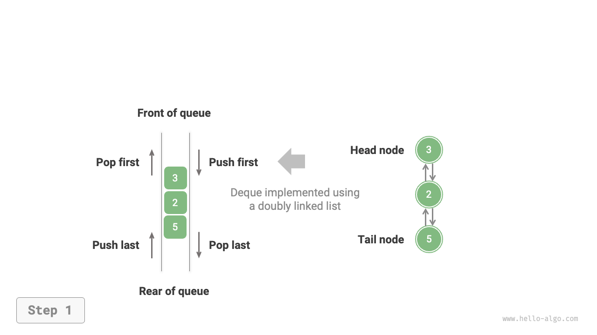

=== "push_last()"
    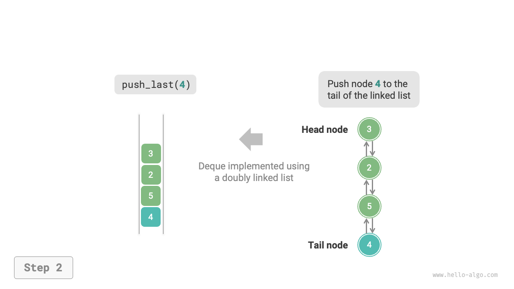

=== "push_first()"
    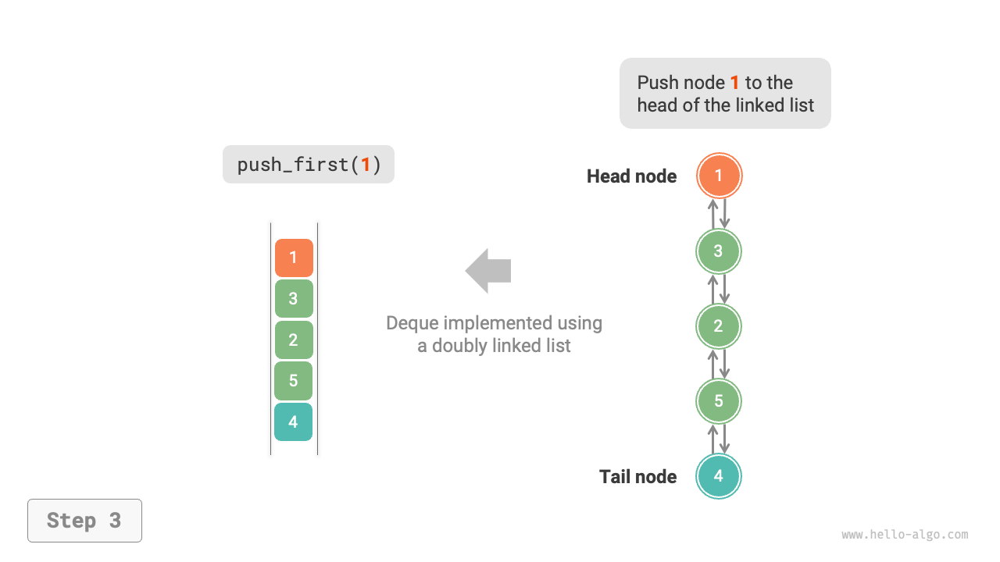

=== "pop_last()"
    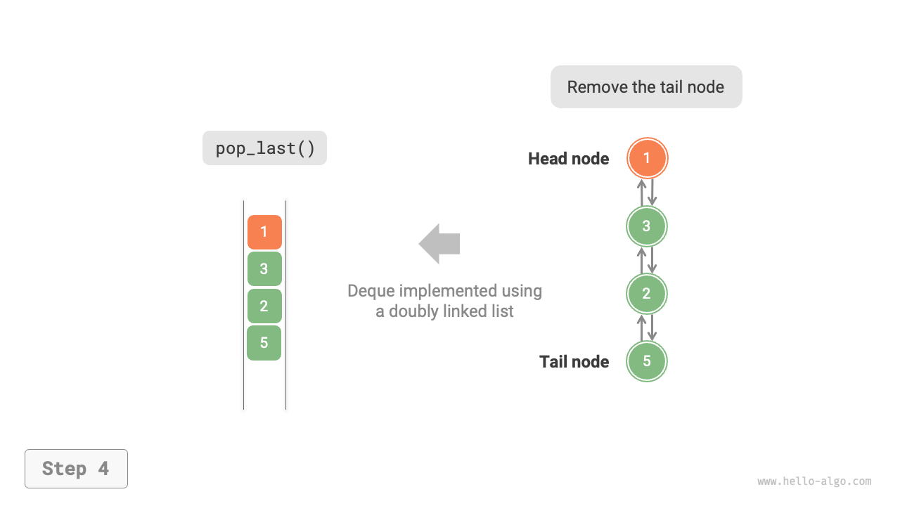

=== "pop_first()"
    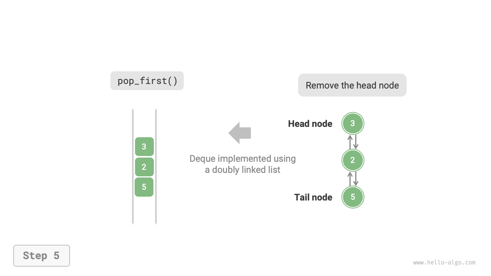

実装コードは次のとおりです：

```src
[file]{linkedlist_deque}-[class]{linked_list_deque}-[func]{}
```

### 配列に基づく実装

次の図に示すように、配列によるキュー実装と同様に、循環配列を使って両端キューを実装することもできます。

=== "ArrayDeque"
    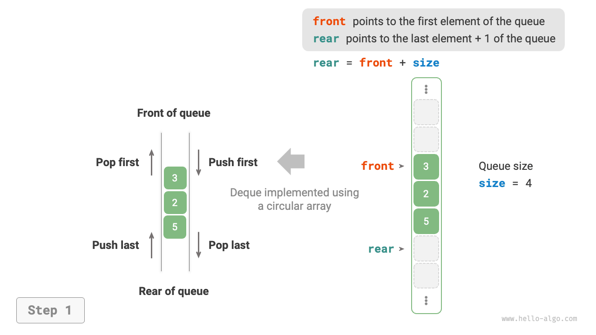

=== "push_last()"
    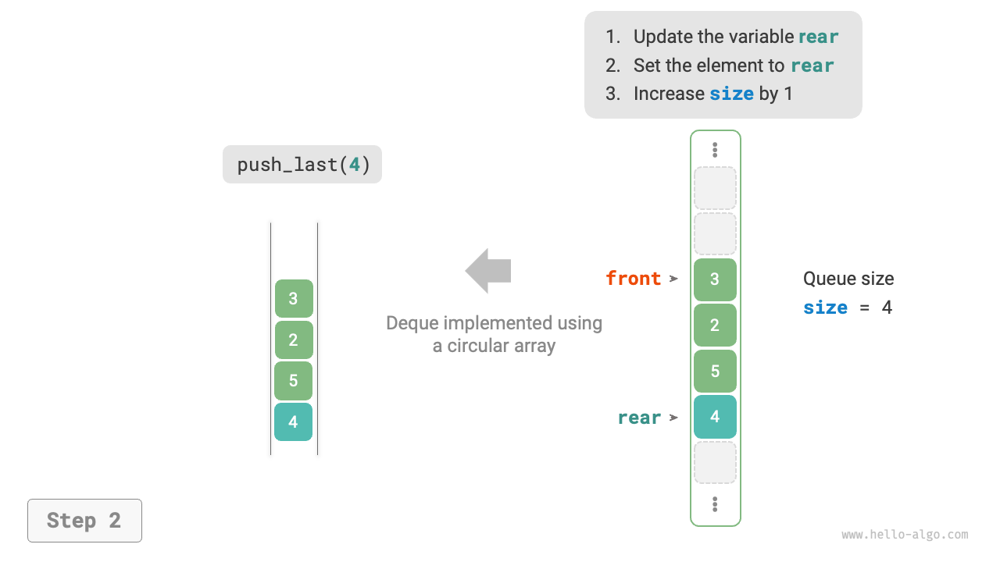

=== "push_first()"
    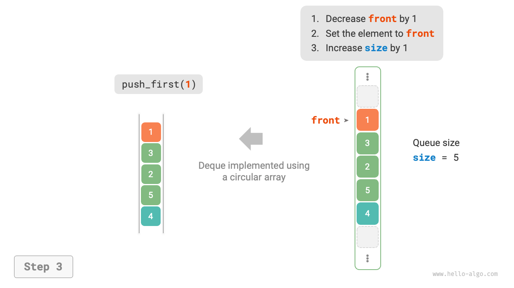

=== "pop_last()"
    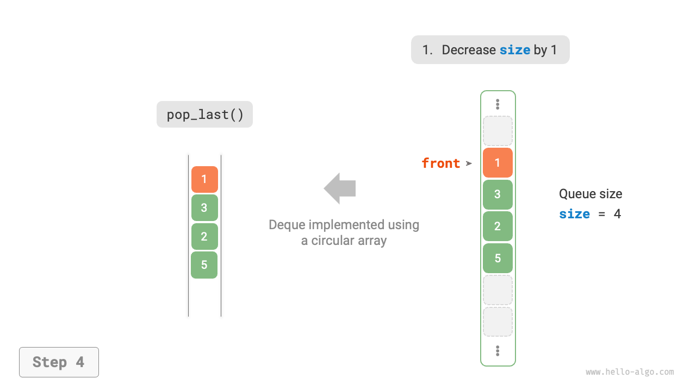

=== "pop_first()"
    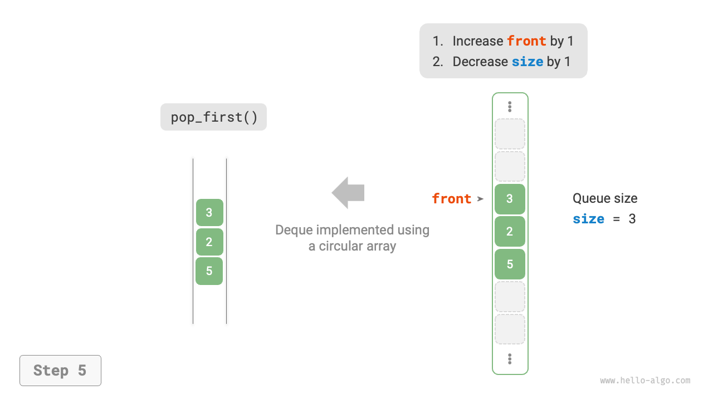

キュー実装を土台として、「先頭へのエンキュー」と「末尾からのデキュー」のメソッドを追加するだけで済みます：

```src
[file]{array_deque}-[class]{array_deque}-[func]{}
```

## 両端キューの応用

両端キューはスタックとキューの両方の論理を備えているため、**これら 2 つのすべての応用場面を実現でき、さらに高い自由度を提供します**。

私たちが知っているように、ソフトウェアの「元に戻す」機能は通常スタックを使って実装されます。システムは変更操作を毎回スタックに `push` し、その後 `pop` によって取り消しを実現します。しかし、システム資源の制約を考慮すると、通常ソフトウェアは取り消し可能な手数を制限します（たとえば $50$ 手まで保存可能）。スタックの長さが $50$ を超えると、ソフトウェアはスタックの底部（先頭）で削除操作を行う必要があります。**しかしスタックではこの機能を実現できないため、この場合はスタックの代わりに両端キューを使用する必要があります**。なお、「元に戻す」の中核ロジック自体は依然としてスタックの後入れ先出し原則に従っており、両端キューは追加のロジックをより柔軟に実装できるだけです。
