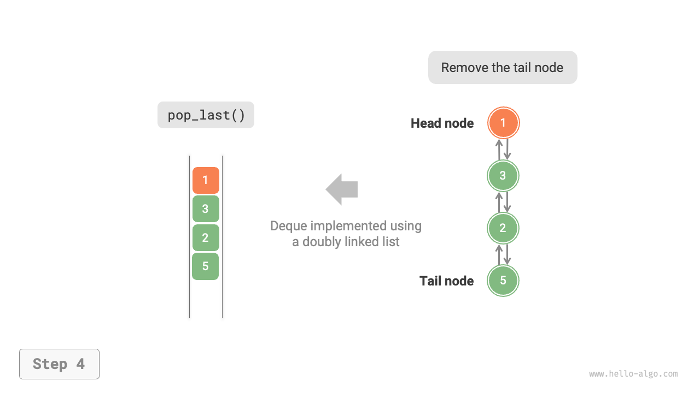

# 両端キュー

キューでは、先頭からの要素の削除や末尾への要素の追加のみが可能です。下図に示すように、<u>両端キュー（deque）</u>はより柔軟性を提供し、先頭と末尾の両方で要素の追加や削除を可能にします。


## 両端キューの一般的な操作

両端キューの一般的な操作は以下の通りです。具体的なメソッド名は使用するプログラミング言語によって異なります。

<p align="center"> 表 <id> &nbsp; 両端キューの操作効率 </p>

| メソッド名        | 説明                | 時間計算量      |
| ------------- | ------------------ | ------------- |
| `pushFirst()` | 先頭に要素を追加        | $O(1)$        |
| `pushLast()`  | 末尾に要素を追加        | $O(1)$        |
| `popFirst()`  | 先頭要素を削除         | $O(1)$        |
| `popLast()`   | 末尾要素を削除         | $O(1)$        |
| `peekFirst()` | 先頭要素にアクセス      | $O(1)$        |
| `peekLast()`  | 末尾要素にアクセス      | $O(1)$        |

同様に、プログラミング言語で実装された両端キュークラスを直接使用することができます：

=== "Python"

    ```python title="deque.py"
    from collections import deque

    # 両端キューを初期化
    deq: deque[int] = deque()

    # 要素をエンキュー
    deq.append(2)      # 末尾に追加
    deq.append(5)
    deq.append(4)
    deq.appendleft(3)  # 先頭に追加
    deq.appendleft(1)

    # 要素にアクセス
    front: int = deq[0]  # 先頭要素
    rear: int = deq[-1]  # 末尾要素

    # 要素をデキュー
    pop_front: int = deq.popleft()  # 先頭要素をデキュー
    pop_rear: int = deq.pop()       # 末尾要素をデキュー

    # 両端キューの長さを取得
    size: int = len(deq)

    # 両端キューが空かどうかを確認
    is_empty: bool = len(deq) == 0
    ```

=== "C++"

    ```cpp title="deque.cpp"
    /* 両端キューを初期化 */
    deque<int> deque;

    /* 要素をエンキュー */
    deque.push_back(2);   // 末尾に追加
    deque.push_back(5);
    deque.push_back(4);
    deque.push_front(3);  // 先頭に追加
    deque.push_front(1);

    /* 要素にアクセス */
    int front = deque.front(); // 先頭要素
    int back = deque.back();   // 末尾要素

    /* 要素をデキュー */
    deque.pop_front();  // 先頭要素をデキュー
    deque.pop_back();   // 末尾要素をデキュー

    /* 両端キューの長さを取得 */
    int size = deque.size();

    /* 両端キューが空かどうかを確認 */
    bool empty = deque.empty();
    ```

=== "Java"

    ```java title="deque.java"
    /* 両端キューを初期化 */
    Deque<Integer> deque = new LinkedList<>();

    /* 要素をエンキュー */
    deque.offerLast(2);   // 末尾に追加
    deque.offerLast(5);
    deque.offerLast(4);
    deque.offerFirst(3);  // 先頭に追加
    deque.offerFirst(1);

    /* 要素にアクセス */
    int peekFirst = deque.peekFirst();  // 先頭要素
    int peekLast = deque.peekLast();    // 末尾要素

    /* 要素をデキュー */
    int popFirst = deque.pollFirst();  // 先頭要素をデキュー
    int popLast = deque.pollLast();    // 末尾要素をデキュー

    /* 両端キューの長さを取得 */
    int size = deque.size();

    /* 両端キューが空かどうかを確認 */
    boolean isEmpty = deque.isEmpty();
    ```

=== "C#"

    ```csharp title="deque.cs"
    /* 両端キューを初期化 */
    // C#では、LinkedListを両端キューとして使用
    LinkedList<int> deque = new();

    /* 要素をエンキュー */
    deque.AddLast(2);   // 末尾に追加
    deque.AddLast(5);
    deque.AddLast(4);
    deque.AddFirst(3);  // 先頭に追加
    deque.AddFirst(1);

    /* 要素にアクセス */
    int peekFirst = deque.First.Value;  // 先頭要素
    int peekLast = deque.Last.Value;    // 末尾要素

    /* 要素をデキュー */
    deque.RemoveFirst();  // 先頭要素をデキュー
    deque.RemoveLast();   // 末尾要素をデキュー

    /* 両端キューの長さを取得 */
    int size = deque.Count;

    /* 両端キューが空かどうかを確認 */
    bool isEmpty = deque.Count == 0;
    ```

=== "Go"

    ```go title="deque_test.go"
    /* 両端キューを初期化 */
    // Goでは、listを両端キューとして使用
    deque := list.New()

    /* 要素をエンキュー */
    deque.PushBack(2)      // 末尾に追加
    deque.PushBack(5)
    deque.PushBack(4)
    deque.PushFront(3)     // 先頭に追加
    deque.PushFront(1)

    /* 要素にアクセス */
    front := deque.Front() // 先頭要素
    rear := deque.Back()   // 末尾要素

    /* 要素をデキュー */
    deque.Remove(front)    // 先頭要素をデキュー
    deque.Remove(rear)     // 末尾要素をデキュー

    /* 両端キューの長さを取得 */
    size := deque.Len()

    /* 両端キューが空かどうかを確認 */
    isEmpty := deque.Len() == 0
    ```

=== "Swift"

    ```swift title="deque.swift"
    /* 両端キューを初期化 */
    // Swiftには組み込みの両端キュークラスがないため、Arrayを両端キューとして使用
    var deque: [Int] = []

    /* 要素をエンキュー */
    deque.append(2) // 末尾に追加
    deque.append(5)
    deque.append(4)
    deque.insert(3, at: 0) // 先頭に追加
    deque.insert(1, at: 0)

    /* 要素にアクセス */
    let peekFirst = deque.first! // 先頭要素
    let peekLast = deque.last!   // 末尾要素

    /* 要素をデキュー */
    // Arrayを使用する場合、popFirstの計算量はO(n)
    let popFirst = deque.removeFirst() // 先頭要素をデキュー
    let popLast = deque.removeLast()   // 末尾要素をデキュー

    /* 両端キューの長さを取得 */
    let size = deque.count

    /* 両端キューが空かどうかを確認 */
    let isEmpty = deque.isEmpty
    ```

=== "JS"

    ```javascript title="deque.js"
    /* 両端キューを初期化 */
    // JavaScriptには組み込みの両端キューがないため、Arrayを両端キューとして使用
    const deque = [];

    /* 要素をエンキュー */
    deque.push(2);
    deque.push(5);
    deque.push(4);
    // 注意：unshift()は配列のため時間計算量がO(n)
    deque.unshift(3);
    deque.unshift(1);

    /* 要素にアクセス */
    const peekFirst = deque[0]; // 先頭要素
    const peekLast = deque[deque.length - 1]; // 末尾要素

    /* 要素をデキュー */
    // 注意：shift()は配列のため時間計算量がO(n)
    const popFront = deque.shift(); // 先頭要素をデキュー
    const popBack = deque.pop();    // 末尾要素をデキュー

    /* 両端キューの長さを取得 */
    const size = deque.length;

    /* 両端キューが空かどうかを確認 */
    const isEmpty = size === 0;
    ```

=== "TS"

    ```typescript title="deque.ts"
    /* 両端キューを初期化 */
    // TypeScriptには組み込みの両端キューがないため、Arrayを両端キューとして使用
    const deque: number[] = [];

    /* 要素をエンキュー */
    deque.push(2);
    deque.push(5);
    deque.push(4);
    // 注意：unshift()は配列のため時間計算量がO(n)
    deque.unshift(3);
    deque.unshift(1);

    /* 要素にアクセス */
    const peekFirst: number = deque[0]; // 先頭要素
    const peekLast: number = deque[deque.length - 1]; // 末尾要素

    /* 要素をデキュー */
    // 注意：shift()は配列のため時間計算量がO(n)
    const popFront: number = deque.shift() as number; // 先頭要素をデキュー
    const popBack: number = deque.pop() as number;    // 末尾要素をデキュー

    /* 両端キューの長さを取得 */
    const size: number = deque.length;

    /* 両端キューが空かどうかを確認 */
    const isEmpty: boolean = size === 0;
    ```

=== "Dart"

    ```dart title="deque.dart"
    /* 両端キューを初期化 */
    // Dartでは、Queueが両端キューとして定義される
    Queue<int> deque = Queue<int>();

    /* 要素をエンキュー */
    deque.addLast(2);  // 末尾に追加
    deque.addLast(5);
    deque.addLast(4);
    deque.addFirst(3); // 先頭に追加
    deque.addFirst(1);

    /* 要素にアクセス */
    int peekFirst = deque.first; // 先頭要素
    int peekLast = deque.last;   // 末尾要素

    /* 要素をデキュー */
    int popFirst = deque.removeFirst(); // 先頭要素をデキュー
    int popLast = deque.removeLast();   // 末尾要素をデキュー

    /* 両端キューの長さを取得 */
    int size = deque.length;

    /* 両端キューが空かどうかを確認 */
    bool isEmpty = deque.isEmpty;
    ```

=== "Rust"

    ```rust title="deque.rs"
    /* 両端キューを初期化 */
    let mut deque: VecDeque<u32> = VecDeque::new();

    /* 要素をエンキュー */
    deque.push_back(2);  // 末尾に追加
    deque.push_back(5);
    deque.push_back(4);
    deque.push_front(3); // 先頭に追加
    deque.push_front(1);

    /* 要素にアクセス */
    if let Some(front) = deque.front() { // 先頭要素
    }
    if let Some(rear) = deque.back() {   // 末尾要素
    }

    /* 要素をデキュー */
    if let Some(pop_front) = deque.pop_front() { // 先頭要素をデキュー
    }
    if let Some(pop_rear) = deque.pop_back() {   // 末尾要素をデキュー
    }

    /* 両端キューの長さを取得 */
    let size = deque.len();

    /* 両端キューが空かどうかを確認 */
    let is_empty = deque.is_empty();
    ```

=== "C"

    ```c title="deque.c"
    // Cには組み込みの両端キューが提供されていません
    ```

=== "Kotlin"

    ```kotlin title="deque.kt"

    ```

=== "Zig"

    ```zig title="deque.zig"

    ```

## 両端キューの実装 *

両端キューの実装は通常のキューの実装と似ており、連結リストまたは配列を基盤となるデータ構造として使用できます。

### 双方向連結リストに基づく実装

前節で、通常の単一連結リストを使ってキューを実装したことを思い出してください。これは先頭からの削除（デキュー操作に対応）と末尾への新しい要素の追加（エンキュー操作に対応）を便利に行えるためでした。

両端キューでは、先頭と末尾の両方でエンキューとデキュー操作を実行できます。つまり、両端キューは逆方向の操作も実装する必要があります。このため、両端キューの基盤となるデータ構造として「双方向連結リスト」を使用します。

下図に示すように、双方向連結リストの先頭ノードと末尾ノードをそれぞれ両端キューの前端と後端として扱い、両端でのノードの追加と削除機能を実装します。

=== "LinkedListDeque"
    

=== "pushLast()"
    

=== "pushFirst()"
    

=== "popLast()"
    

=== "popFirst()"
    

実装コードは以下の通りです：

```src
[file]{linkedlist_deque}-[class]{linked_list_deque}-[func]{}
```

### 配列に基づく実装

下図に示すように、配列でキューを実装するのと同様に、循環配列を使って両端キューを実装することもできます。

=== "ArrayDeque"
    

=== "pushLast()"
    

=== "pushFirst()"
    

=== "popLast()"
    

=== "popFirst()"
    

実装では「前端エンキュー」と「後端デキュー」のメソッドを追加するだけです：

```src
[file]{array_deque}-[class]{array_deque}-[func]{}
```

## 両端キューの応用

両端キューはスタックとキューの両方のロジックを組み合わせているため、**それぞれのすべてのユースケースを実装でき、より大きな柔軟性を提供します**。

ソフトウェアの「元に戻す」機能は通常スタックを使って実装されることを知っています：システムは各変更操作をスタックに`push`し、次に`pop`して元に戻すことを実装します。しかし、システムリソースの制限を考慮して、ソフトウェアは元に戻すステップの数を制限することがよくあります（例えば、最後の50ステップのみを許可）。スタックの長さが50を超えた場合、ソフトウェアはスタックの底部（キューの前端）で削除操作を実行する必要があります。**しかし、通常のスタックではこの機能を実行できないため、両端キューが必要になります**。「元に戻す」のコアロジックは依然としてスタックの後入れ先出し原則に従いますが、両端キューはより柔軟にいくつかの追加ロジックを実装できることに注意してください。
