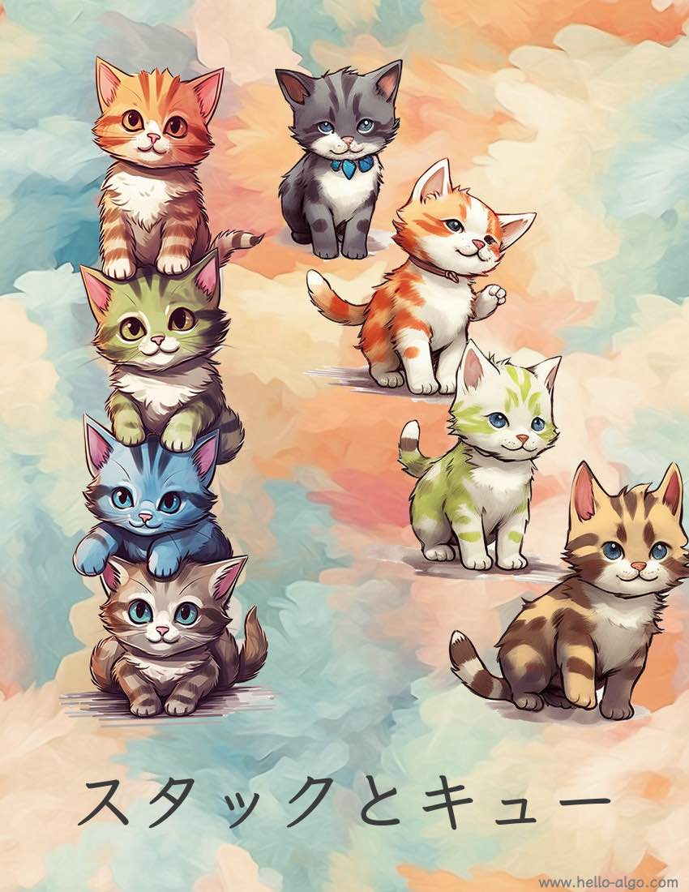

# 第 5 章 &nbsp; スタックとキュー

{ class="cover-image" }

!!! abstract

    スタックは猫を積み重ねるようなもので、キューは猫が列に並ぶようなものです。
    
    両者はそれぞれ、後入れ先出しと先入れ先出しの論理関係を表します。

## 章の内容

- [5.1 &nbsp; スタック](stack.md)
- [5.2 &nbsp; キュー](queue.md)
- [5.3 &nbsp; 両端キュー](deque.md)
- [5.4 &nbsp; まとめ](summary.md)
