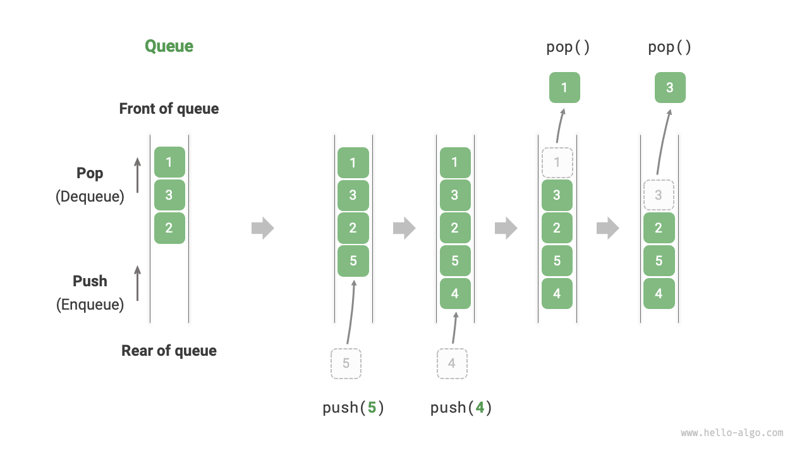
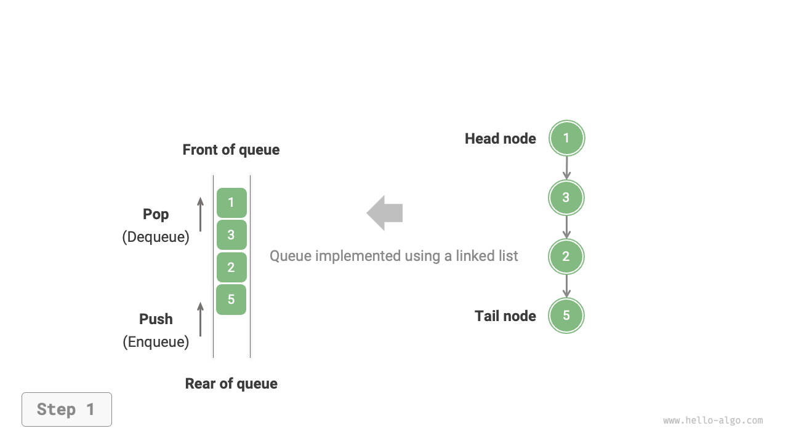
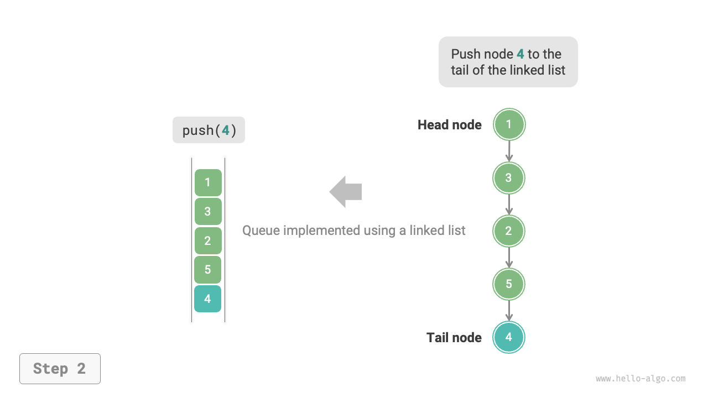
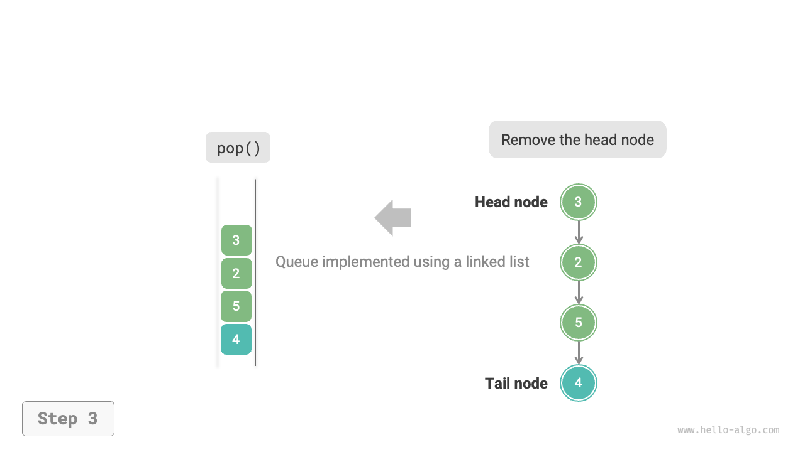
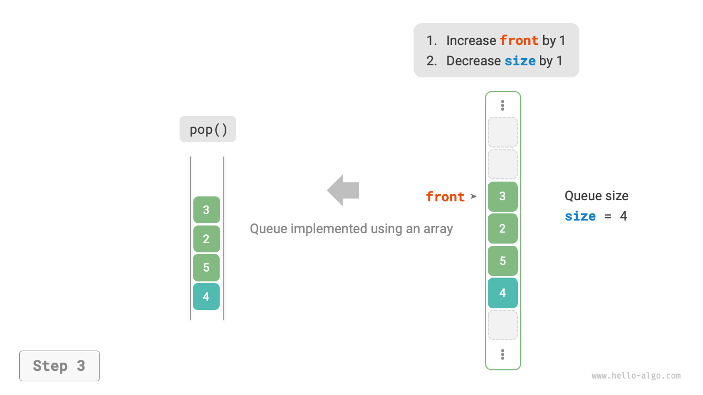

# キュー

<u>キュー</u>は、先入先出（FIFO）ルールに従う線形データ構造です。名前が示すように、キューは行列の現象をシミュレートし、新参者は列の後ろに並び、前の人が最初に列を離れます。

下図に示すように、キューの前面を「ヘッド」、後面を「テール」と呼びます。キューの後ろに要素を追加する操作を「エンキュー」、前から要素を削除する操作を「デキュー」と呼びます。



## キューの一般的な操作

キューの一般的な操作を下表に示します。メソッド名はプログラミング言語によって異なる場合があることに注意してください。ここでは、スタックで使用したのと同じ命名規則を使用します。

<p align="center"> 表 <id> &nbsp; キュー操作の効率 </p>

| メソッド名 | 説明                            | 時間計算量 |
| ----------- | -------------------------------------- | --------------- |
| `push()`    | 要素をエンキュー、テールに追加 | $O(1)$          |
| `pop()`     | ヘッド要素をデキュー               | $O(1)$          |
| `peek()`    | ヘッド要素にアクセス                | $O(1)$          |

プログラミング言語で用意されているキュークラスを直接使用できます：

=== "Python"

    ```python title="queue.py"
    from collections import deque

    # キューを初期化
    # Pythonでは、一般的にdequeクラスをキューとして使用します
    # queue.Queue()は純粋なキュークラスですが、使いにくいため推奨されません
    que: deque[int] = deque()

    # 要素をエンキュー
    que.append(1)
    que.append(3)
    que.append(2)
    que.append(5)
    que.append(4)

    # 最初の要素にアクセス
    front: int = que[0]

    # 要素をデキュー
    pop: int = que.popleft()

    # キューの長さを取得
    size: int = len(que)

    # キューが空かどうかチェック
    is_empty: bool = len(que) == 0
    ```

=== "C++"

    ```cpp title="queue.cpp"
    /* キューを初期化 */
    queue<int> queue;

    /* 要素をエンキュー */
    queue.push(1);
    queue.push(3);
    queue.push(2);
    queue.push(5);
    queue.push(4);

    /* 最初の要素にアクセス */
    int front = queue.front();

    /* 要素をデキュー */
    queue.pop();

    /* キューの長さを取得 */
    int size = queue.size();

    /* キューが空かどうかチェック */
    bool empty = queue.empty();
    ```

=== "Java"

    ```java title="queue.java"
    /* キューを初期化 */
    Queue<Integer> queue = new LinkedList<>();

    /* 要素をエンキュー */
    queue.offer(1);
    queue.offer(3);
    queue.offer(2);
    queue.offer(5);
    queue.offer(4);

    /* 最初の要素にアクセス */
    int peek = queue.peek();

    /* 要素をデキュー */
    int pop = queue.poll();

    /* キューの長さを取得 */
    int size = queue.size();

    /* キューが空かどうかチェック */
    boolean isEmpty = queue.isEmpty();
    ```

=== "C#"

    ```csharp title="queue.cs"
    /* キューを初期化 */
    Queue<int> queue = new();

    /* 要素をエンキュー */
    queue.Enqueue(1);
    queue.Enqueue(3);
    queue.Enqueue(2);
    queue.Enqueue(5);
    queue.Enqueue(4);

    /* 最初の要素にアクセス */
    int peek = queue.Peek();

    /* 要素をデキュー */
    int pop = queue.Dequeue();

    /* キューの長さを取得 */
    int size = queue.Count;

    /* キューが空かどうかチェック */
    bool isEmpty = queue.Count == 0;
    ```

=== "Go"

    ```go title="queue_test.go"
    /* キューを初期化 */
    // Goでは、listをキューとして使用
    queue := list.New()

    /* 要素をエンキュー */
    queue.PushBack(1)
    queue.PushBack(3)
    queue.PushBack(2)
    queue.PushBack(5)
    queue.PushBack(4)

    /* 最初の要素にアクセス */
    peek := queue.Front()

    /* 要素をデキュー */
    pop := queue.Front()
    queue.Remove(pop)

    /* キューの長さを取得 */
    size := queue.Len()

    /* キューが空かどうかチェック */
    isEmpty := queue.Len() == 0
    ```

=== "Swift"

    ```swift title="queue.swift"
    /* キューを初期化 */
    // Swiftには組み込みのキュークラスがないため、Arrayをキューとして使用
    var queue: [Int] = []

    /* 要素をエンキュー */
    queue.append(1)
    queue.append(3)
    queue.append(2)
    queue.append(5)
    queue.append(4)

    /* 最初の要素にアクセス */
    let peek = queue.first!

    /* 要素をデキュー */
    // 配列なので、removeFirstの計算量はO(n)
    let pool = queue.removeFirst()

    /* キューの長さを取得 */
    let size = queue.count

    /* キューが空かどうかチェック */
    let isEmpty = queue.isEmpty
    ```

=== "JS"

    ```javascript title="queue.js"
    /* キューを初期化 */
    // JavaScriptには組み込みのキューがないため、Arrayをキューとして使用
    const queue = [];

    /* 要素をエンキュー */
    queue.push(1);
    queue.push(3);
    queue.push(2);
    queue.push(5);
    queue.push(4);

    /* 最初の要素にアクセス */
    const peek = queue[0];

    /* 要素をデキュー */
    // 基礎構造が配列なので、shift()メソッドの時間計算量はO(n)
    const pop = queue.shift();

    /* キューの長さを取得 */
    const size = queue.length;

    /* キューが空かどうかチェック */
    const empty = queue.length === 0;
    ```

=== "TS"

    ```typescript title="queue.ts"
    /* キューを初期化 */
    // TypeScriptには組み込みのキューがないため、Arrayをキューとして使用
    const queue: number[] = [];

    /* 要素をエンキュー */
    queue.push(1);
    queue.push(3);
    queue.push(2);
    queue.push(5);
    queue.push(4);

    /* 最初の要素にアクセス */
    const peek = queue[0];

    /* 要素をデキュー */
    // 基礎構造が配列なので、shift()メソッドの時間計算量はO(n)
    const pop = queue.shift();

    /* キューの長さを取得 */
    const size = queue.length;

    /* キューが空かどうかチェック */
    const empty = queue.length === 0;
    ```

=== "Dart"

    ```dart title="queue.dart"
    /* キューを初期化 */
    // DartのQueueクラスは双方向キューですが、キューとして使用できます
    Queue<int> queue = Queue();

    /* 要素をエンキュー */
    queue.add(1);
    queue.add(3);
    queue.add(2);
    queue.add(5);
    queue.add(4);

    /* 最初の要素にアクセス */
    int peek = queue.first;

    /* 要素をデキュー */
    int pop = queue.removeFirst();

    /* キューの長さを取得 */
    int size = queue.length;

    /* キューが空かどうかチェック */
    bool isEmpty = queue.isEmpty;
    ```

=== "Rust"

    ```rust title="queue.rs"
    /* 双方向キューを初期化 */
    // Rustでは、双方向キューを通常のキューとして使用
    let mut deque: VecDeque<u32> = VecDeque::new();

    /* 要素をエンキュー */
    deque.push_back(1);
    deque.push_back(3);
    deque.push_back(2);
    deque.push_back(5);
    deque.push_back(4);

    /* 最初の要素にアクセス */
    if let Some(front) = deque.front() {
    }

    /* 要素をデキュー */
    if let Some(pop) = deque.pop_front() {
    }

    /* キューの長さを取得 */
    let size = deque.len();

    /* キューが空かどうかチェック */
    let is_empty = deque.is_empty();
    ```

=== "C"

    ```c title="queue.c"
    // Cは組み込みのキューを提供していません
    ```

=== "Kotlin"

    ```kotlin title="queue.kt"

    ```

=== "Zig"

    ```zig title="queue.zig"

    ```

## キューの実装

キューを実装するには、一方の端で要素を追加し、もう一方の端で要素を削除できるデータ構造が必要です。連結リストと配列の両方がこの要件を満たします。

### 連結リストベースの実装

下図に示すように、連結リストの「ヘッドノード」と「テールノード」をそれぞれキューの「フロント」と「リア」と考えることができます。ノードは後ろでのみ追加でき、前でのみ削除できるように規定されています。

=== "LinkedListQueue"
    

=== "push()"
    

=== "pop()"
    

以下は、連結リストを使用してキューを実装するコードです：

```src
[file]{linkedlist_queue}-[class]{linked_list_queue}-[func]{}
```

### 配列ベースの実装

配列の最初の要素を削除する時間計算量は$O(n)$で、デキュー操作が非効率になります。しかし、この問題は以下のように巧妙に回避できます。

変数`front`を使用してフロント要素のインデックスを示し、変数`size`を維持してキューの長さを記録します。`rear = front + size`を定義し、これはテール要素の直後の位置を指します。

この設計により、**配列内の要素の有効な間隔は`[front, rear - 1]`です**。各操作の実装方法を下図に示します。

- エンキュー操作：入力要素を`rear`インデックスに割り当て、`size`を1増加させます。
- デキュー操作：単に`front`を1増加させ、`size`を1減少させます。

エンキューとデキュー操作は両方とも単一の操作のみを必要とし、それぞれの時間計算量は$O(1)$です。

=== "ArrayQueue"
    

=== "push()"
    

=== "pop()"
    

問題に気づくかもしれません：エンキューとデキュー操作が継続的に実行されると、`front`と`rear`の両方が右に移動し、**最終的に配列の末尾に到達してそれ以上移動できなくなります**。これを解決するために、配列を「循環配列」として扱い、配列の末尾を先頭に接続します。

循環配列では、`front`または`rear`が末尾に到達すると、配列の先頭にループバックする必要があります。この循環パターンは、以下のコードに示すように「剰余演算」で実現できます：

```src
[file]{array_queue}-[class]{array_queue}-[func]{}
```

上記のキュー実装にはまだ制限があります：長さが固定されています。しかし、この問題は解決が困難ではありません。配列を必要に応じて自動拡張できる動的配列に置き換えることができます。興味のある読者は自分で実装してみてください。

2つの実装の比較はスタックの場合と一貫しており、ここでは繰り返しません。

## キューの典型的な応用

- **Amazonの注文**：買い物客が注文を行った後、これらの注文はキューに参加し、システムは順番に処理します。独身の日などのイベント中は、短時間で大量の注文が生成され、高い同時実行性がエンジニアにとって重要な課題となります。
- **様々なToDoリスト**：「先着順」機能が必要なシナリオ、例えばプリンターのタスクキューやレストランの配達キューなど、キューで処理順序を効果的に維持できます。
