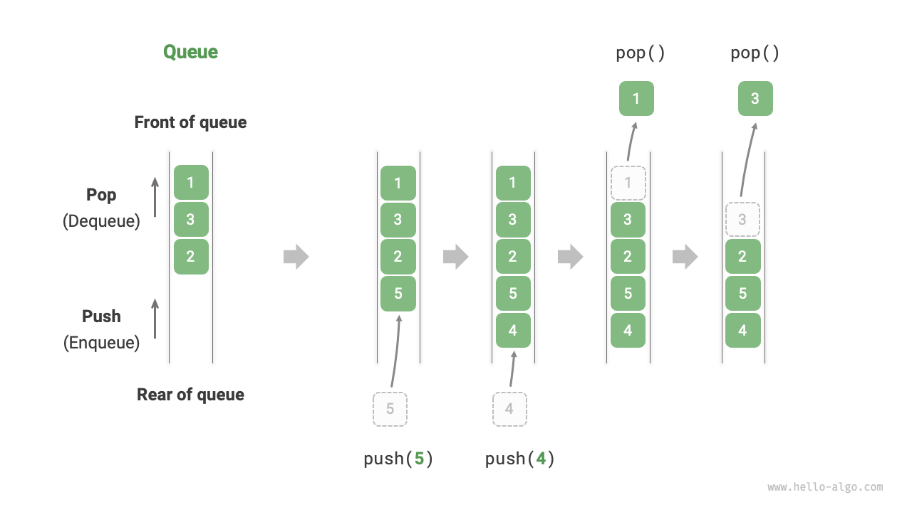
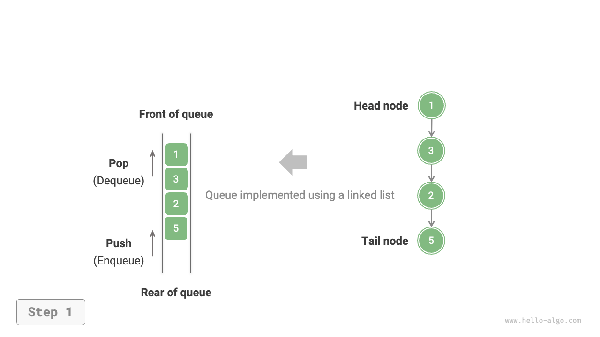
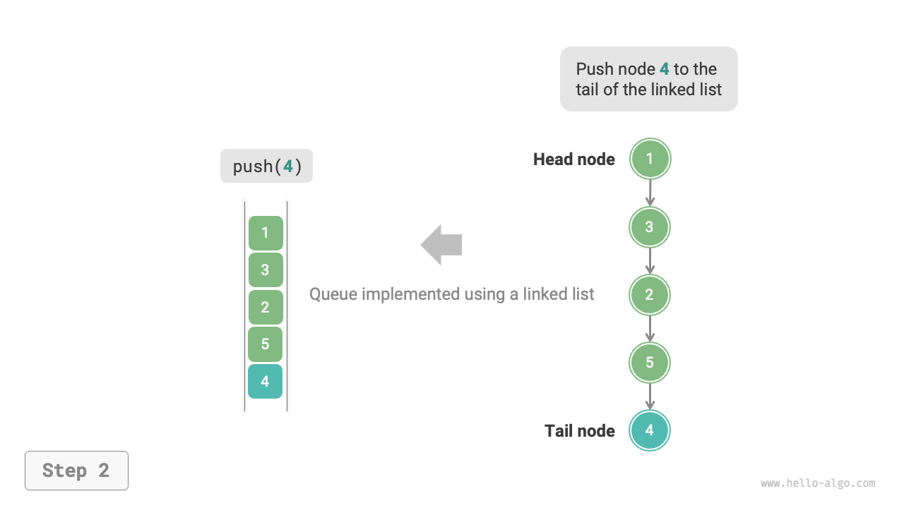
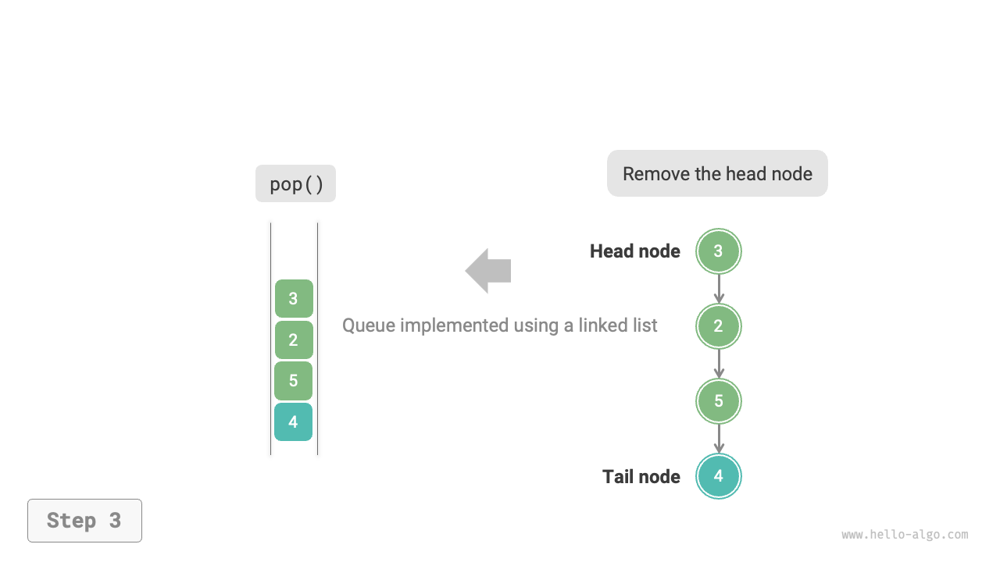
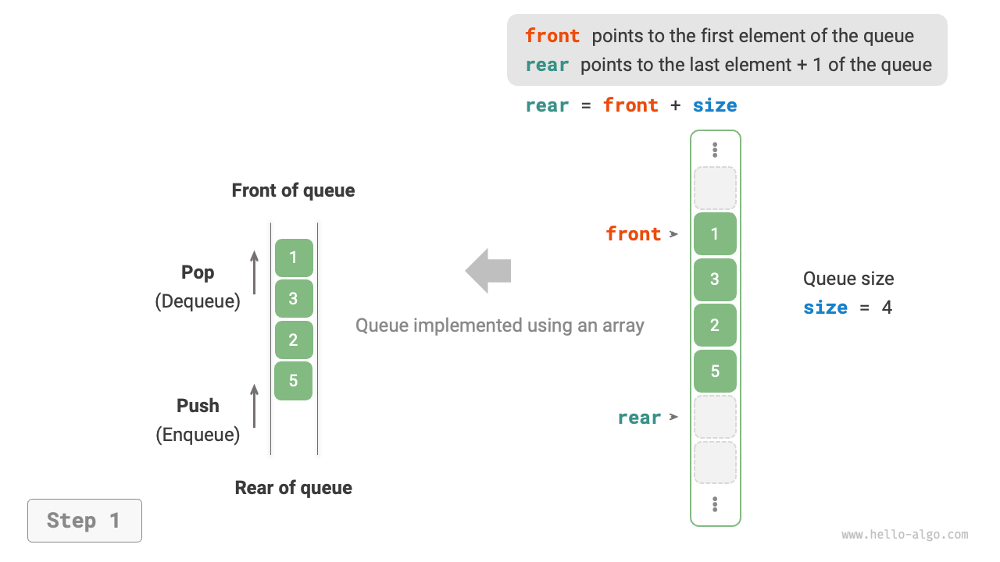
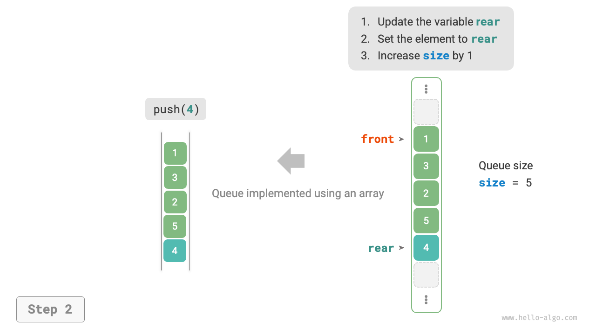
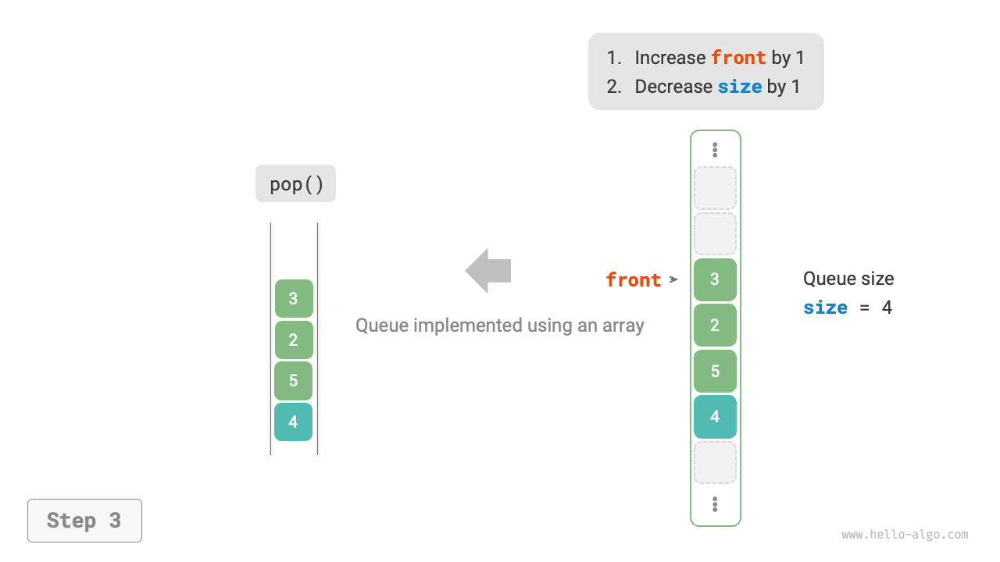

# キュー

<u>キュー（queue）</u>は、先入れ先出しの規則に従う線形データ構造です。名前のとおり、キューは順番待ちの現象を模したもので、新しく来た人は絶えずキュー末尾に加わり、キュー先頭にいる人から順に離れていきます。

下図のように、キューの先頭を「キュー先頭」、末尾を「キュー末尾」と呼びます。要素をキュー末尾に加える操作を「エンキュー」、キュー先頭の要素を削除する操作を「デキュー」と呼びます。



## キューの基本操作

キューの基本操作を以下の表に示します。なお、メソッド名はプログラミング言語によって異なる場合があります。ここではスタックと同じ命名を採用します。

<p align="center"> 表 <id> &nbsp; キュー操作の効率 </p>

| メソッド名 | 説明                           | 時間計算量 |
| -------- | ---------------------------- | ---------- |
| `push()` | 要素をエンキューし、キュー末尾に追加する | $O(1)$     |
| `pop()`  | キュー先頭の要素をデキューする         | $O(1)$     |
| `peek()` | キュー先頭の要素にアクセスする         | $O(1)$     |

プログラミング言語に用意された既存のキュークラスをそのまま利用できます：

=== "Python"

    ```python title="queue.py"
    from collections import deque

    # キューを初期化
    # Python では、通常は双方向キュークラス deque をキューとして使用する
    # queue.Queue() は純粋なキュークラスだが、やや使いにくいため非推奨
    que: deque[int] = deque()

    # 要素をエンキュー
    que.append(1)
    que.append(3)
    que.append(2)
    que.append(5)
    que.append(4)

    # キュー先頭の要素にアクセス
    front: int = que[0]

    # 要素をデキュー
    pop: int = que.popleft()

    # キューの長さを取得
    size: int = len(que)

    # キューが空かどうかを判定
    is_empty: bool = len(que) == 0
    ```

=== "C++"

    ```cpp title="queue.cpp"
    /* キューを初期化 */
    queue<int> queue;

    /* 要素をエンキュー */
    queue.push(1);
    queue.push(3);
    queue.push(2);
    queue.push(5);
    queue.push(4);

    /* キュー先頭の要素にアクセス */
    int front = queue.front();

    /* 要素をデキュー */
    queue.pop();

    /* キューの長さを取得 */
    int size = queue.size();

    /* キューが空かどうかを判定 */
    bool empty = queue.empty();
    ```

=== "Java"

    ```java title="queue.java"
    /* キューを初期化 */
    Queue<Integer> queue = new LinkedList<>();

    /* 要素をエンキュー */
    queue.offer(1);
    queue.offer(3);
    queue.offer(2);
    queue.offer(5);
    queue.offer(4);

    /* キュー先頭の要素にアクセス */
    int peek = queue.peek();

    /* 要素をデキュー */
    int pop = queue.poll();

    /* キューの長さを取得 */
    int size = queue.size();

    /* キューが空かどうかを判定 */
    boolean isEmpty = queue.isEmpty();
    ```

=== "C#"

    ```csharp title="queue.cs"
    /* キューを初期化 */
    Queue<int> queue = new();

    /* 要素をエンキュー */
    queue.Enqueue(1);
    queue.Enqueue(3);
    queue.Enqueue(2);
    queue.Enqueue(5);
    queue.Enqueue(4);

    /* キュー先頭の要素にアクセス */
    int peek = queue.Peek();

    /* 要素をデキュー */
    int pop = queue.Dequeue();

    /* キューの長さを取得 */
    int size = queue.Count;

    /* キューが空かどうかを判定 */
    bool isEmpty = queue.Count == 0;
    ```

=== "Go"

    ```go title="queue_test.go"
    /* キューを初期化 */
    // Go では、list をキューとして使用する
    queue := list.New()

    /* 要素をエンキュー */
    queue.PushBack(1)
    queue.PushBack(3)
    queue.PushBack(2)
    queue.PushBack(5)
    queue.PushBack(4)

    /* キュー先頭の要素にアクセス */
    peek := queue.Front()

    /* 要素をデキュー */
    pop := queue.Front()
    queue.Remove(pop)

    /* キューの長さを取得 */
    size := queue.Len()

    /* キューが空かどうかを判定 */
    isEmpty := queue.Len() == 0
    ```

=== "Swift"

    ```swift title="queue.swift"
    /* キューを初期化 */
    // Swift には組み込みのキュークラスがないため、Array をキューとして使える
    var queue: [Int] = []

    /* 要素をエンキュー */
    queue.append(1)
    queue.append(3)
    queue.append(2)
    queue.append(5)
    queue.append(4)

    /* キュー先頭の要素にアクセス */
    let peek = queue.first!

    /* 要素をデキュー */
    // 配列であるため、removeFirst の計算量は O(n)
    let pool = queue.removeFirst()

    /* キューの長さを取得 */
    let size = queue.count

    /* キューが空かどうかを判定 */
    let isEmpty = queue.isEmpty
    ```

=== "JS"

    ```javascript title="queue.js"
    /* キューを初期化 */
    // JavaScript には組み込みのキューがないため、Array をキューとして使える
    const queue = [];

    /* 要素をエンキュー */
    queue.push(1);
    queue.push(3);
    queue.push(2);
    queue.push(5);
    queue.push(4);

    /* キュー先頭の要素にアクセス */
    const peek = queue[0];

    /* 要素をデキュー */
    // 基盤は配列であるため、shift() メソッドの時間計算量は O(n)
    const pop = queue.shift();

    /* キューの長さを取得 */
    const size = queue.length;

    /* キューが空かどうかを判定 */
    const empty = queue.length === 0;
    ```

=== "TS"

    ```typescript title="queue.ts"
    /* キューを初期化 */
    // TypeScript には組み込みのキューがないため、Array をキューとして使える
    const queue: number[] = [];

    /* 要素をエンキュー */
    queue.push(1);
    queue.push(3);
    queue.push(2);
    queue.push(5);
    queue.push(4);

    /* キュー先頭の要素にアクセス */
    const peek = queue[0];

    /* 要素をデキュー */
    // 基盤は配列であるため、shift() メソッドの時間計算量は O(n)
    const pop = queue.shift();

    /* キューの長さを取得 */
    const size = queue.length;

    /* キューが空かどうかを判定 */
    const empty = queue.length === 0;
    ```

=== "Dart"

    ```dart title="queue.dart"
    /* キューを初期化 */
    // Dart では、キュークラス Qeque は双方向キューであり、キューとしても使用できる
    Queue<int> queue = Queue();

    /* 要素をエンキュー */
    queue.add(1);
    queue.add(3);
    queue.add(2);
    queue.add(5);
    queue.add(4);

    /* キュー先頭の要素にアクセス */
    int peek = queue.first;

    /* 要素をデキュー */
    int pop = queue.removeFirst();

    /* キューの長さを取得 */
    int size = queue.length;

    /* キューが空かどうかを判定 */
    bool isEmpty = queue.isEmpty;
    ```

=== "Rust"

    ```rust title="queue.rs"
    /* 双方向キューを初期化 */
    // Rust では双方向キューを通常のキューとして使う
    let mut deque: VecDeque<u32> = VecDeque::new();

    /* 要素をエンキュー */
    deque.push_back(1);
    deque.push_back(3);
    deque.push_back(2);
    deque.push_back(5);
    deque.push_back(4);

    /* キュー先頭の要素にアクセス */
    if let Some(front) = deque.front() {
    }

    /* 要素をデキュー */
    if let Some(pop) = deque.pop_front() {
    }

    /* キューの長さを取得 */
    let size = deque.len();

    /* キューが空かどうかを判定 */
    let is_empty = deque.is_empty();
    ```

=== "C"

    ```c title="queue.c"
    // C には組み込みのキューがない
    ```

=== "Kotlin"

    ```kotlin title="queue.kt"
    /* キューを初期化 */
    val queue = LinkedList<Int>()

    /* 要素をエンキュー */
    queue.offer(1)
    queue.offer(3)
    queue.offer(2)
    queue.offer(5)
    queue.offer(4)

    /* キュー先頭の要素にアクセス */
    val peek = queue.peek()

    /* 要素をデキュー */
    val pop = queue.poll()

    /* キューの長さを取得 */
    val size = queue.size

    /* キューが空かどうかを判定 */
    val isEmpty = queue.isEmpty()
    ```

=== "Ruby"

    ```ruby title="queue.rb"
    # キューを初期化
    # Ruby 組み込みのキュー（Thread::Queue) には peek と走査メソッドがないため、Array をキューとして使える
    queue = []

    # 要素をエンキュー
    queue.push(1)
    queue.push(3)
    queue.push(2)
    queue.push(5)
    queue.push(4)

    # キュー先頭の要素にアクセス
    peek = queue.first

    # 要素をデキュー
    # 注意：配列であるため、Array#shift メソッドの時間計算量は O(n)
    pop = queue.shift

    # キューの長さを取得
    size = queue.length

    # キューが空かどうかを判定
    is_empty = queue.empty?
    ```

??? pythontutor "可視化実行"

    https://pythontutor.com/render.html#code=from%20collections%20import%20deque%0A%0A%22%22%22Driver%20Code%22%22%22%0Aif%20__name__%20%3D%3D%20%22__main__%22%3A%0A%20%20%20%20%23%20%E5%88%9D%E5%A7%8B%E5%8C%96%E9%98%9F%E5%88%97%0A%20%20%20%20%23%20%E5%9C%A8%20Python%20%E4%B8%AD%EF%BC%8C%E6%88%91%E4%BB%AC%E4%B8%80%E8%88%AC%E5%B0%86%E5%8F%8C%E5%90%91%E9%98%9F%E5%88%97%E7%B1%BB%20deque%20%E7%9C%8B%E4%BD%9C%E9%98%9F%E5%88%97%E4%BD%BF%E7%94%A8%0A%20%20%20%20%23%20%E8%99%BD%E7%84%B6%20queue.Queue%28%29%20%E6%98%AF%E7%BA%AF%E6%AD%A3%E7%9A%84%E9%98%9F%E5%88%97%E7%B1%BB%EF%BC%8C%E4%BD%86%E4%B8%8D%E5%A4%AA%E5%A5%BD%E7%94%A8%0A%20%20%20%20que%20%3D%20deque%28%29%0A%0A%20%20%20%20%23%20%E5%85%83%E7%B4%A0%E5%85%A5%E9%98%9F%0A%20%20%20%20que.append%281%29%0A%20%20%20%20que.append%283%29%0A%20%20%20%20que.append%282%29%0A%20%20%20%20que.append%285%29%0A%20%20%20%20que.append%284%29%0A%20%20%20%20print%28%22%E9%98%9F%E5%88%97%20que%20%3D%22,%20que%29%0A%0A%20%20%20%20%23%20%E8%AE%BF%E9%97%AE%E9%98%9F%E9%A6%96%E5%85%83%E7%B4%A0%0A%20%20%20%20front%20%3D%20que%5B0%5D%0A%20%20%20%20print%28%22%E9%98%9F%E9%A6%96%E5%85%83%E7%B4%A0%20front%20%3D%22,%20front%29%0A%0A%20%20%20%20%23%20%E5%85%83%E7%B4%A0%E5%87%BA%E9%98%9F%0A%20%20%20%20pop%20%3D%20que.popleft%28%29%0A%20%20%20%20print%28%22%E5%87%BA%E9%98%9F%E5%85%83%E7%B4%A0%20pop%20%3D%22,%20pop%29%0A%20%20%20%20print%28%22%E5%87%BA%E9%98%9F%E5%90%8E%20que%20%3D%22,%20que%29%0A%0A%20%20%20%20%23%20%E8%8E%B7%E5%8F%96%E9%98%9F%E5%88%97%E7%9A%84%E9%95%BF%E5%BA%A6%0A%20%20%20%20size%20%3D%20len%28que%29%0A%20%20%20%20print%28%22%E9%98%9F%E5%88%97%E9%95%BF%E5%BA%A6%20size%20%3D%22,%20size%29%0A%0A%20%20%20%20%23%20%E5%88%A4%E6%96%AD%E9%98%9F%E5%88%97%E6%98%AF%E5%90%A6%E4%B8%BA%E7%A9%BA%0A%20%20%20%20is_empty%20%3D%20len%28que%29%20%3D%3D%200%0A%20%20%20%20print%28%22%E9%98%9F%E5%88%97%E6%98%AF%E5%90%A6%E4%B8%BA%E7%A9%BA%20%3D%22,%20is_empty%29&cumulative=false&curInstr=3&heapPrimitives=nevernest&mode=display&origin=opt-frontend.js&py=311&rawInputLstJSON=%5B%5D&textReferences=false

## キューの実装

キューを実装するには、一方の端で要素を追加し、もう一方の端で要素を削除できるデータ構造が必要です。連結リストと配列はいずれもこの条件を満たします。

### 連結リストに基づく実装

下図のように、連結リストの「先頭ノード」と「末尾ノード」をそれぞれ「キュー先頭」と「キュー末尾」とみなし、キュー末尾ではノードの追加のみ、キュー先頭ではノードの削除のみを行うようにします。

=== "LinkedListQueue"
    

=== "push()"
    

=== "pop()"
    

以下は連結リストでキューを実装するコードです：

```src
[file]{linkedlist_queue}-[class]{linked_list_queue}-[func]{}
```

### 配列に基づく実装

配列で先頭要素を削除する時間計算量は $O(n)$ であり、そのままではデキュー操作の効率が低くなります。しかし、次の巧妙な方法によってこの問題を回避できます。

変数 `front` を用いてキュー先頭要素のインデックスを指し、さらに変数 `size` でキューの長さを記録できます。`rear = front + size` と定義すると、この式で得られる `rear` はキュー末尾要素の次の位置を指します。

この設計に基づくと、**配列内で要素を含む有効区間は `[front, rear - 1]`** となります。各種操作の実装方法を下図に示します。

- エンキュー操作：入力要素を `rear` の位置に代入し、`size` を 1 増やします。
- デキュー操作：`front` を 1 増やし、`size` を 1 減らすだけです。

このように、エンキューとデキューはいずれも 1 回の操作だけで済み、時間計算量はともに $O(1)$ です。

=== "ArrayQueue"
    

=== "push()"
    

=== "pop()"
    

ここで 1 つ問題があります。エンキューとデキューを繰り返すと、`front` と `rear` はどちらも右へ移動し続け、**配列の末尾に達するとそれ以上進めなくなります**。この問題を解決するために、配列を先頭と末尾がつながった「環状配列」とみなします。

環状配列では、`front` または `rear` が配列末尾を越えたときに、直ちに配列先頭へ戻って走査を続けられるようにする必要があります。この周期的な規則は「剰余演算」によって実現できます。コードは次のとおりです：

```src
[file]{array_queue}-[class]{array_queue}-[func]{}
```

上記の実装によるキューにも制約があり、長さを可変にできません。しかし、この問題の解決は難しくなく、配列を動的配列に置き換えれば容量拡張の仕組みを導入できます。興味があれば自分で実装してみてください。

2 つの実装の比較に関する結論はスタックの場合と同じなので、ここでは繰り返しません。

## キューの典型的な応用

- **淘宝の注文**。購入者が注文すると、その注文はキューに追加され、システムは順番に従って注文を処理します。ダブルイレブンの期間には短時間で膨大な注文が発生するため、高並行性がエンジニアにとって重点的に解決すべき課題になります。
- **各種の待機事項**。先着順の機能を実現する必要があるあらゆる場面、たとえばプリンターのジョブキューや飲食店の配膳キューなどでは、キューによって処理順序を効果的に維持できます。
