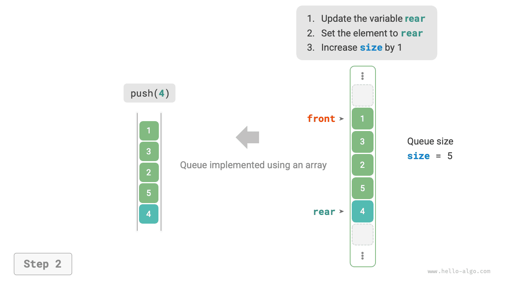

# 5.2 &nbsp; キュー

<u>キュー（queue）</u>は先入れ先出しの規則に従う線形データ構造です。行列に並ぶ様子を模しており、新しく来た人が末尾に加わり、先頭の人から順に離れていきます。

図 5-4 のように、前側を「先頭」、後ろ側を「末尾」と呼びます。末尾に要素を加える操作を「エンキュー」、先頭要素を削除する操作を「デキュー」と呼びます。

{ class="animation-figure" }

<p align="center"> 図 5-4 &nbsp; キューの先入れ先出しの規則 </p>

## 5.2.1 &nbsp; キューの主な操作

主な操作を表 5-2 に示します。メソッド名は言語ごとに異なる場合がありますが、ここではスタックと同じ名前を使います。

<p align="center"> 表 5-2 &nbsp; キューの操作効率 </p>

<div class="center-table" markdown>

| メソッド名   | 説明                         | 時間計算量 |
| -------- | ---------------------------- | ---------- |
| `push()` | エンキュー、つまり末尾への要素の追加 | $O(1)$     |
| `pop()`  | 先頭要素のデキュー                 | $O(1)$     |
| `peek()` | 先頭要素へのアクセス                 | $O(1)$     |

</div>

言語が用意するキュークラスを、そのまま利用できます。

=== "Python"

    ```python title="queue.py"
    from collections import deque

    # キューを初期化
    # Python では通常、両端キュークラス deque をキューとして使う
    # queue.Queue() は本来のキュークラスだが、使いにくいため推奨しない
    que: deque[int] = deque()

    # 要素をエンキュー
    que.append(1)
    que.append(3)
    que.append(2)
    que.append(5)
    que.append(4)

    # 先頭要素にアクセス
    front: int = que[0]

    # 要素をデキュー
    pop: int = que.popleft()

    # キューの長さを取得
    size: int = len(que)

    # キューが空かどうかを判定
    is_empty: bool = len(que) == 0
    ```

=== "C++"

    ```cpp title="queue.cpp"
    /* キューを初期化 */
    queue<int> queue;

    /* 要素をエンキュー */
    queue.push(1);
    queue.push(3);
    queue.push(2);
    queue.push(5);
    queue.push(4);

    /* 先頭要素にアクセス */
    int front = queue.front();

    /* 要素をデキュー */
    queue.pop();

    /* キューの長さを取得 */
    int size = queue.size();

    /* キューが空かどうかを判定 */
    bool empty = queue.empty();
    ```

=== "Java"

    ```java title="queue.java"
    /* キューを初期化 */
    Queue<Integer> queue = new LinkedList<>();

    /* 要素をエンキュー */
    queue.offer(1);
    queue.offer(3);
    queue.offer(2);
    queue.offer(5);
    queue.offer(4);

    /* 先頭要素にアクセス */
    int peek = queue.peek();

    /* 要素をデキュー */
    int pop = queue.poll();

    /* キューの長さを取得 */
    int size = queue.size();

    /* キューが空かどうかを判定 */
    boolean isEmpty = queue.isEmpty();
    ```

=== "C#"

    ```csharp title="queue.cs"
    /* キューを初期化 */
    Queue<int> queue = new();

    /* 要素をエンキュー */
    queue.Enqueue(1);
    queue.Enqueue(3);
    queue.Enqueue(2);
    queue.Enqueue(5);
    queue.Enqueue(4);

    /* 先頭要素にアクセス */
    int peek = queue.Peek();

    /* 要素をデキュー */
    int pop = queue.Dequeue();

    /* キューの長さを取得 */
    int size = queue.Count;

    /* キューが空かどうかを判定 */
    bool isEmpty = queue.Count == 0;
    ```

=== "Go"

    ```go title="queue_test.go"
    /* キューを初期化 */
    // Go では list をキューとして使う
    queue := list.New()

    /* 要素をエンキュー */
    queue.PushBack(1)
    queue.PushBack(3)
    queue.PushBack(2)
    queue.PushBack(5)
    queue.PushBack(4)

    /* 先頭要素にアクセス */
    peek := queue.Front()

    /* 要素をデキュー */
    pop := queue.Front()
    queue.Remove(pop)

    /* キューの長さを取得 */
    size := queue.Len()

    /* キューが空かどうかを判定 */
    isEmpty := queue.Len() == 0
    ```

=== "Swift"

    ```swift title="queue.swift"
    /* キューを初期化 */
    // Swift には組み込みのキュークラスがないため、Array をキューとして使える
    var queue: [Int] = []

    /* 要素をエンキュー */
    queue.append(1)
    queue.append(3)
    queue.append(2)
    queue.append(5)
    queue.append(4)

    /* 先頭要素にアクセス */
    let peek = queue.first!

    /* 要素をデキュー */
    // 配列なので removeFirst の計算量は O(n)
    let pop = queue.removeFirst()

    /* キューの長さを取得 */
    let size = queue.count

    /* キューが空かどうかを判定 */
    let isEmpty = queue.isEmpty
    ```

=== "JS"

    ```javascript title="queue.js"
    /* キューを初期化 */
    // JavaScript には組み込みのキューがないため、Array をキューとして使える
    const queue = [];

    /* 要素をエンキュー */
    queue.push(1);
    queue.push(3);
    queue.push(2);
    queue.push(5);
    queue.push(4);

    /* 先頭要素にアクセス */
    const peek = queue[0];

    /* 要素をデキュー */
    // 内部が配列なので shift() の時間計算量は O(n)
    const pop = queue.shift();

    /* キューの長さを取得 */
    const size = queue.length;

    /* キューが空かどうかを判定 */
    const empty = queue.length === 0;
    ```

=== "TS"

    ```typescript title="queue.ts"
    /* キューを初期化 */
    // TypeScript には組み込みのキューがないため、Array をキューとして使える
    const queue: number[] = [];

    /* 要素をエンキュー */
    queue.push(1);
    queue.push(3);
    queue.push(2);
    queue.push(5);
    queue.push(4);

    /* 先頭要素にアクセス */
    const peek = queue[0];

    /* 要素をデキュー */
    // 内部が配列なので shift() の時間計算量は O(n)
    const pop = queue.shift();

    /* キューの長さを取得 */
    const size = queue.length;

    /* キューが空かどうかを判定 */
    const empty = queue.length === 0;
    ```

=== "Dart"

    ```dart title="queue.dart"
    /* キューを初期化 */
    // Dart の Queue は両端キューであり、通常のキューとしても使える
    Queue<int> queue = Queue();

    /* 要素をエンキュー */
    queue.add(1);
    queue.add(3);
    queue.add(2);
    queue.add(5);
    queue.add(4);

    /* 先頭要素にアクセス */
    int peek = queue.first;

    /* 要素をデキュー */
    int pop = queue.removeFirst();

    /* キューの長さを取得 */
    int size = queue.length;

    /* キューが空かどうかを判定 */
    bool isEmpty = queue.isEmpty;
    ```

=== "Rust"

    ```rust title="queue.rs"
    /* 両端キューを初期化 */
    // Rust では両端キューを通常のキューとして使う
    let mut deque: VecDeque<u32> = VecDeque::new();

    /* 要素をエンキュー */
    deque.push_back(1);
    deque.push_back(3);
    deque.push_back(2);
    deque.push_back(5);
    deque.push_back(4);

    /* 先頭要素にアクセス */
    if let Some(front) = deque.front() {
    }

    /* 要素をデキュー */
    if let Some(pop) = deque.pop_front() {
    }

    /* キューの長さを取得 */
    let size = deque.len();

    /* キューが空かどうかを判定 */
    let is_empty = deque.is_empty();
    ```

=== "C"

    ```c title="queue.c"
    // C には組み込みのキューがない
    ```

=== "Kotlin"

    ```kotlin title="queue.kt"
    /* キューを初期化 */
    val queue = LinkedList<Int>()

    /* 要素をエンキュー */
    queue.offer(1)
    queue.offer(3)
    queue.offer(2)
    queue.offer(5)
    queue.offer(4)

    /* 先頭要素にアクセス */
    val peek = queue.peek()

    /* 要素をデキュー */
    val pop = queue.poll()

    /* キューの長さを取得 */
    val size = queue.size

    /* キューが空かどうかを判定 */
    val isEmpty = queue.isEmpty()
    ```

=== "Ruby"

    ```ruby title="queue.rb"
    # キューを初期化
    # Ruby の組み込みキュー（Thread::Queue）には peek や走査のメソッドがないため、Array をキューとして使える
    queue = []

    # 要素をエンキュー
    queue.push(1)
    queue.push(3)
    queue.push(2)
    queue.push(5)
    queue.push(4)

    # キューの要素にアクセス
    peek = queue.first

    # 要素をデキュー
    # 配列なので Array#shift の時間計算量は O(n) であることに注意
    pop = queue.shift

    # キューの長さを取得
    size = queue.length

    # キューが空かどうかを判定
    is_empty = queue.empty?
    ```

??? pythontutor "実行の可視化"

    <div style="height: 549px; width: 100%;"><iframe class="pythontutor-iframe" title="実行の可視化" src="https://pythontutor.com/iframe-embed.html#code=from%20collections%20import%20deque%0A%0A%22%22%22%E5%AE%9F%E8%A1%8C%E7%94%A8%E3%82%B3%E3%83%BC%E3%83%89%22%22%22%0Aif%20__name__%20%3D%3D%20%22__main__%22%3A%0A%20%20%20%20%23%20%E3%82%AD%E3%83%A5%E3%83%BC%E3%82%92%E5%88%9D%E6%9C%9F%E5%8C%96%0A%20%20%20%20%23%20Python%20%E3%81%A7%E3%81%AF%E9%80%9A%E5%B8%B8%E3%80%81%E4%B8%A1%E7%AB%AF%E3%82%AD%E3%83%A5%E3%83%BC%E3%82%AF%E3%83%A9%E3%82%B9%20deque%20%E3%82%92%E3%82%AD%E3%83%A5%E3%83%BC%E3%81%A8%E3%81%97%E3%81%A6%E4%BD%BF%E3%81%86%0A%20%20%20%20%23%20queue.Queue()%20%E3%81%AF%E6%9C%AC%E6%9D%A5%E3%81%AE%E3%82%AD%E3%83%A5%E3%83%BC%E3%82%AF%E3%83%A9%E3%82%B9%E3%81%A0%E3%81%8C%E3%80%81%E4%BD%BF%E3%81%84%E3%81%AB%E3%81%8F%E3%81%84%0A%20%20%20%20que%20%3D%20deque()%0A%0A%20%20%20%20%23%20%E8%A6%81%E7%B4%A0%E3%82%92%E3%82%A8%E3%83%B3%E3%82%AD%E3%83%A5%E3%83%BC%0A%20%20%20%20que.append(1)%0A%20%20%20%20que.append(3)%0A%20%20%20%20que.append(2)%0A%20%20%20%20que.append(5)%0A%20%20%20%20que.append(4)%0A%20%20%20%20print(%22%E3%82%AD%E3%83%A5%E3%83%BC%20que%20%3D%22%2C%20que)%0A%0A%20%20%20%20%23%20%E5%85%88%E9%A0%AD%E8%A6%81%E7%B4%A0%E3%81%AB%E3%82%A2%E3%82%AF%E3%82%BB%E3%82%B9%0A%20%20%20%20front%20%3D%20que%5B0%5D%0A%20%20%20%20print(%22%E5%85%88%E9%A0%AD%E8%A6%81%E7%B4%A0%20front%20%3D%22%2C%20front)%0A%0A%20%20%20%20%23%20%E8%A6%81%E7%B4%A0%E3%82%92%E3%83%87%E3%82%AD%E3%83%A5%E3%83%BC%0A%20%20%20%20pop%20%3D%20que.popleft()%0A%20%20%20%20print(%22%E5%8F%96%E3%82%8A%E5%87%BA%E3%81%97%E3%81%9F%E8%A6%81%E7%B4%A0%20pop%20%3D%22%2C%20pop)%0A%20%20%20%20print(%22%E5%8F%96%E3%82%8A%E5%87%BA%E3%81%97%E3%81%9F%E5%BE%8C%E3%81%AE%20que%20%3D%22%2C%20que)%0A%0A%20%20%20%20%23%20%E3%82%AD%E3%83%A5%E3%83%BC%E3%81%AE%E9%95%B7%E3%81%95%E3%82%92%E5%8F%96%E5%BE%97%0A%20%20%20%20size%20%3D%20len(que)%0A%20%20%20%20print(%22%E3%82%AD%E3%83%A5%E3%83%BC%E3%81%AE%E9%95%B7%E3%81%95%20size%20%3D%22%2C%20size)%0A%0A%20%20%20%20%23%20%E3%82%AD%E3%83%A5%E3%83%BC%E3%81%8C%E7%A9%BA%E3%81%8B%E3%81%A9%E3%81%86%E3%81%8B%E3%82%92%E5%88%A4%E5%AE%9A%0A%20%20%20%20is_empty%20%3D%20len(que)%20%3D%3D%200%0A%20%20%20%20print(%22%E3%82%AD%E3%83%A5%E3%83%BC%E3%81%AF%E7%A9%BA%E3%81%8B%20%3D%22%2C%20is_empty)&codeDivHeight=472&codeDivWidth=350&cumulative=false&curInstr=3&heapPrimitives=nevernest&origin=opt-frontend.js&py=311&rawInputLstJSON=%5B%5D&textReferences=false"> </iframe></div>
    <div style="margin-top: 5px;"><a href="https://pythontutor.com/iframe-embed.html#code=from%20collections%20import%20deque%0A%0A%22%22%22%E5%AE%9F%E8%A1%8C%E7%94%A8%E3%82%B3%E3%83%BC%E3%83%89%22%22%22%0Aif%20__name__%20%3D%3D%20%22__main__%22%3A%0A%20%20%20%20%23%20%E3%82%AD%E3%83%A5%E3%83%BC%E3%82%92%E5%88%9D%E6%9C%9F%E5%8C%96%0A%20%20%20%20%23%20Python%20%E3%81%A7%E3%81%AF%E9%80%9A%E5%B8%B8%E3%80%81%E4%B8%A1%E7%AB%AF%E3%82%AD%E3%83%A5%E3%83%BC%E3%82%AF%E3%83%A9%E3%82%B9%20deque%20%E3%82%92%E3%82%AD%E3%83%A5%E3%83%BC%E3%81%A8%E3%81%97%E3%81%A6%E4%BD%BF%E3%81%86%0A%20%20%20%20%23%20queue.Queue()%20%E3%81%AF%E6%9C%AC%E6%9D%A5%E3%81%AE%E3%82%AD%E3%83%A5%E3%83%BC%E3%82%AF%E3%83%A9%E3%82%B9%E3%81%A0%E3%81%8C%E3%80%81%E4%BD%BF%E3%81%84%E3%81%AB%E3%81%8F%E3%81%84%0A%20%20%20%20que%20%3D%20deque()%0A%0A%20%20%20%20%23%20%E8%A6%81%E7%B4%A0%E3%82%92%E3%82%A8%E3%83%B3%E3%82%AD%E3%83%A5%E3%83%BC%0A%20%20%20%20que.append(1)%0A%20%20%20%20que.append(3)%0A%20%20%20%20que.append(2)%0A%20%20%20%20que.append(5)%0A%20%20%20%20que.append(4)%0A%20%20%20%20print(%22%E3%82%AD%E3%83%A5%E3%83%BC%20que%20%3D%22%2C%20que)%0A%0A%20%20%20%20%23%20%E5%85%88%E9%A0%AD%E8%A6%81%E7%B4%A0%E3%81%AB%E3%82%A2%E3%82%AF%E3%82%BB%E3%82%B9%0A%20%20%20%20front%20%3D%20que%5B0%5D%0A%20%20%20%20print(%22%E5%85%88%E9%A0%AD%E8%A6%81%E7%B4%A0%20front%20%3D%22%2C%20front)%0A%0A%20%20%20%20%23%20%E8%A6%81%E7%B4%A0%E3%82%92%E3%83%87%E3%82%AD%E3%83%A5%E3%83%BC%0A%20%20%20%20pop%20%3D%20que.popleft()%0A%20%20%20%20print(%22%E5%8F%96%E3%82%8A%E5%87%BA%E3%81%97%E3%81%9F%E8%A6%81%E7%B4%A0%20pop%20%3D%22%2C%20pop)%0A%20%20%20%20print(%22%E5%8F%96%E3%82%8A%E5%87%BA%E3%81%97%E3%81%9F%E5%BE%8C%E3%81%AE%20que%20%3D%22%2C%20que)%0A%0A%20%20%20%20%23%20%E3%82%AD%E3%83%A5%E3%83%BC%E3%81%AE%E9%95%B7%E3%81%95%E3%82%92%E5%8F%96%E5%BE%97%0A%20%20%20%20size%20%3D%20len(que)%0A%20%20%20%20print(%22%E3%82%AD%E3%83%A5%E3%83%BC%E3%81%AE%E9%95%B7%E3%81%95%20size%20%3D%22%2C%20size)%0A%0A%20%20%20%20%23%20%E3%82%AD%E3%83%A5%E3%83%BC%E3%81%8C%E7%A9%BA%E3%81%8B%E3%81%A9%E3%81%86%E3%81%8B%E3%82%92%E5%88%A4%E5%AE%9A%0A%20%20%20%20is_empty%20%3D%20len(que)%20%3D%3D%200%0A%20%20%20%20print(%22%E3%82%AD%E3%83%A5%E3%83%BC%E3%81%AF%E7%A9%BA%E3%81%8B%20%3D%22%2C%20is_empty)&codeDivHeight=800&codeDivWidth=600&cumulative=false&curInstr=3&heapPrimitives=nevernest&origin=opt-frontend.js&py=311&rawInputLstJSON=%5B%5D&textReferences=false" target="_blank" rel="noopener noreferrer">全画面で表示 ></a></div>

## 5.2.2 &nbsp; キューの実装

キューを実装するには、一方の端で追加し、もう一方の端で削除できるデータ構造が必要です。連結リストも配列も、この条件を満たします。

### 1. &nbsp; 連結リストによる実装

図 5-5 のように、連結リストの先頭ノードと末尾ノードを、キューの先頭と末尾に対応させます。末尾では追加だけ、先頭では削除だけを行います。

=== "<1>"
    { class="animation-figure" }

=== "<2>"
    { class="animation-figure" }

=== "<3>"
    { class="animation-figure" }

<p align="center"> 図 5-5 &nbsp; 連結リストによるキューのエンキューとデキュー </p>

連結リストを使うコードは次のとおりです。

=== "Python"

    ```python title="linkedlist_queue.py"
    class LinkedListQueue:
        """連結リストで実装したキュー"""

        def __init__(self):
            """コンストラクタ"""
            self._front: ListNode | None = None  # 先頭ノード front
            self._rear: ListNode | None = None  # 末尾ノード rear
            self._size: int = 0

        def size(self) -> int:
            """キューの長さを取得"""
            return self._size

        def is_empty(self) -> bool:
            """キューが空か判定"""
            return self._size == 0

        def push(self, num: int):
            """エンキュー"""
            # 末尾ノードの後ろに num を追加する
            node = ListNode(num)
            # キューが空の場合、先頭と末尾の両方がこのノードを指すようにする
            if self._front is None:
                self._front = node
                self._rear = node
            # キューが空でない場合、このノードを末尾ノードの後ろに追加する
            else:
                self._rear.next = node
                self._rear = node
            self._size += 1

        def pop(self) -> int:
            """デキュー"""
            num = self.peek()
            # 先頭ノードを削除する
            self._front = self._front.next
            self._size -= 1
            return num

        def peek(self) -> int:
            """キューの先頭要素にアクセス"""
            if self.is_empty():
                raise IndexError("キューが空です")
            return self._front.val

        def to_list(self) -> list[int]:
            """表示用のリストに変換する"""
            queue = []
            temp = self._front
            while temp:
                queue.append(temp.val)
                temp = temp.next
            return queue
    ```

=== "C++"

    ```cpp title="linkedlist_queue.cpp"
    /* 連結リストで実装したキュー */
    class LinkedListQueue {
      private:
        ListNode *front, *rear; // 先頭ノード front 、末尾ノード rear
        int queSize;

      public:
        LinkedListQueue() {
            front = nullptr;
            rear = nullptr;
            queSize = 0;
        }

        ~LinkedListQueue() {
            // 連結リストを走査してノードを削除し、メモリを解放する
            freeMemoryLinkedList(front);
        }

        /* キューの長さを取得 */
        int size() {
            return queSize;
        }

        /* キューが空か判定 */
        bool isEmpty() {
            return queSize == 0;
        }

        /* エンキュー */
        void push(int num) {
            // 末尾ノードの後ろに num を追加する
            ListNode *node = new ListNode(num);
            // キューが空の場合、先頭と末尾の両方がこのノードを指すようにする
            if (front == nullptr) {
                front = node;
                rear = node;
            }
            // キューが空でない場合、このノードを末尾ノードの後ろに追加する
            else {
                rear->next = node;
                rear = node;
            }
            queSize++;
        }

        /* デキュー */
        int pop() {
            int num = peek();
            // 先頭ノードを削除する
            ListNode *tmp = front;
            front = front->next;
            // メモリを解放する
            delete tmp;
            queSize--;
            return num;
        }

        /* キューの先頭要素にアクセス */
        int peek() {
            if (size() == 0)
                throw out_of_range("キューが空です");
            return front->val;
        }

        /* 連結リストを Vector に変換して返す */
        vector<int> toVector() {
            ListNode *node = front;
            vector<int> res(size());
            for (int i = 0; i < res.size(); i++) {
                res[i] = node->val;
                node = node->next;
            }
            return res;
        }
    };
    ```

=== "Java"

    ```java title="linkedlist_queue.java"
    /* 連結リストで実装したキュー */
    class LinkedListQueue {
        private ListNode front, rear; // 先頭ノード front 、末尾ノード rear
        private int queSize = 0;

        public LinkedListQueue() {
            front = null;
            rear = null;
        }

        /* キューの長さを取得 */
        public int size() {
            return queSize;
        }

        /* キューが空か判定 */
        public boolean isEmpty() {
            return size() == 0;
        }

        /* エンキュー */
        public void push(int num) {
            // 末尾ノードの後ろに num を追加する
            ListNode node = new ListNode(num);
            // キューが空の場合、先頭と末尾の両方がこのノードを指すようにする
            if (front == null) {
                front = node;
                rear = node;
            // キューが空でない場合、このノードを末尾ノードの後ろに追加する
            } else {
                rear.next = node;
                rear = node;
            }
            queSize++;
        }

        /* デキュー */
        public int pop() {
            int num = peek();
            // 先頭ノードを削除する
            front = front.next;
            queSize--;
            return num;
        }

        /* キューの先頭要素にアクセス */
        public int peek() {
            if (isEmpty())
                throw new IndexOutOfBoundsException();
            return front.val;
        }

        /* 連結リストを Array に変換して返す */
        public int[] toArray() {
            ListNode node = front;
            int[] res = new int[size()];
            for (int i = 0; i < res.length; i++) {
                res[i] = node.val;
                node = node.next;
            }
            return res;
        }
    }
    ```

=== "C#"

    ```csharp title="linkedlist_queue.cs"
    /* 連結リストで実装したキュー */
    class LinkedListQueue {
        ListNode? front, rear;  // 先頭ノード front 、末尾ノード rear 
        int queSize = 0;

        public LinkedListQueue() {
            front = null;
            rear = null;
        }

        /* キューの長さを取得 */
        public int Size() {
            return queSize;
        }

        /* キューが空か判定 */
        public bool IsEmpty() {
            return Size() == 0;
        }

        /* エンキュー */
        public void Push(int num) {
            // 末尾ノードの後ろに num を追加する
            ListNode node = new(num);
            // キューが空の場合、先頭と末尾の両方がこのノードを指すようにする
            if (front == null) {
                front = node;
                rear = node;
                // キューが空でない場合、このノードを末尾ノードの後ろに追加する
            } else if (rear != null) {
                rear.next = node;
                rear = node;
            }
            queSize++;
        }

        /* デキュー */
        public int Pop() {
            int num = Peek();
            // 先頭ノードを削除する
            front = front?.next;
            queSize--;
            return num;
        }

        /* キューの先頭要素にアクセス */
        public int Peek() {
            if (IsEmpty())
                throw new Exception();
            return front!.val;
        }

        /* 連結リストを Array に変換して返す */
        public int[] ToArray() {
            if (front == null)
                return [];

            ListNode? node = front;
            int[] res = new int[Size()];
            for (int i = 0; i < res.Length; i++) {
                res[i] = node!.val;
                node = node.next;
            }
            return res;
        }
    }
    ```

=== "Go"

    ```go title="linkedlist_queue.go"
    /* 連結リストで実装したキュー */
    type linkedListQueue struct {
        // 組み込みパッケージ list でキューを実装する
        data *list.List
    }

    /* キューを初期化する */
    func newLinkedListQueue() *linkedListQueue {
        return &linkedListQueue{
            data: list.New(),
        }
    }

    /* エンキュー */
    func (s *linkedListQueue) push(value any) {
        s.data.PushBack(value)
    }

    /* デキュー */
    func (s *linkedListQueue) pop() any {
        if s.isEmpty() {
            return nil
        }
        e := s.data.Front()
        s.data.Remove(e)
        return e.Value
    }

    /* キューの先頭要素にアクセス */
    func (s *linkedListQueue) peek() any {
        if s.isEmpty() {
            return nil
        }
        e := s.data.Front()
        return e.Value
    }

    /* キューの長さを取得 */
    func (s *linkedListQueue) size() int {
        return s.data.Len()
    }

    /* キューが空か判定 */
    func (s *linkedListQueue) isEmpty() bool {
        return s.data.Len() == 0
    }

    /* 表示用の List を取得する */
    func (s *linkedListQueue) toList() *list.List {
        return s.data
    }
    ```

=== "Swift"

    ```swift title="linkedlist_queue.swift"
    /* 連結リストで実装したキュー */
    class LinkedListQueue {
        private var front: ListNode? // 先頭ノード
        private var rear: ListNode? // 末尾ノード
        private var _size: Int

        init() {
            _size = 0
        }

        /* キューの長さを取得 */
        func size() -> Int {
            _size
        }

        /* キューが空か判定 */
        func isEmpty() -> Bool {
            size() == 0
        }

        /* エンキュー */
        func push(num: Int) {
            // 末尾ノードの後ろに num を追加する
            let node = ListNode(x: num)
            // キューが空の場合、先頭と末尾の両方がこのノードを指すようにする
            if front == nil {
                front = node
                rear = node
            }
            // キューが空でない場合、このノードを末尾ノードの後ろに追加する
            else {
                rear?.next = node
                rear = node
            }
            _size += 1
        }

        /* デキュー */
        @discardableResult
        func pop() -> Int {
            let num = peek()
            // 先頭ノードを削除する
            front = front?.next
            _size -= 1
            return num
        }

        /* キューの先頭要素にアクセス */
        func peek() -> Int {
            if isEmpty() {
                fatalError("キューが空です")
            }
            return front!.val
        }

        /* 連結リストを Array に変換して返す */
        func toArray() -> [Int] {
            var node = front
            var res = Array(repeating: 0, count: size())
            for i in res.indices {
                res[i] = node!.val
                node = node?.next
            }
            return res
        }
    }
    ```

=== "JS"

    ```javascript title="linkedlist_queue.js"
    /* 連結リストで実装したキュー */
    class LinkedListQueue {
        #front; // 先頭ノード #front
        #rear; // 末尾ノード #rear
        #queSize = 0;

        constructor() {
            this.#front = null;
            this.#rear = null;
        }

        /* キューの長さを取得 */
        get size() {
            return this.#queSize;
        }

        /* キューが空か判定 */
        isEmpty() {
            return this.size === 0;
        }

        /* エンキュー */
        push(num) {
            // 末尾ノードの後ろに num を追加する
            const node = new ListNode(num);
            // キューが空の場合、先頭と末尾の両方がこのノードを指すようにする
            if (!this.#front) {
                this.#front = node;
                this.#rear = node;
                // キューが空でない場合、このノードを末尾ノードの後ろに追加する
            } else {
                this.#rear.next = node;
                this.#rear = node;
            }
            this.#queSize++;
        }

        /* デキュー */
        pop() {
            const num = this.peek();
            // 先頭ノードを削除する
            this.#front = this.#front.next;
            this.#queSize--;
            return num;
        }

        /* キューの先頭要素にアクセス */
        peek() {
            if (this.size === 0) throw new Error('キューが空です');
            return this.#front.val;
        }

        /* 連結リストを Array に変換して返す */
        toArray() {
            let node = this.#front;
            const res = new Array(this.size);
            for (let i = 0; i < res.length; i++) {
                res[i] = node.val;
                node = node.next;
            }
            return res;
        }
    }
    ```

=== "TS"

    ```typescript title="linkedlist_queue.ts"
    /* 連結リストで実装したキュー */
    class LinkedListQueue {
        private front: ListNode | null; // 先頭ノード front
        private rear: ListNode | null; // 末尾ノード rear
        private queSize: number = 0;

        constructor() {
            this.front = null;
            this.rear = null;
        }

        /* キューの長さを取得 */
        get size(): number {
            return this.queSize;
        }

        /* キューが空か判定 */
        isEmpty(): boolean {
            return this.size === 0;
        }

        /* エンキュー */
        push(num: number): void {
            // 末尾ノードの後ろに num を追加する
            const node = new ListNode(num);
            // キューが空の場合、先頭と末尾の両方がこのノードを指すようにする
            if (!this.front) {
                this.front = node;
                this.rear = node;
                // キューが空でない場合、このノードを末尾ノードの後ろに追加する
            } else {
                this.rear!.next = node;
                this.rear = node;
            }
            this.queSize++;
        }

        /* デキュー */
        pop(): number {
            const num = this.peek();
            if (!this.front) throw new Error('キューが空です');
            // 先頭ノードを削除する
            this.front = this.front.next;
            this.queSize--;
            return num;
        }

        /* キューの先頭要素にアクセス */
        peek(): number {
            if (this.size === 0) throw new Error('キューが空です');
            return this.front!.val;
        }

        /* 連結リストを Array に変換して返す */
        toArray(): number[] {
            let node = this.front;
            const res = new Array<number>(this.size);
            for (let i = 0; i < res.length; i++) {
                res[i] = node!.val;
                node = node!.next;
            }
            return res;
        }
    }
    ```

=== "Dart"

    ```dart title="linkedlist_queue.dart"
    /* 連結リストで実装したキュー */
    class LinkedListQueue {
      ListNode? _front; // 先頭ノード _front
      ListNode? _rear; // 末尾ノード _rear
      int _queSize = 0; // キューの長さ

      LinkedListQueue() {
        _front = null;
        _rear = null;
      }

      /* キューの長さを取得 */
      int size() {
        return _queSize;
      }

      /* キューが空か判定 */
      bool isEmpty() {
        return _queSize == 0;
      }

      /* エンキュー */
      void push(int _num) {
        // 末尾ノードの後ろに _num を追加する
        final node = ListNode(_num);
        // キューが空の場合、先頭と末尾の両方がこのノードを指すようにする
        if (_front == null) {
          _front = node;
          _rear = node;
        } else {
          // キューが空でない場合、このノードを末尾ノードの後ろに追加する
          _rear!.next = node;
          _rear = node;
        }
        _queSize++;
      }

      /* デキュー */
      int pop() {
        final int _num = peek();
        // 先頭ノードを削除する
        _front = _front!.next;
        _queSize--;
        return _num;
      }

      /* キューの先頭要素にアクセス */
      int peek() {
        if (_queSize == 0) {
          throw Exception('キューが空です');
        }
        return _front!.val;
      }

      /* 連結リストを Array に変換して返す */
      List<int> toArray() {
        ListNode? node = _front;
        final List<int> queue = [];
        while (node != null) {
          queue.add(node.val);
          node = node.next;
        }
        return queue;
      }
    }
    ```

=== "Rust"

    ```rust title="linkedlist_queue.rs"
    /* 連結リストで実装したキュー */
    #[allow(dead_code)]
    pub struct LinkedListQueue<T> {
        front: Option<Rc<RefCell<ListNode<T>>>>, // 先頭ノード front
        rear: Option<Rc<RefCell<ListNode<T>>>>,  // 末尾ノード rear
        que_size: usize,                         // キューの長さ
    }

    impl<T: Copy> LinkedListQueue<T> {
        pub fn new() -> Self {
            Self {
                front: None,
                rear: None,
                que_size: 0,
            }
        }

        /* キューの長さを取得 */
        pub fn size(&self) -> usize {
            return self.que_size;
        }

        /* キューが空か判定 */
        pub fn is_empty(&self) -> bool {
            return self.que_size == 0;
        }

        /* エンキュー */
        pub fn push(&mut self, num: T) {
            // 末尾ノードの後ろに num を追加する
            let new_rear = ListNode::new(num);
            match self.rear.take() {
                // キューが空でない場合、このノードを末尾ノードの後ろに追加する
                Some(old_rear) => {
                    old_rear.borrow_mut().next = Some(new_rear.clone());
                    self.rear = Some(new_rear);
                }
                // キューが空の場合、先頭と末尾の両方がこのノードを指すようにする
                None => {
                    self.front = Some(new_rear.clone());
                    self.rear = Some(new_rear);
                }
            }
            self.que_size += 1;
        }

        /* デキュー */
        pub fn pop(&mut self) -> Option<T> {
            self.front.take().map(|old_front| {
                match old_front.borrow_mut().next.take() {
                    Some(new_front) => {
                        self.front = Some(new_front);
                    }
                    None => {
                        self.rear.take();
                    }
                }
                self.que_size -= 1;
                old_front.borrow().val
            })
        }

        /* キューの先頭要素にアクセス */
        pub fn peek(&self) -> Option<&Rc<RefCell<ListNode<T>>>> {
            self.front.as_ref()
        }

        /* 連結リストを Array に変換して返す */
        pub fn to_array(&self, head: Option<&Rc<RefCell<ListNode<T>>>>) -> Vec<T> {
            let mut res: Vec<T> = Vec::new();

            fn recur<T: Copy>(cur: Option<&Rc<RefCell<ListNode<T>>>>, res: &mut Vec<T>) {
                if let Some(cur) = cur {
                    res.push(cur.borrow().val);
                    recur(cur.borrow().next.as_ref(), res);
                }
            }

            recur(head, &mut res);

            res
        }
    }
    ```

=== "C"

    ```c title="linkedlist_queue.c"
    /* 連結リストで実装したキュー */
    typedef struct {
        ListNode *front, *rear;
        int queSize;
    } LinkedListQueue;

    /* コンストラクタ */
    LinkedListQueue *newLinkedListQueue() {
        LinkedListQueue *queue = (LinkedListQueue *)malloc(sizeof(LinkedListQueue));
        queue->front = NULL;
        queue->rear = NULL;
        queue->queSize = 0;
        return queue;
    }

    /* デストラクタ */
    void delLinkedListQueue(LinkedListQueue *queue) {
        // すべてのノードを解放する
        while (queue->front != NULL) {
            ListNode *tmp = queue->front;
            queue->front = queue->front->next;
            free(tmp);
        }
        // queue 構造体を解放する
        free(queue);
    }

    /* キューの長さを取得 */
    int size(LinkedListQueue *queue) {
        return queue->queSize;
    }

    /* キューが空か判定 */
    bool empty(LinkedListQueue *queue) {
        return (size(queue) == 0);
    }

    /* エンキュー */
    void push(LinkedListQueue *queue, int num) {
        // 末尾ノードに node を追加する
        ListNode *node = newListNode(num);
        // キューが空の場合、先頭と末尾の両方がこのノードを指すようにする
        if (queue->front == NULL) {
            queue->front = node;
            queue->rear = node;
        }
        // キューが空でない場合、このノードを末尾ノードの後ろに追加する
        else {
            queue->rear->next = node;
            queue->rear = node;
        }
        queue->queSize++;
    }

    /* キューの先頭要素にアクセス */
    int peek(LinkedListQueue *queue) {
        assert(size(queue) && queue->front);
        return queue->front->val;
    }

    /* デキュー */
    int pop(LinkedListQueue *queue) {
        int num = peek(queue);
        ListNode *tmp = queue->front;
        queue->front = queue->front->next;
        free(tmp);
        queue->queSize--;
        return num;
    }

    /* キューを表示する */
    void printLinkedListQueue(LinkedListQueue *queue) {
        int *arr = malloc(sizeof(int) * queue->queSize);
        // 連結リストのデータを配列にコピーする
        int i;
        ListNode *node;
        for (i = 0, node = queue->front; i < queue->queSize; i++) {
            arr[i] = node->val;
            node = node->next;
        }
        printArray(arr, queue->queSize);
        free(arr);
    }
    ```

=== "Kotlin"

    ```kotlin title="linkedlist_queue.kt"
    /* 連結リストで実装したキュー */
    class LinkedListQueue(
        // 先頭ノード front 、末尾ノード rear
        private var front: ListNode? = null,
        private var rear: ListNode? = null,
        private var queSize: Int = 0
    ) {

        /* キューの長さを取得 */
        fun size(): Int {
            return queSize
        }

        /* キューが空か判定 */
        fun isEmpty(): Boolean {
            return size() == 0
        }

        /* エンキュー */
        fun push(num: Int) {
            // 末尾ノードの後ろに num を追加する
            val node = ListNode(num)
            // キューが空の場合、先頭と末尾の両方がこのノードを指すようにする
            if (front == null) {
                front = node
                rear = node
                // キューが空でない場合、このノードを末尾ノードの後ろに追加する
            } else {
                rear?.next = node
                rear = node
            }
            queSize++
        }

        /* デキュー */
        fun pop(): Int {
            val num = peek()
            // 先頭ノードを削除する
            front = front?.next
            queSize--
            return num
        }

        /* キューの先頭要素にアクセス */
        fun peek(): Int {
            if (isEmpty()) throw IndexOutOfBoundsException()
            return front!!._val
        }

        /* 連結リストを Array に変換して返す */
        fun toArray(): IntArray {
            var node = front
            val res = IntArray(size())
            for (i in res.indices) {
                res[i] = node!!._val
                node = node.next
            }
            return res
        }
    }
    ```

=== "Ruby"

    ```ruby title="linkedlist_queue.rb"
    ### 連結リストで実装したキュー ###
    class LinkedListQueue
      ### キューの長さを取得 ###
      attr_reader :size

      ### コンストラクタ ###
      def initialize
        @front = nil  # 先頭ノード front
        @rear = nil   # 末尾ノード rear
        @size = 0
      end

      ### キューが空か判定 ###
      def is_empty?
        @front.nil?
      end

      ### エンキュー ###
      def push(num)
        # 末尾ノードの後ろに num を追加する
        node = ListNode.new(num)

        # キューが空の場合、先頭と末尾の両方がこのノードを指すようにする
        if @front.nil?
          @front = node
          @rear = node
        # キューが空でない場合、このノードを末尾ノードの後ろに追加する
        else
          @rear.next = node
          @rear = node
        end

        @size += 1
      end

      ### デキュー ###
      def pop
        num = peek
        # 先頭ノードを削除する
        @front = @front.next
        @size -= 1
        num
      end

      ### キューの先頭要素にアクセス ###
      def peek
        raise IndexError, 'キューが空です' if is_empty?

        @front.val
      end

      ### 連結リストを Array に変換して返す ###
      def to_array
        queue = []
        temp = @front
        while temp
          queue << temp.val
          temp = temp.next
        end
        queue
      end
    end
    ```

??? pythontutor "実行の可視化"

    <div style="height: 549px; width: 100%;"><iframe class="pythontutor-iframe" title="実行の可視化" src="https://pythontutor.com/iframe-embed.html#code=class%20ListNode%3A%0A%20%22%22%22%E9%80%A3%E7%B5%90%E3%83%AA%E3%82%B9%E3%83%88%E3%81%AE%E3%83%8E%E3%83%BC%E3%83%89%E3%82%AF%E3%83%A9%E3%82%B9%22%22%22%0A%20def%20__init__%28self,%20val%3A%20int%29%3A%0A%20%20self.val%3A%20int%20%3D%20val%20%20%23%20%E3%83%8E%E3%83%BC%E3%83%89%E3%81%AE%E5%80%A4%0A%20%20self.next%3A%20ListNode%20%7C%20None%20%3D%20None%20%20%23%20%E5%BE%8C%E7%B6%9A%E3%83%8E%E3%83%BC%E3%83%89%E3%81%B8%E3%81%AE%E5%8F%82%E7%85%A7%0A%0A%0Aclass%20LinkedListQueue%3A%0A%20%22%22%22%E9%80%A3%E7%B5%90%E3%83%AA%E3%82%B9%E3%83%88%E3%81%A7%E5%AE%9F%E8%A3%85%E3%81%97%E3%81%9F%E3%82%AD%E3%83%A5%E3%83%BC%22%22%22%0A%0A%20def%20__init__%28self%29%3A%0A%20%20%22%22%22%E3%82%B3%E3%83%B3%E3%82%B9%E3%83%88%E3%83%A9%E3%82%AF%E3%82%BF%22%22%22%0A%20%20self._front%3A%20ListNode%20%7C%20None%20%3D%20None%20%20%23%20%E5%85%88%E9%A0%AD%E3%83%8E%E3%83%BC%E3%83%89%20front%0A%20%20self._rear%3A%20ListNode%20%7C%20None%20%3D%20None%20%20%23%20%E6%9C%AB%E5%B0%BE%E3%83%8E%E3%83%BC%E3%83%89%20rear%0A%20%20self._size%3A%20int%20%3D%200%0A%0A%20def%20size%28self%29%20-%3E%20int%3A%0A%20%20%22%22%22%E3%82%AD%E3%83%A5%E3%83%BC%E3%81%AE%E9%95%B7%E3%81%95%E3%82%92%E5%8F%96%E5%BE%97%22%22%22%0A%20%20return%20self._size%0A%0A%20def%20is_empty%28self%29%20-%3E%20bool%3A%0A%20%20%22%22%22%E3%82%AD%E3%83%A5%E3%83%BC%E3%81%8C%E7%A9%BA%E3%81%8B%E5%88%A4%E5%AE%9A%22%22%22%0A%20%20return%20not%20self._front%0A%0A%20def%20push%28self,%20num%3A%20int%29%3A%0A%20%20%22%22%22%E3%82%A8%E3%83%B3%E3%82%AD%E3%83%A5%E3%83%BC%22%22%22%0A%20%20%23%20%E6%9C%AB%E5%B0%BE%E3%83%8E%E3%83%BC%E3%83%89%E3%81%AE%E5%BE%8C%E3%82%8D%E3%81%AB%20num%20%E3%82%92%E8%BF%BD%E5%8A%A0%E3%81%99%E3%82%8B%0A%20%20node%20%3D%20ListNode%28num%29%0A%20%20%23%20%E3%82%AD%E3%83%A5%E3%83%BC%E3%81%8C%E7%A9%BA%E3%81%AE%E5%A0%B4%E5%90%88%E3%80%81%E5%85%88%E9%A0%AD%E3%81%A8%E6%9C%AB%E5%B0%BE%E3%81%AE%E4%B8%A1%E6%96%B9%E3%81%8C%E3%81%93%E3%81%AE%E3%83%8E%E3%83%BC%E3%83%89%E3%82%92%E6%8C%87%E3%81%99%E3%82%88%E3%81%86%E3%81%AB%E3%81%99%E3%82%8B%0A%20%20if%20self._front%20is%20None%3A%0A%20%20%20self._front%20%3D%20node%0A%20%20%20self._rear%20%3D%20node%0A%20%20%23%20%E3%82%AD%E3%83%A5%E3%83%BC%E3%81%8C%E7%A9%BA%E3%81%A7%E3%81%AA%E3%81%84%E5%A0%B4%E5%90%88%E3%80%81%E3%81%93%E3%81%AE%E3%83%8E%E3%83%BC%E3%83%89%E3%82%92%E6%9C%AB%E5%B0%BE%E3%83%8E%E3%83%BC%E3%83%89%E3%81%AE%E5%BE%8C%E3%82%8D%E3%81%AB%E8%BF%BD%E5%8A%A0%E3%81%99%E3%82%8B%0A%20%20else%3A%0A%20%20%20self._rear.next%20%3D%20node%0A%20%20%20self._rear%20%3D%20node%0A%20%20self._size%20%2B%3D%201%0A%0A%20def%20pop%28self%29%20-%3E%20int%3A%0A%20%20%22%22%22%E3%83%87%E3%82%AD%E3%83%A5%E3%83%BC%22%22%22%0A%20%20num%20%3D%20self.peek%28%29%0A%20%20%23%20%E5%85%88%E9%A0%AD%E3%83%8E%E3%83%BC%E3%83%89%E3%82%92%E5%89%8A%E9%99%A4%E3%81%99%E3%82%8B%0A%20%20self._front%20%3D%20self._front.next%0A%20%20self._size%20-%3D%201%0A%20%20return%20num%0A%0A%20def%20peek%28self%29%20-%3E%20int%3A%0A%20%20%22%22%22%E3%82%AD%E3%83%A5%E3%83%BC%E3%81%AE%E5%85%88%E9%A0%AD%E8%A6%81%E7%B4%A0%E3%81%AB%E3%82%A2%E3%82%AF%E3%82%BB%E3%82%B9%22%22%22%0A%20%20if%20self.is_empty%28%29%3A%0A%20%20%20raise%20IndexError%28%22%E3%82%AD%E3%83%A5%E3%83%BC%E3%81%8C%E7%A9%BA%E3%81%A7%E3%81%99%22%29%0A%20%20return%20self._front.val%0A%0A%20def%20to_list%28self%29%20-%3E%20list%5Bint%5D%3A%0A%20%20%22%22%22%E8%A1%A8%E7%A4%BA%E7%94%A8%E3%81%AE%E3%83%AA%E3%82%B9%E3%83%88%E3%81%AB%E5%A4%89%E6%8F%9B%E3%81%99%E3%82%8B%22%22%22%0A%20%20queue%20%3D%20%5B%5D%0A%20%20temp%20%3D%20self._front%0A%20%20while%20temp%3A%0A%20%20%20queue.append%28temp.val%29%0A%20%20%20temp%20%3D%20temp.next%0A%20%20return%20queue%0A%0A%0A%22%22%22%E5%AE%9F%E8%A1%8C%E7%94%A8%E3%82%B3%E3%83%BC%E3%83%89%22%22%22%0Aif%20__name__%20%3D%3D%20%22__main__%22%3A%0A%20%23%20%E3%82%AD%E3%83%A5%E3%83%BC%E3%82%92%E5%88%9D%E6%9C%9F%E5%8C%96%E3%81%99%E3%82%8B%0A%20queue%20%3D%20LinkedListQueue%28%29%0A%0A%20%23%20%E8%A6%81%E7%B4%A0%E3%82%92%E3%82%A8%E3%83%B3%E3%82%AD%E3%83%A5%E3%83%BC%E3%81%99%E3%82%8B%0A%20queue.push%281%29%0A%20queue.push%283%29%0A%20queue.push%282%29%0A%20queue.push%285%29%0A%20queue.push%284%29%0A%20print%28%22%E3%82%AD%E3%83%A5%E3%83%BC%20queue%20%3D%22,%20queue.to_list%28%29%29%0A%0A%20%23%20%E3%82%AD%E3%83%A5%E3%83%BC%E3%81%AE%E5%85%88%E9%A0%AD%E8%A6%81%E7%B4%A0%E3%81%AB%E3%82%A2%E3%82%AF%E3%82%BB%E3%82%B9%0A%20peek%20%3D%20queue.peek%28%29%0A%20print%28%22%E3%82%AD%E3%83%A5%E3%83%BC%E3%81%AE%E5%85%88%E9%A0%AD%E8%A6%81%E7%B4%A0%20front%20%3D%22,%20peek%29%0A%0A%20%23%20%E8%A6%81%E7%B4%A0%E3%82%92%E3%83%87%E3%82%AD%E3%83%A5%E3%83%BC%E3%81%99%E3%82%8B%0A%20pop_front%20%3D%20queue.pop%28%29%0A%20print%28%22%E3%83%87%E3%82%AD%E3%83%A5%E3%83%BC%E3%81%97%E3%81%9F%E8%A6%81%E7%B4%A0%20pop%20%3D%22,%20pop_front%29%0A%20print%28%22%E3%83%87%E3%82%AD%E3%83%A5%E3%83%BC%E5%BE%8C%20queue%20%3D%22,%20queue.to_list%28%29%29%0A%0A%20%23%20%E3%82%AD%E3%83%A5%E3%83%BC%E3%81%AE%E9%95%B7%E3%81%95%E3%82%92%E5%8F%96%E5%BE%97%0A%20size%20%3D%20queue.size%28%29%0A%20print%28%22%E3%82%AD%E3%83%A5%E3%83%BC%E3%81%AE%E9%95%B7%E3%81%95%20size%20%3D%22,%20size%29%0A%0A%20%23%20%E3%82%AD%E3%83%A5%E3%83%BC%E3%81%8C%E7%A9%BA%E3%81%8B%E5%88%A4%E5%AE%9A%0A%20is_empty%20%3D%20queue.is_empty%28%29%0A%20print%28%22%E3%82%AD%E3%83%A5%E3%83%BC%E3%81%AF%E7%A9%BA%E3%81%8B%20%3D%22,%20is_empty%29&codeDivHeight=472&codeDivWidth=350&cumulative=false&curInstr=4&heapPrimitives=nevernest&origin=opt-frontend.js&py=311&rawInputLstJSON=%5B%5D&textReferences=false"> </iframe></div>
    <div style="margin-top: 5px;"><a href="https://pythontutor.com/iframe-embed.html#code=class%20ListNode%3A%0A%20%22%22%22%E9%80%A3%E7%B5%90%E3%83%AA%E3%82%B9%E3%83%88%E3%81%AE%E3%83%8E%E3%83%BC%E3%83%89%E3%82%AF%E3%83%A9%E3%82%B9%22%22%22%0A%20def%20__init__%28self,%20val%3A%20int%29%3A%0A%20%20self.val%3A%20int%20%3D%20val%20%20%23%20%E3%83%8E%E3%83%BC%E3%83%89%E3%81%AE%E5%80%A4%0A%20%20self.next%3A%20ListNode%20%7C%20None%20%3D%20None%20%20%23%20%E5%BE%8C%E7%B6%9A%E3%83%8E%E3%83%BC%E3%83%89%E3%81%B8%E3%81%AE%E5%8F%82%E7%85%A7%0A%0A%0Aclass%20LinkedListQueue%3A%0A%20%22%22%22%E9%80%A3%E7%B5%90%E3%83%AA%E3%82%B9%E3%83%88%E3%81%A7%E5%AE%9F%E8%A3%85%E3%81%97%E3%81%9F%E3%82%AD%E3%83%A5%E3%83%BC%22%22%22%0A%0A%20def%20__init__%28self%29%3A%0A%20%20%22%22%22%E3%82%B3%E3%83%B3%E3%82%B9%E3%83%88%E3%83%A9%E3%82%AF%E3%82%BF%22%22%22%0A%20%20self._front%3A%20ListNode%20%7C%20None%20%3D%20None%20%20%23%20%E5%85%88%E9%A0%AD%E3%83%8E%E3%83%BC%E3%83%89%20front%0A%20%20self._rear%3A%20ListNode%20%7C%20None%20%3D%20None%20%20%23%20%E6%9C%AB%E5%B0%BE%E3%83%8E%E3%83%BC%E3%83%89%20rear%0A%20%20self._size%3A%20int%20%3D%200%0A%0A%20def%20size%28self%29%20-%3E%20int%3A%0A%20%20%22%22%22%E3%82%AD%E3%83%A5%E3%83%BC%E3%81%AE%E9%95%B7%E3%81%95%E3%82%92%E5%8F%96%E5%BE%97%22%22%22%0A%20%20return%20self._size%0A%0A%20def%20is_empty%28self%29%20-%3E%20bool%3A%0A%20%20%22%22%22%E3%82%AD%E3%83%A5%E3%83%BC%E3%81%8C%E7%A9%BA%E3%81%8B%E5%88%A4%E5%AE%9A%22%22%22%0A%20%20return%20not%20self._front%0A%0A%20def%20push%28self,%20num%3A%20int%29%3A%0A%20%20%22%22%22%E3%82%A8%E3%83%B3%E3%82%AD%E3%83%A5%E3%83%BC%22%22%22%0A%20%20%23%20%E6%9C%AB%E5%B0%BE%E3%83%8E%E3%83%BC%E3%83%89%E3%81%AE%E5%BE%8C%E3%82%8D%E3%81%AB%20num%20%E3%82%92%E8%BF%BD%E5%8A%A0%E3%81%99%E3%82%8B%0A%20%20node%20%3D%20ListNode%28num%29%0A%20%20%23%20%E3%82%AD%E3%83%A5%E3%83%BC%E3%81%8C%E7%A9%BA%E3%81%AE%E5%A0%B4%E5%90%88%E3%80%81%E5%85%88%E9%A0%AD%E3%81%A8%E6%9C%AB%E5%B0%BE%E3%81%AE%E4%B8%A1%E6%96%B9%E3%81%8C%E3%81%93%E3%81%AE%E3%83%8E%E3%83%BC%E3%83%89%E3%82%92%E6%8C%87%E3%81%99%E3%82%88%E3%81%86%E3%81%AB%E3%81%99%E3%82%8B%0A%20%20if%20self._front%20is%20None%3A%0A%20%20%20self._front%20%3D%20node%0A%20%20%20self._rear%20%3D%20node%0A%20%20%23%20%E3%82%AD%E3%83%A5%E3%83%BC%E3%81%8C%E7%A9%BA%E3%81%A7%E3%81%AA%E3%81%84%E5%A0%B4%E5%90%88%E3%80%81%E3%81%93%E3%81%AE%E3%83%8E%E3%83%BC%E3%83%89%E3%82%92%E6%9C%AB%E5%B0%BE%E3%83%8E%E3%83%BC%E3%83%89%E3%81%AE%E5%BE%8C%E3%82%8D%E3%81%AB%E8%BF%BD%E5%8A%A0%E3%81%99%E3%82%8B%0A%20%20else%3A%0A%20%20%20self._rear.next%20%3D%20node%0A%20%20%20self._rear%20%3D%20node%0A%20%20self._size%20%2B%3D%201%0A%0A%20def%20pop%28self%29%20-%3E%20int%3A%0A%20%20%22%22%22%E3%83%87%E3%82%AD%E3%83%A5%E3%83%BC%22%22%22%0A%20%20num%20%3D%20self.peek%28%29%0A%20%20%23%20%E5%85%88%E9%A0%AD%E3%83%8E%E3%83%BC%E3%83%89%E3%82%92%E5%89%8A%E9%99%A4%E3%81%99%E3%82%8B%0A%20%20self._front%20%3D%20self._front.next%0A%20%20self._size%20-%3D%201%0A%20%20return%20num%0A%0A%20def%20peek%28self%29%20-%3E%20int%3A%0A%20%20%22%22%22%E3%82%AD%E3%83%A5%E3%83%BC%E3%81%AE%E5%85%88%E9%A0%AD%E8%A6%81%E7%B4%A0%E3%81%AB%E3%82%A2%E3%82%AF%E3%82%BB%E3%82%B9%22%22%22%0A%20%20if%20self.is_empty%28%29%3A%0A%20%20%20raise%20IndexError%28%22%E3%82%AD%E3%83%A5%E3%83%BC%E3%81%8C%E7%A9%BA%E3%81%A7%E3%81%99%22%29%0A%20%20return%20self._front.val%0A%0A%20def%20to_list%28self%29%20-%3E%20list%5Bint%5D%3A%0A%20%20%22%22%22%E8%A1%A8%E7%A4%BA%E7%94%A8%E3%81%AE%E3%83%AA%E3%82%B9%E3%83%88%E3%81%AB%E5%A4%89%E6%8F%9B%E3%81%99%E3%82%8B%22%22%22%0A%20%20queue%20%3D%20%5B%5D%0A%20%20temp%20%3D%20self._front%0A%20%20while%20temp%3A%0A%20%20%20queue.append%28temp.val%29%0A%20%20%20temp%20%3D%20temp.next%0A%20%20return%20queue%0A%0A%0A%22%22%22%E5%AE%9F%E8%A1%8C%E7%94%A8%E3%82%B3%E3%83%BC%E3%83%89%22%22%22%0Aif%20__name__%20%3D%3D%20%22__main__%22%3A%0A%20%23%20%E3%82%AD%E3%83%A5%E3%83%BC%E3%82%92%E5%88%9D%E6%9C%9F%E5%8C%96%E3%81%99%E3%82%8B%0A%20queue%20%3D%20LinkedListQueue%28%29%0A%0A%20%23%20%E8%A6%81%E7%B4%A0%E3%82%92%E3%82%A8%E3%83%B3%E3%82%AD%E3%83%A5%E3%83%BC%E3%81%99%E3%82%8B%0A%20queue.push%281%29%0A%20queue.push%283%29%0A%20queue.push%282%29%0A%20queue.push%285%29%0A%20queue.push%284%29%0A%20print%28%22%E3%82%AD%E3%83%A5%E3%83%BC%20queue%20%3D%22,%20queue.to_list%28%29%29%0A%0A%20%23%20%E3%82%AD%E3%83%A5%E3%83%BC%E3%81%AE%E5%85%88%E9%A0%AD%E8%A6%81%E7%B4%A0%E3%81%AB%E3%82%A2%E3%82%AF%E3%82%BB%E3%82%B9%0A%20peek%20%3D%20queue.peek%28%29%0A%20print%28%22%E3%82%AD%E3%83%A5%E3%83%BC%E3%81%AE%E5%85%88%E9%A0%AD%E8%A6%81%E7%B4%A0%20front%20%3D%22,%20peek%29%0A%0A%20%23%20%E8%A6%81%E7%B4%A0%E3%82%92%E3%83%87%E3%82%AD%E3%83%A5%E3%83%BC%E3%81%99%E3%82%8B%0A%20pop_front%20%3D%20queue.pop%28%29%0A%20print%28%22%E3%83%87%E3%82%AD%E3%83%A5%E3%83%BC%E3%81%97%E3%81%9F%E8%A6%81%E7%B4%A0%20pop%20%3D%22,%20pop_front%29%0A%20print%28%22%E3%83%87%E3%82%AD%E3%83%A5%E3%83%BC%E5%BE%8C%20queue%20%3D%22,%20queue.to_list%28%29%29%0A%0A%20%23%20%E3%82%AD%E3%83%A5%E3%83%BC%E3%81%AE%E9%95%B7%E3%81%95%E3%82%92%E5%8F%96%E5%BE%97%0A%20size%20%3D%20queue.size%28%29%0A%20print%28%22%E3%82%AD%E3%83%A5%E3%83%BC%E3%81%AE%E9%95%B7%E3%81%95%20size%20%3D%22,%20size%29%0A%0A%20%23%20%E3%82%AD%E3%83%A5%E3%83%BC%E3%81%8C%E7%A9%BA%E3%81%8B%E5%88%A4%E5%AE%9A%0A%20is_empty%20%3D%20queue.is_empty%28%29%0A%20print%28%22%E3%82%AD%E3%83%A5%E3%83%BC%E3%81%AF%E7%A9%BA%E3%81%8B%20%3D%22,%20is_empty%29&codeDivHeight=800&codeDivWidth=600&cumulative=false&curInstr=4&heapPrimitives=nevernest&origin=opt-frontend.js&py=311&rawInputLstJSON=%5B%5D&textReferences=false" target="_blank" rel="noopener noreferrer">全画面で表示 ></a></div>

### 2. &nbsp; 配列による実装

配列の先頭要素の削除は時間計算量が $O(n)$ なので、デキューの効率が低くなります。ただし、次の工夫で避けられます。

変数 `front` で先頭要素のインデックスを示し、変数 `size` でキューの長さを記録します。`rear = front + size` と定義すると、`rear` は末尾要素の次の位置を指します。

この設計では、**要素を含む有効区間は `[front, rear - 1]`** です。各操作の実装を図 5-6 に示します。

- エンキュー：インデックス `rear` に入力要素を代入し、`size` を 1 増やします。
- デキュー：`front` を 1 増やし、`size` を 1 減らすだけです。

どちらも一度の操作で済み、時間計算量はともに $O(1)$ です。

=== "<1>"
    { class="animation-figure" }

=== "<2>"
    { class="animation-figure" }

=== "<3>"
    { class="animation-figure" }

<p align="center"> 図 5-6 &nbsp; 配列によるキューのエンキューとデキュー </p>

一つ問題があります。追加と削除を続けると `front` と `rear` が右へ移動し、**配列の末尾に達すると、それ以上進めなくなります**。これを解決するため、配列の両端がつながった「循環配列」と見なします。

循環配列では、`front` や `rear` が末尾を越えたら先頭に戻って走査を続けます。この周期性は剰余演算で実現できます。コードは次のとおりです。

=== "Python"

    ```python title="array_queue.py"
    class ArrayQueue:
        """循環配列で実装したキュー"""

        def __init__(self, size: int):
            """コンストラクタ"""
            self._nums: list[int] = [0] * size  # キューの要素を格納する配列
            self._front: int = 0  # キューの先頭要素を指す先頭ポインタ
            self._size: int = 0  # キューの長さ

        def capacity(self) -> int:
            """キューの容量を取得する"""
            return len(self._nums)

        def size(self) -> int:
            """キューの長さを取得"""
            return self._size

        def is_empty(self) -> bool:
            """キューが空か判定"""
            return self._size == 0

        def push(self, num: int):
            """エンキュー"""
            if self._size == self.capacity():
                raise IndexError("キューが満杯です")
            # 末尾のインデックス + 1 を指す末尾ポインタを計算する
            # 剰余演算で、rear が配列末尾を越えたら先頭へ戻る
            rear: int = (self._front + self._size) % self.capacity()
            # num をキューの末尾に追加する
            self._nums[rear] = num
            self._size += 1

        def pop(self) -> int:
            """デキュー"""
            num: int = self.peek()
            # 先頭ポインタを後ろに 1 つ移動し、末尾を越えたら配列の先頭に戻す
            self._front = (self._front + 1) % self.capacity()
            self._size -= 1
            return num

        def peek(self) -> int:
            """キューの先頭要素にアクセス"""
            if self.is_empty():
                raise IndexError("キューが空です")
            return self._nums[self._front]

        def to_list(self) -> list[int]:
            """表示用のリストを返す"""
            res = [0] * self.size()
            j: int = self._front
            for i in range(self.size()):
                res[i] = self._nums[(j % self.capacity())]
                j += 1
            return res
    ```

=== "C++"

    ```cpp title="array_queue.cpp"
    /* 循環配列で実装したキュー */
    class ArrayQueue {
      private:
        int *nums;       // キューの要素を格納する配列
        int front;       // キューの先頭要素を指す先頭ポインタ
        int queSize;     // キューの長さ
        int queCapacity; // キューの容量

      public:
        ArrayQueue(int capacity) {
            // 配列を初期化する
            nums = new int[capacity];
            queCapacity = capacity;
            front = queSize = 0;
        }

        ~ArrayQueue() {
            delete[] nums;
        }

        /* キューの容量を取得する */
        int capacity() {
            return queCapacity;
        }

        /* キューの長さを取得 */
        int size() {
            return queSize;
        }

        /* キューが空か判定 */
        bool isEmpty() {
            return size() == 0;
        }

        /* エンキュー */
        void push(int num) {
            if (queSize == queCapacity) {
                cout << "キューが満杯です" << endl;
                return;
            }
            // 末尾のインデックス + 1 を指す末尾ポインタを計算する
            // 剰余演算で、rear が配列末尾を越えたら先頭へ戻る
            int rear = (front + queSize) % queCapacity;
            // num をキューの末尾に追加する
            nums[rear] = num;
            queSize++;
        }

        /* デキュー */
        int pop() {
            int num = peek();
            // 先頭ポインタを後ろに 1 つ移動し、末尾を越えたら配列の先頭に戻す
            front = (front + 1) % queCapacity;
            queSize--;
            return num;
        }

        /* キューの先頭要素にアクセス */
        int peek() {
            if (isEmpty())
                throw out_of_range("キューが空です");
            return nums[front];
        }

        /* 配列を Vector に変換して返す */
        vector<int> toVector() {
            // 有効な長さの範囲内にあるリストの要素だけを変換する
            vector<int> arr(queSize);
            for (int i = 0, j = front; i < queSize; i++, j++) {
                arr[i] = nums[j % queCapacity];
            }
            return arr;
        }
    };
    ```

=== "Java"

    ```java title="array_queue.java"
    /* 循環配列で実装したキュー */
    class ArrayQueue {
        private int[] nums; // キューの要素を格納する配列
        private int front; // キューの先頭要素を指す先頭ポインタ
        private int queSize; // キューの長さ

        public ArrayQueue(int capacity) {
            nums = new int[capacity];
            front = queSize = 0;
        }

        /* キューの容量を取得する */
        public int capacity() {
            return nums.length;
        }

        /* キューの長さを取得 */
        public int size() {
            return queSize;
        }

        /* キューが空か判定 */
        public boolean isEmpty() {
            return queSize == 0;
        }

        /* エンキュー */
        public void push(int num) {
            if (queSize == capacity()) {
                System.out.println("キューが満杯です");
                return;
            }
            // 末尾のインデックス + 1 を指す末尾ポインタを計算する
            // 剰余演算で、rear が配列末尾を越えたら先頭へ戻る
            int rear = (front + queSize) % capacity();
            // num をキューの末尾に追加する
            nums[rear] = num;
            queSize++;
        }

        /* デキュー */
        public int pop() {
            int num = peek();
            // 先頭ポインタを後ろに 1 つ移動し、末尾を越えたら配列の先頭に戻す
            front = (front + 1) % capacity();
            queSize--;
            return num;
        }

        /* キューの先頭要素にアクセス */
        public int peek() {
            if (isEmpty())
                throw new IndexOutOfBoundsException();
            return nums[front];
        }

        /* 配列を返す */
        public int[] toArray() {
            // 有効な長さの範囲内にあるリストの要素だけを変換する
            int[] res = new int[queSize];
            for (int i = 0, j = front; i < queSize; i++, j++) {
                res[i] = nums[j % capacity()];
            }
            return res;
        }
    }
    ```

=== "C#"

    ```csharp title="array_queue.cs"
    /* 循環配列で実装したキュー */
    class ArrayQueue {
        int[] nums;  // キューの要素を格納する配列
        int front;   // キューの先頭要素を指す先頭ポインタ
        int queSize; // キューの長さ

        public ArrayQueue(int capacity) {
            nums = new int[capacity];
            front = queSize = 0;
        }

        /* キューの容量を取得する */
        int Capacity() {
            return nums.Length;
        }

        /* キューの長さを取得 */
        public int Size() {
            return queSize;
        }

        /* キューが空か判定 */
        public bool IsEmpty() {
            return queSize == 0;
        }

        /* エンキュー */
        public void Push(int num) {
            if (queSize == Capacity()) {
                Console.WriteLine("キューが満杯です");
                return;
            }
            // 末尾のインデックス + 1 を指す末尾ポインタを計算する
            // 剰余演算で、rear が配列末尾を越えたら先頭へ戻る
            int rear = (front + queSize) % Capacity();
            // num をキューの末尾に追加する
            nums[rear] = num;
            queSize++;
        }

        /* デキュー */
        public int Pop() {
            int num = Peek();
            // 先頭ポインタを後ろに 1 つ移動し、末尾を越えたら配列の先頭に戻す
            front = (front + 1) % Capacity();
            queSize--;
            return num;
        }

        /* キューの先頭要素にアクセス */
        public int Peek() {
            if (IsEmpty())
                throw new Exception();
            return nums[front];
        }

        /* 配列を返す */
        public int[] ToArray() {
            // 有効な長さの範囲内にあるリストの要素だけを変換する
            int[] res = new int[queSize];
            for (int i = 0, j = front; i < queSize; i++, j++) {
                res[i] = nums[j % this.Capacity()];
            }
            return res;
        }
    }
    ```

=== "Go"

    ```go title="array_queue.go"
    /* 循環配列で実装したキュー */
    type arrayQueue struct {
        nums        []int // キューの要素を格納する配列
        front       int   // キューの先頭要素を指す先頭ポインタ
        queSize     int   // キューの長さ
        queCapacity int   // キューの容量（格納できる要素数の上限）
    }

    /* キューを初期化する */
    func newArrayQueue(queCapacity int) *arrayQueue {
        return &arrayQueue{
            nums:        make([]int, queCapacity),
            queCapacity: queCapacity,
            front:       0,
            queSize:     0,
        }
    }

    /* キューの長さを取得 */
    func (q *arrayQueue) size() int {
        return q.queSize
    }

    /* キューが空か判定 */
    func (q *arrayQueue) isEmpty() bool {
        return q.queSize == 0
    }

    /* エンキュー */
    func (q *arrayQueue) push(num int) {
        // rear == queCapacity のとき、キューは満杯である
        if q.queSize == q.queCapacity {
            return
        }
        // 末尾のインデックス + 1 を指す末尾ポインタを計算する
        // 剰余演算で、rear が配列末尾を越えたら先頭へ戻る
        rear := (q.front + q.queSize) % q.queCapacity
        // num をキューの末尾に追加する
        q.nums[rear] = num
        q.queSize++
    }

    /* デキュー */
    func (q *arrayQueue) pop() any {
        num := q.peek()
        if num == nil {
            return nil
        }

        // 先頭ポインタを後ろに 1 つ移動し、末尾を越えたら配列の先頭に戻す
        q.front = (q.front + 1) % q.queCapacity
        q.queSize--
        return num
    }

    /* キューの先頭要素にアクセス */
    func (q *arrayQueue) peek() any {
        if q.isEmpty() {
            return nil
        }
        return q.nums[q.front]
    }

    /* 表示用の Slice を取得する */
    func (q *arrayQueue) toSlice() []int {
        rear := (q.front + q.queSize)
        if rear >= q.queCapacity {
            rear %= q.queCapacity
            return append(q.nums[q.front:], q.nums[:rear]...)
        }
        return q.nums[q.front:rear]
    }
    ```

=== "Swift"

    ```swift title="array_queue.swift"
    /* 循環配列で実装したキュー */
    class ArrayQueue {
        private var nums: [Int] // キューの要素を格納する配列
        private var front: Int // キューの先頭要素を指す先頭ポインタ
        private var _size: Int // キューの長さ

        init(capacity: Int) {
            // 配列を初期化する
            nums = Array(repeating: 0, count: capacity)
            front = 0
            _size = 0
        }

        /* キューの容量を取得する */
        func capacity() -> Int {
            nums.count
        }

        /* キューの長さを取得 */
        func size() -> Int {
            _size
        }

        /* キューが空か判定 */
        func isEmpty() -> Bool {
            size() == 0
        }

        /* エンキュー */
        func push(num: Int) {
            if size() == capacity() {
                print("キューが満杯です")
                return
            }
            // 末尾のインデックス + 1 を指す末尾ポインタを計算する
            // 剰余演算で、rear が配列末尾を越えたら先頭へ戻る
            let rear = (front + size()) % capacity()
            // num をキューの末尾に追加する
            nums[rear] = num
            _size += 1
        }

        /* デキュー */
        @discardableResult
        func pop() -> Int {
            let num = peek()
            // 先頭ポインタを後ろに 1 つ移動し、末尾を越えたら配列の先頭に戻す
            front = (front + 1) % capacity()
            _size -= 1
            return num
        }

        /* キューの先頭要素にアクセス */
        func peek() -> Int {
            if isEmpty() {
                fatalError("キューが空です")
            }
            return nums[front]
        }

        /* 配列を返す */
        func toArray() -> [Int] {
            // 有効な長さの範囲内にあるリストの要素だけを変換する
            (front ..< front + size()).map { nums[$0 % capacity()] }
        }
    }
    ```

=== "JS"

    ```javascript title="array_queue.js"
    /* 循環配列で実装したキュー */
    class ArrayQueue {
        #nums; // キューの要素を格納する配列
        #front = 0; // キューの先頭要素を指す先頭ポインタ
        #queSize = 0; // キューの長さ

        constructor(capacity) {
            this.#nums = new Array(capacity);
        }

        /* キューの容量を取得する */
        get capacity() {
            return this.#nums.length;
        }

        /* キューの長さを取得 */
        get size() {
            return this.#queSize;
        }

        /* キューが空か判定 */
        isEmpty() {
            return this.#queSize === 0;
        }

        /* エンキュー */
        push(num) {
            if (this.size === this.capacity) {
                console.log('キューが満杯です');
                return;
            }
            // 末尾のインデックス + 1 を指す末尾ポインタを計算する
            // 剰余演算で、rear が配列末尾を越えたら先頭へ戻る
            const rear = (this.#front + this.size) % this.capacity;
            // num をキューの末尾に追加する
            this.#nums[rear] = num;
            this.#queSize++;
        }

        /* デキュー */
        pop() {
            const num = this.peek();
            // 先頭ポインタを後ろに 1 つ移動し、末尾を越えたら配列の先頭に戻す
            this.#front = (this.#front + 1) % this.capacity;
            this.#queSize--;
            return num;
        }

        /* キューの先頭要素にアクセス */
        peek() {
            if (this.isEmpty()) throw new Error('キューが空です');
            return this.#nums[this.#front];
        }

        /* Array を返す */
        toArray() {
            // 有効な長さの範囲内にあるリストの要素だけを変換する
            const arr = new Array(this.size);
            for (let i = 0, j = this.#front; i < this.size; i++, j++) {
                arr[i] = this.#nums[j % this.capacity];
            }
            return arr;
        }
    }
    ```

=== "TS"

    ```typescript title="array_queue.ts"
    /* 循環配列で実装したキュー */
    class ArrayQueue {
        private nums: number[]; // キューの要素を格納する配列
        private front: number; // キューの先頭要素を指す先頭ポインタ
        private queSize: number; // キューの長さ

        constructor(capacity: number) {
            this.nums = new Array(capacity);
            this.front = this.queSize = 0;
        }

        /* キューの容量を取得する */
        get capacity(): number {
            return this.nums.length;
        }

        /* キューの長さを取得 */
        get size(): number {
            return this.queSize;
        }

        /* キューが空か判定 */
        isEmpty(): boolean {
            return this.queSize === 0;
        }

        /* エンキュー */
        push(num: number): void {
            if (this.size === this.capacity) {
                console.log('キューが満杯です');
                return;
            }
            // 末尾のインデックス + 1 を指す末尾ポインタを計算する
            // 剰余演算で、rear が配列末尾を越えたら先頭へ戻る
            const rear = (this.front + this.queSize) % this.capacity;
            // num をキューの末尾に追加する
            this.nums[rear] = num;
            this.queSize++;
        }

        /* デキュー */
        pop(): number {
            const num = this.peek();
            // 先頭ポインタを後ろに 1 つ移動し、末尾を越えたら配列の先頭に戻す
            this.front = (this.front + 1) % this.capacity;
            this.queSize--;
            return num;
        }

        /* キューの先頭要素にアクセス */
        peek(): number {
            if (this.isEmpty()) throw new Error('キューが空です');
            return this.nums[this.front];
        }

        /* Array を返す */
        toArray(): number[] {
            // 有効な長さの範囲内にあるリストの要素だけを変換する
            const arr = new Array(this.size);
            for (let i = 0, j = this.front; i < this.size; i++, j++) {
                arr[i] = this.nums[j % this.capacity];
            }
            return arr;
        }
    }
    ```

=== "Dart"

    ```dart title="array_queue.dart"
    /* 循環配列で実装したキュー */
    class ArrayQueue {
      late List<int> _nums; // キューの要素を格納する配列
      late int _front; // キューの先頭要素を指す先頭ポインタ
      late int _queSize; // キューの長さ

      ArrayQueue(int capacity) {
        _nums = List.filled(capacity, 0);
        _front = _queSize = 0;
      }

      /* キューの容量を取得する */
      int capaCity() {
        return _nums.length;
      }

      /* キューの長さを取得 */
      int size() {
        return _queSize;
      }

      /* キューが空か判定 */
      bool isEmpty() {
        return _queSize == 0;
      }

      /* エンキュー */
      void push(int _num) {
        if (_queSize == capaCity()) {
          throw Exception("キューが満杯です");
        }
        // 末尾のインデックス + 1 を指す末尾ポインタを計算する
        // 剰余演算で、rear が配列末尾を越えたら先頭へ戻る
        int rear = (_front + _queSize) % capaCity();
        // _num をキューの末尾に追加する
        _nums[rear] = _num;
        _queSize++;
      }

      /* デキュー */
      int pop() {
        int _num = peek();
        // 先頭ポインタを後ろに 1 つ移動し、末尾を越えたら配列の先頭に戻す
        _front = (_front + 1) % capaCity();
        _queSize--;
        return _num;
      }

      /* キューの先頭要素にアクセス */
      int peek() {
        if (isEmpty()) {
          throw Exception("キューが空です");
        }
        return _nums[_front];
      }

      /* Array を返す */
      List<int> toArray() {
        // 有効な長さの範囲内にあるリストの要素だけを変換する
        final List<int> res = List.filled(_queSize, 0);
        for (int i = 0, j = _front; i < _queSize; i++, j++) {
          res[i] = _nums[j % capaCity()];
        }
        return res;
      }
    }
    ```

=== "Rust"

    ```rust title="array_queue.rs"
    /* 循環配列で実装したキュー */
    struct ArrayQueue<T> {
        nums: Vec<T>,      // キューの要素を格納する配列
        front: i32,        // キューの先頭要素を指す先頭ポインタ
        que_size: i32,     // キューの長さ
        que_capacity: i32, // キューの容量
    }

    impl<T: Copy + Default> ArrayQueue<T> {
        /* コンストラクタ */
        fn new(capacity: i32) -> ArrayQueue<T> {
            ArrayQueue {
                nums: vec![T::default(); capacity as usize],
                front: 0,
                que_size: 0,
                que_capacity: capacity,
            }
        }

        /* キューの容量を取得する */
        fn capacity(&self) -> i32 {
            self.que_capacity
        }

        /* キューの長さを取得 */
        fn size(&self) -> i32 {
            self.que_size
        }

        /* キューが空か判定 */
        fn is_empty(&self) -> bool {
            self.que_size == 0
        }

        /* エンキュー */
        fn push(&mut self, num: T) {
            if self.que_size == self.capacity() {
                println!("キューが満杯です");
                return;
            }
            // 末尾のインデックス + 1 を指す末尾ポインタを計算する
            // 剰余演算で、rear が配列末尾を越えたら先頭へ戻る
            let rear = (self.front + self.que_size) % self.que_capacity;
            // num をキューの末尾に追加する
            self.nums[rear as usize] = num;
            self.que_size += 1;
        }

        /* デキュー */
        fn pop(&mut self) -> T {
            let num = self.peek();
            // 先頭ポインタを後ろに 1 つ移動し、末尾を越えたら配列の先頭に戻す
            self.front = (self.front + 1) % self.que_capacity;
            self.que_size -= 1;
            num
        }

        /* キューの先頭要素にアクセス */
        fn peek(&self) -> T {
            if self.is_empty() {
                panic!("インデックスが範囲外です");
            }
            self.nums[self.front as usize]
        }

        /* 配列を返す */
        fn to_vector(&self) -> Vec<T> {
            let cap = self.que_capacity;
            let mut j = self.front;
            let mut arr = vec![T::default(); cap as usize];
            for i in 0..self.que_size {
                arr[i as usize] = self.nums[(j % cap) as usize];
                j += 1;
            }
            arr
        }
    }
    ```

=== "C"

    ```c title="array_queue.c"
    /* 循環配列で実装したキュー */
    typedef struct {
        int *nums;       // キューの要素を格納する配列
        int front;       // キューの先頭要素を指す先頭ポインタ
        int queSize;     // 現在のキューの要素数
        int queCapacity; // キューの容量
    } ArrayQueue;

    /* コンストラクタ */
    ArrayQueue *newArrayQueue(int capacity) {
        ArrayQueue *queue = (ArrayQueue *)malloc(sizeof(ArrayQueue));
        // 配列を初期化する
        queue->queCapacity = capacity;
        queue->nums = (int *)malloc(sizeof(int) * queue->queCapacity);
        queue->front = queue->queSize = 0;
        return queue;
    }

    /* デストラクタ */
    void delArrayQueue(ArrayQueue *queue) {
        free(queue->nums);
        free(queue);
    }

    /* キューの容量を取得する */
    int capacity(ArrayQueue *queue) {
        return queue->queCapacity;
    }

    /* キューの長さを取得 */
    int size(ArrayQueue *queue) {
        return queue->queSize;
    }

    /* キューが空か判定 */
    bool empty(ArrayQueue *queue) {
        return queue->queSize == 0;
    }

    /* キューの先頭要素にアクセス */
    int peek(ArrayQueue *queue) {
        assert(size(queue) != 0);
        return queue->nums[queue->front];
    }

    /* エンキュー */
    void push(ArrayQueue *queue, int num) {
        if (size(queue) == capacity(queue)) {
            printf("キューが満杯です\r\n");
            return;
        }
        // 末尾のインデックス + 1 を指す末尾ポインタを計算する
        // 剰余演算で、rear が配列末尾を越えたら先頭へ戻る
        int rear = (queue->front + queue->queSize) % queue->queCapacity;
        // num をキューの末尾に追加する
        queue->nums[rear] = num;
        queue->queSize++;
    }

    /* デキュー */
    int pop(ArrayQueue *queue) {
        int num = peek(queue);
        // 先頭ポインタを後ろに 1 つ移動し、末尾を越えたら配列の先頭に戻す
        queue->front = (queue->front + 1) % queue->queCapacity;
        queue->queSize--;
        return num;
    }

    /* 表示用の配列を返す */
    int *toArray(ArrayQueue *queue, int *queSize) {
        *queSize = queue->queSize;
        int *res = (int *)calloc(queue->queSize, sizeof(int));
        int j = queue->front;
        for (int i = 0; i < queue->queSize; i++) {
            res[i] = queue->nums[j % queue->queCapacity];
            j++;
        }
        return res;
    }
    ```

=== "Kotlin"

    ```kotlin title="array_queue.kt"
    /* 循環配列で実装したキュー */
    class ArrayQueue(capacity: Int) {
        private val nums: IntArray = IntArray(capacity) // キューの要素を格納する配列
        private var front: Int = 0 // キューの先頭要素を指す先頭ポインタ
        private var queSize: Int = 0 // キューの長さ

        /* キューの容量を取得する */
        fun capacity(): Int {
            return nums.size
        }

        /* キューの長さを取得 */
        fun size(): Int {
            return queSize
        }

        /* キューが空か判定 */
        fun isEmpty(): Boolean {
            return queSize == 0
        }

        /* エンキュー */
        fun push(num: Int) {
            if (queSize == capacity()) {
                println("キューが満杯です")
                return
            }
            // 末尾のインデックス + 1 を指す末尾ポインタを計算する
            // 剰余演算で、rear が配列末尾を越えたら先頭へ戻る
            val rear = (front + queSize) % capacity()
            // num をキューの末尾に追加する
            nums[rear] = num
            queSize++
        }

        /* デキュー */
        fun pop(): Int {
            val num = peek()
            // 先頭ポインタを後ろに 1 つ移動し、末尾を越えたら配列の先頭に戻す
            front = (front + 1) % capacity()
            queSize--
            return num
        }

        /* キューの先頭要素にアクセス */
        fun peek(): Int {
            if (isEmpty()) throw IndexOutOfBoundsException()
            return nums[front]
        }

        /* 配列を返す */
        fun toArray(): IntArray {
            // 有効な長さの範囲内にあるリストの要素だけを変換する
            val res = IntArray(queSize)
            var i = 0
            var j = front
            while (i < queSize) {
                res[i] = nums[j % capacity()]
                i++
                j++
            }
            return res
        }
    }
    ```

=== "Ruby"

    ```ruby title="array_queue.rb"
    ### 循環配列で実装したキュー ###
    class ArrayQueue
      ### キューの長さを取得 ###
      attr_reader :size

      ### コンストラクタ ###
      def initialize(size)
        @nums = Array.new(size, 0) # キューの要素を格納する配列
        @front = 0 # キューの先頭要素を指す先頭ポインタ
        @size = 0 # キューの長さ
      end

      ### キューの容量を取得する ###
      def capacity
        @nums.length
      end

      ### キューが空か判定 ###
      def is_empty?
        size.zero?
      end

      ### エンキュー ###
      def push(num)
        raise IndexError, 'キューが満杯です' if size == capacity

        # 末尾のインデックス + 1 を指す末尾ポインタを計算する
        # 剰余演算で、rear が配列末尾を越えたら先頭へ戻る
        rear = (@front + size) % capacity
        # num をキューの末尾に追加する
        @nums[rear] = num
        @size += 1
      end

      ### デキュー ###
      def pop
        num = peek
        # 先頭ポインタを後ろに 1 つ移動し、末尾を越えたら配列の先頭に戻す
        @front = (@front + 1) % capacity
        @size -= 1
        num
      end

      ### キューの先頭要素にアクセス ###
      def peek
        raise IndexError, 'キューが空です' if is_empty?

        @nums[@front]
      end

      ### 表示用のリストを返す ###
      def to_array
        res = Array.new(size, 0)
        j = @front

        for i in 0...size
          res[i] = @nums[j % capacity]
          j += 1
        end

        res
      end
    end
    ```

??? pythontutor "実行の可視化"

    <div style="height: 549px; width: 100%;"><iframe class="pythontutor-iframe" title="実行の可視化" src="https://pythontutor.com/iframe-embed.html#code=class%20ArrayQueue%3A%0A%20%22%22%22%E5%BE%AA%E7%92%B0%E9%85%8D%E5%88%97%E3%81%A7%E5%AE%9F%E8%A3%85%E3%81%97%E3%81%9F%E3%82%AD%E3%83%A5%E3%83%BC%22%22%22%0A%0A%20def%20__init__%28self,%20size%3A%20int%29%3A%0A%20%20%22%22%22%E3%82%B3%E3%83%B3%E3%82%B9%E3%83%88%E3%83%A9%E3%82%AF%E3%82%BF%22%22%22%0A%20%20self._nums%3A%20list%5Bint%5D%20%3D%20%5B0%5D%20%2A%20size%20%20%23%20%E3%82%AD%E3%83%A5%E3%83%BC%E3%81%AE%E8%A6%81%E7%B4%A0%E3%82%92%E6%A0%BC%E7%B4%8D%E3%81%99%E3%82%8B%E9%85%8D%E5%88%97%0A%20%20self._front%3A%20int%20%3D%200%20%20%23%20%E3%82%AD%E3%83%A5%E3%83%BC%E3%81%AE%E5%85%88%E9%A0%AD%E8%A6%81%E7%B4%A0%E3%82%92%E6%8C%87%E3%81%99%E5%85%88%E9%A0%AD%E3%83%9D%E3%82%A4%E3%83%B3%E3%82%BF%0A%20%20self._size%3A%20int%20%3D%200%20%20%23%20%E3%82%AD%E3%83%A5%E3%83%BC%E3%81%AE%E9%95%B7%E3%81%95%0A%0A%20def%20capacity%28self%29%20-%3E%20int%3A%0A%20%20%22%22%22%E3%82%AD%E3%83%A5%E3%83%BC%E3%81%AE%E5%AE%B9%E9%87%8F%E3%82%92%E5%8F%96%E5%BE%97%E3%81%99%E3%82%8B%22%22%22%0A%20%20return%20len%28self._nums%29%0A%0A%20def%20size%28self%29%20-%3E%20int%3A%0A%20%20%22%22%22%E3%82%AD%E3%83%A5%E3%83%BC%E3%81%AE%E9%95%B7%E3%81%95%E3%82%92%E5%8F%96%E5%BE%97%22%22%22%0A%20%20return%20self._size%0A%0A%20def%20is_empty%28self%29%20-%3E%20bool%3A%0A%20%20%22%22%22%E3%82%AD%E3%83%A5%E3%83%BC%E3%81%8C%E7%A9%BA%E3%81%8B%E5%88%A4%E5%AE%9A%22%22%22%0A%20%20return%20self._size%20%3D%3D%200%0A%0A%20def%20push%28self,%20num%3A%20int%29%3A%0A%20%20%22%22%22%E3%82%A8%E3%83%B3%E3%82%AD%E3%83%A5%E3%83%BC%22%22%22%0A%20%20if%20self._size%20%3D%3D%20self.capacity%28%29%3A%0A%20%20%20raise%20IndexError%28%22%E3%82%AD%E3%83%A5%E3%83%BC%E3%81%8C%E6%BA%80%E6%9D%AF%E3%81%A7%E3%81%99%22%29%0A%20%20%23%20%E6%9C%AB%E5%B0%BE%E3%81%AE%E3%82%A4%E3%83%B3%E3%83%87%E3%83%83%E3%82%AF%E3%82%B9%20%2B%201%20%E3%82%92%E6%8C%87%E3%81%99%E6%9C%AB%E5%B0%BE%E3%83%9D%E3%82%A4%E3%83%B3%E3%82%BF%E3%82%92%E8%A8%88%E7%AE%97%E3%81%99%E3%82%8B%0A%20%20%23%20%E5%89%B0%E4%BD%99%E6%BC%94%E7%AE%97%E3%81%A7%E3%80%81rear%20%E3%81%8C%E9%85%8D%E5%88%97%E6%9C%AB%E5%B0%BE%E3%82%92%E8%B6%8A%E3%81%88%E3%81%9F%E3%82%89%E5%85%88%E9%A0%AD%E3%81%B8%E6%88%BB%E3%82%8B%0A%20%20rear%3A%20int%20%3D%20%28self._front%20%2B%20self._size%29%20%25%20self.capacity%28%29%0A%20%20%23%20num%20%E3%82%92%E3%82%AD%E3%83%A5%E3%83%BC%E3%81%AE%E6%9C%AB%E5%B0%BE%E3%81%AB%E8%BF%BD%E5%8A%A0%E3%81%99%E3%82%8B%0A%20%20self._nums%5Brear%5D%20%3D%20num%0A%20%20self._size%20%2B%3D%201%0A%0A%20def%20pop%28self%29%20-%3E%20int%3A%0A%20%20%22%22%22%E3%83%87%E3%82%AD%E3%83%A5%E3%83%BC%22%22%22%0A%20%20num%3A%20int%20%3D%20self.peek%28%29%0A%20%20%23%20%E5%85%88%E9%A0%AD%E3%83%9D%E3%82%A4%E3%83%B3%E3%82%BF%E3%82%92%E5%BE%8C%E3%82%8D%E3%81%AB%201%20%E3%81%A4%E7%A7%BB%E5%8B%95%E3%81%97%E3%80%81%E6%9C%AB%E5%B0%BE%E3%82%92%E8%B6%8A%E3%81%88%E3%81%9F%E3%82%89%E9%85%8D%E5%88%97%E3%81%AE%E5%85%88%E9%A0%AD%E3%81%AB%E6%88%BB%E3%81%99%0A%20%20self._front%20%3D%20%28self._front%20%2B%201%29%20%25%20self.capacity%28%29%0A%20%20self._size%20-%3D%201%0A%20%20return%20num%0A%0A%20def%20peek%28self%29%20-%3E%20int%3A%0A%20%20%22%22%22%E3%82%AD%E3%83%A5%E3%83%BC%E3%81%AE%E5%85%88%E9%A0%AD%E8%A6%81%E7%B4%A0%E3%81%AB%E3%82%A2%E3%82%AF%E3%82%BB%E3%82%B9%22%22%22%0A%20%20if%20self.is_empty%28%29%3A%0A%20%20%20raise%20IndexError%28%22%E3%82%AD%E3%83%A5%E3%83%BC%E3%81%8C%E7%A9%BA%E3%81%A7%E3%81%99%22%29%0A%20%20return%20self._nums%5Bself._front%5D%0A%0A%20def%20to_list%28self%29%20-%3E%20list%5Bint%5D%3A%0A%20%20%22%22%22%E8%A1%A8%E7%A4%BA%E7%94%A8%E3%81%AE%E3%83%AA%E3%82%B9%E3%83%88%E3%82%92%E8%BF%94%E3%81%99%22%22%22%0A%20%20res%20%3D%20%5B0%5D%20%2A%20self.size%28%29%0A%20%20j%3A%20int%20%3D%20self._front%0A%20%20for%20i%20in%20range%28self.size%28%29%29%3A%0A%20%20%20res%5Bi%5D%20%3D%20self._nums%5B%28j%20%25%20self.capacity%28%29%29%5D%0A%20%20%20j%20%2B%3D%201%0A%20%20return%20res%0A%0A%0A%22%22%22%E5%AE%9F%E8%A1%8C%E7%94%A8%E3%82%B3%E3%83%BC%E3%83%89%22%22%22%0Aif%20__name__%20%3D%3D%20%22__main__%22%3A%0A%20%23%20%E3%82%AD%E3%83%A5%E3%83%BC%E3%82%92%E5%88%9D%E6%9C%9F%E5%8C%96%E3%81%99%E3%82%8B%0A%20queue%20%3D%20ArrayQueue%2810%29%0A%0A%20%23%20%E8%A6%81%E7%B4%A0%E3%82%92%E3%82%A8%E3%83%B3%E3%82%AD%E3%83%A5%E3%83%BC%E3%81%99%E3%82%8B%0A%20queue.push%281%29%0A%20queue.push%283%29%0A%20queue.push%282%29%0A%20queue.push%285%29%0A%20queue.push%284%29%0A%0A%20%23%20%E3%82%AD%E3%83%A5%E3%83%BC%E3%81%AE%E5%85%88%E9%A0%AD%E8%A6%81%E7%B4%A0%E3%81%AB%E3%82%A2%E3%82%AF%E3%82%BB%E3%82%B9%0A%20peek%20%3D%20queue.peek%28%29%0A%20print%28%22%E3%82%AD%E3%83%A5%E3%83%BC%E3%81%AE%E5%85%88%E9%A0%AD%E8%A6%81%E7%B4%A0%20peek%20%3D%22,%20peek%29%0A%0A%20%23%20%E8%A6%81%E7%B4%A0%E3%82%92%E3%83%87%E3%82%AD%E3%83%A5%E3%83%BC%E3%81%99%E3%82%8B%0A%20pop%20%3D%20queue.pop%28%29%0A%20print%28%22%E3%83%87%E3%82%AD%E3%83%A5%E3%83%BC%E3%81%97%E3%81%9F%E8%A6%81%E7%B4%A0%20pop%20%3D%22,%20pop%29%0A%0A%20%23%20%E3%82%AD%E3%83%A5%E3%83%BC%E3%81%AE%E9%95%B7%E3%81%95%E3%82%92%E5%8F%96%E5%BE%97%0A%20size%20%3D%20queue.size%28%29%0A%20print%28%22%E3%82%AD%E3%83%A5%E3%83%BC%E3%81%AE%E9%95%B7%E3%81%95%20size%20%3D%22,%20size%29%0A%0A%20%23%20%E3%82%AD%E3%83%A5%E3%83%BC%E3%81%8C%E7%A9%BA%E3%81%8B%E5%88%A4%E5%AE%9A%0A%20is_empty%20%3D%20queue.is_empty%28%29%0A%20print%28%22%E3%82%AD%E3%83%A5%E3%83%BC%E3%81%AF%E7%A9%BA%E3%81%8B%20%3D%22,%20is_empty%29&codeDivHeight=472&codeDivWidth=350&cumulative=false&curInstr=3&heapPrimitives=nevernest&origin=opt-frontend.js&py=311&rawInputLstJSON=%5B%5D&textReferences=false"> </iframe></div>
    <div style="margin-top: 5px;"><a href="https://pythontutor.com/iframe-embed.html#code=class%20ArrayQueue%3A%0A%20%22%22%22%E5%BE%AA%E7%92%B0%E9%85%8D%E5%88%97%E3%81%A7%E5%AE%9F%E8%A3%85%E3%81%97%E3%81%9F%E3%82%AD%E3%83%A5%E3%83%BC%22%22%22%0A%0A%20def%20__init__%28self,%20size%3A%20int%29%3A%0A%20%20%22%22%22%E3%82%B3%E3%83%B3%E3%82%B9%E3%83%88%E3%83%A9%E3%82%AF%E3%82%BF%22%22%22%0A%20%20self._nums%3A%20list%5Bint%5D%20%3D%20%5B0%5D%20%2A%20size%20%20%23%20%E3%82%AD%E3%83%A5%E3%83%BC%E3%81%AE%E8%A6%81%E7%B4%A0%E3%82%92%E6%A0%BC%E7%B4%8D%E3%81%99%E3%82%8B%E9%85%8D%E5%88%97%0A%20%20self._front%3A%20int%20%3D%200%20%20%23%20%E3%82%AD%E3%83%A5%E3%83%BC%E3%81%AE%E5%85%88%E9%A0%AD%E8%A6%81%E7%B4%A0%E3%82%92%E6%8C%87%E3%81%99%E5%85%88%E9%A0%AD%E3%83%9D%E3%82%A4%E3%83%B3%E3%82%BF%0A%20%20self._size%3A%20int%20%3D%200%20%20%23%20%E3%82%AD%E3%83%A5%E3%83%BC%E3%81%AE%E9%95%B7%E3%81%95%0A%0A%20def%20capacity%28self%29%20-%3E%20int%3A%0A%20%20%22%22%22%E3%82%AD%E3%83%A5%E3%83%BC%E3%81%AE%E5%AE%B9%E9%87%8F%E3%82%92%E5%8F%96%E5%BE%97%E3%81%99%E3%82%8B%22%22%22%0A%20%20return%20len%28self._nums%29%0A%0A%20def%20size%28self%29%20-%3E%20int%3A%0A%20%20%22%22%22%E3%82%AD%E3%83%A5%E3%83%BC%E3%81%AE%E9%95%B7%E3%81%95%E3%82%92%E5%8F%96%E5%BE%97%22%22%22%0A%20%20return%20self._size%0A%0A%20def%20is_empty%28self%29%20-%3E%20bool%3A%0A%20%20%22%22%22%E3%82%AD%E3%83%A5%E3%83%BC%E3%81%8C%E7%A9%BA%E3%81%8B%E5%88%A4%E5%AE%9A%22%22%22%0A%20%20return%20self._size%20%3D%3D%200%0A%0A%20def%20push%28self,%20num%3A%20int%29%3A%0A%20%20%22%22%22%E3%82%A8%E3%83%B3%E3%82%AD%E3%83%A5%E3%83%BC%22%22%22%0A%20%20if%20self._size%20%3D%3D%20self.capacity%28%29%3A%0A%20%20%20raise%20IndexError%28%22%E3%82%AD%E3%83%A5%E3%83%BC%E3%81%8C%E6%BA%80%E6%9D%AF%E3%81%A7%E3%81%99%22%29%0A%20%20%23%20%E6%9C%AB%E5%B0%BE%E3%81%AE%E3%82%A4%E3%83%B3%E3%83%87%E3%83%83%E3%82%AF%E3%82%B9%20%2B%201%20%E3%82%92%E6%8C%87%E3%81%99%E6%9C%AB%E5%B0%BE%E3%83%9D%E3%82%A4%E3%83%B3%E3%82%BF%E3%82%92%E8%A8%88%E7%AE%97%E3%81%99%E3%82%8B%0A%20%20%23%20%E5%89%B0%E4%BD%99%E6%BC%94%E7%AE%97%E3%81%A7%E3%80%81rear%20%E3%81%8C%E9%85%8D%E5%88%97%E6%9C%AB%E5%B0%BE%E3%82%92%E8%B6%8A%E3%81%88%E3%81%9F%E3%82%89%E5%85%88%E9%A0%AD%E3%81%B8%E6%88%BB%E3%82%8B%0A%20%20rear%3A%20int%20%3D%20%28self._front%20%2B%20self._size%29%20%25%20self.capacity%28%29%0A%20%20%23%20num%20%E3%82%92%E3%82%AD%E3%83%A5%E3%83%BC%E3%81%AE%E6%9C%AB%E5%B0%BE%E3%81%AB%E8%BF%BD%E5%8A%A0%E3%81%99%E3%82%8B%0A%20%20self._nums%5Brear%5D%20%3D%20num%0A%20%20self._size%20%2B%3D%201%0A%0A%20def%20pop%28self%29%20-%3E%20int%3A%0A%20%20%22%22%22%E3%83%87%E3%82%AD%E3%83%A5%E3%83%BC%22%22%22%0A%20%20num%3A%20int%20%3D%20self.peek%28%29%0A%20%20%23%20%E5%85%88%E9%A0%AD%E3%83%9D%E3%82%A4%E3%83%B3%E3%82%BF%E3%82%92%E5%BE%8C%E3%82%8D%E3%81%AB%201%20%E3%81%A4%E7%A7%BB%E5%8B%95%E3%81%97%E3%80%81%E6%9C%AB%E5%B0%BE%E3%82%92%E8%B6%8A%E3%81%88%E3%81%9F%E3%82%89%E9%85%8D%E5%88%97%E3%81%AE%E5%85%88%E9%A0%AD%E3%81%AB%E6%88%BB%E3%81%99%0A%20%20self._front%20%3D%20%28self._front%20%2B%201%29%20%25%20self.capacity%28%29%0A%20%20self._size%20-%3D%201%0A%20%20return%20num%0A%0A%20def%20peek%28self%29%20-%3E%20int%3A%0A%20%20%22%22%22%E3%82%AD%E3%83%A5%E3%83%BC%E3%81%AE%E5%85%88%E9%A0%AD%E8%A6%81%E7%B4%A0%E3%81%AB%E3%82%A2%E3%82%AF%E3%82%BB%E3%82%B9%22%22%22%0A%20%20if%20self.is_empty%28%29%3A%0A%20%20%20raise%20IndexError%28%22%E3%82%AD%E3%83%A5%E3%83%BC%E3%81%8C%E7%A9%BA%E3%81%A7%E3%81%99%22%29%0A%20%20return%20self._nums%5Bself._front%5D%0A%0A%20def%20to_list%28self%29%20-%3E%20list%5Bint%5D%3A%0A%20%20%22%22%22%E8%A1%A8%E7%A4%BA%E7%94%A8%E3%81%AE%E3%83%AA%E3%82%B9%E3%83%88%E3%82%92%E8%BF%94%E3%81%99%22%22%22%0A%20%20res%20%3D%20%5B0%5D%20%2A%20self.size%28%29%0A%20%20j%3A%20int%20%3D%20self._front%0A%20%20for%20i%20in%20range%28self.size%28%29%29%3A%0A%20%20%20res%5Bi%5D%20%3D%20self._nums%5B%28j%20%25%20self.capacity%28%29%29%5D%0A%20%20%20j%20%2B%3D%201%0A%20%20return%20res%0A%0A%0A%22%22%22%E5%AE%9F%E8%A1%8C%E7%94%A8%E3%82%B3%E3%83%BC%E3%83%89%22%22%22%0Aif%20__name__%20%3D%3D%20%22__main__%22%3A%0A%20%23%20%E3%82%AD%E3%83%A5%E3%83%BC%E3%82%92%E5%88%9D%E6%9C%9F%E5%8C%96%E3%81%99%E3%82%8B%0A%20queue%20%3D%20ArrayQueue%2810%29%0A%0A%20%23%20%E8%A6%81%E7%B4%A0%E3%82%92%E3%82%A8%E3%83%B3%E3%82%AD%E3%83%A5%E3%83%BC%E3%81%99%E3%82%8B%0A%20queue.push%281%29%0A%20queue.push%283%29%0A%20queue.push%282%29%0A%20queue.push%285%29%0A%20queue.push%284%29%0A%0A%20%23%20%E3%82%AD%E3%83%A5%E3%83%BC%E3%81%AE%E5%85%88%E9%A0%AD%E8%A6%81%E7%B4%A0%E3%81%AB%E3%82%A2%E3%82%AF%E3%82%BB%E3%82%B9%0A%20peek%20%3D%20queue.peek%28%29%0A%20print%28%22%E3%82%AD%E3%83%A5%E3%83%BC%E3%81%AE%E5%85%88%E9%A0%AD%E8%A6%81%E7%B4%A0%20peek%20%3D%22,%20peek%29%0A%0A%20%23%20%E8%A6%81%E7%B4%A0%E3%82%92%E3%83%87%E3%82%AD%E3%83%A5%E3%83%BC%E3%81%99%E3%82%8B%0A%20pop%20%3D%20queue.pop%28%29%0A%20print%28%22%E3%83%87%E3%82%AD%E3%83%A5%E3%83%BC%E3%81%97%E3%81%9F%E8%A6%81%E7%B4%A0%20pop%20%3D%22,%20pop%29%0A%0A%20%23%20%E3%82%AD%E3%83%A5%E3%83%BC%E3%81%AE%E9%95%B7%E3%81%95%E3%82%92%E5%8F%96%E5%BE%97%0A%20size%20%3D%20queue.size%28%29%0A%20print%28%22%E3%82%AD%E3%83%A5%E3%83%BC%E3%81%AE%E9%95%B7%E3%81%95%20size%20%3D%22,%20size%29%0A%0A%20%23%20%E3%82%AD%E3%83%A5%E3%83%BC%E3%81%8C%E7%A9%BA%E3%81%8B%E5%88%A4%E5%AE%9A%0A%20is_empty%20%3D%20queue.is_empty%28%29%0A%20print%28%22%E3%82%AD%E3%83%A5%E3%83%BC%E3%81%AF%E7%A9%BA%E3%81%8B%20%3D%22,%20is_empty%29&codeDivHeight=800&codeDivWidth=600&cumulative=false&curInstr=3&heapPrimitives=nevernest&origin=opt-frontend.js&py=311&rawInputLstJSON=%5B%5D&textReferences=false" target="_blank" rel="noopener noreferrer">全画面で表示 ></a></div>

この実装には、長さを変更できないという制約がまだあります。ただし、配列を動的配列に置き換え、容量拡張を導入すれば解決できます。興味があれば実装してみてください。

二つの実装の比較結果はスタックと同じなので、ここでは繰り返しません。

## 5.2.3 &nbsp; キューの代表的な用途

- **淘宝の注文**。購入者が注文するとキューに追加され、システムが順に処理します。11 月 11 日のセールでは短時間に膨大な注文が発生するため、多数の同時処理がエンジニアにとって重要な課題となります。
- **さまざまな待機タスク**。プリンターの印刷待ちや飲食店の料理の提供待ちなど、到着順の処理が必要な場面で、キューは処理順を効果的に維持できます。
