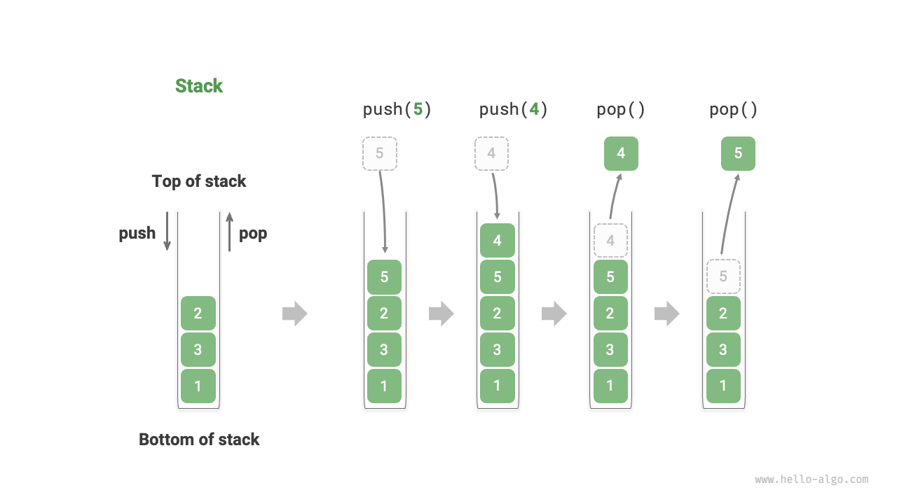
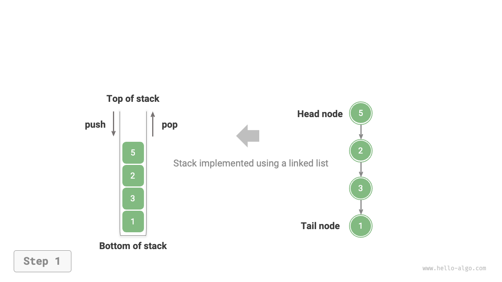
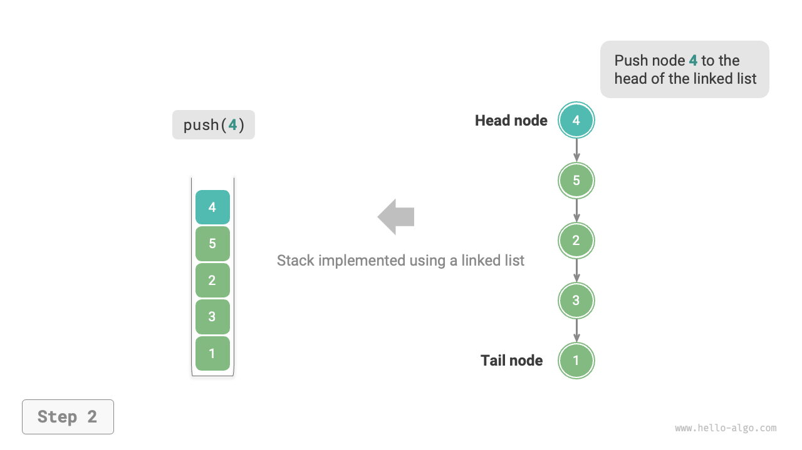
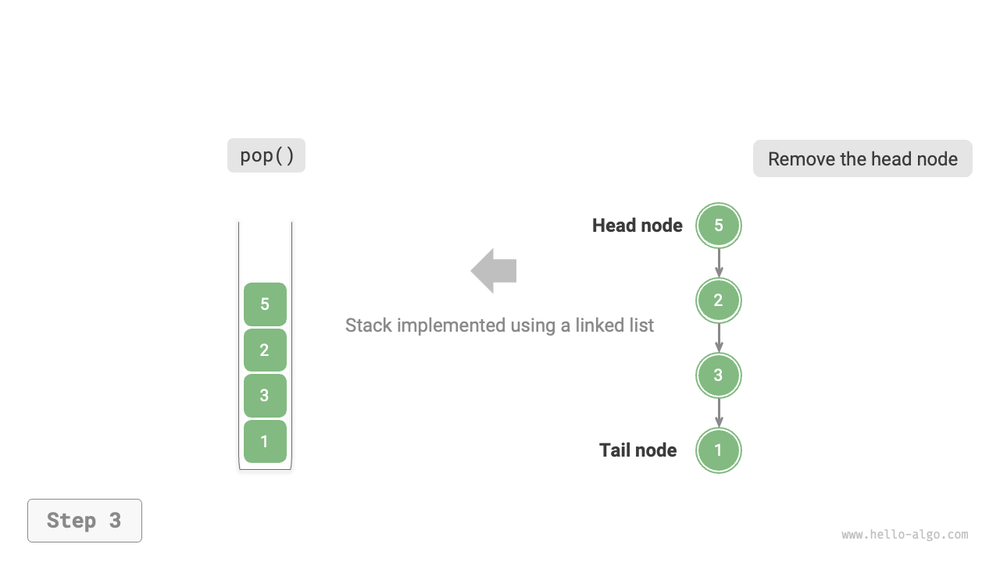
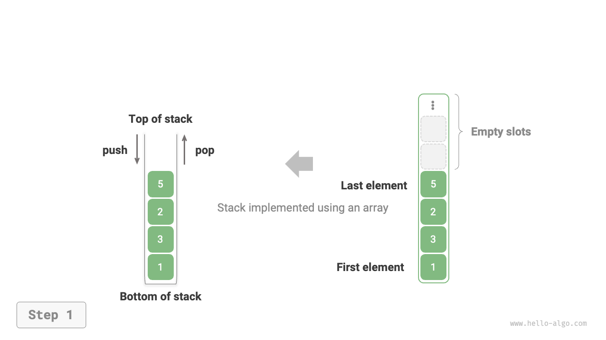
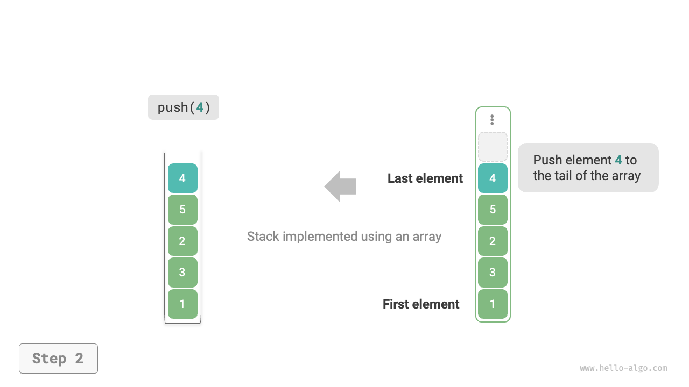
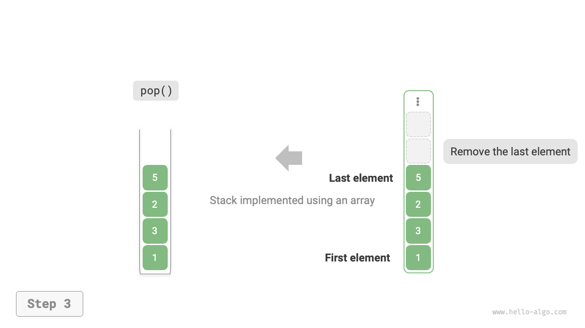

# スタック

<u>スタック（stack）</u>は、後入れ先出しの論理に従う線形データ構造です。

スタックは机の上に積まれた皿の山にたとえられます。1回に1枚の皿しか動かせないとすると、いちばん下の皿を取り出すには、上にある皿を順番にどかす必要があります。この皿をさまざまな型の要素（整数、文字、オブジェクトなど）に置き換えたものが、スタックというデータ構造です。

下図のように、積み重なった要素の上端を「スタックトップ」、下端を「スタックボトム」と呼びます。要素をスタックトップに追加する操作を「プッシュ」、スタックトップの要素を削除する操作を「ポップ」と呼びます。



## スタックの基本操作

スタックの基本操作を以下の表に示します。具体的なメソッド名は使用するプログラミング言語によって異なります。ここでは、一般的な `push()`、`pop()`、`peek()` を例に挙げます。

<p align="center"> 表 <id> &nbsp; スタックの操作効率 </p>

| メソッド | 説明                   | 時間計算量 |
| -------- | ---------------------- | ---------- |
| `push()` | 要素をプッシュする（スタックトップに追加） | $O(1)$     |
| `pop()`  | スタックトップの要素をポップする           | $O(1)$     |
| `peek()` | スタックトップの要素にアクセスする         | $O(1)$     |

通常は、プログラミング言語に組み込まれているスタッククラスをそのまま利用できます。ただし、専用のスタッククラスが用意されていない言語もあります。その場合は、その言語の「配列」や「連結リスト」をスタックとして用い、プログラムのロジック上でスタックに無関係な操作を無視します。

=== "Python"

    ```python title="stack.py"
    # スタックを初期化
    # Python には組み込みのスタッククラスがないため、list をスタックとして使用できる
    stack: list[int] = []

    # 要素をプッシュ
    stack.append(1)
    stack.append(3)
    stack.append(2)
    stack.append(5)
    stack.append(4)

    # スタックトップの要素にアクセス
    peek: int = stack[-1]

    # 要素をポップ
    pop: int = stack.pop()

    # スタックの長さを取得
    size: int = len(stack)

    # 空かどうかを判定
    is_empty: bool = len(stack) == 0
    ```

=== "C++"

    ```cpp title="stack.cpp"
    /* スタックを初期化 */
    stack<int> stack;

    /* 要素をプッシュ */
    stack.push(1);
    stack.push(3);
    stack.push(2);
    stack.push(5);
    stack.push(4);

    /* スタックトップの要素にアクセス */
    int top = stack.top();

    /* 要素をポップ */
    stack.pop(); // 戻り値なし

    /* スタックの長さを取得 */
    int size = stack.size();

    /* 空かどうかを判定 */
    bool empty = stack.empty();
    ```

=== "Java"

    ```java title="stack.java"
    /* スタックを初期化 */
    Stack<Integer> stack = new Stack<>();

    /* 要素をプッシュ */
    stack.push(1);
    stack.push(3);
    stack.push(2);
    stack.push(5);
    stack.push(4);

    /* スタックトップの要素にアクセス */
    int peek = stack.peek();

    /* 要素をポップ */
    int pop = stack.pop();

    /* スタックの長さを取得 */
    int size = stack.size();

    /* 空かどうかを判定 */
    boolean isEmpty = stack.isEmpty();
    ```

=== "C#"

    ```csharp title="stack.cs"
    /* スタックを初期化 */
    Stack<int> stack = new();

    /* 要素をプッシュ */
    stack.Push(1);
    stack.Push(3);
    stack.Push(2);
    stack.Push(5);
    stack.Push(4);

    /* スタックトップの要素にアクセス */
    int peek = stack.Peek();

    /* 要素をポップ */
    int pop = stack.Pop();

    /* スタックの長さを取得 */
    int size = stack.Count;

    /* 空かどうかを判定 */
    bool isEmpty = stack.Count == 0;
    ```

=== "Go"

    ```go title="stack_test.go"
    /* スタックを初期化 */
    // Go では、Slice をスタックとして使うのが一般的
    var stack []int

    /* 要素をプッシュ */
    stack = append(stack, 1)
    stack = append(stack, 3)
    stack = append(stack, 2)
    stack = append(stack, 5)
    stack = append(stack, 4)

    /* スタックトップの要素にアクセス */
    peek := stack[len(stack)-1]

    /* 要素をポップ */
    pop := stack[len(stack)-1]
    stack = stack[:len(stack)-1]

    /* スタックの長さを取得 */
    size := len(stack)

    /* 空かどうかを判定 */
    isEmpty := len(stack) == 0
    ```

=== "Swift"

    ```swift title="stack.swift"
    /* スタックを初期化 */
    // Swift には組み込みのスタッククラスがないため、Array をスタックとして使用できる
    var stack: [Int] = []

    /* 要素をプッシュ */
    stack.append(1)
    stack.append(3)
    stack.append(2)
    stack.append(5)
    stack.append(4)

    /* スタックトップの要素にアクセス */
    let peek = stack.last!

    /* 要素をポップ */
    let pop = stack.removeLast()

    /* スタックの長さを取得 */
    let size = stack.count

    /* 空かどうかを判定 */
    let isEmpty = stack.isEmpty
    ```

=== "JS"

    ```javascript title="stack.js"
    /* スタックを初期化 */
    // JavaScript には組み込みのスタッククラスがないため、Array をスタックとして使用できる
    const stack = [];

    /* 要素をプッシュ */
    stack.push(1);
    stack.push(3);
    stack.push(2);
    stack.push(5);
    stack.push(4);

    /* スタックトップの要素にアクセス */
    const peek = stack[stack.length-1];

    /* 要素をポップ */
    const pop = stack.pop();

    /* スタックの長さを取得 */
    const size = stack.length;

    /* 空かどうかを判定 */
    const is_empty = stack.length === 0;
    ```

=== "TS"

    ```typescript title="stack.ts"
    /* スタックを初期化 */
    // TypeScript には組み込みのスタッククラスがないため、Array をスタックとして使用できる
    const stack: number[] = [];

    /* 要素をプッシュ */
    stack.push(1);
    stack.push(3);
    stack.push(2);
    stack.push(5);
    stack.push(4);

    /* スタックトップの要素にアクセス */
    const peek = stack[stack.length - 1];

    /* 要素をポップ */
    const pop = stack.pop();

    /* スタックの長さを取得 */
    const size = stack.length;

    /* 空かどうかを判定 */
    const is_empty = stack.length === 0;
    ```

=== "Dart"

    ```dart title="stack.dart"
    /* スタックを初期化 */
    // Dart には組み込みのスタッククラスがないため、List をスタックとして使用できる
    List<int> stack = [];

    /* 要素をプッシュ */
    stack.add(1);
    stack.add(3);
    stack.add(2);
    stack.add(5);
    stack.add(4);

    /* スタックトップの要素にアクセス */
    int peek = stack.last;

    /* 要素をポップ */
    int pop = stack.removeLast();

    /* スタックの長さを取得 */
    int size = stack.length;

    /* 空かどうかを判定 */
    bool isEmpty = stack.isEmpty;
    ```

=== "Rust"

    ```rust title="stack.rs"
    /* スタックを初期化 */
    // Vec をスタックとして使用する
    let mut stack: Vec<i32> = Vec::new();

    /* 要素をプッシュ */
    stack.push(1);
    stack.push(3);
    stack.push(2);
    stack.push(5);
    stack.push(4);

    /* スタックトップの要素にアクセス */
    let top = stack.last().unwrap();

    /* 要素をポップ */
    let pop = stack.pop().unwrap();

    /* スタックの長さを取得 */
    let size = stack.len();

    /* 空かどうかを判定 */
    let is_empty = stack.is_empty();
    ```

=== "C"

    ```c title="stack.c"
    // C には組み込みのスタックがない
    ```

=== "Kotlin"

    ```kotlin title="stack.kt"
    /* スタックを初期化 */
    val stack = Stack<Int>()

    /* 要素をプッシュ */
    stack.push(1)
    stack.push(3)
    stack.push(2)
    stack.push(5)
    stack.push(4)

    /* スタックトップの要素にアクセス */
    val peek = stack.peek()

    /* 要素をポップ */
    val pop = stack.pop()

    /* スタックの長さを取得 */
    val size = stack.size

    /* 空かどうかを判定 */
    val isEmpty = stack.isEmpty()
    ```

=== "Ruby"

    ```ruby title="stack.rb"
    # スタックを初期化
    # Ruby には組み込みのスタッククラスがないため、Array をスタックとして使用できる
    stack = []

    # 要素をプッシュ
    stack << 1
    stack << 3
    stack << 2
    stack << 5
    stack << 4

    # スタックトップの要素にアクセス
    peek = stack.last

    # 要素をポップ
    pop = stack.pop

    # スタックの長さを取得
    size = stack.length

    # 空かどうかを判定
    is_empty = stack.empty?
    ```

??? pythontutor "実行の可視化"

    https://pythontutor.com/render.html#code=%22%22%22Driver%20Code%22%22%22%0Aif%20__name__%20%3D%3D%20%22__main__%22%3A%0A%20%20%20%20%23%20%E5%88%9D%E5%A7%8B%E5%8C%96%E6%A0%88%0A%20%20%20%20%23%20Python%20%E6%B2%A1%E6%9C%89%E5%86%85%E7%BD%AE%E7%9A%84%E6%A0%88%E7%B1%BB%EF%BC%8C%E5%8F%AF%E4%BB%A5%E6%8A%8A%20list%20%E5%BD%93%E4%BD%9C%E6%A0%88%E6%9D%A5%E4%BD%BF%E7%94%A8%0A%20%20%20%20stack%20%3D%20%5B%5D%0A%0A%20%20%20%20%23%20%E5%85%83%E7%B4%A0%E5%85%A5%E6%A0%88%0A%20%20%20%20stack.append%281%29%0A%20%20%20%20stack.append%283%29%0A%20%20%20%20stack.append%282%29%0A%20%20%20%20stack.append%285%29%0A%20%20%20%20stack.append%284%29%0A%20%20%20%20print%28%22%E6%A0%88%20stack%20%3D%22,%20stack%29%0A%0A%20%20%20%20%23%20%E8%AE%BF%E9%97%AE%E6%A0%88%E9%A1%B6%E5%85%83%E7%B4%A0%0A%20%20%20%20peek%20%3D%20stack%5B-1%5D%0A%20%20%20%20print%28%22%E6%A0%88%E9%A1%B6%E5%85%83%E7%B4%A0%20peek%20%3D%22,%20peek%29%0A%0A%20%20%20%20%23%20%E5%85%83%E7%B4%A0%E5%87%BA%E6%A0%88%0A%20%20%20%20pop%20%3D%20stack.pop%28%29%0A%20%20%20%20print%28%22%E5%87%BA%E6%A0%88%E5%85%83%E7%B4%A0%20pop%20%3D%22,%20pop%29%0A%20%20%20%20print%28%22%E5%87%BA%E6%A0%88%E5%90%8E%20stack%20%3D%22,%20stack%29%0A%0A%20%20%20%20%23%20%E8%8E%B7%E5%8F%96%E6%A0%88%E7%9A%84%E9%95%BF%E5%BA%A6%0A%20%20%20%20size%20%3D%20len%28stack%29%0A%20%20%20%20print%28%22%E6%A0%88%E7%9A%84%E9%95%BF%E5%BA%A6%20size%20%3D%22,%20size%29%0A%0A%20%20%20%20%23%20%E5%88%A4%E6%96%AD%E6%98%AF%E5%90%A6%E4%B8%BA%E7%A9%BA%0A%20%20%20%20is_empty%20%3D%20len%28stack%29%20%3D%3D%200%0A%20%20%20%20print%28%22%E6%A0%88%E6%98%AF%E5%90%A6%E4%B8%BA%E7%A9%BA%20%3D%22,%20is_empty%29&cumulative=false&curInstr=2&heapPrimitives=nevernest&mode=display&origin=opt-frontend.js&py=311&rawInputLstJSON=%5B%5D&textReferences=false

## スタックの実装

スタックの動作の仕組みをより深く理解するために、自分でスタッククラスを実装してみましょう。

スタックは後入れ先出しの原則に従うため、要素の追加や削除はスタックトップでしか行えません。一方、配列や連結リストでは任意の位置で要素を追加・削除できます。**つまり、スタックは制限付きの配列または連結リストとみなせます。** 言い換えると、配列や連結リストのうち無関係な操作を「隠蔽」することで、外から見た振る舞いをスタックの特性に合わせられます。

### 連結リストによる実装

連結リストでスタックを実装する場合、連結リストの先頭ノードをスタックトップ、末尾ノードをスタックボトムとみなせます。

下図のように、プッシュ操作では要素を連結リストの先頭に挿入するだけでよく、このノード挿入方法は「頭部挿入法」と呼ばれます。ポップ操作では、先頭ノードを連結リストから削除するだけです。

=== "LinkedListStack"
    

=== "push()"
    

=== "pop()"
    

以下は、連結リストによってスタックを実装したコード例です：

```src
[file]{linkedlist_stack}-[class]{linked_list_stack}-[func]{}
```

### 配列による実装

配列でスタックを実装する場合、配列の末尾をスタックトップとして扱えます。下図のように、プッシュとポップはそれぞれ配列末尾への要素追加と削除に対応し、どちらの時間計算量も $O(1)$ です。

=== "ArrayStack"
    

=== "push()"
    

=== "pop()"
    

プッシュされる要素は際限なく増える可能性があるため、動的配列を使えば、配列の拡張を自前で処理する必要がありません。以下にコード例を示します：

```src
[file]{array_stack}-[class]{array_stack}-[func]{}
```

## 2つの実装の比較

**対応する操作**

どちらの実装も、スタックの定義に含まれる各種操作をサポートします。配列ベースの実装はランダムアクセスも可能ですが、これはスタックの定義範囲を超えているため、通常は利用しません。

**時間効率**

配列ベースの実装では、プッシュとポップの両方があらかじめ確保された連続メモリ上で行われるため、キャッシュ局所性が高く、効率に優れます。ただし、プッシュ時に配列容量を超えると拡張処理が発生し、その1回のプッシュの時間計算量は $O(n)$ になります。

連結リストベースの実装では、サイズ拡張が非常に柔軟であり、前述のような配列拡張による効率低下はありません。ただし、プッシュ時にはノードオブジェクトの初期化とポインタの更新が必要になるため、効率は相対的に低くなります。もっとも、プッシュする要素自体がノードオブジェクトであれば、初期化の手間を省けるため、効率を高められます。

以上を踏まえると、プッシュおよびポップの対象が `int` や `double` のような基本データ型である場合、次の結論が得られます。

- 配列ベースのスタックは拡張時に効率が低下しますが、拡張は低頻度の操作であるため、平均効率はより高くなります。
- 連結リストベースのスタックは、より安定した効率を提供できます。

**空間効率**

リストを初期化するとき、システムは「初期容量」を割り当てますが、この容量は実際の必要量を上回ることがあります。また、拡張は通常、一定の倍率（たとえば2倍）で行われるため、拡張後の容量も実際の必要量を超える可能性があります。したがって、**配列ベースのスタックは一定のメモリ浪費を招く可能性があります。**

一方で、連結リストのノードはポインタを追加で保持する必要があるため、**連結リストノードは相対的に大きな領域を占有します。**

以上より、どちらの実装がより省メモリかを単純に断定することはできず、具体的な状況に応じて分析する必要があります。

## スタックの典型的な応用

- **ブラウザにおける戻ると進む、ソフトウェアにおける取り消しとやり直し**。新しいWebページを開くたびに、ブラウザは直前のページをスタックにプッシュするため、戻る操作によって前のページに戻れます。戻る操作は実際にはポップに相当します。戻ると進むを同時にサポートするには、2つのスタックを組み合わせて実現する必要があります。
- **プログラムのメモリ管理**。関数を呼び出すたびに、システムはスタックトップにスタックフレームを追加し、関数のコンテキスト情報を記録します。再帰関数では、下向きに再帰していく段階でプッシュが繰り返され、上向きにバックトラックする段階でポップが繰り返されます。
