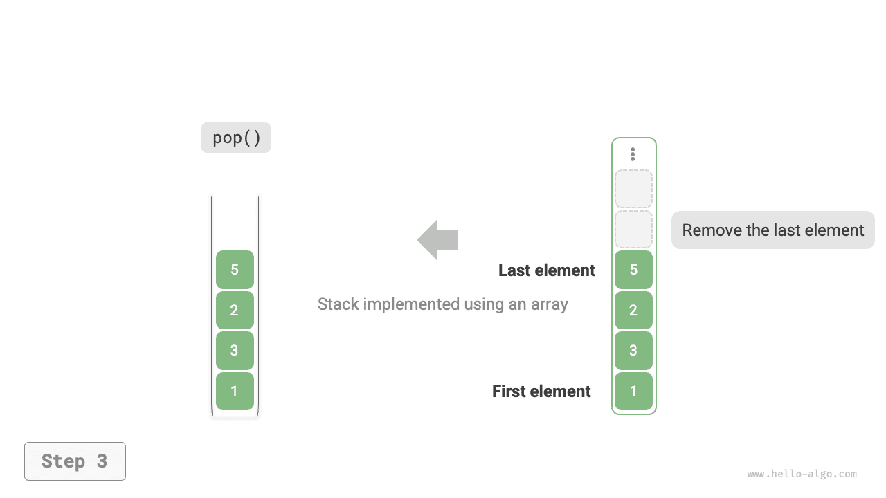

# スタック

<u>スタック（stack）</u>は、先入れ後出しの規則に従う線形データ構造です。

机の上に重ねた皿に例えられます。一度に一枚しか動かせないなら、一番下の皿を取るには、上の皿から順に取り除く必要があります。皿を整数、文字、オブジェクトなどの要素に置き換えると、スタックというデータ構造になります。

下図のように、積み重ねた要素の上端を「スタックの先頭」、下端を「底」と呼びます。先頭に要素を追加する操作を「プッシュ」、先頭要素を削除する操作を「ポップ」と呼びます。


## スタックの主な操作

主な操作を下表に示します。具体的なメソッド名は言語によりますが、ここでは一般的な `push()`、`pop()`、`peek()` を例にします。

<p align="center"> 表 <id> &nbsp; スタックの操作効率 </p>

| メソッド     | 説明                   | 時間計算量 |
| -------- | ---------------------- | ---------- |
| `push()` | 要素をプッシュする（先頭に追加） | $O(1)$     |
| `pop()`  | 先頭要素をポップする           | $O(1)$     |
| `peek()` | 先頭要素にアクセスする           | $O(1)$     |

通常は、言語に組み込まれたスタッククラスをそのまま使えます。専用クラスがない言語では、配列や連結リストをスタックとして使い、スタックに関係しない操作をプログラムの論理上使わないようにします。

=== "Python"

    ```python title="stack.py"
    # スタックを初期化
    # Python には組み込みのスタッククラスがないため、list をスタックとして使える
    stack: list[int] = []

    # 要素をプッシュ
    stack.append(1)
    stack.append(3)
    stack.append(2)
    stack.append(5)
    stack.append(4)

    # スタックの先頭要素にアクセス
    peek: int = stack[-1]

    # 要素をポップ
    pop: int = stack.pop()

    # スタックの長さを取得
    size: int = len(stack)

    # 空かどうかを判定
    is_empty: bool = len(stack) == 0
    ```

=== "C++"

    ```cpp title="stack.cpp"
    /* スタックを初期化 */
    stack<int> stack;

    /* 要素をプッシュ */
    stack.push(1);
    stack.push(3);
    stack.push(2);
    stack.push(5);
    stack.push(4);

    /* スタックの先頭要素にアクセス */
    int top = stack.top();

    /* 要素をポップ */
    stack.pop(); // 戻り値なし

    /* スタックの長さを取得 */
    int size = stack.size();

    /* 空かどうかを判定 */
    bool empty = stack.empty();
    ```

=== "Java"

    ```java title="stack.java"
    /* スタックを初期化 */
    Stack<Integer> stack = new Stack<>();

    /* 要素をプッシュ */
    stack.push(1);
    stack.push(3);
    stack.push(2);
    stack.push(5);
    stack.push(4);

    /* スタックの先頭要素にアクセス */
    int peek = stack.peek();

    /* 要素をポップ */
    int pop = stack.pop();

    /* スタックの長さを取得 */
    int size = stack.size();

    /* 空かどうかを判定 */
    boolean isEmpty = stack.isEmpty();
    ```

=== "C#"

    ```csharp title="stack.cs"
    /* スタックを初期化 */
    Stack<int> stack = new();

    /* 要素をプッシュ */
    stack.Push(1);
    stack.Push(3);
    stack.Push(2);
    stack.Push(5);
    stack.Push(4);

    /* スタックの先頭要素にアクセス */
    int peek = stack.Peek();

    /* 要素をポップ */
    int pop = stack.Pop();

    /* スタックの長さを取得 */
    int size = stack.Count;

    /* 空かどうかを判定 */
    bool isEmpty = stack.Count == 0;
    ```

=== "Go"

    ```go title="stack_test.go"
    /* スタックを初期化 */
    // Go では Slice をスタックとして使うことを推奨
    var stack []int

    /* 要素をプッシュ */
    stack = append(stack, 1)
    stack = append(stack, 3)
    stack = append(stack, 2)
    stack = append(stack, 5)
    stack = append(stack, 4)

    /* スタックの先頭要素にアクセス */
    peek := stack[len(stack)-1]

    /* 要素をポップ */
    pop := stack[len(stack)-1]
    stack = stack[:len(stack)-1]

    /* スタックの長さを取得 */
    size := len(stack)

    /* 空かどうかを判定 */
    isEmpty := len(stack) == 0
    ```

=== "Swift"

    ```swift title="stack.swift"
    /* スタックを初期化 */
    // Swift には組み込みのスタッククラスがないため、Array をスタックとして使える
    var stack: [Int] = []

    /* 要素をプッシュ */
    stack.append(1)
    stack.append(3)
    stack.append(2)
    stack.append(5)
    stack.append(4)

    /* スタックの先頭要素にアクセス */
    let peek = stack.last!

    /* 要素をポップ */
    let pop = stack.removeLast()

    /* スタックの長さを取得 */
    let size = stack.count

    /* 空かどうかを判定 */
    let isEmpty = stack.isEmpty
    ```

=== "JS"

    ```javascript title="stack.js"
    /* スタックを初期化 */
    // JavaScript には組み込みのスタッククラスがないため、Array をスタックとして使える
    const stack = [];

    /* 要素をプッシュ */
    stack.push(1);
    stack.push(3);
    stack.push(2);
    stack.push(5);
    stack.push(4);

    /* スタックの先頭要素にアクセス */
    const peek = stack[stack.length-1];

    /* 要素をポップ */
    const pop = stack.pop();

    /* スタックの長さを取得 */
    const size = stack.length;

    /* 空かどうかを判定 */
    const is_empty = stack.length === 0;
    ```

=== "TS"

    ```typescript title="stack.ts"
    /* スタックを初期化 */
    // TypeScript には組み込みのスタッククラスがないため、Array をスタックとして使える
    const stack: number[] = [];

    /* 要素をプッシュ */
    stack.push(1);
    stack.push(3);
    stack.push(2);
    stack.push(5);
    stack.push(4);

    /* スタックの先頭要素にアクセス */
    const peek = stack[stack.length - 1];

    /* 要素をポップ */
    const pop = stack.pop();

    /* スタックの長さを取得 */
    const size = stack.length;

    /* 空かどうかを判定 */
    const is_empty = stack.length === 0;
    ```

=== "Dart"

    ```dart title="stack.dart"
    /* スタックを初期化 */
    // Dart には組み込みのスタッククラスがないため、List をスタックとして使える
    List<int> stack = [];

    /* 要素をプッシュ */
    stack.add(1);
    stack.add(3);
    stack.add(2);
    stack.add(5);
    stack.add(4);

    /* スタックの先頭要素にアクセス */
    int peek = stack.last;

    /* 要素をポップ */
    int pop = stack.removeLast();

    /* スタックの長さを取得 */
    int size = stack.length;

    /* 空かどうかを判定 */
    bool isEmpty = stack.isEmpty;
    ```

=== "Rust"

    ```rust title="stack.rs"
    /* スタックを初期化 */
    // Vec をスタックとして使う
    let mut stack: Vec<i32> = Vec::new();

    /* 要素をプッシュ */
    stack.push(1);
    stack.push(3);
    stack.push(2);
    stack.push(5);
    stack.push(4);

    /* スタックの先頭要素にアクセス */
    let top = stack.last().unwrap();

    /* 要素をポップ */
    let pop = stack.pop().unwrap();

    /* スタックの長さを取得 */
    let size = stack.len();

    /* 空かどうかを判定 */
    let is_empty = stack.is_empty();
    ```

=== "C"

    ```c title="stack.c"
    // C には組み込みのスタックがない
    ```

=== "Kotlin"

    ```kotlin title="stack.kt"
    /* スタックを初期化 */
    val stack = Stack<Int>()

    /* 要素をプッシュ */
    stack.push(1)
    stack.push(3)
    stack.push(2)
    stack.push(5)
    stack.push(4)

    /* スタックの先頭要素にアクセス */
    val peek = stack.peek()

    /* 要素をポップ */
    val pop = stack.pop()

    /* スタックの長さを取得 */
    val size = stack.size

    /* 空かどうかを判定 */
    val isEmpty = stack.isEmpty()
    ```

=== "Ruby"

    ```ruby title="stack.rb"
    # スタックを初期化
    # Ruby には組み込みのスタッククラスがないため、Array をスタックとして使える
    stack = []

    # 要素をプッシュ
    stack << 1
    stack << 3
    stack << 2
    stack << 5
    stack << 4

    # スタックの先頭要素にアクセス
    peek = stack.last

    # 要素をポップ
    pop = stack.pop

    # スタックの長さを取得
    size = stack.length

    # 空かどうかを判定
    is_empty = stack.empty?
    ```

??? pythontutor "実行の可視化"

    https://pythontutor.com/render.html#code=%22%22%22%E5%AE%9F%E8%A1%8C%E7%94%A8%E3%82%B3%E3%83%BC%E3%83%89%22%22%22%0Aif%20__name__%20%3D%3D%20%22__main__%22%3A%0A%20%20%20%20%23%20%E3%82%B9%E3%82%BF%E3%83%83%E3%82%AF%E3%82%92%E5%88%9D%E6%9C%9F%E5%8C%96%0A%20%20%20%20%23%20Python%20%E3%81%AB%E3%81%AF%E7%B5%84%E3%81%BF%E8%BE%BC%E3%81%BF%E3%81%AE%E3%82%B9%E3%82%BF%E3%83%83%E3%82%AF%E3%82%AF%E3%83%A9%E3%82%B9%E3%81%8C%E3%81%AA%E3%81%84%E3%81%9F%E3%82%81%E3%80%81list%20%E3%82%92%E3%82%B9%E3%82%BF%E3%83%83%E3%82%AF%E3%81%A8%E3%81%97%E3%81%A6%E4%BD%BF%E3%81%88%E3%82%8B%0A%20%20%20%20stack%20%3D%20%5B%5D%0A%0A%20%20%20%20%23%20%E8%A6%81%E7%B4%A0%E3%82%92%E3%83%97%E3%83%83%E3%82%B7%E3%83%A5%0A%20%20%20%20stack.append(1)%0A%20%20%20%20stack.append(3)%0A%20%20%20%20stack.append(2)%0A%20%20%20%20stack.append(5)%0A%20%20%20%20stack.append(4)%0A%20%20%20%20print(%22%E3%82%B9%E3%82%BF%E3%83%83%E3%82%AF%20stack%20%3D%22%2C%20stack)%0A%0A%20%20%20%20%23%20%E3%82%B9%E3%82%BF%E3%83%83%E3%82%AF%E3%81%AE%E5%85%88%E9%A0%AD%E8%A6%81%E7%B4%A0%E3%81%AB%E3%82%A2%E3%82%AF%E3%82%BB%E3%82%B9%0A%20%20%20%20peek%20%3D%20stack%5B-1%5D%0A%20%20%20%20print(%22%E3%82%B9%E3%82%BF%E3%83%83%E3%82%AF%E3%81%AE%E5%85%88%E9%A0%AD%E8%A6%81%E7%B4%A0%20peek%20%3D%22%2C%20peek)%0A%0A%20%20%20%20%23%20%E8%A6%81%E7%B4%A0%E3%82%92%E3%83%9D%E3%83%83%E3%83%97%0A%20%20%20%20pop%20%3D%20stack.pop()%0A%20%20%20%20print(%22%E3%83%9D%E3%83%83%E3%83%97%E3%81%97%E3%81%9F%E8%A6%81%E7%B4%A0%20pop%20%3D%22%2C%20pop)%0A%20%20%20%20print(%22%E3%83%9D%E3%83%83%E3%83%97%E3%81%97%E3%81%9F%E5%BE%8C%E3%81%AE%20stack%20%3D%22%2C%20stack)%0A%0A%20%20%20%20%23%20%E3%82%B9%E3%82%BF%E3%83%83%E3%82%AF%E3%81%AE%E9%95%B7%E3%81%95%E3%82%92%E5%8F%96%E5%BE%97%0A%20%20%20%20size%20%3D%20len(stack)%0A%20%20%20%20print(%22%E3%82%B9%E3%82%BF%E3%83%83%E3%82%AF%E3%81%AE%E9%95%B7%E3%81%95%20size%20%3D%22%2C%20size)%0A%0A%20%20%20%20%23%20%E7%A9%BA%E3%81%8B%E3%81%A9%E3%81%86%E3%81%8B%E3%82%92%E5%88%A4%E5%AE%9A%0A%20%20%20%20is_empty%20%3D%20len(stack)%20%3D%3D%200%0A%20%20%20%20print(%22%E3%82%B9%E3%82%BF%E3%83%83%E3%82%AF%E3%81%AF%E7%A9%BA%E3%81%8B%20%3D%22%2C%20is_empty)&cumulative=false&curInstr=2&heapPrimitives=nevernest&mode=display&origin=opt-frontend.js&py=311&rawInputLstJSON=%5B%5D&textReferences=false

## スタックの実装

動作の仕組みを深く理解するため、スタッククラスを自分で実装してみましょう。

スタックは先入れ後出しなので、要素の追加と削除は先頭でしかできません。一方、配列や連結リストは任意の位置で追加や削除ができるため、**スタックは制限を加えた配列や連結リストと見なせます**。つまり、不要な操作を使えなくすることで、外から見た動作をスタックの性質に合わせられます。

### 連結リストによる実装

連結リストを使う場合、先頭ノードをスタックの先頭、末尾ノードを底と見なせます。

下図のように、プッシュではリストの先頭へ要素を挿入するだけです。この方法を「先頭挿入」と呼びます。ポップでは、先頭ノードをリストから削除するだけです。

=== "<1>"
    

=== "<2>"
    

=== "<3>"
    

連結リストによる実装例を示します。

```src
[file]{linkedlist_stack}-[class]{linked_list_stack}-[func]{}
```

### 配列による実装

配列を使う場合、配列の末尾をスタックの先頭にできます。下図のように、プッシュとポップは配列末尾への追加と削除に対応し、どちらも時間計算量は $O(1)$ です。

=== "<1>"
    

=== "<2>"
    

=== "<3>"
    

プッシュする要素が増え続ける可能性があるため、動的配列を使うと、容量拡張を自分で処理せずに済みます。コード例を示します。

```src
[file]{array_stack}-[class]{array_stack}-[func]{}
```

## 二つの実装の比較

**対応する操作**

どちらもスタックで定義された操作をすべて実現できます。配列の実装はランダムアクセスにも対応しますが、スタックの定義を超えるため、通常は使いません。

**時間効率**

配列の実装では、プッシュとポップは確保済みの連続したメモリ上で行われます。キャッシュの局所性がよいため、効率が高くなります。ただし、プッシュで容量を超えると拡張が発生し、その一回の時間計算量は $O(n)$ になります。

連結リストは柔軟に拡張できるため、配列の容量拡張による効率低下はありません。ただし、プッシュ時にノードの初期化とポインタの変更が必要なので、効率は比較的低くなります。要素自体がノードオブジェクトなら、初期化を省いて効率を高められます。

以上より、`int` や `double` などの基本データ型をプッシュ・ポップする場合、次のように結論付けられます。

- 配列によるスタックは、拡張時に効率が下がるものの、その頻度は低いため、平均的な効率は高くなります。
- 連結リストによるスタックは、より安定した効率を提供できます。

**空間効率**

リストを初期化すると、実際の必要量を超える場合がある初期容量が割り当てられます。また、拡張は通常、2 倍など一定の倍率で行うため、拡張後も必要量を超える可能性があります。したがって、**配列によるスタックでは、ある程度の領域が無駄になる場合があります**。

一方、連結リストのノードはポインタも格納するため、**一つのノードが使う領域は比較的大きくなります**。

どちらがメモリを節約できるかは一概に決められず、具体的な状況を分析する必要があります。

## スタックの代表的な用途

- **ブラウザの戻る・進む、ソフトウェアの元に戻す・やり直す**。新しいページを開くたびに、ブラウザは前のページをプッシュします。戻る操作で前のページに戻るときは、実際にはポップを行っています。戻ると進むの両方に対応するには、二つのスタックを組み合わせます。
- **プログラムのメモリ管理**。関数を呼ぶたびに、システムはスタックの先頭にスタックフレームを追加し、関数の実行状況を記録します。再帰関数では、呼び出しを深める段階でプッシュを繰り返し、戻る段階でポップを繰り返します。
