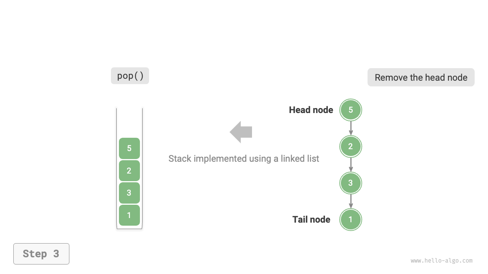

# 5.1 &nbsp; スタック

<u>スタック</u>は、後入先出（LIFO）の原則に従う線形データ構造です。

スタックをテーブル上の皿の山に例えることができます。底の皿にアクセスするには、まず上の皿を取り除く必要があります。皿を様々な種類の要素（整数、文字、オブジェクトなど）に置き換えることで、スタックと呼ばれるデータ構造を得ることができます。

下図に示すように、要素の山の上部を「スタックのトップ」、下部を「スタックのボトム」と呼びます。スタックのトップに要素を追加する操作を「プッシュ」、トップ要素を削除する操作を「ポップ」と呼びます。

{ class="animation-figure" }

<p align="center"> 図 5-1 &nbsp; スタックの後入先出ルール </p>

## 5.1.1 &nbsp; スタックの一般的な操作

スタックの一般的な操作を下表に示します。具体的なメソッド名は使用するプログラミング言語によって異なります。ここでは、例として`push()`、`pop()`、`peek()`を使用します。

<p align="center"> 表 5-1 &nbsp; スタック操作の効率 </p>

<div class="center-table" markdown>

| メソッド   | 説明                                     | 時間計算量 |
| -------- | ----------------------------------------------- | --------------- |
| `push()` | 要素をスタックにプッシュ（トップに追加） | $O(1)$          |
| `pop()`  | スタックからトップ要素をポップ              | $O(1)$          |
| `peek()` | スタックのトップ要素にアクセス             | $O(1)$          |

</div>

通常、プログラミング言語に組み込まれているスタッククラスを直接使用できます。ただし、一部の言語では具体的にスタッククラスを提供していない場合があります。これらの場合、言語の「配列」または「連結リスト」をスタックとして使用し、プログラムでスタックロジックに関連しない操作を無視できます。

=== "Python"

    ```python title="stack.py"
    # スタックを初期化
    # Pythonには組み込みのスタッククラスがないため、listをスタックとして使用
    stack: list[int] = []

    # 要素をスタックにプッシュ
    stack.append(1)
    stack.append(3)
    stack.append(2)
    stack.append(5)
    stack.append(4)

    # スタックのトップ要素にアクセス
    peek: int = stack[-1]

    # スタックから要素をポップ
    pop: int = stack.pop()

    # スタックの長さを取得
    size: int = len(stack)

    # スタックが空かどうかチェック
    is_empty: bool = len(stack) == 0
    ```

=== "C++"

    ```cpp title="stack.cpp"
    /* スタックを初期化 */
    stack<int> stack;

    /* 要素をスタックにプッシュ */
    stack.push(1);
    stack.push(3);
    stack.push(2);
    stack.push(5);
    stack.push(4);

    /* スタックのトップ要素にアクセス */
    int top = stack.top();

    /* スタックから要素をポップ */
    stack.pop(); // 戻り値なし

    /* スタックの長さを取得 */
    int size = stack.size();

    /* スタックが空かどうかチェック */
    bool empty = stack.empty();
    ```

=== "Java"

    ```java title="stack.java"
    /* スタックを初期化 */
    Stack<Integer> stack = new Stack<>();

    /* 要素をスタックにプッシュ */
    stack.push(1);
    stack.push(3);
    stack.push(2);
    stack.push(5);
    stack.push(4);

    /* スタックのトップ要素にアクセス */
    int peek = stack.peek();

    /* スタックから要素をポップ */
    int pop = stack.pop();

    /* スタックの長さを取得 */
    int size = stack.size();

    /* スタックが空かどうかチェック */
    boolean isEmpty = stack.isEmpty();
    ```

=== "C#"

    ```csharp title="stack.cs"
    /* スタックを初期化 */
    Stack<int> stack = new();

    /* 要素をスタックにプッシュ */
    stack.Push(1);
    stack.Push(3);
    stack.Push(2);
    stack.Push(5);
    stack.Push(4);

    /* スタックのトップ要素にアクセス */
    int peek = stack.Peek();

    /* スタックから要素をポップ */
    int pop = stack.Pop();

    /* スタックの長さを取得 */
    int size = stack.Count;

    /* スタックが空かどうかチェック */
    bool isEmpty = stack.Count == 0;
    ```

=== "Go"

    ```go title="stack_test.go"
    /* スタックを初期化 */
    // Goでは、Sliceをスタックとして使用することが推奨されます
    var stack []int

    /* 要素をスタックにプッシュ */
    stack = append(stack, 1)
    stack = append(stack, 3)
    stack = append(stack, 2)
    stack = append(stack, 5)
    stack = append(stack, 4)

    /* スタックのトップ要素にアクセス */
    peek := stack[len(stack)-1]

    /* スタックから要素をポップ */
    pop := stack[len(stack)-1]
    stack = stack[:len(stack)-1]

    /* スタックの長さを取得 */
    size := len(stack)

    /* スタックが空かどうかチェック */
    isEmpty := len(stack) == 0
    ```

=== "Swift"

    ```swift title="stack.swift"
    /* スタックを初期化 */
    // Swiftには組み込みのスタッククラスがないため、Arrayをスタックとして使用
    var stack: [Int] = []

    /* 要素をスタックにプッシュ */
    stack.append(1)
    stack.append(3)
    stack.append(2)
    stack.append(5)
    stack.append(4)

    /* スタックのトップ要素にアクセス */
    let peek = stack.last!

    /* スタックから要素をポップ */
    let pop = stack.removeLast()

    /* スタックの長さを取得 */
    let size = stack.count

    /* スタックが空かどうかチェック */
    let isEmpty = stack.isEmpty
    ```

=== "JS"

    ```javascript title="stack.js"
    /* スタックを初期化 */
    // JavaScriptには組み込みのスタッククラスがないため、Arrayをスタックとして使用
    const stack = [];

    /* 要素をスタックにプッシュ */
    stack.push(1);
    stack.push(3);
    stack.push(2);
    stack.push(5);
    stack.push(4);

    /* スタックのトップ要素にアクセス */
    const peek = stack[stack.length-1];

    /* スタックから要素をポップ */
    const pop = stack.pop();

    /* スタックの長さを取得 */
    const size = stack.length;

    /* スタックが空かどうかチェック */
    const is_empty = stack.length === 0;
    ```

=== "TS"

    ```typescript title="stack.ts"
    /* スタックを初期化 */
    // TypeScriptには組み込みのスタッククラスがないため、Arrayをスタックとして使用
    const stack: number[] = [];

    /* 要素をスタックにプッシュ */
    stack.push(1);
    stack.push(3);
    stack.push(2);
    stack.push(5);
    stack.push(4);

    /* スタックのトップ要素にアクセス */
    const peek = stack[stack.length - 1];

    /* スタックから要素をポップ */
    const pop = stack.pop();

    /* スタックの長さを取得 */
    const size = stack.length;

    /* スタックが空かどうかチェック */
    const is_empty = stack.length === 0;
    ```

=== "Dart"

    ```dart title="stack.dart"
    /* スタックを初期化 */
    // Dartには組み込みのスタッククラスがないため、Listをスタックとして使用
    List<int> stack = [];

    /* 要素をスタックにプッシュ */
    stack.add(1);
    stack.add(3);
    stack.add(2);
    stack.add(5);
    stack.add(4);

    /* スタックのトップ要素にアクセス */
    int peek = stack.last;

    /* スタックから要素をポップ */
    int pop = stack.removeLast();

    /* スタックの長さを取得 */
    int size = stack.length;

    /* スタックが空かどうかチェック */
    bool isEmpty = stack.isEmpty;
    ```

=== "Rust"

    ```rust title="stack.rs"
    /* スタックを初期化 */
    // Vecをスタックとして使用
    let mut stack: Vec<i32> = Vec::new();

    /* 要素をスタックにプッシュ */
    stack.push(1);
    stack.push(3);
    stack.push(2);
    stack.push(5);
    stack.push(4);

    /* スタックのトップ要素にアクセス */
    let top = stack.last().unwrap();

    /* スタックから要素をポップ */
    let pop = stack.pop().unwrap();

    /* スタックの長さを取得 */
    let size = stack.len();

    /* スタックが空かどうかチェック */
    let is_empty = stack.is_empty();
    ```

=== "C"

    ```c title="stack.c"
    // Cは組み込みのスタックを提供していません
    ```

=== "Kotlin"

    ```kotlin title="stack.kt"

    ```

## 5.1.2 &nbsp; スタックの実装

スタックがどのように動作するかをより深く理解するために、自分でスタッククラスを実装してみましょう。

スタックは後入先出の原則に従うため、スタックのトップでのみ要素を追加または削除できます。しかし、配列と連結リストの両方は任意の位置で要素を追加・削除できるため、**スタックは制限された配列または連結リストと見なすことができます**。言い換えれば、配列や連結リストの特定の無関係な操作を「遮蔽」して、外部の動作をスタックの特性に合わせることができます。

### 1. &nbsp; 連結リストベースの実装

連結リストを使用してスタックを実装する場合、リストのヘッドノードをスタックのトップ、テールノードをスタックのボトムと考えることができます。

下図に示すように、プッシュ操作では、単に連結リストのヘッドに要素を挿入します。このノード挿入方法は「ヘッド挿入」として知られています。ポップ操作では、リストからヘッドノードを削除するだけです。

=== "LinkedListStack"
    { class="animation-figure" }

=== "push()"
    { class="animation-figure" }

=== "pop()"
    { class="animation-figure" }

<p align="center"> 図 5-2 &nbsp; 連結リストによるスタック実装のプッシュとポップ操作 </p>

以下は、連結リストに基づくスタック実装のサンプルコードです：

=== "Python"

    ```python title="linkedlist_stack.py"
    class LinkedListStack:
        """連結リストベースのスタッククラス"""

        def __init__(self):
            """コンストラクタ"""
            self._peek: ListNode | None = None
            self._size: int = 0

        def size(self) -> int:
            """スタックの長さを取得"""
            return self._size

        def is_empty(self) -> bool:
            """スタックが空かどうかを判定"""
            return self._size == 0

        def push(self, val: int):
            """プッシュ"""
            node = ListNode(val)
            node.next = self._peek
            self._peek = node
            self._size += 1

        def pop(self) -> int:
            """ポップ"""
            num = self.peek()
            self._peek = self._peek.next
            self._size -= 1
            return num

        def peek(self) -> int:
            """スタックトップ要素にアクセス"""
            if self.is_empty():
                raise IndexError("Stack is empty")
            return self._peek.val

        def to_list(self) -> list[int]:
            """出力用のリストに変換"""
            arr = []
            node = self._peek
            while node:
                arr.append(node.val)
                node = node.next
            arr.reverse()
            return arr
    ```

=== "C++"

    ```cpp title="linkedlist_stack.cpp"
    /* 連結リストに基づくスタッククラス */
    class LinkedListStack {
      private:
        ListNode *stackTop; // 先頭ノードをスタックトップとして使用
        int stkSize;        // スタックの長さ

      public:
        LinkedListStack() {
            stackTop = nullptr;
            stkSize = 0;
        }

        ~LinkedListStack() {
            // 連結リストを走査、ノードを削除、メモリを解放
            freeMemoryLinkedList(stackTop);
        }

        /* スタックの長さを取得 */
        int size() {
            return stkSize;
        }

        /* スタックが空かどうかを判定 */
        bool isEmpty() {
            return size() == 0;
        }

        /* プッシュ */
        void push(int num) {
            ListNode *node = new ListNode(num);
            node->next = stackTop;
            stackTop = node;
            stkSize++;
        }

        /* ポップ */
        int pop() {
            int num = top();
            ListNode *tmp = stackTop;
            stackTop = stackTop->next;
            // メモリを解放
            delete tmp;
            stkSize--;
            return num;
        }

        /* スタックトップ要素にアクセス */
        int top() {
            if (isEmpty())
                throw out_of_range("Stack is empty");
            return stackTop->val;
        }

        /* リストを配列に変換して返却 */
        vector<int> toVector() {
            ListNode *node = stackTop;
            vector<int> res(size());
            for (int i = res.size() - 1; i >= 0; i--) {
                res[i] = node->val;
                node = node->next;
            }
            return res;
        }
    };
    ```

=== "Java"

    ```java title="linkedlist_stack.java"
    /* 連結リストに基づくスタッククラス */
    class LinkedListStack {
        private ListNode stackPeek; // ヘッドノードをスタックトップとして使用
        private int stkSize = 0; // スタックの長さ

        public LinkedListStack() {
            stackPeek = null;
        }

        /* スタックの長さを取得 */
        public int size() {
            return stkSize;
        }

        /* スタックが空かどうかを判定 */
        public boolean isEmpty() {
            return size() == 0;
        }

        /* プッシュ */
        public void push(int num) {
            ListNode node = new ListNode(num);
            node.next = stackPeek;
            stackPeek = node;
            stkSize++;
        }

        /* ポップ */
        public int pop() {
            int num = peek();
            stackPeek = stackPeek.next;
            stkSize--;
            return num;
        }

        /* スタックトップ要素にアクセス */
        public int peek() {
            if (isEmpty())
                throw new IndexOutOfBoundsException();
            return stackPeek.val;
        }

        /* List を Array に変換して返す */
        public int[] toArray() {
            ListNode node = stackPeek;
            int[] res = new int[size()];
            for (int i = res.length - 1; i >= 0; i--) {
                res[i] = node.val;
                node = node.next;
            }
            return res;
        }
    }
    ```

=== "C#"

    ```csharp title="linkedlist_stack.cs"
    [class]{LinkedListStack}-[func]{}
    ```

=== "Go"

    ```go title="linkedlist_stack.go"
    [class]{linkedListStack}-[func]{}
    ```

=== "Swift"

    ```swift title="linkedlist_stack.swift"
    [class]{LinkedListStack}-[func]{}
    ```

=== "JS"

    ```javascript title="linkedlist_stack.js"
    [class]{LinkedListStack}-[func]{}
    ```

=== "TS"

    ```typescript title="linkedlist_stack.ts"
    [class]{LinkedListStack}-[func]{}
    ```

=== "Dart"

    ```dart title="linkedlist_stack.dart"
    [class]{LinkedListStack}-[func]{}
    ```

=== "Rust"

    ```rust title="linkedlist_stack.rs"
    [class]{LinkedListStack}-[func]{}
    ```

=== "C"

    ```c title="linkedlist_stack.c"
    [class]{LinkedListStack}-[func]{}
    ```

=== "Kotlin"

    ```kotlin title="linkedlist_stack.kt"
    [class]{LinkedListStack}-[func]{}
    ```

=== "Ruby"

    ```ruby title="linkedlist_stack.rb"
    [class]{LinkedListStack}-[func]{}
    ```

### 2. &nbsp; 配列ベースの実装

配列を使用してスタックを実装する場合、配列の末尾をスタックのトップと考えることができます。下図に示すように、プッシュとポップ操作は、それぞれ配列の末尾での要素の追加と削除に対応し、どちらも時間計算量$O(1)$です。

=== "ArrayStack"
    { class="animation-figure" }

=== "push()"
    { class="animation-figure" }

=== "pop()"
    { class="animation-figure" }

<p align="center"> 図 5-3 &nbsp; 配列によるスタック実装のプッシュとポップ操作 </p>

スタックにプッシュされる要素が継続的に増加する可能性があるため、動的配列を使用でき、配列拡張を自分で処理する必要がありません。以下はサンプルコードです：

=== "Python"

    ```python title="array_stack.py"
    class ArrayStack:
        """配列ベースのスタッククラス"""

        def __init__(self):
            """コンストラクタ"""
            self._stack: list[int] = []

        def size(self) -> int:
            """スタックの長さを取得"""
            return len(self._stack)

        def is_empty(self) -> bool:
            """スタックが空かどうかを判定"""
            return self.size() == 0

        def push(self, item: int):
            """プッシュ"""
            self._stack.append(item)

        def pop(self) -> int:
            """ポップ"""
            if self.is_empty():
                raise IndexError("Stack is empty")
            return self._stack.pop()

        def peek(self) -> int:
            """スタックトップ要素にアクセス"""
            if self.is_empty():
                raise IndexError("Stack is empty")
            return self._stack[-1]

        def to_list(self) -> list[int]:
            """出力用の配列を返す"""
            return self._stack
    ```

=== "C++"

    ```cpp title="array_stack.cpp"
    /* 配列に基づくスタッククラス */
    class ArrayStack {
      private:
        vector<int> stack;

      public:
        /* スタックの長さを取得 */
        int size() {
            return stack.size();
        }

        /* スタックが空かどうかを判定 */
        bool isEmpty() {
            return stack.size() == 0;
        }

        /* プッシュ */
        void push(int num) {
            stack.push_back(num);
        }

        /* ポップ */
        int pop() {
            int num = top();
            stack.pop_back();
            return num;
        }

        /* スタックトップ要素にアクセス */
        int top() {
            if (isEmpty())
                throw out_of_range("Stack is empty");
            return stack.back();
        }

        /* Vectorを返却 */
        vector<int> toVector() {
            return stack;
        }
    };
    ```

=== "Java"

    ```java title="array_stack.java"
    /* 配列に基づくスタッククラス */
    class ArrayStack {
        private ArrayList<Integer> stack;

        public ArrayStack() {
            // リスト（動的配列）を初期化
            stack = new ArrayList<>();
        }

        /* スタックの長さを取得 */
        public int size() {
            return stack.size();
        }

        /* スタックが空かどうかを判定 */
        public boolean isEmpty() {
            return size() == 0;
        }

        /* プッシュ */
        public void push(int num) {
            stack.add(num);
        }

        /* ポップ */
        public int pop() {
            if (isEmpty())
                throw new IndexOutOfBoundsException();
            return stack.remove(size() - 1);
        }

        /* スタックトップ要素にアクセス */
        public int peek() {
            if (isEmpty())
                throw new IndexOutOfBoundsException();
            return stack.get(size() - 1);
        }

        /* List を Array に変換して返す */
        public Object[] toArray() {
            return stack.toArray();
        }
    }
    ```

=== "C#"

    ```csharp title="array_stack.cs"
    [class]{ArrayStack}-[func]{}
    ```

=== "Go"

    ```go title="array_stack.go"
    [class]{arrayStack}-[func]{}
    ```

=== "Swift"

    ```swift title="array_stack.swift"
    [class]{ArrayStack}-[func]{}
    ```

=== "JS"

    ```javascript title="array_stack.js"
    [class]{ArrayStack}-[func]{}
    ```

=== "TS"

    ```typescript title="array_stack.ts"
    [class]{ArrayStack}-[func]{}
    ```

=== "Dart"

    ```dart title="array_stack.dart"
    [class]{ArrayStack}-[func]{}
    ```

=== "Rust"

    ```rust title="array_stack.rs"
    [class]{ArrayStack}-[func]{}
    ```

=== "C"

    ```c title="array_stack.c"
    [class]{ArrayStack}-[func]{}
    ```

=== "Kotlin"

    ```kotlin title="array_stack.kt"
    [class]{ArrayStack}-[func]{}
    ```

=== "Ruby"

    ```ruby title="array_stack.rb"
    [class]{ArrayStack}-[func]{}
    ```

## 5.1.3 &nbsp; 2つの実装の比較

**サポートされる操作**

両方の実装は、スタックで定義されたすべての操作をサポートします。配列実装はさらにランダムアクセスをサポートしますが、これはスタック定義の範囲を超えており、一般的には使用されません。

**時間効率**

配列ベースの実装では、プッシュとポップ操作の両方が事前に割り当てられた連続メモリで発生し、良好なキャッシュ局所性があるため効率が高くなります。しかし、プッシュ操作が配列容量を超える場合、リサイズメカニズムがトリガーされ、そのプッシュ操作の時間計算量は$O(n)$になります。

連結リスト実装では、リスト拡張は非常に柔軟で、配列拡張のような効率低下の問題はありません。しかし、プッシュ操作にはノードオブジェクトの初期化とポインタの変更が必要なため、効率は比較的低くなります。プッシュされる要素がすでにノードオブジェクトの場合、初期化ステップをスキップでき、効率が向上します。

したがって、プッシュとポップ操作の要素が`int`や`double`などの基本データ型の場合、以下の結論を導くことができます：

- 配列ベースのスタック実装は拡張時に効率が低下しますが、拡張は低頻度操作であるため、平均効率は高くなります。
- 連結リストベースのスタック実装はより安定した効率パフォーマンスを提供します。

**空間効率**

リストを初期化する際、システムは「初期容量」を割り当てますが、これは実際の必要量を超える可能性があります。さらに、拡張メカニズムは通常、特定の係数（2倍など）で容量を増加させ、これも実際の必要量を超える可能性があります。したがって、**配列ベースのスタックは一部の空間を無駄にする可能性があります**。

しかし、連結リストノードはポインタを格納するための追加空間が必要なため、**連結リストノードが占有する空間は比較的大きくなります**。

まとめると、どちらの実装がよりメモリ効率的かを単純に判断することはできません。特定の状況に基づく分析が必要です。

## 5.1.4 &nbsp; スタックの典型的な応用

- **ブラウザの戻ると進む、ソフトウェアの元に戻すとやり直し**。新しいWebページを開くたびに、ブラウザは前のページをスタックにプッシュし、戻る操作（本質的にはポップ操作）を通じて前のページに戻ることができます。戻ると進むの両方をサポートするには、2つのスタックが連携して動作する必要があります。
- **プログラムのメモリ管理**。関数が呼び出されるたびに、システムはスタックのトップにスタックフレームを追加して関数のコンテキスト情報を記録します。再帰関数では、下方向の再帰フェーズはスタックへのプッシュを続け、上方向のバックトラッキングフェーズはスタックからのポップを続けます。
