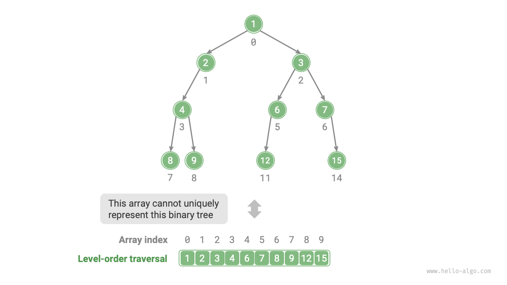
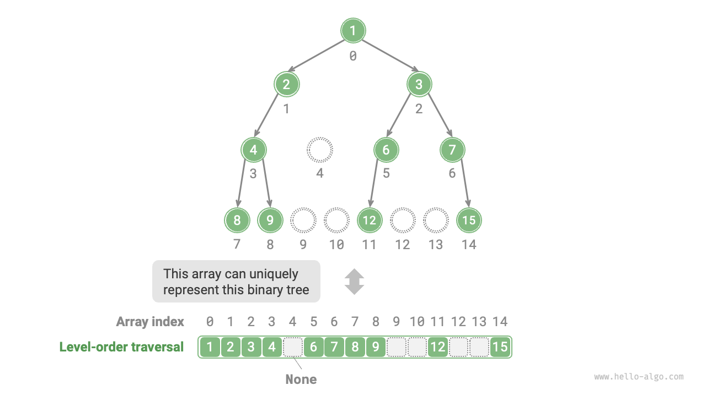
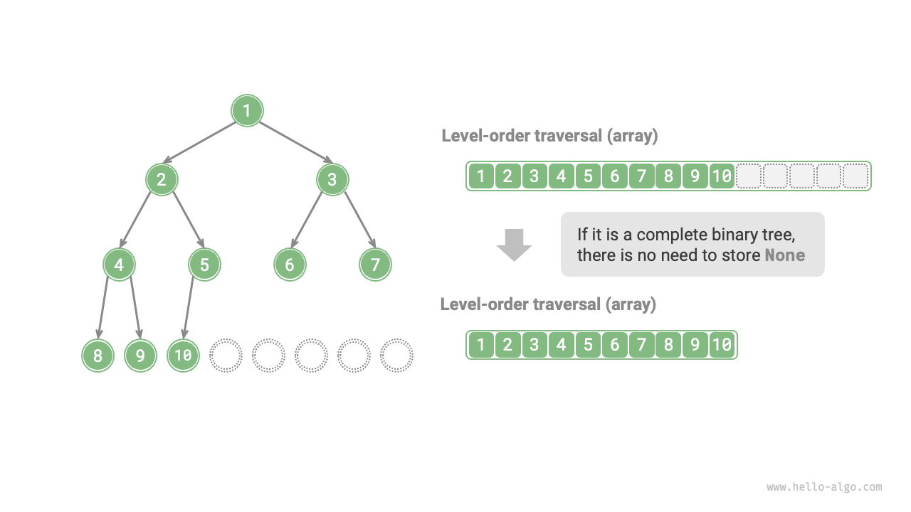

# 二分木の配列表現

連結リスト表現では、二分木の格納単位はノード`TreeNode`であり、ノードはポインタによって接続されます。連結リスト表現での二分木の基本操作については前の節で紹介しました。

では、配列を使って二分木を表現することはできるでしょうか？答えはイエスです。

## 完全二分木の表現

まず簡単なケースから分析してみましょう。完全二分木が与えられたとき、レベル順探索の順序に従ってすべてのノードを配列に格納し、各ノードは一意の配列インデックスに対応します。

レベル順探索の特性に基づいて、親ノードのインデックスとその子ノードの間の「マッピング公式」を導き出すことができます：**ノードのインデックスが$i$の場合、その左の子のインデックスは$2i + 1$、右の子のインデックスは$2i + 2$です**。下図は、さまざまなノードのインデックス間のマッピング関係を示しています。


**マッピング公式は、連結リストのノード参照（ポインタ）と同様の役割を果たします**。配列内の任意のノードが与えられたとき、マッピング公式を使用してその左（右）の子ノードにアクセスできます。

## 任意の二分木の表現

完全二分木は特別なケースです。二分木の中間レベルには多くの`None`値が存在することがよくあります。レベル順探索のシーケンスにはこれらの`None`値が含まれないため、このシーケンスだけに依存して`None`値の数と分布を推測することはできません。**つまり、複数の二分木構造が同じレベル順探索シーケンスと一致する可能性があります**。

下図に示すように、完全でない二分木が与えられた場合、上記の配列表現方法は失敗します。



この問題を解決するために、**レベル順探索シーケンスですべての`None`値を明示的に書き出すことを検討できます**。下図に示すように、この処理後、レベル順探索シーケンスは二分木を一意に表現できます。サンプルコードは以下の通りです：

=== "Python"

    ```python title=""
    # 二分木の配列表現
    # Noneを使用して空のスロットを表現
    tree = [1, 2, 3, 4, None, 6, 7, 8, 9, None, None, 12, None, None, 15]
    ```

=== "C++"

    ```cpp title=""
    /* 二分木の配列表現 */
    // 最大整数値INT_MAXを使用して空のスロットをマーク
    vector<int> tree = {1, 2, 3, 4, INT_MAX, 6, 7, 8, 9, INT_MAX, INT_MAX, 12, INT_MAX, INT_MAX, 15};
    ```

=== "Java"

    ```java title=""
    /* 二分木の配列表現 */
    // Integerラッパークラスを使用してnullで空のスロットをマーク
    Integer[] tree = { 1, 2, 3, 4, null, 6, 7, 8, 9, null, null, 12, null, null, 15 };
    ```

=== "C#"

    ```csharp title=""
    /* 二分木の配列表現 */
    // nullable int (int?)を使用してnullで空のスロットをマーク
    int?[] tree = [1, 2, 3, 4, null, 6, 7, 8, 9, null, null, 12, null, null, 15];
    ```

=== "Go"

    ```go title=""
    /* 二分木の配列表現 */
    // any型スライスを使用してnilで空のスロットをマーク
    tree := []any{1, 2, 3, 4, nil, 6, 7, 8, 9, nil, nil, 12, nil, nil, 15}
    ```

=== "Swift"

    ```swift title=""
    /* 二分木の配列表現 */
    // optional Int (Int?)を使用してnilで空のスロットをマーク
    let tree: [Int?] = [1, 2, 3, 4, nil, 6, 7, 8, 9, nil, nil, 12, nil, nil, 15]
    ```

=== "JS"

    ```javascript title=""
    /* 二分木の配列表現 */
    // nullを使用して空のスロットを表現
    let tree = [1, 2, 3, 4, null, 6, 7, 8, 9, null, null, 12, null, null, 15];
    ```

=== "TS"

    ```typescript title=""
    /* 二分木の配列表現 */
    // nullを使用して空のスロットを表現
    let tree: (number | null)[] = [1, 2, 3, 4, null, 6, 7, 8, 9, null, null, 12, null, null, 15];
    ```

=== "Dart"

    ```dart title=""
    /* 二分木の配列表現 */
    // nullable int (int?)を使用してnullで空のスロットをマーク
    List<int?> tree = [1, 2, 3, 4, null, 6, 7, 8, 9, null, null, 12, null, null, 15];
    ```

=== "Rust"

    ```rust title=""
    /* 二分木の配列表現 */
    // Noneを使用して空のスロットをマーク
    let tree = [Some(1), Some(2), Some(3), Some(4), None, Some(6), Some(7), Some(8), Some(9), None, None, Some(12), None, None, Some(15)];
    ```

=== "C"

    ```c title=""
    /* 二分木の配列表現 */
    // 最大int値を使用して空のスロットをマーク、したがってノード値はINT_MAXであってはならない
    int tree[] = {1, 2, 3, 4, INT_MAX, 6, 7, 8, 9, INT_MAX, INT_MAX, 12, INT_MAX, INT_MAX, 15};
    ```

=== "Kotlin"

    ```kotlin title=""
    /* 二分木の配列表現 */
    // nullを使用して空のスロットを表現
    val tree = mutableListOf( 1, 2, 3, 4, null, 6, 7, 8, 9, null, null, 12, null, null, 15 )
    ```

=== "Ruby"

    ```ruby title=""

    ```

=== "Zig"

    ```zig title=""

    ```



注目すべきは、**完備二分木は配列表現に非常に適している**ということです。完備二分木の定義を思い出すと、`None`は最下位レベルでのみ、かつ右側に向かって現れます。**つまり、すべての`None`値は確実にレベル順探索シーケンスの最後に現れます**。

これは、配列を使用して完備二分木を表現する際、すべての`None`値の格納を省略できることを意味し、非常に便利です。下図に例を示します。



以下のコードは、配列表現に基づく二分木を実装し、次の操作を含みます：

- ノードが与えられたとき、その値、左（右）の子ノード、および親ノードを取得する。
- 前順、中順、後順、およびレベル順探索シーケンスを取得する。

```src
[file]{array_binary_tree}-[class]{array_binary_tree}-[func]{}
```

## 利点と制限

二分木の配列表現には以下の利点があります：

- 配列は連続したメモリ空間に格納されるため、キャッシュフレンドリーで、より高速なアクセスと探索が可能です。
- ポインタを格納する必要がないため、スペースを節約できます。
- ノードへのランダムアクセスが可能です。

しかし、配列表現にはいくつかの制限もあります：

- 配列格納には連続したメモリ空間が必要なため、大量のデータを持つ木の格納には適していません。
- ノードの追加や削除には配列の挿入や削除操作が必要で、効率が低くなります。
- 二分木に多くの`None`値がある場合、配列に含まれるノードデータの割合が低くなり、空間利用率が低下します。
