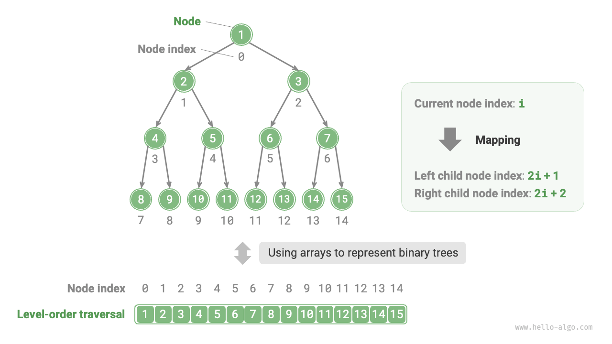
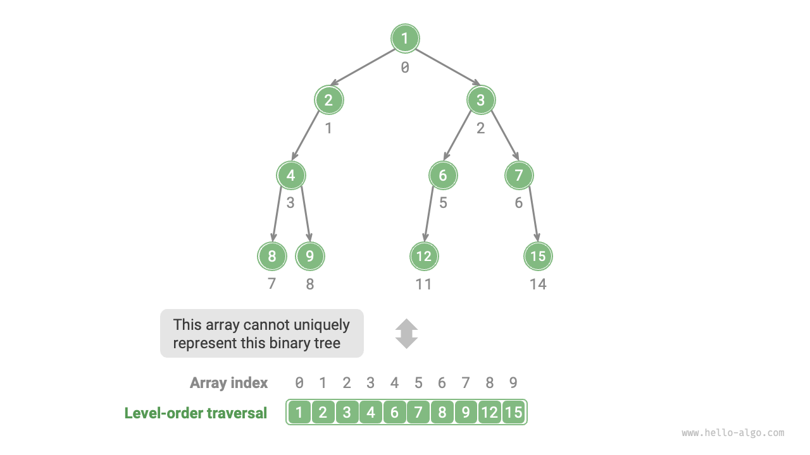
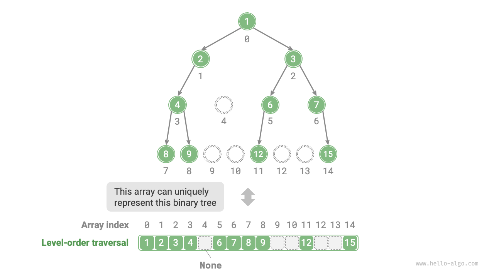
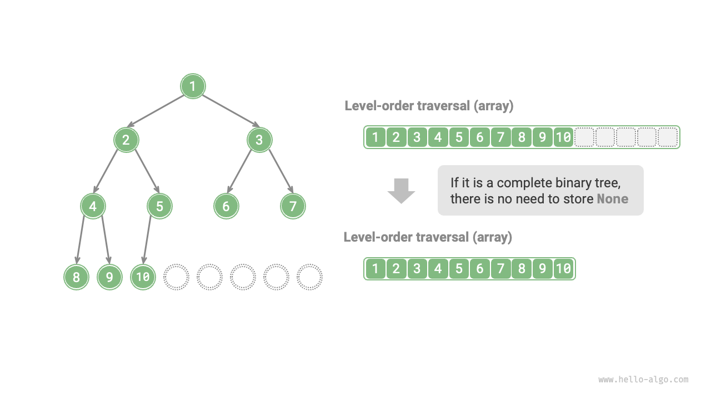

# 7.3 &nbsp; 二分木の配列表現

連結リスト表現では、二分木の記憶単位はノード `TreeNode` であり、ノード同士はポインタによって接続されます。前節では、連結リスト表現における二分木の各種基本操作を紹介しました。

では、配列で二分木を表現できるでしょうか？答えはもちろん可能です。

## 7.3.1 &nbsp; 充足二分木を表現する

まずは簡単な例を考えます。与えられた 1 本の充足二分木について、すべてのノードをレベル順走査の順に配列へ格納すると、各ノードは一意な配列インデックスに対応します。

レベル順走査の性質に基づくと、親ノードのインデックスと子ノードのインデックスの間にある「対応式」を導けます。**あるノードのインデックスが $i$ なら、その左子ノードのインデックスは $2i + 1$ 、右子ノードのインデックスは $2i + 2$ です**。以下の図は、各ノードインデックス間の対応関係を示しています。

{ class="animation-figure" }

<p align="center"> 図 7-12 &nbsp; 充足二分木の配列表現 </p>

**対応式は、連結リストにおけるノード参照（ポインタ）と同じ役割を果たします**。与えられた配列内の任意のノードについて、この対応式を使えばその左（右）子ノードにアクセスできます。

## 7.3.2 &nbsp; 任意の二分木を表現する

充足二分木は特殊なケースであり、一般の二分木では中間層に多数の `None` が存在することがよくあります。レベル順走査の列にはこれらの `None` が含まれないため、その列だけから `None` の数や分布位置を推定することはできません。**つまり、このレベル順走査列に一致する二分木構造は複数存在し得ます**。

次の図のように、非充足二分木が与えられると、上記の配列表現はすでに成り立ちません。

{ class="animation-figure" }

<p align="center"> 図 7-13 &nbsp; レベル順走査列に対応する複数の二分木の可能性 </p>

この問題を解決するために、**レベル順走査列にすべての `None` を明示的に書き込む**ことを考えられます。次の図のように、このように処理すればレベル順走査列で二分木を一意に表現できます。コード例は以下のとおりです：

=== "Python"

    ```python title=""
    # 二分木の配列表現
    # 空き位置を表すために None を使う
    tree = [1, 2, 3, 4, None, 6, 7, 8, 9, None, None, 12, None, None, 15]
    ```

=== "C++"

    ```cpp title=""
    /* 二分木の配列表現 */
    // int の最大値 INT_MAX を使って空き位置を示す
    vector<int> tree = {1, 2, 3, 4, INT_MAX, 6, 7, 8, 9, INT_MAX, INT_MAX, 12, INT_MAX, INT_MAX, 15};
    ```

=== "Java"

    ```java title=""
    /* 二分木の配列表現 */
    // int のラッパークラス Integer を使えば、null で空き位置を示せる
    Integer[] tree = { 1, 2, 3, 4, null, 6, 7, 8, 9, null, null, 12, null, null, 15 };
    ```

=== "C#"

    ```csharp title=""
    /* 二分木の配列表現 */
    // nullable な int? 型を使えば、null で空き位置を示せる
    int?[] tree = [1, 2, 3, 4, null, 6, 7, 8, 9, null, null, 12, null, null, 15];
    ```

=== "Go"

    ```go title=""
    /* 二分木の配列表現 */
    // any 型のスライスを使えば、nil で空き位置を示せる
    tree := []any{1, 2, 3, 4, nil, 6, 7, 8, 9, nil, nil, 12, nil, nil, 15}
    ```

=== "Swift"

    ```swift title=""
    /* 二分木の配列表現 */
    // nullable な Int? 型を使えば、nil で空き位置を示せる
    let tree: [Int?] = [1, 2, 3, 4, nil, 6, 7, 8, 9, nil, nil, 12, nil, nil, 15]
    ```

=== "JS"

    ```javascript title=""
    /* 二分木の配列表現 */
    // null を使って空き位置を表す
    let tree = [1, 2, 3, 4, null, 6, 7, 8, 9, null, null, 12, null, null, 15];
    ```

=== "TS"

    ```typescript title=""
    /* 二分木の配列表現 */
    // null を使って空き位置を表す
    let tree: (number | null)[] = [1, 2, 3, 4, null, 6, 7, 8, 9, null, null, 12, null, null, 15];
    ```

=== "Dart"

    ```dart title=""
    /* 二分木の配列表現 */
    // nullable な int? 型を使えば、null で空き位置を示せる
    List<int?> tree = [1, 2, 3, 4, null, 6, 7, 8, 9, null, null, 12, null, null, 15];
    ```

=== "Rust"

    ```rust title=""
    /* 二分木の配列表現 */
    // None を使って空き位置を示す
    let tree = [Some(1), Some(2), Some(3), Some(4), None, Some(6), Some(7), Some(8), Some(9), None, None, Some(12), None, None, Some(15)];
    ```

=== "C"

    ```c title=""
    /* 二分木の配列表現 */
    // int の最大値で空き位置を示すため、ノード値は INT_MAX であってはならない
    int tree[] = {1, 2, 3, 4, INT_MAX, 6, 7, 8, 9, INT_MAX, INT_MAX, 12, INT_MAX, INT_MAX, 15};
    ```

=== "Kotlin"

    ```kotlin title=""
    /* 二分木の配列表現 */
    // null を使って空き位置を表す
    val tree = arrayOf( 1, 2, 3, 4, null, 6, 7, 8, 9, null, null, 12, null, null, 15 )
    ```

=== "Ruby"

    ```ruby title=""
    ### 二分木の配列表現 ###
    # nil を使って空き位置を表す
    tree = [1, 2, 3, 4, nil, 6, 7, 8, 9, nil, nil, 12, nil, nil, 15]
    ```

{ class="animation-figure" }

<p align="center"> 図 7-14 &nbsp; 任意の二分木の配列表現 </p>

補足すると、**完全二分木は配列による表現に非常に適しています**。完全二分木の定義を振り返ると、`None` は最下層の右側にしか現れないため、**すべての `None` は必ずレベル順走査列の末尾に現れます**。

つまり、完全二分木を配列で表す場合は、すべての `None` の格納を省略できるため、非常に便利です。次の図に例を示します。

{ class="animation-figure" }

<p align="center"> 図 7-15 &nbsp; 完全二分木の配列表現 </p>

以下のコードでは、配列ベースで表現した二分木を実装しており、次の操作を含みます。

- あるノードが与えられたとき、その値、左（右）子ノード、親ノードを取得する。
- 前順走査、中順走査、後順走査、レベル順走査の列を取得する。

=== "Python"

    ```python title="array_binary_tree.py"
    class ArrayBinaryTree:
        """配列表現による二分木クラス"""

        def __init__(self, arr: list[int | None]):
            """コンストラクタ"""
            self._tree = list(arr)

        def size(self):
            """リスト容量"""
            return len(self._tree)

        def val(self, i: int) -> int | None:
            """インデックス i のノードの値を取得"""
            # インデックスが範囲外なら、空きを表す None を返す
            if i < 0 or i >= self.size():
                return None
            return self._tree[i]

        def left(self, i: int) -> int | None:
            """インデックス i のノードの左子ノードのインデックスを取得"""
            return 2 * i + 1

        def right(self, i: int) -> int | None:
            """インデックス i のノードの右子ノードのインデックスを取得"""
            return 2 * i + 2

        def parent(self, i: int) -> int | None:
            """インデックス i のノードの親ノードのインデックスを取得"""
            return (i - 1) // 2

        def level_order(self) -> list[int]:
            """レベル順走査"""
            self.res = []
            # 配列を直接走査する
            for i in range(self.size()):
                if self.val(i) is not None:
                    self.res.append(self.val(i))
            return self.res

        def dfs(self, i: int, order: str):
            """深さ優先探索"""
            if self.val(i) is None:
                return
            # 先行順走査
            if order == "pre":
                self.res.append(self.val(i))
            self.dfs(self.left(i), order)
            # 中順走査
            if order == "in":
                self.res.append(self.val(i))
            self.dfs(self.right(i), order)
            # 後順走査
            if order == "post":
                self.res.append(self.val(i))

        def pre_order(self) -> list[int]:
            """先行順走査"""
            self.res = []
            self.dfs(0, order="pre")
            return self.res

        def in_order(self) -> list[int]:
            """中順走査"""
            self.res = []
            self.dfs(0, order="in")
            return self.res

        def post_order(self) -> list[int]:
            """後順走査"""
            self.res = []
            self.dfs(0, order="post")
            return self.res
    ```

=== "C++"

    ```cpp title="array_binary_tree.cpp"
    /* 配列表現による二分木クラス */
    class ArrayBinaryTree {
      public:
        /* コンストラクタ */
        ArrayBinaryTree(vector<int> arr) {
            tree = arr;
        }

        /* リスト容量 */
        int size() {
            return tree.size();
        }

        /* インデックス i のノードの値を取得 */
        int val(int i) {
            // インデックスが範囲外なら、空きを表す INT_MAX を返す
            if (i < 0 || i >= size())
                return INT_MAX;
            return tree[i];
        }

        /* インデックス i のノードの左子ノードのインデックスを取得 */
        int left(int i) {
            return 2 * i + 1;
        }

        /* インデックス i のノードの右子ノードのインデックスを取得 */
        int right(int i) {
            return 2 * i + 2;
        }

        /* インデックス i のノードの親ノードのインデックスを取得 */
        int parent(int i) {
            return (i - 1) / 2;
        }

        /* レベル順走査 */
        vector<int> levelOrder() {
            vector<int> res;
            // 配列を直接走査する
            for (int i = 0; i < size(); i++) {
                if (val(i) != INT_MAX)
                    res.push_back(val(i));
            }
            return res;
        }

        /* 先行順走査 */
        vector<int> preOrder() {
            vector<int> res;
            dfs(0, "pre", res);
            return res;
        }

        /* 中順走査 */
        vector<int> inOrder() {
            vector<int> res;
            dfs(0, "in", res);
            return res;
        }

        /* 後順走査 */
        vector<int> postOrder() {
            vector<int> res;
            dfs(0, "post", res);
            return res;
        }

      private:
        vector<int> tree;

        /* 深さ優先探索 */
        void dfs(int i, string order, vector<int> &res) {
            // 空きスロットなら返す
            if (val(i) == INT_MAX)
                return;
            // 先行順走査
            if (order == "pre")
                res.push_back(val(i));
            dfs(left(i), order, res);
            // 中順走査
            if (order == "in")
                res.push_back(val(i));
            dfs(right(i), order, res);
            // 後順走査
            if (order == "post")
                res.push_back(val(i));
        }
    };
    ```

=== "Java"

    ```java title="array_binary_tree.java"
    /* 配列表現による二分木クラス */
    class ArrayBinaryTree {
        private List<Integer> tree;

        /* コンストラクタ */
        public ArrayBinaryTree(List<Integer> arr) {
            tree = new ArrayList<>(arr);
        }

        /* リスト容量 */
        public int size() {
            return tree.size();
        }

        /* インデックス i のノードの値を取得 */
        public Integer val(int i) {
            // インデックスが範囲外なら、空きを表す null を返す
            if (i < 0 || i >= size())
                return null;
            return tree.get(i);
        }

        /* インデックス i のノードの左子ノードのインデックスを取得 */
        public Integer left(int i) {
            return 2 * i + 1;
        }

        /* インデックス i のノードの右子ノードのインデックスを取得 */
        public Integer right(int i) {
            return 2 * i + 2;
        }

        /* インデックス i のノードの親ノードのインデックスを取得 */
        public Integer parent(int i) {
            return (i - 1) / 2;
        }

        /* レベル順走査 */
        public List<Integer> levelOrder() {
            List<Integer> res = new ArrayList<>();
            // 配列を直接走査する
            for (int i = 0; i < size(); i++) {
                if (val(i) != null)
                    res.add(val(i));
            }
            return res;
        }

        /* 深さ優先探索 */
        private void dfs(Integer i, String order, List<Integer> res) {
            // 空きスロットなら返す
            if (val(i) == null)
                return;
            // 先行順走査
            if ("pre".equals(order))
                res.add(val(i));
            dfs(left(i), order, res);
            // 中順走査
            if ("in".equals(order))
                res.add(val(i));
            dfs(right(i), order, res);
            // 後順走査
            if ("post".equals(order))
                res.add(val(i));
        }

        /* 先行順走査 */
        public List<Integer> preOrder() {
            List<Integer> res = new ArrayList<>();
            dfs(0, "pre", res);
            return res;
        }

        /* 中順走査 */
        public List<Integer> inOrder() {
            List<Integer> res = new ArrayList<>();
            dfs(0, "in", res);
            return res;
        }

        /* 後順走査 */
        public List<Integer> postOrder() {
            List<Integer> res = new ArrayList<>();
            dfs(0, "post", res);
            return res;
        }
    }
    ```

=== "C#"

    ```csharp title="array_binary_tree.cs"
    /* 配列表現による二分木クラス */
    class ArrayBinaryTree(List<int?> arr) {
        List<int?> tree = new(arr);

        /* リスト容量 */
        public int Size() {
            return tree.Count;
        }

        /* インデックス i のノードの値を取得 */
        public int? Val(int i) {
            // インデックスが範囲外なら、空きを表す null を返す
            if (i < 0 || i >= Size())
                return null;
            return tree[i];
        }

        /* インデックス i のノードの左子ノードのインデックスを取得 */
        public int Left(int i) {
            return 2 * i + 1;
        }

        /* インデックス i のノードの右子ノードのインデックスを取得 */
        public int Right(int i) {
            return 2 * i + 2;
        }

        /* インデックス i のノードの親ノードのインデックスを取得 */
        public int Parent(int i) {
            return (i - 1) / 2;
        }

        /* レベル順走査 */
        public List<int> LevelOrder() {
            List<int> res = [];
            // 配列を直接走査する
            for (int i = 0; i < Size(); i++) {
                if (Val(i).HasValue)
                    res.Add(Val(i)!.Value);
            }
            return res;
        }

        /* 深さ優先探索 */
        void DFS(int i, string order, List<int> res) {
            // 空きスロットなら返す
            if (!Val(i).HasValue)
                return;
            // 先行順走査
            if (order == "pre")
                res.Add(Val(i)!.Value);
            DFS(Left(i), order, res);
            // 中順走査
            if (order == "in")
                res.Add(Val(i)!.Value);
            DFS(Right(i), order, res);
            // 後順走査
            if (order == "post")
                res.Add(Val(i)!.Value);
        }

        /* 先行順走査 */
        public List<int> PreOrder() {
            List<int> res = [];
            DFS(0, "pre", res);
            return res;
        }

        /* 中順走査 */
        public List<int> InOrder() {
            List<int> res = [];
            DFS(0, "in", res);
            return res;
        }

        /* 後順走査 */
        public List<int> PostOrder() {
            List<int> res = [];
            DFS(0, "post", res);
            return res;
        }
    }
    ```

=== "Go"

    ```go title="array_binary_tree.go"
    /* 配列表現による二分木クラス */
    type arrayBinaryTree struct {
        tree []any
    }

    /* コンストラクタ */
    func newArrayBinaryTree(arr []any) *arrayBinaryTree {
        return &arrayBinaryTree{
            tree: arr,
        }
    }

    /* リスト容量 */
    func (abt *arrayBinaryTree) size() int {
        return len(abt.tree)
    }

    /* インデックス i のノードの値を取得 */
    func (abt *arrayBinaryTree) val(i int) any {
        // インデックスが範囲外なら、空きを表す null を返す
        if i < 0 || i >= abt.size() {
            return nil
        }
        return abt.tree[i]
    }

    /* インデックス i のノードの左子ノードのインデックスを取得 */
    func (abt *arrayBinaryTree) left(i int) int {
        return 2*i + 1
    }

    /* インデックス i のノードの右子ノードのインデックスを取得 */
    func (abt *arrayBinaryTree) right(i int) int {
        return 2*i + 2
    }

    /* インデックス i のノードの親ノードのインデックスを取得 */
    func (abt *arrayBinaryTree) parent(i int) int {
        return (i - 1) / 2
    }

    /* レベル順走査 */
    func (abt *arrayBinaryTree) levelOrder() []any {
        var res []any
        // 配列を直接走査する
        for i := 0; i < abt.size(); i++ {
            if abt.val(i) != nil {
                res = append(res, abt.val(i))
            }
        }
        return res
    }

    /* 深さ優先探索 */
    func (abt *arrayBinaryTree) dfs(i int, order string, res *[]any) {
        // 空きスロットなら返す
        if abt.val(i) == nil {
            return
        }
        // 先行順走査
        if order == "pre" {
            *res = append(*res, abt.val(i))
        }
        abt.dfs(abt.left(i), order, res)
        // 中順走査
        if order == "in" {
            *res = append(*res, abt.val(i))
        }
        abt.dfs(abt.right(i), order, res)
        // 後順走査
        if order == "post" {
            *res = append(*res, abt.val(i))
        }
    }

    /* 先行順走査 */
    func (abt *arrayBinaryTree) preOrder() []any {
        var res []any
        abt.dfs(0, "pre", &res)
        return res
    }

    /* 中順走査 */
    func (abt *arrayBinaryTree) inOrder() []any {
        var res []any
        abt.dfs(0, "in", &res)
        return res
    }

    /* 後順走査 */
    func (abt *arrayBinaryTree) postOrder() []any {
        var res []any
        abt.dfs(0, "post", &res)
        return res
    }
    ```

=== "Swift"

    ```swift title="array_binary_tree.swift"
    /* 配列表現による二分木クラス */
    class ArrayBinaryTree {
        private var tree: [Int?]

        /* コンストラクタ */
        init(arr: [Int?]) {
            tree = arr
        }

        /* リスト容量 */
        func size() -> Int {
            tree.count
        }

        /* インデックス i のノードの値を取得 */
        func val(i: Int) -> Int? {
            // インデックスが範囲外なら、空きを表す null を返す
            if i < 0 || i >= size() {
                return nil
            }
            return tree[i]
        }

        /* インデックス i のノードの左子ノードのインデックスを取得 */
        func left(i: Int) -> Int {
            2 * i + 1
        }

        /* インデックス i のノードの右子ノードのインデックスを取得 */
        func right(i: Int) -> Int {
            2 * i + 2
        }

        /* インデックス i のノードの親ノードのインデックスを取得 */
        func parent(i: Int) -> Int {
            (i - 1) / 2
        }

        /* レベル順走査 */
        func levelOrder() -> [Int] {
            var res: [Int] = []
            // 配列を直接走査する
            for i in 0 ..< size() {
                if let val = val(i: i) {
                    res.append(val)
                }
            }
            return res
        }

        /* 深さ優先探索 */
        private func dfs(i: Int, order: String, res: inout [Int]) {
            // 空きスロットなら返す
            guard let val = val(i: i) else {
                return
            }
            // 先行順走査
            if order == "pre" {
                res.append(val)
            }
            dfs(i: left(i: i), order: order, res: &res)
            // 中順走査
            if order == "in" {
                res.append(val)
            }
            dfs(i: right(i: i), order: order, res: &res)
            // 後順走査
            if order == "post" {
                res.append(val)
            }
        }

        /* 先行順走査 */
        func preOrder() -> [Int] {
            var res: [Int] = []
            dfs(i: 0, order: "pre", res: &res)
            return res
        }

        /* 中順走査 */
        func inOrder() -> [Int] {
            var res: [Int] = []
            dfs(i: 0, order: "in", res: &res)
            return res
        }

        /* 後順走査 */
        func postOrder() -> [Int] {
            var res: [Int] = []
            dfs(i: 0, order: "post", res: &res)
            return res
        }
    }
    ```

=== "JS"

    ```javascript title="array_binary_tree.js"
    /* 配列表現による二分木クラス */
    class ArrayBinaryTree {
        #tree;

        /* コンストラクタ */
        constructor(arr) {
            this.#tree = arr;
        }

        /* リスト容量 */
        size() {
            return this.#tree.length;
        }

        /* インデックス i のノードの値を取得 */
        val(i) {
            // インデックスが範囲外なら、空きを表す null を返す
            if (i < 0 || i >= this.size()) return null;
            return this.#tree[i];
        }

        /* インデックス i のノードの左子ノードのインデックスを取得 */
        left(i) {
            return 2 * i + 1;
        }

        /* インデックス i のノードの右子ノードのインデックスを取得 */
        right(i) {
            return 2 * i + 2;
        }

        /* インデックス i のノードの親ノードのインデックスを取得 */
        parent(i) {
            return Math.floor((i - 1) / 2); // 切り捨て除算
        }

        /* レベル順走査 */
        levelOrder() {
            let res = [];
            // 配列を直接走査する
            for (let i = 0; i < this.size(); i++) {
                if (this.val(i) !== null) res.push(this.val(i));
            }
            return res;
        }

        /* 深さ優先探索 */
        #dfs(i, order, res) {
            // 空きスロットなら返す
            if (this.val(i) === null) return;
            // 先行順走査
            if (order === 'pre') res.push(this.val(i));
            this.#dfs(this.left(i), order, res);
            // 中順走査
            if (order === 'in') res.push(this.val(i));
            this.#dfs(this.right(i), order, res);
            // 後順走査
            if (order === 'post') res.push(this.val(i));
        }

        /* 先行順走査 */
        preOrder() {
            const res = [];
            this.#dfs(0, 'pre', res);
            return res;
        }

        /* 中順走査 */
        inOrder() {
            const res = [];
            this.#dfs(0, 'in', res);
            return res;
        }

        /* 後順走査 */
        postOrder() {
            const res = [];
            this.#dfs(0, 'post', res);
            return res;
        }
    }
    ```

=== "TS"

    ```typescript title="array_binary_tree.ts"
    /* 配列表現による二分木クラス */
    class ArrayBinaryTree {
        #tree: (number | null)[];

        /* コンストラクタ */
        constructor(arr: (number | null)[]) {
            this.#tree = arr;
        }

        /* リスト容量 */
        size(): number {
            return this.#tree.length;
        }

        /* インデックス i のノードの値を取得 */
        val(i: number): number | null {
            // インデックスが範囲外なら、空きを表す null を返す
            if (i < 0 || i >= this.size()) return null;
            return this.#tree[i];
        }

        /* インデックス i のノードの左子ノードのインデックスを取得 */
        left(i: number): number {
            return 2 * i + 1;
        }

        /* インデックス i のノードの右子ノードのインデックスを取得 */
        right(i: number): number {
            return 2 * i + 2;
        }

        /* インデックス i のノードの親ノードのインデックスを取得 */
        parent(i: number): number {
            return Math.floor((i - 1) / 2); // 切り捨て除算
        }

        /* レベル順走査 */
        levelOrder(): number[] {
            let res = [];
            // 配列を直接走査する
            for (let i = 0; i < this.size(); i++) {
                if (this.val(i) !== null) res.push(this.val(i));
            }
            return res;
        }

        /* 深さ優先探索 */
        #dfs(i: number, order: Order, res: (number | null)[]): void {
            // 空きスロットなら返す
            if (this.val(i) === null) return;
            // 先行順走査
            if (order === 'pre') res.push(this.val(i));
            this.#dfs(this.left(i), order, res);
            // 中順走査
            if (order === 'in') res.push(this.val(i));
            this.#dfs(this.right(i), order, res);
            // 後順走査
            if (order === 'post') res.push(this.val(i));
        }

        /* 先行順走査 */
        preOrder(): (number | null)[] {
            const res = [];
            this.#dfs(0, 'pre', res);
            return res;
        }

        /* 中順走査 */
        inOrder(): (number | null)[] {
            const res = [];
            this.#dfs(0, 'in', res);
            return res;
        }

        /* 後順走査 */
        postOrder(): (number | null)[] {
            const res = [];
            this.#dfs(0, 'post', res);
            return res;
        }
    }
    ```

=== "Dart"

    ```dart title="array_binary_tree.dart"
    /* 配列表現による二分木クラス */
    class ArrayBinaryTree {
      late List<int?> _tree;

      /* コンストラクタ */
      ArrayBinaryTree(this._tree);

      /* リスト容量 */
      int size() {
        return _tree.length;
      }

      /* インデックス i のノードの値を取得 */
      int? val(int i) {
        // インデックスが範囲外なら、空きを表す null を返す
        if (i < 0 || i >= size()) {
          return null;
        }
        return _tree[i];
      }

      /* インデックス i のノードの左子ノードのインデックスを取得 */
      int? left(int i) {
        return 2 * i + 1;
      }

      /* インデックス i のノードの右子ノードのインデックスを取得 */
      int? right(int i) {
        return 2 * i + 2;
      }

      /* インデックス i のノードの親ノードのインデックスを取得 */
      int? parent(int i) {
        return (i - 1) ~/ 2;
      }

      /* レベル順走査 */
      List<int> levelOrder() {
        List<int> res = [];
        for (int i = 0; i < size(); i++) {
          if (val(i) != null) {
            res.add(val(i)!);
          }
        }
        return res;
      }

      /* 深さ優先探索 */
      void dfs(int i, String order, List<int?> res) {
        // 空きスロットなら返す
        if (val(i) == null) {
          return;
        }
        // 先行順走査
        if (order == 'pre') {
          res.add(val(i));
        }
        dfs(left(i)!, order, res);
        // 中順走査
        if (order == 'in') {
          res.add(val(i));
        }
        dfs(right(i)!, order, res);
        // 後順走査
        if (order == 'post') {
          res.add(val(i));
        }
      }

      /* 先行順走査 */
      List<int?> preOrder() {
        List<int?> res = [];
        dfs(0, 'pre', res);
        return res;
      }

      /* 中順走査 */
      List<int?> inOrder() {
        List<int?> res = [];
        dfs(0, 'in', res);
        return res;
      }

      /* 後順走査 */
      List<int?> postOrder() {
        List<int?> res = [];
        dfs(0, 'post', res);
        return res;
      }
    }
    ```

=== "Rust"

    ```rust title="array_binary_tree.rs"
    /* 配列表現による二分木クラス */
    struct ArrayBinaryTree {
        tree: Vec<Option<i32>>,
    }

    impl ArrayBinaryTree {
        /* コンストラクタ */
        fn new(arr: Vec<Option<i32>>) -> Self {
            Self { tree: arr }
        }

        /* リスト容量 */
        fn size(&self) -> i32 {
            self.tree.len() as i32
        }

        /* インデックス i のノードの値を取得 */
        fn val(&self, i: i32) -> Option<i32> {
            // インデックスが範囲外なら、空きを表す None を返す
            if i < 0 || i >= self.size() {
                None
            } else {
                self.tree[i as usize]
            }
        }

        /* インデックス i のノードの左子ノードのインデックスを取得 */
        fn left(&self, i: i32) -> i32 {
            2 * i + 1
        }

        /* インデックス i のノードの右子ノードのインデックスを取得 */
        fn right(&self, i: i32) -> i32 {
            2 * i + 2
        }

        /* インデックス i のノードの親ノードのインデックスを取得 */
        fn parent(&self, i: i32) -> i32 {
            (i - 1) / 2
        }

        /* レベル順走査 */
        fn level_order(&self) -> Vec<i32> {
            self.tree.iter().filter_map(|&x| x).collect()
        }

        /* 深さ優先探索 */
        fn dfs(&self, i: i32, order: &'static str, res: &mut Vec<i32>) {
            if self.val(i).is_none() {
                return;
            }
            let val = self.val(i).unwrap();
            // 先行順走査
            if order == "pre" {
                res.push(val);
            }
            self.dfs(self.left(i), order, res);
            // 中順走査
            if order == "in" {
                res.push(val);
            }
            self.dfs(self.right(i), order, res);
            // 後順走査
            if order == "post" {
                res.push(val);
            }
        }

        /* 先行順走査 */
        fn pre_order(&self) -> Vec<i32> {
            let mut res = vec![];
            self.dfs(0, "pre", &mut res);
            res
        }

        /* 中順走査 */
        fn in_order(&self) -> Vec<i32> {
            let mut res = vec![];
            self.dfs(0, "in", &mut res);
            res
        }

        /* 後順走査 */
        fn post_order(&self) -> Vec<i32> {
            let mut res = vec![];
            self.dfs(0, "post", &mut res);
            res
        }
    }
    ```

=== "C"

    ```c title="array_binary_tree.c"
    /* 配列表現による二分木の構造体 */
    typedef struct {
        int *tree;
        int size;
    } ArrayBinaryTree;

    /* コンストラクタ */
    ArrayBinaryTree *newArrayBinaryTree(int *arr, int arrSize) {
        ArrayBinaryTree *abt = (ArrayBinaryTree *)malloc(sizeof(ArrayBinaryTree));
        abt->tree = malloc(sizeof(int) * arrSize);
        memcpy(abt->tree, arr, sizeof(int) * arrSize);
        abt->size = arrSize;
        return abt;
    }

    /* デストラクタ */
    void delArrayBinaryTree(ArrayBinaryTree *abt) {
        free(abt->tree);
        free(abt);
    }

    /* リスト容量 */
    int size(ArrayBinaryTree *abt) {
        return abt->size;
    }

    /* インデックス i のノードの値を取得 */
    int val(ArrayBinaryTree *abt, int i) {
        // インデックスが範囲外なら、空きを表す INT_MAX を返す
        if (i < 0 || i >= size(abt))
            return INT_MAX;
        return abt->tree[i];
    }

    /* レベル順走査 */
    int *levelOrder(ArrayBinaryTree *abt, int *returnSize) {
        int *res = (int *)malloc(sizeof(int) * size(abt));
        int index = 0;
        // 配列を直接走査する
        for (int i = 0; i < size(abt); i++) {
            if (val(abt, i) != INT_MAX)
                res[index++] = val(abt, i);
        }
        *returnSize = index;
        return res;
    }

    /* 深さ優先探索 */
    void dfs(ArrayBinaryTree *abt, int i, char *order, int *res, int *index) {
        // 空きスロットなら返す
        if (val(abt, i) == INT_MAX)
            return;
        // 先行順走査
        if (strcmp(order, "pre") == 0)
            res[(*index)++] = val(abt, i);
        dfs(abt, left(i), order, res, index);
        // 中順走査
        if (strcmp(order, "in") == 0)
            res[(*index)++] = val(abt, i);
        dfs(abt, right(i), order, res, index);
        // 後順走査
        if (strcmp(order, "post") == 0)
            res[(*index)++] = val(abt, i);
    }

    /* 先行順走査 */
    int *preOrder(ArrayBinaryTree *abt, int *returnSize) {
        int *res = (int *)malloc(sizeof(int) * size(abt));
        int index = 0;
        dfs(abt, 0, "pre", res, &index);
        *returnSize = index;
        return res;
    }

    /* 中順走査 */
    int *inOrder(ArrayBinaryTree *abt, int *returnSize) {
        int *res = (int *)malloc(sizeof(int) * size(abt));
        int index = 0;
        dfs(abt, 0, "in", res, &index);
        *returnSize = index;
        return res;
    }

    /* 後順走査 */
    int *postOrder(ArrayBinaryTree *abt, int *returnSize) {
        int *res = (int *)malloc(sizeof(int) * size(abt));
        int index = 0;
        dfs(abt, 0, "post", res, &index);
        *returnSize = index;
        return res;
    }
    ```

=== "Kotlin"

    ```kotlin title="array_binary_tree.kt"
    /* 配列表現による二分木クラス */
    class ArrayBinaryTree(val tree: MutableList<Int?>) {
        /* リスト容量 */
        fun size(): Int {
            return tree.size
        }

        /* インデックス i のノードの値を取得 */
        fun _val(i: Int): Int? {
            // インデックスが範囲外なら、空きを表す null を返す
            if (i < 0 || i >= size()) return null
            return tree[i]
        }

        /* インデックス i のノードの左子ノードのインデックスを取得 */
        fun left(i: Int): Int {
            return 2 * i + 1
        }

        /* インデックス i のノードの右子ノードのインデックスを取得 */
        fun right(i: Int): Int {
            return 2 * i + 2
        }

        /* インデックス i のノードの親ノードのインデックスを取得 */
        fun parent(i: Int): Int {
            return (i - 1) / 2
        }

        /* レベル順走査 */
        fun levelOrder(): MutableList<Int?> {
            val res = mutableListOf<Int?>()
            // 配列を直接走査する
            for (i in 0..<size()) {
                if (_val(i) != null)
                    res.add(_val(i))
            }
            return res
        }

        /* 深さ優先探索 */
        fun dfs(i: Int, order: String, res: MutableList<Int?>) {
            // 空きスロットなら返す
            if (_val(i) == null)
                return
            // 先行順走査
            if ("pre" == order)
                res.add(_val(i))
            dfs(left(i), order, res)
            // 中順走査
            if ("in" == order)
                res.add(_val(i))
            dfs(right(i), order, res)
            // 後順走査
            if ("post" == order)
                res.add(_val(i))
        }

        /* 先行順走査 */
        fun preOrder(): MutableList<Int?> {
            val res = mutableListOf<Int?>()
            dfs(0, "pre", res)
            return res
        }

        /* 中順走査 */
        fun inOrder(): MutableList<Int?> {
            val res = mutableListOf<Int?>()
            dfs(0, "in", res)
            return res
        }

        /* 後順走査 */
        fun postOrder(): MutableList<Int?> {
            val res = mutableListOf<Int?>()
            dfs(0, "post", res)
            return res
        }
    }
    ```

=== "Ruby"

    ```ruby title="array_binary_tree.rb"
    ### 配列表現の二分木クラス ###
    class ArrayBinaryTree
      ### コンストラクタ ###
      def initialize(arr)
        @tree = arr.to_a
      end

      ### リスト容量 ###
      def size
        @tree.length
      end

      ### インデックス i のノードの値を取得 ###
      def val(i)
        # インデックスが範囲外なら `nil` を返し、空きスロットを表す
        return if i < 0 || i >= size

        @tree[i]
      end

      ### インデックス i のノードの左子ノードのインデックスを取得 ###
      def left(i)
        2 * i + 1
      end

      ### インデックス i のノードの右子ノードのインデックスを取得 ###
      def right(i)
        2 * i + 2
      end

      ### インデックス i のノードの親ノードのインデックスを取得 ###
      def parent(i)
        (i - 1) / 2
      end

      ### レベル順走査 ###
      def level_order
        @res = []

        # 配列を直接走査する
        for i in 0...size
          @res << val(i) unless val(i).nil?
        end

        @res
      end

      ### 深さ優先探索 ###
      def dfs(i, order)
        return if val(i).nil?
        # 先行順走査
        @res << val(i) if order == :pre
        dfs(left(i), order)
        # 中順走査
        @res << val(i) if order == :in
        dfs(right(i), order)
        # 後順走査
        @res << val(i) if order == :post
      end

      ### 前順走査 ###
      def pre_order
        @res = []
        dfs(0, :pre)
        @res
      end

      ### 中順走査 ###
      def in_order
        @res = []
        dfs(0, :in)
        @res
      end

      ### 後順走査 ###
      def post_order
        @res = []
        dfs(0, :post)
        @res
      end
    end
    ```

??? pythontutor "コードの可視化"

    <div style="height: 549px; width: 100%;"><iframe class="pythontutor-iframe" src="https://pythontutor.com/iframe-embed.html#code=class%20TreeNode%3A%0A%0A%20%20%20%20def%20__init__%28self%2C%20val%29%3A%0A%20%20%20%20%20%20%20%20self.val%20%3D%20val%0A%20%20%20%20%20%20%20%20self.left%20%3D%20None%0A%20%20%20%20%20%20%20%20self.right%20%3D%20None%0A%0Aclass%20ArrayBinaryTree%3A%0A%0A%20%20%20%20def%20__init__%28self%2C%20arr%3A%20list%5Bint%20%7C%20None%5D%29%3A%0A%20%20%20%20%20%20%20%20self._tree%20%3D%20list%28arr%29%0A%0A%20%20%20%20def%20size%28self%29%3A%0A%20%20%20%20%20%20%20%20return%20len%28self._tree%29%0A%0A%20%20%20%20def%20val%28self%2C%20i%3A%20int%29%20-%3E%20int%3A%0A%20%20%20%20%20%20%20%20if%20i%20%3C%200%20or%20i%20%3E%3D%20self.size%28%29%3A%0A%20%20%20%20%20%20%20%20%20%20%20%20return%20None%0A%20%20%20%20%20%20%20%20return%20self._tree%5Bi%5D%0A%0A%20%20%20%20def%20left%28self%2C%20i%3A%20int%29%20-%3E%20int%20%7C%20None%3A%0A%20%20%20%20%20%20%20%20return%202%20%2A%20i%20%2B%201%0A%0A%20%20%20%20def%20right%28self%2C%20i%3A%20int%29%20-%3E%20int%20%7C%20None%3A%0A%20%20%20%20%20%20%20%20return%202%20%2A%20i%20%2B%202%0A%0A%20%20%20%20def%20parent%28self%2C%20i%3A%20int%29%20-%3E%20int%20%7C%20None%3A%0A%20%20%20%20%20%20%20%20return%20%28i%20-%201%29%20%2F%2F%202%0A%0A%20%20%20%20def%20level_order%28self%29%20-%3E%20list%5Bint%5D%3A%0A%20%20%20%20%20%20%20%20self.res%20%3D%20%5B%5D%0A%20%20%20%20%20%20%20%20for%20i%20in%20range%28self.size%28%29%29%3A%0A%20%20%20%20%20%20%20%20%20%20%20%20if%20self.val%28i%29%20is%20not%20None%3A%0A%20%20%20%20%20%20%20%20%20%20%20%20%20%20%20%20self.res.append%28self.val%28i%29%29%0A%20%20%20%20%20%20%20%20return%20self.res%0A%0A%20%20%20%20def%20dfs%28self%2C%20i%3A%20int%2C%20order%3A%20str%29%3A%0A%20%20%20%20%20%20%20%20if%20self.val%28i%29%20is%20None%3A%0A%20%20%20%20%20%20%20%20%20%20%20%20return%0A%20%20%20%20%20%20%20%20if%20order%20%3D%3D%20%27pre%27%3A%0A%20%20%20%20%20%20%20%20%20%20%20%20self.res.append%28self.val%28i%29%29%0A%20%20%20%20%20%20%20%20self.dfs%28self.left%28i%29%2C%20order%29%0A%20%20%20%20%20%20%20%20if%20order%20%3D%3D%20%27in%27%3A%0A%20%20%20%20%20%20%20%20%20%20%20%20self.res.append%28self.val%28i%29%29%0A%20%20%20%20%20%20%20%20self.dfs%28self.right%28i%29%2C%20order%29%0A%20%20%20%20%20%20%20%20if%20order%20%3D%3D%20%27post%27%3A%0A%20%20%20%20%20%20%20%20%20%20%20%20self.res.append%28self.val%28i%29%29%0A%0A%20%20%20%20def%20pre_order%28self%29%20-%3E%20list%5Bint%5D%3A%0A%20%20%20%20%20%20%20%20self.res%20%3D%20%5B%5D%0A%20%20%20%20%20%20%20%20self.dfs%280%2C%20order%3D%27pre%27%29%0A%20%20%20%20%20%20%20%20return%20self.res%0A%0A%20%20%20%20def%20in_order%28self%29%20-%3E%20list%5Bint%5D%3A%0A%20%20%20%20%20%20%20%20self.res%20%3D%20%5B%5D%0A%20%20%20%20%20%20%20%20self.dfs%280%2C%20order%3D%27in%27%29%0A%20%20%20%20%20%20%20%20return%20self.res%0A%0A%20%20%20%20def%20post_order%28self%29%20-%3E%20list%5Bint%5D%3A%0A%20%20%20%20%20%20%20%20self.res%20%3D%20%5B%5D%0A%20%20%20%20%20%20%20%20self.dfs%280%2C%20order%3D%27post%27%29%0A%20%20%20%20%20%20%20%20return%20self.res%0Aif%20__name__%20%3D%3D%20%27__main__%27%3A%0A%20%20%20%20arr%20%3D%20%5B1%2C%202%2C%203%2C%204%2C%20None%2C%206%2C%20None%5D%0A%20%20%20%20abt%20%3D%20ArrayBinaryTree%28arr%29%0A%20%20%20%20i%20%3D%201%0A%20%20%20%20l%2C%20r%2C%20p%20%3D%20%28abt.left%28i%29%2C%20abt.right%28i%29%2C%20abt.parent%28i%29%29%0A%20%20%20%20res%20%3D%20abt.level_order%28%29%0A%20%20%20%20res%20%3D%20abt.pre_order%28%29%0A%20%20%20%20res%20%3D%20abt.in_order%28%29%0A%20%20%20%20res%20%3D%20abt.post_order%28%29&codeDivHeight=472&codeDivWidth=350&cumulative=false&curInstr=5&heapPrimitives=nevernest&origin=opt-frontend.js&py=311&rawInputLstJSON=%5B%5D&textReferences=false"> </iframe></div>
    <div style="margin-top: 5px;"><a href="https://pythontutor.com/iframe-embed.html#code=class%20TreeNode%3A%0A%0A%20%20%20%20def%20__init__%28self%2C%20val%29%3A%0A%20%20%20%20%20%20%20%20self.val%20%3D%20val%0A%20%20%20%20%20%20%20%20self.left%20%3D%20None%0A%20%20%20%20%20%20%20%20self.right%20%3D%20None%0A%0Aclass%20ArrayBinaryTree%3A%0A%0A%20%20%20%20def%20__init__%28self%2C%20arr%3A%20list%5Bint%20%7C%20None%5D%29%3A%0A%20%20%20%20%20%20%20%20self._tree%20%3D%20list%28arr%29%0A%0A%20%20%20%20def%20size%28self%29%3A%0A%20%20%20%20%20%20%20%20return%20len%28self._tree%29%0A%0A%20%20%20%20def%20val%28self%2C%20i%3A%20int%29%20-%3E%20int%3A%0A%20%20%20%20%20%20%20%20if%20i%20%3C%200%20or%20i%20%3E%3D%20self.size%28%29%3A%0A%20%20%20%20%20%20%20%20%20%20%20%20return%20None%0A%20%20%20%20%20%20%20%20return%20self._tree%5Bi%5D%0A%0A%20%20%20%20def%20left%28self%2C%20i%3A%20int%29%20-%3E%20int%20%7C%20None%3A%0A%20%20%20%20%20%20%20%20return%202%20%2A%20i%20%2B%201%0A%0A%20%20%20%20def%20right%28self%2C%20i%3A%20int%29%20-%3E%20int%20%7C%20None%3A%0A%20%20%20%20%20%20%20%20return%202%20%2A%20i%20%2B%202%0A%0A%20%20%20%20def%20parent%28self%2C%20i%3A%20int%29%20-%3E%20int%20%7C%20None%3A%0A%20%20%20%20%20%20%20%20return%20%28i%20-%201%29%20%2F%2F%202%0A%0A%20%20%20%20def%20level_order%28self%29%20-%3E%20list%5Bint%5D%3A%0A%20%20%20%20%20%20%20%20self.res%20%3D%20%5B%5D%0A%20%20%20%20%20%20%20%20for%20i%20in%20range%28self.size%28%29%29%3A%0A%20%20%20%20%20%20%20%20%20%20%20%20if%20self.val%28i%29%20is%20not%20None%3A%0A%20%20%20%20%20%20%20%20%20%20%20%20%20%20%20%20self.res.append%28self.val%28i%29%29%0A%20%20%20%20%20%20%20%20return%20self.res%0A%0A%20%20%20%20def%20dfs%28self%2C%20i%3A%20int%2C%20order%3A%20str%29%3A%0A%20%20%20%20%20%20%20%20if%20self.val%28i%29%20is%20None%3A%0A%20%20%20%20%20%20%20%20%20%20%20%20return%0A%20%20%20%20%20%20%20%20if%20order%20%3D%3D%20%27pre%27%3A%0A%20%20%20%20%20%20%20%20%20%20%20%20self.res.append%28self.val%28i%29%29%0A%20%20%20%20%20%20%20%20self.dfs%28self.left%28i%29%2C%20order%29%0A%20%20%20%20%20%20%20%20if%20order%20%3D%3D%20%27in%27%3A%0A%20%20%20%20%20%20%20%20%20%20%20%20self.res.append%28self.val%28i%29%29%0A%20%20%20%20%20%20%20%20self.dfs%28self.right%28i%29%2C%20order%29%0A%20%20%20%20%20%20%20%20if%20order%20%3D%3D%20%27post%27%3A%0A%20%20%20%20%20%20%20%20%20%20%20%20self.res.append%28self.val%28i%29%29%0A%0A%20%20%20%20def%20pre_order%28self%29%20-%3E%20list%5Bint%5D%3A%0A%20%20%20%20%20%20%20%20self.res%20%3D%20%5B%5D%0A%20%20%20%20%20%20%20%20self.dfs%280%2C%20order%3D%27pre%27%29%0A%20%20%20%20%20%20%20%20return%20self.res%0A%0A%20%20%20%20def%20in_order%28self%29%20-%3E%20list%5Bint%5D%3A%0A%20%20%20%20%20%20%20%20self.res%20%3D%20%5B%5D%0A%20%20%20%20%20%20%20%20self.dfs%280%2C%20order%3D%27in%27%29%0A%20%20%20%20%20%20%20%20return%20self.res%0A%0A%20%20%20%20def%20post_order%28self%29%20-%3E%20list%5Bint%5D%3A%0A%20%20%20%20%20%20%20%20self.res%20%3D%20%5B%5D%0A%20%20%20%20%20%20%20%20self.dfs%280%2C%20order%3D%27post%27%29%0A%20%20%20%20%20%20%20%20return%20self.res%0Aif%20__name__%20%3D%3D%20%27__main__%27%3A%0A%20%20%20%20arr%20%3D%20%5B1%2C%202%2C%203%2C%204%2C%20None%2C%206%2C%20None%5D%0A%20%20%20%20abt%20%3D%20ArrayBinaryTree%28arr%29%0A%20%20%20%20i%20%3D%201%0A%20%20%20%20l%2C%20r%2C%20p%20%3D%20%28abt.left%28i%29%2C%20abt.right%28i%29%2C%20abt.parent%28i%29%29%0A%20%20%20%20res%20%3D%20abt.level_order%28%29%0A%20%20%20%20res%20%3D%20abt.pre_order%28%29%0A%20%20%20%20res%20%3D%20abt.in_order%28%29%0A%20%20%20%20res%20%3D%20abt.post_order%28%29&codeDivHeight=800&codeDivWidth=600&cumulative=false&curInstr=5&heapPrimitives=nevernest&origin=opt-frontend.js&py=311&rawInputLstJSON=%5B%5D&textReferences=false" target="_blank" rel="noopener noreferrer">全画面で見る ></a></div>

## 7.3.3 &nbsp; 利点と制約

二分木の配列表現には主に次の利点があります。

- 配列は連続したメモリ空間に格納されるため、キャッシュ効率が高く、アクセスと走査が速い。
- ポインタを格納する必要がなく、比較的省スペースである。
- ノードへのランダムアクセスが可能である。

ただし、配列表現にはいくつかの制約もあります。

- 配列による格納には連続したメモリ空間が必要なため、データ量が大きすぎる木の格納には向かない。
- ノードの追加と削除は配列の挿入・削除操作で実現する必要があり、効率は低い。
- 二分木に大量の `None` が存在すると、配列に占める実ノードデータの比率が低くなり、空間利用率も低下する。
