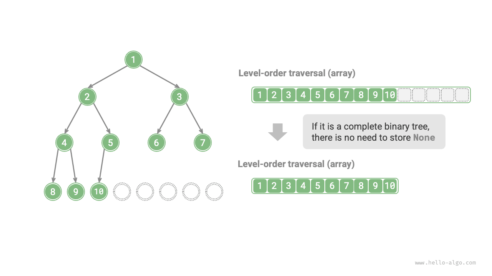

# 7.3 &nbsp; 二分木の配列表現

連結リスト形式では、二分木の格納単位はノード `TreeNode` で、ノード同士はポインタでつながっています。前節では、この形式の二分木の基本操作を紹介しました。

では、二分木を配列で表すこともできるでしょうか。答えは、できます。

## 7.3.1 &nbsp; パーフェクト二分木の表現

まず単純な場合を考えます。パーフェクト二分木の全ノードをレベル順に配列へ格納すると、各ノードが一意のインデックスに対応します。

レベル順走査の特徴から、親と子のインデックスの対応式を導けます。**ノードのインデックスが $i$ なら、左の子は $2i + 1$、右の子は $2i + 2$ です**。図 7-12 に対応関係を示します。

{ class="animation-figure" }

<p align="center"> 図 7-12 &nbsp; パーフェクト二分木の配列表現 </p>

**この対応式は、連結リストのノード参照（ポインタ）と同じ役割を果たします**。配列内のどのノードからでも、式を使って左右の子にアクセスできます。

## 7.3.2 &nbsp; 任意の二分木の表現

パーフェクト二分木は特殊な場合です。一般の二分木では、中間の層にも多くの `None` があります。レベル順の列にはそれらが含まれないため、その列だけでは `None` の数や位置を推測できません。**つまり、同じレベル順の列に対応する二分木の構造が複数あります**。

図 7-13 のように、パーフェクト二分木でない木には、上の配列表現をそのまま使えません。

{ class="animation-figure" }

<p align="center"> 図 7-13 &nbsp; 同じレベル順の列に対応する複数の二分木 </p>

解決するには、**レベル順の列にすべての `None` を明示的に書き込みます**。図 7-14 のように、これで二分木を一意に表せます。コード例を示します。

=== "Python"

    ```python title=""
    # 二分木の配列表現
    # None で空の位置を表す
    tree = [1, 2, 3, 4, None, 6, 7, 8, 9, None, None, 12, None, None, 15]
    ```

=== "C++"

    ```cpp title=""
    /* 二分木の配列表現 */
    // int の最大値 INT_MAX で空の位置を示す
    vector<int> tree = {1, 2, 3, 4, INT_MAX, 6, 7, 8, 9, INT_MAX, INT_MAX, 12, INT_MAX, INT_MAX, 15};
    ```

=== "Java"

    ```java title=""
    /* 二分木の配列表現 */
    // int のラッパークラス Integer を使うと、null で空の位置を示せる
    Integer[] tree = { 1, 2, 3, 4, null, 6, 7, 8, 9, null, null, 12, null, null, 15 };
    ```

=== "C#"

    ```csharp title=""
    /* 二分木の配列表現 */
    // null 許容型 int? を使うと、null で空の位置を示せる
    int?[] tree = [1, 2, 3, 4, null, 6, 7, 8, 9, null, null, 12, null, null, 15];
    ```

=== "Go"

    ```go title=""
    /* 二分木の配列表現 */
    // any 型のスライスを使うと、nil で空の位置を示せる
    tree := []any{1, 2, 3, 4, nil, 6, 7, 8, 9, nil, nil, 12, nil, nil, 15}
    ```

=== "Swift"

    ```swift title=""
    /* 二分木の配列表現 */
    // オプショナル型 Int? を使うと、nil で空の位置を示せる
    let tree: [Int?] = [1, 2, 3, 4, nil, 6, 7, 8, 9, nil, nil, 12, nil, nil, 15]
    ```

=== "JS"

    ```javascript title=""
    /* 二分木の配列表現 */
    // null で空の位置を表す
    let tree = [1, 2, 3, 4, null, 6, 7, 8, 9, null, null, 12, null, null, 15];
    ```

=== "TS"

    ```typescript title=""
    /* 二分木の配列表現 */
    // null で空の位置を表す
    let tree: (number | null)[] = [1, 2, 3, 4, null, 6, 7, 8, 9, null, null, 12, null, null, 15];
    ```

=== "Dart"

    ```dart title=""
    /* 二分木の配列表現 */
    // null 許容型 int? を使うと、null で空の位置を示せる
    List<int?> tree = [1, 2, 3, 4, null, 6, 7, 8, 9, null, null, 12, null, null, 15];
    ```

=== "Rust"

    ```rust title=""
    /* 二分木の配列表現 */
    // None で空の位置を示す
    let tree = [Some(1), Some(2), Some(3), Some(4), None, Some(6), Some(7), Some(8), Some(9), None, None, Some(12), None, None, Some(15)];
    ```

=== "C"

    ```c title=""
    /* 二分木の配列表現 */
    // int の最大値で空の位置を示すため、ノードの値に INT_MAX は使えない
    int tree[] = {1, 2, 3, 4, INT_MAX, 6, 7, 8, 9, INT_MAX, INT_MAX, 12, INT_MAX, INT_MAX, 15};
    ```

=== "Kotlin"

    ```kotlin title=""
    /* 二分木の配列表現 */
    // null で空の位置を表す
    val tree = arrayOf( 1, 2, 3, 4, null, 6, 7, 8, 9, null, null, 12, null, null, 15 )
    ```

=== "Ruby"

    ```ruby title=""
    ### 二分木の配列表現 ###
    # nil で空の位置を表す
    tree = [1, 2, 3, 4, nil, 6, 7, 8, 9, nil, nil, 12, nil, nil, 15]
    ```

{ class="animation-figure" }

<p align="center"> 図 7-14 &nbsp; 任意の二分木の配列表現 </p>

**完全二分木は、配列で表すのに非常に適しています**。定義を思い出すと、`None` は最下層の右側にしかありません。**したがって、すべての `None` はレベル順の列の末尾に現れます**。

つまり、完全二分木を配列で表す場合は、`None` の格納をすべて省けるので便利です。図 7-15 に例を示します。

{ class="animation-figure" }

<p align="center"> 図 7-15 &nbsp; 完全二分木の配列表現 </p>

以下は配列で二分木を実装したコードで、次の操作を含みます。

- 指定したノードの値、左右の子、親を取得します。
- 行きがけ順、通りがけ順、帰りがけ順、レベル順の走査列を取得します。

=== "Python"

    ```python title="array_binary_tree.py"
    class ArrayBinaryTree:
        """配列で表した二分木クラス"""

        def __init__(self, arr: list[int | None]):
            """コンストラクタ"""
            self._tree = list(arr)

        def size(self):
            """リストの容量"""
            return len(self._tree)

        def val(self, i: int) -> int | None:
            """インデックス i のノードの値を取得する"""
            # インデックスが範囲外の場合、空きを表す None を返す
            if i < 0 or i >= self.size():
                return None
            return self._tree[i]

        def left(self, i: int) -> int | None:
            """インデックス i のノードの左の子ノードのインデックスを取得する"""
            return 2 * i + 1

        def right(self, i: int) -> int | None:
            """インデックス i のノードの右の子ノードのインデックスを取得する"""
            return 2 * i + 2

        def parent(self, i: int) -> int | None:
            """インデックス i のノードの親ノードのインデックスを取得する"""
            return (i - 1) // 2

        def level_order(self) -> list[int]:
            """レベル順走査"""
            self.res = []
            # 配列をそのまま走査する
            for i in range(self.size()):
                if self.val(i) is not None:
                    self.res.append(self.val(i))
            return self.res

        def dfs(self, i: int, order: str):
            """深さ優先走査"""
            if self.val(i) is None:
                return
            # 行きがけ順走査
            if order == "pre":
                self.res.append(self.val(i))
            self.dfs(self.left(i), order)
            # 通りがけ順走査
            if order == "in":
                self.res.append(self.val(i))
            self.dfs(self.right(i), order)
            # 帰りがけ順走査
            if order == "post":
                self.res.append(self.val(i))

        def pre_order(self) -> list[int]:
            """行きがけ順走査"""
            self.res = []
            self.dfs(0, order="pre")
            return self.res

        def in_order(self) -> list[int]:
            """通りがけ順走査"""
            self.res = []
            self.dfs(0, order="in")
            return self.res

        def post_order(self) -> list[int]:
            """帰りがけ順走査"""
            self.res = []
            self.dfs(0, order="post")
            return self.res
    ```

=== "C++"

    ```cpp title="array_binary_tree.cpp"
    /* 配列で表した二分木クラス */
    class ArrayBinaryTree {
      public:
        /* コンストラクタ */
        ArrayBinaryTree(vector<int> arr) {
            tree = arr;
        }

        /* リストの容量 */
        int size() {
            return tree.size();
        }

        /* インデックス i のノードの値を取得する */
        int val(int i) {
            // インデックスが範囲外の場合、空きを表す INT_MAX を返す
            if (i < 0 || i >= size())
                return INT_MAX;
            return tree[i];
        }

        /* インデックス i のノードの左の子ノードのインデックスを取得する */
        int left(int i) {
            return 2 * i + 1;
        }

        /* インデックス i のノードの右の子ノードのインデックスを取得する */
        int right(int i) {
            return 2 * i + 2;
        }

        /* インデックス i のノードの親ノードのインデックスを取得する */
        int parent(int i) {
            return (i - 1) / 2;
        }

        /* レベル順走査 */
        vector<int> levelOrder() {
            vector<int> res;
            // 配列をそのまま走査する
            for (int i = 0; i < size(); i++) {
                if (val(i) != INT_MAX)
                    res.push_back(val(i));
            }
            return res;
        }

        /* 行きがけ順走査 */
        vector<int> preOrder() {
            vector<int> res;
            dfs(0, "pre", res);
            return res;
        }

        /* 通りがけ順走査 */
        vector<int> inOrder() {
            vector<int> res;
            dfs(0, "in", res);
            return res;
        }

        /* 帰りがけ順走査 */
        vector<int> postOrder() {
            vector<int> res;
            dfs(0, "post", res);
            return res;
        }

      private:
        vector<int> tree;

        /* 深さ優先走査 */
        void dfs(int i, string order, vector<int> &res) {
            // 空きの場合、戻る
            if (val(i) == INT_MAX)
                return;
            // 行きがけ順走査
            if (order == "pre")
                res.push_back(val(i));
            dfs(left(i), order, res);
            // 通りがけ順走査
            if (order == "in")
                res.push_back(val(i));
            dfs(right(i), order, res);
            // 帰りがけ順走査
            if (order == "post")
                res.push_back(val(i));
        }
    };
    ```

=== "Java"

    ```java title="array_binary_tree.java"
    /* 配列で表した二分木クラス */
    class ArrayBinaryTree {
        private List<Integer> tree;

        /* コンストラクタ */
        public ArrayBinaryTree(List<Integer> arr) {
            tree = new ArrayList<>(arr);
        }

        /* リストの容量 */
        public int size() {
            return tree.size();
        }

        /* インデックス i のノードの値を取得する */
        public Integer val(int i) {
            // インデックスが範囲外の場合、空きを表す null を返す
            if (i < 0 || i >= size())
                return null;
            return tree.get(i);
        }

        /* インデックス i のノードの左の子ノードのインデックスを取得する */
        public Integer left(int i) {
            return 2 * i + 1;
        }

        /* インデックス i のノードの右の子ノードのインデックスを取得する */
        public Integer right(int i) {
            return 2 * i + 2;
        }

        /* インデックス i のノードの親ノードのインデックスを取得する */
        public Integer parent(int i) {
            return (i - 1) / 2;
        }

        /* レベル順走査 */
        public List<Integer> levelOrder() {
            List<Integer> res = new ArrayList<>();
            // 配列をそのまま走査する
            for (int i = 0; i < size(); i++) {
                if (val(i) != null)
                    res.add(val(i));
            }
            return res;
        }

        /* 深さ優先走査 */
        private void dfs(Integer i, String order, List<Integer> res) {
            // 空きの場合、戻る
            if (val(i) == null)
                return;
            // 行きがけ順走査
            if ("pre".equals(order))
                res.add(val(i));
            dfs(left(i), order, res);
            // 通りがけ順走査
            if ("in".equals(order))
                res.add(val(i));
            dfs(right(i), order, res);
            // 帰りがけ順走査
            if ("post".equals(order))
                res.add(val(i));
        }

        /* 行きがけ順走査 */
        public List<Integer> preOrder() {
            List<Integer> res = new ArrayList<>();
            dfs(0, "pre", res);
            return res;
        }

        /* 通りがけ順走査 */
        public List<Integer> inOrder() {
            List<Integer> res = new ArrayList<>();
            dfs(0, "in", res);
            return res;
        }

        /* 帰りがけ順走査 */
        public List<Integer> postOrder() {
            List<Integer> res = new ArrayList<>();
            dfs(0, "post", res);
            return res;
        }
    }
    ```

=== "C#"

    ```csharp title="array_binary_tree.cs"
    /* 配列で表した二分木クラス */
    class ArrayBinaryTree(List<int?> arr) {
        List<int?> tree = new(arr);

        /* リストの容量 */
        public int Size() {
            return tree.Count;
        }

        /* インデックス i のノードの値を取得する */
        public int? Val(int i) {
            // インデックスが範囲外の場合、空きを表す null を返す
            if (i < 0 || i >= Size())
                return null;
            return tree[i];
        }

        /* インデックス i のノードの左の子ノードのインデックスを取得する */
        public int Left(int i) {
            return 2 * i + 1;
        }

        /* インデックス i のノードの右の子ノードのインデックスを取得する */
        public int Right(int i) {
            return 2 * i + 2;
        }

        /* インデックス i のノードの親ノードのインデックスを取得する */
        public int Parent(int i) {
            return (i - 1) / 2;
        }

        /* レベル順走査 */
        public List<int> LevelOrder() {
            List<int> res = [];
            // 配列をそのまま走査する
            for (int i = 0; i < Size(); i++) {
                if (Val(i).HasValue)
                    res.Add(Val(i)!.Value);
            }
            return res;
        }

        /* 深さ優先走査 */
        void DFS(int i, string order, List<int> res) {
            // 空きの場合、戻る
            if (!Val(i).HasValue)
                return;
            // 行きがけ順走査
            if (order == "pre")
                res.Add(Val(i)!.Value);
            DFS(Left(i), order, res);
            // 通りがけ順走査
            if (order == "in")
                res.Add(Val(i)!.Value);
            DFS(Right(i), order, res);
            // 帰りがけ順走査
            if (order == "post")
                res.Add(Val(i)!.Value);
        }

        /* 行きがけ順走査 */
        public List<int> PreOrder() {
            List<int> res = [];
            DFS(0, "pre", res);
            return res;
        }

        /* 通りがけ順走査 */
        public List<int> InOrder() {
            List<int> res = [];
            DFS(0, "in", res);
            return res;
        }

        /* 帰りがけ順走査 */
        public List<int> PostOrder() {
            List<int> res = [];
            DFS(0, "post", res);
            return res;
        }
    }
    ```

=== "Go"

    ```go title="array_binary_tree.go"
    /* 配列で表した二分木クラス */
    type arrayBinaryTree struct {
        tree []any
    }

    /* コンストラクタ */
    func newArrayBinaryTree(arr []any) *arrayBinaryTree {
        return &arrayBinaryTree{
            tree: arr,
        }
    }

    /* リストの容量 */
    func (abt *arrayBinaryTree) size() int {
        return len(abt.tree)
    }

    /* インデックス i のノードの値を取得する */
    func (abt *arrayBinaryTree) val(i int) any {
        // インデックスが範囲外の場合、空きを表す null を返す
        if i < 0 || i >= abt.size() {
            return nil
        }
        return abt.tree[i]
    }

    /* インデックス i のノードの左の子ノードのインデックスを取得する */
    func (abt *arrayBinaryTree) left(i int) int {
        return 2*i + 1
    }

    /* インデックス i のノードの右の子ノードのインデックスを取得する */
    func (abt *arrayBinaryTree) right(i int) int {
        return 2*i + 2
    }

    /* インデックス i のノードの親ノードのインデックスを取得する */
    func (abt *arrayBinaryTree) parent(i int) int {
        return (i - 1) / 2
    }

    /* レベル順走査 */
    func (abt *arrayBinaryTree) levelOrder() []any {
        var res []any
        // 配列をそのまま走査する
        for i := 0; i < abt.size(); i++ {
            if abt.val(i) != nil {
                res = append(res, abt.val(i))
            }
        }
        return res
    }

    /* 深さ優先走査 */
    func (abt *arrayBinaryTree) dfs(i int, order string, res *[]any) {
        // 空きの場合、戻る
        if abt.val(i) == nil {
            return
        }
        // 行きがけ順走査
        if order == "pre" {
            *res = append(*res, abt.val(i))
        }
        abt.dfs(abt.left(i), order, res)
        // 通りがけ順走査
        if order == "in" {
            *res = append(*res, abt.val(i))
        }
        abt.dfs(abt.right(i), order, res)
        // 帰りがけ順走査
        if order == "post" {
            *res = append(*res, abt.val(i))
        }
    }

    /* 行きがけ順走査 */
    func (abt *arrayBinaryTree) preOrder() []any {
        var res []any
        abt.dfs(0, "pre", &res)
        return res
    }

    /* 通りがけ順走査 */
    func (abt *arrayBinaryTree) inOrder() []any {
        var res []any
        abt.dfs(0, "in", &res)
        return res
    }

    /* 帰りがけ順走査 */
    func (abt *arrayBinaryTree) postOrder() []any {
        var res []any
        abt.dfs(0, "post", &res)
        return res
    }
    ```

=== "Swift"

    ```swift title="array_binary_tree.swift"
    /* 配列で表した二分木クラス */
    class ArrayBinaryTree {
        private var tree: [Int?]

        /* コンストラクタ */
        init(arr: [Int?]) {
            tree = arr
        }

        /* リストの容量 */
        func size() -> Int {
            tree.count
        }

        /* インデックス i のノードの値を取得する */
        func val(i: Int) -> Int? {
            // インデックスが範囲外の場合、空きを表す null を返す
            if i < 0 || i >= size() {
                return nil
            }
            return tree[i]
        }

        /* インデックス i のノードの左の子ノードのインデックスを取得する */
        func left(i: Int) -> Int {
            2 * i + 1
        }

        /* インデックス i のノードの右の子ノードのインデックスを取得する */
        func right(i: Int) -> Int {
            2 * i + 2
        }

        /* インデックス i のノードの親ノードのインデックスを取得する */
        func parent(i: Int) -> Int {
            (i - 1) / 2
        }

        /* レベル順走査 */
        func levelOrder() -> [Int] {
            var res: [Int] = []
            // 配列をそのまま走査する
            for i in 0 ..< size() {
                if let val = val(i: i) {
                    res.append(val)
                }
            }
            return res
        }

        /* 深さ優先走査 */
        private func dfs(i: Int, order: String, res: inout [Int]) {
            // 空きの場合、戻る
            guard let val = val(i: i) else {
                return
            }
            // 行きがけ順走査
            if order == "pre" {
                res.append(val)
            }
            dfs(i: left(i: i), order: order, res: &res)
            // 通りがけ順走査
            if order == "in" {
                res.append(val)
            }
            dfs(i: right(i: i), order: order, res: &res)
            // 帰りがけ順走査
            if order == "post" {
                res.append(val)
            }
        }

        /* 行きがけ順走査 */
        func preOrder() -> [Int] {
            var res: [Int] = []
            dfs(i: 0, order: "pre", res: &res)
            return res
        }

        /* 通りがけ順走査 */
        func inOrder() -> [Int] {
            var res: [Int] = []
            dfs(i: 0, order: "in", res: &res)
            return res
        }

        /* 帰りがけ順走査 */
        func postOrder() -> [Int] {
            var res: [Int] = []
            dfs(i: 0, order: "post", res: &res)
            return res
        }
    }
    ```

=== "JS"

    ```javascript title="array_binary_tree.js"
    /* 配列で表した二分木クラス */
    class ArrayBinaryTree {
        #tree;

        /* コンストラクタ */
        constructor(arr) {
            this.#tree = arr;
        }

        /* リストの容量 */
        size() {
            return this.#tree.length;
        }

        /* インデックス i のノードの値を取得する */
        val(i) {
            // インデックスが範囲外の場合、空きを表す null を返す
            if (i < 0 || i >= this.size()) return null;
            return this.#tree[i];
        }

        /* インデックス i のノードの左の子ノードのインデックスを取得する */
        left(i) {
            return 2 * i + 1;
        }

        /* インデックス i のノードの右の子ノードのインデックスを取得する */
        right(i) {
            return 2 * i + 2;
        }

        /* インデックス i のノードの親ノードのインデックスを取得する */
        parent(i) {
            return Math.floor((i - 1) / 2); // 切り捨て除算
        }

        /* レベル順走査 */
        levelOrder() {
            let res = [];
            // 配列をそのまま走査する
            for (let i = 0; i < this.size(); i++) {
                if (this.val(i) !== null) res.push(this.val(i));
            }
            return res;
        }

        /* 深さ優先走査 */
        #dfs(i, order, res) {
            // 空きの場合、戻る
            if (this.val(i) === null) return;
            // 行きがけ順走査
            if (order === 'pre') res.push(this.val(i));
            this.#dfs(this.left(i), order, res);
            // 通りがけ順走査
            if (order === 'in') res.push(this.val(i));
            this.#dfs(this.right(i), order, res);
            // 帰りがけ順走査
            if (order === 'post') res.push(this.val(i));
        }

        /* 行きがけ順走査 */
        preOrder() {
            const res = [];
            this.#dfs(0, 'pre', res);
            return res;
        }

        /* 通りがけ順走査 */
        inOrder() {
            const res = [];
            this.#dfs(0, 'in', res);
            return res;
        }

        /* 帰りがけ順走査 */
        postOrder() {
            const res = [];
            this.#dfs(0, 'post', res);
            return res;
        }
    }
    ```

=== "TS"

    ```typescript title="array_binary_tree.ts"
    /* 配列で表した二分木クラス */
    class ArrayBinaryTree {
        #tree: (number | null)[];

        /* コンストラクタ */
        constructor(arr: (number | null)[]) {
            this.#tree = arr;
        }

        /* リストの容量 */
        size(): number {
            return this.#tree.length;
        }

        /* インデックス i のノードの値を取得する */
        val(i: number): number | null {
            // インデックスが範囲外の場合、空きを表す null を返す
            if (i < 0 || i >= this.size()) return null;
            return this.#tree[i];
        }

        /* インデックス i のノードの左の子ノードのインデックスを取得する */
        left(i: number): number {
            return 2 * i + 1;
        }

        /* インデックス i のノードの右の子ノードのインデックスを取得する */
        right(i: number): number {
            return 2 * i + 2;
        }

        /* インデックス i のノードの親ノードのインデックスを取得する */
        parent(i: number): number {
            return Math.floor((i - 1) / 2); // 切り捨て除算
        }

        /* レベル順走査 */
        levelOrder(): number[] {
            let res = [];
            // 配列をそのまま走査する
            for (let i = 0; i < this.size(); i++) {
                if (this.val(i) !== null) res.push(this.val(i));
            }
            return res;
        }

        /* 深さ優先走査 */
        #dfs(i: number, order: Order, res: (number | null)[]): void {
            // 空きの場合、戻る
            if (this.val(i) === null) return;
            // 行きがけ順走査
            if (order === 'pre') res.push(this.val(i));
            this.#dfs(this.left(i), order, res);
            // 通りがけ順走査
            if (order === 'in') res.push(this.val(i));
            this.#dfs(this.right(i), order, res);
            // 帰りがけ順走査
            if (order === 'post') res.push(this.val(i));
        }

        /* 行きがけ順走査 */
        preOrder(): (number | null)[] {
            const res = [];
            this.#dfs(0, 'pre', res);
            return res;
        }

        /* 通りがけ順走査 */
        inOrder(): (number | null)[] {
            const res = [];
            this.#dfs(0, 'in', res);
            return res;
        }

        /* 帰りがけ順走査 */
        postOrder(): (number | null)[] {
            const res = [];
            this.#dfs(0, 'post', res);
            return res;
        }
    }
    ```

=== "Dart"

    ```dart title="array_binary_tree.dart"
    /* 配列で表した二分木クラス */
    class ArrayBinaryTree {
      late List<int?> _tree;

      /* コンストラクタ */
      ArrayBinaryTree(this._tree);

      /* リストの容量 */
      int size() {
        return _tree.length;
      }

      /* インデックス i のノードの値を取得する */
      int? val(int i) {
        // インデックスが範囲外の場合、空きを表す null を返す
        if (i < 0 || i >= size()) {
          return null;
        }
        return _tree[i];
      }

      /* インデックス i のノードの左の子ノードのインデックスを取得する */
      int? left(int i) {
        return 2 * i + 1;
      }

      /* インデックス i のノードの右の子ノードのインデックスを取得する */
      int? right(int i) {
        return 2 * i + 2;
      }

      /* インデックス i のノードの親ノードのインデックスを取得する */
      int? parent(int i) {
        return (i - 1) ~/ 2;
      }

      /* レベル順走査 */
      List<int> levelOrder() {
        List<int> res = [];
        for (int i = 0; i < size(); i++) {
          if (val(i) != null) {
            res.add(val(i)!);
          }
        }
        return res;
      }

      /* 深さ優先走査 */
      void dfs(int i, String order, List<int?> res) {
        // 空きの場合、戻る
        if (val(i) == null) {
          return;
        }
        // 行きがけ順走査
        if (order == 'pre') {
          res.add(val(i));
        }
        dfs(left(i)!, order, res);
        // 通りがけ順走査
        if (order == 'in') {
          res.add(val(i));
        }
        dfs(right(i)!, order, res);
        // 帰りがけ順走査
        if (order == 'post') {
          res.add(val(i));
        }
      }

      /* 行きがけ順走査 */
      List<int?> preOrder() {
        List<int?> res = [];
        dfs(0, 'pre', res);
        return res;
      }

      /* 通りがけ順走査 */
      List<int?> inOrder() {
        List<int?> res = [];
        dfs(0, 'in', res);
        return res;
      }

      /* 帰りがけ順走査 */
      List<int?> postOrder() {
        List<int?> res = [];
        dfs(0, 'post', res);
        return res;
      }
    }
    ```

=== "Rust"

    ```rust title="array_binary_tree.rs"
    /* 配列で表した二分木クラス */
    struct ArrayBinaryTree {
        tree: Vec<Option<i32>>,
    }

    impl ArrayBinaryTree {
        /* コンストラクタ */
        fn new(arr: Vec<Option<i32>>) -> Self {
            Self { tree: arr }
        }

        /* リストの容量 */
        fn size(&self) -> i32 {
            self.tree.len() as i32
        }

        /* インデックス i のノードの値を取得する */
        fn val(&self, i: i32) -> Option<i32> {
            // インデックスが範囲外の場合、空きを表す None を返す
            if i < 0 || i >= self.size() {
                None
            } else {
                self.tree[i as usize]
            }
        }

        /* インデックス i のノードの左の子ノードのインデックスを取得する */
        fn left(&self, i: i32) -> i32 {
            2 * i + 1
        }

        /* インデックス i のノードの右の子ノードのインデックスを取得する */
        fn right(&self, i: i32) -> i32 {
            2 * i + 2
        }

        /* インデックス i のノードの親ノードのインデックスを取得する */
        fn parent(&self, i: i32) -> i32 {
            (i - 1) / 2
        }

        /* レベル順走査 */
        fn level_order(&self) -> Vec<i32> {
            self.tree.iter().filter_map(|&x| x).collect()
        }

        /* 深さ優先走査 */
        fn dfs(&self, i: i32, order: &'static str, res: &mut Vec<i32>) {
            if self.val(i).is_none() {
                return;
            }
            let val = self.val(i).unwrap();
            // 行きがけ順走査
            if order == "pre" {
                res.push(val);
            }
            self.dfs(self.left(i), order, res);
            // 通りがけ順走査
            if order == "in" {
                res.push(val);
            }
            self.dfs(self.right(i), order, res);
            // 帰りがけ順走査
            if order == "post" {
                res.push(val);
            }
        }

        /* 行きがけ順走査 */
        fn pre_order(&self) -> Vec<i32> {
            let mut res = vec![];
            self.dfs(0, "pre", &mut res);
            res
        }

        /* 通りがけ順走査 */
        fn in_order(&self) -> Vec<i32> {
            let mut res = vec![];
            self.dfs(0, "in", &mut res);
            res
        }

        /* 帰りがけ順走査 */
        fn post_order(&self) -> Vec<i32> {
            let mut res = vec![];
            self.dfs(0, "post", &mut res);
            res
        }
    }
    ```

=== "C"

    ```c title="array_binary_tree.c"
    /* 配列で表した二分木の構造体 */
    typedef struct {
        int *tree;
        int size;
    } ArrayBinaryTree;

    /* コンストラクタ */
    ArrayBinaryTree *newArrayBinaryTree(int *arr, int arrSize) {
        ArrayBinaryTree *abt = (ArrayBinaryTree *)malloc(sizeof(ArrayBinaryTree));
        abt->tree = malloc(sizeof(int) * arrSize);
        memcpy(abt->tree, arr, sizeof(int) * arrSize);
        abt->size = arrSize;
        return abt;
    }

    /* デストラクタ */
    void delArrayBinaryTree(ArrayBinaryTree *abt) {
        free(abt->tree);
        free(abt);
    }

    /* リストの容量 */
    int size(ArrayBinaryTree *abt) {
        return abt->size;
    }

    /* インデックス i のノードの値を取得する */
    int val(ArrayBinaryTree *abt, int i) {
        // インデックスが範囲外の場合、空きを表す INT_MAX を返す
        if (i < 0 || i >= size(abt))
            return INT_MAX;
        return abt->tree[i];
    }

    /* レベル順走査 */
    int *levelOrder(ArrayBinaryTree *abt, int *returnSize) {
        int *res = (int *)malloc(sizeof(int) * size(abt));
        int index = 0;
        // 配列をそのまま走査する
        for (int i = 0; i < size(abt); i++) {
            if (val(abt, i) != INT_MAX)
                res[index++] = val(abt, i);
        }
        *returnSize = index;
        return res;
    }

    /* 深さ優先走査 */
    void dfs(ArrayBinaryTree *abt, int i, char *order, int *res, int *index) {
        // 空きの場合、戻る
        if (val(abt, i) == INT_MAX)
            return;
        // 行きがけ順走査
        if (strcmp(order, "pre") == 0)
            res[(*index)++] = val(abt, i);
        dfs(abt, left(i), order, res, index);
        // 通りがけ順走査
        if (strcmp(order, "in") == 0)
            res[(*index)++] = val(abt, i);
        dfs(abt, right(i), order, res, index);
        // 帰りがけ順走査
        if (strcmp(order, "post") == 0)
            res[(*index)++] = val(abt, i);
    }

    /* 行きがけ順走査 */
    int *preOrder(ArrayBinaryTree *abt, int *returnSize) {
        int *res = (int *)malloc(sizeof(int) * size(abt));
        int index = 0;
        dfs(abt, 0, "pre", res, &index);
        *returnSize = index;
        return res;
    }

    /* 通りがけ順走査 */
    int *inOrder(ArrayBinaryTree *abt, int *returnSize) {
        int *res = (int *)malloc(sizeof(int) * size(abt));
        int index = 0;
        dfs(abt, 0, "in", res, &index);
        *returnSize = index;
        return res;
    }

    /* 帰りがけ順走査 */
    int *postOrder(ArrayBinaryTree *abt, int *returnSize) {
        int *res = (int *)malloc(sizeof(int) * size(abt));
        int index = 0;
        dfs(abt, 0, "post", res, &index);
        *returnSize = index;
        return res;
    }
    ```

=== "Kotlin"

    ```kotlin title="array_binary_tree.kt"
    /* 配列で表した二分木クラス */
    class ArrayBinaryTree(val tree: MutableList<Int?>) {
        /* リストの容量 */
        fun size(): Int {
            return tree.size
        }

        /* インデックス i のノードの値を取得する */
        fun _val(i: Int): Int? {
            // インデックスが範囲外の場合、空きを表す null を返す
            if (i < 0 || i >= size()) return null
            return tree[i]
        }

        /* インデックス i のノードの左の子ノードのインデックスを取得する */
        fun left(i: Int): Int {
            return 2 * i + 1
        }

        /* インデックス i のノードの右の子ノードのインデックスを取得する */
        fun right(i: Int): Int {
            return 2 * i + 2
        }

        /* インデックス i のノードの親ノードのインデックスを取得する */
        fun parent(i: Int): Int {
            return (i - 1) / 2
        }

        /* レベル順走査 */
        fun levelOrder(): MutableList<Int?> {
            val res = mutableListOf<Int?>()
            // 配列をそのまま走査する
            for (i in 0..<size()) {
                if (_val(i) != null)
                    res.add(_val(i))
            }
            return res
        }

        /* 深さ優先走査 */
        fun dfs(i: Int, order: String, res: MutableList<Int?>) {
            // 空きの場合、戻る
            if (_val(i) == null)
                return
            // 行きがけ順走査
            if ("pre" == order)
                res.add(_val(i))
            dfs(left(i), order, res)
            // 通りがけ順走査
            if ("in" == order)
                res.add(_val(i))
            dfs(right(i), order, res)
            // 帰りがけ順走査
            if ("post" == order)
                res.add(_val(i))
        }

        /* 行きがけ順走査 */
        fun preOrder(): MutableList<Int?> {
            val res = mutableListOf<Int?>()
            dfs(0, "pre", res)
            return res
        }

        /* 通りがけ順走査 */
        fun inOrder(): MutableList<Int?> {
            val res = mutableListOf<Int?>()
            dfs(0, "in", res)
            return res
        }

        /* 帰りがけ順走査 */
        fun postOrder(): MutableList<Int?> {
            val res = mutableListOf<Int?>()
            dfs(0, "post", res)
            return res
        }
    }
    ```

=== "Ruby"

    ```ruby title="array_binary_tree.rb"
    ### 配列で表した二分木クラス ###
    class ArrayBinaryTree
      ### コンストラクタ ###
      def initialize(arr)
        @tree = arr.to_a
      end

      ### リストの容量 ###
      def size
        @tree.length
      end

      ### インデックス i のノードの値を取得する ###
      def val(i)
        # インデックスが範囲外の場合、空きを表す nil を返す
        return if i < 0 || i >= size

        @tree[i]
      end

      ### インデックス i のノードの左の子ノードのインデックスを取得する ###
      def left(i)
        2 * i + 1
      end

      ### インデックス i のノードの右の子ノードのインデックスを取得する ###
      def right(i)
        2 * i + 2
      end

      ### インデックス i のノードの親ノードのインデックスを取得する ###
      def parent(i)
        (i - 1) / 2
      end

      ### レベル順走査 ###
      def level_order
        @res = []

        # 配列をそのまま走査する
        for i in 0...size
          @res << val(i) unless val(i).nil?
        end

        @res
      end

      ### 深さ優先走査 ###
      def dfs(i, order)
        return if val(i).nil?
        # 行きがけ順走査
        @res << val(i) if order == :pre
        dfs(left(i), order)
        # 通りがけ順走査
        @res << val(i) if order == :in
        dfs(right(i), order)
        # 帰りがけ順走査
        @res << val(i) if order == :post
      end

      ### 行きがけ順走査 ###
      def pre_order
        @res = []
        dfs(0, :pre)
        @res
      end

      ### 通りがけ順走査 ###
      def in_order
        @res = []
        dfs(0, :in)
        @res
      end

      ### 帰りがけ順走査 ###
      def post_order
        @res = []
        dfs(0, :post)
        @res
      end
    end
    ```

??? pythontutor "実行の可視化"

    <div style="height: 549px; width: 100%;"><iframe class="pythontutor-iframe" title="実行の可視化" src="https://pythontutor.com/iframe-embed.html#code=class%20TreeNode%3A%0A%20%20%22%22%22%E4%BA%8C%E5%88%86%E6%9C%A8%E3%81%AE%E3%83%8E%E3%83%BC%E3%83%89%E3%82%AF%E3%83%A9%E3%82%B9%22%22%22%0A%20%20def%20__init__%28self,%20val%29%3A%0A%20%20%20%20self.val%20%3D%20val%0A%20%20%20%20self.left%20%3D%20None%0A%20%20%20%20self.right%20%3D%20None%0A%0Aclass%20ArrayBinaryTree%3A%0A%20%20%22%22%22%E9%85%8D%E5%88%97%E3%81%A7%E8%A1%A8%E3%81%97%E3%81%9F%E4%BA%8C%E5%88%86%E6%9C%A8%E3%82%AF%E3%83%A9%E3%82%B9%22%22%22%0A%0A%20%20def%20__init__%28self,%20arr%3A%20list%5Bint%20%7C%20None%5D%29%3A%0A%20%20%20%20%22%22%22%E3%82%B3%E3%83%B3%E3%82%B9%E3%83%88%E3%83%A9%E3%82%AF%E3%82%BF%22%22%22%0A%20%20%20%20self._tree%20%3D%20list%28arr%29%0A%0A%20%20def%20size%28self%29%3A%0A%20%20%20%20%22%22%22%E3%83%AA%E3%82%B9%E3%83%88%E3%81%AE%E5%AE%B9%E9%87%8F%22%22%22%0A%20%20%20%20return%20len%28self._tree%29%0A%0A%20%20def%20val%28self,%20i%3A%20int%29%20-%3E%20int%3A%0A%20%20%20%20%22%22%22%E3%82%A4%E3%83%B3%E3%83%87%E3%83%83%E3%82%AF%E3%82%B9%20i%20%E3%81%AE%E3%83%8E%E3%83%BC%E3%83%89%E3%81%AE%E5%80%A4%E3%82%92%E5%8F%96%E5%BE%97%E3%81%99%E3%82%8B%22%22%22%0A%20%20%20%20if%20i%20%3C%200%20or%20i%20%3E%3D%20self.size%28%29%3A%0A%20%20%20%20%20%20return%20None%0A%20%20%20%20return%20self._tree%5Bi%5D%0A%0A%20%20def%20left%28self,%20i%3A%20int%29%20-%3E%20int%20%7C%20None%3A%0A%20%20%20%20%22%22%22%E5%B7%A6%E3%81%AE%E5%AD%90%E3%81%AE%E3%82%A4%E3%83%B3%E3%83%87%E3%83%83%E3%82%AF%E3%82%B9%E3%82%92%E5%8F%96%E5%BE%97%22%22%22%0A%20%20%20%20return%202%20%2A%20i%20%2B%201%0A%0A%20%20def%20right%28self,%20i%3A%20int%29%20-%3E%20int%20%7C%20None%3A%0A%20%20%20%20%22%22%22%E5%8F%B3%E3%81%AE%E5%AD%90%E3%81%AE%E3%82%A4%E3%83%B3%E3%83%87%E3%83%83%E3%82%AF%E3%82%B9%E3%82%92%E5%8F%96%E5%BE%97%22%22%22%0A%20%20%20%20return%202%20%2A%20i%20%2B%202%0A%0A%20%20def%20parent%28self,%20i%3A%20int%29%20-%3E%20int%20%7C%20None%3A%0A%20%20%20%20%22%22%22%E8%A6%AA%E3%81%AE%E3%82%A4%E3%83%B3%E3%83%87%E3%83%83%E3%82%AF%E3%82%B9%E3%82%92%E5%8F%96%E5%BE%97%22%22%22%0A%20%20%20%20return%20%28i%20-%201%29%20//%202%0A%0A%20%20def%20level_order%28self%29%20-%3E%20list%5Bint%5D%3A%0A%20%20%20%20%22%22%22%E3%83%AC%E3%83%99%E3%83%AB%E9%A0%86%E8%B5%B0%E6%9F%BB%22%22%22%0A%20%20%20%20self.res%20%3D%20%5B%5D%0A%20%20%20%20%23%20%E9%85%8D%E5%88%97%E3%82%92%E3%81%9D%E3%81%AE%E3%81%BE%E3%81%BE%E8%B5%B0%E6%9F%BB%E3%81%99%E3%82%8B%0A%20%20%20%20for%20i%20in%20range%28self.size%28%29%29%3A%0A%20%20%20%20%20%20if%20self.val%28i%29%20is%20not%20None%3A%0A%20%20%20%20%20%20%20%20self.res.append%28self.val%28i%29%29%0A%20%20%20%20return%20self.res%0A%0A%20%20def%20dfs%28self,%20i%3A%20int,%20order%3A%20str%29%3A%0A%20%20%20%20%22%22%22%E6%B7%B1%E3%81%95%E5%84%AA%E5%85%88%E8%B5%B0%E6%9F%BB%22%22%22%0A%20%20%20%20if%20self.val%28i%29%20is%20None%3A%0A%20%20%20%20%20%20return%0A%20%20%20%20%23%20%E8%A1%8C%E3%81%8D%E3%81%8C%E3%81%91%E9%A0%86%E8%B5%B0%E6%9F%BB%0A%20%20%20%20if%20order%20%3D%3D%20%22pre%22%3A%0A%20%20%20%20%20%20self.res.append%28self.val%28i%29%29%0A%20%20%20%20self.dfs%28self.left%28i%29,%20order%29%0A%20%20%20%20%23%20%E9%80%9A%E3%82%8A%E3%81%8C%E3%81%91%E9%A0%86%E8%B5%B0%E6%9F%BB%0A%20%20%20%20if%20order%20%3D%3D%20%22in%22%3A%0A%20%20%20%20%20%20self.res.append%28self.val%28i%29%29%0A%20%20%20%20self.dfs%28self.right%28i%29,%20order%29%0A%20%20%20%20%23%20%E5%B8%B0%E3%82%8A%E3%81%8C%E3%81%91%E9%A0%86%E8%B5%B0%E6%9F%BB%0A%20%20%20%20if%20order%20%3D%3D%20%22post%22%3A%0A%20%20%20%20%20%20self.res.append%28self.val%28i%29%29%0A%0A%20%20def%20pre_order%28self%29%20-%3E%20list%5Bint%5D%3A%0A%20%20%20%20%22%22%22%E8%A1%8C%E3%81%8D%E3%81%8C%E3%81%91%E9%A0%86%E8%B5%B0%E6%9F%BB%22%22%22%0A%20%20%20%20self.res%20%3D%20%5B%5D%0A%20%20%20%20self.dfs%280,%20order%3D%22pre%22%29%0A%20%20%20%20return%20self.res%0A%0A%20%20def%20in_order%28self%29%20-%3E%20list%5Bint%5D%3A%0A%20%20%20%20%22%22%22%E9%80%9A%E3%82%8A%E3%81%8C%E3%81%91%E9%A0%86%E8%B5%B0%E6%9F%BB%22%22%22%0A%20%20%20%20self.res%20%3D%20%5B%5D%0A%20%20%20%20self.dfs%280,%20order%3D%22in%22%29%0A%20%20%20%20return%20self.res%0A%0A%20%20def%20post_order%28self%29%20-%3E%20list%5Bint%5D%3A%0A%20%20%20%20%22%22%22%E5%B8%B0%E3%82%8A%E3%81%8C%E3%81%91%E9%A0%86%E8%B5%B0%E6%9F%BB%22%22%22%0A%20%20%20%20self.res%20%3D%20%5B%5D%0A%20%20%20%20self.dfs%280,%20order%3D%22post%22%29%0A%20%20%20%20return%20self.res%0A%0A%22%22%22%E5%AE%9F%E8%A1%8C%E7%94%A8%E3%82%B3%E3%83%BC%E3%83%89%22%22%22%0Aif%20__name__%20%3D%3D%20%22__main__%22%3A%0A%20%20%23%20%E4%BA%8C%E5%88%86%E6%9C%A8%E3%82%92%E5%88%9D%E6%9C%9F%E5%8C%96%E3%81%99%E3%82%8B%0A%20%20arr%20%3D%20%5B1,%202,%203,%204,%20None,%206,%20None%5D%0A%20%20abt%20%3D%20ArrayBinaryTree%28arr%29%0A%0A%20%20%23%20%E3%83%8E%E3%83%BC%E3%83%89%E3%81%AB%E3%82%A2%E3%82%AF%E3%82%BB%E3%82%B9%E3%81%99%E3%82%8B%0A%20%20i%20%3D%201%0A%20%20l,%20r,%20p%20%3D%20abt.left%28i%29,%20abt.right%28i%29,%20abt.parent%28i%29%0A%0A%20%20%23%20%E6%9C%A8%E3%82%92%E8%B5%B0%E6%9F%BB%E3%81%99%E3%82%8B%0A%20%20res%20%3D%20abt.level_order%28%29%0A%20%20res%20%3D%20abt.pre_order%28%29%0A%20%20res%20%3D%20abt.in_order%28%29%0A%20%20res%20%3D%20abt.post_order%28%29&codeDivHeight=472&codeDivWidth=350&cumulative=false&curInstr=5&heapPrimitives=nevernest&origin=opt-frontend.js&py=311&rawInputLstJSON=%5B%5D&textReferences=false"> </iframe></div>
    <div style="margin-top: 5px;"><a href="https://pythontutor.com/iframe-embed.html#code=class%20TreeNode%3A%0A%20%20%22%22%22%E4%BA%8C%E5%88%86%E6%9C%A8%E3%81%AE%E3%83%8E%E3%83%BC%E3%83%89%E3%82%AF%E3%83%A9%E3%82%B9%22%22%22%0A%20%20def%20__init__%28self,%20val%29%3A%0A%20%20%20%20self.val%20%3D%20val%0A%20%20%20%20self.left%20%3D%20None%0A%20%20%20%20self.right%20%3D%20None%0A%0Aclass%20ArrayBinaryTree%3A%0A%20%20%22%22%22%E9%85%8D%E5%88%97%E3%81%A7%E8%A1%A8%E3%81%97%E3%81%9F%E4%BA%8C%E5%88%86%E6%9C%A8%E3%82%AF%E3%83%A9%E3%82%B9%22%22%22%0A%0A%20%20def%20__init__%28self,%20arr%3A%20list%5Bint%20%7C%20None%5D%29%3A%0A%20%20%20%20%22%22%22%E3%82%B3%E3%83%B3%E3%82%B9%E3%83%88%E3%83%A9%E3%82%AF%E3%82%BF%22%22%22%0A%20%20%20%20self._tree%20%3D%20list%28arr%29%0A%0A%20%20def%20size%28self%29%3A%0A%20%20%20%20%22%22%22%E3%83%AA%E3%82%B9%E3%83%88%E3%81%AE%E5%AE%B9%E9%87%8F%22%22%22%0A%20%20%20%20return%20len%28self._tree%29%0A%0A%20%20def%20val%28self,%20i%3A%20int%29%20-%3E%20int%3A%0A%20%20%20%20%22%22%22%E3%82%A4%E3%83%B3%E3%83%87%E3%83%83%E3%82%AF%E3%82%B9%20i%20%E3%81%AE%E3%83%8E%E3%83%BC%E3%83%89%E3%81%AE%E5%80%A4%E3%82%92%E5%8F%96%E5%BE%97%E3%81%99%E3%82%8B%22%22%22%0A%20%20%20%20if%20i%20%3C%200%20or%20i%20%3E%3D%20self.size%28%29%3A%0A%20%20%20%20%20%20return%20None%0A%20%20%20%20return%20self._tree%5Bi%5D%0A%0A%20%20def%20left%28self,%20i%3A%20int%29%20-%3E%20int%20%7C%20None%3A%0A%20%20%20%20%22%22%22%E5%B7%A6%E3%81%AE%E5%AD%90%E3%81%AE%E3%82%A4%E3%83%B3%E3%83%87%E3%83%83%E3%82%AF%E3%82%B9%E3%82%92%E5%8F%96%E5%BE%97%22%22%22%0A%20%20%20%20return%202%20%2A%20i%20%2B%201%0A%0A%20%20def%20right%28self,%20i%3A%20int%29%20-%3E%20int%20%7C%20None%3A%0A%20%20%20%20%22%22%22%E5%8F%B3%E3%81%AE%E5%AD%90%E3%81%AE%E3%82%A4%E3%83%B3%E3%83%87%E3%83%83%E3%82%AF%E3%82%B9%E3%82%92%E5%8F%96%E5%BE%97%22%22%22%0A%20%20%20%20return%202%20%2A%20i%20%2B%202%0A%0A%20%20def%20parent%28self,%20i%3A%20int%29%20-%3E%20int%20%7C%20None%3A%0A%20%20%20%20%22%22%22%E8%A6%AA%E3%81%AE%E3%82%A4%E3%83%B3%E3%83%87%E3%83%83%E3%82%AF%E3%82%B9%E3%82%92%E5%8F%96%E5%BE%97%22%22%22%0A%20%20%20%20return%20%28i%20-%201%29%20//%202%0A%0A%20%20def%20level_order%28self%29%20-%3E%20list%5Bint%5D%3A%0A%20%20%20%20%22%22%22%E3%83%AC%E3%83%99%E3%83%AB%E9%A0%86%E8%B5%B0%E6%9F%BB%22%22%22%0A%20%20%20%20self.res%20%3D%20%5B%5D%0A%20%20%20%20%23%20%E9%85%8D%E5%88%97%E3%82%92%E3%81%9D%E3%81%AE%E3%81%BE%E3%81%BE%E8%B5%B0%E6%9F%BB%E3%81%99%E3%82%8B%0A%20%20%20%20for%20i%20in%20range%28self.size%28%29%29%3A%0A%20%20%20%20%20%20if%20self.val%28i%29%20is%20not%20None%3A%0A%20%20%20%20%20%20%20%20self.res.append%28self.val%28i%29%29%0A%20%20%20%20return%20self.res%0A%0A%20%20def%20dfs%28self,%20i%3A%20int,%20order%3A%20str%29%3A%0A%20%20%20%20%22%22%22%E6%B7%B1%E3%81%95%E5%84%AA%E5%85%88%E8%B5%B0%E6%9F%BB%22%22%22%0A%20%20%20%20if%20self.val%28i%29%20is%20None%3A%0A%20%20%20%20%20%20return%0A%20%20%20%20%23%20%E8%A1%8C%E3%81%8D%E3%81%8C%E3%81%91%E9%A0%86%E8%B5%B0%E6%9F%BB%0A%20%20%20%20if%20order%20%3D%3D%20%22pre%22%3A%0A%20%20%20%20%20%20self.res.append%28self.val%28i%29%29%0A%20%20%20%20self.dfs%28self.left%28i%29,%20order%29%0A%20%20%20%20%23%20%E9%80%9A%E3%82%8A%E3%81%8C%E3%81%91%E9%A0%86%E8%B5%B0%E6%9F%BB%0A%20%20%20%20if%20order%20%3D%3D%20%22in%22%3A%0A%20%20%20%20%20%20self.res.append%28self.val%28i%29%29%0A%20%20%20%20self.dfs%28self.right%28i%29,%20order%29%0A%20%20%20%20%23%20%E5%B8%B0%E3%82%8A%E3%81%8C%E3%81%91%E9%A0%86%E8%B5%B0%E6%9F%BB%0A%20%20%20%20if%20order%20%3D%3D%20%22post%22%3A%0A%20%20%20%20%20%20self.res.append%28self.val%28i%29%29%0A%0A%20%20def%20pre_order%28self%29%20-%3E%20list%5Bint%5D%3A%0A%20%20%20%20%22%22%22%E8%A1%8C%E3%81%8D%E3%81%8C%E3%81%91%E9%A0%86%E8%B5%B0%E6%9F%BB%22%22%22%0A%20%20%20%20self.res%20%3D%20%5B%5D%0A%20%20%20%20self.dfs%280,%20order%3D%22pre%22%29%0A%20%20%20%20return%20self.res%0A%0A%20%20def%20in_order%28self%29%20-%3E%20list%5Bint%5D%3A%0A%20%20%20%20%22%22%22%E9%80%9A%E3%82%8A%E3%81%8C%E3%81%91%E9%A0%86%E8%B5%B0%E6%9F%BB%22%22%22%0A%20%20%20%20self.res%20%3D%20%5B%5D%0A%20%20%20%20self.dfs%280,%20order%3D%22in%22%29%0A%20%20%20%20return%20self.res%0A%0A%20%20def%20post_order%28self%29%20-%3E%20list%5Bint%5D%3A%0A%20%20%20%20%22%22%22%E5%B8%B0%E3%82%8A%E3%81%8C%E3%81%91%E9%A0%86%E8%B5%B0%E6%9F%BB%22%22%22%0A%20%20%20%20self.res%20%3D%20%5B%5D%0A%20%20%20%20self.dfs%280,%20order%3D%22post%22%29%0A%20%20%20%20return%20self.res%0A%0A%22%22%22%E5%AE%9F%E8%A1%8C%E7%94%A8%E3%82%B3%E3%83%BC%E3%83%89%22%22%22%0Aif%20__name__%20%3D%3D%20%22__main__%22%3A%0A%20%20%23%20%E4%BA%8C%E5%88%86%E6%9C%A8%E3%82%92%E5%88%9D%E6%9C%9F%E5%8C%96%E3%81%99%E3%82%8B%0A%20%20arr%20%3D%20%5B1,%202,%203,%204,%20None,%206,%20None%5D%0A%20%20abt%20%3D%20ArrayBinaryTree%28arr%29%0A%0A%20%20%23%20%E3%83%8E%E3%83%BC%E3%83%89%E3%81%AB%E3%82%A2%E3%82%AF%E3%82%BB%E3%82%B9%E3%81%99%E3%82%8B%0A%20%20i%20%3D%201%0A%20%20l,%20r,%20p%20%3D%20abt.left%28i%29,%20abt.right%28i%29,%20abt.parent%28i%29%0A%0A%20%20%23%20%E6%9C%A8%E3%82%92%E8%B5%B0%E6%9F%BB%E3%81%99%E3%82%8B%0A%20%20res%20%3D%20abt.level_order%28%29%0A%20%20res%20%3D%20abt.pre_order%28%29%0A%20%20res%20%3D%20abt.in_order%28%29%0A%20%20res%20%3D%20abt.post_order%28%29&codeDivHeight=800&codeDivWidth=600&cumulative=false&curInstr=5&heapPrimitives=nevernest&origin=opt-frontend.js&py=311&rawInputLstJSON=%5B%5D&textReferences=false" target="_blank" rel="noopener noreferrer">全画面で表示 ></a></div>

## 7.3.3 &nbsp; 長所と制約

配列表現の主な長所は次のとおりです。

- 連続したメモリに格納されるのでキャッシュとの相性がよく、アクセスと走査が高速です。
- ポインタの格納が不要なので、領域を節約できます。
- ノードにランダムアクセスできます。

一方、次の制約もあります。

- 連続したメモリが必要なので、データ量が非常に多い木には適しません。
- ノードの追加・削除には配列の挿入・削除操作が必要で、効率が低くなります。
- `None` が多い二分木では、配列内で実際のノードデータが占める割合が低く、領域の利用効率が下がります。
