# AVL 木 *

「二分探索木」章で述べたように、挿入と削除を何度も繰り返すと、二分探索木は連結リストへ退化する可能性があります。この場合、すべての操作の時間計算量は $O(\log n)$ から $O(n)$ へ劣化します。

以下の図に示すように、ノード削除を 2 回行うと、この二分探索木は連結リストへ退化します。

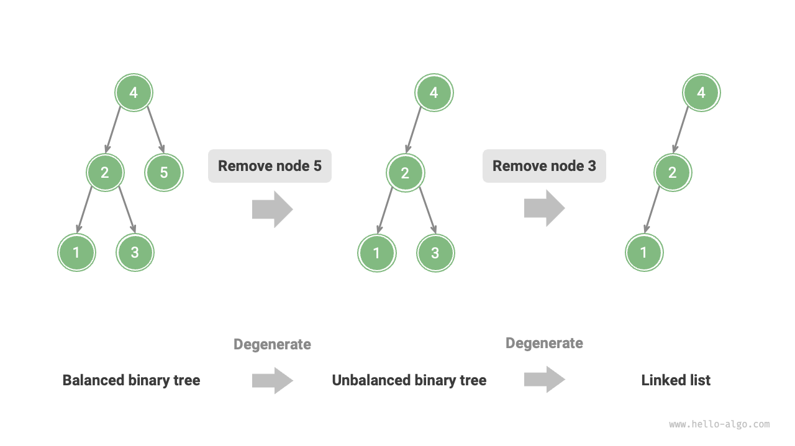

別の例として、以下の図に示す完全二分木に 2 つのノードを挿入すると、木は大きく左に傾き、探索操作の時間計算量もそれに伴って劣化します。

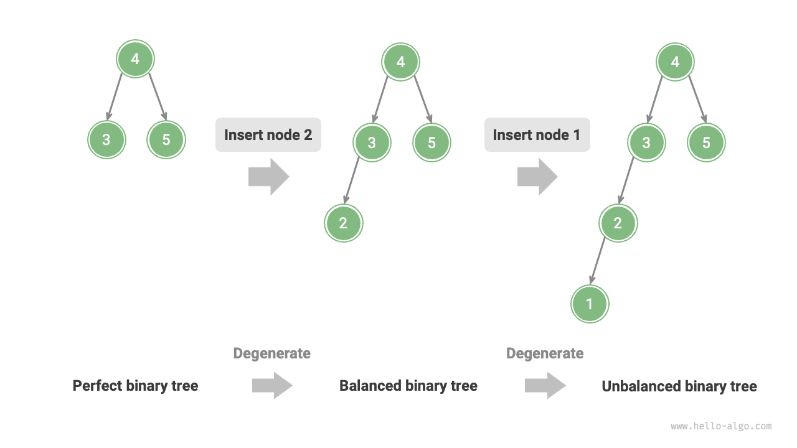

1962 年、G. M. Adelson-Velsky と E. M. Landis は論文“An algorithm for the organization of information”の中で <u>AVL 木</u> を提案しました。論文では一連の操作が詳しく説明されており、ノードの追加と削除を続けても AVL 木が退化しないようにして、各種操作の時間計算量を $O(\log n)$ の水準に保ちます。言い換えると、追加・削除・探索・更新を頻繁に行う場面でも、AVL 木は常に高いデータ操作性能を維持でき、実用価値の高い構造です。

## AVL 木の基本用語

AVL 木は二分探索木であると同時に平衡二分木でもあり、これら 2 種類の二分木の性質をすべて満たします。したがって、<u>平衡二分探索木（balanced binary search tree）</u>の一種です。

### ノードの高さ

AVL 木の操作ではノードの高さを取得する必要があるため、ノードクラスに `height` 変数を追加します：

=== "Python"

    ```python title=""
    class TreeNode:
        """AVL 木ノードクラス"""
        def __init__(self, val: int):
            self.val: int = val                 # ノード値
            self.height: int = 0                # ノードの高さ
            self.left: TreeNode | None = None   # 左の子ノード参照
            self.right: TreeNode | None = None  # 右の子ノード参照
    ```

=== "C++"

    ```cpp title=""
    /* AVL 木ノードクラス */
    struct TreeNode {
        int val{};          // ノード値
        int height = 0;     // ノードの高さ
        TreeNode *left{};   // 左の子ノード
        TreeNode *right{};  // 右の子ノード
        TreeNode() = default;
        explicit TreeNode(int x) : val(x){}
    };
    ```

=== "Java"

    ```java title=""
    /* AVL 木ノードクラス */
    class TreeNode {
        public int val;        // ノード値
        public int height;     // ノードの高さ
        public TreeNode left;  // 左の子ノード
        public TreeNode right; // 右の子ノード
        public TreeNode(int x) { val = x; }
    }
    ```

=== "C#"

    ```csharp title=""
    /* AVL 木ノードクラス */
    class TreeNode(int? x) {
        public int? val = x;    // ノード値
        public int height;      // ノードの高さ
        public TreeNode? left;  // 左の子ノード参照
        public TreeNode? right; // 右の子ノード参照
    }
    ```

=== "Go"

    ```go title=""
    /* AVL 木ノード構造体 */
    type TreeNode struct {
        Val    int       // ノード値
        Height int       // ノードの高さ
        Left   *TreeNode // 左の子ノード参照
        Right  *TreeNode // 右の子ノード参照
    }
    ```

=== "Swift"

    ```swift title=""
    /* AVL 木ノードクラス */
    class TreeNode {
        var val: Int // ノード値
        var height: Int // ノードの高さ
        var left: TreeNode? // 左の子ノード
        var right: TreeNode? // 右の子ノード

        init(x: Int) {
            val = x
            height = 0
        }
    }
    ```

=== "JS"

    ```javascript title=""
    /* AVL 木ノードクラス */
    class TreeNode {
        val; // ノード値
        height; //ノードの高さ
        left; // 左の子ノードポインタ
        right; // 右の子ノードポインタ
        constructor(val, left, right, height) {
            this.val = val === undefined ? 0 : val;
            this.height = height === undefined ? 0 : height;
            this.left = left === undefined ? null : left;
            this.right = right === undefined ? null : right;
        }
    }
    ```

=== "TS"

    ```typescript title=""
    /* AVL 木ノードクラス */
    class TreeNode {
        val: number;            // ノード値
        height: number;         // ノードの高さ
        left: TreeNode | null;  // 左の子ノードポインタ
        right: TreeNode | null; // 右の子ノードポインタ
        constructor(val?: number, height?: number, left?: TreeNode | null, right?: TreeNode | null) {
            this.val = val === undefined ? 0 : val;
            this.height = height === undefined ? 0 : height;
            this.left = left === undefined ? null : left;
            this.right = right === undefined ? null : right;
        }
    }
    ```

=== "Dart"

    ```dart title=""
    /* AVL 木ノードクラス */
    class TreeNode {
      int val;         // ノード値
      int height;      // ノードの高さ
      TreeNode? left;  // 左の子ノード
      TreeNode? right; // 右の子ノード
      TreeNode(this.val, [this.height = 0, this.left, this.right]);
    }
    ```

=== "Rust"

    ```rust title=""
    use std::rc::Rc;
    use std::cell::RefCell;

    /* AVL 木ノード構造体 */
    struct TreeNode {
        val: i32,                               // ノード値
        height: i32,                            // ノードの高さ
        left: Option<Rc<RefCell<TreeNode>>>,    // 左の子ノード
        right: Option<Rc<RefCell<TreeNode>>>,   // 右の子ノード
    }

    impl TreeNode {
        /* コンストラクタ */
        fn new(val: i32) -> Rc<RefCell<Self>> {
            Rc::new(RefCell::new(Self {
                val,
                height: 0,
                left: None,
                right: None
            }))
        }
    }
    ```

=== "C"

    ```c title=""
    /* AVL 木ノード構造体 */
    typedef struct TreeNode {
        int val;
        int height;
        struct TreeNode *left;
        struct TreeNode *right;
    } TreeNode;

    /* コンストラクタ */
    TreeNode *newTreeNode(int val) {
        TreeNode *node;

        node = (TreeNode *)malloc(sizeof(TreeNode));
        node->val = val;
        node->height = 0;
        node->left = NULL;
        node->right = NULL;
        return node;
    }
    ```

=== "Kotlin"

    ```kotlin title=""
    /* AVL 木ノードクラス */
    class TreeNode(val _val: Int) {  // ノード値
        val height: Int = 0          // ノードの高さ
        val left: TreeNode? = null   // 左の子ノード
        val right: TreeNode? = null  // 右の子ノード
    }
    ```

=== "Ruby"

    ```ruby title=""
    ### AVL 木ノードクラス ###
    class TreeNode
      attr_accessor :val    # ノード値
      attr_accessor :height # ノードの高さ
      attr_accessor :left   # 左の子ノード参照
      attr_accessor :right  # 右の子ノード参照

      def initialize(val)
        @val = val
        @height = 0
      end
    end
    ```

「ノードの高さ」とは、そのノードから最も遠い葉ノードまでの距離、すなわち通過する「辺」の本数を指します。特に、葉ノードの高さは $0$、空ノードの高さは $-1$ です。ここでは、ノードの高さを取得・更新するための 2 つの補助関数を用意します：

```src
[file]{avl_tree}-[class]{avl_tree}-[func]{update_height}
```

### ノードの平衡係数

ノードの<u>平衡係数（balance factor）</u>は、左部分木の高さから右部分木の高さを引いた値と定義し、空ノードの平衡係数は $0$ とします。同様に、ノードの平衡係数を取得する機能も関数にカプセル化して、後続で使いやすくします：

```src
[file]{avl_tree}-[class]{avl_tree}-[func]{balance_factor}
```

!!! tip

    平衡係数を $f$ とすると、AVL 木の任意のノードの平衡係数は常に $-1 \le f \le 1$ を満たします。

## AVL 木の回転

AVL 木の特徴は「回転」操作にあり、二分木の中順走査列を変えずに、不平衡ノードを再び平衡に戻せます。言い換えると、**回転操作は「二分探索木」の性質を保ちながら、木を再び「平衡二分木」に戻すことができます**。

平衡係数の絶対値が $> 1$ のノードを「不平衡ノード」と呼びます。ノードの不平衡の形に応じて、回転操作は 4 種類に分かれます。右回転、左回転、右回転してから左回転、左回転してから右回転です。以下でこれらを順に説明します。

### 右回転

以下の図では、ノードの下に平衡係数を示しています。下から上へ見ると、二分木で最初に不平衡になるのは「ノード 3」です。この不平衡ノードを根とする部分木に注目し、そのノードを `node`、左の子ノードを `child` として、「右回転」を行います。右回転後、部分木は平衡を回復し、なおかつ二分探索木の性質も保たれます。

=== "<1>"
    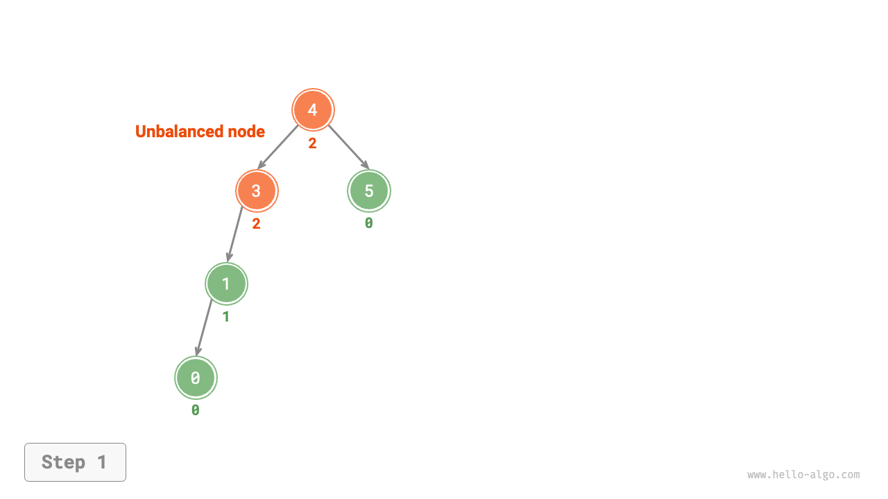

=== "<2>"
    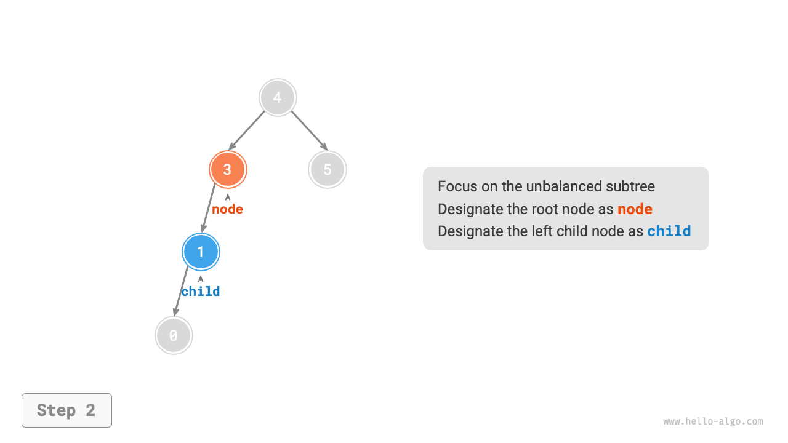

=== "<3>"
    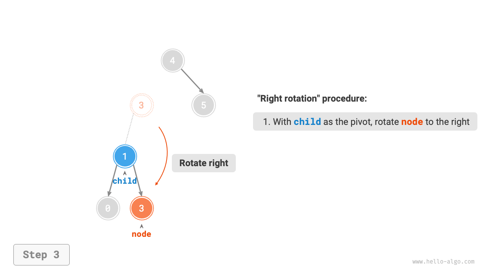

=== "<4>"
    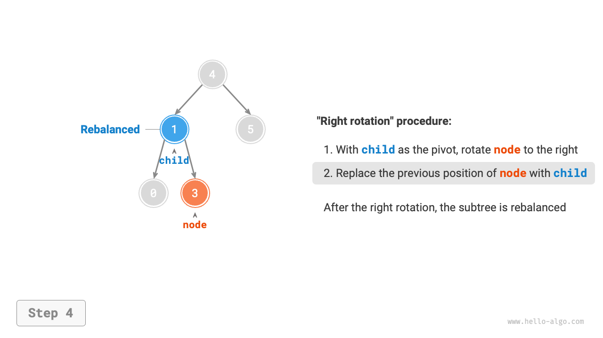

以下の図に示すように、ノード `child` に右の子ノード（`grand_child` と記す）がある場合、右回転には 1 ステップ追加する必要があります。すなわち、`grand_child` を `node` の左の子ノードにします。

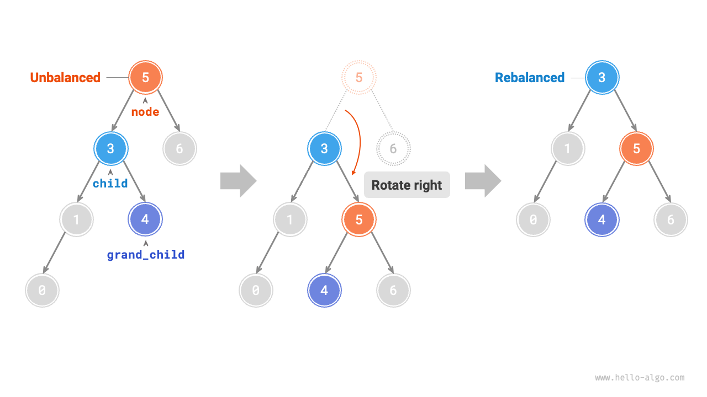

「右に回転する」というのはあくまでイメージしやすい表現であり、実際にはノードポインタを変更して実現します。コードは次のとおりです：

```src
[file]{avl_tree}-[class]{avl_tree}-[func]{right_rotate}
```

### 左回転

対応する鏡像として、上記の不平衡二分木を左右反転して考えると、以下の図に示す「左回転」が必要になります。

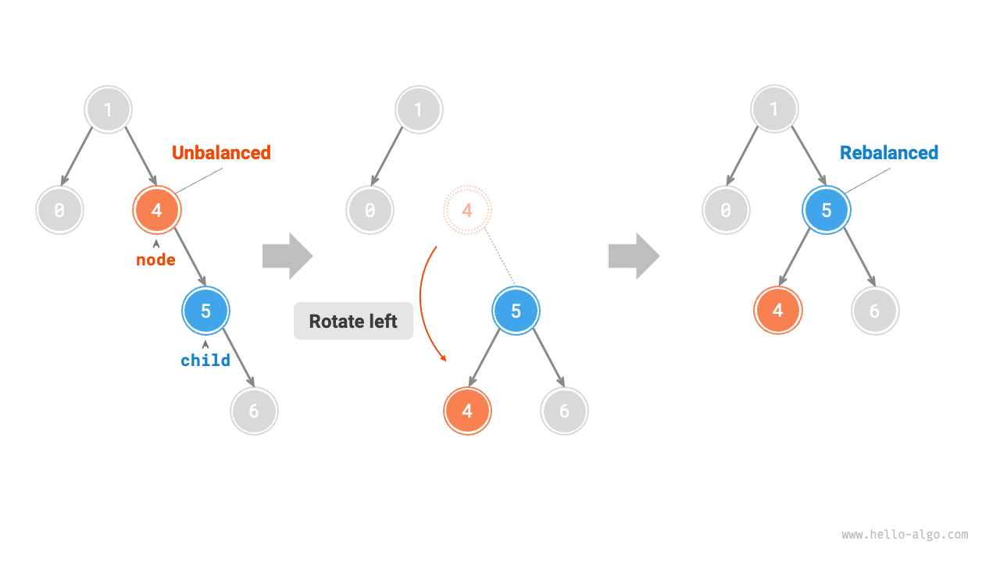

同様に、以下の図に示すように、ノード `child` に左の子ノード（`grand_child` と記す）がある場合、左回転にも 1 ステップ追加する必要があります。すなわち、`grand_child` を `node` の右の子ノードにします。

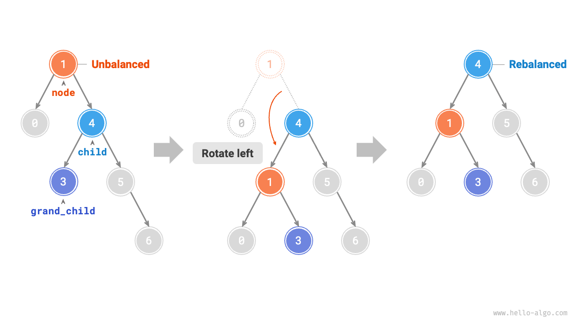

分かるように、**右回転と左回転は論理的に鏡像対称であり、それぞれが解決する 2 種類の不平衡も対称です**。この対称性に基づけば、右回転の実装コードにあるすべての `left` を `right` に、すべての `right` を `left` に置き換えるだけで、左回転の実装コードが得られます：

```src
[file]{avl_tree}-[class]{avl_tree}-[func]{left_rotate}
```

### 左回転してから右回転

以下の図の不平衡ノード 3 では、左回転だけでも右回転だけでも部分木を平衡に戻せません。この場合は、まず `child` に「左回転」を行い、次に `node` に「右回転」を行います。

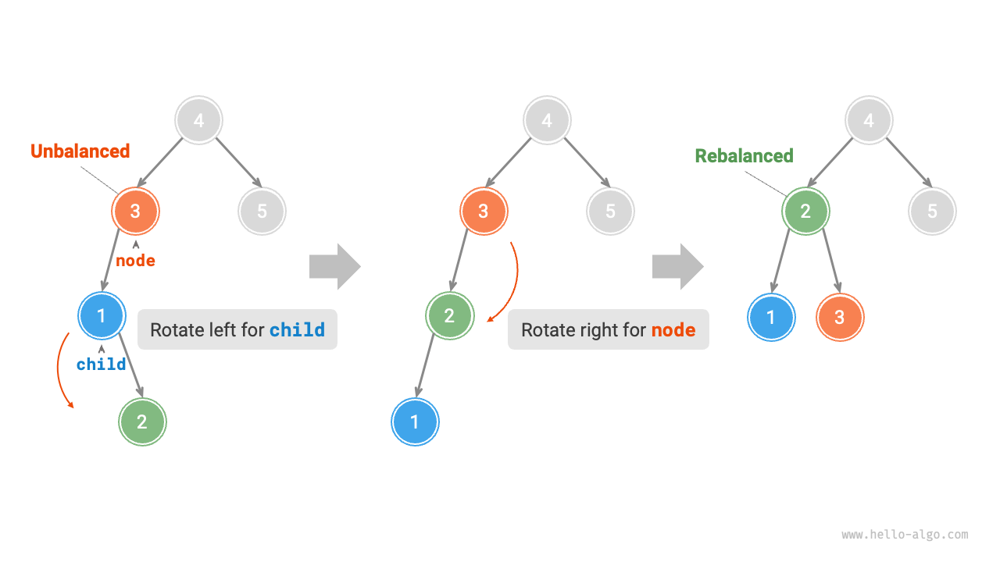

### 右回転してから左回転

以下の図に示すように、上記の不平衡二分木の鏡像のケースでは、まず `child` に「右回転」を行い、次に `node` に「左回転」を行います。

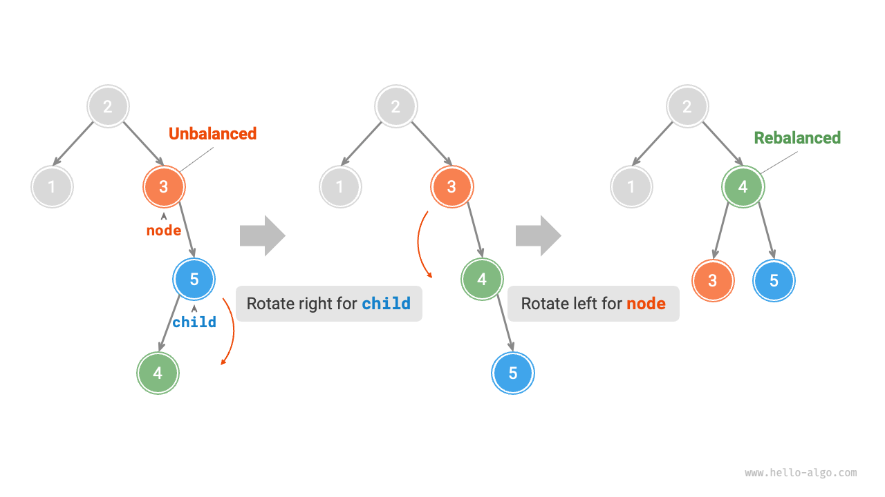

### 回転の選択

以下の図に示す 4 種類の不平衡は、上の各ケースにそれぞれ対応しており、必要な操作は順に右回転、左回転してから右回転、右回転してから左回転、左回転です。

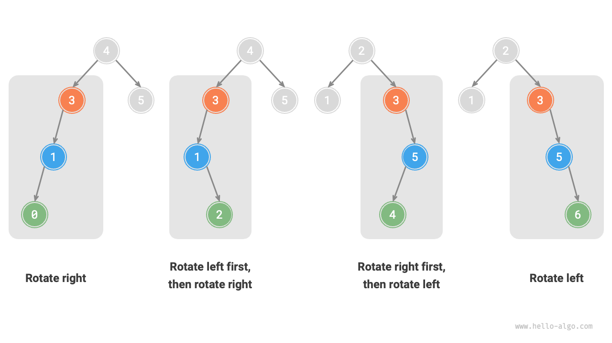

以下の表に示すように、不平衡ノードの平衡係数と、高い側の子ノードの平衡係数の符号を判定することで、その不平衡ノードが上図のどのケースに属するかを判断できます。

<p align="center"> 表 <id> &nbsp; 4 種類の回転ケースの選択条件 </p>

| 不平衡ノードの平衡係数 | 子ノードの平衡係数 | 採用すべき回転方法 |
| ------------------ | ---------------- | ---------------- |
| $> 1$ （左に偏った木）   | $\geq 0$         | 右回転             |
| $> 1$ （左に偏った木）   | $<0$             | 左回転してから右回転     |
| $< -1$ （右に偏った木）  | $\leq 0$         | 左回転             |
| $< -1$ （右に偏った木）  | $>0$             | 右回転してから左回転     |

使いやすくするために、回転操作を 1 つの関数にカプセル化します。**この関数があれば、さまざまな不平衡ケースに対して回転を行い、不平衡ノードを再び平衡に戻せます**。コードは次のとおりです：

```src
[file]{avl_tree}-[class]{avl_tree}-[func]{rotate}
```

## AVL 木の基本操作

### ノードの挿入

AVL 木のノード挿入は、基本的には二分探索木と同じです。唯一の違いは、AVL 木ではノード挿入後に、そのノードから根ノードまでの経路上に複数の不平衡ノードが現れる可能性があることです。したがって、**このノードから開始して、下から上へ回転操作を行い、すべての不平衡ノードを平衡に戻す必要があります**。コードは次のとおりです：

```src
[file]{avl_tree}-[class]{avl_tree}-[func]{insert_helper}
```

### ノードの削除

同様に、二分探索木のノード削除メソッドを土台として、下から上へ回転操作を行い、すべての不平衡ノードを平衡に戻す必要があります。コードは次のとおりです：

```src
[file]{avl_tree}-[class]{avl_tree}-[func]{remove_helper}
```

### ノードの探索

AVL 木のノード探索操作は二分探索木と同じなので、ここでは繰り返しません。

## AVL 木の代表的な応用

- 大規模データの整理・格納に用いられ、高頻度の探索と低頻度の追加・削除に適しています。
- データベースのインデックスシステムの構築に使われます。
- 赤黒木も代表的な平衡二分探索木の一つです。AVL 木と比べると、赤黒木は平衡条件がより緩く、ノードの挿入・削除に必要な回転操作が少ないため、平均的な更新効率はより高くなります。
