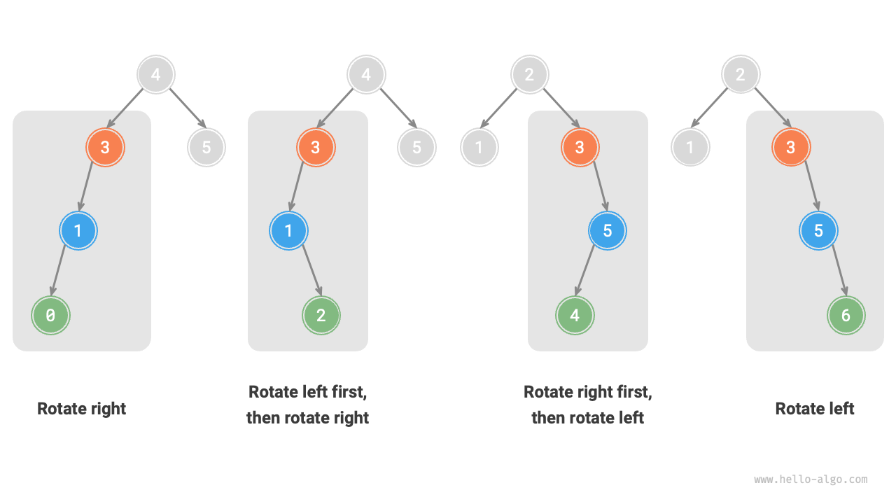

# AVL木 *

「二分探索木」の節では、複数の挿入と削除の後、二分探索木が連結リストに退化する可能性があることを述べました。このような場合、すべての操作の時間計算量が$O(\log n)$から$O(n)$に悪化します。

下図に示すように、2つのノード削除操作の後、この二分探索木は連結リストに退化します。


例えば、下図に示す完全二分木では、2つのノードを挿入した後、木が左に大きく傾き、検索操作の時間計算量も悪化します。


1962年、G. M. Adelson-VelskyとE. M. Landisが論文「An algorithm for the organization of information」で<u>AVL木</u>を提案しました。この論文では、ノードの継続的な追加と削除の後もAVL木が退化しないことを保証する一連の操作について詳述し、さまざまな操作の時間計算量を$O(\log n)$レベルに維持しました。つまり、頻繁な追加、削除、検索、変更が必要なシナリオで、AVL木は常に効率的なデータ操作性能を維持でき、大きな応用価値があります。

## AVL木の一般的な用語

AVL木は二分探索木でありかつ平衡二分木でもあり、これら2つの種類の二分木のすべての性質を満たしているため、<u>平衡二分探索木</u>です。

### ノードの高さ

AVL木に関連する操作ではノードの高さを取得する必要があるため、ノードクラスに`height`変数を追加する必要があります：

=== "Python"

    ```python title=""
    class TreeNode:
        """AVL木ノード"""
        def __init__(self, val: int):
            self.val: int = val                 # ノード値
            self.height: int = 0                # ノードの高さ
            self.left: TreeNode | None = None   # 左の子への参照
            self.right: TreeNode | None = None  # 右の子への参照
    ```

=== "C++"

    ```cpp title=""
    /* AVL木ノード */
    struct TreeNode {
        int val{};          // ノード値
        int height = 0;     // ノードの高さ
        TreeNode *left{};   // 左の子
        TreeNode *right{};  // 右の子
        TreeNode() = default;
        explicit TreeNode(int x) : val(x){}
    };
    ```

=== "Java"

    ```java title=""
    /* AVL木ノード */
    class TreeNode {
        public int val;        // ノード値
        public int height;     // ノードの高さ
        public TreeNode left;  // 左の子
        public TreeNode right; // 右の子
        public TreeNode(int x) { val = x; }
    }
    ```

=== "C#"

    ```csharp title=""
    /* AVL木ノード */
    class TreeNode(int? x) {
        public int? val = x;    // ノード値
        public int height;      // ノードの高さ
        public TreeNode? left;  // 左の子への参照
        public TreeNode? right; // 右の子への参照
    }
    ```

=== "Go"

    ```go title=""
    /* AVL木ノード */
    type TreeNode struct {
        Val    int       // ノード値
        Height int       // ノードの高さ
        Left   *TreeNode // 左の子への参照
        Right  *TreeNode // 右の子への参照
    }
    ```

=== "Swift"

    ```swift title=""
    /* AVL木ノード */
    class TreeNode {
        var val: Int // ノード値
        var height: Int // ノードの高さ
        var left: TreeNode? // 左の子
        var right: TreeNode? // 右の子

        init(x: Int) {
            val = x
            height = 0
        }
    }
    ```

=== "JS"

    ```javascript title=""
    /* AVL木ノード */
    class TreeNode {
        val; // ノード値
        height; // ノードの高さ
        left; // 左の子ポインタ
        right; // 右の子ポインタ
        constructor(val, left, right, height) {
            this.val = val === undefined ? 0 : val;
            this.height = height === undefined ? 0 : height;
            this.left = left === undefined ? null : left;
            this.right = right === undefined ? null : right;
        }
    }
    ```

=== "TS"

    ```typescript title=""
    /* AVL木ノード */
    class TreeNode {
        val: number;            // ノード値
        height: number;         // ノードの高さ
        left: TreeNode | null;  // 左の子ポインタ
        right: TreeNode | null; // 右の子ポインタ
        constructor(val?: number, height?: number, left?: TreeNode | null, right?: TreeNode | null) {
            this.val = val === undefined ? 0 : val;
            this.height = height === undefined ? 0 : height;
            this.left = left === undefined ? null : left;
            this.right = right === undefined ? null : right;
        }
    }
    ```

=== "Dart"

    ```dart title=""
    /* AVL木ノード */
    class TreeNode {
      int val;         // ノード値
      int height;      // ノードの高さ
      TreeNode? left;  // 左の子
      TreeNode? right; // 右の子
      TreeNode(this.val, [this.height = 0, this.left, this.right]);
    }
    ```

=== "Rust"

    ```rust title=""
    use std::rc::Rc;
    use std::cell::RefCell;

    /* AVL木ノード */
    struct TreeNode {
        val: i32,                               // ノード値
        height: i32,                            // ノードの高さ
        left: Option<Rc<RefCell<TreeNode>>>,    // 左の子
        right: Option<Rc<RefCell<TreeNode>>>,   // 右の子
    }

    impl TreeNode {
        /* コンストラクタ */
        fn new(val: i32) -> Rc<RefCell<Self>> {
            Rc::new(RefCell::new(Self {
                val,
                height: 0,
                left: None,
                right: None
            }))
        }
    }
    ```

=== "C"

    ```c title=""
    /* AVL木ノード */
    TreeNode struct TreeNode {
        int val;
        int height;
        struct TreeNode *left;
        struct TreeNode *right;
    } TreeNode;

    /* コンストラクタ */
    TreeNode *newTreeNode(int val) {
        TreeNode *node;

        node = (TreeNode *)malloc(sizeof(TreeNode));
        node->val = val;
        node->height = 0;
        node->left = NULL;
        node->right = NULL;
        return node;
    }
    ```

=== "Kotlin"

    ```kotlin title=""
    /* AVL木ノード */
    class TreeNode(val _val: Int) {  // ノード値
        val height: Int = 0          // ノードの高さ
        val left: TreeNode? = null   // 左の子
        val right: TreeNode? = null  // 右の子
    }
    ```

=== "Ruby"

    ```ruby title=""

    ```

=== "Zig"

    ```zig title=""

    ```

「ノードの高さ」とは、そのノードから最も遠い葉ノードまでの距離、つまり通過する「辺」の数を指します。重要なのは、葉ノードの高さは$0$で、nullノードの高さは$-1$であることです。ノードの高さを取得し、更新するための2つのユーティリティ関数を作成します：

```src
[file]{avl_tree}-[class]{avl_tree}-[func]{update_height}
```

### ノードの平衡因子

ノードの<u>平衡因子</u>は、そのノードの左部分木の高さから右部分木の高さを引いた値として定義され、nullノードの平衡因子は$0$として定義されます。後で使いやすくするため、ノードの平衡因子を取得する機能も関数にカプセル化します：

```src
[file]{avl_tree}-[class]{avl_tree}-[func]{balance_factor}
```

!!! tip

    平衡因子を$f$とすると、AVL木の任意のノードの平衡因子は$-1 \le f \le 1$を満たします。

## AVL木の回転

AVL木の特徴的な機能は「回転」操作で、これは二分木の中順探索シーケンスに影響を与えることなく、不平衡なノードのバランスを回復できます。つまり、**回転操作は「二分探索木」の性質を維持しながら、木を「平衡二分木」に戻すことができます**。

絶対平衡因子が$> 1$のノードを「不平衡ノード」と呼びます。不平衡のタイプに応じて、4種類の回転があります：右回転、左回転、右左回転、左右回転です。以下、これらの回転操作について詳しく説明します。

### 右回転

下図に示すように、二分木で下から上への最初の不平衡ノードは「ノード3」です。この不平衡ノードを根とする部分木に焦点を当て、これを`node`とし、その左の子を`child`として、「右回転」を実行します。右回転後、部分木は再びバランスが取れ、同時に二分探索木の性質も維持されます。

=== "<1>"
    

=== "<2>"
    

=== "<3>"
    

=== "<4>"
    

下図に示すように、`child`ノードに右の子（`grand_child`と表記）がある場合、右回転で手順を追加する必要があります：`grand_child`を`node`の左の子に設定します。


「右回転」は比喩的な用語で、実際にはノードポインタを変更することで実現されます。以下のコードで示されます：

```src
[file]{avl_tree}-[class]{avl_tree}-[func]{right_rotate}
```

### 左回転

対応して、上記の不平衡二分木の「鏡像」を考慮すると、下図に示す「左回転」操作を実行する必要があります。


同様に、下図に示すように、`child`ノードに左の子（`grand_child`と表記）がある場合、左回転で手順を追加する必要があります：`grand_child`を`node`の右の子に設定します。


**右回転と左回転の操作は論理的に対称であり、2つの対称的な不平衡タイプを解決します**ことが観察できます。対称性に基づいて、右回転の実装コードですべての`left`を`right`に、すべての`right`を`left`に置き換えることで、左回転の実装コードを得ることができます：

```src
[file]{avl_tree}-[class]{avl_tree}-[func]{left_rotate}
```

### 左右回転

下図に示す不平衡ノード3の場合、左回転または右回転のいずれかだけでは部分木のバランスを回復できません。この場合、まず`child`に対して「左回転」を実行し、次に`node`に対して「右回転」を実行する必要があります。


### 右左回転

下図に示すように、上記の不平衡二分木の鏡像ケースでは、まず`child`に対して「右回転」を実行し、次に`node`に対して「左回転」を実行する必要があります。


### 回転の選択

下図に示す4種類の不平衡は、それぞれ上記で説明したケースに対応し、右回転、左右回転、右左回転、左回転が必要です。



下表に示すように、不平衡ノードの平衡因子とその高い側の子の平衡因子の符号を判断することで、不平衡ノードが上記のどのケースに属するかを決定します。

<p align="center"> 表 <id> &nbsp; 4つの回転ケースの選択条件 </p>

| 不平衡ノードの平衡因子 | 子ノードの平衡因子 | 使用する回転方法             |
| --------------------- | ----------------- | --------------------------- |
| $> 1$（左に傾いた木）  | $\geq 0$          | 右回転                      |
| $> 1$（左に傾いた木）  | $<0$              | 左回転してから右回転        |
| $< -1$（右に傾いた木） | $\leq 0$          | 左回転                      |
| $< -1$（右に傾いた木） | $>0$              | 右回転してから左回転        |

便宜上、回転操作を関数にカプセル化します。**この関数により、さまざまな種類の不平衡に対して回転を実行し、不平衡ノードのバランスを回復できます**。コードは以下の通りです：

```src
[file]{avl_tree}-[class]{avl_tree}-[func]{rotate}
```

## AVL木の一般的な操作

### ノードの挿入

AVL木のノード挿入操作は二分探索木のそれと似ています。唯一の違いは、AVL木でノードを挿入した後、そのノードから根ノードまでのパス上に一連の不平衡ノードが現れる可能性があることです。したがって、**このノードから始めて上向きに回転操作を実行し、すべての不平衡ノードのバランスを回復する必要があります**。コードは以下の通りです：

```src
[file]{avl_tree}-[class]{avl_tree}-[func]{insert_helper}
```

### ノードの削除

同様に、二分探索木でのノード削除方法に基づいて、下から上へ回転操作を実行してすべての不平衡ノードのバランスを回復する必要があります。コードは以下の通りです：

```src
[file]{avl_tree}-[class]{avl_tree}-[func]{remove_helper}
```

### ノードの検索

AVL木でのノード検索操作は二分探索木のそれと一致しており、ここでは詳述しません。

## AVL木の典型的な応用

- 大量のデータの整理と格納に使用され、検索頻度が高く、挿入と削除の頻度が低いシナリオに適しています。
- データベースのインデックスシステムの構築に使用されます。
- 赤黒木も一般的な平衡二分探索木の一種です。AVL木と比較して、赤黒木はより緩い平衡条件を持ち、ノードの挿入と削除にかかる回転数が少なく、ノードの追加と削除操作の平均効率が高くなります。
