# 二分探索木

以下の図に示すように、<u>二分探索木（binary search tree）</u>は次の条件を満たします。

1. 根ノードについて、左部分木のすべてのノードの値 $<$ 根ノードの値 $<$ 右部分木のすべてのノードの値。
2. 任意のノードの左部分木と右部分木も二分探索木であり、すなわち条件 `1.` も満たします。

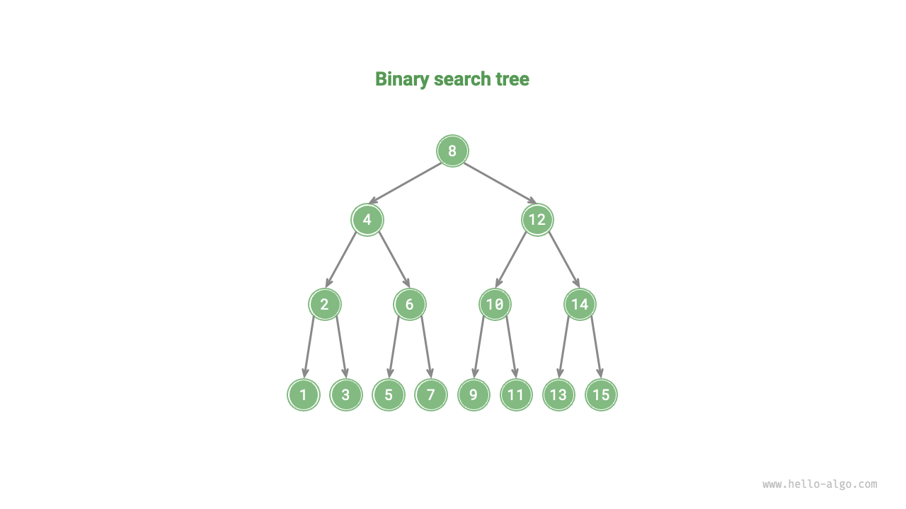

## 二分探索木の操作

二分探索木をクラス `BinarySearchTree` としてカプセル化し、木の根ノードを指すメンバ変数 `root` を宣言します。

### ノードの探索

目標ノードの値 `num` が与えられたら、二分探索木の性質に基づいて探索できます。以下の図に示すように、ノード `cur` を宣言し、二分木の根ノード `root` から出発して、ノード値 `cur.val` と `num` の大小関係を繰り返し比較します。

- `cur.val < num` の場合、目標ノードは `cur` の右部分木にあるため、`cur = cur.right` を実行します。
- `cur.val > num` の場合、目標ノードは `cur` の左部分木にあるため、`cur = cur.left` を実行します。
- `cur.val = num` の場合、目標ノードが見つかったことを表し、ループを抜けてそのノードを返します。

=== "<1>"
    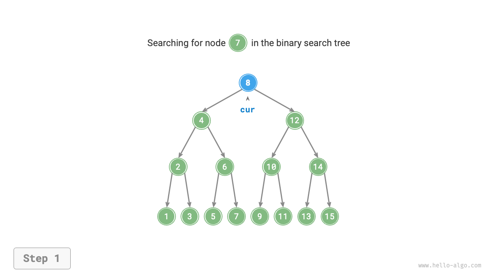

=== "<2>"
    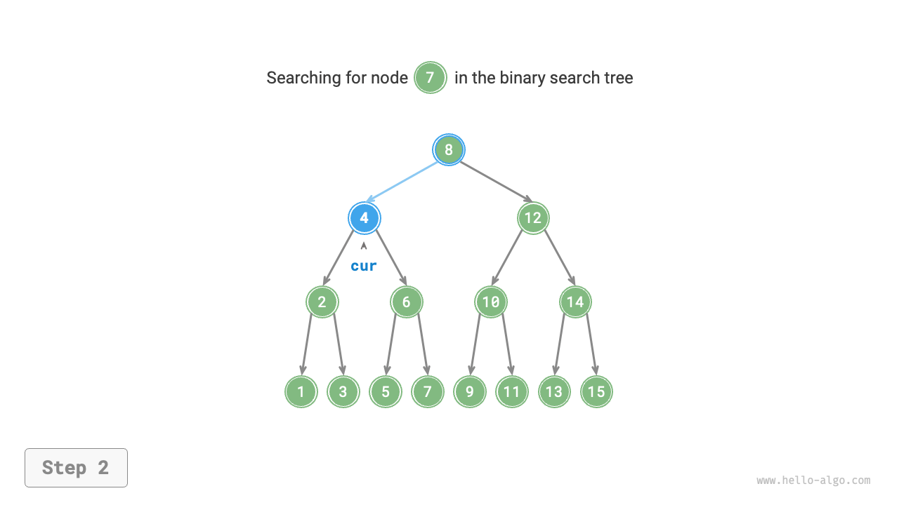

=== "<3>"
    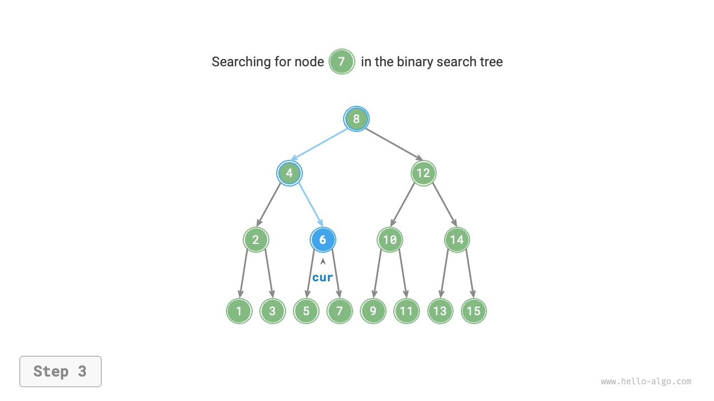

=== "<4>"
    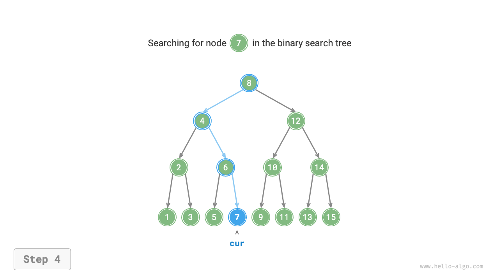

二分探索木の探索操作は二分探索アルゴリズムと同じ原理で動作し、各ラウンドで半分の候補を除外します。ループ回数の上限は二分木の高さであり、二分木が平衡であれば $O(\log n)$ 時間です。コード例は次のとおりです。

```src
[file]{binary_search_tree}-[class]{binary_search_tree}-[func]{search}
```

### ノードの挿入

挿入する要素 `num` が与えられたとき、二分探索木の「左部分木 < 根ノード < 右部分木」という性質を保つため、挿入操作の流れは以下の図のようになります。

1. **挿入位置を探索する**：探索操作と同様に、根ノードから出発し、現在のノード値と `num` の大小関係に基づいて下方向へ探索を繰り返し、葉ノードを越えて（`None` まで到達して）ループを抜けます。
2. **その位置にノードを挿入する**：ノード `num` を初期化し、そのノードを `None` の位置に置きます。

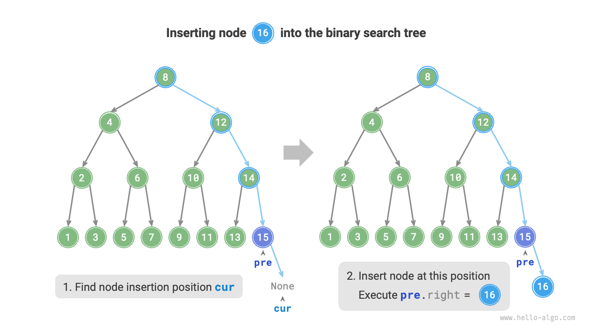

コード実装では、次の 2 点に注意が必要です。

- 二分探索木では重複ノードを許可しません。そうでないと定義に反するためです。したがって、挿入対象のノードが木内にすでに存在する場合は、挿入を行わずそのまま返します。
- ノード挿入を実現するために、ノード `pre` を用いて前回のループのノードを保持する必要があります。これにより、`None` までたどり着いたときにその親ノードを取得でき、ノード挿入を完了できます。

```src
[file]{binary_search_tree}-[class]{binary_search_tree}-[func]{insert}
```

ノード探索と同様に、ノード挿入には $O(\log n)$ 時間を要します。

### ノードの削除

まず二分木内で目標ノードを見つけ、その後で削除します。ノード挿入と同様に、削除操作の完了後も二分探索木の「左部分木 < 根ノード < 右部分木」という性質が保たれる必要があります。そのため、目標ノードの子ノード数に応じて、0、1、2 の 3 つのケースに分けて対応する削除操作を行います。

以下の図に示すように、削除対象ノードの次数が $0$ のとき、そのノードは葉ノードであり、直接削除できます。

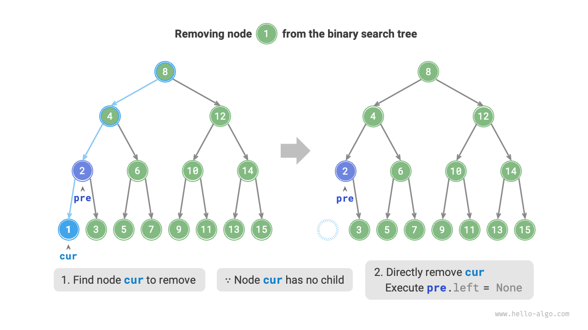

以下の図に示すように、削除対象ノードの次数が $1$ のとき、削除対象ノードをその子ノードで置き換えれば十分です。

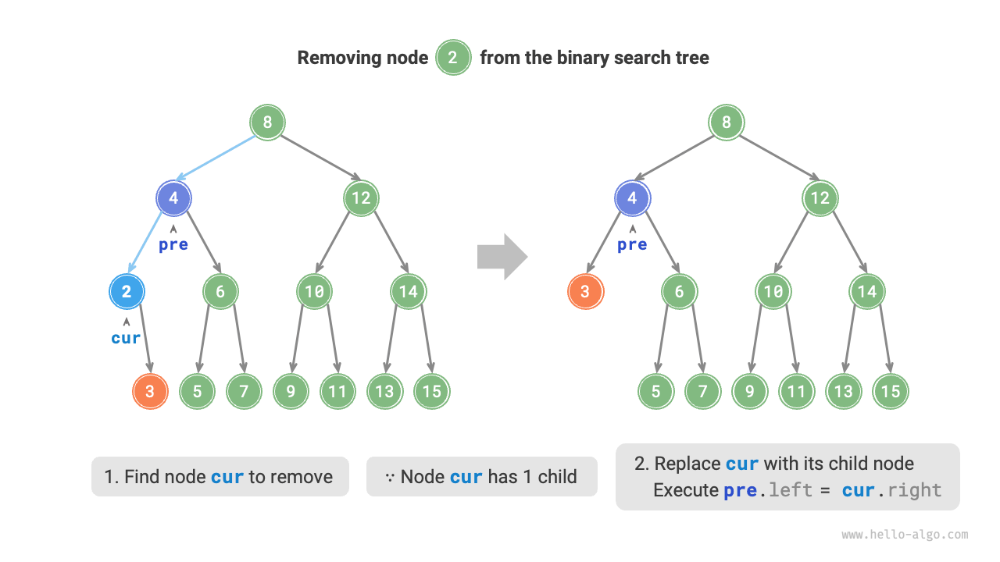

削除対象ノードの次数が $2$ のときは、直接削除できず、別のノードでそのノードを置き換える必要があります。二分探索木の「左部分木 $<$ 根ノード $<$ 右部分木」という性質を保つ必要があるため、**このノードには右部分木の最小ノードまたは左部分木の最大ノードを使えます**。

右部分木の最小ノード（中順走査で次のノード）を選ぶと仮定すると、削除操作の流れは以下の図のようになります。

1. 削除対象ノードの「中順走査列」における次のノードを見つけ、`tmp` と記します。
2. `tmp` の値で削除対象ノードの値を上書きし、木の中でノード `tmp` を再帰的に削除します。

=== "<1>"
    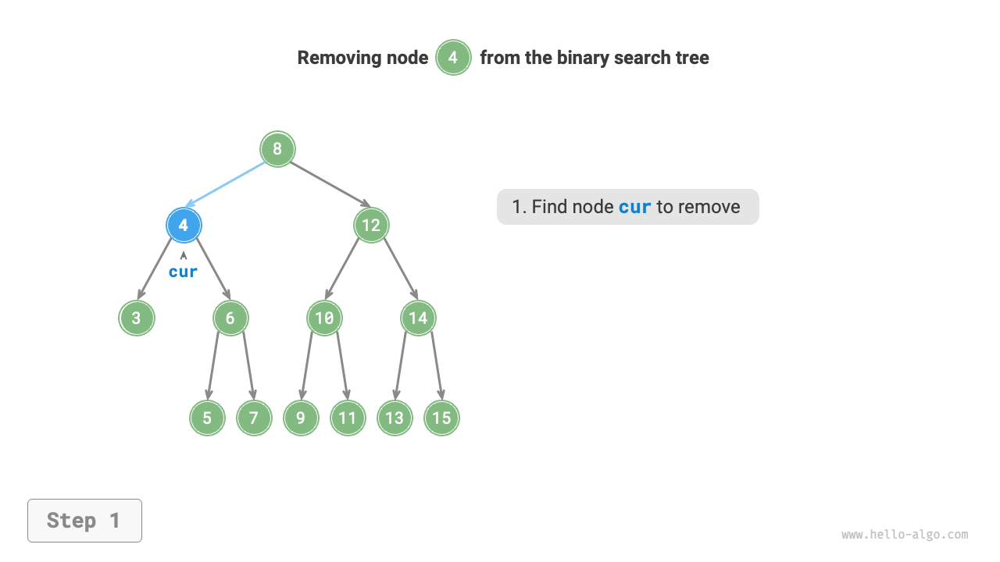

=== "<2>"
    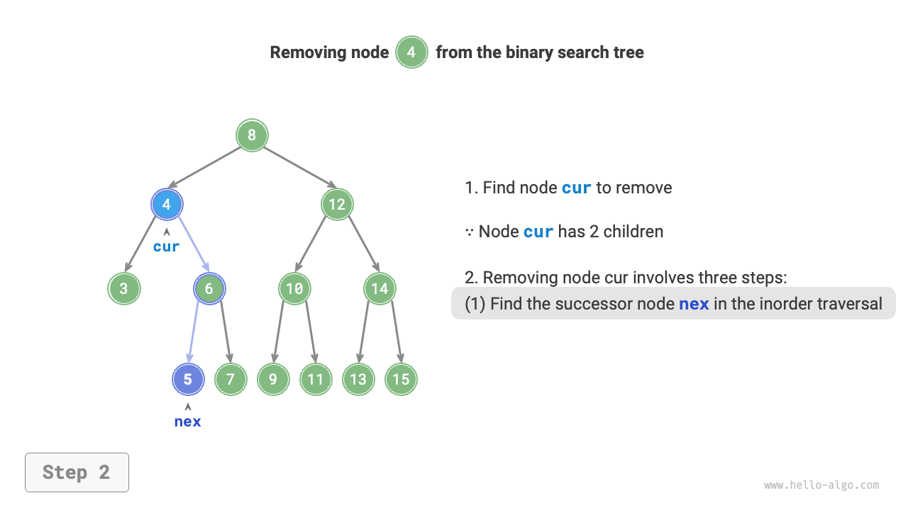

=== "<3>"
    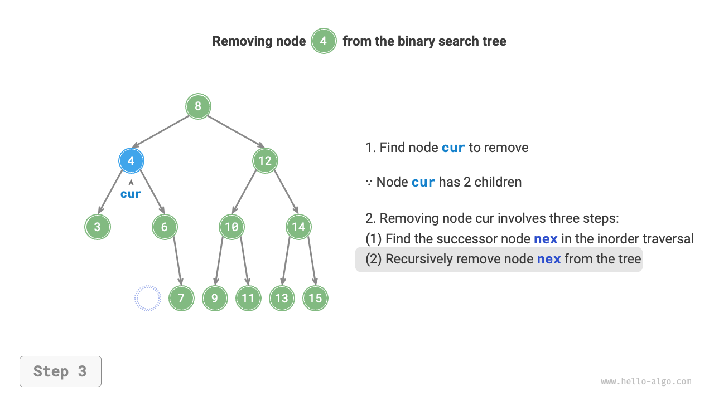

=== "<4>"
    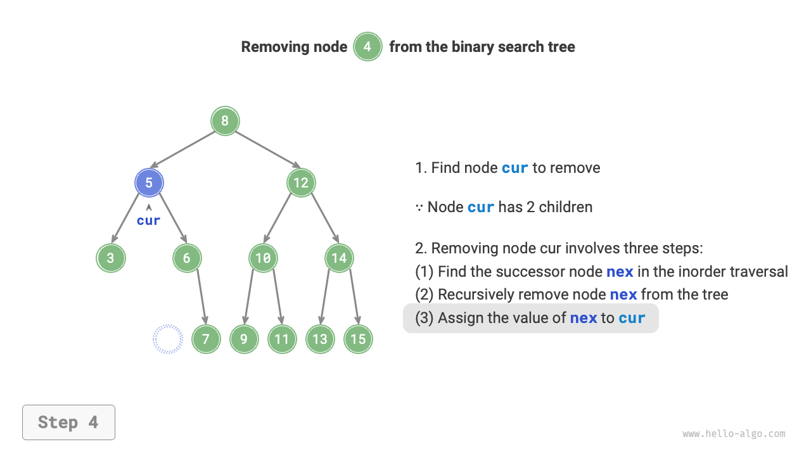

ノード削除操作も同様に $O(\log n)$ 時間を要します。削除対象ノードの探索に $O(\log n)$ 時間、中順走査の後続ノードの取得に $O(\log n)$ 時間が必要です。コード例は次のとおりです。

```src
[file]{binary_search_tree}-[class]{binary_search_tree}-[func]{remove}
```

### 中順走査は昇順

以下の図に示すように、二分木の中順走査は「左 $\rightarrow$ 根 $\rightarrow$ 右」という順序に従い、二分探索木は「左子ノード $<$ 根ノード $<$ 右子ノード」という大小関係を満たします。

これは、二分探索木で中順走査を行うと常に次の最小ノードが優先して走査されることを意味し、そこから重要な性質が導かれます。**二分探索木の中順走査列は昇順です**。

中順走査が昇順になる性質を利用すれば、二分探索木から整列済みデータを取得するのに必要な時間は $O(n)$ のみで、追加のソート操作は不要です。非常に効率的です。

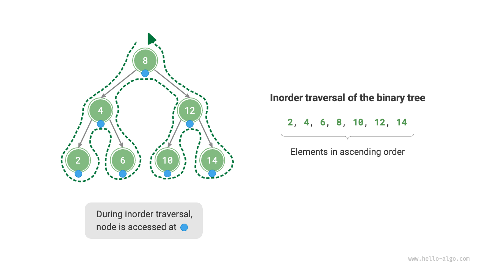

## 二分探索木の効率

あるデータ集合が与えられたとき、配列または二分探索木で格納する場合を考えます。次の表を見ると、二分探索木の各操作の時間計算量はいずれも対数オーダーであり、安定して高効率です。高頻度の追加と低頻度の探索・削除という場面でのみ、配列のほうが二分探索木より効率的です。

<p align="center"> 表 <id> &nbsp; 配列と探索木の効率比較 </p>

|          | 無秩序配列 | 二分探索木  |
| -------- | -------- | ----------- |
| 要素の探索 | $O(n)$   | $O(\log n)$ |
| 要素の挿入 | $O(1)$   | $O(\log n)$ |
| 要素の削除 | $O(n)$   | $O(\log n)$ |

理想的な状況では、二分探索木は「平衡」しており、その場合は $\log n$ 回のループ内で任意のノードを探索できます。

しかし、二分探索木でノードの挿入と削除を繰り返すと、二分木が以下の図のような連結リストへ退化する可能性があり、このとき各操作の時間計算量も $O(n)$ に退化します。

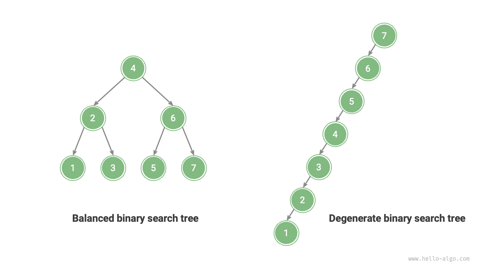

## 二分探索木の代表的な応用

- システム内の多段インデックスとして用いられ、効率的な探索、挿入、削除操作を実現します。
- 一部の探索アルゴリズムの基盤データ構造として使われます。
- データストリームを格納し、その順序状態を保つために使われます。
