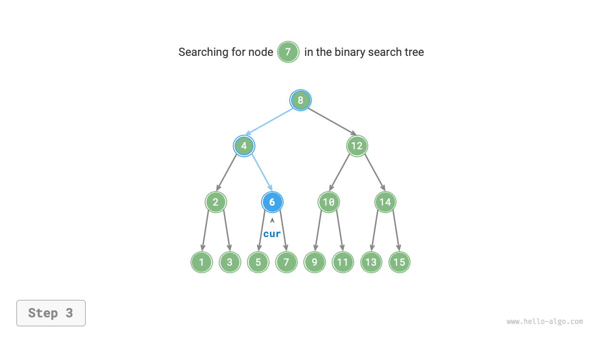

# 二分探索木

下図に示すように、<u>二分探索木</u>は以下の条件を満たします。

1. 根ノードについて、左部分木のすべてのノードの値 $<$ 根ノードの値 $<$ 右部分木のすべてのノードの値。
2. 任意のノードの左と右の部分木も二分探索木です。つまり、条件`1.`も満たします。


## 二分探索木の操作

二分探索木をクラス`BinarySearchTree`としてカプセル化し、木の根ノードを指すメンバー変数`root`を宣言します。

### ノードの検索

ターゲットノード値`num`が与えられた場合、二分探索木の性質に従って検索できます。下図に示すように、ノード`cur`を宣言し、二分木の根ノード`root`から開始し、ノード値`cur.val`と`num`のサイズを比較するループを行います。

- `cur.val < num`の場合、ターゲットノードは`cur`の右部分木にあることを意味するため、`cur = cur.right`を実行します。
- `cur.val > num`の場合、ターゲットノードは`cur`の左部分木にあることを意味するため、`cur = cur.left`を実行します。
- `cur.val = num`の場合、ターゲットノードが見つかったことを意味するため、ループを終了してノードを返します。

=== "<1>"
    

=== "<2>"
    

=== "<3>"
    

=== "<4>"
    

二分探索木での検索操作は二分探索アルゴリズムと同じ原理で動作し、各ラウンドでケースの半分を排除します。ループ数は最大で二分木の高さです。二分木が平衡している場合、$O(\log n)$の時間を使用します。コード例は以下の通りです：

```src
[file]{binary_search_tree}-[class]{binary_search_tree}-[func]{search}
```

### ノードの挿入

挿入する要素`num`が与えられた場合、二分探索木の性質「左部分木 < 根ノード < 右部分木」を維持するため、挿入操作は下図に示すように進行します。

1. **挿入位置を見つける**: 検索操作と同様に、根ノードから開始し、現在のノード値と`num`のサイズ関係に従って下向きにループし、葉ノードを通過（`None`に走査）するまで、ループを終了します。
2. **この位置にノードを挿入**: ノード`num`を初期化し、`None`があった場所に配置します。


コード実装では、以下の2点に注意してください。

- 二分探索木は重複ノードの存在を許可しません。そうでなければ、その定義に違反します。したがって、挿入するノードが既に木に存在する場合、挿入は実行されず、ノードは直接戻ります。
- 挿入操作を実行するには、前のループからのノードを保存するためにノード`pre`を使用する必要があります。このようにして、`None`に走査したときに、その親ノードを取得でき、ノード挿入操作を完了できます。

```src
[file]{binary_search_tree}-[class]{binary_search_tree}-[func]{insert}
```

ノードの検索と同様に、ノードの挿入には$O(\log n)$の時間を使用します。

### ノードの削除

まず、二分木でターゲットノードを見つけ、それを削除します。ノードの挿入と同様に、削除操作が完了した後も、二分探索木の性質「左部分木 < 根ノード < 右部分木」が満たされることを保証する必要があります。したがって、ターゲットノードの子ノード数に基づいて、0、1、2の3つのケースに分け、対応するノード削除操作を実行します。

下図に示すように、削除するノードの次数が$0$の場合、そのノードは葉ノードであることを意味し、直接削除できます。


下図に示すように、削除するノードの次数が$1$の場合、削除するノードをその子ノードで置き換えるだけで十分です。


削除するノードの次数が$2$の場合、直接削除することはできませんが、ノードを使用して置き換える必要があります。二分探索木の性質「左部分木 $<$ 根ノード $<$ 右部分木」を維持するため、**このノードは右部分木の最小ノードまたは左部分木の最大ノードのいずれかです**。

右部分木の最小ノード（中順走査での次のノード）を選択すると仮定すると、削除操作は下図に示すように進行します。

1. 削除するノードの「中順走査シーケンス」での次のノードを見つけ、`tmp`として示します。
2. 削除するノードの値を`tmp`の値で置き換え、木内でノード`tmp`を再帰的に削除します。

=== "<1>"
    

=== "<2>"
    

=== "<3>"
    

=== "<4>"
    

ノードを削除する操作も$O(\log n)$の時間を使用します。削除するノードを見つけるのに$O(\log n)$の時間が必要で、中順走査の後継ノードを取得するのに$O(\log n)$の時間が必要です。コード例は以下の通りです：

```src
[file]{binary_search_tree}-[class]{binary_search_tree}-[func]{remove}
```

### 中順走査は順序付けされている

下図に示すように、二分木の中順走査は「左 $\rightarrow$ 根 $\rightarrow$ 右」の走査順序に従い、二分探索木は「左子ノード $<$ 根ノード $<$ 右子ノード」のサイズ関係を満たします。

これは、二分探索木で中順走査を実行するときに、常に次に小さいノードが最初に走査されることを意味し、重要な性質につながります：**二分探索木の中順走査のシーケンスは昇順です**。

中順走査の昇順性質を使用して、二分探索木で順序付けされたデータを取得するには$O(n)$の時間のみが必要で、追加のソート操作は不要であり、非常に効率的です。


## 二分探索木の効率

データのセットが与えられた場合、配列または二分探索木を使用して格納することを検討します。下の表を観察すると、二分探索木のすべての操作は対数時間計算量を持ち、安定して効率的です。配列は、頻繁な追加と検索や削除の頻度が少ないシナリオでのみ、二分探索木よりも効率的です。

<p align="center"> 表 <id> &nbsp; 配列と探索木の効率比較 </p>

|                | 未ソート配列    | 二分探索木        |
| -------------- | -------------- | ------------------ |
| 要素の検索      | $O(n)$         | $O(\log n)$        |
| 要素の挿入      | $O(1)$         | $O(\log n)$        |
| 要素の削除      | $O(n)$         | $O(\log n)$        |

理想的には、二分探索木は「平衡」しており、任意のノードを$\log n$ループ内で見つけることができます。

しかし、二分探索木で継続的にノードを挿入および削除すると、下図に示すように連結リストに退化する可能性があり、さまざまな操作の時間計算量も$O(n)$に悪化します。


## 二分探索木の一般的な応用

- システムでの多レベルインデックスとして使用され、効率的な検索、挿入、削除操作を実装します。
- 特定の検索アルゴリズムの基盤となるデータ構造として機能します。
- データストリームを格納して、その順序付けされた状態を維持するために使用されます。
