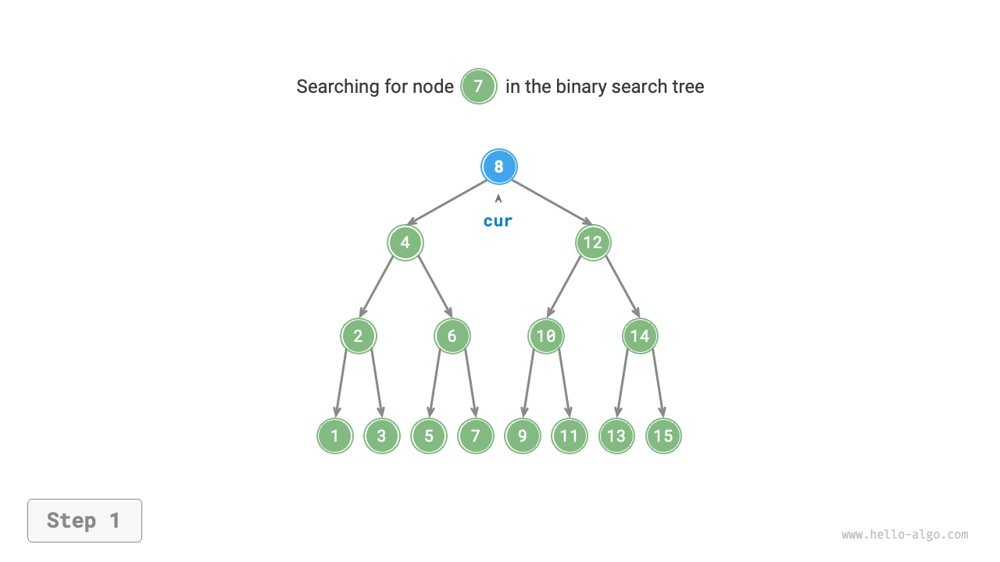

# 7.4 &nbsp; 二分探索木

下図に示すように、<u>二分探索木</u>は以下の条件を満たします。

1. 根ノードについて、左部分木のすべてのノードの値 $<$ 根ノードの値 $<$ 右部分木のすべてのノードの値。
2. 任意のノードの左と右の部分木も二分探索木です。つまり、条件`1.`も満たします。

{ class="animation-figure" }

<p align="center"> 図 7-16 &nbsp; 二分探索木 </p>

## 7.4.1 &nbsp; 二分探索木の操作

二分探索木をクラス`BinarySearchTree`としてカプセル化し、木の根ノードを指すメンバー変数`root`を宣言します。

### 1. &nbsp; ノードの検索

ターゲットノード値`num`が与えられた場合、二分探索木の性質に従って検索できます。下図に示すように、ノード`cur`を宣言し、二分木の根ノード`root`から開始し、ノード値`cur.val`と`num`のサイズを比較するループを行います。

- `cur.val < num`の場合、ターゲットノードは`cur`の右部分木にあることを意味するため、`cur = cur.right`を実行します。
- `cur.val > num`の場合、ターゲットノードは`cur`の左部分木にあることを意味するため、`cur = cur.left`を実行します。
- `cur.val = num`の場合、ターゲットノードが見つかったことを意味するため、ループを終了してノードを返します。

=== "<1>"
    { class="animation-figure" }

=== "<2>"
    { class="animation-figure" }

=== "<3>"
    { class="animation-figure" }

=== "<4>"
    { class="animation-figure" }

<p align="center"> 図 7-17 &nbsp; 二分探索木でのノード検索例 </p>

二分探索木での検索操作は二分探索アルゴリズムと同じ原理で動作し、各ラウンドでケースの半分を排除します。ループ数は最大で二分木の高さです。二分木が平衡している場合、$O(\log n)$の時間を使用します。コード例は以下の通りです：

=== "Python"

    ```python title="binary_search_tree.py"
    def search(self, num: int) -> TreeNode | None:
        """ノードを探索"""
        cur = self._root
        # ループで探索、葉ノードを通過した後にブレーク
        while cur is not None:
            # ターゲットノードはcurの右部分木にある
            if cur.val < num:
                cur = cur.right
            # ターゲットノードはcurの左部分木にある
            elif cur.val > num:
                cur = cur.left
            # ターゲットノードを発見、ループをブレーク
            else:
                break
        return cur
    ```

=== "C++"

    ```cpp title="binary_search_tree.cpp"
    /* ノードを検索 */
    TreeNode *search(int num) {
        TreeNode *cur = root;
        // ループで検索、葉ノードを通り過ぎたら終了
        while (cur != nullptr) {
            // 目標ノードはcurの右部分木にある
            if (cur->val < num)
                cur = cur->right;
            // 目標ノードはcurの左部分木にある
            else if (cur->val > num)
                cur = cur->left;
            // 目標ノードを見つけた、ループを抜ける
            else
                break;
        }
        // 目標ノードを返す
        return cur;
    }
    ```

=== "Java"

    ```java title="binary_search_tree.java"
    /* ノードを検索 */
    TreeNode search(int num) {
        TreeNode cur = root;
        // ループで検索、葉ノードを通過後に終了
        while (cur != null) {
            // 対象ノードは cur の右部分木にある
            if (cur.val < num)
                cur = cur.right;
            // 対象ノードは cur の左部分木にある
            else if (cur.val > num)
                cur = cur.left;
            // 対象ノードを見つけた、ループを終了
            else
                break;
        }
        // 対象ノードを返す
        return cur;
    }
    ```

=== "C#"

    ```csharp title="binary_search_tree.cs"
    [class]{BinarySearchTree}-[func]{Search}
    ```

=== "Go"

    ```go title="binary_search_tree.go"
    [class]{binarySearchTree}-[func]{search}
    ```

=== "Swift"

    ```swift title="binary_search_tree.swift"
    [class]{BinarySearchTree}-[func]{search}
    ```

=== "JS"

    ```javascript title="binary_search_tree.js"
    [class]{BinarySearchTree}-[func]{search}
    ```

=== "TS"

    ```typescript title="binary_search_tree.ts"
    [class]{BinarySearchTree}-[func]{search}
    ```

=== "Dart"

    ```dart title="binary_search_tree.dart"
    [class]{BinarySearchTree}-[func]{search}
    ```

=== "Rust"

    ```rust title="binary_search_tree.rs"
    [class]{BinarySearchTree}-[func]{search}
    ```

=== "C"

    ```c title="binary_search_tree.c"
    [class]{BinarySearchTree}-[func]{search}
    ```

=== "Kotlin"

    ```kotlin title="binary_search_tree.kt"
    [class]{BinarySearchTree}-[func]{search}
    ```

=== "Ruby"

    ```ruby title="binary_search_tree.rb"
    [class]{BinarySearchTree}-[func]{search}
    ```

=== "Zig"

    ```zig title="binary_search_tree.zig"
    [class]{BinarySearchTree}-[func]{search}
    ```

### 2. &nbsp; ノードの挿入

挿入する要素`num`が与えられた場合、二分探索木の性質「左部分木 < 根ノード < 右部分木」を維持するため、挿入操作は下図に示すように進行します。

1. **挿入位置を見つける**: 検索操作と同様に、根ノードから開始し、現在のノード値と`num`のサイズ関係に従って下向きにループし、葉ノードを通過（`None`に走査）するまで、ループを終了します。
2. **この位置にノードを挿入**: ノード`num`を初期化し、`None`があった場所に配置します。

{ class="animation-figure" }

<p align="center"> 図 7-18 &nbsp; 二分探索木へのノード挿入 </p>

コード実装では、以下の2点に注意してください。

- 二分探索木は重複ノードの存在を許可しません。そうでなければ、その定義に違反します。したがって、挿入するノードが既に木に存在する場合、挿入は実行されず、ノードは直接戻ります。
- 挿入操作を実行するには、前のループからのノードを保存するためにノード`pre`を使用する必要があります。このようにして、`None`に走査したときに、その親ノードを取得でき、ノード挿入操作を完了できます。

=== "Python"

    ```python title="binary_search_tree.py"
    def insert(self, num: int):
        """ノードを挿入"""
        # 木が空の場合、ルートノードを初期化
        if self._root is None:
            self._root = TreeNode(num)
            return
        # ループで探索、葉ノードを通過した後にブレーク
        cur, pre = self._root, None
        while cur is not None:
            # 重複ノードを発見したため、戻る
            if cur.val == num:
                return
            pre = cur
            # 挿入位置はcurの右部分木にある
            if cur.val < num:
                cur = cur.right
            # 挿入位置はcurの左部分木にある
            else:
                cur = cur.left
        # ノードを挿入
        node = TreeNode(num)
        if pre.val < num:
            pre.right = node
        else:
            pre.left = node
    ```

=== "C++"

    ```cpp title="binary_search_tree.cpp"
    /* ノードを挿入 */
    void insert(int num) {
        // 木が空の場合、ルートノードを初期化
        if (root == nullptr) {
            root = new TreeNode(num);
            return;
        }
        TreeNode *cur = root, *pre = nullptr;
        // ループで検索、葉ノードを通り過ぎたら終了
        while (cur != nullptr) {
            // 重複ノードを見つけた場合、戻る
            if (cur->val == num)
                return;
            pre = cur;
            // 挿入位置はcurの右部分木にある
            if (cur->val < num)
                cur = cur->right;
            // 挿入位置はcurの左部分木にある
            else
                cur = cur->left;
        }
        // ノードを挿入
        TreeNode *node = new TreeNode(num);
        if (pre->val < num)
            pre->right = node;
        else
            pre->left = node;
    }
    ```

=== "Java"

    ```java title="binary_search_tree.java"
    /* ノードを挿入 */
    void insert(int num) {
        // 木が空の場合、根ノードを初期化
        if (root == null) {
            root = new TreeNode(num);
            return;
        }
        TreeNode cur = root, pre = null;
        // ループで検索、葉ノードを通過後に終了
        while (cur != null) {
            // 重複ノードを見つけた場合、戻る
            if (cur.val == num)
                return;
            pre = cur;
            // 挿入位置は cur の右部分木にある
            if (cur.val < num)
                cur = cur.right;
            // 挿入位置は cur の左部分木にある
            else
                cur = cur.left;
        }
        // ノードを挿入
        TreeNode node = new TreeNode(num);
        if (pre.val < num)
            pre.right = node;
        else
            pre.left = node;
    }
    ```

=== "C#"

    ```csharp title="binary_search_tree.cs"
    [class]{BinarySearchTree}-[func]{Insert}
    ```

=== "Go"

    ```go title="binary_search_tree.go"
    [class]{binarySearchTree}-[func]{insert}
    ```

=== "Swift"

    ```swift title="binary_search_tree.swift"
    [class]{BinarySearchTree}-[func]{insert}
    ```

=== "JS"

    ```javascript title="binary_search_tree.js"
    [class]{BinarySearchTree}-[func]{insert}
    ```

=== "TS"

    ```typescript title="binary_search_tree.ts"
    [class]{BinarySearchTree}-[func]{insert}
    ```

=== "Dart"

    ```dart title="binary_search_tree.dart"
    [class]{BinarySearchTree}-[func]{insert}
    ```

=== "Rust"

    ```rust title="binary_search_tree.rs"
    [class]{BinarySearchTree}-[func]{insert}
    ```

=== "C"

    ```c title="binary_search_tree.c"
    [class]{BinarySearchTree}-[func]{insert}
    ```

=== "Kotlin"

    ```kotlin title="binary_search_tree.kt"
    [class]{BinarySearchTree}-[func]{insert}
    ```

=== "Ruby"

    ```ruby title="binary_search_tree.rb"
    [class]{BinarySearchTree}-[func]{insert}
    ```

=== "Zig"

    ```zig title="binary_search_tree.zig"
    [class]{BinarySearchTree}-[func]{insert}
    ```

ノードの検索と同様に、ノードの挿入には$O(\log n)$の時間を使用します。

### 3. &nbsp; ノードの削除

まず、二分木でターゲットノードを見つけ、それを削除します。ノードの挿入と同様に、削除操作が完了した後も、二分探索木の性質「左部分木 < 根ノード < 右部分木」が満たされることを保証する必要があります。したがって、ターゲットノードの子ノード数に基づいて、0、1、2の3つのケースに分け、対応するノード削除操作を実行します。

下図に示すように、削除するノードの次数が$0$の場合、そのノードは葉ノードであることを意味し、直接削除できます。

{ class="animation-figure" }

<p align="center"> 図 7-19 &nbsp; 二分探索木でのノード削除（次数0） </p>

下図に示すように、削除するノードの次数が$1$の場合、削除するノードをその子ノードで置き換えるだけで十分です。

{ class="animation-figure" }

<p align="center"> 図 7-20 &nbsp; 二分探索木でのノード削除（次数1） </p>

削除するノードの次数が$2$の場合、直接削除することはできませんが、ノードを使用して置き換える必要があります。二分探索木の性質「左部分木 $<$ 根ノード $<$ 右部分木」を維持するため、**このノードは右部分木の最小ノードまたは左部分木の最大ノードのいずれかです**。

右部分木の最小ノード（中順走査での次のノード）を選択すると仮定すると、削除操作は下図に示すように進行します。

1. 削除するノードの「中順走査シーケンス」での次のノードを見つけ、`tmp`として示します。
2. 削除するノードの値を`tmp`の値で置き換え、木内でノード`tmp`を再帰的に削除します。

=== "<1>"
    { class="animation-figure" }

=== "<2>"
    { class="animation-figure" }

=== "<3>"
    { class="animation-figure" }

=== "<4>"
    { class="animation-figure" }

<p align="center"> 図 7-21 &nbsp; 二分探索木でのノード削除（次数2） </p>

ノードを削除する操作も$O(\log n)$の時間を使用します。削除するノードを見つけるのに$O(\log n)$の時間が必要で、中順走査の後継ノードを取得するのに$O(\log n)$の時間が必要です。コード例は以下の通りです：

=== "Python"

    ```python title="binary_search_tree.py"
    def remove(self, num: int):
        """ノードを削除"""
        # 木が空の場合、戻る
        if self._root is None:
            return
        # ループで探索、葉ノードを通過した後にブレーク
        cur, pre = self._root, None
        while cur is not None:
            # 削除するノードを発見、ループをブレーク
            if cur.val == num:
                break
            pre = cur
            # 削除するノードはcurの右部分木にある
            if cur.val < num:
                cur = cur.right
            # 削除するノードはcurの左部分木にある
            else:
                cur = cur.left
        # 削除するノードが存在しない場合、戻る
        if cur is None:
            return

        # 子ノード数 = 0 または 1
        if cur.left is None or cur.right is None:
            # 子ノード数 = 0/1の場合、child = null/その子ノード
            child = cur.left or cur.right
            # ノードcurを削除
            if cur != self._root:
                if pre.left == cur:
                    pre.left = child
                else:
                    pre.right = child
            else:
                # 削除されるノードがルートの場合、ルートを再割り当て
                self._root = child
        # 子ノード数 = 2
        else:
            # curの中順走査の次のノードを取得
            tmp: TreeNode = cur.right
            while tmp.left is not None:
                tmp = tmp.left
            # 再帰的にノードtmpを削除
            self.remove(tmp.val)
            # curをtmpで置き換え
            cur.val = tmp.val
    ```

=== "C++"

    ```cpp title="binary_search_tree.cpp"
    /* ノードを削除 */
    void remove(int num) {
        // 木が空の場合、戻る
        if (root == nullptr)
            return;
        TreeNode *cur = root, *pre = nullptr;
        // ループで検索、葉ノードを通り過ぎたら終了
        while (cur != nullptr) {
            // 削除するノードを見つけた、ループを抜ける
            if (cur->val == num)
                break;
            pre = cur;
            // 削除するノードはcurの右部分木にある
            if (cur->val < num)
                cur = cur->right;
            // 削除するノードはcurの左部分木にある
            else
                cur = cur->left;
        }
        // 削除するノードがない場合、戻る
        if (cur == nullptr)
            return;
        // 子ノード数 = 0 または 1
        if (cur->left == nullptr || cur->right == nullptr) {
            // 子ノード数 = 0 / 1の場合、child = nullptr / その子ノード
            TreeNode *child = cur->left != nullptr ? cur->left : cur->right;
            // ノードcurを削除
            if (cur != root) {
                if (pre->left == cur)
                    pre->left = child;
                else
                    pre->right = child;
            } else {
                // 削除されるノードがルートの場合、ルートを再割り当て
                root = child;
            }
            // メモリを解放
            delete cur;
        }
        // 子ノード数 = 2
        else {
            // curの中順走査の次のノードを取得
            TreeNode *tmp = cur->right;
            while (tmp->left != nullptr) {
                tmp = tmp->left;
            }
            int tmpVal = tmp->val;
            // ノードtmpを再帰的に削除
            remove(tmp->val);
            // curをtmpで置き換え
            cur->val = tmpVal;
        }
    }
    ```

=== "Java"

    ```java title="binary_search_tree.java"
    /* ノードを削除 */
    void remove(int num) {
        // 木が空の場合、戻る
        if (root == null)
            return;
        TreeNode cur = root, pre = null;
        // ループで検索、葉ノードを通過後に終了
        while (cur != null) {
            // 削除するノードを見つけた、ループを終了
            if (cur.val == num)
                break;
            pre = cur;
            // 削除するノードは cur の右部分木にある
            if (cur.val < num)
                cur = cur.right;
            // 削除するノードは cur の左部分木にある
            else
                cur = cur.left;
        }
        // 削除するノードがない場合、戻る
        if (cur == null)
            return;
        // 子ノード数 = 0 または 1
        if (cur.left == null || cur.right == null) {
            // 子ノード数 = 0/1 の場合、child = null/その子ノード
            TreeNode child = cur.left != null ? cur.left : cur.right;
            // ノード cur を削除
            if (cur != root) {
                if (pre.left == cur)
                    pre.left = child;
                else
                    pre.right = child;
            } else {
                // 削除されるノードが根の場合、根を再割り当て
                root = child;
            }
        }
        // 子ノード数 = 2
        else {
            // cur の中順走査の次のノードを取得
            TreeNode tmp = cur.right;
            while (tmp.left != null) {
                tmp = tmp.left;
            }
            // 再帰的にノード tmp を削除
            remove(tmp.val);
            // cur を tmp で置き換える
            cur.val = tmp.val;
        }
    }
    ```

=== "C#"

    ```csharp title="binary_search_tree.cs"
    [class]{BinarySearchTree}-[func]{Remove}
    ```

=== "Go"

    ```go title="binary_search_tree.go"
    [class]{binarySearchTree}-[func]{remove}
    ```

=== "Swift"

    ```swift title="binary_search_tree.swift"
    [class]{BinarySearchTree}-[func]{remove}
    ```

=== "JS"

    ```javascript title="binary_search_tree.js"
    [class]{BinarySearchTree}-[func]{remove}
    ```

=== "TS"

    ```typescript title="binary_search_tree.ts"
    [class]{BinarySearchTree}-[func]{remove}
    ```

=== "Dart"

    ```dart title="binary_search_tree.dart"
    [class]{BinarySearchTree}-[func]{remove}
    ```

=== "Rust"

    ```rust title="binary_search_tree.rs"
    [class]{BinarySearchTree}-[func]{remove}
    ```

=== "C"

    ```c title="binary_search_tree.c"
    [class]{BinarySearchTree}-[func]{removeItem}
    ```

=== "Kotlin"

    ```kotlin title="binary_search_tree.kt"
    [class]{BinarySearchTree}-[func]{remove}
    ```

=== "Ruby"

    ```ruby title="binary_search_tree.rb"
    [class]{BinarySearchTree}-[func]{remove}
    ```

=== "Zig"

    ```zig title="binary_search_tree.zig"
    [class]{BinarySearchTree}-[func]{remove}
    ```

### 4. &nbsp; 中順走査は順序付けされている

下図に示すように、二分木の中順走査は「左 $\rightarrow$ 根 $\rightarrow$ 右」の走査順序に従い、二分探索木は「左子ノード $<$ 根ノード $<$ 右子ノード」のサイズ関係を満たします。

これは、二分探索木で中順走査を実行するときに、常に次に小さいノードが最初に走査されることを意味し、重要な性質につながります：**二分探索木の中順走査のシーケンスは昇順です**。

中順走査の昇順性質を使用して、二分探索木で順序付けされたデータを取得するには$O(n)$の時間のみが必要で、追加のソート操作は不要であり、非常に効率的です。

{ class="animation-figure" }

<p align="center"> 図 7-22 &nbsp; 二分探索木の中順走査シーケンス </p>

## 7.4.2 &nbsp; 二分探索木の効率

データのセットが与えられた場合、配列または二分探索木を使用して格納することを検討します。下の表を観察すると、二分探索木のすべての操作は対数時間計算量を持ち、安定して効率的です。配列は、頻繁な追加と検索や削除の頻度が少ないシナリオでのみ、二分探索木よりも効率的です。

<p align="center"> 表 7-2 &nbsp; 配列と探索木の効率比較 </p>

<div class="center-table" markdown>

|                | 未ソート配列    | 二分探索木        |
| -------------- | -------------- | ------------------ |
| 要素の検索      | $O(n)$         | $O(\log n)$        |
| 要素の挿入      | $O(1)$         | $O(\log n)$        |
| 要素の削除      | $O(n)$         | $O(\log n)$        |

</div>

理想的には、二分探索木は「平衡」しており、任意のノードを$\log n$ループ内で見つけることができます。

しかし、二分探索木で継続的にノードを挿入および削除すると、下図に示すように連結リストに退化する可能性があり、さまざまな操作の時間計算量も$O(n)$に悪化します。

{ class="animation-figure" }

<p align="center"> 図 7-23 &nbsp; 二分探索木の退化 </p>

## 7.4.3 &nbsp; 二分探索木の一般的な応用

- システムでの多レベルインデックスとして使用され、効率的な検索、挿入、削除操作を実装します。
- 特定の検索アルゴリズムの基盤となるデータ構造として機能します。
- データストリームを格納して、その順序付けされた状態を維持するために使用されます。
