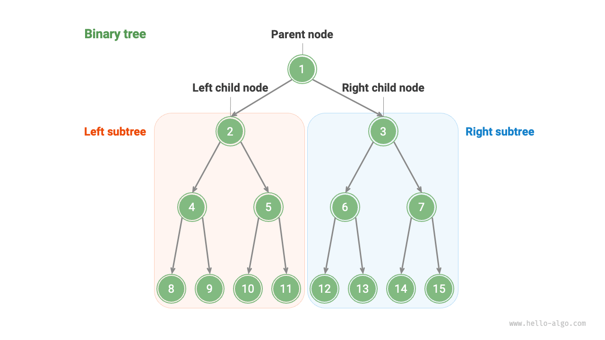
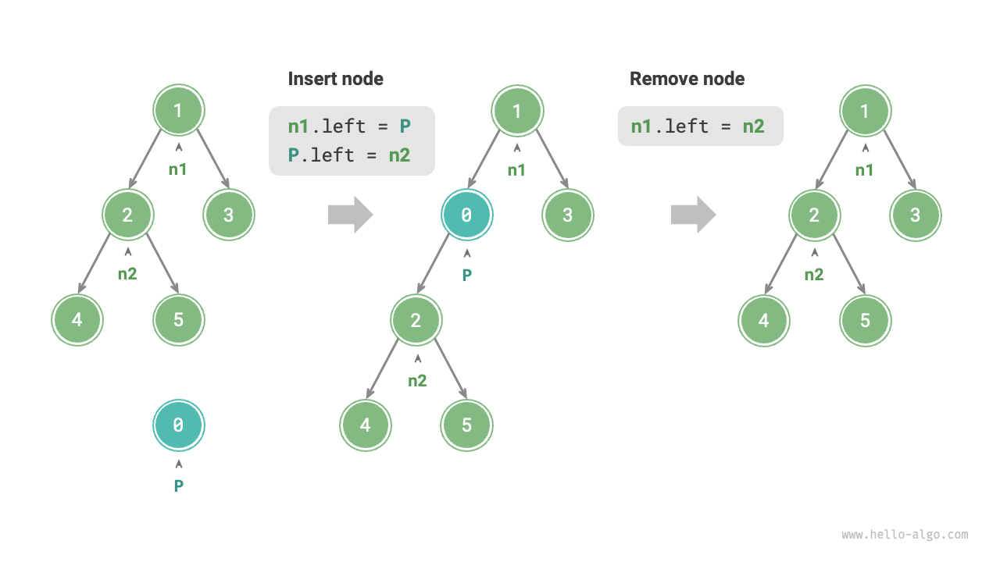
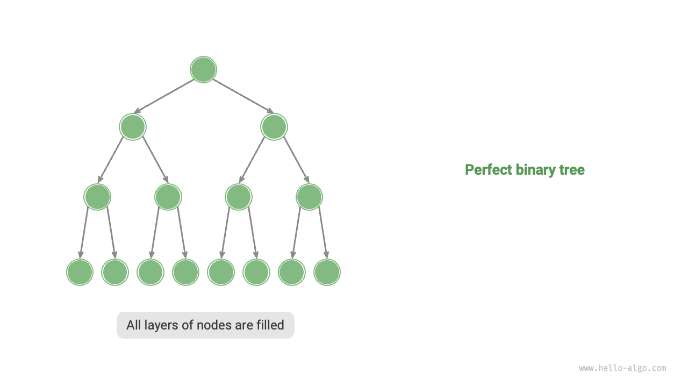
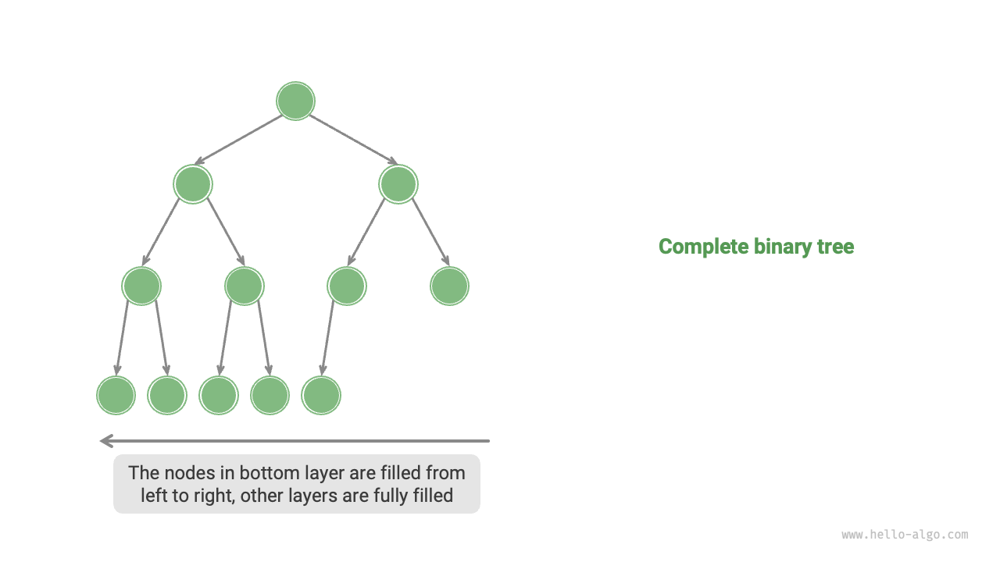
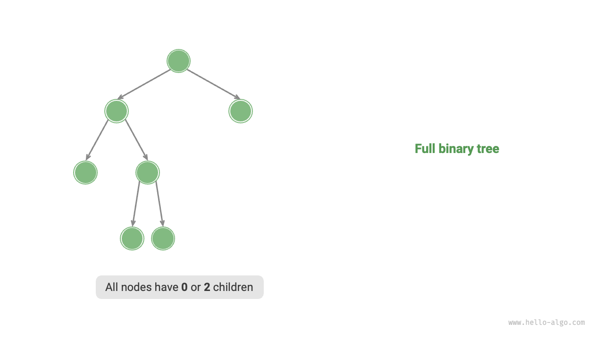
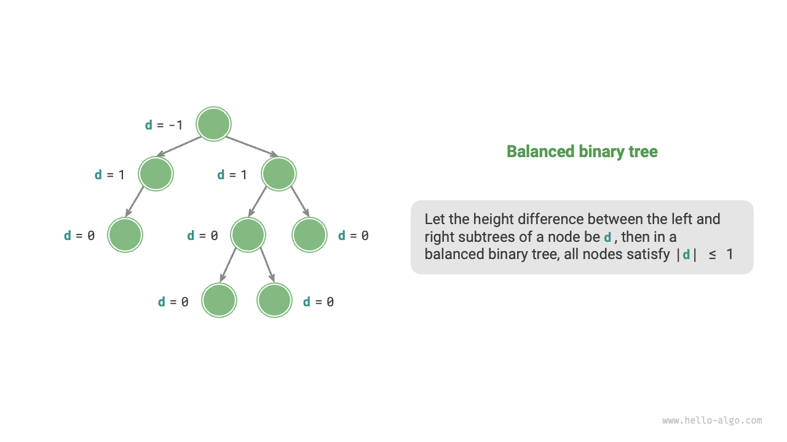
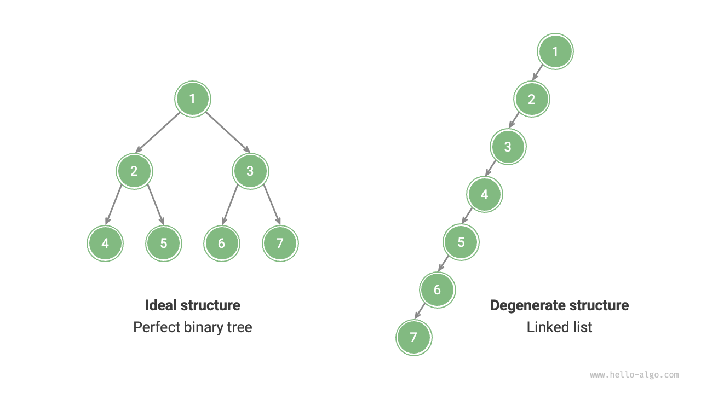

# 二分木

<u>二分木</u>は、祖先と子孫の間の階層関係を表現し、「二つに分割する」分割統治法の論理を体現する非線形データ構造です。連結リストと同様に、二分木の基本単位はノードであり、各ノードは値、左の子ノードへの参照、右の子ノードへの参照を含みます。

=== "Python"

    ```python title=""
    class TreeNode:
        """二分木ノード"""
        def __init__(self, val: int):
            self.val: int = val                # ノード値
            self.left: TreeNode | None = None  # 左の子ノードへの参照
            self.right: TreeNode | None = None # 右の子ノードへの参照
    ```

=== "C++"

    ```cpp title=""
    /* 二分木ノード */
    struct TreeNode {
        int val;          // ノード値
        TreeNode *left;   // 左の子ノードへのポインタ
        TreeNode *right;  // 右の子ノードへのポインタ
        TreeNode(int x) : val(x), left(nullptr), right(nullptr) {}
    };
    ```

=== "Java"

    ```java title=""
    /* 二分木ノード */
    class TreeNode {
        int val;         // ノード値
        TreeNode left;   // 左の子ノードへの参照
        TreeNode right;  // 右の子ノードへの参照
        TreeNode(int x) { val = x; }
    }
    ```

=== "C#"

    ```csharp title=""
    /* 二分木ノード */
    class TreeNode(int? x) {
        public int? val = x;    // ノード値
        public TreeNode? left;  // 左の子ノードへの参照
        public TreeNode? right; // 右の子ノードへの参照
    }
    ```

=== "Go"

    ```go title=""
    /* 二分木ノード */
    type TreeNode struct {
        Val   int
        Left  *TreeNode
        Right *TreeNode
    }
    /* コンストラクタ */
    func NewTreeNode(v int) *TreeNode {
        return &TreeNode{
            Left:  nil, // 左の子ノードへのポインタ
            Right: nil, // 右の子ノードへのポインタ
            Val:   v,   // ノード値
        }
    }
    ```

=== "Swift"

    ```swift title=""
    /* 二分木ノード */
    class TreeNode {
        var val: Int // ノード値
        var left: TreeNode? // 左の子ノードへの参照
        var right: TreeNode? // 右の子ノードへの参照

        init(x: Int) {
            val = x
        }
    }
    ```

=== "JS"

    ```javascript title=""
    /* 二分木ノード */
    class TreeNode {
        val; // ノード値
        left; // 左の子ノードへのポインタ
        right; // 右の子ノードへのポインタ
        constructor(val, left, right) {
            this.val = val === undefined ? 0 : val;
            this.left = left === undefined ? null : left;
            this.right = right === undefined ? null : right;
        }
    }
    ```

=== "TS"

    ```typescript title=""
    /* 二分木ノード */
    class TreeNode {
        val: number;
        left: TreeNode | null;
        right: TreeNode | null;

        constructor(val?: number, left?: TreeNode | null, right?: TreeNode | null) {
            this.val = val === undefined ? 0 : val; // ノード値
            this.left = left === undefined ? null : left; // 左の子ノードへの参照
            this.right = right === undefined ? null : right; // 右の子ノードへの参照
        }
    }
    ```

=== "Dart"

    ```dart title=""
    /* 二分木ノード */
    class TreeNode {
      int val;         // ノード値
      TreeNode? left;  // 左の子ノードへの参照
      TreeNode? right; // 右の子ノードへの参照
      TreeNode(this.val, [this.left, this.right]);
    }
    ```

=== "Rust"

    ```rust title=""
    use std::rc::Rc;
    use std::cell::RefCell;

    /* 二分木ノード */
    struct TreeNode {
        val: i32,                               // ノード値
        left: Option<Rc<RefCell<TreeNode>>>,    // 左の子ノードへの参照
        right: Option<Rc<RefCell<TreeNode>>>,   // 右の子ノードへの参照
    }

    impl TreeNode {
        /* コンストラクタ */
        fn new(val: i32) -> Rc<RefCell<Self>> {
            Rc::new(RefCell::new(Self {
                val,
                left: None,
                right: None
            }))
        }
    }
    ```

=== "C"

    ```c title=""
    /* 二分木ノード */
    typedef struct TreeNode {
        int val;                // ノード値
        int height;             // ノードの高さ
        struct TreeNode *left;  // 左の子ノードへのポインタ
        struct TreeNode *right; // 右の子ノードへのポインタ
    } TreeNode;

    /* コンストラクタ */
    TreeNode *newTreeNode(int val) {
        TreeNode *node;

        node = (TreeNode *)malloc(sizeof(TreeNode));
        node->val = val;
        node->height = 0;
        node->left = NULL;
        node->right = NULL;
        return node;
    }
    ```

=== "Kotlin"

    ```kotlin title=""
    /* 二分木ノード */
    class TreeNode(val _val: Int) {  // ノード値
        val left: TreeNode? = null   // 左の子ノードへの参照
        val right: TreeNode? = null  // 右の子ノードへの参照
    }
    ```

=== "Ruby"

    ```ruby title=""

    ```

=== "Zig"

    ```zig title=""

    ```

各ノードは2つの参照（ポインタ）を持ち、それぞれ<u>左の子ノード</u>と<u>右の子ノード</u>を指しています。このノードは、これら2つの子ノードの<u>親ノード</u>と呼ばれます。二分木のノードが与えられたとき、このノードの左の子とその下にあるすべてのノードで形成される木を、このノードの<u>左部分木</u>と呼びます。同様に、<u>右部分木</u>も定義できます。

**二分木では、葉ノードを除いて、他のすべてのノードは子ノードと空でない部分木を含みます。** 下図に示すように、「ノード2」を親ノードとして見ると、その左と右の子ノードはそれぞれ「ノード4」と「ノード5」です。左部分木は「ノード4」とその下にあるすべてのノードで形成され、右部分木は「ノード5」とその下にあるすべてのノードで形成されます。



## 二分木の一般的な用語

二分木でよく使用される用語を下図に示します。

- <u>根ノード</u>：二分木の最上位レベルにあるノードで、親ノードを持ちません。
- <u>葉ノード</u>：子ノードを持たないノードで、両方のポインタが`None`を指しています。
- <u>辺</u>：2つのノードを結ぶ線分で、ノード間の参照（ポインタ）を表現します。
- ノードの<u>レベル</u>：上から下に向かって増加し、根ノードがレベル1です。
- ノードの<u>次数</u>：ノードが持つ子ノードの数です。二分木では、次数は0、1、または2になります。
- 二分木の<u>高さ</u>：根ノードから最も遠い葉ノードまでの辺の数です。
- ノードの<u>深さ</u>：根ノードからそのノードまでの辺の数です。
- ノードの<u>高さ</u>：最も遠い葉ノードからそのノードまでの辺の数です。


!!! tip

    「高さ」と「深さ」は通常「通過する辺の数」として定義しますが、一部の問題や教科書では「通過するノードの数」として定義されることがあります。この場合、高さと深さの両方を1だけ増やす必要があります。

## 二分木の基本操作

### 二分木の初期化

連結リストと同様に、二分木の初期化では、まずノードを作成し、次にそれらの間の参照（ポインタ）を確立します。

=== "Python"

    ```python title="binary_tree.py"
    # 二分木の初期化
    # ノードの初期化
    n1 = TreeNode(val=1)
    n2 = TreeNode(val=2)
    n3 = TreeNode(val=3)
    n4 = TreeNode(val=4)
    n5 = TreeNode(val=5)
    # ノード間の参照（ポインタ）を結ぶ
    n1.left = n2
    n1.right = n3
    n2.left = n4
    n2.right = n5
    ```

=== "C++"

    ```cpp title="binary_tree.cpp"
    /* 二分木の初期化 */
    // ノードの初期化
    TreeNode* n1 = new TreeNode(1);
    TreeNode* n2 = new TreeNode(2);
    TreeNode* n3 = new TreeNode(3);
    TreeNode* n4 = new TreeNode(4);
    TreeNode* n5 = new TreeNode(5);
    // ノード間の参照（ポインタ）を結ぶ
    n1->left = n2;
    n1->right = n3;
    n2->left = n4;
    n2->right = n5;
    ```

=== "Java"

    ```java title="binary_tree.java"
    // ノードの初期化
    TreeNode n1 = new TreeNode(1);
    TreeNode n2 = new TreeNode(2);
    TreeNode n3 = new TreeNode(3);
    TreeNode n4 = new TreeNode(4);
    TreeNode n5 = new TreeNode(5);
    // ノード間の参照（ポインタ）を結ぶ
    n1.left = n2;
    n1.right = n3;
    n2.left = n4;
    n2.right = n5;
    ```

=== "C#"

    ```csharp title="binary_tree.cs"
    /* 二分木の初期化 */
    // ノードの初期化
    TreeNode n1 = new(1);
    TreeNode n2 = new(2);
    TreeNode n3 = new(3);
    TreeNode n4 = new(4);
    TreeNode n5 = new(5);
    // ノード間の参照（ポインタ）を結ぶ
    n1.left = n2;
    n1.right = n3;
    n2.left = n4;
    n2.right = n5;
    ```

=== "Go"

    ```go title="binary_tree.go"
    /* 二分木の初期化 */
    // ノードの初期化
    n1 := NewTreeNode(1)
    n2 := NewTreeNode(2)
    n3 := NewTreeNode(3)
    n4 := NewTreeNode(4)
    n5 := NewTreeNode(5)
    // ノード間の参照（ポインタ）を結ぶ
    n1.Left = n2
    n1.Right = n3
    n2.Left = n4
    n2.Right = n5
    ```

=== "Swift"

    ```swift title="binary_tree.swift"
    // ノードの初期化
    let n1 = TreeNode(x: 1)
    let n2 = TreeNode(x: 2)
    let n3 = TreeNode(x: 3)
    let n4 = TreeNode(x: 4)
    let n5 = TreeNode(x: 5)
    // ノード間の参照（ポインタ）を結ぶ
    n1.left = n2
    n1.right = n3
    n2.left = n4
    n2.right = n5
    ```

=== "JS"

    ```javascript title="binary_tree.js"
    /* 二分木の初期化 */
    // ノードの初期化
    let n1 = new TreeNode(1),
        n2 = new TreeNode(2),
        n3 = new TreeNode(3),
        n4 = new TreeNode(4),
        n5 = new TreeNode(5);
    // ノード間の参照（ポインタ）を結ぶ
    n1.left = n2;
    n1.right = n3;
    n2.left = n4;
    n2.right = n5;
    ```

=== "TS"

    ```typescript title="binary_tree.ts"
    /* 二分木の初期化 */
    // ノードの初期化
    let n1 = new TreeNode(1),
        n2 = new TreeNode(2),
        n3 = new TreeNode(3),
        n4 = new TreeNode(4),
        n5 = new TreeNode(5);
    // ノード間の参照（ポインタ）を結ぶ
    n1.left = n2;
    n1.right = n3;
    n2.left = n4;
    n2.right = n5;
    ```

=== "Dart"

    ```dart title="binary_tree.dart"
    /* 二分木の初期化 */
    // ノードの初期化
    TreeNode n1 = new TreeNode(1);
    TreeNode n2 = new TreeNode(2);
    TreeNode n3 = new TreeNode(3);
    TreeNode n4 = new TreeNode(4);
    TreeNode n5 = new TreeNode(5);
    // ノード間の参照（ポインタ）を結ぶ
    n1.left = n2;
    n1.right = n3;
    n2.left = n4;
    n2.right = n5;
    ```

=== "Rust"

    ```rust title="binary_tree.rs"
    // ノードの初期化
    let n1 = TreeNode::new(1);
    let n2 = TreeNode::new(2);
    let n3 = TreeNode::new(3);
    let n4 = TreeNode::new(4);
    let n5 = TreeNode::new(5);
    // ノード間の参照（ポインタ）を結ぶ
    n1.borrow_mut().left = Some(n2.clone());
    n1.borrow_mut().right = Some(n3);
    n2.borrow_mut().left = Some(n4);
    n2.borrow_mut().right = Some(n5);
    ```

=== "C"

    ```c title="binary_tree.c"
    /* 二分木の初期化 */
    // ノードの初期化
    TreeNode *n1 = newTreeNode(1);
    TreeNode *n2 = newTreeNode(2);
    TreeNode *n3 = newTreeNode(3);
    TreeNode *n4 = newTreeNode(4);
    TreeNode *n5 = newTreeNode(5);
    // ノード間の参照（ポインタ）を結ぶ
    n1->left = n2;
    n1->right = n3;
    n2->left = n4;
    n2->right = n5;
    ```

=== "Kotlin"

    ```kotlin title="binary_tree.kt"
    // ノードの初期化
    val n1 = TreeNode(1)
    val n2 = TreeNode(2)
    val n3 = TreeNode(3)
    val n4 = TreeNode(4)
    val n5 = TreeNode(5)
    // ノード間の参照（ポインタ）を結ぶ
    n1.left = n2
    n1.right = n3
    n2.left = n4
    n2.right = n5
    ```

=== "Ruby"

    ```ruby title="binary_tree.rb"

    ```

=== "Zig"

    ```zig title="binary_tree.zig"

    ```

### ノードの挿入と削除

連結リストと同様に、二分木でのノードの挿入と削除はポインタを変更することで実現できます。下図に例を示します。



=== "Python"

    ```python title="binary_tree.py"
    # ノードの挿入と削除
    p = TreeNode(0)
    # n1 -> n2の間にノードPを挿入
    n1.left = p
    p.left = n2
    # ノードPを削除
    n1.left = n2
    ```

=== "C++"

    ```cpp title="binary_tree.cpp"
    /* ノードの挿入と削除 */
    TreeNode* P = new TreeNode(0);
    // n1とn2の間にノードPを挿入
    n1->left = P;
    P->left = n2;
    // ノードPを削除
    n1->left = n2;
    ```

=== "Java"

    ```java title="binary_tree.java"
    TreeNode P = new TreeNode(0);
    // n1とn2の間にノードPを挿入
    n1.left = P;
    P.left = n2;
    // ノードPを削除
    n1.left = n2;
    ```

=== "C#"

    ```csharp title="binary_tree.cs"
    /* ノードの挿入と削除 */
    TreeNode P = new(0);
    // n1とn2の間にノードPを挿入
    n1.left = P;
    P.left = n2;
    // ノードPを削除
    n1.left = n2;
    ```

=== "Go"

    ```go title="binary_tree.go"
    /* ノードの挿入と削除 */
    // n1とn2の間にノードPを挿入
    p := NewTreeNode(0)
    n1.Left = p
    p.Left = n2
    // ノードPを削除
    n1.Left = n2
    ```

=== "Swift"

    ```swift title="binary_tree.swift"
    let P = TreeNode(x: 0)
    // n1とn2の間にノードPを挿入
    n1.left = P
    P.left = n2
    // ノードPを削除
    n1.left = n2
    ```

=== "JS"

    ```javascript title="binary_tree.js"
    /* ノードの挿入と削除 */
    let P = new TreeNode(0);
    // n1とn2の間にノードPを挿入
    n1.left = P;
    P.left = n2;
    // ノードPを削除
    n1.left = n2;
    ```

=== "TS"

    ```typescript title="binary_tree.ts"
    /* ノードの挿入と削除 */
    const P = new TreeNode(0);
    // n1とn2の間にノードPを挿入
    n1.left = P;
    P.left = n2;
    // ノードPを削除
    n1.left = n2;
    ```

=== "Dart"

    ```dart title="binary_tree.dart"
    /* ノードの挿入と削除 */
    TreeNode P = new TreeNode(0);
    // n1とn2の間にノードPを挿入
    n1.left = P;
    P.left = n2;
    // ノードPを削除
    n1.left = n2;
    ```

=== "Rust"

    ```rust title="binary_tree.rs"
    let p = TreeNode::new(0);
    // n1とn2の間にノードPを挿入
    n1.borrow_mut().left = Some(p.clone());
    p.borrow_mut().left = Some(n2.clone());
    // ノードPを削除
    n1.borrow_mut().left = Some(n2);
    ```

=== "C"

    ```c title="binary_tree.c"
    /* ノードの挿入と削除 */
    TreeNode *P = newTreeNode(0);
    // n1とn2の間にノードPを挿入
    n1->left = P;
    P->left = n2;
    // ノードPを削除
    n1->left = n2;
    ```

=== "Kotlin"

    ```kotlin title="binary_tree.kt"
    val P = TreeNode(0)
    // n1とn2の間にノードPを挿入
    n1.left = P
    P.left = n2
    // ノードPを削除
    n1.left = n2
    ```

=== "Ruby"

    ```ruby title="binary_tree.rb"

    ```

=== "Zig"

    ```zig title="binary_tree.zig"

    ```

!!! tip

    ノードの挿入は二分木の元の論理構造を変更する可能性があり、ノードの削除は通常そのノードとそのすべての部分木を削除することになることに注意してください。したがって、二分木では、挿入と削除は通常一連の操作を通じて実行され、意味のある結果を得ます。

## 二分木の一般的な種類

### 完全二分木

下図に示すように、<u>完全二分木</u>では、すべてのレベルがノードで完全に埋められています。完全二分木では、葉ノードの次数は$0$で、他のすべてのノードの次数は$2$です。ノードの総数は$2^{h+1} - 1$として計算でき、ここで$h$は木の高さです。これは標準的な指数関係を示し、自然界の細胞分裂の一般的な現象を反映しています。

!!! tip

    中国語圏では、完全二分木はしばしば<u>満二分木</u>と呼ばれることに注意してください。



### 完備二分木

下図に示すように、<u>完備二分木</u>は、最下位レベルのみが完全に埋められていない可能性がある二分木で、最下位レベルのノードは左から右に連続して埋められる必要があります。完全二分木は完備二分木でもあることに注意してください。



### 満二分木

下図に示すように、<u>満二分木</u>では、葉ノードを除いて、他のすべてのノードが2つの子ノードを持ちます。



### 平衡二分木

下図に示すように、<u>平衡二分木</u>では、任意のノードの左と右の部分木の高さの絶対差が1を超えません。



## 二分木の退化

下図は、二分木の理想的な構造と退化した構造を示しています。二分木は、すべてのレベルが埋められているときに「完全二分木」になり、すべてのノードが一方に偏っているときに「連結リスト」に退化します。

- 完全二分木は、二分木の「分割統治法」の利点を十分に活用できる理想的なシナリオです。
- 一方、連結リストは別の極端を表し、すべての操作が線形になり、時間計算量が$O(n)$になります。



下表に示すように、最良と最悪の構造では、二分木は葉ノード数、総ノード数、高さの最大値または最小値を達成します。

<p align="center"> 表 <id> &nbsp; 二分木の最良と最悪の構造 </p>

|                                                 | 完全二分木         | 連結リスト  |
| ----------------------------------------------- | ------------------ | ----------- |
| レベル$i$のノード数                             | $2^{i-1}$          | $1$         |
| 高さ$h$の木の葉ノード数                         | $2^h$              | $1$         |
| 高さ$h$の木の総ノード数                         | $2^{h+1} - 1$      | $h + 1$     |
| 総ノード数$n$の木の高さ                         | $\log_2 (n+1) - 1$ | $n - 1$     |
