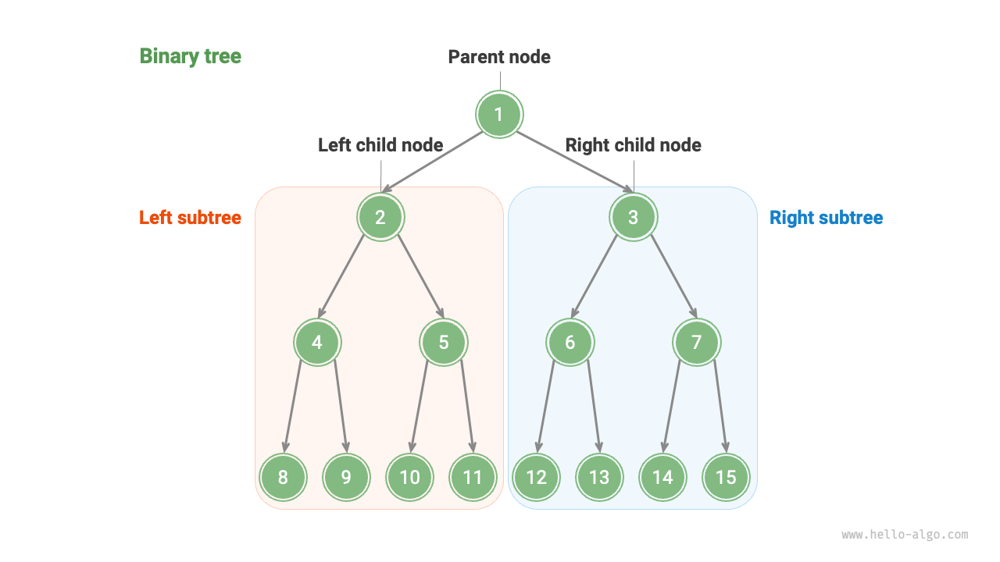
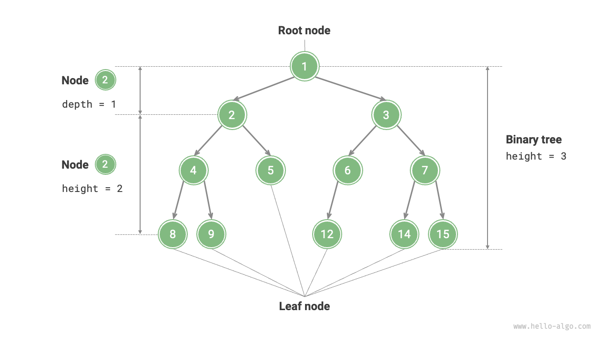
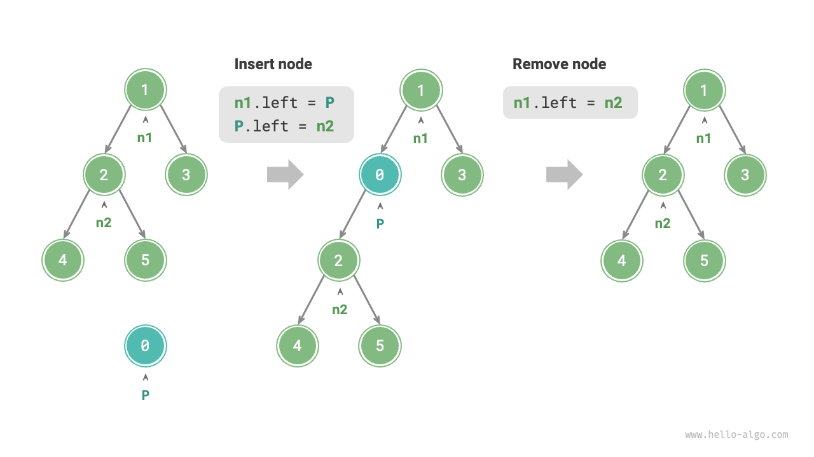
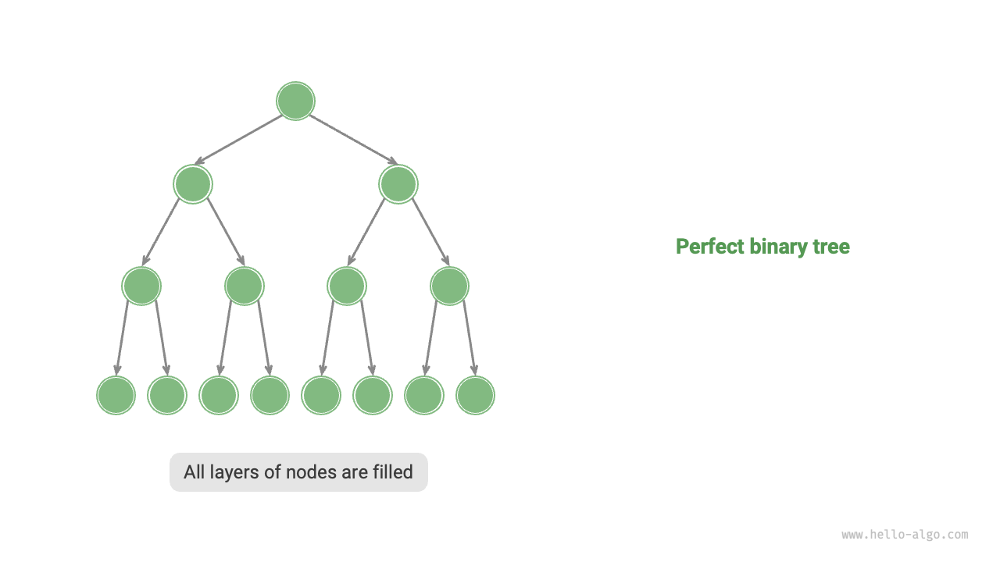
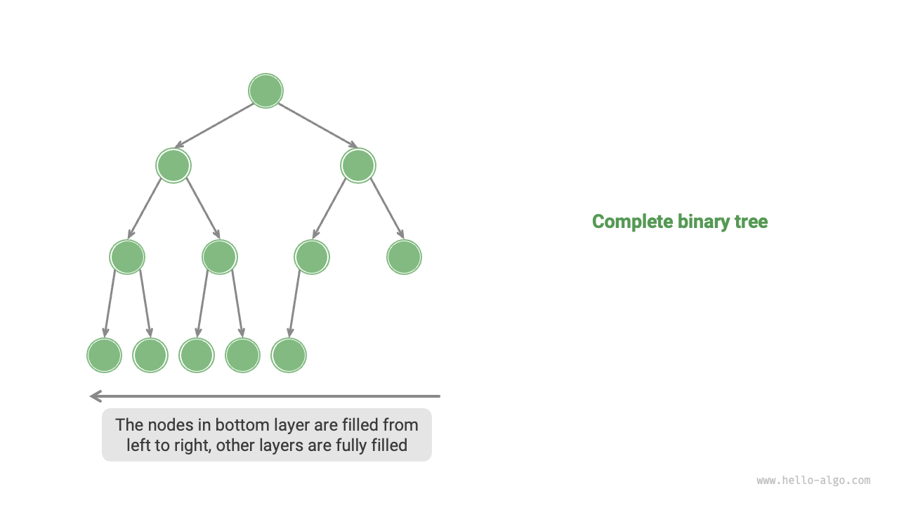
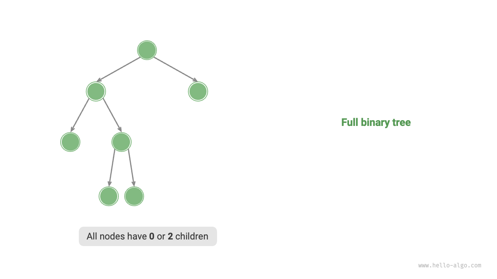
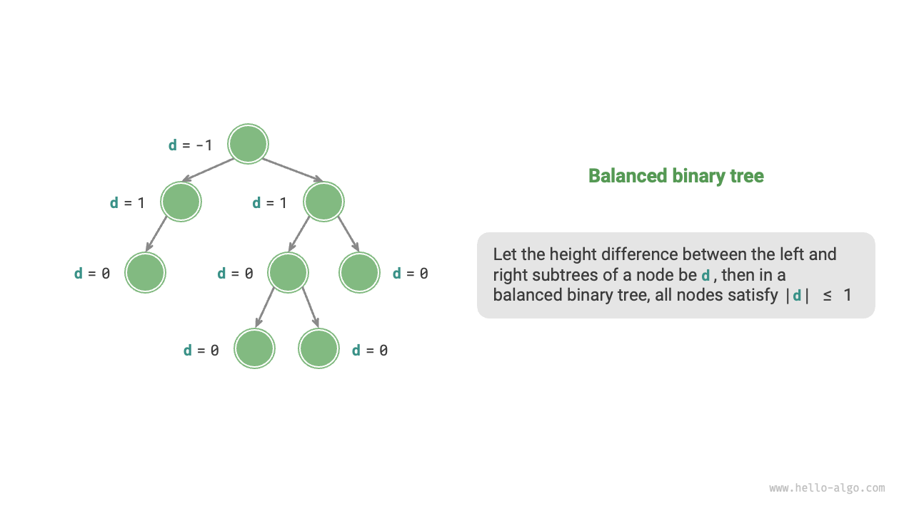
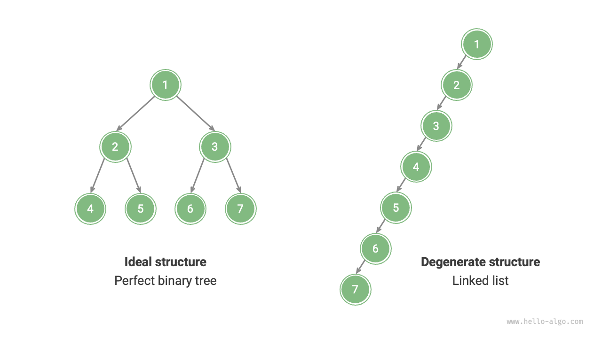

# 二分木

<u>二分木（binary tree）</u>は非線形データ構造の一種であり、「祖先」と「子孫」の派生関係を表し、「一つを二つに分ける」分割統治の考え方を体現しています。連結リストと同様に、二分木の基本単位はノードであり、各ノードは値、左子ノードへの参照、右子ノードへの参照を含みます。

=== "Python"

    ```python title=""
    class TreeNode:
        """二分木ノードクラス"""
        def __init__(self, val: int):
            self.val: int = val                # ノード値
            self.left: TreeNode | None = None  # 左子ノード参照
            self.right: TreeNode | None = None # 右子ノード参照
    ```

=== "C++"

    ```cpp title=""
    /* 二分木ノード構造体 */
    struct TreeNode {
        int val;          // ノード値
        TreeNode *left;   // 左子ノードポインタ
        TreeNode *right;  // 右子ノードポインタ
        TreeNode(int x) : val(x), left(nullptr), right(nullptr) {}
    };
    ```

=== "Java"

    ```java title=""
    /* 二分木ノードクラス */
    class TreeNode {
        int val;         // ノード値
        TreeNode left;   // 左子ノード参照
        TreeNode right;  // 右子ノード参照
        TreeNode(int x) { val = x; }
    }
    ```

=== "C#"

    ```csharp title=""
    /* 二分木ノードクラス */
    class TreeNode(int? x) {
        public int? val = x;    // ノード値
        public TreeNode? left;  // 左子ノード参照
        public TreeNode? right; // 右子ノード参照
    }
    ```

=== "Go"

    ```go title=""
    /* 二分木ノード構造体 */
    type TreeNode struct {
        Val   int
        Left  *TreeNode
        Right *TreeNode
    }
    /* コンストラクタ */
    func NewTreeNode(v int) *TreeNode {
        return &TreeNode{
            Left:  nil, // 左子ノードポインタ
            Right: nil, // 右子ノードポインタ
            Val:   v,   // ノード値
        }
    }
    ```

=== "Swift"

    ```swift title=""
    /* 二分木ノードクラス */
    class TreeNode {
        var val: Int // ノード値
        var left: TreeNode? // 左子ノード参照
        var right: TreeNode? // 右子ノード参照

        init(x: Int) {
            val = x
        }
    }
    ```

=== "JS"

    ```javascript title=""
    /* 二分木ノードクラス */
    class TreeNode {
        val; // ノード値
        left; // 左子ノードポインタ
        right; // 右子ノードポインタ
        constructor(val, left, right) {
            this.val = val === undefined ? 0 : val;
            this.left = left === undefined ? null : left;
            this.right = right === undefined ? null : right;
        }
    }
    ```

=== "TS"

    ```typescript title=""
    /* 二分木ノードクラス */
    class TreeNode {
        val: number;
        left: TreeNode | null;
        right: TreeNode | null;

        constructor(val?: number, left?: TreeNode | null, right?: TreeNode | null) {
            this.val = val === undefined ? 0 : val; // ノード値
            this.left = left === undefined ? null : left; // 左子ノード参照
            this.right = right === undefined ? null : right; // 右子ノード参照
        }
    }
    ```

=== "Dart"

    ```dart title=""
    /* 二分木ノードクラス */
    class TreeNode {
      int val;         // ノード値
      TreeNode? left;  // 左子ノード参照
      TreeNode? right; // 右子ノード参照
      TreeNode(this.val, [this.left, this.right]);
    }
    ```

=== "Rust"

    ```rust title=""
    use std::rc::Rc;
    use std::cell::RefCell;

    /* 二分木ノード構造体 */
    struct TreeNode {
        val: i32,                               // ノード値
        left: Option<Rc<RefCell<TreeNode>>>,    // 左子ノード参照
        right: Option<Rc<RefCell<TreeNode>>>,   // 右子ノード参照
    }

    impl TreeNode {
        /* コンストラクタ */
        fn new(val: i32) -> Rc<RefCell<Self>> {
            Rc::new(RefCell::new(Self {
                val,
                left: None,
                right: None
            }))
        }
    }
    ```

=== "C"

    ```c title=""
    /* 二分木ノード構造体 */
    typedef struct TreeNode {
        int val;                // ノード値
        int height;             // ノードの高さ
        struct TreeNode *left;  // 左子ノードポインタ
        struct TreeNode *right; // 右子ノードポインタ
    } TreeNode;

    /* コンストラクタ */
    TreeNode *newTreeNode(int val) {
        TreeNode *node;

        node = (TreeNode *)malloc(sizeof(TreeNode));
        node->val = val;
        node->height = 0;
        node->left = NULL;
        node->right = NULL;
        return node;
    }
    ```

=== "Kotlin"

    ```kotlin title=""
    /* 二分木ノードクラス */
    class TreeNode(val _val: Int) {  // ノード値
        val left: TreeNode? = null   // 左子ノード参照
        val right: TreeNode? = null  // 右子ノード参照
    }
    ```

=== "Ruby"

    ```ruby title=""
    ### 二分木ノードクラス ###
    class TreeNode
      attr_accessor :val    # ノード値
      attr_accessor :left   # 左子ノード参照
      attr_accessor :right  # 右子ノード参照

      def initialize(val)
        @val = val
      end
    end
    ```

各ノードは 2 つの参照（ポインタ）を持ち、それぞれ<u>左子ノード（left-child node）</u>と<u>右子ノード（right-child node）</u>を指します。このノードはこれら 2 つの子ノードの<u>親ノード（parent node）</u>と呼ばれます。二分木のあるノードが与えられたとき、そのノードの左子ノードとその配下のノードからなる木をそのノードの<u>左部分木（left subtree）</u>と呼び、同様に<u>右部分木（right subtree）</u>が定義されます。

**二分木では、葉ノードを除くすべてのノードが子ノードと空でない部分木を持ちます**。以下の図に示すように、「ノード 2」を親ノードとみなすと、その左子ノードと右子ノードはそれぞれ「ノード 4」と「ノード 5」であり、左部分木は「ノード 4 とその配下のノードからなる木」、右部分木は「ノード 5 とその配下のノードからなる木」です。



## 二分木のよく使われる用語

二分木でよく使われる用語を以下の図に示します。

- <u>根ノード（root node）</u>：二分木の最上位にあるノードで、親ノードを持ちません。
- <u>葉ノード（leaf node）</u>：子ノードを持たないノードで、2 本のポインタはいずれも `None` を指します。
- <u>辺（edge）</u>：2 つのノードを結ぶ線分、すなわちノード参照（ポインタ）です。
- ノードが属する<u>レベル（level）</u>：上から下へ向かって増加し、根ノードのレベルは 1 です。
- ノードの<u>次数（degree）</u>：ノードの子ノードの数。二分木では次数の取り得る値は 0、1、2 です。
- 二分木の<u>高さ（height）</u>：根ノードから最も遠い葉ノードまでに通る辺の数。
- ノードの<u>深さ（depth）</u>：根ノードからそのノードまでに通る辺の数。
- ノードの<u>高さ（height）</u>：そのノードから最も遠い葉ノードまでに通る辺の数。



!!! tip

    なお、通常「高さ」と「深さ」は「通過した辺の数」と定義しますが、問題や教材によっては「通過したノードの数」と定義する場合もあります。その場合、高さと深さはいずれも 1 を加える必要があります。

## 二分木の基本操作

### 二分木を初期化する

連結リストと同様に、まずノードを初期化し、その後で参照（ポインタ）を構築します。

=== "Python"

    ```python title="binary_tree.py"
    # 二分木を初期化する
    # ノードを初期化する
    n1 = TreeNode(val=1)
    n2 = TreeNode(val=2)
    n3 = TreeNode(val=3)
    n4 = TreeNode(val=4)
    n5 = TreeNode(val=5)
    # ノード間の参照（ポインタ）を構築する
    n1.left = n2
    n1.right = n3
    n2.left = n4
    n2.right = n5
    ```

=== "C++"

    ```cpp title="binary_tree.cpp"
    /* 二分木を初期化する */
    // ノードを初期化する
    TreeNode* n1 = new TreeNode(1);
    TreeNode* n2 = new TreeNode(2);
    TreeNode* n3 = new TreeNode(3);
    TreeNode* n4 = new TreeNode(4);
    TreeNode* n5 = new TreeNode(5);
    // ノード間の参照（ポインタ）を構築する
    n1->left = n2;
    n1->right = n3;
    n2->left = n4;
    n2->right = n5;
    ```

=== "Java"

    ```java title="binary_tree.java"
    // ノードを初期化する
    TreeNode n1 = new TreeNode(1);
    TreeNode n2 = new TreeNode(2);
    TreeNode n3 = new TreeNode(3);
    TreeNode n4 = new TreeNode(4);
    TreeNode n5 = new TreeNode(5);
    // ノード間の参照（ポインタ）を構築する
    n1.left = n2;
    n1.right = n3;
    n2.left = n4;
    n2.right = n5;
    ```

=== "C#"

    ```csharp title="binary_tree.cs"
    /* 二分木を初期化する */
    // ノードを初期化する
    TreeNode n1 = new(1);
    TreeNode n2 = new(2);
    TreeNode n3 = new(3);
    TreeNode n4 = new(4);
    TreeNode n5 = new(5);
    // ノード間の参照（ポインタ）を構築する
    n1.left = n2;
    n1.right = n3;
    n2.left = n4;
    n2.right = n5;
    ```

=== "Go"

    ```go title="binary_tree.go"
    /* 二分木を初期化する */
    // ノードを初期化する
    n1 := NewTreeNode(1)
    n2 := NewTreeNode(2)
    n3 := NewTreeNode(3)
    n4 := NewTreeNode(4)
    n5 := NewTreeNode(5)
    // ノード間の参照（ポインタ）を構築する
    n1.Left = n2
    n1.Right = n3
    n2.Left = n4
    n2.Right = n5
    ```

=== "Swift"

    ```swift title="binary_tree.swift"
    // ノードを初期化する
    let n1 = TreeNode(x: 1)
    let n2 = TreeNode(x: 2)
    let n3 = TreeNode(x: 3)
    let n4 = TreeNode(x: 4)
    let n5 = TreeNode(x: 5)
    // ノード間の参照（ポインタ）を構築する
    n1.left = n2
    n1.right = n3
    n2.left = n4
    n2.right = n5
    ```

=== "JS"

    ```javascript title="binary_tree.js"
    /* 二分木を初期化する */
    // ノードを初期化する
    let n1 = new TreeNode(1),
        n2 = new TreeNode(2),
        n3 = new TreeNode(3),
        n4 = new TreeNode(4),
        n5 = new TreeNode(5);
    // ノード間の参照（ポインタ）を構築する
    n1.left = n2;
    n1.right = n3;
    n2.left = n4;
    n2.right = n5;
    ```

=== "TS"

    ```typescript title="binary_tree.ts"
    /* 二分木を初期化する */
    // ノードを初期化する
    let n1 = new TreeNode(1),
        n2 = new TreeNode(2),
        n3 = new TreeNode(3),
        n4 = new TreeNode(4),
        n5 = new TreeNode(5);
    // ノード間の参照（ポインタ）を構築する
    n1.left = n2;
    n1.right = n3;
    n2.left = n4;
    n2.right = n5;
    ```

=== "Dart"

    ```dart title="binary_tree.dart"
    /* 二分木を初期化する */
    // ノードを初期化する
    TreeNode n1 = new TreeNode(1);
    TreeNode n2 = new TreeNode(2);
    TreeNode n3 = new TreeNode(3);
    TreeNode n4 = new TreeNode(4);
    TreeNode n5 = new TreeNode(5);
    // ノード間の参照（ポインタ）を構築する
    n1.left = n2;
    n1.right = n3;
    n2.left = n4;
    n2.right = n5;
    ```

=== "Rust"

    ```rust title="binary_tree.rs"
    // ノードを初期化する
    let n1 = TreeNode::new(1);
    let n2 = TreeNode::new(2);
    let n3 = TreeNode::new(3);
    let n4 = TreeNode::new(4);
    let n5 = TreeNode::new(5);
    // ノード間の参照（ポインタ）を構築する
    n1.borrow_mut().left = Some(n2.clone());
    n1.borrow_mut().right = Some(n3);
    n2.borrow_mut().left = Some(n4);
    n2.borrow_mut().right = Some(n5);
    ```

=== "C"

    ```c title="binary_tree.c"
    /* 二分木を初期化する */
    // ノードを初期化する
    TreeNode *n1 = newTreeNode(1);
    TreeNode *n2 = newTreeNode(2);
    TreeNode *n3 = newTreeNode(3);
    TreeNode *n4 = newTreeNode(4);
    TreeNode *n5 = newTreeNode(5);
    // ノード間の参照（ポインタ）を構築する
    n1->left = n2;
    n1->right = n3;
    n2->left = n4;
    n2->right = n5;
    ```

=== "Kotlin"

    ```kotlin title="binary_tree.kt"
    // ノードを初期化する
    val n1 = TreeNode(1)
    val n2 = TreeNode(2)
    val n3 = TreeNode(3)
    val n4 = TreeNode(4)
    val n5 = TreeNode(5)
    // ノード間の参照（ポインタ）を構築する
    n1.left = n2
    n1.right = n3
    n2.left = n4
    n2.right = n5
    ```

=== "Ruby"

    ```ruby title="binary_tree.rb"
    # 二分木を初期化する
    # ノードを初期化する
    n1 = TreeNode.new(1)
    n2 = TreeNode.new(2)
    n3 = TreeNode.new(3)
    n4 = TreeNode.new(4)
    n5 = TreeNode.new(5)
    # ノード間の参照（ポインタ）を構築する
    n1.left = n2
    n1.right = n3
    n2.left = n4
    n2.right = n5
    ```

??? pythontutor "実行の可視化"

    https://pythontutor.com/render.html#code=class%20TreeNode%3A%0A%20%20%20%20%22%22%22%E4%BA%8C%E5%8F%89%E6%A0%91%E8%8A%82%E7%82%B9%E7%B1%BB%22%22%22%0A%20%20%20%20def%20__init__%28self,%20val%3A%20int%29%3A%0A%20%20%20%20%20%20%20%20self.val%3A%20int%20%3D%20val%20%20%20%20%20%20%20%20%20%20%20%20%20%20%20%20%23%20%E8%8A%82%E7%82%B9%E5%80%BC%0A%20%20%20%20%20%20%20%20self.left%3A%20TreeNode%20%7C%20None%20%3D%20None%20%20%23%20%E5%B7%A6%E5%AD%90%E8%8A%82%E7%82%B9%E5%BC%95%E7%94%A8%0A%20%20%20%20%20%20%20%20self.right%3A%20TreeNode%20%7C%20None%20%3D%20None%20%23%20%E5%8F%B3%E5%AD%90%E8%8A%82%E7%82%B9%E5%BC%95%E7%94%A8%0A%0A%22%22%22Driver%20Code%22%22%22%0Aif%20__name__%20%3D%3D%20%22__main__%22%3A%0A%20%20%20%20%23%20%E5%88%9D%E5%A7%8B%E5%8C%96%E4%BA%8C%E5%8F%89%E6%A0%91%0A%20%20%20%20%23%20%E5%88%9D%E5%A7%8B%E5%8C%96%E8%8A%82%E7%82%B9%0A%20%20%20%20n1%20%3D%20TreeNode%28val%3D1%29%0A%20%20%20%20n2%20%3D%20TreeNode%28val%3D2%29%0A%20%20%20%20n3%20%3D%20TreeNode%28val%3D3%29%0A%20%20%20%20n4%20%3D%20TreeNode%28val%3D4%29%0A%20%20%20%20n5%20%3D%20TreeNode%28val%3D5%29%0A%20%20%20%20%23%20%E6%9E%84%E5%BB%BA%E8%8A%82%E7%82%B9%E4%B9%8B%E9%97%B4%E7%9A%84%E5%BC%95%E7%94%A8%EF%BC%88%E6%8C%87%E9%92%88%EF%BC%89%0A%20%20%20%20n1.left%20%3D%20n2%0A%20%20%20%20n1.right%20%3D%20n3%0A%20%20%20%20n2.left%20%3D%20n4%0A%20%20%20%20n2.right%20%3D%20n5&cumulative=false&curInstr=3&heapPrimitives=nevernest&mode=display&origin=opt-frontend.js&py=311&rawInputLstJSON=%5B%5D&textReferences=false

### ノードの挿入と削除

連結リストと同様に、二分木でのノードの挿入と削除はポインタを変更することで実現できます。以下の図に 1 つの例を示します。



=== "Python"

    ```python title="binary_tree.py"
    # ノードの挿入と削除
    p = TreeNode(0)
    # n1 -> n2 の間にノード P を挿入する
    n1.left = p
    p.left = n2
    # ノード P を削除する
    n1.left = n2
    ```

=== "C++"

    ```cpp title="binary_tree.cpp"
    /* ノードの挿入と削除 */
    TreeNode* P = new TreeNode(0);
    // n1 -> n2 の間にノード P を挿入する
    n1->left = P;
    P->left = n2;
    // ノード P を削除する
    n1->left = n2;
    // メモリを解放する
    delete P;
    ```

=== "Java"

    ```java title="binary_tree.java"
    TreeNode P = new TreeNode(0);
    // n1 -> n2 の間にノード P を挿入する
    n1.left = P;
    P.left = n2;
    // ノード P を削除する
    n1.left = n2;
    ```

=== "C#"

    ```csharp title="binary_tree.cs"
    /* ノードの挿入と削除 */
    TreeNode P = new(0);
    // n1 -> n2 の間にノード P を挿入する
    n1.left = P;
    P.left = n2;
    // ノード P を削除する
    n1.left = n2;
    ```

=== "Go"

    ```go title="binary_tree.go"
    /* ノードの挿入と削除 */
    // n1 -> n2 の間にノード P を挿入する
    p := NewTreeNode(0)
    n1.Left = p
    p.Left = n2
    // ノード P を削除する
    n1.Left = n2
    ```

=== "Swift"

    ```swift title="binary_tree.swift"
    let P = TreeNode(x: 0)
    // n1 -> n2 の間にノード P を挿入する
    n1.left = P
    P.left = n2
    // ノード P を削除する
    n1.left = n2
    ```

=== "JS"

    ```javascript title="binary_tree.js"
    /* ノードの挿入と削除 */
    let P = new TreeNode(0);
    // n1 -> n2 の間にノード P を挿入する
    n1.left = P;
    P.left = n2;
    // ノード P を削除する
    n1.left = n2;
    ```

=== "TS"

    ```typescript title="binary_tree.ts"
    /* ノードの挿入と削除 */
    const P = new TreeNode(0);
    // n1 -> n2 の間にノード P を挿入する
    n1.left = P;
    P.left = n2;
    // ノード P を削除する
    n1.left = n2;
    ```

=== "Dart"

    ```dart title="binary_tree.dart"
    /* ノードの挿入と削除 */
    TreeNode P = new TreeNode(0);
    // n1 -> n2 の間にノード P を挿入する
    n1.left = P;
    P.left = n2;
    // ノード P を削除する
    n1.left = n2;
    ```

=== "Rust"

    ```rust title="binary_tree.rs"
    let p = TreeNode::new(0);
    // n1 -> n2 の間にノード P を挿入する
    n1.borrow_mut().left = Some(p.clone());
    p.borrow_mut().left = Some(n2.clone());
    // ノード p を削除する
    n1.borrow_mut().left = Some(n2);
    ```

=== "C"

    ```c title="binary_tree.c"
    /* ノードの挿入と削除 */
    TreeNode *P = newTreeNode(0);
    // n1 -> n2 の間にノード P を挿入する
    n1->left = P;
    P->left = n2;
    // ノード P を削除する
    n1->left = n2;
    // メモリを解放する
    free(P);
    ```

=== "Kotlin"

    ```kotlin title="binary_tree.kt"
    val P = TreeNode(0)
    // n1 -> n2 の間にノード P を挿入する
    n1.left = P
    P.left = n2
    // ノード P を削除する
    n1.left = n2
    ```

=== "Ruby"

    ```ruby title="binary_tree.rb"
    # ノードの挿入と削除
    _p = TreeNode.new(0)
    # n1 -> n2 の間にノード _p を挿入する
    n1.left = _p
    _p.left = n2
    # ノードを削除する
    n1.left = n2
    ```

??? pythontutor "実行の可視化"

    https://pythontutor.com/render.html#code=class%20TreeNode%3A%0A%20%20%20%20%22%22%22%E4%BA%8C%E5%8F%89%E6%A0%91%E8%8A%82%E7%82%B9%E7%B1%BB%22%22%22%0A%20%20%20%20def%20__init__%28self,%20val%3A%20int%29%3A%0A%20%20%20%20%20%20%20%20self.val%3A%20int%20%3D%20val%20%20%20%20%20%20%20%20%20%20%20%20%20%20%20%20%23%20%E8%8A%82%E7%82%B9%E5%80%BC%0A%20%20%20%20%20%20%20%20self.left%3A%20TreeNode%20%7C%20None%20%3D%20None%20%20%23%20%E5%B7%A6%E5%AD%90%E8%8A%82%E7%82%B9%E5%BC%95%E7%94%A8%0A%20%20%20%20%20%20%20%20self.right%3A%20TreeNode%20%7C%20None%20%3D%20None%20%23%20%E5%8F%B3%E5%AD%90%E8%8A%82%E7%82%B9%E5%BC%95%E7%94%A8%0A%0A%22%22%22Driver%20Code%22%22%22%0Aif%20__name__%20%3D%3D%20%22__main__%22%3A%0A%20%20%20%20%23%20%E5%88%9D%E5%A7%8B%E5%8C%96%E4%BA%8C%E5%8F%89%E6%A0%91%0A%20%20%20%20%23%20%E5%88%9D%E5%A7%8B%E5%8C%96%E8%8A%82%E7%82%B9%0A%20%20%20%20n1%20%3D%20TreeNode%28val%3D1%29%0A%20%20%20%20n2%20%3D%20TreeNode%28val%3D2%29%0A%20%20%20%20n3%20%3D%20TreeNode%28val%3D3%29%0A%20%20%20%20n4%20%3D%20TreeNode%28val%3D4%29%0A%20%20%20%20n5%20%3D%20TreeNode%28val%3D5%29%0A%20%20%20%20%23%20%E6%9E%84%E5%BB%BA%E8%8A%82%E7%82%B9%E4%B9%8B%E9%97%B4%E7%9A%84%E5%BC%95%E7%94%A8%EF%BC%88%E6%8C%87%E9%92%88%EF%BC%89%0A%20%20%20%20n1.left%20%3D%20n2%0A%20%20%20%20n1.right%20%3D%20n3%0A%20%20%20%20n2.left%20%3D%20n4%0A%20%20%20%20n2.right%20%3D%20n5%0A%0A%20%20%20%20%23%20%E6%8F%92%E5%85%A5%E4%B8%8E%E5%88%A0%E9%99%A4%E8%8A%82%E7%82%B9%0A%20%20%20%20p%20%3D%20TreeNode%280%29%0A%20%20%20%20%23%20%E5%9C%A8%20n1%20-%3E%20n2%20%E4%B8%AD%E9%97%B4%E6%8F%92%E5%85%A5%E8%8A%82%E7%82%B9%20P%0A%20%20%20%20n1.left%20%3D%20p%0A%20%20%20%20p.left%20%3D%20n2%0A%20%20%20%20%23%20%E5%88%A0%E9%99%A4%E8%8A%82%E7%82%B9%20P%0A%20%20%20%20n1.left%20%3D%20n2&cumulative=false&curInstr=37&heapPrimitives=nevernest&mode=display&origin=opt-frontend.js&py=311&rawInputLstJSON=%5B%5D&textReferences=false

!!! tip

    注意すべき点として、ノードの挿入は二分木の元の論理構造を変える可能性があり、ノードの削除は通常、そのノードと配下のすべての部分木の削除を意味します。そのため、二分木における挿入と削除は、実際に意味のある操作を実現するために、通常は一連の操作を組み合わせて行います。

## 一般的な二分木の種類

### 充足二分木

以下の図に示すように、<u>充足二分木（perfect binary tree）</u>ではすべてのレベルのノードが完全に埋まっています。充足二分木では、葉ノードの次数は $0$ で、それ以外のすべてのノードの次数は $2$ です。木の高さを $h$ とすると、ノード総数は $2^{h+1} - 1$ となり、標準的な指数関係を示して、自然界でよく見られる細胞分裂の現象を反映しています。

!!! tip

    なお、中国語圏では充足二分木は<u>満二分木</u>と呼ばれることもあります。



### 完全二分木

以下の図に示すように、<u>完全二分木（complete binary tree）</u>では最下層のノードだけが完全に埋まっていなくてもよく、しかも最下層のノードは左から右へ連続して詰められていなければなりません。なお、充足二分木も完全二分木の一種です。



### 充満二分木

以下の図に示すように、<u>充満二分木（full binary tree）</u>では、葉ノードを除くすべてのノードが 2 つの子ノードを持ちます。



### 平衡二分木

以下の図に示すように、<u>平衡二分木（balanced binary tree）</u>では、任意のノードについて左部分木と右部分木の高さの差の絶対値が 1 を超えません。



## 二分木の退化

以下の図は、二分木の理想的な構造と退化した構造を示しています。二分木の各レベルのノードがすべて埋まっていると「充足二分木」となり、すべてのノードが片側に偏ると二分木は「連結リスト」へ退化します。

- 充足二分木は理想的なケースであり、二分木の「分割統治」の利点を十分に発揮できます。
- 連結リストはその対極にあり、各種操作はすべて線形操作となり、時間計算量は $O(n)$ まで退化します。



以下の表に示すように、最良構造と最悪構造では、二分木の葉ノード数、ノード総数、高さなどが極大または極小になります。

<p align="center"> 表 <id> &nbsp; 二分木の最良構造と最悪構造 </p>

|                             | 充足二分木         | 連結リスト    |
| --------------------------- | ------------------ | ------- |
| 第 $i$ レベルのノード数     | $2^{i-1}$          | $1$     |
| 高さ $h$ の木の葉ノード数   | $2^h$              | $1$     |
| 高さ $h$ の木のノード総数   | $2^{h+1} - 1$      | $h + 1$ |
| ノード総数 $n$ の木の高さ   | $\log_2 (n+1) - 1$ | $n - 1$ |
