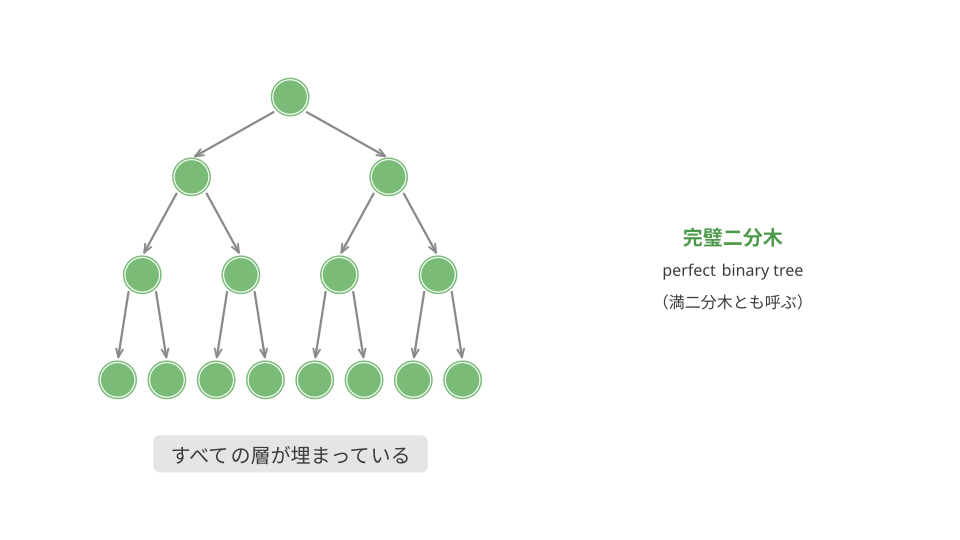

# 7.1 &nbsp; 二分木

<u>二分木（binary tree）</u>は、「祖先」と「子孫」の派生関係を表す非線形のデータ構造です。一つを二つに分ける分割統治の考え方を反映しています。連結リストと同様に、二分木の基本単位はノードです。各ノードは、値と、左右それぞれの子への参照を持ちます。

=== "Python"

    ```python title=""
    class TreeNode:
        """二分木のノードのクラス"""
        def __init__(self, val: int):
            self.val: int = val                # ノードの値
            self.left: TreeNode | None = None  # 左の子への参照
            self.right: TreeNode | None = None # 右の子への参照
    ```

=== "C++"

    ```cpp title=""
    /* 二分木のノードの構造体 */
    struct TreeNode {
        int val;          // ノードの値
        TreeNode *left;   // 左の子へのポインタ
        TreeNode *right;  // 右の子へのポインタ
        TreeNode(int x) : val(x), left(nullptr), right(nullptr) {}
    };
    ```

=== "Java"

    ```java title=""
    /* 二分木のノードのクラス */
    class TreeNode {
        int val;         // ノードの値
        TreeNode left;   // 左の子への参照
        TreeNode right;  // 右の子への参照
        TreeNode(int x) { val = x; }
    }
    ```

=== "C#"

    ```csharp title=""
    /* 二分木のノードのクラス */
    class TreeNode(int? x) {
        public int? val = x;    // ノードの値
        public TreeNode? left;  // 左の子への参照
        public TreeNode? right; // 右の子への参照
    }
    ```

=== "Go"

    ```go title=""
    /* 二分木のノードの構造体 */
    type TreeNode struct {
        Val   int
        Left  *TreeNode
        Right *TreeNode
    }
    /* コンストラクタ */
    func NewTreeNode(v int) *TreeNode {
        return &TreeNode{
            Left:  nil, // 左の子へのポインタ
            Right: nil, // 右の子へのポインタ
            Val:   v,   // ノードの値
        }
    }
    ```

=== "Swift"

    ```swift title=""
    /* 二分木のノードのクラス */
    class TreeNode {
        var val: Int // ノードの値
        var left: TreeNode? // 左の子への参照
        var right: TreeNode? // 右の子への参照

        init(x: Int) {
            val = x
        }
    }
    ```

=== "JS"

    ```javascript title=""
    /* 二分木のノードのクラス */
    class TreeNode {
        val; // ノードの値
        left; // 左の子へのポインタ
        right; // 右の子へのポインタ
        constructor(val, left, right) {
            this.val = val === undefined ? 0 : val;
            this.left = left === undefined ? null : left;
            this.right = right === undefined ? null : right;
        }
    }
    ```

=== "TS"

    ```typescript title=""
    /* 二分木のノードのクラス */
    class TreeNode {
        val: number;
        left: TreeNode | null;
        right: TreeNode | null;

        constructor(val?: number, left?: TreeNode | null, right?: TreeNode | null) {
            this.val = val === undefined ? 0 : val; // ノードの値
            this.left = left === undefined ? null : left; // 左の子への参照
            this.right = right === undefined ? null : right; // 右の子への参照
        }
    }
    ```

=== "Dart"

    ```dart title=""
    /* 二分木のノードのクラス */
    class TreeNode {
      int val;         // ノードの値
      TreeNode? left;  // 左の子への参照
      TreeNode? right; // 右の子への参照
      TreeNode(this.val, [this.left, this.right]);
    }
    ```

=== "Rust"

    ```rust title=""
    use std::rc::Rc;
    use std::cell::RefCell;

    /* 二分木のノードの構造体 */
    struct TreeNode {
        val: i32,                               // ノードの値
        left: Option<Rc<RefCell<TreeNode>>>,    // 左の子への参照
        right: Option<Rc<RefCell<TreeNode>>>,   // 右の子への参照
    }

    impl TreeNode {
        /* コンストラクタ */
        fn new(val: i32) -> Rc<RefCell<Self>> {
            Rc::new(RefCell::new(Self {
                val,
                left: None,
                right: None
            }))
        }
    }
    ```

=== "C"

    ```c title=""
    /* 二分木のノードの構造体 */
    typedef struct TreeNode {
        int val;                // ノードの値
        struct TreeNode *left;  // 左の子へのポインタ
        struct TreeNode *right; // 右の子へのポインタ
    } TreeNode;

    /* コンストラクタ */
    TreeNode *newTreeNode(int val) {
        TreeNode *node;

        node = (TreeNode *)malloc(sizeof(TreeNode));
        node->val = val;
        node->left = NULL;
        node->right = NULL;
        return node;
    }
    ```

=== "Kotlin"

    ```kotlin title=""
    /* 二分木のノードのクラス */
    class TreeNode(val _val: Int) {  // ノードの値
        var left: TreeNode? = null   // 左の子への参照
        var right: TreeNode? = null  // 右の子への参照
    }
    ```

=== "Ruby"

    ```ruby title=""
    ### 二分木のノードのクラス ###
    class TreeNode
      attr_accessor :val    # ノードの値
      attr_accessor :left   # 左の子への参照
      attr_accessor :right  # 右の子への参照

      def initialize(val)
        @val = val
      end
    end
    ```

各ノードには 2 つの参照（ポインタ）があり、それぞれ<u>左の子（left-child node）</u>と<u>右の子（right-child node）</u>を指します。このノードは、これらの子の<u>親ノード（parent node）</u>と呼ばれます。あるノードの左の子とその下のすべてのノードからなる木を、そのノードの<u>左部分木（left subtree）</u>と呼びます。<u>右部分木（right subtree）</u>も同様です。

**二分木では、葉以外のすべてのノードが子を持ち、空でない部分木を持ちます**。図 7-1 のノード 2 を親とすると、左の子はノード 4、右の子はノード 5 です。左部分木は 4 とその下のすべてのノードからなる木、右部分木は 5 とその下のすべてのノードからなる木です。

{ class="animation-figure" }

<p align="center"> 図 7-1 &nbsp; 親ノード、子ノード、部分木 </p>

## 7.1.1 &nbsp; 二分木の用語

二分木でよく使う用語を図 7-2 に示します。

- <u>根ノード（root node）</u>は二分木の最上層にあるノードで、親を持ちません。
- <u>葉ノード（leaf node）</u>は子を持たないノードで、2 つのポインタはいずれも `None` を指します。
- <u>辺（edge）</u>は 2 つのノードを結ぶ線で、ノードへの参照（ポインタ）に対応します。
- ノードの<u>レベル（level）</u>は、根を 1 として下へ進むごとに増えます。
- ノードの<u>次数（degree）</u>は、そのノードが持つ子の数です。二分木で取り得る値は 0、1、2 です。
- 二分木の<u>高さ（height）</u>は、根から最も遠い葉までの経路に含まれる辺の本数です。
- ノードの<u>深さ（depth）</u>は、根からそのノードまでの経路に含まれる辺の本数です。
- ノードの<u>高さ（height）</u>は、そのノードから最も遠い葉までの経路に含まれる辺の本数です。

{ class="animation-figure" }

<p align="center"> 図 7-2 &nbsp; 二分木でよく使う用語 </p>

!!! tip "ヒント"

    通常、高さと深さは経路に含まれる辺の本数で定義しますが、問題や教科書によっては経路上のノードの個数で定義することもあります。その場合、高さと深さはここでの定義よりそれぞれ 1 大きくなります。

## 7.1.2 &nbsp; 二分木の基本操作

### 1. &nbsp; 二分木の初期化

連結リストと同様に、まずノードを初期化し、次に参照（ポインタ）を設定します。

=== "Python"

    ```python title="binary_tree.py"
    # 二分木を初期化する
    # ノードを初期化する
    n1 = TreeNode(val=1)
    n2 = TreeNode(val=2)
    n3 = TreeNode(val=3)
    n4 = TreeNode(val=4)
    n5 = TreeNode(val=5)
    # ノード間の参照（ポインタ）を設定する
    n1.left = n2
    n1.right = n3
    n2.left = n4
    n2.right = n5
    ```

=== "C++"

    ```cpp title="binary_tree.cpp"
    /* 二分木を初期化する */
    // ノードを初期化する
    TreeNode *n1 = new TreeNode(1);
    TreeNode *n2 = new TreeNode(2);
    TreeNode *n3 = new TreeNode(3);
    TreeNode *n4 = new TreeNode(4);
    TreeNode *n5 = new TreeNode(5);
    // ノード間の参照（ポインタ）を設定する
    n1->left = n2;
    n1->right = n3;
    n2->left = n4;
    n2->right = n5;
    ```

=== "Java"

    ```java title="binary_tree.java"
    /* 二分木を初期化する */
    // ノードを初期化する
    TreeNode n1 = new TreeNode(1);
    TreeNode n2 = new TreeNode(2);
    TreeNode n3 = new TreeNode(3);
    TreeNode n4 = new TreeNode(4);
    TreeNode n5 = new TreeNode(5);
    // ノード間の参照（ポインタ）を設定する
    n1.left = n2;
    n1.right = n3;
    n2.left = n4;
    n2.right = n5;
    ```

=== "C#"

    ```csharp title="binary_tree.cs"
    /* 二分木を初期化する */
    // ノードを初期化する
    TreeNode n1 = new(1);
    TreeNode n2 = new(2);
    TreeNode n3 = new(3);
    TreeNode n4 = new(4);
    TreeNode n5 = new(5);
    // ノード間の参照（ポインタ）を設定する
    n1.left = n2;
    n1.right = n3;
    n2.left = n4;
    n2.right = n5;
    ```

=== "Go"

    ```go title="binary_tree.go"
    /* 二分木を初期化する */
    // ノードを初期化する
    n1 := NewTreeNode(1)
    n2 := NewTreeNode(2)
    n3 := NewTreeNode(3)
    n4 := NewTreeNode(4)
    n5 := NewTreeNode(5)
    // ノード間の参照（ポインタ）を設定する
    n1.Left = n2
    n1.Right = n3
    n2.Left = n4
    n2.Right = n5
    ```

=== "Swift"

    ```swift title="binary_tree.swift"
    /* 二分木を初期化する */
    // ノードを初期化する
    let n1 = TreeNode(x: 1)
    let n2 = TreeNode(x: 2)
    let n3 = TreeNode(x: 3)
    let n4 = TreeNode(x: 4)
    let n5 = TreeNode(x: 5)
    // ノード間の参照（ポインタ）を設定する
    n1.left = n2
    n1.right = n3
    n2.left = n4
    n2.right = n5
    ```

=== "JS"

    ```javascript title="binary_tree.js"
    /* 二分木を初期化する */
    // ノードを初期化する
    let n1 = new TreeNode(1),
        n2 = new TreeNode(2),
        n3 = new TreeNode(3),
        n4 = new TreeNode(4),
        n5 = new TreeNode(5);
    // ノード間の参照（ポインタ）を設定する
    n1.left = n2;
    n1.right = n3;
    n2.left = n4;
    n2.right = n5;
    ```

=== "TS"

    ```typescript title="binary_tree.ts"
    /* 二分木を初期化する */
    // ノードを初期化する
    let n1 = new TreeNode(1),
        n2 = new TreeNode(2),
        n3 = new TreeNode(3),
        n4 = new TreeNode(4),
        n5 = new TreeNode(5);
    // ノード間の参照（ポインタ）を設定する
    n1.left = n2;
    n1.right = n3;
    n2.left = n4;
    n2.right = n5;
    ```

=== "Dart"

    ```dart title="binary_tree.dart"
    /* 二分木を初期化する */
    // ノードを初期化する
    TreeNode n1 = TreeNode(1);
    TreeNode n2 = TreeNode(2);
    TreeNode n3 = TreeNode(3);
    TreeNode n4 = TreeNode(4);
    TreeNode n5 = TreeNode(5);
    // ノード間の参照（ポインタ）を設定する
    n1.left = n2;
    n1.right = n3;
    n2.left = n4;
    n2.right = n5;
    ```

=== "Rust"

    ```rust title="binary_tree.rs"
    /* 二分木を初期化する */
    // ノードを初期化する
    let n1 = TreeNode::new(1);
    let n2 = TreeNode::new(2);
    let n3 = TreeNode::new(3);
    let n4 = TreeNode::new(4);
    let n5 = TreeNode::new(5);
    // ノード間の参照（ポインタ）を設定する
    n1.borrow_mut().left = Some(Rc::clone(&n2));
    n1.borrow_mut().right = Some(Rc::clone(&n3));
    n2.borrow_mut().left = Some(Rc::clone(&n4));
    n2.borrow_mut().right = Some(Rc::clone(&n5));
    ```

=== "C"

    ```c title="binary_tree.c"
    /* 二分木を初期化する */
    // ノードを初期化する
    TreeNode *n1 = newTreeNode(1);
    TreeNode *n2 = newTreeNode(2);
    TreeNode *n3 = newTreeNode(3);
    TreeNode *n4 = newTreeNode(4);
    TreeNode *n5 = newTreeNode(5);
    // ノード間の参照（ポインタ）を設定する
    n1->left = n2;
    n1->right = n3;
    n2->left = n4;
    n2->right = n5;
    ```

=== "Kotlin"

    ```kotlin title="binary_tree.kt"
    /* 二分木を初期化する */
    // ノードを初期化する
    val n1 = TreeNode(1)
    val n2 = TreeNode(2)
    val n3 = TreeNode(3)
    val n4 = TreeNode(4)
    val n5 = TreeNode(5)
    // ノード間の参照（ポインタ）を設定する
    n1.left = n2
    n1.right = n3
    n2.left = n4
    n2.right = n5
    ```

=== "Ruby"

    ```ruby title="binary_tree.rb"
    # 二分木を初期化する
    # ノードを初期化する
    n1 = TreeNode.new(1)
    n2 = TreeNode.new(2)
    n3 = TreeNode.new(3)
    n4 = TreeNode.new(4)
    n5 = TreeNode.new(5)
    # ノード間の参照（ポインタ）を設定する
    n1.left = n2
    n1.right = n3
    n2.left = n4
    n2.right = n5
    ```

??? pythontutor "実行の様子を見る"

    <div style="height: 549px; width: 100%;"><iframe class="pythontutor-iframe" title="実行の様子を見る" src="https://pythontutor.com/iframe-embed.html#code=class%20TreeNode%3A%0A%20%20%20%20%22%22%22%E4%BA%8C%E5%88%86%E6%9C%A8%E3%81%AE%E3%83%8E%E3%83%BC%E3%83%89%E3%82%92%E8%A1%A8%E3%81%99%E3%82%AF%E3%83%A9%E3%82%B9%22%22%22%0A%20%20%20%20def%20__init__%28self,%20val%3A%20int%29%3A%0A%20%20%20%20%20%20%20%20self.val%3A%20int%20%3D%20val%20%20%20%20%20%20%20%20%20%20%20%20%20%20%20%20%23%20%E3%83%8E%E3%83%BC%E3%83%89%E3%81%AE%E5%80%A4%0A%20%20%20%20%20%20%20%20self.left%3A%20TreeNode%20%7C%20None%20%3D%20None%20%20%23%20%E5%B7%A6%E3%81%AE%E5%AD%90%E3%83%8E%E3%83%BC%E3%83%89%E3%81%B8%E3%81%AE%E5%8F%82%E7%85%A7%0A%20%20%20%20%20%20%20%20self.right%3A%20TreeNode%20%7C%20None%20%3D%20None%20%23%20%E5%8F%B3%E3%81%AE%E5%AD%90%E3%83%8E%E3%83%BC%E3%83%89%E3%81%B8%E3%81%AE%E5%8F%82%E7%85%A7%0A%0A%22%22%22Driver%20Code%22%22%22%0Aif%20__name__%20%3D%3D%20%22__main__%22%3A%0A%20%20%20%20%23%20%E4%BA%8C%E5%88%86%E6%9C%A8%E3%82%92%E5%88%9D%E6%9C%9F%E5%8C%96%0A%20%20%20%20%23%20%E3%83%8E%E3%83%BC%E3%83%89%E3%82%92%E5%88%9D%E6%9C%9F%E5%8C%96%0A%20%20%20%20n1%20%3D%20TreeNode%28val%3D1%29%0A%20%20%20%20n2%20%3D%20TreeNode%28val%3D2%29%0A%20%20%20%20n3%20%3D%20TreeNode%28val%3D3%29%0A%20%20%20%20n4%20%3D%20TreeNode%28val%3D4%29%0A%20%20%20%20n5%20%3D%20TreeNode%28val%3D5%29%0A%20%20%20%20%23%20%E5%8F%82%E7%85%A7%EF%BC%88%E3%83%9D%E3%82%A4%E3%83%B3%E3%82%BF%EF%BC%89%E3%81%A7%E3%83%8E%E3%83%BC%E3%83%89%E3%82%92%E3%81%A4%E3%81%AA%E3%81%90%0A%20%20%20%20n1.left%20%3D%20n2%0A%20%20%20%20n1.right%20%3D%20n3%0A%20%20%20%20n2.left%20%3D%20n4%0A%20%20%20%20n2.right%20%3D%20n5&codeDivHeight=472&codeDivWidth=350&cumulative=false&curInstr=3&heapPrimitives=nevernest&origin=opt-frontend.js&py=311&rawInputLstJSON=%5B%5D&textReferences=false"> </iframe></div>
    <div style="margin-top: 5px;"><a href="https://pythontutor.com/iframe-embed.html#code=class%20TreeNode%3A%0A%20%20%20%20%22%22%22%E4%BA%8C%E5%88%86%E6%9C%A8%E3%81%AE%E3%83%8E%E3%83%BC%E3%83%89%E3%82%92%E8%A1%A8%E3%81%99%E3%82%AF%E3%83%A9%E3%82%B9%22%22%22%0A%20%20%20%20def%20__init__%28self,%20val%3A%20int%29%3A%0A%20%20%20%20%20%20%20%20self.val%3A%20int%20%3D%20val%20%20%20%20%20%20%20%20%20%20%20%20%20%20%20%20%23%20%E3%83%8E%E3%83%BC%E3%83%89%E3%81%AE%E5%80%A4%0A%20%20%20%20%20%20%20%20self.left%3A%20TreeNode%20%7C%20None%20%3D%20None%20%20%23%20%E5%B7%A6%E3%81%AE%E5%AD%90%E3%83%8E%E3%83%BC%E3%83%89%E3%81%B8%E3%81%AE%E5%8F%82%E7%85%A7%0A%20%20%20%20%20%20%20%20self.right%3A%20TreeNode%20%7C%20None%20%3D%20None%20%23%20%E5%8F%B3%E3%81%AE%E5%AD%90%E3%83%8E%E3%83%BC%E3%83%89%E3%81%B8%E3%81%AE%E5%8F%82%E7%85%A7%0A%0A%22%22%22Driver%20Code%22%22%22%0Aif%20__name__%20%3D%3D%20%22__main__%22%3A%0A%20%20%20%20%23%20%E4%BA%8C%E5%88%86%E6%9C%A8%E3%82%92%E5%88%9D%E6%9C%9F%E5%8C%96%0A%20%20%20%20%23%20%E3%83%8E%E3%83%BC%E3%83%89%E3%82%92%E5%88%9D%E6%9C%9F%E5%8C%96%0A%20%20%20%20n1%20%3D%20TreeNode%28val%3D1%29%0A%20%20%20%20n2%20%3D%20TreeNode%28val%3D2%29%0A%20%20%20%20n3%20%3D%20TreeNode%28val%3D3%29%0A%20%20%20%20n4%20%3D%20TreeNode%28val%3D4%29%0A%20%20%20%20n5%20%3D%20TreeNode%28val%3D5%29%0A%20%20%20%20%23%20%E5%8F%82%E7%85%A7%EF%BC%88%E3%83%9D%E3%82%A4%E3%83%B3%E3%82%BF%EF%BC%89%E3%81%A7%E3%83%8E%E3%83%BC%E3%83%89%E3%82%92%E3%81%A4%E3%81%AA%E3%81%90%0A%20%20%20%20n1.left%20%3D%20n2%0A%20%20%20%20n1.right%20%3D%20n3%0A%20%20%20%20n2.left%20%3D%20n4%0A%20%20%20%20n2.right%20%3D%20n5&codeDivHeight=800&codeDivWidth=600&cumulative=false&curInstr=3&heapPrimitives=nevernest&origin=opt-frontend.js&py=311&rawInputLstJSON=%5B%5D&textReferences=false" target="_blank" rel="noopener noreferrer">全画面で表示 ></a></div>

### 2. &nbsp; ノードの挿入と削除

連結リストと同様に、二分木でもポインタをつなぎ替えてノードを挿入・削除できます。図 7-3 に例を示します。

{ class="animation-figure" }

<p align="center"> 図 7-3 &nbsp; 二分木へのノードの挿入と削除 </p>

=== "Python"

    ```python title="binary_tree.py"
    # ノードの挿入と削除
    P = TreeNode(0)
    # n1 -> n2 の間にノード P を挿入する
    n1.left = P
    P.left = n2
    # ノード P を削除する
    n1.left = n2
    ```

=== "C++"

    ```cpp title="binary_tree.cpp"
    /* ノードの挿入と削除 */
    TreeNode *P = new TreeNode(0);
    // n1 -> n2 の間にノード P を挿入する
    n1->left = P;
    P->left = n2;
    // ノード P を削除する
    n1->left = n2;
    delete P; // メモリを解放する
    ```

=== "Java"

    ```java title="binary_tree.java"
    /* ノードの挿入と削除 */
    TreeNode P = new TreeNode(0);
    // n1 -> n2 の間にノード P を挿入する
    n1.left = P;
    P.left = n2;
    // ノード P を削除する
    n1.left = n2;
    ```

=== "C#"

    ```csharp title="binary_tree.cs"
    /* ノードの挿入と削除 */
    TreeNode P = new(0);
    // n1 -> n2 の間にノード P を挿入する
    n1.left = P;
    P.left = n2;
    // ノード P を削除する
    n1.left = n2;
    ```

=== "Go"

    ```go title="binary_tree.go"
    /* ノードの挿入と削除 */
    // n1 -> n2 の間にノード P を挿入する
    p := NewTreeNode(0)
    n1.Left = p
    p.Left = n2
    // ノード P を削除する
    n1.Left = n2
    ```

=== "Swift"

    ```swift title="binary_tree.swift"
    /* ノードの挿入と削除 */
    let P = TreeNode(x: 0)
    // n1 -> n2 の間にノード P を挿入する
    n1.left = P
    P.left = n2
    // ノード P を削除する
    n1.left = n2
    ```

=== "JS"

    ```javascript title="binary_tree.js"
    /* ノードの挿入と削除 */
    const P = new TreeNode(0);
    // n1 -> n2 の間にノード P を挿入する
    n1.left = P;
    P.left = n2;
    // ノード P を削除する
    n1.left = n2;
    ```

=== "TS"

    ```typescript title="binary_tree.ts"
    /* ノードの挿入と削除 */
    const P = new TreeNode(0);
    // n1 -> n2 の間にノード P を挿入する
    n1.left = P;
    P.left = n2;
    // ノード P を削除する
    n1.left = n2;
    ```

=== "Dart"

    ```dart title="binary_tree.dart"
    /* ノードの挿入と削除 */
    TreeNode p = TreeNode(0);
    // n1 -> n2 の間にノード P を挿入する
    n1.left = p;
    p.left = n2;
    // ノード P を削除する
    n1.left = n2;
    ```

=== "Rust"

    ```rust title="binary_tree.rs"
    /* ノードの挿入と削除 */
    let p = TreeNode::new(0);
    // n1 -> n2 の間にノード P を挿入する
    p.borrow_mut().left = Some(Rc::clone(&n2));
    n1.borrow_mut().left = Some(Rc::clone(&p));
    // ノード P を削除する
    drop(p);
    n1.borrow_mut().left = Some(Rc::clone(&n2));
    ```

=== "C"

    ```c title="binary_tree.c"
    /* ノードの挿入と削除 */
    TreeNode *P = newTreeNode(0);
    // n1 -> n2 の間にノード P を挿入する
    n1->left = P;
    P->left = n2;
    // ノード P を削除する
    n1->left = n2;
    // メモリを解放する
    free(P);
    ```

=== "Kotlin"

    ```kotlin title="binary_tree.kt"
    /* ノードの挿入と削除 */
    val P = TreeNode(0)
    // n1 -> n2 の間にノード P を挿入する
    n1.left = P
    P.left = n2
    // ノード P を削除する
    n1.left = n2
    ```

=== "Ruby"

    ```ruby title="binary_tree.rb"
    # ノードの挿入と削除
    _p = TreeNode.new(0)
    # n1 -> n2 の間にノード _p を挿入する
    n1.left = _p
    _p.left = n2
    # ノードを削除する
    n1.left = n2
    ```

??? pythontutor "実行の様子を見る"

    <div style="height: 549px; width: 100%;"><iframe class="pythontutor-iframe" title="実行の様子を見る" src="https://pythontutor.com/iframe-embed.html#code=class%20TreeNode%3A%0A%20%20%20%20%22%22%22%E4%BA%8C%E5%88%86%E6%9C%A8%E3%81%AE%E3%83%8E%E3%83%BC%E3%83%89%E3%82%92%E8%A1%A8%E3%81%99%E3%82%AF%E3%83%A9%E3%82%B9%22%22%22%0A%20%20%20%20def%20__init__%28self,%20val%3A%20int%29%3A%0A%20%20%20%20%20%20%20%20self.val%3A%20int%20%3D%20val%20%20%20%20%20%20%20%20%20%20%20%20%20%20%20%20%23%20%E3%83%8E%E3%83%BC%E3%83%89%E3%81%AE%E5%80%A4%0A%20%20%20%20%20%20%20%20self.left%3A%20TreeNode%20%7C%20None%20%3D%20None%20%20%23%20%E5%B7%A6%E3%81%AE%E5%AD%90%E3%83%8E%E3%83%BC%E3%83%89%E3%81%B8%E3%81%AE%E5%8F%82%E7%85%A7%0A%20%20%20%20%20%20%20%20self.right%3A%20TreeNode%20%7C%20None%20%3D%20None%20%23%20%E5%8F%B3%E3%81%AE%E5%AD%90%E3%83%8E%E3%83%BC%E3%83%89%E3%81%B8%E3%81%AE%E5%8F%82%E7%85%A7%0A%0A%22%22%22Driver%20Code%22%22%22%0Aif%20__name__%20%3D%3D%20%22__main__%22%3A%0A%20%20%20%20%23%20%E4%BA%8C%E5%88%86%E6%9C%A8%E3%82%92%E5%88%9D%E6%9C%9F%E5%8C%96%0A%20%20%20%20%23%20%E3%83%8E%E3%83%BC%E3%83%89%E3%82%92%E5%88%9D%E6%9C%9F%E5%8C%96%0A%20%20%20%20n1%20%3D%20TreeNode%28val%3D1%29%0A%20%20%20%20n2%20%3D%20TreeNode%28val%3D2%29%0A%20%20%20%20n3%20%3D%20TreeNode%28val%3D3%29%0A%20%20%20%20n4%20%3D%20TreeNode%28val%3D4%29%0A%20%20%20%20n5%20%3D%20TreeNode%28val%3D5%29%0A%20%20%20%20%23%20%E5%8F%82%E7%85%A7%EF%BC%88%E3%83%9D%E3%82%A4%E3%83%B3%E3%82%BF%EF%BC%89%E3%81%A7%E3%83%8E%E3%83%BC%E3%83%89%E3%82%92%E3%81%A4%E3%81%AA%E3%81%90%0A%20%20%20%20n1.left%20%3D%20n2%0A%20%20%20%20n1.right%20%3D%20n3%0A%20%20%20%20n2.left%20%3D%20n4%0A%20%20%20%20n2.right%20%3D%20n5%0A%0A%20%20%20%20%23%20%E3%83%8E%E3%83%BC%E3%83%89%E3%81%AE%E6%8C%BF%E5%85%A5%E3%81%A8%E5%89%8A%E9%99%A4%0A%20%20%20%20P%20%3D%20TreeNode%280%29%0A%20%20%20%20%23%20n1%20%E3%81%A8%20n2%20%E3%81%AE%E9%96%93%EF%BC%88n1%20-%3E%20n2%EF%BC%89%E3%81%AB%E3%83%8E%E3%83%BC%E3%83%89%20P%20%E3%82%92%E6%8C%BF%E5%85%A5%0A%20%20%20%20n1.left%20%3D%20P%0A%20%20%20%20P.left%20%3D%20n2%0A%20%20%20%20%23%20%E3%83%8E%E3%83%BC%E3%83%89%20P%20%E3%82%92%E5%89%8A%E9%99%A4%0A%20%20%20%20n1.left%20%3D%20n2&codeDivHeight=472&codeDivWidth=350&cumulative=false&curInstr=37&heapPrimitives=nevernest&origin=opt-frontend.js&py=311&rawInputLstJSON=%5B%5D&textReferences=false"> </iframe></div>
    <div style="margin-top: 5px;"><a href="https://pythontutor.com/iframe-embed.html#code=class%20TreeNode%3A%0A%20%20%20%20%22%22%22%E4%BA%8C%E5%88%86%E6%9C%A8%E3%81%AE%E3%83%8E%E3%83%BC%E3%83%89%E3%82%92%E8%A1%A8%E3%81%99%E3%82%AF%E3%83%A9%E3%82%B9%22%22%22%0A%20%20%20%20def%20__init__%28self,%20val%3A%20int%29%3A%0A%20%20%20%20%20%20%20%20self.val%3A%20int%20%3D%20val%20%20%20%20%20%20%20%20%20%20%20%20%20%20%20%20%23%20%E3%83%8E%E3%83%BC%E3%83%89%E3%81%AE%E5%80%A4%0A%20%20%20%20%20%20%20%20self.left%3A%20TreeNode%20%7C%20None%20%3D%20None%20%20%23%20%E5%B7%A6%E3%81%AE%E5%AD%90%E3%83%8E%E3%83%BC%E3%83%89%E3%81%B8%E3%81%AE%E5%8F%82%E7%85%A7%0A%20%20%20%20%20%20%20%20self.right%3A%20TreeNode%20%7C%20None%20%3D%20None%20%23%20%E5%8F%B3%E3%81%AE%E5%AD%90%E3%83%8E%E3%83%BC%E3%83%89%E3%81%B8%E3%81%AE%E5%8F%82%E7%85%A7%0A%0A%22%22%22Driver%20Code%22%22%22%0Aif%20__name__%20%3D%3D%20%22__main__%22%3A%0A%20%20%20%20%23%20%E4%BA%8C%E5%88%86%E6%9C%A8%E3%82%92%E5%88%9D%E6%9C%9F%E5%8C%96%0A%20%20%20%20%23%20%E3%83%8E%E3%83%BC%E3%83%89%E3%82%92%E5%88%9D%E6%9C%9F%E5%8C%96%0A%20%20%20%20n1%20%3D%20TreeNode%28val%3D1%29%0A%20%20%20%20n2%20%3D%20TreeNode%28val%3D2%29%0A%20%20%20%20n3%20%3D%20TreeNode%28val%3D3%29%0A%20%20%20%20n4%20%3D%20TreeNode%28val%3D4%29%0A%20%20%20%20n5%20%3D%20TreeNode%28val%3D5%29%0A%20%20%20%20%23%20%E5%8F%82%E7%85%A7%EF%BC%88%E3%83%9D%E3%82%A4%E3%83%B3%E3%82%BF%EF%BC%89%E3%81%A7%E3%83%8E%E3%83%BC%E3%83%89%E3%82%92%E3%81%A4%E3%81%AA%E3%81%90%0A%20%20%20%20n1.left%20%3D%20n2%0A%20%20%20%20n1.right%20%3D%20n3%0A%20%20%20%20n2.left%20%3D%20n4%0A%20%20%20%20n2.right%20%3D%20n5%0A%0A%20%20%20%20%23%20%E3%83%8E%E3%83%BC%E3%83%89%E3%81%AE%E6%8C%BF%E5%85%A5%E3%81%A8%E5%89%8A%E9%99%A4%0A%20%20%20%20P%20%3D%20TreeNode%280%29%0A%20%20%20%20%23%20n1%20%E3%81%A8%20n2%20%E3%81%AE%E9%96%93%EF%BC%88n1%20-%3E%20n2%EF%BC%89%E3%81%AB%E3%83%8E%E3%83%BC%E3%83%89%20P%20%E3%82%92%E6%8C%BF%E5%85%A5%0A%20%20%20%20n1.left%20%3D%20P%0A%20%20%20%20P.left%20%3D%20n2%0A%20%20%20%20%23%20%E3%83%8E%E3%83%BC%E3%83%89%20P%20%E3%82%92%E5%89%8A%E9%99%A4%0A%20%20%20%20n1.left%20%3D%20n2&codeDivHeight=800&codeDivWidth=600&cumulative=false&curInstr=37&heapPrimitives=nevernest&origin=opt-frontend.js&py=311&rawInputLstJSON=%5B%5D&textReferences=false" target="_blank" rel="noopener noreferrer">全画面で表示 ></a></div>

!!! tip "ヒント"

    ノードを挿入すると木の元の論理構造が変わることがあります。また、通常、ノードの削除はそのノードとその下の部分木をすべて取り除くことを意味します。そのため、二分木で目的に沿った挿入や削除を実現するには、ふつう複数の操作を組み合わせます。

## 7.1.3 &nbsp; 代表的な二分木の種類

### 1. &nbsp; 完璧二分木

図 7-4 のように、<u>完璧二分木（perfect binary tree）</u>ではすべての層が完全に埋まっています。葉の次数は $0$、それ以外のすべてのノードの次数は $2$ です。高さが $h$ のとき、ノードの総数は $2^{h+1} - 1$ です。これは典型的な指数関係で、自然界でよく見られる細胞分裂にも通じます。

!!! tip "ヒント"

    中国語圏では、完璧二分木を<u>満二分木（满二叉树）</u>と呼ぶことがよくあります。

{ class="animation-figure" }

<p align="center"> 図 7-4 &nbsp; 完璧二分木 </p>

### 2. &nbsp; 完全二分木

図 7-5 のように、<u>完全二分木（complete binary tree）</u>で空きが許されるのは最下層だけで、その層のノードは左から右に隙間なく並ぶ必要があります。完璧二分木も完全二分木に含まれます。

{ class="animation-figure" }

<p align="center"> 図 7-5 &nbsp; 完全二分木 </p>

### 3. &nbsp; 正二分木

図 7-6 のように、<u>正二分木（full binary tree）</u>では、葉以外のすべてのノードが 2 つの子を持ちます。

{ class="animation-figure" }

<p align="center"> 図 7-6 &nbsp; 正二分木 </p>

### 4. &nbsp; 平衡二分木

図 7-7 のように、<u>平衡二分木（balanced binary tree）</u>では、どのノードでも左右の部分木の高さの差の絶対値が 1 を超えません。

{ class="animation-figure" }

<p align="center"> 図 7-7 &nbsp; 平衡二分木 </p>

## 7.1.4 &nbsp; 二分木の退化

図 7-8 は二分木の理想的な構造と退化した構造を示します。すべての層が埋まると完璧二分木になり、すべてのノードが片側に偏ると連結リストに退化します。

- 完璧二分木は理想的な場合で、二分木による分割統治の利点を十分に生かせます。
- もう一方の極端な場合が連結リストで、各操作が線形時間の処理となり、時間計算量は $O(n)$ に悪化します。

{ class="animation-figure" }

<p align="center"> 図 7-8 &nbsp; 二分木の最良の構造と最悪の構造 </p>

表 7-1 のように、最良の構造と最悪の構造では、二分木の葉の数、ノードの総数、高さなどが最大または最小になります。

<p align="center"> 表 7-1 &nbsp; 二分木の最良の構造と最悪の構造 </p>

<div class="center-table" markdown>

|                             | 完璧二分木         | 連結リスト    |
| --------------------------- | ------------------ | ------- |
| 第 $i$ 層のノード数         | $2^{i-1}$          | $1$     |
| 高さ $h$ の木の葉の数 | $2^h$              | $1$     |
| 高さ $h$ の木のノード総数   | $2^{h+1} - 1$      | $h + 1$ |
| ノード総数が $n$ の木の高さ   | $\log_2 (n+1) - 1$ | $n - 1$ |

</div>
