# 7.2 &nbsp; 二分木の走査

物理構造の観点から見ると、木は連結リストを基盤としたデータ構造であり、その走査はポインタを通じてノードへ順にアクセスすることで行われます。しかし、木は非線形データ構造であるため、木の走査は連結リストの走査よりも複雑であり、検索アルゴリズムを用いて実現する必要があります。

二分木の一般的な走査方法には、レベル順走査、先行順走査、中間順走査、後行順走査などがあります。

## 7.2.1 &nbsp; レベル順走査

次の図に示すように、<u>レベル順走査（level-order traversal）</u>では、二分木を上から下へ層ごとに走査し、各層では左から右の順にノードへアクセスします。

レベル順走査は本質的に<u>幅優先走査（breadth-first traversal）</u>に属し、<u>幅優先探索（breadth-first search, BFS）</u>とも呼ばれます。これは「同心円状に外側へ広がる」ような、層ごとの走査方法を表しています。

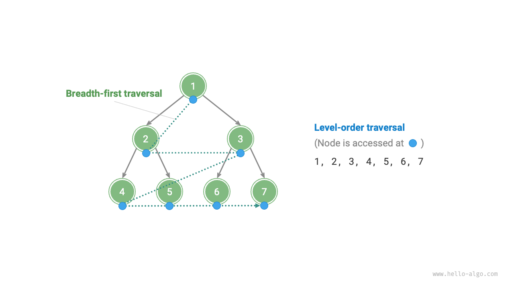{ class="animation-figure" }

<p align="center"> 図 7-9 &nbsp; 二分木のレベル順走査 </p>

### 1. &nbsp; コードの実装

幅優先走査は通常「キュー」を用いて実装します。キューは「先入れ先出し」の規則に従い、幅優先走査は「層ごとに進む」という規則に従います。両者の背後にある考え方は一致しています。実装コードは次のとおりです：

=== "Python"

    ```python title="binary_tree_bfs.py"
    def level_order(root: TreeNode | None) -> list[int]:
        """レベル順走査"""
        # キューを初期化し、ルートノードを追加する
        queue: deque[TreeNode] = deque()
        queue.append(root)
        # 走査順序を保存するためのリストを初期化する
        res = []
        while queue:
            node: TreeNode = queue.popleft()  # デキュー
            res.append(node.val)  # ノードの値を保存する
            if node.left is not None:
                queue.append(node.left)  # 左子ノードをキューに追加
            if node.right is not None:
                queue.append(node.right)  # 右子ノードをキューに追加
        return res
    ```

=== "C++"

    ```cpp title="binary_tree_bfs.cpp"
    /* レベル順走査 */
    vector<int> levelOrder(TreeNode *root) {
        // キューを初期化し、ルートノードを追加する
        queue<TreeNode *> queue;
        queue.push(root);
        // 走査順序を保存するためのリストを初期化する
        vector<int> vec;
        while (!queue.empty()) {
            TreeNode *node = queue.front();
            queue.pop();              // デキュー
            vec.push_back(node->val); // ノードの値を保存する
            if (node->left != nullptr)
                queue.push(node->left); // 左子ノードをキューに追加
            if (node->right != nullptr)
                queue.push(node->right); // 右子ノードをキューに追加
        }
        return vec;
    }
    ```

=== "Java"

    ```java title="binary_tree_bfs.java"
    /* レベル順走査 */
    List<Integer> levelOrder(TreeNode root) {
        // キューを初期化し、ルートノードを追加する
        Queue<TreeNode> queue = new LinkedList<>();
        queue.add(root);
        // 走査順序を保存するためのリストを初期化する
        List<Integer> list = new ArrayList<>();
        while (!queue.isEmpty()) {
            TreeNode node = queue.poll(); // デキュー
            list.add(node.val);           // ノードの値を保存する
            if (node.left != null)
                queue.offer(node.left);   // 左子ノードをキューに追加
            if (node.right != null)
                queue.offer(node.right);  // 右子ノードをキューに追加
        }
        return list;
    }
    ```

=== "C#"

    ```csharp title="binary_tree_bfs.cs"
    /* レベル順走査 */
    List<int> LevelOrder(TreeNode root) {
        // キューを初期化し、ルートノードを追加する
        Queue<TreeNode> queue = new();
        queue.Enqueue(root);
        // 走査順序を保存するためのリストを初期化する
        List<int> list = [];
        while (queue.Count != 0) {
            TreeNode node = queue.Dequeue(); // デキュー
            list.Add(node.val!.Value);       // ノードの値を保存する
            if (node.left != null)
                queue.Enqueue(node.left);    // 左子ノードをキューに追加
            if (node.right != null)
                queue.Enqueue(node.right);   // 右子ノードをキューに追加
        }
        return list;
    }
    ```

=== "Go"

    ```go title="binary_tree_bfs.go"
    /* レベル順走査 */
    func levelOrder(root *TreeNode) []any {
        // キューを初期化し、ルートノードを追加する
        queue := list.New()
        queue.PushBack(root)
        // 走査順を保存するためのスライスを初期化する
        nums := make([]any, 0)
        for queue.Len() > 0 {
            // デキュー
            node := queue.Remove(queue.Front()).(*TreeNode)
            // ノードの値を保存する
            nums = append(nums, node.Val)
            if node.Left != nil {
                // 左子ノードをキューに追加
                queue.PushBack(node.Left)
            }
            if node.Right != nil {
                // 右子ノードをキューに追加
                queue.PushBack(node.Right)
            }
        }
        return nums
    }
    ```

=== "Swift"

    ```swift title="binary_tree_bfs.swift"
    /* レベル順走査 */
    func levelOrder(root: TreeNode) -> [Int] {
        // キューを初期化し、ルートノードを追加する
        var queue: [TreeNode] = [root]
        // 走査順序を保存するためのリストを初期化する
        var list: [Int] = []
        while !queue.isEmpty {
            let node = queue.removeFirst() // デキュー
            list.append(node.val) // ノードの値を保存する
            if let left = node.left {
                queue.append(left) // 左子ノードをキューに追加
            }
            if let right = node.right {
                queue.append(right) // 右子ノードをキューに追加
            }
        }
        return list
    }
    ```

=== "JS"

    ```javascript title="binary_tree_bfs.js"
    /* レベル順走査 */
    function levelOrder(root) {
        // キューを初期化し、ルートノードを追加する
        const queue = [root];
        // 走査順序を保存するためのリストを初期化する
        const list = [];
        while (queue.length) {
            let node = queue.shift(); // デキュー
            list.push(node.val); // ノードの値を保存する
            if (node.left) queue.push(node.left); // 左子ノードをキューに追加
            if (node.right) queue.push(node.right); // 右子ノードをキューに追加
        }
        return list;
    }
    ```

=== "TS"

    ```typescript title="binary_tree_bfs.ts"
    /* レベル順走査 */
    function levelOrder(root: TreeNode | null): number[] {
        // キューを初期化し、ルートノードを追加する
        const queue = [root];
        // 走査順序を保存するためのリストを初期化する
        const list: number[] = [];
        while (queue.length) {
            let node = queue.shift() as TreeNode; // デキュー
            list.push(node.val); // ノードの値を保存する
            if (node.left) {
                queue.push(node.left); // 左子ノードをキューに追加
            }
            if (node.right) {
                queue.push(node.right); // 右子ノードをキューに追加
            }
        }
        return list;
    }
    ```

=== "Dart"

    ```dart title="binary_tree_bfs.dart"
    /* レベル順走査 */
    List<int> levelOrder(TreeNode? root) {
      // キューを初期化し、ルートノードを追加する
      Queue<TreeNode?> queue = Queue();
      queue.add(root);
      // 走査順序を保存するためのリストを初期化する
      List<int> res = [];
      while (queue.isNotEmpty) {
        TreeNode? node = queue.removeFirst(); // デキュー
        res.add(node!.val); // ノードの値を保存する
        if (node.left != null) queue.add(node.left); // 左子ノードをキューに追加
        if (node.right != null) queue.add(node.right); // 右子ノードをキューに追加
      }
      return res;
    }
    ```

=== "Rust"

    ```rust title="binary_tree_bfs.rs"
    /* レベル順走査 */
    fn level_order(root: &Rc<RefCell<TreeNode>>) -> Vec<i32> {
        // キューを初期化し、ルートノードを追加する
        let mut que = VecDeque::new();
        que.push_back(root.clone());
        // 走査順序を保存するためのリストを初期化する
        let mut vec = Vec::new();

        while let Some(node) = que.pop_front() {
            // デキュー
            vec.push(node.borrow().val); // ノードの値を保存する
            if let Some(left) = node.borrow().left.as_ref() {
                que.push_back(left.clone()); // 左子ノードをキューに追加
            }
            if let Some(right) = node.borrow().right.as_ref() {
                que.push_back(right.clone()); // 右子ノードをキューに追加
            };
        }
        vec
    }
    ```

=== "C"

    ```c title="binary_tree_bfs.c"
    /* レベル順走査 */
    int *levelOrder(TreeNode *root, int *size) {
        /* 補助キュー */
        int front, rear;
        int index, *arr;
        TreeNode *node;
        TreeNode **queue;

        /* 補助キュー */
        queue = (TreeNode **)malloc(sizeof(TreeNode *) * MAX_SIZE);
        // キューへのポインタ
        front = 0, rear = 0;
        // 根ノードを追加する
        queue[rear++] = root;
        // 走査順序を保存するためのリストを初期化する
        /* 補助配列 */
        arr = (int *)malloc(sizeof(int) * MAX_SIZE);
        // 配列ポインタ
        index = 0;
        while (front < rear) {
            // デキュー
            node = queue[front++];
            // ノードの値を保存する
            arr[index++] = node->val;
            if (node->left != NULL) {
                // 左子ノードをキューに追加
                queue[rear++] = node->left;
            }
            if (node->right != NULL) {
                // 右子ノードをキューに追加
                queue[rear++] = node->right;
            }
        }
        // 配列長の値を更新
        *size = index;
        arr = realloc(arr, sizeof(int) * (*size));

        // 補助配列の領域を解放する
        free(queue);
        return arr;
    }
    ```

=== "Kotlin"

    ```kotlin title="binary_tree_bfs.kt"
    /* レベル順走査 */
    fun levelOrder(root: TreeNode?): MutableList<Int> {
        // キューを初期化し、ルートノードを追加する
        val queue = LinkedList<TreeNode?>()
        queue.add(root)
        // 走査順序を保存するためのリストを初期化する
        val list = mutableListOf<Int>()
        while (queue.isNotEmpty()) {
            val node = queue.poll()      // デキュー
            list.add(node?._val!!)       // ノードの値を保存する
            if (node.left != null)
                queue.offer(node.left)   // 左子ノードをキューに追加
            if (node.right != null)
                queue.offer(node.right)  // 右子ノードをキューに追加
        }
        return list
    }
    ```

=== "Ruby"

    ```ruby title="binary_tree_bfs.rb"
    ### レベル順走査 ###
    def level_order(root)
      # キューを初期化し、ルートノードを追加する
      queue = [root]
      # 走査順序を保存するためのリストを初期化する
      res = []
      while !queue.empty?
        node = queue.shift # デキュー
        res << node.val # ノードの値を保存する
        queue << node.left unless node.left.nil? # 左子ノードをキューに追加
        queue << node.right unless node.right.nil? # 右子ノードをキューに追加
      end
      res
    end
    ```

??? pythontutor "コードの可視化"

    <div style="height: 549px; width: 100%;"><iframe class="pythontutor-iframe" src="https://pythontutor.com/iframe-embed.html#code=from%20collections%20import%20deque%0A%0Aclass%20TreeNode%3A%0A%20%20%20%20%22%22%22%E4%BA%8C%E5%88%86%E6%9C%A8%E3%83%8E%E3%83%BC%E3%83%89%E3%82%AF%E3%83%A9%E3%82%B9%22%22%22%0A%20%20%20%20def%20__init__%28self%2C%20val%3A%20int%29%3A%0A%20%20%20%20%20%20%20%20self.val%3A%20int%20%3D%20val%20%20%20%20%20%20%20%20%20%20%20%20%20%20%20%20%23%20%E3%83%8E%E3%83%BC%E3%83%89%E5%80%A4%0A%20%20%20%20%20%20%20%20self.left%3A%20TreeNode%20%7C%20None%20%3D%20None%20%20%23%20%E5%B7%A6%E5%AD%90%E3%83%8E%E3%83%BC%E3%83%89%E3%81%B8%E3%81%AE%E5%8F%82%E7%85%A7%0A%20%20%20%20%20%20%20%20self.right%3A%20TreeNode%20%7C%20None%20%3D%20None%20%23%20%E5%8F%B3%E5%AD%90%E3%83%8E%E3%83%BC%E3%83%89%E3%81%B8%E3%81%AE%E5%8F%82%E7%85%A7%0A%0Adef%20list_to_tree_dfs%28arr%3A%20list%5Bint%5D%2C%20i%3A%20int%29%20-%3E%20TreeNode%20%7C%20None%3A%0A%20%20%20%20%22%22%22%E3%83%AA%E3%82%B9%E3%83%88%E3%82%92%E4%BA%8C%E5%88%86%E6%9C%A8%E3%81%AB%E3%83%87%E3%82%B7%E3%83%AA%E3%82%A2%E3%83%A9%E3%82%A4%E3%82%BA%E3%81%99%E3%82%8B%3A%20%E5%86%8D%E5%B8%B0%22%22%22%0A%20%20%20%20%23%20%E6%B7%BB%E5%AD%97%E3%81%8C%E9%85%8D%E5%88%97%E9%95%B7%E3%82%92%E8%B6%85%E3%81%88%E3%82%8B%E3%81%8B%E3%80%81%E5%AF%BE%E5%BF%9C%E3%81%99%E3%82%8B%E8%A6%81%E7%B4%A0%E3%81%8C%20None%20%E3%81%AA%E3%82%89%E3%80%81None%20%E3%82%92%E8%BF%94%E3%81%99%0A%20%20%20%20if%20i%20%3C%200%20or%20i%20%3E%3D%20len%28arr%29%20or%20arr%5Bi%5D%20is%20None%3A%0A%20%20%20%20%20%20%20%20return%20None%0A%20%20%20%20%23%20%E7%8F%BE%E5%9C%A8%E3%81%AE%E3%83%8E%E3%83%BC%E3%83%89%E3%82%92%E6%A7%8B%E7%AF%89%E3%81%99%E3%82%8B%0A%20%20%20%20root%20%3D%20TreeNode%28arr%5Bi%5D%29%0A%20%20%20%20%23%20%E5%B7%A6%E5%8F%B3%E3%81%AE%E9%83%A8%E5%88%86%E6%9C%A8%E3%82%92%E5%86%8D%E5%B8%B0%E7%9A%84%E3%81%AB%E6%A7%8B%E7%AF%89%E3%81%99%E3%82%8B%0A%20%20%20%20root.left%20%3D%20list_to_tree_dfs%28arr%2C%202%20%2A%20i%20%2B%201%29%0A%20%20%20%20root.right%20%3D%20list_to_tree_dfs%28arr%2C%202%20%2A%20i%20%2B%202%29%0A%20%20%20%20return%20root%0A%0Adef%20list_to_tree%28arr%3A%20list%5Bint%5D%29%20-%3E%20TreeNode%20%7C%20None%3A%0A%20%20%20%20%22%22%22%E3%83%AA%E3%82%B9%E3%83%88%E3%82%92%E4%BA%8C%E5%88%86%E6%9C%A8%E3%81%AB%E3%83%87%E3%82%B7%E3%83%AA%E3%82%A2%E3%83%A9%E3%82%A4%E3%82%BA%E3%81%99%E3%82%8B%22%22%22%0A%20%20%20%20return%20list_to_tree_dfs%28arr%2C%200%29%0A%0A%0Adef%20level_order%28root%3A%20TreeNode%20%7C%20None%29%20-%3E%20list%5Bint%5D%3A%0A%20%20%20%20%22%22%22%E3%83%AC%E3%83%99%E3%83%AB%E9%A0%86%E8%B5%B0%E6%9F%BB%22%22%22%0A%20%20%20%20%23%20%E3%82%AD%E3%83%A5%E3%83%BC%E3%82%92%E5%88%9D%E6%9C%9F%E5%8C%96%E3%81%97%E3%80%81%E3%83%AB%E3%83%BC%E3%83%88%E3%83%8E%E3%83%BC%E3%83%89%E3%82%92%E8%BF%BD%E5%8A%A0%E3%81%99%E3%82%8B%0A%20%20%20%20queue%3A%20deque%5BTreeNode%5D%20%3D%20deque%28%29%0A%20%20%20%20queue.append%28root%29%0A%20%20%20%20%23%20%E8%B5%B0%E6%9F%BB%E9%A0%86%E5%BA%8F%E3%82%92%E4%BF%9D%E5%AD%98%E3%81%99%E3%82%8B%E3%81%9F%E3%82%81%E3%81%AE%E3%83%AA%E3%82%B9%E3%83%88%E3%82%92%E5%88%9D%E6%9C%9F%E5%8C%96%E3%81%99%E3%82%8B%0A%20%20%20%20res%20%3D%20%5B%5D%0A%20%20%20%20while%20queue%3A%0A%20%20%20%20%20%20%20%20node%3A%20TreeNode%20%3D%20queue.popleft%28%29%20%20%23%20%E3%83%87%E3%82%AD%E3%83%A5%E3%83%BC%0A%20%20%20%20%20%20%20%20res.append%28node.val%29%20%20%23%20%E3%83%8E%E3%83%BC%E3%83%89%E3%81%AE%E5%80%A4%E3%82%92%E4%BF%9D%E5%AD%98%E3%81%99%E3%82%8B%0A%20%20%20%20%20%20%20%20if%20node.left%20is%20not%20None%3A%0A%20%20%20%20%20%20%20%20%20%20%20%20queue.append%28node.left%29%20%20%23%20%E5%B7%A6%E5%AD%90%E3%83%8E%E3%83%BC%E3%83%89%E3%82%92%E3%82%AD%E3%83%A5%E3%83%BC%E3%81%AB%E8%BF%BD%E5%8A%A0%0A%20%20%20%20%20%20%20%20if%20node.right%20is%20not%20None%3A%0A%20%20%20%20%20%20%20%20%20%20%20%20queue.append%28node.right%29%20%20%23%20%E5%8F%B3%E5%AD%90%E3%83%8E%E3%83%BC%E3%83%89%E3%82%92%E3%82%AD%E3%83%A5%E3%83%BC%E3%81%AB%E8%BF%BD%E5%8A%A0%0A%20%20%20%20return%20res%0A%0Aif%20__name__%20%3D%3D%20%22__main__%22%3A%0A%20%20%20%20%23%20%E4%BA%8C%E5%88%86%E6%9C%A8%E3%82%92%E5%88%9D%E6%9C%9F%E5%8C%96%0A%20%20%20%20%23%20%E3%81%93%E3%81%93%E3%81%A7%E3%81%AF%E3%80%81%E9%85%8D%E5%88%97%E3%81%8B%E3%82%89%E7%9B%B4%E6%8E%A5%E4%BA%8C%E5%88%86%E6%9C%A8%E3%82%92%E7%94%9F%E6%88%90%E3%81%99%E3%82%8B%E9%96%A2%E6%95%B0%E3%82%92%E5%88%A9%E7%94%A8%E3%81%99%E3%82%8B%0A%20%20%20%20root%20%3D%20list_to_tree%28arr%3D%5B1%2C%202%2C%203%2C%204%2C%205%2C%206%2C%207%5D%29%0A%0A%20%20%20%20%23%20%E3%83%AC%E3%83%99%E3%83%AB%E9%A0%86%E8%B5%B0%E6%9F%BB%0A%20%20%20%20res%20%3D%20level_order%28root%29%0A%20%20%20%20print%28%22%5Cn%E3%83%AC%E3%83%99%E3%83%AB%E9%A0%86%E8%B5%B0%E6%9F%BB%E3%81%AE%E3%83%8E%E3%83%BC%E3%83%89%E5%87%BA%E5%8A%9B%E3%82%B7%E3%83%BC%E3%82%B1%E3%83%B3%E3%82%B9%20%3D%20%22%2C%20res%29&codeDivHeight=472&codeDivWidth=350&cumulative=false&curInstr=127&heapPrimitives=nevernest&origin=opt-frontend.js&py=311&rawInputLstJSON=%5B%5D&textReferences=false"> </iframe></div>
    <div style="margin-top: 5px;"><a href="https://pythontutor.com/iframe-embed.html#code=from%20collections%20import%20deque%0A%0Aclass%20TreeNode%3A%0A%20%20%20%20%22%22%22%E4%BA%8C%E5%88%86%E6%9C%A8%E3%83%8E%E3%83%BC%E3%83%89%E3%82%AF%E3%83%A9%E3%82%B9%22%22%22%0A%20%20%20%20def%20__init__%28self%2C%20val%3A%20int%29%3A%0A%20%20%20%20%20%20%20%20self.val%3A%20int%20%3D%20val%20%20%20%20%20%20%20%20%20%20%20%20%20%20%20%20%23%20%E3%83%8E%E3%83%BC%E3%83%89%E5%80%A4%0A%20%20%20%20%20%20%20%20self.left%3A%20TreeNode%20%7C%20None%20%3D%20None%20%20%23%20%E5%B7%A6%E5%AD%90%E3%83%8E%E3%83%BC%E3%83%89%E3%81%B8%E3%81%AE%E5%8F%82%E7%85%A7%0A%20%20%20%20%20%20%20%20self.right%3A%20TreeNode%20%7C%20None%20%3D%20None%20%23%20%E5%8F%B3%E5%AD%90%E3%83%8E%E3%83%BC%E3%83%89%E3%81%B8%E3%81%AE%E5%8F%82%E7%85%A7%0A%0Adef%20list_to_tree_dfs%28arr%3A%20list%5Bint%5D%2C%20i%3A%20int%29%20-%3E%20TreeNode%20%7C%20None%3A%0A%20%20%20%20%22%22%22%E3%83%AA%E3%82%B9%E3%83%88%E3%82%92%E4%BA%8C%E5%88%86%E6%9C%A8%E3%81%AB%E3%83%87%E3%82%B7%E3%83%AA%E3%82%A2%E3%83%A9%E3%82%A4%E3%82%BA%E3%81%99%E3%82%8B%3A%20%E5%86%8D%E5%B8%B0%22%22%22%0A%20%20%20%20%23%20%E6%B7%BB%E5%AD%97%E3%81%8C%E9%85%8D%E5%88%97%E9%95%B7%E3%82%92%E8%B6%85%E3%81%88%E3%82%8B%E3%81%8B%E3%80%81%E5%AF%BE%E5%BF%9C%E3%81%99%E3%82%8B%E8%A6%81%E7%B4%A0%E3%81%8C%20None%20%E3%81%AA%E3%82%89%E3%80%81None%20%E3%82%92%E8%BF%94%E3%81%99%0A%20%20%20%20if%20i%20%3C%200%20or%20i%20%3E%3D%20len%28arr%29%20or%20arr%5Bi%5D%20is%20None%3A%0A%20%20%20%20%20%20%20%20return%20None%0A%20%20%20%20%23%20%E7%8F%BE%E5%9C%A8%E3%81%AE%E3%83%8E%E3%83%BC%E3%83%89%E3%82%92%E6%A7%8B%E7%AF%89%E3%81%99%E3%82%8B%0A%20%20%20%20root%20%3D%20TreeNode%28arr%5Bi%5D%29%0A%20%20%20%20%23%20%E5%B7%A6%E5%8F%B3%E3%81%AE%E9%83%A8%E5%88%86%E6%9C%A8%E3%82%92%E5%86%8D%E5%B8%B0%E7%9A%84%E3%81%AB%E6%A7%8B%E7%AF%89%E3%81%99%E3%82%8B%0A%20%20%20%20root.left%20%3D%20list_to_tree_dfs%28arr%2C%202%20%2A%20i%20%2B%201%29%0A%20%20%20%20root.right%20%3D%20list_to_tree_dfs%28arr%2C%202%20%2A%20i%20%2B%202%29%0A%20%20%20%20return%20root%0A%0Adef%20list_to_tree%28arr%3A%20list%5Bint%5D%29%20-%3E%20TreeNode%20%7C%20None%3A%0A%20%20%20%20%22%22%22%E3%83%AA%E3%82%B9%E3%83%88%E3%82%92%E4%BA%8C%E5%88%86%E6%9C%A8%E3%81%AB%E3%83%87%E3%82%B7%E3%83%AA%E3%82%A2%E3%83%A9%E3%82%A4%E3%82%BA%E3%81%99%E3%82%8B%22%22%22%0A%20%20%20%20return%20list_to_tree_dfs%28arr%2C%200%29%0A%0A%0Adef%20level_order%28root%3A%20TreeNode%20%7C%20None%29%20-%3E%20list%5Bint%5D%3A%0A%20%20%20%20%22%22%22%E3%83%AC%E3%83%99%E3%83%AB%E9%A0%86%E8%B5%B0%E6%9F%BB%22%22%22%0A%20%20%20%20%23%20%E3%82%AD%E3%83%A5%E3%83%BC%E3%82%92%E5%88%9D%E6%9C%9F%E5%8C%96%E3%81%97%E3%80%81%E3%83%AB%E3%83%BC%E3%83%88%E3%83%8E%E3%83%BC%E3%83%89%E3%82%92%E8%BF%BD%E5%8A%A0%E3%81%99%E3%82%8B%0A%20%20%20%20queue%3A%20deque%5BTreeNode%5D%20%3D%20deque%28%29%0A%20%20%20%20queue.append%28root%29%0A%20%20%20%20%23%20%E8%B5%B0%E6%9F%BB%E9%A0%86%E5%BA%8F%E3%82%92%E4%BF%9D%E5%AD%98%E3%81%99%E3%82%8B%E3%81%9F%E3%82%81%E3%81%AE%E3%83%AA%E3%82%B9%E3%83%88%E3%82%92%E5%88%9D%E6%9C%9F%E5%8C%96%E3%81%99%E3%82%8B%0A%20%20%20%20res%20%3D%20%5B%5D%0A%20%20%20%20while%20queue%3A%0A%20%20%20%20%20%20%20%20node%3A%20TreeNode%20%3D%20queue.popleft%28%29%20%20%23%20%E3%83%87%E3%82%AD%E3%83%A5%E3%83%BC%0A%20%20%20%20%20%20%20%20res.append%28node.val%29%20%20%23%20%E3%83%8E%E3%83%BC%E3%83%89%E3%81%AE%E5%80%A4%E3%82%92%E4%BF%9D%E5%AD%98%E3%81%99%E3%82%8B%0A%20%20%20%20%20%20%20%20if%20node.left%20is%20not%20None%3A%0A%20%20%20%20%20%20%20%20%20%20%20%20queue.append%28node.left%29%20%20%23%20%E5%B7%A6%E5%AD%90%E3%83%8E%E3%83%BC%E3%83%89%E3%82%92%E3%82%AD%E3%83%A5%E3%83%BC%E3%81%AB%E8%BF%BD%E5%8A%A0%0A%20%20%20%20%20%20%20%20if%20node.right%20is%20not%20None%3A%0A%20%20%20%20%20%20%20%20%20%20%20%20queue.append%28node.right%29%20%20%23%20%E5%8F%B3%E5%AD%90%E3%83%8E%E3%83%BC%E3%83%89%E3%82%92%E3%82%AD%E3%83%A5%E3%83%BC%E3%81%AB%E8%BF%BD%E5%8A%A0%0A%20%20%20%20return%20res%0A%0Aif%20__name__%20%3D%3D%20%22__main__%22%3A%0A%20%20%20%20%23%20%E4%BA%8C%E5%88%86%E6%9C%A8%E3%82%92%E5%88%9D%E6%9C%9F%E5%8C%96%0A%20%20%20%20%23%20%E3%81%93%E3%81%93%E3%81%A7%E3%81%AF%E3%80%81%E9%85%8D%E5%88%97%E3%81%8B%E3%82%89%E7%9B%B4%E6%8E%A5%E4%BA%8C%E5%88%86%E6%9C%A8%E3%82%92%E7%94%9F%E6%88%90%E3%81%99%E3%82%8B%E9%96%A2%E6%95%B0%E3%82%92%E5%88%A9%E7%94%A8%E3%81%99%E3%82%8B%0A%20%20%20%20root%20%3D%20list_to_tree%28arr%3D%5B1%2C%202%2C%203%2C%204%2C%205%2C%206%2C%207%5D%29%0A%0A%20%20%20%20%23%20%E3%83%AC%E3%83%99%E3%83%AB%E9%A0%86%E8%B5%B0%E6%9F%BB%0A%20%20%20%20res%20%3D%20level_order%28root%29%0A%20%20%20%20print%28%22%5Cn%E3%83%AC%E3%83%99%E3%83%AB%E9%A0%86%E8%B5%B0%E6%9F%BB%E3%81%AE%E3%83%8E%E3%83%BC%E3%83%89%E5%87%BA%E5%8A%9B%E3%82%B7%E3%83%BC%E3%82%B1%E3%83%B3%E3%82%B9%20%3D%20%22%2C%20res%29&codeDivHeight=800&codeDivWidth=600&cumulative=false&curInstr=127&heapPrimitives=nevernest&origin=opt-frontend.js&py=311&rawInputLstJSON=%5B%5D&textReferences=false" target="_blank" rel="noopener noreferrer">全画面で見る ></a></div>

### 2. &nbsp; 計算量

- **時間計算量は $O(n)$** ：すべてのノードを1回ずつ訪問するため、計算量は $O(n)$ です。ここで、$n$ はノード数です。
- **空間計算量は $O(n)$** ：最悪の場合、すなわち完全二分木では、最下層に到達する前に、キュー内には最大で同時に $(n + 1) / 2$ 個のノードが存在し、$O(n)$ の空間を使用します。

## 7.2.2 &nbsp; 先行順・中間順・後行順走査

同様に、先行順・中間順・後行順走査はいずれも<u>深度優先走査（depth-first traversal）</u>に属し、<u>深度優先探索（depth-first search, DFS）</u>とも呼ばれます。これは「まず行き止まりまで進み、その後で戻って続ける」という走査方法を表しています。

次の図は、二分木に対して深度優先走査を行う仕組みを示しています。**深度優先走査は、二分木全体の外周をぐるりと「一周する」ようなものです**。各ノードでは3つの位置に出会い、それぞれが先行順走査・中間順走査・後行順走査に対応します。

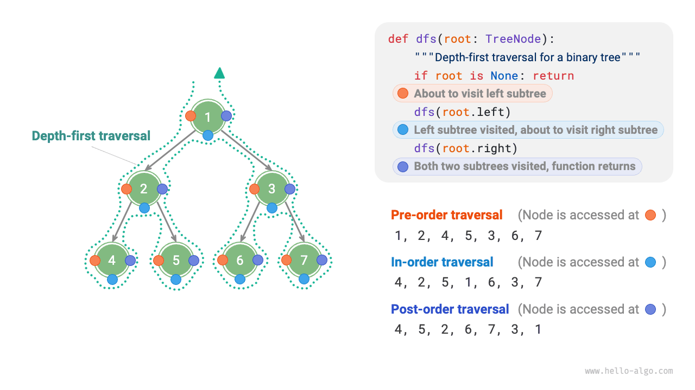{ class="animation-figure" }

<p align="center"> 図 7-10 &nbsp; 二分探索木の先行順・中間順・後行順走査 </p>

### 1. &nbsp; コードの実装

深度優先探索は通常、再帰に基づいて実装されます：

=== "Python"

    ```python title="binary_tree_dfs.py"
    def pre_order(root: TreeNode | None):
        """先行順走査"""
        if root is None:
            return
        # 訪問順序：根ノード -> 左部分木 -> 右部分木
        res.append(root.val)
        pre_order(root=root.left)
        pre_order(root=root.right)

    def in_order(root: TreeNode | None):
        """中順走査"""
        if root is None:
            return
        # 訪問優先順: 左部分木 -> 根ノード -> 右部分木
        in_order(root=root.left)
        res.append(root.val)
        in_order(root=root.right)

    def post_order(root: TreeNode | None):
        """後順走査"""
        if root is None:
            return
        # 訪問優先順: 左部分木 -> 右部分木 -> 根ノード
        post_order(root=root.left)
        post_order(root=root.right)
        res.append(root.val)
    ```

=== "C++"

    ```cpp title="binary_tree_dfs.cpp"
    /* 先行順走査 */
    void preOrder(TreeNode *root) {
        if (root == nullptr)
            return;
        // 訪問順序：根ノード -> 左部分木 -> 右部分木
        vec.push_back(root->val);
        preOrder(root->left);
        preOrder(root->right);
    }

    /* 中順走査 */
    void inOrder(TreeNode *root) {
        if (root == nullptr)
            return;
        // 訪問優先順: 左部分木 -> 根ノード -> 右部分木
        inOrder(root->left);
        vec.push_back(root->val);
        inOrder(root->right);
    }

    /* 後順走査 */
    void postOrder(TreeNode *root) {
        if (root == nullptr)
            return;
        // 訪問優先順: 左部分木 -> 右部分木 -> 根ノード
        postOrder(root->left);
        postOrder(root->right);
        vec.push_back(root->val);
    }
    ```

=== "Java"

    ```java title="binary_tree_dfs.java"
    /* 先行順走査 */
    void preOrder(TreeNode root) {
        if (root == null)
            return;
        // 訪問順序：根ノード -> 左部分木 -> 右部分木
        list.add(root.val);
        preOrder(root.left);
        preOrder(root.right);
    }

    /* 中順走査 */
    void inOrder(TreeNode root) {
        if (root == null)
            return;
        // 訪問優先順: 左部分木 -> 根ノード -> 右部分木
        inOrder(root.left);
        list.add(root.val);
        inOrder(root.right);
    }

    /* 後順走査 */
    void postOrder(TreeNode root) {
        if (root == null)
            return;
        // 訪問優先順: 左部分木 -> 右部分木 -> 根ノード
        postOrder(root.left);
        postOrder(root.right);
        list.add(root.val);
    }
    ```

=== "C#"

    ```csharp title="binary_tree_dfs.cs"
    /* 先行順走査 */
    void PreOrder(TreeNode? root) {
        if (root == null) return;
        // 訪問順序：根ノード -> 左部分木 -> 右部分木
        list.Add(root.val!.Value);
        PreOrder(root.left);
        PreOrder(root.right);
    }

    /* 中順走査 */
    void InOrder(TreeNode? root) {
        if (root == null) return;
        // 訪問優先順: 左部分木 -> 根ノード -> 右部分木
        InOrder(root.left);
        list.Add(root.val!.Value);
        InOrder(root.right);
    }

    /* 後順走査 */
    void PostOrder(TreeNode? root) {
        if (root == null) return;
        // 訪問優先順: 左部分木 -> 右部分木 -> 根ノード
        PostOrder(root.left);
        PostOrder(root.right);
        list.Add(root.val!.Value);
    }
    ```

=== "Go"

    ```go title="binary_tree_dfs.go"
    /* 先行順走査 */
    func preOrder(node *TreeNode) {
        if node == nil {
            return
        }
        // 訪問順序：根ノード -> 左部分木 -> 右部分木
        nums = append(nums, node.Val)
        preOrder(node.Left)
        preOrder(node.Right)
    }

    /* 中順走査 */
    func inOrder(node *TreeNode) {
        if node == nil {
            return
        }
        // 訪問優先順: 左部分木 -> 根ノード -> 右部分木
        inOrder(node.Left)
        nums = append(nums, node.Val)
        inOrder(node.Right)
    }

    /* 後順走査 */
    func postOrder(node *TreeNode) {
        if node == nil {
            return
        }
        // 訪問優先順: 左部分木 -> 右部分木 -> 根ノード
        postOrder(node.Left)
        postOrder(node.Right)
        nums = append(nums, node.Val)
    }
    ```

=== "Swift"

    ```swift title="binary_tree_dfs.swift"
    /* 先行順走査 */
    func preOrder(root: TreeNode?) {
        guard let root = root else {
            return
        }
        // 訪問順序：根ノード -> 左部分木 -> 右部分木
        list.append(root.val)
        preOrder(root: root.left)
        preOrder(root: root.right)
    }

    /* 中順走査 */
    func inOrder(root: TreeNode?) {
        guard let root = root else {
            return
        }
        // 訪問優先順: 左部分木 -> 根ノード -> 右部分木
        inOrder(root: root.left)
        list.append(root.val)
        inOrder(root: root.right)
    }

    /* 後順走査 */
    func postOrder(root: TreeNode?) {
        guard let root = root else {
            return
        }
        // 訪問優先順: 左部分木 -> 右部分木 -> 根ノード
        postOrder(root: root.left)
        postOrder(root: root.right)
        list.append(root.val)
    }
    ```

=== "JS"

    ```javascript title="binary_tree_dfs.js"
    /* 先行順走査 */
    function preOrder(root) {
        if (root === null) return;
        // 訪問順序：根ノード -> 左部分木 -> 右部分木
        list.push(root.val);
        preOrder(root.left);
        preOrder(root.right);
    }

    /* 中順走査 */
    function inOrder(root) {
        if (root === null) return;
        // 訪問優先順: 左部分木 -> 根ノード -> 右部分木
        inOrder(root.left);
        list.push(root.val);
        inOrder(root.right);
    }

    /* 後順走査 */
    function postOrder(root) {
        if (root === null) return;
        // 訪問優先順: 左部分木 -> 右部分木 -> 根ノード
        postOrder(root.left);
        postOrder(root.right);
        list.push(root.val);
    }
    ```

=== "TS"

    ```typescript title="binary_tree_dfs.ts"
    /* 先行順走査 */
    function preOrder(root: TreeNode | null): void {
        if (root === null) {
            return;
        }
        // 訪問順序：根ノード -> 左部分木 -> 右部分木
        list.push(root.val);
        preOrder(root.left);
        preOrder(root.right);
    }

    /* 中順走査 */
    function inOrder(root: TreeNode | null): void {
        if (root === null) {
            return;
        }
        // 訪問優先順: 左部分木 -> 根ノード -> 右部分木
        inOrder(root.left);
        list.push(root.val);
        inOrder(root.right);
    }

    /* 後順走査 */
    function postOrder(root: TreeNode | null): void {
        if (root === null) {
            return;
        }
        // 訪問優先順: 左部分木 -> 右部分木 -> 根ノード
        postOrder(root.left);
        postOrder(root.right);
        list.push(root.val);
    }
    ```

=== "Dart"

    ```dart title="binary_tree_dfs.dart"
    /* 先行順走査 */
    void preOrder(TreeNode? node) {
      if (node == null) return;
      // 訪問順序：根ノード -> 左部分木 -> 右部分木
      list.add(node.val);
      preOrder(node.left);
      preOrder(node.right);
    }

    /* 中順走査 */
    void inOrder(TreeNode? node) {
      if (node == null) return;
      // 訪問優先順: 左部分木 -> 根ノード -> 右部分木
      inOrder(node.left);
      list.add(node.val);
      inOrder(node.right);
    }

    /* 後順走査 */
    void postOrder(TreeNode? node) {
      if (node == null) return;
      // 訪問優先順: 左部分木 -> 右部分木 -> 根ノード
      postOrder(node.left);
      postOrder(node.right);
      list.add(node.val);
    }
    ```

=== "Rust"

    ```rust title="binary_tree_dfs.rs"
    /* 先行順走査 */
    fn pre_order(root: Option<&Rc<RefCell<TreeNode>>>) -> Vec<i32> {
        let mut result = vec![];

        fn dfs(root: Option<&Rc<RefCell<TreeNode>>>, res: &mut Vec<i32>) {
            if let Some(node) = root {
                // 訪問順序：根ノード -> 左部分木 -> 右部分木
                let node = node.borrow();
                res.push(node.val);
                dfs(node.left.as_ref(), res);
                dfs(node.right.as_ref(), res);
            }
        }
        dfs(root, &mut result);

        result
    }

    /* 中順走査 */
    fn in_order(root: Option<&Rc<RefCell<TreeNode>>>) -> Vec<i32> {
        let mut result = vec![];

        fn dfs(root: Option<&Rc<RefCell<TreeNode>>>, res: &mut Vec<i32>) {
            if let Some(node) = root {
                // 訪問優先順: 左部分木 -> 根ノード -> 右部分木
                let node = node.borrow();
                dfs(node.left.as_ref(), res);
                res.push(node.val);
                dfs(node.right.as_ref(), res);
            }
        }
        dfs(root, &mut result);

        result
    }

    /* 後順走査 */
    fn post_order(root: Option<&Rc<RefCell<TreeNode>>>) -> Vec<i32> {
        let mut result = vec![];

        fn dfs(root: Option<&Rc<RefCell<TreeNode>>>, res: &mut Vec<i32>) {
            if let Some(node) = root {
                // 訪問優先順: 左部分木 -> 右部分木 -> 根ノード
                let node = node.borrow();
                dfs(node.left.as_ref(), res);
                dfs(node.right.as_ref(), res);
                res.push(node.val);
            }
        }

        dfs(root, &mut result);

        result
    }
    ```

=== "C"

    ```c title="binary_tree_dfs.c"
    /* 先行順走査 */
    void preOrder(TreeNode *root, int *size) {
        if (root == NULL)
            return;
        // 訪問順序：根ノード -> 左部分木 -> 右部分木
        arr[(*size)++] = root->val;
        preOrder(root->left, size);
        preOrder(root->right, size);
    }

    /* 中順走査 */
    void inOrder(TreeNode *root, int *size) {
        if (root == NULL)
            return;
        // 訪問優先順: 左部分木 -> 根ノード -> 右部分木
        inOrder(root->left, size);
        arr[(*size)++] = root->val;
        inOrder(root->right, size);
    }

    /* 後順走査 */
    void postOrder(TreeNode *root, int *size) {
        if (root == NULL)
            return;
        // 訪問優先順: 左部分木 -> 右部分木 -> 根ノード
        postOrder(root->left, size);
        postOrder(root->right, size);
        arr[(*size)++] = root->val;
    }
    ```

=== "Kotlin"

    ```kotlin title="binary_tree_dfs.kt"
    /* 先行順走査 */
    fun preOrder(root: TreeNode?) {
        if (root == null) return
        // 訪問順序：根ノード -> 左部分木 -> 右部分木
        list.add(root._val)
        preOrder(root.left)
        preOrder(root.right)
    }

    /* 中順走査 */
    fun inOrder(root: TreeNode?) {
        if (root == null) return
        // 訪問優先順: 左部分木 -> 根ノード -> 右部分木
        inOrder(root.left)
        list.add(root._val)
        inOrder(root.right)
    }

    /* 後順走査 */
    fun postOrder(root: TreeNode?) {
        if (root == null) return
        // 訪問優先順: 左部分木 -> 右部分木 -> 根ノード
        postOrder(root.left)
        postOrder(root.right)
        list.add(root._val)
    }
    ```

=== "Ruby"

    ```ruby title="binary_tree_dfs.rb"
    ### 前順走査 ###
    def pre_order(root)
      return if root.nil?

      # 訪問順序：根ノード -> 左部分木 -> 右部分木
      $res << root.val
      pre_order(root.left)
      pre_order(root.right)
    end

    ### 中順走査 ###
    def in_order(root)
      return if root.nil?

      # 訪問優先順: 左部分木 -> 根ノード -> 右部分木
      in_order(root.left)
      $res << root.val
      in_order(root.right)
    end

    ### 後順走査 ###
    def post_order(root)
      return if root.nil?

      # 訪問優先順: 左部分木 -> 右部分木 -> 根ノード
      post_order(root.left)
      post_order(root.right)
      $res << root.val
    end
    ```

??? pythontutor "コードの可視化"

    <div style="height: 549px; width: 100%;"><iframe class="pythontutor-iframe" src="https://pythontutor.com/iframe-embed.html#code=class%20TreeNode%3A%0A%20%20%20%20%22%22%22%E4%BA%8C%E5%88%86%E6%9C%A8%E3%83%8E%E3%83%BC%E3%83%89%E3%82%AF%E3%83%A9%E3%82%B9%22%22%22%0A%20%20%20%20def%20__init__%28self%2C%20val%3A%20int%29%3A%0A%20%20%20%20%20%20%20%20self.val%3A%20int%20%3D%20val%20%20%20%20%20%20%20%20%20%20%20%20%20%20%20%20%23%20%E3%83%8E%E3%83%BC%E3%83%89%E5%80%A4%0A%20%20%20%20%20%20%20%20self.left%3A%20TreeNode%20%7C%20None%20%3D%20None%20%20%23%20%E5%B7%A6%E5%AD%90%E3%83%8E%E3%83%BC%E3%83%89%E3%81%B8%E3%81%AE%E5%8F%82%E7%85%A7%0A%20%20%20%20%20%20%20%20self.right%3A%20TreeNode%20%7C%20None%20%3D%20None%20%23%20%E5%8F%B3%E5%AD%90%E3%83%8E%E3%83%BC%E3%83%89%E3%81%B8%E3%81%AE%E5%8F%82%E7%85%A7%0A%0Adef%20list_to_tree_dfs%28arr%3A%20list%5Bint%5D%2C%20i%3A%20int%29%20-%3E%20TreeNode%20%7C%20None%3A%0A%20%20%20%20%22%22%22%E3%83%AA%E3%82%B9%E3%83%88%E3%82%92%E4%BA%8C%E5%88%86%E6%9C%A8%E3%81%AB%E3%83%87%E3%82%B7%E3%83%AA%E3%82%A2%E3%83%A9%E3%82%A4%E3%82%BA%E3%81%99%E3%82%8B%3A%20%E5%86%8D%E5%B8%B0%22%22%22%0A%20%20%20%20%23%20%E6%B7%BB%E5%AD%97%E3%81%8C%E9%85%8D%E5%88%97%E9%95%B7%E3%82%92%E8%B6%85%E3%81%88%E3%82%8B%E3%81%8B%E3%80%81%E5%AF%BE%E5%BF%9C%E3%81%99%E3%82%8B%E8%A6%81%E7%B4%A0%E3%81%8C%20None%20%E3%81%AA%E3%82%89%E3%80%81None%20%E3%82%92%E8%BF%94%E3%81%99%0A%20%20%20%20if%20i%20%3C%200%20or%20i%20%3E%3D%20len%28arr%29%20or%20arr%5Bi%5D%20is%20None%3A%0A%20%20%20%20%20%20%20%20return%20None%0A%20%20%20%20%23%20%E7%8F%BE%E5%9C%A8%E3%81%AE%E3%83%8E%E3%83%BC%E3%83%89%E3%82%92%E6%A7%8B%E7%AF%89%E3%81%99%E3%82%8B%0A%20%20%20%20root%20%3D%20TreeNode%28arr%5Bi%5D%29%0A%20%20%20%20%23%20%E5%B7%A6%E5%8F%B3%E3%81%AE%E9%83%A8%E5%88%86%E6%9C%A8%E3%82%92%E5%86%8D%E5%B8%B0%E7%9A%84%E3%81%AB%E6%A7%8B%E7%AF%89%E3%81%99%E3%82%8B%0A%20%20%20%20root.left%20%3D%20list_to_tree_dfs%28arr%2C%202%20%2A%20i%20%2B%201%29%0A%20%20%20%20root.right%20%3D%20list_to_tree_dfs%28arr%2C%202%20%2A%20i%20%2B%202%29%0A%20%20%20%20return%20root%0A%0Adef%20list_to_tree%28arr%3A%20list%5Bint%5D%29%20-%3E%20TreeNode%20%7C%20None%3A%0A%20%20%20%20%22%22%22%E3%83%AA%E3%82%B9%E3%83%88%E3%82%92%E4%BA%8C%E5%88%86%E6%9C%A8%E3%81%AB%E3%83%87%E3%82%B7%E3%83%AA%E3%82%A2%E3%83%A9%E3%82%A4%E3%82%BA%E3%81%99%E3%82%8B%22%22%22%0A%20%20%20%20return%20list_to_tree_dfs%28arr%2C%200%29%0A%0A%0Adef%20pre_order%28root%3A%20TreeNode%20%7C%20None%29%3A%0A%20%20%20%20%22%22%22%E5%85%88%E8%A1%8C%E9%A0%86%E8%B5%B0%E6%9F%BB%22%22%22%0A%20%20%20%20if%20root%20is%20None%3A%0A%20%20%20%20%20%20%20%20return%0A%20%20%20%20%23%20%E8%A8%AA%E5%95%8F%E9%A0%86%E5%BA%8F%EF%BC%9A%E6%A0%B9%E3%83%8E%E3%83%BC%E3%83%89%20-%3E%20%E5%B7%A6%E9%83%A8%E5%88%86%E6%9C%A8%20-%3E%20%E5%8F%B3%E9%83%A8%E5%88%86%E6%9C%A8%0A%20%20%20%20res.append%28root.val%29%0A%20%20%20%20pre_order%28root%3Droot.left%29%0A%20%20%20%20pre_order%28root%3Droot.right%29%0A%0Adef%20in_order%28root%3A%20TreeNode%20%7C%20None%29%3A%0A%20%20%20%20%22%22%22%E4%B8%AD%E9%A0%86%E8%B5%B0%E6%9F%BB%22%22%22%0A%20%20%20%20if%20root%20is%20None%3A%0A%20%20%20%20%20%20%20%20return%0A%20%20%20%20%23%20%E8%A8%AA%E5%95%8F%E5%84%AA%E5%85%88%E9%A0%86%3A%20%E5%B7%A6%E9%83%A8%E5%88%86%E6%9C%A8%20-%3E%20%E6%A0%B9%E3%83%8E%E3%83%BC%E3%83%89%20-%3E%20%E5%8F%B3%E9%83%A8%E5%88%86%E6%9C%A8%0A%20%20%20%20in_order%28root%3Droot.left%29%0A%20%20%20%20res.append%28root.val%29%0A%20%20%20%20in_order%28root%3Droot.right%29%0A%0Adef%20post_order%28root%3A%20TreeNode%20%7C%20None%29%3A%0A%20%20%20%20%22%22%22%E5%BE%8C%E9%A0%86%E8%B5%B0%E6%9F%BB%22%22%22%0A%20%20%20%20if%20root%20is%20None%3A%0A%20%20%20%20%20%20%20%20return%0A%20%20%20%20%23%20%E8%A8%AA%E5%95%8F%E5%84%AA%E5%85%88%E9%A0%86%3A%20%E5%B7%A6%E9%83%A8%E5%88%86%E6%9C%A8%20-%3E%20%E5%8F%B3%E9%83%A8%E5%88%86%E6%9C%A8%20-%3E%20%E6%A0%B9%E3%83%8E%E3%83%BC%E3%83%89%0A%20%20%20%20post_order%28root%3Droot.left%29%0A%20%20%20%20post_order%28root%3Droot.right%29%0A%20%20%20%20res.append%28root.val%29%0A%0Aif%20__name__%20%3D%3D%20%22__main__%22%3A%0A%20%20%20%20%23%20%E4%BA%8C%E5%88%86%E6%9C%A8%E3%82%92%E5%88%9D%E6%9C%9F%E5%8C%96%0A%20%20%20%20%23%20%E3%81%93%E3%81%93%E3%81%A7%E3%81%AF%E3%80%81%E9%85%8D%E5%88%97%E3%81%8B%E3%82%89%E7%9B%B4%E6%8E%A5%E4%BA%8C%E5%88%86%E6%9C%A8%E3%82%92%E7%94%9F%E6%88%90%E3%81%99%E3%82%8B%E9%96%A2%E6%95%B0%E3%82%92%E5%88%A9%E7%94%A8%E3%81%99%E3%82%8B%0A%20%20%20%20root%20%3D%20list_to_tree%28arr%3D%5B1%2C%202%2C%203%2C%204%2C%205%2C%206%2C%207%5D%29%0A%0A%20%20%20%20%23%20%E5%85%88%E8%A1%8C%E9%A0%86%E8%B5%B0%E6%9F%BB%0A%20%20%20%20res%20%3D%20%5B%5D%0A%20%20%20%20pre_order%28root%29%0A%20%20%20%20print%28%22%5Cn%E5%85%88%E8%A1%8C%E9%A0%86%E8%B5%B0%E6%9F%BB%E3%81%AE%E3%83%8E%E3%83%BC%E3%83%89%E5%87%BA%E5%8A%9B%E3%82%B7%E3%83%BC%E3%82%B1%E3%83%B3%E3%82%B9%20%3D%20%22%2C%20res%29%0A%0A%20%20%20%20%23%20%E4%B8%AD%E9%A0%86%E8%B5%B0%E6%9F%BB%0A%20%20%20%20res.clear%28%29%0A%20%20%20%20in_order%28root%29%0A%20%20%20%20print%28%22%5Cn%E4%B8%AD%E9%96%93%E9%A0%86%E8%B5%B0%E6%9F%BB%E3%81%AE%E3%83%8E%E3%83%BC%E3%83%89%E5%87%BA%E5%8A%9B%E3%82%B7%E3%83%BC%E3%82%B1%E3%83%B3%E3%82%B9%20%3D%20%22%2C%20res%29%0A%0A%20%20%20%20%23%20%E5%BE%8C%E9%A0%86%E8%B5%B0%E6%9F%BB%0A%20%20%20%20res.clear%28%29%0A%20%20%20%20post_order%28root%29%0A%20%20%20%20print%28%22%5Cn%E5%BE%8C%E8%A1%8C%E9%A0%86%E8%B5%B0%E6%9F%BB%E3%81%AE%E3%83%8E%E3%83%BC%E3%83%89%E5%87%BA%E5%8A%9B%E3%82%B7%E3%83%BC%E3%82%B1%E3%83%B3%E3%82%B9%20%3D%20%22%2C%20res%29&codeDivHeight=472&codeDivWidth=350&cumulative=false&curInstr=129&heapPrimitives=nevernest&origin=opt-frontend.js&py=311&rawInputLstJSON=%5B%5D&textReferences=false"> </iframe></div>
    <div style="margin-top: 5px;"><a href="https://pythontutor.com/iframe-embed.html#code=class%20TreeNode%3A%0A%20%20%20%20%22%22%22%E4%BA%8C%E5%88%86%E6%9C%A8%E3%83%8E%E3%83%BC%E3%83%89%E3%82%AF%E3%83%A9%E3%82%B9%22%22%22%0A%20%20%20%20def%20__init__%28self%2C%20val%3A%20int%29%3A%0A%20%20%20%20%20%20%20%20self.val%3A%20int%20%3D%20val%20%20%20%20%20%20%20%20%20%20%20%20%20%20%20%20%23%20%E3%83%8E%E3%83%BC%E3%83%89%E5%80%A4%0A%20%20%20%20%20%20%20%20self.left%3A%20TreeNode%20%7C%20None%20%3D%20None%20%20%23%20%E5%B7%A6%E5%AD%90%E3%83%8E%E3%83%BC%E3%83%89%E3%81%B8%E3%81%AE%E5%8F%82%E7%85%A7%0A%20%20%20%20%20%20%20%20self.right%3A%20TreeNode%20%7C%20None%20%3D%20None%20%23%20%E5%8F%B3%E5%AD%90%E3%83%8E%E3%83%BC%E3%83%89%E3%81%B8%E3%81%AE%E5%8F%82%E7%85%A7%0A%0Adef%20list_to_tree_dfs%28arr%3A%20list%5Bint%5D%2C%20i%3A%20int%29%20-%3E%20TreeNode%20%7C%20None%3A%0A%20%20%20%20%22%22%22%E3%83%AA%E3%82%B9%E3%83%88%E3%82%92%E4%BA%8C%E5%88%86%E6%9C%A8%E3%81%AB%E3%83%87%E3%82%B7%E3%83%AA%E3%82%A2%E3%83%A9%E3%82%A4%E3%82%BA%E3%81%99%E3%82%8B%3A%20%E5%86%8D%E5%B8%B0%22%22%22%0A%20%20%20%20%23%20%E6%B7%BB%E5%AD%97%E3%81%8C%E9%85%8D%E5%88%97%E9%95%B7%E3%82%92%E8%B6%85%E3%81%88%E3%82%8B%E3%81%8B%E3%80%81%E5%AF%BE%E5%BF%9C%E3%81%99%E3%82%8B%E8%A6%81%E7%B4%A0%E3%81%8C%20None%20%E3%81%AA%E3%82%89%E3%80%81None%20%E3%82%92%E8%BF%94%E3%81%99%0A%20%20%20%20if%20i%20%3C%200%20or%20i%20%3E%3D%20len%28arr%29%20or%20arr%5Bi%5D%20is%20None%3A%0A%20%20%20%20%20%20%20%20return%20None%0A%20%20%20%20%23%20%E7%8F%BE%E5%9C%A8%E3%81%AE%E3%83%8E%E3%83%BC%E3%83%89%E3%82%92%E6%A7%8B%E7%AF%89%E3%81%99%E3%82%8B%0A%20%20%20%20root%20%3D%20TreeNode%28arr%5Bi%5D%29%0A%20%20%20%20%23%20%E5%B7%A6%E5%8F%B3%E3%81%AE%E9%83%A8%E5%88%86%E6%9C%A8%E3%82%92%E5%86%8D%E5%B8%B0%E7%9A%84%E3%81%AB%E6%A7%8B%E7%AF%89%E3%81%99%E3%82%8B%0A%20%20%20%20root.left%20%3D%20list_to_tree_dfs%28arr%2C%202%20%2A%20i%20%2B%201%29%0A%20%20%20%20root.right%20%3D%20list_to_tree_dfs%28arr%2C%202%20%2A%20i%20%2B%202%29%0A%20%20%20%20return%20root%0A%0Adef%20list_to_tree%28arr%3A%20list%5Bint%5D%29%20-%3E%20TreeNode%20%7C%20None%3A%0A%20%20%20%20%22%22%22%E3%83%AA%E3%82%B9%E3%83%88%E3%82%92%E4%BA%8C%E5%88%86%E6%9C%A8%E3%81%AB%E3%83%87%E3%82%B7%E3%83%AA%E3%82%A2%E3%83%A9%E3%82%A4%E3%82%BA%E3%81%99%E3%82%8B%22%22%22%0A%20%20%20%20return%20list_to_tree_dfs%28arr%2C%200%29%0A%0A%0Adef%20pre_order%28root%3A%20TreeNode%20%7C%20None%29%3A%0A%20%20%20%20%22%22%22%E5%85%88%E8%A1%8C%E9%A0%86%E8%B5%B0%E6%9F%BB%22%22%22%0A%20%20%20%20if%20root%20is%20None%3A%0A%20%20%20%20%20%20%20%20return%0A%20%20%20%20%23%20%E8%A8%AA%E5%95%8F%E9%A0%86%E5%BA%8F%EF%BC%9A%E6%A0%B9%E3%83%8E%E3%83%BC%E3%83%89%20-%3E%20%E5%B7%A6%E9%83%A8%E5%88%86%E6%9C%A8%20-%3E%20%E5%8F%B3%E9%83%A8%E5%88%86%E6%9C%A8%0A%20%20%20%20res.append%28root.val%29%0A%20%20%20%20pre_order%28root%3Droot.left%29%0A%20%20%20%20pre_order%28root%3Droot.right%29%0A%0Adef%20in_order%28root%3A%20TreeNode%20%7C%20None%29%3A%0A%20%20%20%20%22%22%22%E4%B8%AD%E9%A0%86%E8%B5%B0%E6%9F%BB%22%22%22%0A%20%20%20%20if%20root%20is%20None%3A%0A%20%20%20%20%20%20%20%20return%0A%20%20%20%20%23%20%E8%A8%AA%E5%95%8F%E5%84%AA%E5%85%88%E9%A0%86%3A%20%E5%B7%A6%E9%83%A8%E5%88%86%E6%9C%A8%20-%3E%20%E6%A0%B9%E3%83%8E%E3%83%BC%E3%83%89%20-%3E%20%E5%8F%B3%E9%83%A8%E5%88%86%E6%9C%A8%0A%20%20%20%20in_order%28root%3Droot.left%29%0A%20%20%20%20res.append%28root.val%29%0A%20%20%20%20in_order%28root%3Droot.right%29%0A%0Adef%20post_order%28root%3A%20TreeNode%20%7C%20None%29%3A%0A%20%20%20%20%22%22%22%E5%BE%8C%E9%A0%86%E8%B5%B0%E6%9F%BB%22%22%22%0A%20%20%20%20if%20root%20is%20None%3A%0A%20%20%20%20%20%20%20%20return%0A%20%20%20%20%23%20%E8%A8%AA%E5%95%8F%E5%84%AA%E5%85%88%E9%A0%86%3A%20%E5%B7%A6%E9%83%A8%E5%88%86%E6%9C%A8%20-%3E%20%E5%8F%B3%E9%83%A8%E5%88%86%E6%9C%A8%20-%3E%20%E6%A0%B9%E3%83%8E%E3%83%BC%E3%83%89%0A%20%20%20%20post_order%28root%3Droot.left%29%0A%20%20%20%20post_order%28root%3Droot.right%29%0A%20%20%20%20res.append%28root.val%29%0A%0Aif%20__name__%20%3D%3D%20%22__main__%22%3A%0A%20%20%20%20%23%20%E4%BA%8C%E5%88%86%E6%9C%A8%E3%82%92%E5%88%9D%E6%9C%9F%E5%8C%96%0A%20%20%20%20%23%20%E3%81%93%E3%81%93%E3%81%A7%E3%81%AF%E3%80%81%E9%85%8D%E5%88%97%E3%81%8B%E3%82%89%E7%9B%B4%E6%8E%A5%E4%BA%8C%E5%88%86%E6%9C%A8%E3%82%92%E7%94%9F%E6%88%90%E3%81%99%E3%82%8B%E9%96%A2%E6%95%B0%E3%82%92%E5%88%A9%E7%94%A8%E3%81%99%E3%82%8B%0A%20%20%20%20root%20%3D%20list_to_tree%28arr%3D%5B1%2C%202%2C%203%2C%204%2C%205%2C%206%2C%207%5D%29%0A%0A%20%20%20%20%23%20%E5%85%88%E8%A1%8C%E9%A0%86%E8%B5%B0%E6%9F%BB%0A%20%20%20%20res%20%3D%20%5B%5D%0A%20%20%20%20pre_order%28root%29%0A%20%20%20%20print%28%22%5Cn%E5%85%88%E8%A1%8C%E9%A0%86%E8%B5%B0%E6%9F%BB%E3%81%AE%E3%83%8E%E3%83%BC%E3%83%89%E5%87%BA%E5%8A%9B%E3%82%B7%E3%83%BC%E3%82%B1%E3%83%B3%E3%82%B9%20%3D%20%22%2C%20res%29%0A%0A%20%20%20%20%23%20%E4%B8%AD%E9%A0%86%E8%B5%B0%E6%9F%BB%0A%20%20%20%20res.clear%28%29%0A%20%20%20%20in_order%28root%29%0A%20%20%20%20print%28%22%5Cn%E4%B8%AD%E9%96%93%E9%A0%86%E8%B5%B0%E6%9F%BB%E3%81%AE%E3%83%8E%E3%83%BC%E3%83%89%E5%87%BA%E5%8A%9B%E3%82%B7%E3%83%BC%E3%82%B1%E3%83%B3%E3%82%B9%20%3D%20%22%2C%20res%29%0A%0A%20%20%20%20%23%20%E5%BE%8C%E9%A0%86%E8%B5%B0%E6%9F%BB%0A%20%20%20%20res.clear%28%29%0A%20%20%20%20post_order%28root%29%0A%20%20%20%20print%28%22%5Cn%E5%BE%8C%E8%A1%8C%E9%A0%86%E8%B5%B0%E6%9F%BB%E3%81%AE%E3%83%8E%E3%83%BC%E3%83%89%E5%87%BA%E5%8A%9B%E3%82%B7%E3%83%BC%E3%82%B1%E3%83%B3%E3%82%B9%20%3D%20%22%2C%20res%29&codeDivHeight=800&codeDivWidth=600&cumulative=false&curInstr=129&heapPrimitives=nevernest&origin=opt-frontend.js&py=311&rawInputLstJSON=%5B%5D&textReferences=false" target="_blank" rel="noopener noreferrer">全画面で見る ></a></div>

!!! tip

    深度優先探索は反復によって実装することもできます。興味のある読者は自身で調べてみてください。

次の図は、二分木の先行順走査における再帰の過程を示しており、「行き」と「帰り」という2つの逆向きの部分に分けられます。

1. 「行き」は新しいメソッドの開始を表し、この過程でプログラムは次のノードにアクセスします。
2. 「帰り」は関数の復帰を表し、現在のノードへのアクセスが完了したことを意味します。

=== "<1>"
    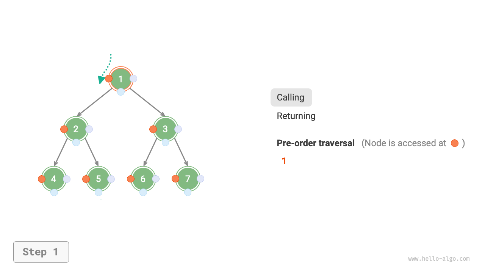{ class="animation-figure" }

=== "<2>"
    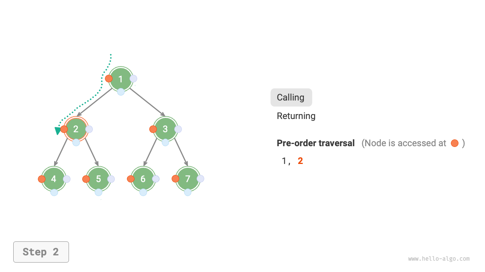{ class="animation-figure" }

=== "<3>"
    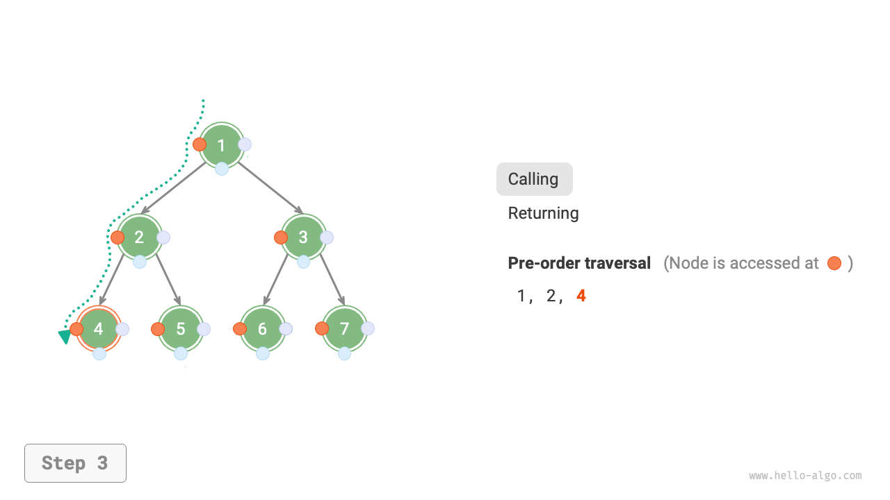{ class="animation-figure" }

=== "<4>"
    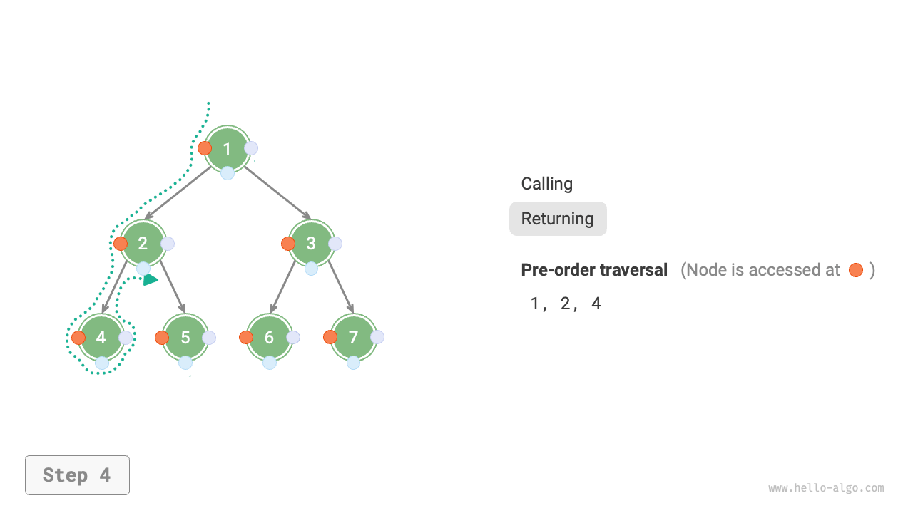{ class="animation-figure" }

=== "<5>"
    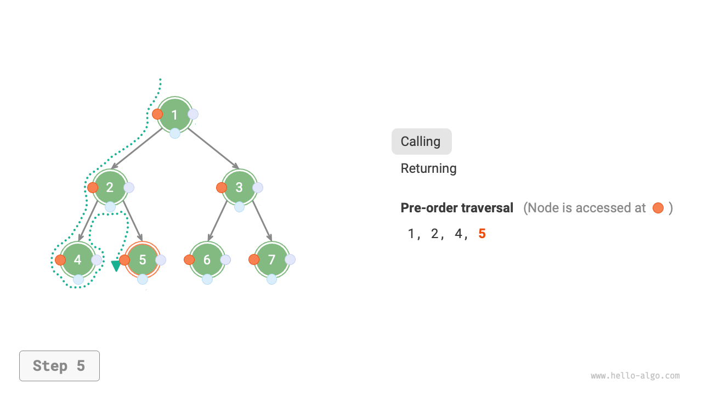{ class="animation-figure" }

=== "<6>"
    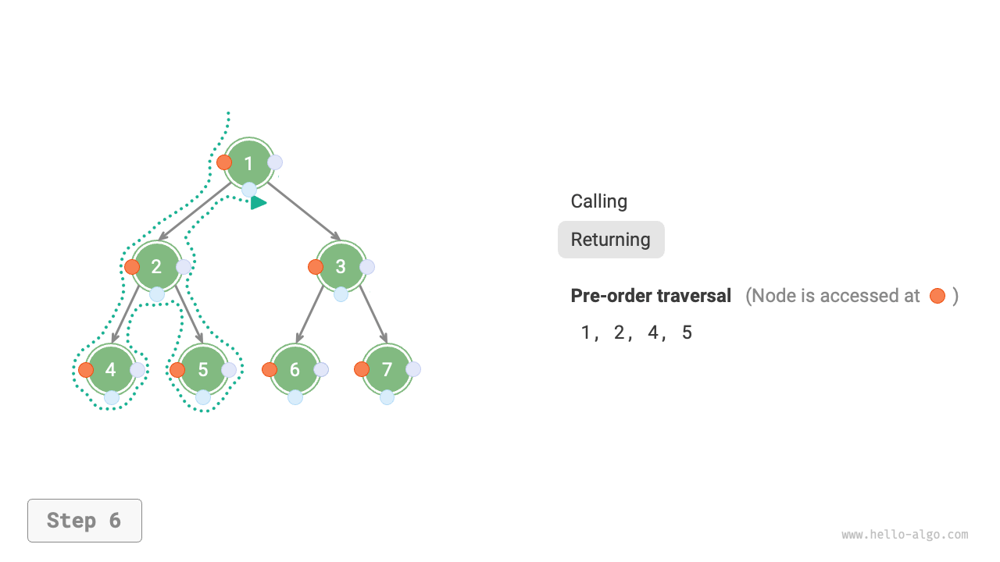{ class="animation-figure" }

=== "<7>"
    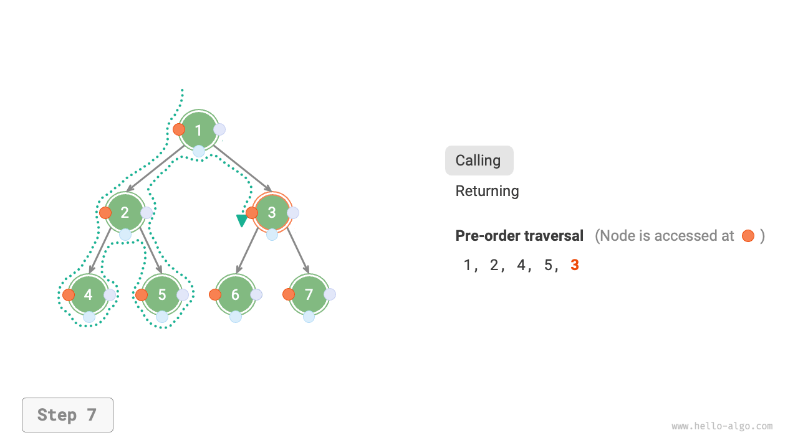{ class="animation-figure" }

=== "<8>"
    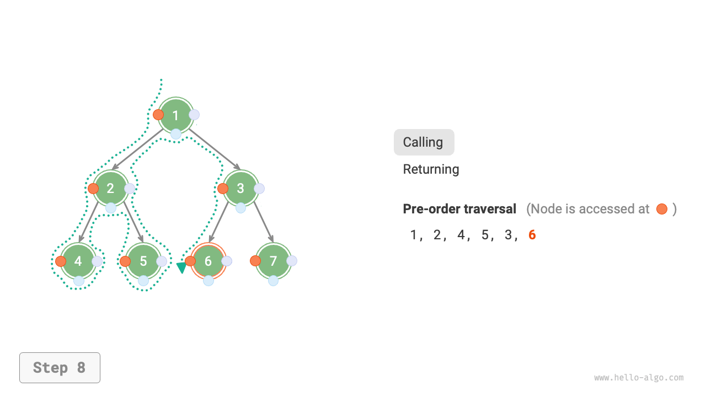{ class="animation-figure" }

=== "<9>"
    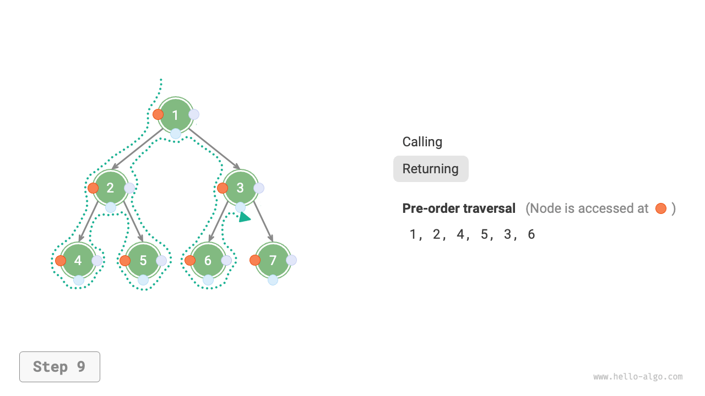{ class="animation-figure" }

=== "<10>"
    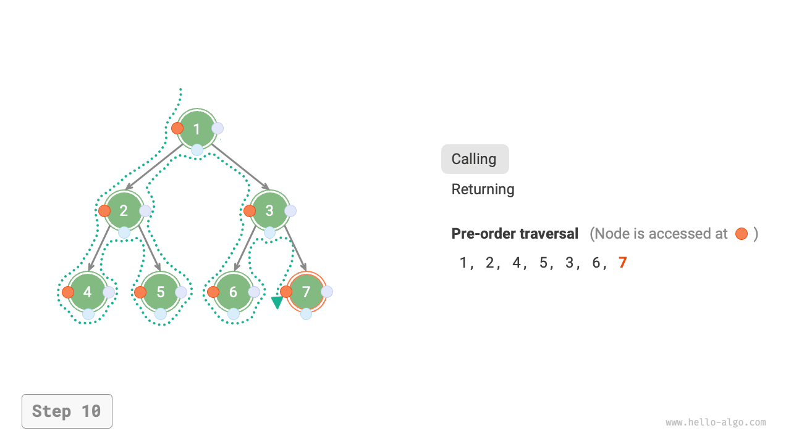{ class="animation-figure" }

=== "<11>"
    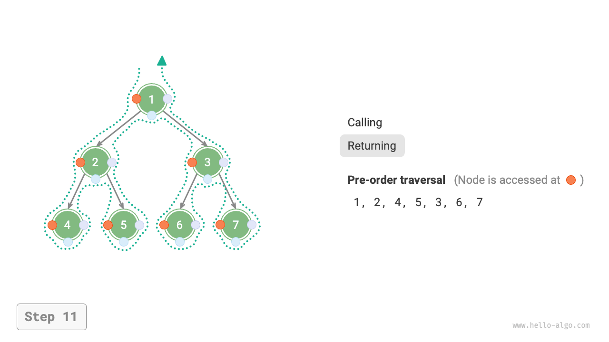{ class="animation-figure" }

<p align="center"> 図 7-11 &nbsp; 先行順走査の再帰過程 </p>

### 2. &nbsp; 計算量

- **時間計算量は $O(n)$** ：すべてのノードを1回ずつ訪問するため、計算量は $O(n)$ です。
- **空間計算量は $O(n)$** ：最悪の場合、すなわち木が連結リストに退化したとき、再帰の深さは $n$ に達し、システムは $O(n)$ のスタックフレーム空間を使用します。
