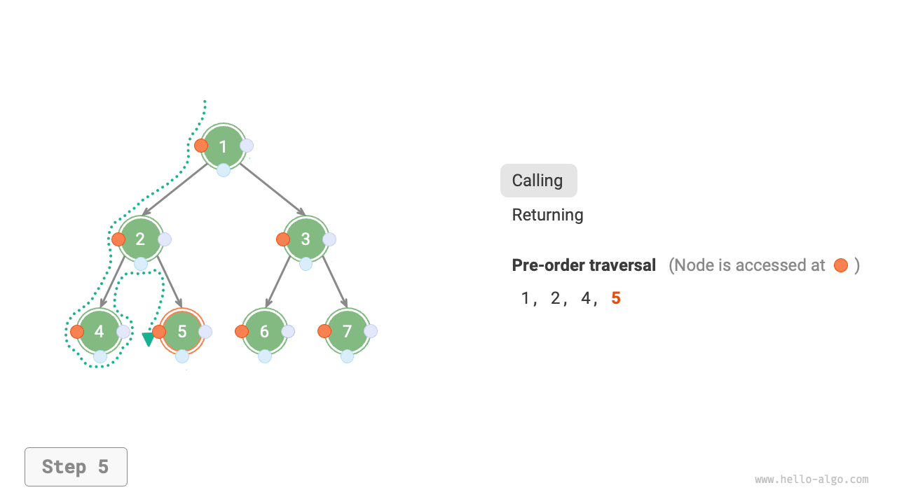
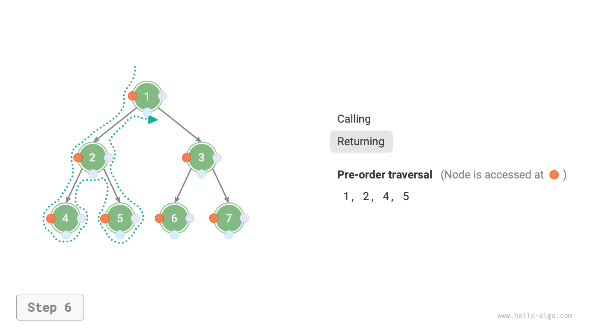
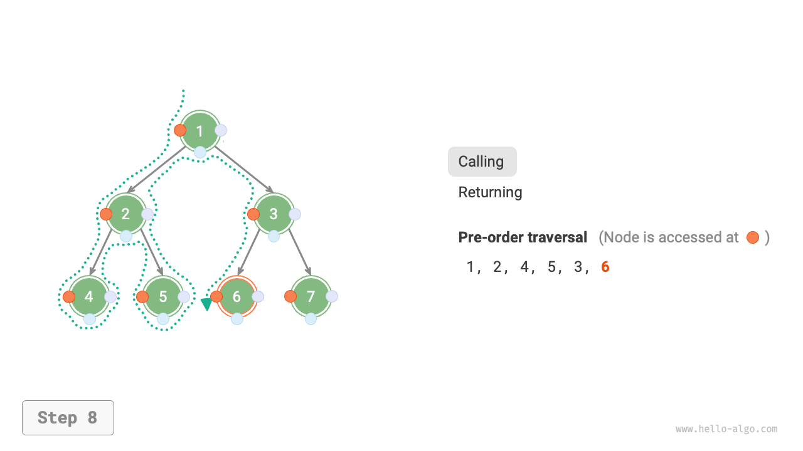

# 二分木の走査

物理的構造の観点から見ると、木は連結リストに基づくデータ構造です。したがって、その走査方法はポインタを通してノードに一つずつアクセスすることを含みます。しかし、木は非線形データ構造であるため、木の走査は連結リストの走査よりも複雑で、検索アルゴリズムの支援が必要です。

二分木の一般的な走査方法には、レベル順走査、前順走査、中順走査、後順走査があります。

## レベル順走査

下図に示すように、<u>レベル順走査</u>は二分木を上から下へ、層ごとに走査します。各レベル内では、左から右へノードを訪問します。

レベル順走査は本質的に<u>幅優先走査</u>の一種で、<u>幅優先探索（BFS）</u>とも呼ばれ、「周囲に向かって外向きに拡張する」層ごとの走査方法を体現しています。


### コード実装

幅優先走査は通常「キュー」の助けを借りて実装されます。キューは「先入れ先出し」の規則に従い、幅優先走査は「層ごとの進行」規則に従います。両者の基本的な考え方は一致しています。実装コードは以下の通りです：

```src
[file]{binary_tree_bfs}-[class]{}-[func]{level_order}
```

### 計算量分析

- **時間計算量は$O(n)$**: すべてのノードが一度ずつ訪問され、$O(n)$の時間がかかります。ここで$n$はノード数です。
- **空間計算量は$O(n)$**: 最悪の場合、つまり完全二分木の場合、最下位レベルに走査する前に、キューは最大$(n + 1) / 2$個のノードを同時に含むことができ、$O(n)$の空間を占有します。

## 前順、中順、後順走査

対応して、前順、中順、後順走査はすべて<u>深度優先走査</u>に属し、<u>深度優先探索（DFS）</u>とも呼ばれ、「まず最後まで進み、その後バックトラックして続行する」走査方法を体現しています。

下図は二分木に対して深度優先走査を実行する動作原理を示しています。**深度優先走査は二分木全体を「歩き回る」ようなもので**、各ノードで3つの位置に遭遇し、それらは前順、中順、後順走査に対応しています。


### コード実装

深度優先探索は通常再帰に基づいて実装されます：

```src
[file]{binary_tree_dfs}-[class]{}-[func]{post_order}
```

!!! tip

    深度優先探索は反復に基づいても実装できます。興味のある読者は自分で学習してください。

下図は二分木の前順走査の再帰プロセスを示しており、これは「再帰」と「復帰」という2つの反対の部分に分けることができます。

1. 「再帰」は新しいメソッドを開始することを意味し、プログラムはこのプロセスで次のノードにアクセスします。
2. 「復帰」は関数が戻ることを意味し、現在のノードが完全にアクセスされたことを示します。

=== "<1>"
    

=== "<2>"
    

=== "<3>"
    

=== "<4>"
    

=== "<5>"
    

=== "<6>"
    

=== "<7>"
    

=== "<8>"
    

=== "<9>"
    

=== "<10>"
    

=== "<11>"
    

### 計算量分析

- **時間計算量は$O(n)$**: すべてのノードが一度ずつ訪問され、$O(n)$の時間を使用します。
- **空間計算量は$O(n)$**: 最悪の場合、つまり木が連結リストに退化した場合、再帰の深さは$n$に達し、システムは$O(n)$のスタックフレーム空間を占有します。
