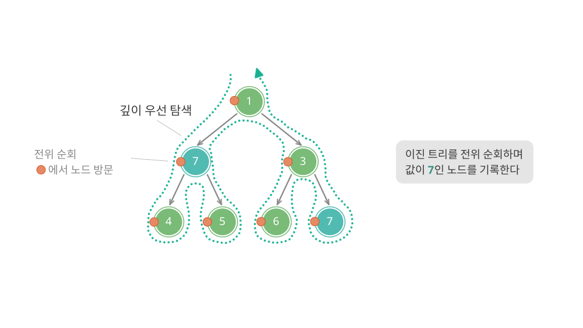
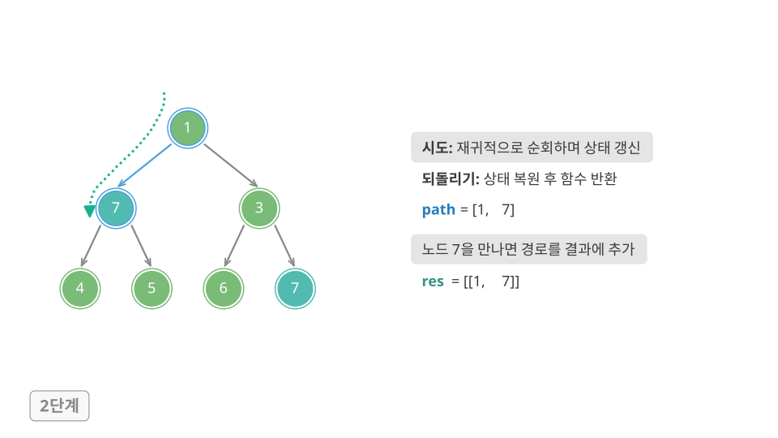
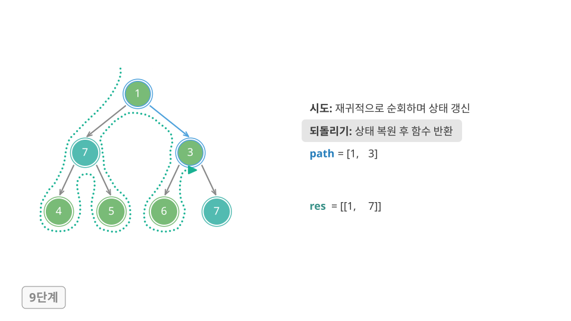
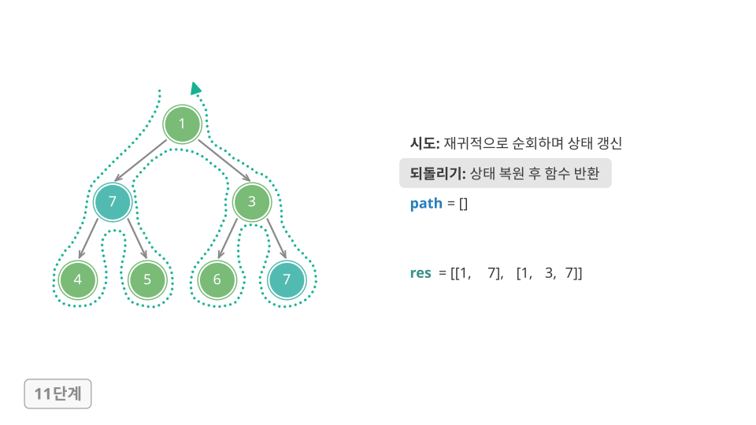
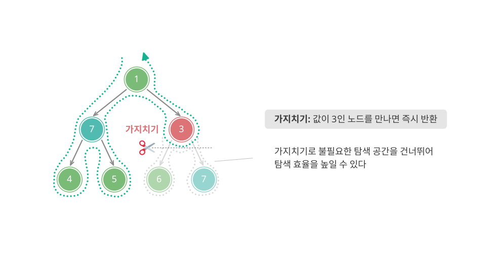
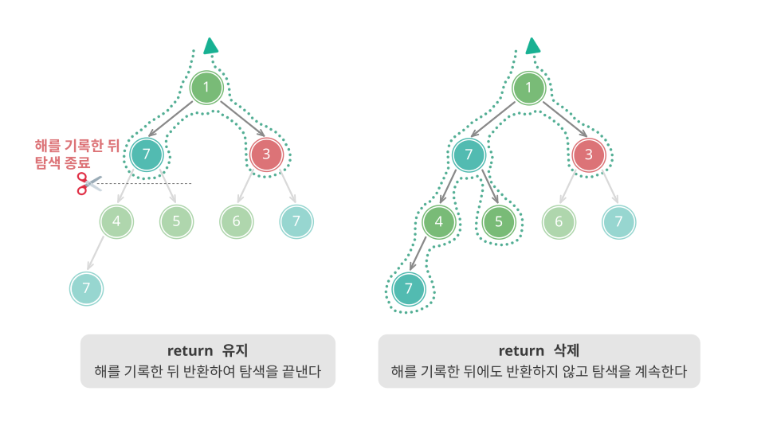

# 13.1 &nbsp; 백트래킹 알고리즘

<u>백트래킹 알고리즘(backtracking algorithm)</u>은 가능한 경우를 빠짐없이 조사하여 문제를 푸는 방법이다. 초기 상태에서 출발해 가능한 해를 모두 탐색하고 조건에 맞는 해를 만나면 기록한다. 해를 찾거나 가능한 선택을 모두 시도해도 해를 찾지 못하면 탐색을 마친다.

백트래킹은 보통 깊이 우선 탐색으로 해 공간을 순회한다. ‘이진 트리’ 장에서 살펴본 전위, 중위, 후위 순회는 모두 깊이 우선 탐색이다. 전위 순회로 백트래킹 문제를 구성해 그 원리를 단계별로 살펴보자.

!!! question "예제 1"

    이진 트리가 주어질 때 값이 $7$인 노드를 모두 찾아 기록하고 노드 리스트를 반환하라.

트리를 전위 순회하면서 현재 노드의 값이 $7$인지 확인한다. 그렇다면 그 노드의 값을 결과 리스트 `res`에 추가한다. 그림과 코드로 살펴보자.

=== "Python"

    ```python title="preorder_traversal_i_compact.py"
    def pre_order(root: TreeNode):
        """전위 순회: 예제 1"""
        if root is None:
            return
        if root.val == 7:
            # 해를 기록한다
            res.append(root)
        pre_order(root.left)
        pre_order(root.right)
    ```

=== "C++"

    ```cpp title="preorder_traversal_i_compact.cpp"
    /* 전위 순회: 예제 1 */
    void preOrder(TreeNode *root) {
        if (root == nullptr) {
            return;
        }
        if (root->val == 7) {
            // 해를 기록한다
            res.push_back(root);
        }
        preOrder(root->left);
        preOrder(root->right);
    }
    ```

=== "Java"

    ```java title="preorder_traversal_i_compact.java"
    /* 전위 순회: 예제 1 */
    void preOrder(TreeNode root) {
        if (root == null) {
            return;
        }
        if (root.val == 7) {
            // 해를 기록한다
            res.add(root);
        }
        preOrder(root.left);
        preOrder(root.right);
    }
    ```

=== "C#"

    ```csharp title="preorder_traversal_i_compact.cs"
    /* 전위 순회: 예제 1 */
    void PreOrder(TreeNode? root) {
        if (root == null) {
            return;
        }
        if (root.val == 7) {
            // 해를 기록한다
            res.Add(root);
        }
        PreOrder(root.left);
        PreOrder(root.right);
    }
    ```

=== "Go"

    ```go title="preorder_traversal_i_compact.go"
    /* 전위 순회: 예제 1 */
    func preOrderI(root *TreeNode, res *[]*TreeNode) {
        if root == nil {
            return
        }
        if (root.Val).(int) == 7 {
            // 해를 기록한다
            *res = append(*res, root)
        }
        preOrderI(root.Left, res)
        preOrderI(root.Right, res)
    }
    ```

=== "Swift"

    ```swift title="preorder_traversal_i_compact.swift"
    /* 전위 순회: 예제 1 */
    func preOrder(root: TreeNode?) {
        guard let root = root else {
            return
        }
        if root.val == 7 {
            // 해를 기록한다
            res.append(root)
        }
        preOrder(root: root.left)
        preOrder(root: root.right)
    }
    ```

=== "JS"

    ```javascript title="preorder_traversal_i_compact.js"
    /* 전위 순회: 예제 1 */
    function preOrder(root, res) {
        if (root === null) {
            return;
        }
        if (root.val === 7) {
            // 해를 기록한다
            res.push(root);
        }
        preOrder(root.left, res);
        preOrder(root.right, res);
    }
    ```

=== "TS"

    ```typescript title="preorder_traversal_i_compact.ts"
    /* 전위 순회: 예제 1 */
    function preOrder(root: TreeNode | null, res: TreeNode[]): void {
        if (root === null) {
            return;
        }
        if (root.val === 7) {
            // 해를 기록한다
            res.push(root);
        }
        preOrder(root.left, res);
        preOrder(root.right, res);
    }
    ```

=== "Dart"

    ```dart title="preorder_traversal_i_compact.dart"
    /* 전위 순회: 예제 1 */
    void preOrder(TreeNode? root, List<TreeNode> res) {
      if (root == null) {
        return;
      }
      if (root.val == 7) {
        // 해를 기록한다
        res.add(root);
      }
      preOrder(root.left, res);
      preOrder(root.right, res);
    }
    ```

=== "Rust"

    ```rust title="preorder_traversal_i_compact.rs"
    /* 전위 순회: 예제 1 */
    fn pre_order(res: &mut Vec<Rc<RefCell<TreeNode>>>, root: Option<&Rc<RefCell<TreeNode>>>) {
        if root.is_none() {
            return;
        }
        if let Some(node) = root {
            if node.borrow().val == 7 {
                // 해를 기록한다
                res.push(node.clone());
            }
            pre_order(res, node.borrow().left.as_ref());
            pre_order(res, node.borrow().right.as_ref());
        }
    }
    ```

=== "C"

    ```c title="preorder_traversal_i_compact.c"
    /* 전위 순회: 예제 1 */
    void preOrder(TreeNode *root) {
        if (root == NULL) {
            return;
        }
        if (root->val == 7) {
            // 해를 기록한다
            res[resSize++] = root;
        }
        preOrder(root->left);
        preOrder(root->right);
    }
    ```

=== "Kotlin"

    ```kotlin title="preorder_traversal_i_compact.kt"
    /* 전위 순회: 예제 1 */
    fun preOrder(root: TreeNode?) {
        if (root == null) {
            return
        }
        if (root._val == 7) {
            // 해를 기록한다
            res!!.add(root)
        }
        preOrder(root.left)
        preOrder(root.right)
    }
    ```

=== "Ruby"

    ```ruby title="preorder_traversal_i_compact.rb"
    ### 전위 순회: 예제 1 ###
    def pre_order(root)
      return unless root

      # 해를 기록한다
      $res << root if root.val == 7

      pre_order(root.left)
      pre_order(root.right)
    end
    ```

??? pythontutor "실행 과정 시각화"

    <div style="height: 549px; width: 100%;"><iframe class="pythontutor-iframe" title="실행 과정 시각화" src="https://pythontutor.com/iframe-embed.html#code=class%20TreeNode%3A%0A%20%20%20%20%22%22%22%EC%9D%B4%EC%A7%84%20%ED%8A%B8%EB%A6%AC%20%EB%85%B8%EB%93%9C%20%ED%81%B4%EB%9E%98%EC%8A%A4%22%22%22%0A%0A%20%20%20%20def%20__init__%28self,%20val%3A%20int%20%3D%200%29%3A%0A%20%20%20%20%20%20%20%20self.val%3A%20int%20%3D%20val%20%20%23%20%EB%85%B8%EB%93%9C%20%EA%B0%92%0A%20%20%20%20%20%20%20%20self.left%3A%20TreeNode%20%7C%20None%20%3D%20None%20%20%23%20%EC%99%BC%EC%AA%BD%20%EC%9E%90%EC%8B%9D%20%EC%B0%B8%EC%A1%B0%0A%20%20%20%20%20%20%20%20self.right%3A%20TreeNode%20%7C%20None%20%3D%20None%20%20%23%20%EC%98%A4%EB%A5%B8%EC%AA%BD%20%EC%9E%90%EC%8B%9D%20%EC%B0%B8%EC%A1%B0%0A%0Adef%20list_to_tree_dfs%28arr%3A%20list%5Bint%5D,%20i%3A%20int%29%20-%3E%20TreeNode%20%7C%20None%3A%0A%20%20%20%20%22%22%22%EB%A6%AC%EC%8A%A4%ED%8A%B8%EB%A5%BC%20%EC%9D%B4%EC%A7%84%20%ED%8A%B8%EB%A6%AC%EB%A1%9C%20%EC%97%AD%EC%A7%81%EB%A0%AC%ED%99%94%ED%95%9C%EB%8B%A4%28%EC%9E%AC%EA%B7%80%29%22%22%22%0A%20%20%20%20%23%20%EC%9D%B8%EB%8D%B1%EC%8A%A4%EA%B0%80%20%EB%B0%B0%EC%97%B4%20%EB%B2%94%EC%9C%84%EB%A5%BC%20%EB%B2%97%EC%96%B4%EB%82%98%EA%B1%B0%EB%82%98%20%ED%95%B4%EB%8B%B9%20%EC%9B%90%EC%86%8C%EA%B0%80%20None%EC%9D%B4%EB%A9%B4%20None%EC%9D%84%20%EB%B0%98%ED%99%98%ED%95%9C%EB%8B%A4%0A%20%20%20%20if%20i%20%3C%200%20or%20i%20%3E%3D%20len%28arr%29%20or%20arr%5Bi%5D%20is%20None%3A%0A%20%20%20%20%20%20%20%20return%20None%0A%20%20%20%20%23%20%ED%98%84%EC%9E%AC%20%EB%85%B8%EB%93%9C%EB%A5%BC%20%EC%83%9D%EC%84%B1%ED%95%9C%EB%8B%A4%0A%20%20%20%20root%20%3D%20TreeNode%28arr%5Bi%5D%29%0A%20%20%20%20%23%20%EC%99%BC%EC%AA%BD%EA%B3%BC%20%EC%98%A4%EB%A5%B8%EC%AA%BD%20%EC%84%9C%EB%B8%8C%ED%8A%B8%EB%A6%AC%EB%A5%BC%20%EC%9E%AC%EA%B7%80%EC%A0%81%EC%9C%BC%EB%A1%9C%20%EA%B5%AC%EC%84%B1%ED%95%9C%EB%8B%A4%0A%20%20%20%20root.left%20%3D%20list_to_tree_dfs%28arr,%202%20%2A%20i%20%2B%201%29%0A%20%20%20%20root.right%20%3D%20list_to_tree_dfs%28arr,%202%20%2A%20i%20%2B%202%29%0A%20%20%20%20return%20root%0A%0Adef%20list_to_tree%28arr%3A%20list%5Bint%5D%29%20-%3E%20TreeNode%20%7C%20None%3A%0A%20%20%20%20%22%22%22%EB%A6%AC%EC%8A%A4%ED%8A%B8%EB%A5%BC%20%EC%9D%B4%EC%A7%84%20%ED%8A%B8%EB%A6%AC%EB%A1%9C%20%EC%97%AD%EC%A7%81%EB%A0%AC%ED%99%94%ED%95%9C%EB%8B%A4%22%22%22%0A%20%20%20%20return%20list_to_tree_dfs%28arr,%200%29%0A%0A%0Adef%20pre_order%28root%3A%20TreeNode%29%3A%0A%20%20%20%20%22%22%22%EC%A0%84%EC%9C%84%20%EC%88%9C%ED%9A%8C%3A%20%EC%98%88%EC%A0%9C%201%22%22%22%0A%20%20%20%20if%20root%20is%20None%3A%0A%20%20%20%20%20%20%20%20return%0A%20%20%20%20if%20root.val%20%3D%3D%207%3A%0A%20%20%20%20%20%20%20%20%23%20%ED%95%B4%EB%A5%BC%20%EA%B8%B0%EB%A1%9D%ED%95%9C%EB%8B%A4%0A%20%20%20%20%20%20%20%20res.append%28root%29%0A%20%20%20%20pre_order%28root.left%29%0A%20%20%20%20pre_order%28root.right%29%0A%0A%0A%22%22%22Driver%20Code%22%22%22%0Aif%20__name__%20%3D%3D%20%22__main__%22%3A%0A%20%20%20%20root%20%3D%20list_to_tree%28%5B1,%207,%203,%204,%205,%206,%207%5D%29%0A%0A%20%20%20%20%23%20%EC%A0%84%EC%9C%84%20%EC%88%9C%ED%9A%8C%0A%20%20%20%20res%20%3D%20list%5BTreeNode%5D%28%29%0A%20%20%20%20pre_order%28root%29%0A%0A%20%20%20%20print%28%22%5Cn%EA%B0%92%EC%9D%B4%207%EC%9D%B8%20%EB%AA%A8%EB%93%A0%20%EB%85%B8%EB%93%9C%20%EC%B6%9C%EB%A0%A5%22%29%0A%20%20%20%20print%28%5Bnode.val%20for%20node%20in%20res%5D%29&codeDivHeight=472&codeDivWidth=350&cumulative=false&curInstr=126&heapPrimitives=nevernest&origin=opt-frontend.js&py=311&rawInputLstJSON=%5B%5D&textReferences=false"> </iframe></div>
    <div style="margin-top: 5px;"><a href="https://pythontutor.com/iframe-embed.html#code=class%20TreeNode%3A%0A%20%20%20%20%22%22%22%EC%9D%B4%EC%A7%84%20%ED%8A%B8%EB%A6%AC%20%EB%85%B8%EB%93%9C%20%ED%81%B4%EB%9E%98%EC%8A%A4%22%22%22%0A%0A%20%20%20%20def%20__init__%28self,%20val%3A%20int%20%3D%200%29%3A%0A%20%20%20%20%20%20%20%20self.val%3A%20int%20%3D%20val%20%20%23%20%EB%85%B8%EB%93%9C%20%EA%B0%92%0A%20%20%20%20%20%20%20%20self.left%3A%20TreeNode%20%7C%20None%20%3D%20None%20%20%23%20%EC%99%BC%EC%AA%BD%20%EC%9E%90%EC%8B%9D%20%EC%B0%B8%EC%A1%B0%0A%20%20%20%20%20%20%20%20self.right%3A%20TreeNode%20%7C%20None%20%3D%20None%20%20%23%20%EC%98%A4%EB%A5%B8%EC%AA%BD%20%EC%9E%90%EC%8B%9D%20%EC%B0%B8%EC%A1%B0%0A%0Adef%20list_to_tree_dfs%28arr%3A%20list%5Bint%5D,%20i%3A%20int%29%20-%3E%20TreeNode%20%7C%20None%3A%0A%20%20%20%20%22%22%22%EB%A6%AC%EC%8A%A4%ED%8A%B8%EB%A5%BC%20%EC%9D%B4%EC%A7%84%20%ED%8A%B8%EB%A6%AC%EB%A1%9C%20%EC%97%AD%EC%A7%81%EB%A0%AC%ED%99%94%ED%95%9C%EB%8B%A4%28%EC%9E%AC%EA%B7%80%29%22%22%22%0A%20%20%20%20%23%20%EC%9D%B8%EB%8D%B1%EC%8A%A4%EA%B0%80%20%EB%B0%B0%EC%97%B4%20%EB%B2%94%EC%9C%84%EB%A5%BC%20%EB%B2%97%EC%96%B4%EB%82%98%EA%B1%B0%EB%82%98%20%ED%95%B4%EB%8B%B9%20%EC%9B%90%EC%86%8C%EA%B0%80%20None%EC%9D%B4%EB%A9%B4%20None%EC%9D%84%20%EB%B0%98%ED%99%98%ED%95%9C%EB%8B%A4%0A%20%20%20%20if%20i%20%3C%200%20or%20i%20%3E%3D%20len%28arr%29%20or%20arr%5Bi%5D%20is%20None%3A%0A%20%20%20%20%20%20%20%20return%20None%0A%20%20%20%20%23%20%ED%98%84%EC%9E%AC%20%EB%85%B8%EB%93%9C%EB%A5%BC%20%EC%83%9D%EC%84%B1%ED%95%9C%EB%8B%A4%0A%20%20%20%20root%20%3D%20TreeNode%28arr%5Bi%5D%29%0A%20%20%20%20%23%20%EC%99%BC%EC%AA%BD%EA%B3%BC%20%EC%98%A4%EB%A5%B8%EC%AA%BD%20%EC%84%9C%EB%B8%8C%ED%8A%B8%EB%A6%AC%EB%A5%BC%20%EC%9E%AC%EA%B7%80%EC%A0%81%EC%9C%BC%EB%A1%9C%20%EA%B5%AC%EC%84%B1%ED%95%9C%EB%8B%A4%0A%20%20%20%20root.left%20%3D%20list_to_tree_dfs%28arr,%202%20%2A%20i%20%2B%201%29%0A%20%20%20%20root.right%20%3D%20list_to_tree_dfs%28arr,%202%20%2A%20i%20%2B%202%29%0A%20%20%20%20return%20root%0A%0Adef%20list_to_tree%28arr%3A%20list%5Bint%5D%29%20-%3E%20TreeNode%20%7C%20None%3A%0A%20%20%20%20%22%22%22%EB%A6%AC%EC%8A%A4%ED%8A%B8%EB%A5%BC%20%EC%9D%B4%EC%A7%84%20%ED%8A%B8%EB%A6%AC%EB%A1%9C%20%EC%97%AD%EC%A7%81%EB%A0%AC%ED%99%94%ED%95%9C%EB%8B%A4%22%22%22%0A%20%20%20%20return%20list_to_tree_dfs%28arr,%200%29%0A%0A%0Adef%20pre_order%28root%3A%20TreeNode%29%3A%0A%20%20%20%20%22%22%22%EC%A0%84%EC%9C%84%20%EC%88%9C%ED%9A%8C%3A%20%EC%98%88%EC%A0%9C%201%22%22%22%0A%20%20%20%20if%20root%20is%20None%3A%0A%20%20%20%20%20%20%20%20return%0A%20%20%20%20if%20root.val%20%3D%3D%207%3A%0A%20%20%20%20%20%20%20%20%23%20%ED%95%B4%EB%A5%BC%20%EA%B8%B0%EB%A1%9D%ED%95%9C%EB%8B%A4%0A%20%20%20%20%20%20%20%20res.append%28root%29%0A%20%20%20%20pre_order%28root.left%29%0A%20%20%20%20pre_order%28root.right%29%0A%0A%0A%22%22%22Driver%20Code%22%22%22%0Aif%20__name__%20%3D%3D%20%22__main__%22%3A%0A%20%20%20%20root%20%3D%20list_to_tree%28%5B1,%207,%203,%204,%205,%206,%207%5D%29%0A%0A%20%20%20%20%23%20%EC%A0%84%EC%9C%84%20%EC%88%9C%ED%9A%8C%0A%20%20%20%20res%20%3D%20list%5BTreeNode%5D%28%29%0A%20%20%20%20pre_order%28root%29%0A%0A%20%20%20%20print%28%22%5Cn%EA%B0%92%EC%9D%B4%207%EC%9D%B8%20%EB%AA%A8%EB%93%A0%20%EB%85%B8%EB%93%9C%20%EC%B6%9C%EB%A0%A5%22%29%0A%20%20%20%20print%28%5Bnode.val%20for%20node%20in%20res%5D%29&codeDivHeight=800&codeDivWidth=600&cumulative=false&curInstr=126&heapPrimitives=nevernest&origin=opt-frontend.js&py=311&rawInputLstJSON=%5B%5D&textReferences=false" target="_blank" rel="noopener noreferrer">전체 화면으로 보기 ></a></div>

{ class="animation-figure" }

<p align="center"> 그림 13-1 &nbsp; 전위 순회로 노드 찾기 </p>

## 13.1.1 &nbsp; 시도와 되돌리기

**백트래킹이라는 이름은 해 공간을 탐색할 때 ‘시도’와 ‘되돌리기’를 사용한다는 데서 왔다**. 더 나아갈 수 없거나 조건을 만족하는 해를 얻을 수 없는 상태에 이르면 직전 선택을 취소한다. 그런 다음 이전 상태에서 다른 선택을 시도한다.

예제 1에서는 각 노드를 방문하는 것이 ‘시도’이고, 리프 노드를 지나거나 부모 노드로 돌아갈 때의 `return`이 ‘되돌리기’에 해당한다.

여기서 **되돌리기는 함수 반환보다 넓은 개념이다**. 예제 1을 조금 확장해 보자.

!!! question "예제 2"

    이진 트리에서 값이 $7$인 노드를 모두 찾고, **루트 노드에서 각 노드까지의 경로를 반환하라**.

예제 1의 코드에 리스트 `path`를 추가해 방문한 노드의 경로를 기록한다. 값이 $7$인 노드를 방문하면 `path`를 복사해 결과 리스트 `res`에 추가한다. 순회가 끝나면 `res`에 모든 해가 들어 있다. 코드는 다음과 같다.

=== "Python"

    ```python title="preorder_traversal_ii_compact.py"
    def pre_order(root: TreeNode):
        """전위 순회: 예제 2"""
        if root is None:
            return
        # 시도
        path.append(root)
        if root.val == 7:
            # 해를 기록한다
            res.append(list(path))
        pre_order(root.left)
        pre_order(root.right)
        # 되돌리기
        path.pop()
    ```

=== "C++"

    ```cpp title="preorder_traversal_ii_compact.cpp"
    /* 전위 순회: 예제 2 */
    void preOrder(TreeNode *root) {
        if (root == nullptr) {
            return;
        }
        // 시도
        path.push_back(root);
        if (root->val == 7) {
            // 해를 기록한다
            res.push_back(path);
        }
        preOrder(root->left);
        preOrder(root->right);
        // 되돌리기
        path.pop_back();
    }
    ```

=== "Java"

    ```java title="preorder_traversal_ii_compact.java"
    /* 전위 순회: 예제 2 */
    void preOrder(TreeNode root) {
        if (root == null) {
            return;
        }
        // 시도
        path.add(root);
        if (root.val == 7) {
            // 해를 기록한다
            res.add(new ArrayList<>(path));
        }
        preOrder(root.left);
        preOrder(root.right);
        // 되돌리기
        path.remove(path.size() - 1);
    }
    ```

=== "C#"

    ```csharp title="preorder_traversal_ii_compact.cs"
    /* 전위 순회: 예제 2 */
    void PreOrder(TreeNode? root) {
        if (root == null) {
            return;
        }
        // 시도
        path.Add(root);
        if (root.val == 7) {
            // 해를 기록한다
            res.Add(new List<TreeNode>(path));
        }
        PreOrder(root.left);
        PreOrder(root.right);
        // 되돌리기
        path.RemoveAt(path.Count - 1);
    }
    ```

=== "Go"

    ```go title="preorder_traversal_ii_compact.go"
    /* 전위 순회: 예제 2 */
    func preOrderII(root *TreeNode, res *[][]*TreeNode, path *[]*TreeNode) {
        if root == nil {
            return
        }
        // 시도
        *path = append(*path, root)
        if root.Val.(int) == 7 {
            // 해를 기록한다
            *res = append(*res, append([]*TreeNode{}, *path...))
        }
        preOrderII(root.Left, res, path)
        preOrderII(root.Right, res, path)
        // 되돌리기
        *path = (*path)[:len(*path)-1]
    }
    ```

=== "Swift"

    ```swift title="preorder_traversal_ii_compact.swift"
    /* 전위 순회: 예제 2 */
    func preOrder(root: TreeNode?) {
        guard let root = root else {
            return
        }
        // 시도
        path.append(root)
        if root.val == 7 {
            // 해를 기록한다
            res.append(path)
        }
        preOrder(root: root.left)
        preOrder(root: root.right)
        // 되돌리기
        path.removeLast()
    }
    ```

=== "JS"

    ```javascript title="preorder_traversal_ii_compact.js"
    /* 전위 순회: 예제 2 */
    function preOrder(root, path, res) {
        if (root === null) {
            return;
        }
        // 시도
        path.push(root);
        if (root.val === 7) {
            // 해를 기록한다
            res.push([...path]);
        }
        preOrder(root.left, path, res);
        preOrder(root.right, path, res);
        // 되돌리기
        path.pop();
    }
    ```

=== "TS"

    ```typescript title="preorder_traversal_ii_compact.ts"
    /* 전위 순회: 예제 2 */
    function preOrder(
        root: TreeNode | null,
        path: TreeNode[],
        res: TreeNode[][]
    ): void {
        if (root === null) {
            return;
        }
        // 시도
        path.push(root);
        if (root.val === 7) {
            // 해를 기록한다
            res.push([...path]);
        }
        preOrder(root.left, path, res);
        preOrder(root.right, path, res);
        // 되돌리기
        path.pop();
    }
    ```

=== "Dart"

    ```dart title="preorder_traversal_ii_compact.dart"
    /* 전위 순회: 예제 2 */
    void preOrder(
      TreeNode? root,
      List<TreeNode> path,
      List<List<TreeNode>> res,
    ) {
      if (root == null) {
        return;
      }

      // 시도
      path.add(root);
      if (root.val == 7) {
        // 해를 기록한다
        res.add(List.from(path));
      }
      preOrder(root.left, path, res);
      preOrder(root.right, path, res);
      // 되돌리기
      path.removeLast();
    }
    ```

=== "Rust"

    ```rust title="preorder_traversal_ii_compact.rs"
    /* 전위 순회: 예제 2 */
    fn pre_order(
        res: &mut Vec<Vec<Rc<RefCell<TreeNode>>>>,
        path: &mut Vec<Rc<RefCell<TreeNode>>>,
        root: Option<&Rc<RefCell<TreeNode>>>,
    ) {
        if root.is_none() {
            return;
        }
        if let Some(node) = root {
            // 시도
            path.push(node.clone());
            if node.borrow().val == 7 {
                // 해를 기록한다
                res.push(path.clone());
            }
            pre_order(res, path, node.borrow().left.as_ref());
            pre_order(res, path, node.borrow().right.as_ref());
            // 되돌리기
            path.pop();
        }
    }
    ```

=== "C"

    ```c title="preorder_traversal_ii_compact.c"
    /* 전위 순회: 예제 2 */
    void preOrder(TreeNode *root) {
        if (root == NULL) {
            return;
        }
        // 시도
        path[pathSize++] = root;
        if (root->val == 7) {
            // 해를 기록한다
            for (int i = 0; i < pathSize; ++i) {
                res[resSize][i] = path[i];
            }
            resSize++;
        }
        preOrder(root->left);
        preOrder(root->right);
        // 되돌리기
        pathSize--;
    }
    ```

=== "Kotlin"

    ```kotlin title="preorder_traversal_ii_compact.kt"
    /* 전위 순회: 예제 2 */
    fun preOrder(root: TreeNode?) {
        if (root == null) {
            return
        }
        // 시도
        path!!.add(root)
        if (root._val == 7) {
            // 해를 기록한다
            res!!.add(path!!.toMutableList())
        }
        preOrder(root.left)
        preOrder(root.right)
        // 되돌리기
        path!!.removeAt(path!!.size - 1)
    }
    ```

=== "Ruby"

    ```ruby title="preorder_traversal_ii_compact.rb"
    ### 전위 순회: 예제 2 ###
    def pre_order(root)
      return unless root

      # 시도
      $path << root

      # 해를 기록한다
      $res << $path.dup if root.val == 7

      pre_order(root.left)
      pre_order(root.right)

      # 되돌리기
      $path.pop
    end
    ```

??? pythontutor "실행 과정 시각화"

    <div style="height: 549px; width: 100%;"><iframe class="pythontutor-iframe" title="실행 과정 시각화" src="https://pythontutor.com/iframe-embed.html#code=class%20TreeNode%3A%0A%20%20%20%20%22%22%22%EC%9D%B4%EC%A7%84%20%ED%8A%B8%EB%A6%AC%20%EB%85%B8%EB%93%9C%20%ED%81%B4%EB%9E%98%EC%8A%A4%22%22%22%0A%0A%20%20%20%20def%20__init__%28self,%20val%3A%20int%20%3D%200%29%3A%0A%20%20%20%20%20%20%20%20self.val%3A%20int%20%3D%20val%20%20%23%20%EB%85%B8%EB%93%9C%20%EA%B0%92%0A%20%20%20%20%20%20%20%20self.left%3A%20TreeNode%20%7C%20None%20%3D%20None%20%20%23%20%EC%99%BC%EC%AA%BD%20%EC%9E%90%EC%8B%9D%20%EC%B0%B8%EC%A1%B0%0A%20%20%20%20%20%20%20%20self.right%3A%20TreeNode%20%7C%20None%20%3D%20None%20%20%23%20%EC%98%A4%EB%A5%B8%EC%AA%BD%20%EC%9E%90%EC%8B%9D%20%EC%B0%B8%EC%A1%B0%0A%0Adef%20list_to_tree_dfs%28arr%3A%20list%5Bint%5D,%20i%3A%20int%29%20-%3E%20TreeNode%20%7C%20None%3A%0A%20%20%20%20%22%22%22%EB%A6%AC%EC%8A%A4%ED%8A%B8%EB%A5%BC%20%EC%9D%B4%EC%A7%84%20%ED%8A%B8%EB%A6%AC%EB%A1%9C%20%EC%97%AD%EC%A7%81%EB%A0%AC%ED%99%94%ED%95%9C%EB%8B%A4%28%EC%9E%AC%EA%B7%80%29%22%22%22%0A%20%20%20%20%23%20%EC%9D%B8%EB%8D%B1%EC%8A%A4%EA%B0%80%20%EB%B0%B0%EC%97%B4%20%EB%B2%94%EC%9C%84%EB%A5%BC%20%EB%B2%97%EC%96%B4%EB%82%98%EA%B1%B0%EB%82%98%20%ED%95%B4%EB%8B%B9%20%EC%9B%90%EC%86%8C%EA%B0%80%20None%EC%9D%B4%EB%A9%B4%20None%EC%9D%84%20%EB%B0%98%ED%99%98%ED%95%9C%EB%8B%A4%0A%20%20%20%20if%20i%20%3C%200%20or%20i%20%3E%3D%20len%28arr%29%20or%20arr%5Bi%5D%20is%20None%3A%0A%20%20%20%20%20%20%20%20return%20None%0A%20%20%20%20%23%20%ED%98%84%EC%9E%AC%20%EB%85%B8%EB%93%9C%EB%A5%BC%20%EC%83%9D%EC%84%B1%ED%95%9C%EB%8B%A4%0A%20%20%20%20root%20%3D%20TreeNode%28arr%5Bi%5D%29%0A%20%20%20%20%23%20%EC%99%BC%EC%AA%BD%EA%B3%BC%20%EC%98%A4%EB%A5%B8%EC%AA%BD%20%EC%84%9C%EB%B8%8C%ED%8A%B8%EB%A6%AC%EB%A5%BC%20%EC%9E%AC%EA%B7%80%EC%A0%81%EC%9C%BC%EB%A1%9C%20%EA%B5%AC%EC%84%B1%ED%95%9C%EB%8B%A4%0A%20%20%20%20root.left%20%3D%20list_to_tree_dfs%28arr,%202%20%2A%20i%20%2B%201%29%0A%20%20%20%20root.right%20%3D%20list_to_tree_dfs%28arr,%202%20%2A%20i%20%2B%202%29%0A%20%20%20%20return%20root%0A%0Adef%20list_to_tree%28arr%3A%20list%5Bint%5D%29%20-%3E%20TreeNode%20%7C%20None%3A%0A%20%20%20%20%22%22%22%EB%A6%AC%EC%8A%A4%ED%8A%B8%EB%A5%BC%20%EC%9D%B4%EC%A7%84%20%ED%8A%B8%EB%A6%AC%EB%A1%9C%20%EC%97%AD%EC%A7%81%EB%A0%AC%ED%99%94%ED%95%9C%EB%8B%A4%22%22%22%0A%20%20%20%20return%20list_to_tree_dfs%28arr,%200%29%0A%0A%0Adef%20pre_order%28root%3A%20TreeNode%29%3A%0A%20%20%20%20%22%22%22%EC%A0%84%EC%9C%84%20%EC%88%9C%ED%9A%8C%3A%20%EC%98%88%EC%A0%9C%202%22%22%22%0A%20%20%20%20if%20root%20is%20None%3A%0A%20%20%20%20%20%20%20%20return%0A%20%20%20%20%23%20%EC%8B%9C%EB%8F%84%0A%20%20%20%20path.append%28root%29%0A%20%20%20%20if%20root.val%20%3D%3D%207%3A%0A%20%20%20%20%20%20%20%20%23%20%ED%95%B4%EB%A5%BC%20%EA%B8%B0%EB%A1%9D%ED%95%9C%EB%8B%A4%0A%20%20%20%20%20%20%20%20res.append%28list%28path%29%29%0A%20%20%20%20pre_order%28root.left%29%0A%20%20%20%20pre_order%28root.right%29%0A%20%20%20%20%23%20%EB%90%98%EB%8F%8C%EB%A6%AC%EA%B8%B0%0A%20%20%20%20path.pop%28%29%0A%0A%0A%22%22%22Driver%20Code%22%22%22%0Aif%20__name__%20%3D%3D%20%22__main__%22%3A%0A%20%20%20%20root%20%3D%20list_to_tree%28%5B1,%207,%203,%204,%205,%206,%207%5D%29%0A%0A%20%20%20%20%23%20%EC%A0%84%EC%9C%84%20%EC%88%9C%ED%9A%8C%0A%20%20%20%20path%20%3D%20list%5BTreeNode%5D%28%29%0A%20%20%20%20res%20%3D%20list%5Blist%5BTreeNode%5D%5D%28%29%0A%20%20%20%20pre_order%28root%29%0A%0A%20%20%20%20print%28%22%5Cn%EB%A3%A8%ED%8A%B8%EC%97%90%EC%84%9C%20%EA%B0%92%EC%9D%B4%207%EC%9D%B8%20%EB%85%B8%EB%93%9C%EA%B9%8C%EC%A7%80%EC%9D%98%20%EB%AA%A8%EB%93%A0%20%EA%B2%BD%EB%A1%9C%20%EC%B6%9C%EB%A0%A5%22%29%0A%20%20%20%20for%20path%20in%20res%3A%0A%20%20%20%20%20%20%20%20print%28%5Bnode.val%20for%20node%20in%20path%5D%29&codeDivHeight=472&codeDivWidth=350&cumulative=false&curInstr=126&heapPrimitives=nevernest&origin=opt-frontend.js&py=311&rawInputLstJSON=%5B%5D&textReferences=false"> </iframe></div>
    <div style="margin-top: 5px;"><a href="https://pythontutor.com/iframe-embed.html#code=class%20TreeNode%3A%0A%20%20%20%20%22%22%22%EC%9D%B4%EC%A7%84%20%ED%8A%B8%EB%A6%AC%20%EB%85%B8%EB%93%9C%20%ED%81%B4%EB%9E%98%EC%8A%A4%22%22%22%0A%0A%20%20%20%20def%20__init__%28self,%20val%3A%20int%20%3D%200%29%3A%0A%20%20%20%20%20%20%20%20self.val%3A%20int%20%3D%20val%20%20%23%20%EB%85%B8%EB%93%9C%20%EA%B0%92%0A%20%20%20%20%20%20%20%20self.left%3A%20TreeNode%20%7C%20None%20%3D%20None%20%20%23%20%EC%99%BC%EC%AA%BD%20%EC%9E%90%EC%8B%9D%20%EC%B0%B8%EC%A1%B0%0A%20%20%20%20%20%20%20%20self.right%3A%20TreeNode%20%7C%20None%20%3D%20None%20%20%23%20%EC%98%A4%EB%A5%B8%EC%AA%BD%20%EC%9E%90%EC%8B%9D%20%EC%B0%B8%EC%A1%B0%0A%0Adef%20list_to_tree_dfs%28arr%3A%20list%5Bint%5D,%20i%3A%20int%29%20-%3E%20TreeNode%20%7C%20None%3A%0A%20%20%20%20%22%22%22%EB%A6%AC%EC%8A%A4%ED%8A%B8%EB%A5%BC%20%EC%9D%B4%EC%A7%84%20%ED%8A%B8%EB%A6%AC%EB%A1%9C%20%EC%97%AD%EC%A7%81%EB%A0%AC%ED%99%94%ED%95%9C%EB%8B%A4%28%EC%9E%AC%EA%B7%80%29%22%22%22%0A%20%20%20%20%23%20%EC%9D%B8%EB%8D%B1%EC%8A%A4%EA%B0%80%20%EB%B0%B0%EC%97%B4%20%EB%B2%94%EC%9C%84%EB%A5%BC%20%EB%B2%97%EC%96%B4%EB%82%98%EA%B1%B0%EB%82%98%20%ED%95%B4%EB%8B%B9%20%EC%9B%90%EC%86%8C%EA%B0%80%20None%EC%9D%B4%EB%A9%B4%20None%EC%9D%84%20%EB%B0%98%ED%99%98%ED%95%9C%EB%8B%A4%0A%20%20%20%20if%20i%20%3C%200%20or%20i%20%3E%3D%20len%28arr%29%20or%20arr%5Bi%5D%20is%20None%3A%0A%20%20%20%20%20%20%20%20return%20None%0A%20%20%20%20%23%20%ED%98%84%EC%9E%AC%20%EB%85%B8%EB%93%9C%EB%A5%BC%20%EC%83%9D%EC%84%B1%ED%95%9C%EB%8B%A4%0A%20%20%20%20root%20%3D%20TreeNode%28arr%5Bi%5D%29%0A%20%20%20%20%23%20%EC%99%BC%EC%AA%BD%EA%B3%BC%20%EC%98%A4%EB%A5%B8%EC%AA%BD%20%EC%84%9C%EB%B8%8C%ED%8A%B8%EB%A6%AC%EB%A5%BC%20%EC%9E%AC%EA%B7%80%EC%A0%81%EC%9C%BC%EB%A1%9C%20%EA%B5%AC%EC%84%B1%ED%95%9C%EB%8B%A4%0A%20%20%20%20root.left%20%3D%20list_to_tree_dfs%28arr,%202%20%2A%20i%20%2B%201%29%0A%20%20%20%20root.right%20%3D%20list_to_tree_dfs%28arr,%202%20%2A%20i%20%2B%202%29%0A%20%20%20%20return%20root%0A%0Adef%20list_to_tree%28arr%3A%20list%5Bint%5D%29%20-%3E%20TreeNode%20%7C%20None%3A%0A%20%20%20%20%22%22%22%EB%A6%AC%EC%8A%A4%ED%8A%B8%EB%A5%BC%20%EC%9D%B4%EC%A7%84%20%ED%8A%B8%EB%A6%AC%EB%A1%9C%20%EC%97%AD%EC%A7%81%EB%A0%AC%ED%99%94%ED%95%9C%EB%8B%A4%22%22%22%0A%20%20%20%20return%20list_to_tree_dfs%28arr,%200%29%0A%0A%0Adef%20pre_order%28root%3A%20TreeNode%29%3A%0A%20%20%20%20%22%22%22%EC%A0%84%EC%9C%84%20%EC%88%9C%ED%9A%8C%3A%20%EC%98%88%EC%A0%9C%202%22%22%22%0A%20%20%20%20if%20root%20is%20None%3A%0A%20%20%20%20%20%20%20%20return%0A%20%20%20%20%23%20%EC%8B%9C%EB%8F%84%0A%20%20%20%20path.append%28root%29%0A%20%20%20%20if%20root.val%20%3D%3D%207%3A%0A%20%20%20%20%20%20%20%20%23%20%ED%95%B4%EB%A5%BC%20%EA%B8%B0%EB%A1%9D%ED%95%9C%EB%8B%A4%0A%20%20%20%20%20%20%20%20res.append%28list%28path%29%29%0A%20%20%20%20pre_order%28root.left%29%0A%20%20%20%20pre_order%28root.right%29%0A%20%20%20%20%23%20%EB%90%98%EB%8F%8C%EB%A6%AC%EA%B8%B0%0A%20%20%20%20path.pop%28%29%0A%0A%0A%22%22%22Driver%20Code%22%22%22%0Aif%20__name__%20%3D%3D%20%22__main__%22%3A%0A%20%20%20%20root%20%3D%20list_to_tree%28%5B1,%207,%203,%204,%205,%206,%207%5D%29%0A%0A%20%20%20%20%23%20%EC%A0%84%EC%9C%84%20%EC%88%9C%ED%9A%8C%0A%20%20%20%20path%20%3D%20list%5BTreeNode%5D%28%29%0A%20%20%20%20res%20%3D%20list%5Blist%5BTreeNode%5D%5D%28%29%0A%20%20%20%20pre_order%28root%29%0A%0A%20%20%20%20print%28%22%5Cn%EB%A3%A8%ED%8A%B8%EC%97%90%EC%84%9C%20%EA%B0%92%EC%9D%B4%207%EC%9D%B8%20%EB%85%B8%EB%93%9C%EA%B9%8C%EC%A7%80%EC%9D%98%20%EB%AA%A8%EB%93%A0%20%EA%B2%BD%EB%A1%9C%20%EC%B6%9C%EB%A0%A5%22%29%0A%20%20%20%20for%20path%20in%20res%3A%0A%20%20%20%20%20%20%20%20print%28%5Bnode.val%20for%20node%20in%20path%5D%29&codeDivHeight=800&codeDivWidth=600&cumulative=false&curInstr=126&heapPrimitives=nevernest&origin=opt-frontend.js&py=311&rawInputLstJSON=%5B%5D&textReferences=false" target="_blank" rel="noopener noreferrer">전체 화면으로 보기 ></a></div>

매번 ‘시도’할 때 현재 노드를 `path`에 추가해 경로를 기록한다. ‘되돌리기’ 전에는 `path`의 끝에서 해당 노드를 꺼내 **이번 시도 직전의 상태를 복원한다**.

아래 그림(13-2)처럼 **시도와 되돌리기는 각각 ‘앞으로 나아가기’와 ‘방금 한 일 취소하기’로 이해할 수 있다**. 두 연산은 서로 반대 방향으로 작용한다.

=== "<1>"
    { class="animation-figure" }

=== "<2>"
    { class="animation-figure" }

=== "<3>"
    { class="animation-figure" }

=== "<4>"
    { class="animation-figure" }

=== "<5>"
    { class="animation-figure" }

=== "<6>"
    { class="animation-figure" }

=== "<7>"
    { class="animation-figure" }

=== "<8>"
    { class="animation-figure" }

=== "<9>"
    { class="animation-figure" }

=== "<10>"
    { class="animation-figure" }

=== "<11>"
    { class="animation-figure" }

<p align="center"> 그림 13-2 &nbsp; 시도와 되돌리기 </p>

## 13.1.2 &nbsp; 가지치기

복잡한 백트래킹 문제에는 보통 하나 이상의 제약 조건이 있으며, **이 조건을 이용해 ‘가지치기’를 할 수 있다**.

!!! question "예제 3"

    이진 트리에서 값이 $7$인 노드를 모두 찾아 루트에서 각 노드까지의 경로를 반환하라. **단, 경로에 값이 $3$인 노드가 없어야 한다**.

이 제약 조건을 만족하려면 **가지치기 연산을 추가해야 한다**. 탐색 중에 값이 $3$인 노드를 만나면 더 내려가지 않고 즉시 반환한다. 코드는 다음과 같다.

=== "Python"

    ```python title="preorder_traversal_iii_compact.py"
    def pre_order(root: TreeNode):
        """전위 순회: 예제 3"""
        # 가지치기
        if root is None or root.val == 3:
            return
        # 시도
        path.append(root)
        if root.val == 7:
            # 해를 기록한다
            res.append(list(path))
        pre_order(root.left)
        pre_order(root.right)
        # 되돌리기
        path.pop()
    ```

=== "C++"

    ```cpp title="preorder_traversal_iii_compact.cpp"
    /* 전위 순회: 예제 3 */
    void preOrder(TreeNode *root) {
        // 가지치기
        if (root == nullptr || root->val == 3) {
            return;
        }
        // 시도
        path.push_back(root);
        if (root->val == 7) {
            // 해를 기록한다
            res.push_back(path);
        }
        preOrder(root->left);
        preOrder(root->right);
        // 되돌리기
        path.pop_back();
    }
    ```

=== "Java"

    ```java title="preorder_traversal_iii_compact.java"
    /* 전위 순회: 예제 3 */
    void preOrder(TreeNode root) {
        // 가지치기
        if (root == null || root.val == 3) {
            return;
        }
        // 시도
        path.add(root);
        if (root.val == 7) {
            // 해를 기록한다
            res.add(new ArrayList<>(path));
        }
        preOrder(root.left);
        preOrder(root.right);
        // 되돌리기
        path.remove(path.size() - 1);
    }
    ```

=== "C#"

    ```csharp title="preorder_traversal_iii_compact.cs"
    /* 전위 순회: 예제 3 */
    void PreOrder(TreeNode? root) {
        // 가지치기
        if (root == null || root.val == 3) {
            return;
        }
        // 시도
        path.Add(root);
        if (root.val == 7) {
            // 해를 기록한다
            res.Add(new List<TreeNode>(path));
        }
        PreOrder(root.left);
        PreOrder(root.right);
        // 되돌리기
        path.RemoveAt(path.Count - 1);
    }
    ```

=== "Go"

    ```go title="preorder_traversal_iii_compact.go"
    /* 전위 순회: 예제 3 */
    func preOrderIII(root *TreeNode, res *[][]*TreeNode, path *[]*TreeNode) {
        // 가지치기
        if root == nil || root.Val == 3 {
            return
        }
        // 시도
        *path = append(*path, root)
        if root.Val.(int) == 7 {
            // 해를 기록한다
            *res = append(*res, append([]*TreeNode{}, *path...))
        }
        preOrderIII(root.Left, res, path)
        preOrderIII(root.Right, res, path)
        // 되돌리기
        *path = (*path)[:len(*path)-1]
    }
    ```

=== "Swift"

    ```swift title="preorder_traversal_iii_compact.swift"
    /* 전위 순회: 예제 3 */
    func preOrder(root: TreeNode?) {
        // 가지치기
        guard let root = root, root.val != 3 else {
            return
        }
        // 시도
        path.append(root)
        if root.val == 7 {
            // 해를 기록한다
            res.append(path)
        }
        preOrder(root: root.left)
        preOrder(root: root.right)
        // 되돌리기
        path.removeLast()
    }
    ```

=== "JS"

    ```javascript title="preorder_traversal_iii_compact.js"
    /* 전위 순회: 예제 3 */
    function preOrder(root, path, res) {
        // 가지치기
        if (root === null || root.val === 3) {
            return;
        }
        // 시도
        path.push(root);
        if (root.val === 7) {
            // 해를 기록한다
            res.push([...path]);
        }
        preOrder(root.left, path, res);
        preOrder(root.right, path, res);
        // 되돌리기
        path.pop();
    }
    ```

=== "TS"

    ```typescript title="preorder_traversal_iii_compact.ts"
    /* 전위 순회: 예제 3 */
    function preOrder(
        root: TreeNode | null,
        path: TreeNode[],
        res: TreeNode[][]
    ): void {
        // 가지치기
        if (root === null || root.val === 3) {
            return;
        }
        // 시도
        path.push(root);
        if (root.val === 7) {
            // 해를 기록한다
            res.push([...path]);
        }
        preOrder(root.left, path, res);
        preOrder(root.right, path, res);
        // 되돌리기
        path.pop();
    }
    ```

=== "Dart"

    ```dart title="preorder_traversal_iii_compact.dart"
    /* 전위 순회: 예제 3 */
    void preOrder(
      TreeNode? root,
      List<TreeNode> path,
      List<List<TreeNode>> res,
    ) {
      if (root == null || root.val == 3) {
        return;
      }

      // 시도
      path.add(root);
      if (root.val == 7) {
        // 해를 기록한다
        res.add(List.from(path));
      }
      preOrder(root.left, path, res);
      preOrder(root.right, path, res);
      // 되돌리기
      path.removeLast();
    }
    ```

=== "Rust"

    ```rust title="preorder_traversal_iii_compact.rs"
    /* 전위 순회: 예제 3 */
    fn pre_order(
        res: &mut Vec<Vec<Rc<RefCell<TreeNode>>>>,
        path: &mut Vec<Rc<RefCell<TreeNode>>>,
        root: Option<&Rc<RefCell<TreeNode>>>,
    ) {
        // 가지치기
        if root.is_none() || root.as_ref().unwrap().borrow().val == 3 {
            return;
        }
        if let Some(node) = root {
            // 시도
            path.push(node.clone());
            if node.borrow().val == 7 {
                // 해를 기록한다
                res.push(path.clone());
            }
            pre_order(res, path, node.borrow().left.as_ref());
            pre_order(res, path, node.borrow().right.as_ref());
            // 되돌리기
            path.pop();
        }
    }
    ```

=== "C"

    ```c title="preorder_traversal_iii_compact.c"
    /* 전위 순회: 예제 3 */
    void preOrder(TreeNode *root) {
        // 가지치기
        if (root == NULL || root->val == 3) {
            return;
        }
        // 시도
        path[pathSize++] = root;
        if (root->val == 7) {
            // 해를 기록한다
            for (int i = 0; i < pathSize; i++) {
                res[resSize][i] = path[i];
            }
            resSize++;
        }
        preOrder(root->left);
        preOrder(root->right);
        // 되돌리기
        pathSize--;
    }
    ```

=== "Kotlin"

    ```kotlin title="preorder_traversal_iii_compact.kt"
    /* 전위 순회: 예제 3 */
    fun preOrder(root: TreeNode?) {
        // 가지치기
        if (root == null || root._val == 3) {
            return
        }
        // 시도
        path!!.add(root)
        if (root._val == 7) {
            // 해를 기록한다
            res!!.add(path!!.toMutableList())
        }
        preOrder(root.left)
        preOrder(root.right)
        // 되돌리기
        path!!.removeAt(path!!.size - 1)
    }
    ```

=== "Ruby"

    ```ruby title="preorder_traversal_iii_compact.rb"
    ### 전위 순회: 예제 3 ###
    def pre_order(root)
      # 가지치기
      return if !root || root.val == 3

      # 시도
      $path.append(root)

      # 해를 기록한다
      $res << $path.dup if root.val == 7

      pre_order(root.left)
      pre_order(root.right)

      # 되돌리기
      $path.pop
    end
    ```

??? pythontutor "실행 과정 시각화"

    <div style="height: 549px; width: 100%;"><iframe class="pythontutor-iframe" title="실행 과정 시각화" src="https://pythontutor.com/iframe-embed.html#code=class%20TreeNode%3A%0A%20%20%20%20%22%22%22%EC%9D%B4%EC%A7%84%20%ED%8A%B8%EB%A6%AC%20%EB%85%B8%EB%93%9C%20%ED%81%B4%EB%9E%98%EC%8A%A4%22%22%22%0A%0A%20%20%20%20def%20__init__%28self,%20val%3A%20int%20%3D%200%29%3A%0A%20%20%20%20%20%20%20%20self.val%3A%20int%20%3D%20val%20%20%23%20%EB%85%B8%EB%93%9C%20%EA%B0%92%0A%20%20%20%20%20%20%20%20self.left%3A%20TreeNode%20%7C%20None%20%3D%20None%20%20%23%20%EC%99%BC%EC%AA%BD%20%EC%9E%90%EC%8B%9D%20%EC%B0%B8%EC%A1%B0%0A%20%20%20%20%20%20%20%20self.right%3A%20TreeNode%20%7C%20None%20%3D%20None%20%20%23%20%EC%98%A4%EB%A5%B8%EC%AA%BD%20%EC%9E%90%EC%8B%9D%20%EC%B0%B8%EC%A1%B0%0A%0Adef%20list_to_tree_dfs%28arr%3A%20list%5Bint%5D,%20i%3A%20int%29%20-%3E%20TreeNode%20%7C%20None%3A%0A%20%20%20%20%22%22%22%EB%A6%AC%EC%8A%A4%ED%8A%B8%EB%A5%BC%20%EC%9D%B4%EC%A7%84%20%ED%8A%B8%EB%A6%AC%EB%A1%9C%20%EC%97%AD%EC%A7%81%EB%A0%AC%ED%99%94%ED%95%9C%EB%8B%A4%28%EC%9E%AC%EA%B7%80%29%22%22%22%0A%20%20%20%20%23%20%EC%9D%B8%EB%8D%B1%EC%8A%A4%EA%B0%80%20%EB%B0%B0%EC%97%B4%20%EB%B2%94%EC%9C%84%EB%A5%BC%20%EB%B2%97%EC%96%B4%EB%82%98%EA%B1%B0%EB%82%98%20%ED%95%B4%EB%8B%B9%20%EC%9B%90%EC%86%8C%EA%B0%80%20None%EC%9D%B4%EB%A9%B4%20None%EC%9D%84%20%EB%B0%98%ED%99%98%ED%95%9C%EB%8B%A4%0A%20%20%20%20if%20i%20%3C%200%20or%20i%20%3E%3D%20len%28arr%29%20or%20arr%5Bi%5D%20is%20None%3A%0A%20%20%20%20%20%20%20%20return%20None%0A%20%20%20%20%23%20%ED%98%84%EC%9E%AC%20%EB%85%B8%EB%93%9C%EB%A5%BC%20%EC%83%9D%EC%84%B1%ED%95%9C%EB%8B%A4%0A%20%20%20%20root%20%3D%20TreeNode%28arr%5Bi%5D%29%0A%20%20%20%20%23%20%EC%99%BC%EC%AA%BD%EA%B3%BC%20%EC%98%A4%EB%A5%B8%EC%AA%BD%20%EC%84%9C%EB%B8%8C%ED%8A%B8%EB%A6%AC%EB%A5%BC%20%EC%9E%AC%EA%B7%80%EC%A0%81%EC%9C%BC%EB%A1%9C%20%EA%B5%AC%EC%84%B1%ED%95%9C%EB%8B%A4%0A%20%20%20%20root.left%20%3D%20list_to_tree_dfs%28arr,%202%20%2A%20i%20%2B%201%29%0A%20%20%20%20root.right%20%3D%20list_to_tree_dfs%28arr,%202%20%2A%20i%20%2B%202%29%0A%20%20%20%20return%20root%0A%0Adef%20list_to_tree%28arr%3A%20list%5Bint%5D%29%20-%3E%20TreeNode%20%7C%20None%3A%0A%20%20%20%20%22%22%22%EB%A6%AC%EC%8A%A4%ED%8A%B8%EB%A5%BC%20%EC%9D%B4%EC%A7%84%20%ED%8A%B8%EB%A6%AC%EB%A1%9C%20%EC%97%AD%EC%A7%81%EB%A0%AC%ED%99%94%ED%95%9C%EB%8B%A4%22%22%22%0A%20%20%20%20return%20list_to_tree_dfs%28arr,%200%29%0A%0A%0Adef%20pre_order%28root%3A%20TreeNode%29%3A%0A%20%20%20%20%22%22%22%EC%A0%84%EC%9C%84%20%EC%88%9C%ED%9A%8C%3A%20%EC%98%88%EC%A0%9C%203%22%22%22%0A%20%20%20%20%23%20%EA%B0%80%EC%A7%80%EC%B9%98%EA%B8%B0%0A%20%20%20%20if%20root%20is%20None%20or%20root.val%20%3D%3D%203%3A%0A%20%20%20%20%20%20%20%20return%0A%20%20%20%20%23%20%EC%8B%9C%EB%8F%84%0A%20%20%20%20path.append%28root%29%0A%20%20%20%20if%20root.val%20%3D%3D%207%3A%0A%20%20%20%20%20%20%20%20%23%20%ED%95%B4%EB%A5%BC%20%EA%B8%B0%EB%A1%9D%ED%95%9C%EB%8B%A4%0A%20%20%20%20%20%20%20%20res.append%28list%28path%29%29%0A%20%20%20%20pre_order%28root.left%29%0A%20%20%20%20pre_order%28root.right%29%0A%20%20%20%20%23%20%EB%90%98%EB%8F%8C%EB%A6%AC%EA%B8%B0%0A%20%20%20%20path.pop%28%29%0A%0A%0A%22%22%22Driver%20Code%22%22%22%0Aif%20__name__%20%3D%3D%20%22__main__%22%3A%0A%20%20%20%20root%20%3D%20list_to_tree%28%5B1,%207,%203,%204,%205,%206,%207%5D%29%0A%0A%20%20%20%20%23%20%EC%A0%84%EC%9C%84%20%EC%88%9C%ED%9A%8C%0A%20%20%20%20path%20%3D%20list%5BTreeNode%5D%28%29%0A%20%20%20%20res%20%3D%20list%5Blist%5BTreeNode%5D%5D%28%29%0A%20%20%20%20pre_order%28root%29%0A%0A%20%20%20%20print%28%22%5Cn%EB%A3%A8%ED%8A%B8%EC%97%90%EC%84%9C%20%EA%B0%92%EC%9D%B4%207%EC%9D%B8%20%EB%85%B8%EB%93%9C%EA%B9%8C%EC%A7%80%20%EA%B0%92%EC%9D%B4%203%EC%9D%B8%20%EB%85%B8%EB%93%9C%EB%A5%BC%20%EA%B1%B0%EC%B9%98%EC%A7%80%20%EC%95%8A%EB%8A%94%20%EB%AA%A8%EB%93%A0%20%EA%B2%BD%EB%A1%9C%20%EC%B6%9C%EB%A0%A5%22%29%0A%20%20%20%20for%20path%20in%20res%3A%0A%20%20%20%20%20%20%20%20print%28%5Bnode.val%20for%20node%20in%20path%5D%29&codeDivHeight=472&codeDivWidth=350&cumulative=false&curInstr=126&heapPrimitives=nevernest&origin=opt-frontend.js&py=311&rawInputLstJSON=%5B%5D&textReferences=false"> </iframe></div>
    <div style="margin-top: 5px;"><a href="https://pythontutor.com/iframe-embed.html#code=class%20TreeNode%3A%0A%20%20%20%20%22%22%22%EC%9D%B4%EC%A7%84%20%ED%8A%B8%EB%A6%AC%20%EB%85%B8%EB%93%9C%20%ED%81%B4%EB%9E%98%EC%8A%A4%22%22%22%0A%0A%20%20%20%20def%20__init__%28self,%20val%3A%20int%20%3D%200%29%3A%0A%20%20%20%20%20%20%20%20self.val%3A%20int%20%3D%20val%20%20%23%20%EB%85%B8%EB%93%9C%20%EA%B0%92%0A%20%20%20%20%20%20%20%20self.left%3A%20TreeNode%20%7C%20None%20%3D%20None%20%20%23%20%EC%99%BC%EC%AA%BD%20%EC%9E%90%EC%8B%9D%20%EC%B0%B8%EC%A1%B0%0A%20%20%20%20%20%20%20%20self.right%3A%20TreeNode%20%7C%20None%20%3D%20None%20%20%23%20%EC%98%A4%EB%A5%B8%EC%AA%BD%20%EC%9E%90%EC%8B%9D%20%EC%B0%B8%EC%A1%B0%0A%0Adef%20list_to_tree_dfs%28arr%3A%20list%5Bint%5D,%20i%3A%20int%29%20-%3E%20TreeNode%20%7C%20None%3A%0A%20%20%20%20%22%22%22%EB%A6%AC%EC%8A%A4%ED%8A%B8%EB%A5%BC%20%EC%9D%B4%EC%A7%84%20%ED%8A%B8%EB%A6%AC%EB%A1%9C%20%EC%97%AD%EC%A7%81%EB%A0%AC%ED%99%94%ED%95%9C%EB%8B%A4%28%EC%9E%AC%EA%B7%80%29%22%22%22%0A%20%20%20%20%23%20%EC%9D%B8%EB%8D%B1%EC%8A%A4%EA%B0%80%20%EB%B0%B0%EC%97%B4%20%EB%B2%94%EC%9C%84%EB%A5%BC%20%EB%B2%97%EC%96%B4%EB%82%98%EA%B1%B0%EB%82%98%20%ED%95%B4%EB%8B%B9%20%EC%9B%90%EC%86%8C%EA%B0%80%20None%EC%9D%B4%EB%A9%B4%20None%EC%9D%84%20%EB%B0%98%ED%99%98%ED%95%9C%EB%8B%A4%0A%20%20%20%20if%20i%20%3C%200%20or%20i%20%3E%3D%20len%28arr%29%20or%20arr%5Bi%5D%20is%20None%3A%0A%20%20%20%20%20%20%20%20return%20None%0A%20%20%20%20%23%20%ED%98%84%EC%9E%AC%20%EB%85%B8%EB%93%9C%EB%A5%BC%20%EC%83%9D%EC%84%B1%ED%95%9C%EB%8B%A4%0A%20%20%20%20root%20%3D%20TreeNode%28arr%5Bi%5D%29%0A%20%20%20%20%23%20%EC%99%BC%EC%AA%BD%EA%B3%BC%20%EC%98%A4%EB%A5%B8%EC%AA%BD%20%EC%84%9C%EB%B8%8C%ED%8A%B8%EB%A6%AC%EB%A5%BC%20%EC%9E%AC%EA%B7%80%EC%A0%81%EC%9C%BC%EB%A1%9C%20%EA%B5%AC%EC%84%B1%ED%95%9C%EB%8B%A4%0A%20%20%20%20root.left%20%3D%20list_to_tree_dfs%28arr,%202%20%2A%20i%20%2B%201%29%0A%20%20%20%20root.right%20%3D%20list_to_tree_dfs%28arr,%202%20%2A%20i%20%2B%202%29%0A%20%20%20%20return%20root%0A%0Adef%20list_to_tree%28arr%3A%20list%5Bint%5D%29%20-%3E%20TreeNode%20%7C%20None%3A%0A%20%20%20%20%22%22%22%EB%A6%AC%EC%8A%A4%ED%8A%B8%EB%A5%BC%20%EC%9D%B4%EC%A7%84%20%ED%8A%B8%EB%A6%AC%EB%A1%9C%20%EC%97%AD%EC%A7%81%EB%A0%AC%ED%99%94%ED%95%9C%EB%8B%A4%22%22%22%0A%20%20%20%20return%20list_to_tree_dfs%28arr,%200%29%0A%0A%0Adef%20pre_order%28root%3A%20TreeNode%29%3A%0A%20%20%20%20%22%22%22%EC%A0%84%EC%9C%84%20%EC%88%9C%ED%9A%8C%3A%20%EC%98%88%EC%A0%9C%203%22%22%22%0A%20%20%20%20%23%20%EA%B0%80%EC%A7%80%EC%B9%98%EA%B8%B0%0A%20%20%20%20if%20root%20is%20None%20or%20root.val%20%3D%3D%203%3A%0A%20%20%20%20%20%20%20%20return%0A%20%20%20%20%23%20%EC%8B%9C%EB%8F%84%0A%20%20%20%20path.append%28root%29%0A%20%20%20%20if%20root.val%20%3D%3D%207%3A%0A%20%20%20%20%20%20%20%20%23%20%ED%95%B4%EB%A5%BC%20%EA%B8%B0%EB%A1%9D%ED%95%9C%EB%8B%A4%0A%20%20%20%20%20%20%20%20res.append%28list%28path%29%29%0A%20%20%20%20pre_order%28root.left%29%0A%20%20%20%20pre_order%28root.right%29%0A%20%20%20%20%23%20%EB%90%98%EB%8F%8C%EB%A6%AC%EA%B8%B0%0A%20%20%20%20path.pop%28%29%0A%0A%0A%22%22%22Driver%20Code%22%22%22%0Aif%20__name__%20%3D%3D%20%22__main__%22%3A%0A%20%20%20%20root%20%3D%20list_to_tree%28%5B1,%207,%203,%204,%205,%206,%207%5D%29%0A%0A%20%20%20%20%23%20%EC%A0%84%EC%9C%84%20%EC%88%9C%ED%9A%8C%0A%20%20%20%20path%20%3D%20list%5BTreeNode%5D%28%29%0A%20%20%20%20res%20%3D%20list%5Blist%5BTreeNode%5D%5D%28%29%0A%20%20%20%20pre_order%28root%29%0A%0A%20%20%20%20print%28%22%5Cn%EB%A3%A8%ED%8A%B8%EC%97%90%EC%84%9C%20%EA%B0%92%EC%9D%B4%207%EC%9D%B8%20%EB%85%B8%EB%93%9C%EA%B9%8C%EC%A7%80%20%EA%B0%92%EC%9D%B4%203%EC%9D%B8%20%EB%85%B8%EB%93%9C%EB%A5%BC%20%EA%B1%B0%EC%B9%98%EC%A7%80%20%EC%95%8A%EB%8A%94%20%EB%AA%A8%EB%93%A0%20%EA%B2%BD%EB%A1%9C%20%EC%B6%9C%EB%A0%A5%22%29%0A%20%20%20%20for%20path%20in%20res%3A%0A%20%20%20%20%20%20%20%20print%28%5Bnode.val%20for%20node%20in%20path%5D%29&codeDivHeight=800&codeDivWidth=600&cumulative=false&curInstr=126&heapPrimitives=nevernest&origin=opt-frontend.js&py=311&rawInputLstJSON=%5B%5D&textReferences=false" target="_blank" rel="noopener noreferrer">전체 화면으로 보기 ></a></div>

‘가지치기’라는 이름을 아래 그림(13-3)에서 이해할 수 있다. 탐색 과정에서 **제약 조건을 만족하지 않는 가지를 잘라 내면** 불필요한 시도를 많이 줄여 탐색 효율을 높일 수 있다.

{ class="animation-figure" }

<p align="center"> 그림 13-3 &nbsp; 제약 조건에 따른 가지치기 </p>

## 13.1.3 &nbsp; 기본 코드 구조

백트래킹의 핵심인 시도, 되돌리기, 가지치기를 공통 구조로 추려 여러 문제에 코드를 재사용해 보자.

다음 코드에서 `state`는 문제의 현재 상태이고 `choices`는 그 상태에서 가능한 선택지이다.

=== "Python"

    ```python title=""
    def backtrack(state: State, choices: list[Choice], res: list[State]):
        """백트래킹 알고리즘의 기본 구조"""
        # 해인지 확인한다
        if is_solution(state):
            # 해를 기록한다
            record_solution(state, res)
            # 탐색을 끝낸다
            return
        # 모든 선택지를 순회한다
        for choice in choices:
            # 가지치기: 선택이 유효한지 확인한다
            if is_valid(state, choice):
                # 시도: 하나를 선택하고 상태를 갱신한다
                make_choice(state, choice)
                backtrack(state, choices, res)
                # 되돌리기: 선택을 취소하고 이전 상태를 복원한다
                undo_choice(state, choice)
    ```

=== "C++"

    ```cpp title=""
    /* 백트래킹 알고리즘의 기본 구조 */
    void backtrack(State *state, vector<Choice *> &choices, vector<State *> &res) {
        // 해인지 확인한다
        if (isSolution(state)) {
            // 해를 기록한다
            recordSolution(state, res);
            // 탐색을 끝낸다
            return;
        }
        // 모든 선택지를 순회한다
        for (Choice *choice : choices) {
            // 가지치기: 선택이 유효한지 확인한다
            if (isValid(state, choice)) {
                // 시도: 하나를 선택하고 상태를 갱신한다
                makeChoice(state, choice);
                backtrack(state, choices, res);
                // 되돌리기: 선택을 취소하고 이전 상태를 복원한다
                undoChoice(state, choice);
            }
        }
    }
    ```

=== "Java"

    ```java title=""
    /* 백트래킹 알고리즘의 기본 구조 */
    void backtrack(State state, List<Choice> choices, List<State> res) {
        // 해인지 확인한다
        if (isSolution(state)) {
            // 해를 기록한다
            recordSolution(state, res);
            // 탐색을 끝낸다
            return;
        }
        // 모든 선택지를 순회한다
        for (Choice choice : choices) {
            // 가지치기: 선택이 유효한지 확인한다
            if (isValid(state, choice)) {
                // 시도: 하나를 선택하고 상태를 갱신한다
                makeChoice(state, choice);
                backtrack(state, choices, res);
                // 되돌리기: 선택을 취소하고 이전 상태를 복원한다
                undoChoice(state, choice);
            }
        }
    }
    ```

=== "C#"

    ```csharp title=""
    /* 백트래킹 알고리즘의 기본 구조 */
    void Backtrack(State state, List<Choice> choices, List<State> res) {
        // 해인지 확인한다
        if (IsSolution(state)) {
            // 해를 기록한다
            RecordSolution(state, res);
            // 탐색을 끝낸다
            return;
        }
        // 모든 선택지를 순회한다
        foreach (Choice choice in choices) {
            // 가지치기: 선택이 유효한지 확인한다
            if (IsValid(state, choice)) {
                // 시도: 하나를 선택하고 상태를 갱신한다
                MakeChoice(state, choice);
                Backtrack(state, choices, res);
                // 되돌리기: 선택을 취소하고 이전 상태를 복원한다
                UndoChoice(state, choice);
            }
        }
    }
    ```

=== "Go"

    ```go title=""
    /* 백트래킹 알고리즘의 기본 구조 */
    func backtrack(state *State, choices []Choice, res *[]State) {
        // 해인지 확인한다
        if isSolution(state) {
            // 해를 기록한다
            recordSolution(state, res)
            // 탐색을 끝낸다
            return
        }
        // 모든 선택지를 순회한다
        for _, choice := range choices {
            // 가지치기: 선택이 유효한지 확인한다
            if isValid(state, choice) {
                // 시도: 하나를 선택하고 상태를 갱신한다
                makeChoice(state, choice)
                backtrack(state, choices, res)
                // 되돌리기: 선택을 취소하고 이전 상태를 복원한다
                undoChoice(state, choice)
            }
        }
    }
    ```

=== "Swift"

    ```swift title=""
    /* 백트래킹 알고리즘의 기본 구조 */
    func backtrack(state: inout State, choices: [Choice], res: inout [State]) {
        // 해인지 확인한다
        if isSolution(state: state) {
            // 해를 기록한다
            recordSolution(state: state, res: &res)
            // 탐색을 끝낸다
            return
        }
        // 모든 선택지를 순회한다
        for choice in choices {
            // 가지치기: 선택이 유효한지 확인한다
            if isValid(state: state, choice: choice) {
                // 시도: 하나를 선택하고 상태를 갱신한다
                makeChoice(state: &state, choice: choice)
                backtrack(state: &state, choices: choices, res: &res)
                // 되돌리기: 선택을 취소하고 이전 상태를 복원한다
                undoChoice(state: &state, choice: choice)
            }
        }
    }
    ```

=== "JS"

    ```javascript title=""
    /* 백트래킹 알고리즘의 기본 구조 */
    function backtrack(state, choices, res) {
        // 해인지 확인한다
        if (isSolution(state)) {
            // 해를 기록한다
            recordSolution(state, res);
            // 탐색을 끝낸다
            return;
        }
        // 모든 선택지를 순회한다
        for (let choice of choices) {
            // 가지치기: 선택이 유효한지 확인한다
            if (isValid(state, choice)) {
                // 시도: 하나를 선택하고 상태를 갱신한다
                makeChoice(state, choice);
                backtrack(state, choices, res);
                // 되돌리기: 선택을 취소하고 이전 상태를 복원한다
                undoChoice(state, choice);
            }
        }
    }
    ```

=== "TS"

    ```typescript title=""
    /* 백트래킹 알고리즘의 기본 구조 */
    function backtrack(state: State, choices: Choice[], res: State[]): void {
        // 해인지 확인한다
        if (isSolution(state)) {
            // 해를 기록한다
            recordSolution(state, res);
            // 탐색을 끝낸다
            return;
        }
        // 모든 선택지를 순회한다
        for (let choice of choices) {
            // 가지치기: 선택이 유효한지 확인한다
            if (isValid(state, choice)) {
                // 시도: 하나를 선택하고 상태를 갱신한다
                makeChoice(state, choice);
                backtrack(state, choices, res);
                // 되돌리기: 선택을 취소하고 이전 상태를 복원한다
                undoChoice(state, choice);
            }
        }
    }
    ```

=== "Dart"

    ```dart title=""
    /* 백트래킹 알고리즘의 기본 구조 */
    void backtrack(State state, List<Choice> choices, List<State> res) {
      // 해인지 확인한다
      if (isSolution(state)) {
        // 해를 기록한다
        recordSolution(state, res);
        // 탐색을 끝낸다
        return;
      }
      // 모든 선택지를 순회한다
      for (Choice choice in choices) {
        // 가지치기: 선택이 유효한지 확인한다
        if (isValid(state, choice)) {
          // 시도: 하나를 선택하고 상태를 갱신한다
          makeChoice(state, choice);
          backtrack(state, choices, res);
          // 되돌리기: 선택을 취소하고 이전 상태를 복원한다
          undoChoice(state, choice);
        }
      }
    }
    ```

=== "Rust"

    ```rust title=""
    /* 백트래킹 알고리즘의 기본 구조 */
    fn backtrack(state: &mut State, choices: &Vec<Choice>, res: &mut Vec<State>) {
        // 해인지 확인한다
        if is_solution(state) {
            // 해를 기록한다
            record_solution(state, res);
            // 탐색을 끝낸다
            return;
        }
        // 모든 선택지를 순회한다
        for choice in choices {
            // 가지치기: 선택이 유효한지 확인한다
            if is_valid(state, choice) {
                // 시도: 하나를 선택하고 상태를 갱신한다
                make_choice(state, choice);
                backtrack(state, choices, res);
                // 되돌리기: 선택을 취소하고 이전 상태를 복원한다
                undo_choice(state, choice);
            }
        }
    }
    ```

=== "C"

    ```c title=""
    /* 백트래킹 알고리즘의 기본 구조 */
    void backtrack(State *state, Choice *choices, int numChoices, State *res, int numRes) {
        // 해인지 확인한다
        if (isSolution(state)) {
            // 해를 기록한다
            recordSolution(state, res, numRes);
            // 탐색을 끝낸다
            return;
        }
        // 모든 선택지를 순회한다
        for (int i = 0; i < numChoices; i++) {
            // 가지치기: 선택이 유효한지 확인한다
            if (isValid(state, &choices[i])) {
                // 시도: 하나를 선택하고 상태를 갱신한다
                makeChoice(state, &choices[i]);
                backtrack(state, choices, numChoices, res, numRes);
                // 되돌리기: 선택을 취소하고 이전 상태를 복원한다
                undoChoice(state, &choices[i]);
            }
        }
    }
    ```

=== "Kotlin"

    ```kotlin title=""
    /* 백트래킹 알고리즘의 기본 구조 */
    fun backtrack(state: State?, choices: List<Choice?>, res: List<State?>?) {
        // 해인지 확인한다
        if (isSolution(state)) {
            // 해를 기록한다
            recordSolution(state, res)
            // 탐색을 끝낸다
            return
        }
        // 모든 선택지를 순회한다
        for (choice in choices) {
            // 가지치기: 선택이 유효한지 확인한다
            if (isValid(state, choice)) {
                // 시도: 하나를 선택하고 상태를 갱신한다
                makeChoice(state, choice)
                backtrack(state, choices, res)
                // 되돌리기: 선택을 취소하고 이전 상태를 복원한다
                undoChoice(state, choice)
            }
        }
    }
    ```

=== "Ruby"

    ```ruby title=""
    ### 백트래킹 알고리즘의 기본 구조 ###
    def backtrack(state, choices, res)
        # 해인지 확인한다
        if is_solution?(state)
            # 해를 기록한다
            record_solution(state, res)
            return
        end

        # 모든 선택지를 순회한다
        for choice in choices
            # 가지치기: 선택이 유효한지 확인한다
            if is_valid?(state, choice)
                # 시도: 하나를 선택하고 상태를 갱신한다
                make_choice(state, choice)
                backtrack(state, choices, res)
                # 되돌리기: 선택을 취소하고 이전 상태를 복원한다
                undo_choice(state, choice)
            end
        end
    end
    ```

이제 이 구조로 예제 3을 풀어 보자. 상태 `state`는 방문한 노드의 경로이고, 선택지 `choices`는 현재 노드의 왼쪽 자식과 오른쪽 자식이며, 결과 `res`는 경로들의 리스트이다.

=== "Python"

    ```python title="preorder_traversal_iii_template.py"
    def is_solution(state: list[TreeNode]) -> bool:
        """현재 상태가 해인지 확인한다"""
        return state and state[-1].val == 7

    def record_solution(state: list[TreeNode], res: list[list[TreeNode]]):
        """해를 기록한다"""
        res.append(list(state))

    def is_valid(state: list[TreeNode], choice: TreeNode) -> bool:
        """현재 상태에서 이 선택이 유효한지 확인한다"""
        return choice is not None and choice.val != 3

    def make_choice(state: list[TreeNode], choice: TreeNode):
        """상태를 갱신한다"""
        state.append(choice)

    def undo_choice(state: list[TreeNode], choice: TreeNode):
        """상태를 복원한다"""
        state.pop()

    def backtrack(
        state: list[TreeNode], choices: list[TreeNode], res: list[list[TreeNode]]
    ):
        """백트래킹: 예제 3"""
        # 해인지 확인한다
        if is_solution(state):
            # 해를 기록한다
            record_solution(state, res)
        # 모든 선택지를 순회한다
        for choice in choices:
            # 가지치기: 선택이 유효한지 확인한다
            if is_valid(state, choice):
                # 시도: 하나를 선택하고 상태를 갱신한다
                make_choice(state, choice)
                # 다음 선택을 진행한다
                backtrack(state, [choice.left, choice.right], res)
                # 되돌리기: 선택을 취소하고 이전 상태를 복원한다
                undo_choice(state, choice)
    ```

=== "C++"

    ```cpp title="preorder_traversal_iii_template.cpp"
    /* 현재 상태가 해인지 확인한다 */
    bool isSolution(vector<TreeNode *> &state) {
        return !state.empty() && state.back()->val == 7;
    }

    /* 해를 기록한다 */
    void recordSolution(vector<TreeNode *> &state, vector<vector<TreeNode *>> &res) {
        res.push_back(state);
    }

    /* 현재 상태에서 이 선택이 유효한지 확인한다 */
    bool isValid(vector<TreeNode *> &state, TreeNode *choice) {
        return choice != nullptr && choice->val != 3;
    }

    /* 상태를 갱신한다 */
    void makeChoice(vector<TreeNode *> &state, TreeNode *choice) {
        state.push_back(choice);
    }

    /* 상태를 복원한다 */
    void undoChoice(vector<TreeNode *> &state, TreeNode *choice) {
        state.pop_back();
    }

    /* 백트래킹: 예제 3 */
    void backtrack(vector<TreeNode *> &state, vector<TreeNode *> &choices, vector<vector<TreeNode *>> &res) {
        // 해인지 확인한다
        if (isSolution(state)) {
            // 해를 기록한다
            recordSolution(state, res);
        }
        // 모든 선택지를 순회한다
        for (TreeNode *choice : choices) {
            // 가지치기: 선택이 유효한지 확인한다
            if (isValid(state, choice)) {
                // 시도: 하나를 선택하고 상태를 갱신한다
                makeChoice(state, choice);
                // 다음 선택을 진행한다
                vector<TreeNode *> nextChoices{choice->left, choice->right};
                backtrack(state, nextChoices, res);
                // 되돌리기: 선택을 취소하고 이전 상태를 복원한다
                undoChoice(state, choice);
            }
        }
    }
    ```

=== "Java"

    ```java title="preorder_traversal_iii_template.java"
    /* 현재 상태가 해인지 확인한다 */
    boolean isSolution(List<TreeNode> state) {
        return !state.isEmpty() && state.get(state.size() - 1).val == 7;
    }

    /* 해를 기록한다 */
    void recordSolution(List<TreeNode> state, List<List<TreeNode>> res) {
        res.add(new ArrayList<>(state));
    }

    /* 현재 상태에서 이 선택이 유효한지 확인한다 */
    boolean isValid(List<TreeNode> state, TreeNode choice) {
        return choice != null && choice.val != 3;
    }

    /* 상태를 갱신한다 */
    void makeChoice(List<TreeNode> state, TreeNode choice) {
        state.add(choice);
    }

    /* 상태를 복원한다 */
    void undoChoice(List<TreeNode> state, TreeNode choice) {
        state.remove(state.size() - 1);
    }

    /* 백트래킹: 예제 3 */
    void backtrack(List<TreeNode> state, List<TreeNode> choices, List<List<TreeNode>> res) {
        // 해인지 확인한다
        if (isSolution(state)) {
            // 해를 기록한다
            recordSolution(state, res);
        }
        // 모든 선택지를 순회한다
        for (TreeNode choice : choices) {
            // 가지치기: 선택이 유효한지 확인한다
            if (isValid(state, choice)) {
                // 시도: 하나를 선택하고 상태를 갱신한다
                makeChoice(state, choice);
                // 다음 선택을 진행한다
                backtrack(state, Arrays.asList(choice.left, choice.right), res);
                // 되돌리기: 선택을 취소하고 이전 상태를 복원한다
                undoChoice(state, choice);
            }
        }
    }
    ```

=== "C#"

    ```csharp title="preorder_traversal_iii_template.cs"
    /* 현재 상태가 해인지 확인한다 */
    bool IsSolution(List<TreeNode> state) {
        return state.Count != 0 && state[^1].val == 7;
    }

    /* 해를 기록한다 */
    void RecordSolution(List<TreeNode> state, List<List<TreeNode>> res) {
        res.Add(new List<TreeNode>(state));
    }

    /* 현재 상태에서 이 선택이 유효한지 확인한다 */
    bool IsValid(List<TreeNode> state, TreeNode choice) {
        return choice != null && choice.val != 3;
    }

    /* 상태를 갱신한다 */
    void MakeChoice(List<TreeNode> state, TreeNode choice) {
        state.Add(choice);
    }

    /* 상태를 복원한다 */
    void UndoChoice(List<TreeNode> state, TreeNode choice) {
        state.RemoveAt(state.Count - 1);
    }

    /* 백트래킹: 예제 3 */
    void Backtrack(List<TreeNode> state, List<TreeNode> choices, List<List<TreeNode>> res) {
        // 해인지 확인한다
        if (IsSolution(state)) {
            // 해를 기록한다
            RecordSolution(state, res);
        }
        // 모든 선택지를 순회한다
        foreach (TreeNode choice in choices) {
            // 가지치기: 선택이 유효한지 확인한다
            if (IsValid(state, choice)) {
                // 시도: 하나를 선택하고 상태를 갱신한다
                MakeChoice(state, choice);
                // 다음 선택을 진행한다
                Backtrack(state, [choice.left!, choice.right!], res);
                // 되돌리기: 선택을 취소하고 이전 상태를 복원한다
                UndoChoice(state, choice);
            }
        }
    }
    ```

=== "Go"

    ```go title="preorder_traversal_iii_template.go"
    /* 현재 상태가 해인지 확인한다 */
    func isSolution(state *[]*TreeNode) bool {
        return len(*state) != 0 && (*state)[len(*state)-1].Val == 7
    }

    /* 해를 기록한다 */
    func recordSolution(state *[]*TreeNode, res *[][]*TreeNode) {
        *res = append(*res, append([]*TreeNode{}, *state...))
    }

    /* 현재 상태에서 이 선택이 유효한지 확인한다 */
    func isValid(state *[]*TreeNode, choice *TreeNode) bool {
        return choice != nil && choice.Val != 3
    }

    /* 상태를 갱신한다 */
    func makeChoice(state *[]*TreeNode, choice *TreeNode) {
        *state = append(*state, choice)
    }

    /* 상태를 복원한다 */
    func undoChoice(state *[]*TreeNode, choice *TreeNode) {
        *state = (*state)[:len(*state)-1]
    }

    /* 백트래킹: 예제 3 */
    func backtrackIII(state *[]*TreeNode, choices *[]*TreeNode, res *[][]*TreeNode) {
        // 해인지 확인한다
        if isSolution(state) {
            // 해를 기록한다
            recordSolution(state, res)
        }
        // 모든 선택지를 순회한다
        for _, choice := range *choices {
            // 가지치기: 선택이 유효한지 확인한다
            if isValid(state, choice) {
                // 시도: 하나를 선택하고 상태를 갱신한다
                makeChoice(state, choice)
                // 다음 선택을 진행한다
                temp := make([]*TreeNode, 0)
                temp = append(temp, choice.Left, choice.Right)
                backtrackIII(state, &temp, res)
                // 되돌리기: 선택을 취소하고 이전 상태를 복원한다
                undoChoice(state, choice)
            }
        }
    }
    ```

=== "Swift"

    ```swift title="preorder_traversal_iii_template.swift"
    /* 현재 상태가 해인지 확인한다 */
    func isSolution(state: [TreeNode]) -> Bool {
        !state.isEmpty && state.last!.val == 7
    }

    /* 해를 기록한다 */
    func recordSolution(state: [TreeNode], res: inout [[TreeNode]]) {
        res.append(state)
    }

    /* 현재 상태에서 이 선택이 유효한지 확인한다 */
    func isValid(state: [TreeNode], choice: TreeNode?) -> Bool {
        choice != nil && choice!.val != 3
    }

    /* 상태를 갱신한다 */
    func makeChoice(state: inout [TreeNode], choice: TreeNode) {
        state.append(choice)
    }

    /* 상태를 복원한다 */
    func undoChoice(state: inout [TreeNode], choice: TreeNode) {
        state.removeLast()
    }

    /* 백트래킹: 예제 3 */
    func backtrack(state: inout [TreeNode], choices: [TreeNode], res: inout [[TreeNode]]) {
        // 해인지 확인한다
        if isSolution(state: state) {
            recordSolution(state: state, res: &res)
        }
        // 모든 선택지를 순회한다
        for choice in choices {
            // 가지치기: 선택이 유효한지 확인한다
            if isValid(state: state, choice: choice) {
                // 시도: 하나를 선택하고 상태를 갱신한다
                makeChoice(state: &state, choice: choice)
                // 다음 선택을 진행한다
                backtrack(state: &state, choices: [choice.left, choice.right].compactMap { $0 }, res: &res)
                // 되돌리기: 선택을 취소하고 이전 상태를 복원한다
                undoChoice(state: &state, choice: choice)
            }
        }
    }
    ```

=== "JS"

    ```javascript title="preorder_traversal_iii_template.js"
    /* 현재 상태가 해인지 확인한다 */
    function isSolution(state) {
        return state && state[state.length - 1]?.val === 7;
    }

    /* 해를 기록한다 */
    function recordSolution(state, res) {
        res.push([...state]);
    }

    /* 현재 상태에서 이 선택이 유효한지 확인한다 */
    function isValid(state, choice) {
        return choice !== null && choice.val !== 3;
    }

    /* 상태를 갱신한다 */
    function makeChoice(state, choice) {
        state.push(choice);
    }

    /* 상태를 복원한다 */
    function undoChoice(state) {
        state.pop();
    }

    /* 백트래킹: 예제 3 */
    function backtrack(state, choices, res) {
        // 해인지 확인한다
        if (isSolution(state)) {
            // 해를 기록한다
            recordSolution(state, res);
        }
        // 모든 선택지를 순회한다
        for (const choice of choices) {
            // 가지치기: 선택이 유효한지 확인한다
            if (isValid(state, choice)) {
                // 시도: 하나를 선택하고 상태를 갱신한다
                makeChoice(state, choice);
                // 다음 선택을 진행한다
                backtrack(state, [choice.left, choice.right], res);
                // 되돌리기: 선택을 취소하고 이전 상태를 복원한다
                undoChoice(state);
            }
        }
    }
    ```

=== "TS"

    ```typescript title="preorder_traversal_iii_template.ts"
    /* 현재 상태가 해인지 확인한다 */
    function isSolution(state: TreeNode[]): boolean {
        return state && state[state.length - 1]?.val === 7;
    }

    /* 해를 기록한다 */
    function recordSolution(state: TreeNode[], res: TreeNode[][]): void {
        res.push([...state]);
    }

    /* 현재 상태에서 이 선택이 유효한지 확인한다 */
    function isValid(state: TreeNode[], choice: TreeNode): boolean {
        return choice !== null && choice.val !== 3;
    }

    /* 상태를 갱신한다 */
    function makeChoice(state: TreeNode[], choice: TreeNode): void {
        state.push(choice);
    }

    /* 상태를 복원한다 */
    function undoChoice(state: TreeNode[]): void {
        state.pop();
    }

    /* 백트래킹: 예제 3 */
    function backtrack(
        state: TreeNode[],
        choices: TreeNode[],
        res: TreeNode[][]
    ): void {
        // 해인지 확인한다
        if (isSolution(state)) {
            // 해를 기록한다
            recordSolution(state, res);
        }
        // 모든 선택지를 순회한다
        for (const choice of choices) {
            // 가지치기: 선택이 유효한지 확인한다
            if (isValid(state, choice)) {
                // 시도: 하나를 선택하고 상태를 갱신한다
                makeChoice(state, choice);
                // 다음 선택을 진행한다
                backtrack(state, [choice.left, choice.right], res);
                // 되돌리기: 선택을 취소하고 이전 상태를 복원한다
                undoChoice(state);
            }
        }
    }
    ```

=== "Dart"

    ```dart title="preorder_traversal_iii_template.dart"
    /* 현재 상태가 해인지 확인한다 */
    bool isSolution(List<TreeNode> state) {
      return state.isNotEmpty && state.last.val == 7;
    }

    /* 해를 기록한다 */
    void recordSolution(List<TreeNode> state, List<List<TreeNode>> res) {
      res.add(List.from(state));
    }

    /* 현재 상태에서 이 선택이 유효한지 확인한다 */
    bool isValid(List<TreeNode> state, TreeNode? choice) {
      return choice != null && choice.val != 3;
    }

    /* 상태를 갱신한다 */
    void makeChoice(List<TreeNode> state, TreeNode? choice) {
      state.add(choice!);
    }

    /* 상태를 복원한다 */
    void undoChoice(List<TreeNode> state, TreeNode? choice) {
      state.removeLast();
    }

    /* 백트래킹: 예제 3 */
    void backtrack(
      List<TreeNode> state,
      List<TreeNode?> choices,
      List<List<TreeNode>> res,
    ) {
      // 해인지 확인한다
      if (isSolution(state)) {
        // 해를 기록한다
        recordSolution(state, res);
      }
      // 모든 선택지를 순회한다
      for (TreeNode? choice in choices) {
        // 가지치기: 선택이 유효한지 확인한다
        if (isValid(state, choice)) {
          // 시도: 하나를 선택하고 상태를 갱신한다
          makeChoice(state, choice);
          // 다음 선택을 진행한다
          backtrack(state, [choice!.left, choice.right], res);
          // 되돌리기: 선택을 취소하고 이전 상태를 복원한다
          undoChoice(state, choice);
        }
      }
    }
    ```

=== "Rust"

    ```rust title="preorder_traversal_iii_template.rs"
    /* 현재 상태가 해인지 확인한다 */
    fn is_solution(state: &mut Vec<Rc<RefCell<TreeNode>>>) -> bool {
        return !state.is_empty() && state.last().unwrap().borrow().val == 7;
    }

    /* 해를 기록한다 */
    fn record_solution(
        state: &mut Vec<Rc<RefCell<TreeNode>>>,
        res: &mut Vec<Vec<Rc<RefCell<TreeNode>>>>,
    ) {
        res.push(state.clone());
    }

    /* 현재 상태에서 이 선택이 유효한지 확인한다 */
    fn is_valid(_: &mut Vec<Rc<RefCell<TreeNode>>>, choice: Option<&Rc<RefCell<TreeNode>>>) -> bool {
        return choice.is_some() && choice.unwrap().borrow().val != 3;
    }

    /* 상태를 갱신한다 */
    fn make_choice(state: &mut Vec<Rc<RefCell<TreeNode>>>, choice: Rc<RefCell<TreeNode>>) {
        state.push(choice);
    }

    /* 상태를 복원한다 */
    fn undo_choice(state: &mut Vec<Rc<RefCell<TreeNode>>>, _: Rc<RefCell<TreeNode>>) {
        state.pop();
    }

    /* 백트래킹: 예제 3 */
    fn backtrack(
        state: &mut Vec<Rc<RefCell<TreeNode>>>,
        choices: &Vec<Option<&Rc<RefCell<TreeNode>>>>,
        res: &mut Vec<Vec<Rc<RefCell<TreeNode>>>>,
    ) {
        // 해인지 확인한다
        if is_solution(state) {
            // 해를 기록한다
            record_solution(state, res);
        }
        // 모든 선택지를 순회한다
        for &choice in choices.iter() {
            // 가지치기: 선택이 유효한지 확인한다
            if is_valid(state, choice) {
                // 시도: 하나를 선택하고 상태를 갱신한다
                make_choice(state, choice.unwrap().clone());
                // 다음 선택을 진행한다
                backtrack(
                    state,
                    &vec![
                        choice.unwrap().borrow().left.as_ref(),
                        choice.unwrap().borrow().right.as_ref(),
                    ],
                    res,
                );
                // 되돌리기: 선택을 취소하고 이전 상태를 복원한다
                undo_choice(state, choice.unwrap().clone());
            }
        }
    }
    ```

=== "C"

    ```c title="preorder_traversal_iii_template.c"
    /* 현재 상태가 해인지 확인한다 */
    bool isSolution(void) {
        return pathSize > 0 && path[pathSize - 1]->val == 7;
    }

    /* 해를 기록한다 */
    void recordSolution(void) {
        for (int i = 0; i < pathSize; i++) {
            res[resSize][i] = path[i];
        }
        resSize++;
    }

    /* 현재 상태에서 이 선택이 유효한지 확인한다 */
    bool isValid(TreeNode *choice) {
        return choice != NULL && choice->val != 3;
    }

    /* 상태를 갱신한다 */
    void makeChoice(TreeNode *choice) {
        path[pathSize++] = choice;
    }

    /* 상태를 복원한다 */
    void undoChoice(void) {
        pathSize--;
    }

    /* 백트래킹: 예제 3 */
    void backtrack(TreeNode *choices[2]) {
        // 해인지 확인한다
        if (isSolution()) {
            // 해를 기록한다
            recordSolution();
        }
        // 모든 선택지를 순회한다
        for (int i = 0; i < 2; i++) {
            TreeNode *choice = choices[i];
            // 가지치기: 선택이 유효한지 확인한다
            if (isValid(choice)) {
                // 시도: 하나를 선택하고 상태를 갱신한다
                makeChoice(choice);
                // 다음 선택을 진행한다
                TreeNode *nextChoices[2] = {choice->left, choice->right};
                backtrack(nextChoices);
                // 되돌리기: 선택을 취소하고 이전 상태를 복원한다
                undoChoice();
            }
        }
    }
    ```

=== "Kotlin"

    ```kotlin title="preorder_traversal_iii_template.kt"
    /* 현재 상태가 해인지 확인한다 */
    fun isSolution(state: MutableList<TreeNode?>): Boolean {
        return state.isNotEmpty() && state[state.size - 1]?._val == 7
    }

    /* 해를 기록한다 */
    fun recordSolution(state: MutableList<TreeNode?>?, res: MutableList<MutableList<TreeNode?>?>) {
        res.add(state!!.toMutableList())
    }

    /* 현재 상태에서 이 선택이 유효한지 확인한다 */
    fun isValid(state: MutableList<TreeNode?>?, choice: TreeNode?): Boolean {
        return choice != null && choice._val != 3
    }

    /* 상태를 갱신한다 */
    fun makeChoice(state: MutableList<TreeNode?>, choice: TreeNode?) {
        state.add(choice)
    }

    /* 상태를 복원한다 */
    fun undoChoice(state: MutableList<TreeNode?>, choice: TreeNode?) {
        state.removeLast()
    }

    /* 백트래킹: 예제 3 */
    fun backtrack(
        state: MutableList<TreeNode?>,
        choices: MutableList<TreeNode?>,
        res: MutableList<MutableList<TreeNode?>?>
    ) {
        // 해인지 확인한다
        if (isSolution(state)) {
            // 해를 기록한다
            recordSolution(state, res)
        }
        // 모든 선택지를 순회한다
        for (choice in choices) {
            // 가지치기: 선택이 유효한지 확인한다
            if (isValid(state, choice)) {
                // 시도: 하나를 선택하고 상태를 갱신한다
                makeChoice(state, choice)
                // 다음 선택을 진행한다
                backtrack(state, mutableListOf(choice!!.left, choice.right), res)
                // 되돌리기: 선택을 취소하고 이전 상태를 복원한다
                undoChoice(state, choice)
            }
        }
    }
    ```

=== "Ruby"

    ```ruby title="preorder_traversal_iii_template.rb"
    ### 현재 상태가 해인지 확인한다 ###
    def is_solution?(state)
      !state.empty? && state.last.val == 7
    end

    ### 해를 기록한다 ###
    def record_solution(state, res)
      res << state.dup
    end

    ### 현재 상태에서 이 선택이 유효한지 확인한다 ###
    def is_valid?(state, choice)
      choice && choice.val != 3
    end

    ### 상태를 갱신한다 ###
    def make_choice(state, choice)
      state << choice
    end

    ### 상태를 복원한다 ###
    def undo_choice(state, choice)
      state.pop
    end

    ### 백트래킹: 예제 3 ###
    def backtrack(state, choices, res)
      # 해인지 확인한다
      record_solution(state, res) if is_solution?(state)

      # 모든 선택지를 순회한다
      for choice in choices
        # 가지치기: 선택이 유효한지 확인한다
        if is_valid?(state, choice)
          # 시도: 하나를 선택하고 상태를 갱신한다
          make_choice(state, choice)
          # 다음 선택을 진행한다
          backtrack(state, [choice.left, choice.right], res)
          # 되돌리기: 선택을 취소하고 이전 상태를 복원한다
          undo_choice(state, choice)
        end
      end
    end
    ```

??? pythontutor "실행 과정 시각화"

    <div style="height: 549px; width: 100%;"><iframe class="pythontutor-iframe" title="실행 과정 시각화" src="https://pythontutor.com/iframe-embed.html#code=class%20TreeNode%3A%0A%20%20%20%20%22%22%22%EC%9D%B4%EC%A7%84%20%ED%8A%B8%EB%A6%AC%20%EB%85%B8%EB%93%9C%20%ED%81%B4%EB%9E%98%EC%8A%A4%22%22%22%0A%0A%20%20%20%20def%20__init__%28self,%20val%3A%20int%20%3D%200%29%3A%0A%20%20%20%20%20%20%20%20self.val%3A%20int%20%3D%20val%20%20%23%20%EB%85%B8%EB%93%9C%20%EA%B0%92%0A%20%20%20%20%20%20%20%20self.left%3A%20TreeNode%20%7C%20None%20%3D%20None%20%20%23%20%EC%99%BC%EC%AA%BD%20%EC%9E%90%EC%8B%9D%20%EC%B0%B8%EC%A1%B0%0A%20%20%20%20%20%20%20%20self.right%3A%20TreeNode%20%7C%20None%20%3D%20None%20%20%23%20%EC%98%A4%EB%A5%B8%EC%AA%BD%20%EC%9E%90%EC%8B%9D%20%EC%B0%B8%EC%A1%B0%0A%0Adef%20list_to_tree_dfs%28arr%3A%20list%5Bint%5D,%20i%3A%20int%29%20-%3E%20TreeNode%20%7C%20None%3A%0A%20%20%20%20%22%22%22%EB%A6%AC%EC%8A%A4%ED%8A%B8%E2%86%92%EC%9D%B4%EC%A7%84%20%ED%8A%B8%EB%A6%AC%20%EC%97%AD%EC%A7%81%EB%A0%AC%ED%99%94%28%EC%9E%AC%EA%B7%80%29%22%22%22%0A%20%20%20%20%23%20%EB%B2%94%EC%9C%84%20%EB%B0%96%20%EC%9D%B8%EB%8D%B1%EC%8A%A4%EB%82%98%20None%20%EC%9B%90%EC%86%8C%EB%A9%B4%20None%20%EB%B0%98%ED%99%98%0A%20%20%20%20if%20i%20%3C%200%20or%20i%20%3E%3D%20len%28arr%29%20or%20arr%5Bi%5D%20is%20None%3A%0A%20%20%20%20%20%20%20%20return%20None%0A%20%20%20%20%23%20%ED%98%84%EC%9E%AC%20%EB%85%B8%EB%93%9C%20%EC%83%9D%EC%84%B1%0A%20%20%20%20root%20%3D%20TreeNode%28arr%5Bi%5D%29%0A%20%20%20%20%23%20%EC%96%91%EC%AA%BD%20%EC%84%9C%EB%B8%8C%ED%8A%B8%EB%A6%AC%20%EC%9E%AC%EA%B7%80%20%EA%B5%AC%EC%84%B1%0A%20%20%20%20root.left%20%3D%20list_to_tree_dfs%28arr,%202%20%2A%20i%20%2B%201%29%0A%20%20%20%20root.right%20%3D%20list_to_tree_dfs%28arr,%202%20%2A%20i%20%2B%202%29%0A%20%20%20%20return%20root%0A%0Adef%20list_to_tree%28arr%3A%20list%5Bint%5D%29%20-%3E%20TreeNode%20%7C%20None%3A%0A%20%20%20%20%22%22%22%EB%A6%AC%EC%8A%A4%ED%8A%B8%E2%86%92%EC%9D%B4%EC%A7%84%20%ED%8A%B8%EB%A6%AC%20%EC%97%AD%EC%A7%81%EB%A0%AC%ED%99%94%22%22%22%0A%20%20%20%20return%20list_to_tree_dfs%28arr,%200%29%0A%0A%0Adef%20is_solution%28state%3A%20list%5BTreeNode%5D%29%20-%3E%20bool%3A%0A%20%20%20%20%22%22%22%ED%98%84%EC%9E%AC%20%EC%83%81%ED%83%9C%EA%B0%80%20%ED%95%B4%EC%9D%B8%EC%A7%80%20%ED%8C%90%EB%B3%84%22%22%22%0A%20%20%20%20return%20state%20and%20state%5B-1%5D.val%20%3D%3D%207%0A%0Adef%20record_solution%28state%3A%20list%5BTreeNode%5D,%20res%3A%20list%5Blist%5BTreeNode%5D%5D%29%3A%0A%20%20%20%20%22%22%22%ED%95%B4%20%EA%B8%B0%EB%A1%9D%22%22%22%0A%20%20%20%20res.append%28list%28state%29%29%0A%0Adef%20is_valid%28state%3A%20list%5BTreeNode%5D,%20choice%3A%20TreeNode%29%20-%3E%20bool%3A%0A%20%20%20%20%22%22%22%ED%98%84%EC%9E%AC%20%EC%84%A0%ED%83%9D%EC%9D%98%20%EC%9C%A0%ED%9A%A8%EC%84%B1%20%ED%8C%90%EB%B3%84%22%22%22%0A%20%20%20%20return%20choice%20is%20not%20None%20and%20choice.val%20%21%3D%203%0A%0Adef%20make_choice%28state%3A%20list%5BTreeNode%5D,%20choice%3A%20TreeNode%29%3A%0A%20%20%20%20%22%22%22%EC%83%81%ED%83%9C%20%EA%B0%B1%EC%8B%A0%22%22%22%0A%20%20%20%20state.append%28choice%29%0A%0Adef%20undo_choice%28state%3A%20list%5BTreeNode%5D,%20choice%3A%20TreeNode%29%3A%0A%20%20%20%20%22%22%22%EC%83%81%ED%83%9C%20%EB%B3%B5%EC%9B%90%22%22%22%0A%20%20%20%20state.pop%28%29%0A%0Adef%20backtrack%28%0A%20%20%20%20state%3A%20list%5BTreeNode%5D,%20choices%3A%20list%5BTreeNode%5D,%20res%3A%20list%5Blist%5BTreeNode%5D%5D%0A%29%3A%0A%20%20%20%20%22%22%22%EB%B0%B1%ED%8A%B8%EB%9E%98%ED%82%B9%3A%20%EC%98%88%EC%A0%9C%203%22%22%22%0A%20%20%20%20%23%20%ED%95%B4%20%ED%8C%90%EB%B3%84%0A%20%20%20%20if%20is_solution%28state%29%3A%0A%20%20%20%20%20%20%20%20%23%20%ED%95%B4%20%EA%B8%B0%EB%A1%9D%0A%20%20%20%20%20%20%20%20record_solution%28state,%20res%29%0A%20%20%20%20%23%20%EB%AA%A8%EB%93%A0%20%EC%84%A0%ED%83%9D%EC%A7%80%20%EC%88%9C%ED%9A%8C%0A%20%20%20%20for%20choice%20in%20choices%3A%0A%20%20%20%20%20%20%20%20%23%20%EA%B0%80%EC%A7%80%EC%B9%98%EA%B8%B0%3A%20%EC%9C%A0%ED%9A%A8%ED%95%9C%20%EC%84%A0%ED%83%9D%EC%9D%B8%EC%A7%80%20%ED%8C%90%EB%B3%84%0A%20%20%20%20%20%20%20%20if%20is_valid%28state,%20choice%29%3A%0A%20%20%20%20%20%20%20%20%20%20%20%20%23%20%EC%8B%9C%EB%8F%84%3A%20%EC%84%A0%ED%83%9D%20%ED%9B%84%20%EC%83%81%ED%83%9C%20%EA%B0%B1%EC%8B%A0%0A%20%20%20%20%20%20%20%20%20%20%20%20make_choice%28state,%20choice%29%0A%20%20%20%20%20%20%20%20%20%20%20%20%23%20%EB%8B%A4%EC%9D%8C%20%EC%84%A0%ED%83%9D%20%EC%A7%84%ED%96%89%0A%20%20%20%20%20%20%20%20%20%20%20%20backtrack%28state,%20%5Bchoice.left,%20choice.right%5D,%20res%29%0A%20%20%20%20%20%20%20%20%20%20%20%20%23%20%EB%90%98%EB%8F%8C%EB%A6%AC%EA%B8%B0%3A%20%EC%84%A0%ED%83%9D%20%EC%B7%A8%EC%86%8C%20%EB%B0%8F%20%EC%9D%B4%EC%A0%84%20%EC%83%81%ED%83%9C%20%EB%B3%B5%EC%9B%90%0A%20%20%20%20%20%20%20%20%20%20%20%20undo_choice%28state,%20choice%29%0A%0A%22%22%22Driver%20Code%22%22%22%0Aif%20__name__%20%3D%3D%20%22__main__%22%3A%0A%20%20%20%20root%20%3D%20list_to_tree%28%5B1,%207,%203,%204,%205,%206,%207%5D%29%0A%0A%20%20%20%20%23%20%EB%B0%B1%ED%8A%B8%EB%9E%98%ED%82%B9%0A%20%20%20%20res%20%3D%20%5B%5D%0A%20%20%20%20backtrack%28state%3D%5B%5D,%20choices%3D%5Broot%5D,%20res%3Dres%29%0A%20%20%20%20print%28%22%5Cn%EB%AA%A8%EB%93%A0%20%EA%B2%BD%EB%A1%9C%20%EC%B6%9C%EB%A0%A5%22%29%0A%20%20%20%20for%20path%20in%20res%3A%0A%20%20%20%20%20%20%20%20print%28%5Bnode.val%20for%20node%20in%20path%5D%29&codeDivHeight=472&codeDivWidth=350&cumulative=false&curInstr=138&heapPrimitives=nevernest&origin=opt-frontend.js&py=311&rawInputLstJSON=%5B%5D&textReferences=false"> </iframe></div>
    <div style="margin-top: 5px;"><a href="https://pythontutor.com/iframe-embed.html#code=class%20TreeNode%3A%0A%20%20%20%20%22%22%22%EC%9D%B4%EC%A7%84%20%ED%8A%B8%EB%A6%AC%20%EB%85%B8%EB%93%9C%20%ED%81%B4%EB%9E%98%EC%8A%A4%22%22%22%0A%0A%20%20%20%20def%20__init__%28self,%20val%3A%20int%20%3D%200%29%3A%0A%20%20%20%20%20%20%20%20self.val%3A%20int%20%3D%20val%20%20%23%20%EB%85%B8%EB%93%9C%20%EA%B0%92%0A%20%20%20%20%20%20%20%20self.left%3A%20TreeNode%20%7C%20None%20%3D%20None%20%20%23%20%EC%99%BC%EC%AA%BD%20%EC%9E%90%EC%8B%9D%20%EC%B0%B8%EC%A1%B0%0A%20%20%20%20%20%20%20%20self.right%3A%20TreeNode%20%7C%20None%20%3D%20None%20%20%23%20%EC%98%A4%EB%A5%B8%EC%AA%BD%20%EC%9E%90%EC%8B%9D%20%EC%B0%B8%EC%A1%B0%0A%0Adef%20list_to_tree_dfs%28arr%3A%20list%5Bint%5D,%20i%3A%20int%29%20-%3E%20TreeNode%20%7C%20None%3A%0A%20%20%20%20%22%22%22%EB%A6%AC%EC%8A%A4%ED%8A%B8%E2%86%92%EC%9D%B4%EC%A7%84%20%ED%8A%B8%EB%A6%AC%20%EC%97%AD%EC%A7%81%EB%A0%AC%ED%99%94%28%EC%9E%AC%EA%B7%80%29%22%22%22%0A%20%20%20%20%23%20%EB%B2%94%EC%9C%84%20%EB%B0%96%20%EC%9D%B8%EB%8D%B1%EC%8A%A4%EB%82%98%20None%20%EC%9B%90%EC%86%8C%EB%A9%B4%20None%20%EB%B0%98%ED%99%98%0A%20%20%20%20if%20i%20%3C%200%20or%20i%20%3E%3D%20len%28arr%29%20or%20arr%5Bi%5D%20is%20None%3A%0A%20%20%20%20%20%20%20%20return%20None%0A%20%20%20%20%23%20%ED%98%84%EC%9E%AC%20%EB%85%B8%EB%93%9C%20%EC%83%9D%EC%84%B1%0A%20%20%20%20root%20%3D%20TreeNode%28arr%5Bi%5D%29%0A%20%20%20%20%23%20%EC%96%91%EC%AA%BD%20%EC%84%9C%EB%B8%8C%ED%8A%B8%EB%A6%AC%20%EC%9E%AC%EA%B7%80%20%EA%B5%AC%EC%84%B1%0A%20%20%20%20root.left%20%3D%20list_to_tree_dfs%28arr,%202%20%2A%20i%20%2B%201%29%0A%20%20%20%20root.right%20%3D%20list_to_tree_dfs%28arr,%202%20%2A%20i%20%2B%202%29%0A%20%20%20%20return%20root%0A%0Adef%20list_to_tree%28arr%3A%20list%5Bint%5D%29%20-%3E%20TreeNode%20%7C%20None%3A%0A%20%20%20%20%22%22%22%EB%A6%AC%EC%8A%A4%ED%8A%B8%E2%86%92%EC%9D%B4%EC%A7%84%20%ED%8A%B8%EB%A6%AC%20%EC%97%AD%EC%A7%81%EB%A0%AC%ED%99%94%22%22%22%0A%20%20%20%20return%20list_to_tree_dfs%28arr,%200%29%0A%0A%0Adef%20is_solution%28state%3A%20list%5BTreeNode%5D%29%20-%3E%20bool%3A%0A%20%20%20%20%22%22%22%ED%98%84%EC%9E%AC%20%EC%83%81%ED%83%9C%EA%B0%80%20%ED%95%B4%EC%9D%B8%EC%A7%80%20%ED%8C%90%EB%B3%84%22%22%22%0A%20%20%20%20return%20state%20and%20state%5B-1%5D.val%20%3D%3D%207%0A%0Adef%20record_solution%28state%3A%20list%5BTreeNode%5D,%20res%3A%20list%5Blist%5BTreeNode%5D%5D%29%3A%0A%20%20%20%20%22%22%22%ED%95%B4%20%EA%B8%B0%EB%A1%9D%22%22%22%0A%20%20%20%20res.append%28list%28state%29%29%0A%0Adef%20is_valid%28state%3A%20list%5BTreeNode%5D,%20choice%3A%20TreeNode%29%20-%3E%20bool%3A%0A%20%20%20%20%22%22%22%ED%98%84%EC%9E%AC%20%EC%84%A0%ED%83%9D%EC%9D%98%20%EC%9C%A0%ED%9A%A8%EC%84%B1%20%ED%8C%90%EB%B3%84%22%22%22%0A%20%20%20%20return%20choice%20is%20not%20None%20and%20choice.val%20%21%3D%203%0A%0Adef%20make_choice%28state%3A%20list%5BTreeNode%5D,%20choice%3A%20TreeNode%29%3A%0A%20%20%20%20%22%22%22%EC%83%81%ED%83%9C%20%EA%B0%B1%EC%8B%A0%22%22%22%0A%20%20%20%20state.append%28choice%29%0A%0Adef%20undo_choice%28state%3A%20list%5BTreeNode%5D,%20choice%3A%20TreeNode%29%3A%0A%20%20%20%20%22%22%22%EC%83%81%ED%83%9C%20%EB%B3%B5%EC%9B%90%22%22%22%0A%20%20%20%20state.pop%28%29%0A%0Adef%20backtrack%28%0A%20%20%20%20state%3A%20list%5BTreeNode%5D,%20choices%3A%20list%5BTreeNode%5D,%20res%3A%20list%5Blist%5BTreeNode%5D%5D%0A%29%3A%0A%20%20%20%20%22%22%22%EB%B0%B1%ED%8A%B8%EB%9E%98%ED%82%B9%3A%20%EC%98%88%EC%A0%9C%203%22%22%22%0A%20%20%20%20%23%20%ED%95%B4%20%ED%8C%90%EB%B3%84%0A%20%20%20%20if%20is_solution%28state%29%3A%0A%20%20%20%20%20%20%20%20%23%20%ED%95%B4%20%EA%B8%B0%EB%A1%9D%0A%20%20%20%20%20%20%20%20record_solution%28state,%20res%29%0A%20%20%20%20%23%20%EB%AA%A8%EB%93%A0%20%EC%84%A0%ED%83%9D%EC%A7%80%20%EC%88%9C%ED%9A%8C%0A%20%20%20%20for%20choice%20in%20choices%3A%0A%20%20%20%20%20%20%20%20%23%20%EA%B0%80%EC%A7%80%EC%B9%98%EA%B8%B0%3A%20%EC%9C%A0%ED%9A%A8%ED%95%9C%20%EC%84%A0%ED%83%9D%EC%9D%B8%EC%A7%80%20%ED%8C%90%EB%B3%84%0A%20%20%20%20%20%20%20%20if%20is_valid%28state,%20choice%29%3A%0A%20%20%20%20%20%20%20%20%20%20%20%20%23%20%EC%8B%9C%EB%8F%84%3A%20%EC%84%A0%ED%83%9D%20%ED%9B%84%20%EC%83%81%ED%83%9C%20%EA%B0%B1%EC%8B%A0%0A%20%20%20%20%20%20%20%20%20%20%20%20make_choice%28state,%20choice%29%0A%20%20%20%20%20%20%20%20%20%20%20%20%23%20%EB%8B%A4%EC%9D%8C%20%EC%84%A0%ED%83%9D%20%EC%A7%84%ED%96%89%0A%20%20%20%20%20%20%20%20%20%20%20%20backtrack%28state,%20%5Bchoice.left,%20choice.right%5D,%20res%29%0A%20%20%20%20%20%20%20%20%20%20%20%20%23%20%EB%90%98%EB%8F%8C%EB%A6%AC%EA%B8%B0%3A%20%EC%84%A0%ED%83%9D%20%EC%B7%A8%EC%86%8C%20%EB%B0%8F%20%EC%9D%B4%EC%A0%84%20%EC%83%81%ED%83%9C%20%EB%B3%B5%EC%9B%90%0A%20%20%20%20%20%20%20%20%20%20%20%20undo_choice%28state,%20choice%29%0A%0A%22%22%22Driver%20Code%22%22%22%0Aif%20__name__%20%3D%3D%20%22__main__%22%3A%0A%20%20%20%20root%20%3D%20list_to_tree%28%5B1,%207,%203,%204,%205,%206,%207%5D%29%0A%0A%20%20%20%20%23%20%EB%B0%B1%ED%8A%B8%EB%9E%98%ED%82%B9%0A%20%20%20%20res%20%3D%20%5B%5D%0A%20%20%20%20backtrack%28state%3D%5B%5D,%20choices%3D%5Broot%5D,%20res%3Dres%29%0A%20%20%20%20print%28%22%5Cn%EB%AA%A8%EB%93%A0%20%EA%B2%BD%EB%A1%9C%20%EC%B6%9C%EB%A0%A5%22%29%0A%20%20%20%20for%20path%20in%20res%3A%0A%20%20%20%20%20%20%20%20print%28%5Bnode.val%20for%20node%20in%20path%5D%29&codeDivHeight=800&codeDivWidth=600&cumulative=false&curInstr=138&heapPrimitives=nevernest&origin=opt-frontend.js&py=311&rawInputLstJSON=%5B%5D&textReferences=false" target="_blank" rel="noopener noreferrer">전체 화면으로 보기 ></a></div>

문제의 요구에 따라 값이 $7$인 노드를 찾은 뒤에도 탐색을 계속해야 한다. **따라서 해를 기록한 뒤의 `return` 문을 삭제해야 한다**. 아래 그림(13-4)은 `return` 문을 유지할 때와 삭제할 때의 탐색 과정을 비교한다.

{ class="animation-figure" }

<p align="center"> 그림 13-4 &nbsp; return을 유지하거나 삭제했을 때의 탐색 과정 비교 </p>

전위 순회를 사용한 코드보다 백트래킹의 기본 구조를 따른 코드가 더 길지만, 여러 문제에 적용하기는 더 쉽다. 실제로 **많은 백트래킹 문제를 이 구조로 풀 수 있다**. 문제에 맞게 `state`와 `choices`를 정의하고 각 메서드를 구현하면 된다.

## 13.1.4 &nbsp; 자주 쓰는 용어

알고리즘 문제를 더 명확하게 분석하기 위해 자주 쓰는 백트래킹 용어를 정리해 보자. 아래 표(13-1)는 각 용어의 뜻과 예제 3에서 그에 해당하는 예를 보여 준다.

<p align="center"> 표 13-1 &nbsp; 자주 쓰는 백트래킹 용어 </p>

<div class="center-table" markdown>

| 용어                   | 정의                                                                       | 예제 3                                                               |
| ---------------------- | -------------------------------------------------------------------------- | -------------------------------------------------------------------- |
| 해(solution)         | 문제에서 정한 조건을 만족하는 답으로, 하나일 수도 있고 여러 개일 수도 있다                               | 루트 노드에서 노드 $7$까지 제약 조건을 만족하는 모든 경로                            |
| 제약 조건(constraint) | 어떤 해가 유효한지를 제한하는 조건으로, 주로 가지치기에 쓰인다                         | 경로에 노드 $3$이 없어야 한다                                                 |
| 상태(state)          | 지금까지 내린 선택을 포함하여 특정 시점에 문제가 어떤 상황인지를 나타낸다                           | 현재까지 방문한 노드의 경로, 즉 노드 리스트 `path`                             |
| 시도(attempt)        | 가능한 선택지를 따라 해 공간을 탐색하는 과정으로, 선택하고 상태를 갱신하고 해인지 확인하는 일을 포함한다 | 왼쪽(오른쪽) 자식을 재귀적으로 방문하여 노드를 `path`에 추가하고 값이 $7$인지 확인한다 |
| 되돌리기(backtracking)   | 제약 조건을 만족하지 않는 상태에 이르면 앞서 내린 선택을 취소하고 이전 상태로 돌아간다       | 리프 노드를 지나거나 노드 방문을 마치거나 값이 $3$인 노드를 만나면 해당 탐색을 끝내고 함수에서 반환한다  |
| 가지치기(pruning)        | 문제의 특성과 제약 조건을 이용해 불필요한 경로를 피함으로써 탐색 효율을 높이는 방법     | 값이 $3$인 노드를 만나면 그 아래로 더 탐색하지 않는다                              |

</div>

!!! tip

    문제, 해, 상태는 분할 정복, 백트래킹, 동적 계획법, 탐욕 알고리즘 등에서 공통으로 쓰이는 개념이다.

## 13.1.5 &nbsp; 장점과 한계

백트래킹은 본질적으로 깊이 우선 탐색 알고리즘이다. 조건에 맞는 해를 찾을 때까지 가능한 선택을 빠짐없이 시도한다. 따라서 가능한 모든 해를 찾을 수 있으며, 적절히 가지치기하면 매우 효율적이다.

하지만 규모가 크거나 복잡한 문제에서는 **백트래킹의 실행 시간이 감당하기 어려울 만큼 길어질 수 있다**.

- **시간**: 보통 상태 공간에서 가능한 경우를 모두 순회해야 하므로 시간 복잡도가 지수 또는 팩토리얼 차수에 이를 수 있다.
- **공간**: 재귀 호출마다 경로나 가지치기에 쓰는 보조 변수 등 현재 상태를 저장해야 한다. 따라서 재귀 깊이가 깊으면 메모리가 많이 필요할 수 있다.

그래도 **일부 탐색 문제와 제약 충족 문제에는 백트래킹이 가장 좋은 방법이다**. 이런 문제에서는 어떤 선택이 유효한 해로 이어질지 예측할 수 없어 가능한 선택을 모두 살펴봐야 한다. 따라서 **탐색 효율을 높이는 것이 관건이다**. 널리 쓰이는 방법은 두 가지다.

- **가지치기**: 해를 얻을 수 없는 것이 확실한 경로를 건너뛰어 시간과 공간을 절약한다.
- **휴리스틱 탐색**: 탐색에 전략이나 추정값을 활용해 유효한 해를 얻을 가능성이 가장 높은 경로부터 탐색한다.

## 13.1.6 &nbsp; 백트래킹의 대표 문제

백트래킹은 여러 탐색 문제, 제약 충족 문제, 조합 최적화 문제에 쓰인다.

**탐색 문제**: 주어진 조건을 만족하는 해를 찾는 것이 목표이다.

- 순열 문제: 주어진 집합의 원소로 만들 수 있는 모든 순열을 구한다.
- 부분집합의 합 문제: 집합과 목표 합이 주어질 때 원소의 합이 목표 합과 같은 부분집합을 모두 찾는다.
- 하노이의 탑 문제: 기둥 세 개와 크기가 서로 다른 원판들이 주어진다. 한 번에 원판 하나씩 옮겨 모든 원판을 한 기둥에서 다른 기둥으로 옮겨야 하며, 작은 원판 위에 큰 원판을 놓을 수 없다.

**제약 충족 문제**: 모든 제약 조건을 만족하는 해를 찾는 것이 목표이다.

- $n$-퀸: $n \times n$ 체스판에 퀸 $n$개를 서로 공격할 수 없도록 놓는다.
- 스도쿠: $9 \times 9$ 격자에 $1$부터 $9$까지의 숫자를 채운다. 각 행, 각 열, 각 $3 \times 3$ 부분 격자에서 숫자가 중복되지 않아야 한다.
- 그래프 색칠 문제: 무방향 그래프에서 인접한 정점의 색이 다르도록 모든 정점을 색칠하되, 사용하는 색의 수를 최소화한다.

**조합 최적화 문제**: 가능한 조합 중에서 주어진 조건을 만족하는 최적해를 찾는 것이 목표이다.

- 0-1 배낭 문제: 각각 가치와 무게가 있는 물건들과 배낭 하나가 주어진다. 배낭의 용량을 넘지 않으면서 가치의 합이 최대가 되도록 물건을 고른다.
- 외판원 문제: 그래프의 한 정점에서 출발해 다른 모든 정점을 정확히 한 번씩 방문하고 출발점으로 돌아오는 최단 경로를 구한다.
- 최대 클릭 문제: 주어진 무방향 그래프에서 가장 큰 완전 부분 그래프를 찾는다. 완전 부분 그래프에서는 임의의 두 정점 사이에 간선이 있다.

많은 조합 최적화 문제에서 백트래킹은 최선의 풀이가 아니다.

- 0-1 배낭 문제는 보통 시간 효율을 높이기 위해 동적 계획법으로 푼다.
- 외판원 문제는 잘 알려진 NP-Hard 문제로, 유전 알고리즘이나 개미 군집 알고리즘 등을 많이 사용한다.
- 최대 클릭 문제는 그래프 이론의 고전적인 문제로, 탐욕 알고리즘 같은 휴리스틱 알고리즘을 적용할 수 있다.
