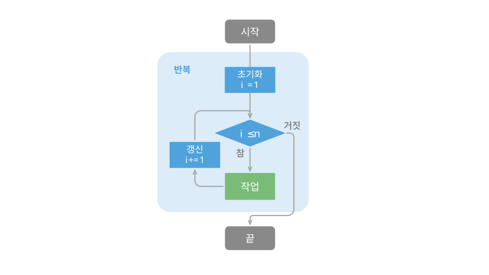
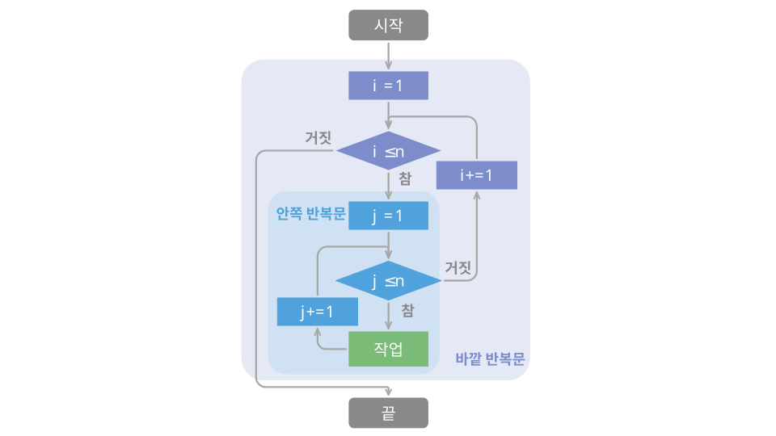
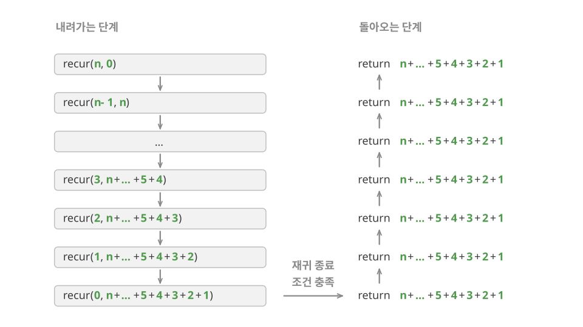
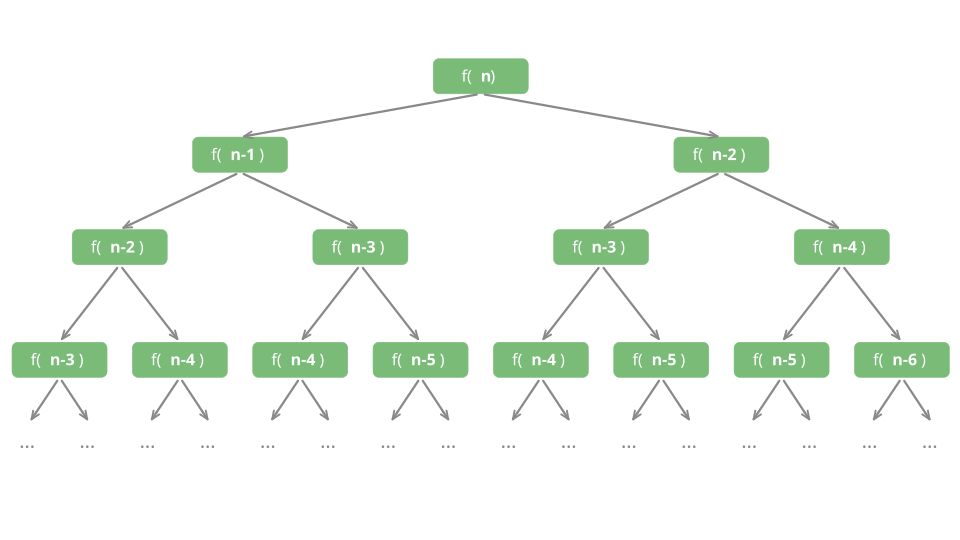

# 2.2 &nbsp; 반복과 재귀

알고리즘에서는 같은 작업을 여러 번 수행하는 일이 흔하며, 이는 복잡도 분석과 밀접한 관련이 있다. 시간 복잡도와 공간 복잡도를 알아보기 전에 프로그램에서 작업을 되풀이하는 두 가지 기본 제어 구조인 반복과 재귀부터 살펴보자.

## 2.2.1 &nbsp; 반복

<u>반복(iteration)</u>은 같은 작업을 여러 번 수행하는 제어 구조다. 프로그램은 주어진 조건이 참인 동안 같은 코드를 반복해서 실행하고, 조건이 더 이상 성립하지 않으면 멈춘다.

### 1. &nbsp; for 문

`for` 문은 가장 흔한 반복 형식 중 하나로, **반복 횟수를 미리 알 때 사용하기 좋다**.

다음 함수는 `for` 문으로 $1 + 2 + \dots + n$을 계산하고 변수 `res`에 합을 기록한다. 파이썬에서 `range(a, b)`의 범위는 왼쪽 끝을 포함하고 오른쪽 끝은 제외하므로 실제로 순회하는 값은 $a, a + 1, \dots, b-1$이다.

=== "Python"

    ```python title="iteration.py"
    def for_loop(n: int) -> int:
        """for 문"""
        res = 0
        # 1, 2, ..., n-1, n을 차례로 더한다
        for i in range(1, n + 1):
            res += i
        return res
    ```

=== "C++"

    ```cpp title="iteration.cpp"
    /* for 문 */
    int forLoop(int n) {
        int res = 0;
        // 1, 2, ..., n-1, n을 차례로 더한다
        for (int i = 1; i <= n; ++i) {
            res += i;
        }
        return res;
    }
    ```

=== "Java"

    ```java title="iteration.java"
    /* for 문 */
    int forLoop(int n) {
        int res = 0;
        // 1, 2, ..., n-1, n을 차례로 더한다
        for (int i = 1; i <= n; i++) {
            res += i;
        }
        return res;
    }
    ```

=== "C#"

    ```csharp title="iteration.cs"
    /* for 문 */
    int ForLoop(int n) {
        int res = 0;
        // 1, 2, ..., n-1, n을 차례로 더한다
        for (int i = 1; i <= n; i++) {
            res += i;
        }
        return res;
    }
    ```

=== "Go"

    ```go title="iteration.go"
    /* for 문 */
    func forLoop(n int) int {
        res := 0
        // 1, 2, ..., n-1, n을 차례로 더한다
        for i := 1; i <= n; i++ {
            res += i
        }
        return res
    }
    ```

=== "Swift"

    ```swift title="iteration.swift"
    /* for 문 */
    func forLoop(n: Int) -> Int {
        var res = 0
        // 1, 2, ..., n-1, n을 차례로 더한다
        for i in 1 ... n {
            res += i
        }
        return res
    }
    ```

=== "JS"

    ```javascript title="iteration.js"
    /* for 문 */
    function forLoop(n) {
        let res = 0;
        // 1, 2, ..., n-1, n을 차례로 더한다
        for (let i = 1; i <= n; i++) {
            res += i;
        }
        return res;
    }
    ```

=== "TS"

    ```typescript title="iteration.ts"
    /* for 문 */
    function forLoop(n: number): number {
        let res = 0;
        // 1, 2, ..., n-1, n을 차례로 더한다
        for (let i = 1; i <= n; i++) {
            res += i;
        }
        return res;
    }
    ```

=== "Dart"

    ```dart title="iteration.dart"
    /* for 문 */
    int forLoop(int n) {
      int res = 0;
      // 1, 2, ..., n-1, n을 차례로 더한다
      for (int i = 1; i <= n; i++) {
        res += i;
      }
      return res;
    }
    ```

=== "Rust"

    ```rust title="iteration.rs"
    /* for 문 */
    fn for_loop(n: i32) -> i32 {
        let mut res = 0;
        // 1, 2, ..., n-1, n을 차례로 더한다
        for i in 1..=n {
            res += i;
        }
        res
    }
    ```

=== "C"

    ```c title="iteration.c"
    /* for 문 */
    int forLoop(int n) {
        int res = 0;
        // 1, 2, ..., n-1, n을 차례로 더한다
        for (int i = 1; i <= n; i++) {
            res += i;
        }
        return res;
    }
    ```

=== "Kotlin"

    ```kotlin title="iteration.kt"
    /* for 문 */
    fun forLoop(n: Int): Int {
        var res = 0
        // 1, 2, ..., n-1, n을 차례로 더한다
        for (i in 1..n) {
            res += i
        }
        return res
    }
    ```

=== "Ruby"

    ```ruby title="iteration.rb"
    ### for 문 ###
    def for_loop(n)
      res = 0

      # 1, 2, ..., n-1, n을 차례로 더한다
      for i in 1..n
        res += i
      end

      res
    end
    ```

??? pythontutor "실행 과정 시각화"

    <div style="height: 423px; width: 100%;"><iframe class="pythontutor-iframe" title="실행 과정 시각화" src="https://pythontutor.com/iframe-embed.html#code=def%20for_loop%28n%3A%20int%29%20-%3E%20int%3A%0A%20%20%20%20%22%22%22for%20%EB%AC%B8%22%22%22%0A%20%20%20%20res%20%3D%200%0A%20%20%20%20%23%201,%202,%20...,%20n-1,%20n%EC%9D%84%20%EC%B0%A8%EB%A1%80%EB%A1%9C%20%EB%8D%94%ED%95%9C%EB%8B%A4%0A%20%20%20%20for%20i%20in%20range%281,%20n%20%2B%201%29%3A%0A%20%20%20%20%20%20%20%20res%20%2B%3D%20i%0A%20%20%20%20return%20res%0A%0A%22%22%22Driver%20Code%22%22%22%0Aif%20__name__%20%3D%3D%20%22__main__%22%3A%0A%20%20%20%20n%20%3D%205%0A%20%20%20%20res%20%3D%20for_loop%28n%29%0A%20%20%20%20print%28f%22%5Cnfor%20%EB%AC%B8%EC%9D%98%20%ED%95%A9%20res%20%3D%20%7Bres%7D%22%29&codeDivHeight=472&codeDivWidth=350&cumulative=false&curInstr=3&heapPrimitives=nevernest&origin=opt-frontend.js&py=311&rawInputLstJSON=%5B%5D&"> </iframe></div>
    <div style="margin-top: 5px;"><a href="https://pythontutor.com/iframe-embed.html#code=def%20for_loop%28n%3A%20int%29%20-%3E%20int%3A%0A%20%20%20%20%22%22%22for%20%EB%AC%B8%22%22%22%0A%20%20%20%20res%20%3D%200%0A%20%20%20%20%23%201,%202,%20...,%20n-1,%20n%EC%9D%84%20%EC%B0%A8%EB%A1%80%EB%A1%9C%20%EB%8D%94%ED%95%9C%EB%8B%A4%0A%20%20%20%20for%20i%20in%20range%281,%20n%20%2B%201%29%3A%0A%20%20%20%20%20%20%20%20res%20%2B%3D%20i%0A%20%20%20%20return%20res%0A%0A%22%22%22Driver%20Code%22%22%22%0Aif%20__name__%20%3D%3D%20%22__main__%22%3A%0A%20%20%20%20n%20%3D%205%0A%20%20%20%20res%20%3D%20for_loop%28n%29%0A%20%20%20%20print%28f%22%5Cnfor%20%EB%AC%B8%EC%9D%98%20%ED%95%A9%20res%20%3D%20%7Bres%7D%22%29&codeDivHeight=800&codeDivWidth=600&cumulative=false&curInstr=3&heapPrimitives=nevernest&origin=opt-frontend.js&py=311&rawInputLstJSON=%5B%5D&" target="_blank" rel="noopener noreferrer">전체 화면으로 보기 ></a></div>

이 함수로 합을 구하는 과정을 순서도로 나타내면 다음과 같다.

{ class="animation-figure" }

<p align="center"> 그림 2-1 &nbsp; 합을 구하는 함수의 순서도 </p>

이 함수의 연산 횟수는 입력 크기 $n$에 비례한다. 이를 ‘선형 관계’라고 한다. **이 예에서 시간 복잡도가 나타내는 것이 바로 이 선형 관계다**. 다음 절에서 더 자세히 알아보자.

### 2. &nbsp; while 문

`for` 문처럼 `while` 문으로도 반복을 구현할 수 있다. `while` 문에서는 매번 먼저 조건을 검사한다. 조건이 참이면 실행을 계속하고 거짓이면 반복을 끝낸다.

이번에는 `while` 문으로 $1 + 2 + \dots + n$을 구해 보자.

=== "Python"

    ```python title="iteration.py"
    def while_loop(n: int) -> int:
        """while 문"""
        res = 0
        i = 1  # 반복 조건에 쓰는 변수를 초기화한다
        # 1, 2, ..., n-1, n을 차례로 더한다
        while i <= n:
            res += i
            i += 1  # 반복 조건에 쓰는 변수를 갱신한다
        return res
    ```

=== "C++"

    ```cpp title="iteration.cpp"
    /* while 문 */
    int whileLoop(int n) {
        int res = 0;
        int i = 1; // 반복 조건에 쓰는 변수를 초기화한다
        // 1, 2, ..., n-1, n을 차례로 더한다
        while (i <= n) {
            res += i;
            i++; // 반복 조건에 쓰는 변수를 갱신한다
        }
        return res;
    }
    ```

=== "Java"

    ```java title="iteration.java"
    /* while 문 */
    int whileLoop(int n) {
        int res = 0;
        int i = 1; // 반복 조건에 쓰는 변수를 초기화한다
        // 1, 2, ..., n-1, n을 차례로 더한다
        while (i <= n) {
            res += i;
            i++; // 반복 조건에 쓰는 변수를 갱신한다
        }
        return res;
    }
    ```

=== "C#"

    ```csharp title="iteration.cs"
    /* while 문 */
    int WhileLoop(int n) {
        int res = 0;
        int i = 1; // 반복 조건에 쓰는 변수를 초기화한다
        // 1, 2, ..., n-1, n을 차례로 더한다
        while (i <= n) {
            res += i;
            i += 1; // 반복 조건에 쓰는 변수를 갱신한다
        }
        return res;
    }
    ```

=== "Go"

    ```go title="iteration.go"
    /* while 문 */
    func whileLoop(n int) int {
        res := 0
        // 반복 조건에 쓰는 변수를 초기화한다
        i := 1
        // 1, 2, ..., n-1, n을 차례로 더한다
        for i <= n {
            res += i
            // 반복 조건에 쓰는 변수를 갱신한다
            i++
        }
        return res
    }
    ```

=== "Swift"

    ```swift title="iteration.swift"
    /* while 문 */
    func whileLoop(n: Int) -> Int {
        var res = 0
        var i = 1 // 반복 조건에 쓰는 변수를 초기화한다
        // 1, 2, ..., n-1, n을 차례로 더한다
        while i <= n {
            res += i
            i += 1 // 반복 조건에 쓰는 변수를 갱신한다
        }
        return res
    }
    ```

=== "JS"

    ```javascript title="iteration.js"
    /* while 문 */
    function whileLoop(n) {
        let res = 0;
        let i = 1; // 반복 조건에 쓰는 변수를 초기화한다
        // 1, 2, ..., n-1, n을 차례로 더한다
        while (i <= n) {
            res += i;
            i++; // 반복 조건에 쓰는 변수를 갱신한다
        }
        return res;
    }
    ```

=== "TS"

    ```typescript title="iteration.ts"
    /* while 문 */
    function whileLoop(n: number): number {
        let res = 0;
        let i = 1; // 반복 조건에 쓰는 변수를 초기화한다
        // 1, 2, ..., n-1, n을 차례로 더한다
        while (i <= n) {
            res += i;
            i++; // 반복 조건에 쓰는 변수를 갱신한다
        }
        return res;
    }
    ```

=== "Dart"

    ```dart title="iteration.dart"
    /* while 문 */
    int whileLoop(int n) {
      int res = 0;
      int i = 1; // 반복 조건에 쓰는 변수를 초기화한다
      // 1, 2, ..., n-1, n을 차례로 더한다
      while (i <= n) {
        res += i;
        i++; // 반복 조건에 쓰는 변수를 갱신한다
      }
      return res;
    }
    ```

=== "Rust"

    ```rust title="iteration.rs"
    /* while 문 */
    fn while_loop(n: i32) -> i32 {
        let mut res = 0;
        let mut i = 1; // 반복 조건에 쓰는 변수를 초기화한다

        // 1, 2, ..., n-1, n을 차례로 더한다
        while i <= n {
            res += i;
            i += 1; // 반복 조건에 쓰는 변수를 갱신한다
        }
        res
    }
    ```

=== "C"

    ```c title="iteration.c"
    /* while 문 */
    int whileLoop(int n) {
        int res = 0;
        int i = 1; // 반복 조건에 쓰는 변수를 초기화한다
        // 1, 2, ..., n-1, n을 차례로 더한다
        while (i <= n) {
            res += i;
            i++; // 반복 조건에 쓰는 변수를 갱신한다
        }
        return res;
    }
    ```

=== "Kotlin"

    ```kotlin title="iteration.kt"
    /* while 문 */
    fun whileLoop(n: Int): Int {
        var res = 0
        var i = 1 // 반복 조건에 쓰는 변수를 초기화한다
        // 1, 2, ..., n-1, n을 차례로 더한다
        while (i <= n) {
            res += i
            i++ // 반복 조건에 쓰는 변수를 갱신한다
        }
        return res
    }
    ```

=== "Ruby"

    ```ruby title="iteration.rb"
    ### while 문 ###
    def while_loop(n)
      res = 0
      i = 1 # 반복 조건에 쓰는 변수를 초기화한다

      # 1, 2, ..., n-1, n을 차례로 더한다
      while i <= n
        res += i
        i += 1 # 반복 조건에 쓰는 변수를 갱신한다
      end

      res
    end
    ```

??? pythontutor "실행 과정 시각화"

    <div style="height: 459px; width: 100%;"><iframe class="pythontutor-iframe" title="실행 과정 시각화" src="https://pythontutor.com/iframe-embed.html#code=def%20while_loop%28n%3A%20int%29%20-%3E%20int%3A%0A%20%20%20%20%22%22%22while%20%EB%AC%B8%22%22%22%0A%20%20%20%20res%20%3D%200%0A%20%20%20%20i%20%3D%201%20%20%23%20%EB%B0%98%EB%B3%B5%20%EC%A1%B0%EA%B1%B4%EC%97%90%20%EC%93%B0%EB%8A%94%20%EB%B3%80%EC%88%98%EB%A5%BC%20%EC%B4%88%EA%B8%B0%ED%99%94%ED%95%9C%EB%8B%A4%0A%20%20%20%20%23%201,%202,%20...,%20n-1,%20n%EC%9D%84%20%EC%B0%A8%EB%A1%80%EB%A1%9C%20%EB%8D%94%ED%95%9C%EB%8B%A4%0A%20%20%20%20while%20i%20%3C%3D%20n%3A%0A%20%20%20%20%20%20%20%20res%20%2B%3D%20i%0A%20%20%20%20%20%20%20%20i%20%2B%3D%201%20%20%23%20%EB%B0%98%EB%B3%B5%20%EC%A1%B0%EA%B1%B4%EC%97%90%20%EC%93%B0%EB%8A%94%20%EB%B3%80%EC%88%98%EB%A5%BC%20%EA%B0%B1%EC%8B%A0%ED%95%9C%EB%8B%A4%0A%20%20%20%20return%20res%0A%0A%22%22%22Driver%20Code%22%22%22%0Aif%20__name__%20%3D%3D%20%22__main__%22%3A%0A%20%20%20%20n%20%3D%205%0A%20%20%20%20res%20%3D%20while_loop%28n%29%0A%20%20%20%20print%28f%22%5Cnwhile%20%EB%AC%B8%EC%9D%98%20%ED%95%A9%20res%20%3D%20%7Bres%7D%22%29&codeDivHeight=472&codeDivWidth=350&cumulative=false&curInstr=3&heapPrimitives=nevernest&origin=opt-frontend.js&py=311&rawInputLstJSON=%5B%5D&textReferences=false"> </iframe></div>
    <div style="margin-top: 5px;"><a href="https://pythontutor.com/iframe-embed.html#code=def%20while_loop%28n%3A%20int%29%20-%3E%20int%3A%0A%20%20%20%20%22%22%22while%20%EB%AC%B8%22%22%22%0A%20%20%20%20res%20%3D%200%0A%20%20%20%20i%20%3D%201%20%20%23%20%EB%B0%98%EB%B3%B5%20%EC%A1%B0%EA%B1%B4%EC%97%90%20%EC%93%B0%EB%8A%94%20%EB%B3%80%EC%88%98%EB%A5%BC%20%EC%B4%88%EA%B8%B0%ED%99%94%ED%95%9C%EB%8B%A4%0A%20%20%20%20%23%201,%202,%20...,%20n-1,%20n%EC%9D%84%20%EC%B0%A8%EB%A1%80%EB%A1%9C%20%EB%8D%94%ED%95%9C%EB%8B%A4%0A%20%20%20%20while%20i%20%3C%3D%20n%3A%0A%20%20%20%20%20%20%20%20res%20%2B%3D%20i%0A%20%20%20%20%20%20%20%20i%20%2B%3D%201%20%20%23%20%EB%B0%98%EB%B3%B5%20%EC%A1%B0%EA%B1%B4%EC%97%90%20%EC%93%B0%EB%8A%94%20%EB%B3%80%EC%88%98%EB%A5%BC%20%EA%B0%B1%EC%8B%A0%ED%95%9C%EB%8B%A4%0A%20%20%20%20return%20res%0A%0A%22%22%22Driver%20Code%22%22%22%0Aif%20__name__%20%3D%3D%20%22__main__%22%3A%0A%20%20%20%20n%20%3D%205%0A%20%20%20%20res%20%3D%20while_loop%28n%29%0A%20%20%20%20print%28f%22%5Cnwhile%20%EB%AC%B8%EC%9D%98%20%ED%95%A9%20res%20%3D%20%7Bres%7D%22%29&codeDivHeight=800&codeDivWidth=600&cumulative=false&curInstr=3&heapPrimitives=nevernest&origin=opt-frontend.js&py=311&rawInputLstJSON=%5B%5D&textReferences=false" target="_blank" rel="noopener noreferrer">전체 화면으로 보기 ></a></div>

**`while` 문은 `for` 문보다 유연하다**. `while` 문에서는 반복 조건에 쓰는 변수를 어떻게 초기화하고 갱신할지 자유롭게 정할 수 있다.

예를 들어 다음 코드에서는 조건에 쓰는 변수 $i$를 매번 두 차례 갱신한다. 이런 경우에는 `for` 문으로 구현하기가 다소 불편하다.

=== "Python"

    ```python title="iteration.py"
    def while_loop_ii(n: int) -> int:
        """while 문(한 번에 두 번 갱신)"""
        res = 0
        i = 1  # 반복 조건에 쓰는 변수를 초기화한다
        # 1, 4, 10, ...을 차례로 더한다
        while i <= n:
            res += i
            # 반복 조건에 쓰는 변수를 갱신한다
            i += 1
            i *= 2
        return res
    ```

=== "C++"

    ```cpp title="iteration.cpp"
    /* while 문(한 번에 두 번 갱신) */
    int whileLoopII(int n) {
        int res = 0;
        int i = 1; // 반복 조건에 쓰는 변수를 초기화한다
        // 1, 4, 10, ...을 차례로 더한다
        while (i <= n) {
            res += i;
            // 반복 조건에 쓰는 변수를 갱신한다
            i++;
            i *= 2;
        }
        return res;
    }
    ```

=== "Java"

    ```java title="iteration.java"
    /* while 문(한 번에 두 번 갱신) */
    int whileLoopII(int n) {
        int res = 0;
        int i = 1; // 반복 조건에 쓰는 변수를 초기화한다
        // 1, 4, 10, ...을 차례로 더한다
        while (i <= n) {
            res += i;
            // 반복 조건에 쓰는 변수를 갱신한다
            i++;
            i *= 2;
        }
        return res;
    }
    ```

=== "C#"

    ```csharp title="iteration.cs"
    /* while 문(한 번에 두 번 갱신) */
    int WhileLoopII(int n) {
        int res = 0;
        int i = 1; // 반복 조건에 쓰는 변수를 초기화한다
        // 1, 4, 10, ...을 차례로 더한다
        while (i <= n) {
            res += i;
            // 반복 조건에 쓰는 변수를 갱신한다
            i += 1; 
            i *= 2;
        }
        return res;
    }
    ```

=== "Go"

    ```go title="iteration.go"
    /* while 문(한 번에 두 번 갱신) */
    func whileLoopII(n int) int {
        res := 0
        // 반복 조건에 쓰는 변수를 초기화한다
        i := 1
        // 1, 4, 10, ...을 차례로 더한다
        for i <= n {
            res += i
            // 반복 조건에 쓰는 변수를 갱신한다
            i++
            i *= 2
        }
        return res
    }
    ```

=== "Swift"

    ```swift title="iteration.swift"
    /* while 문(한 번에 두 번 갱신) */
    func whileLoopII(n: Int) -> Int {
        var res = 0
        var i = 1 // 반복 조건에 쓰는 변수를 초기화한다
        // 1, 4, 10, ...을 차례로 더한다
        while i <= n {
            res += i
            // 반복 조건에 쓰는 변수를 갱신한다
            i += 1
            i *= 2
        }
        return res
    }
    ```

=== "JS"

    ```javascript title="iteration.js"
    /* while 문(한 번에 두 번 갱신) */
    function whileLoopII(n) {
        let res = 0;
        let i = 1; // 반복 조건에 쓰는 변수를 초기화한다
        // 1, 4, 10, ...을 차례로 더한다
        while (i <= n) {
            res += i;
            // 반복 조건에 쓰는 변수를 갱신한다
            i++;
            i *= 2;
        }
        return res;
    }
    ```

=== "TS"

    ```typescript title="iteration.ts"
    /* while 문(한 번에 두 번 갱신) */
    function whileLoopII(n: number): number {
        let res = 0;
        let i = 1; // 반복 조건에 쓰는 변수를 초기화한다
        // 1, 4, 10, ...을 차례로 더한다
        while (i <= n) {
            res += i;
            // 반복 조건에 쓰는 변수를 갱신한다
            i++;
            i *= 2;
        }
        return res;
    }
    ```

=== "Dart"

    ```dart title="iteration.dart"
    /* while 문(한 번에 두 번 갱신) */
    int whileLoopII(int n) {
      int res = 0;
      int i = 1; // 반복 조건에 쓰는 변수를 초기화한다
      // 1, 4, 10, ...을 차례로 더한다
      while (i <= n) {
        res += i;
        // 반복 조건에 쓰는 변수를 갱신한다
        i++;
        i *= 2;
      }
      return res;
    }
    ```

=== "Rust"

    ```rust title="iteration.rs"
    /* while 문(한 번에 두 번 갱신) */
    fn while_loop_ii(n: i32) -> i32 {
        let mut res = 0;
        let mut i = 1; // 반복 조건에 쓰는 변수를 초기화한다

        // 1, 4, 10, ...을 차례로 더한다
        while i <= n {
            res += i;
            // 반복 조건에 쓰는 변수를 갱신한다
            i += 1;
            i *= 2;
        }
        res
    }
    ```

=== "C"

    ```c title="iteration.c"
    /* while 문(한 번에 두 번 갱신) */
    int whileLoopII(int n) {
        int res = 0;
        int i = 1; // 반복 조건에 쓰는 변수를 초기화한다
        // 1, 4, 10, ...을 차례로 더한다
        while (i <= n) {
            res += i;
            // 반복 조건에 쓰는 변수를 갱신한다
            i++;
            i *= 2;
        }
        return res;
    }
    ```

=== "Kotlin"

    ```kotlin title="iteration.kt"
    /* while 문(한 번에 두 번 갱신) */
    fun whileLoopII(n: Int): Int {
        var res = 0
        var i = 1 // 반복 조건에 쓰는 변수를 초기화한다
        // 1, 4, 10, ...을 차례로 더한다
        while (i <= n) {
            res += i
            // 반복 조건에 쓰는 변수를 갱신한다
            i++
            i *= 2
        }
        return res
    }
    ```

=== "Ruby"

    ```ruby title="iteration.rb"
    ### while 문(한 번에 두 번 갱신)###
    def while_loop_ii(n)
      res = 0
      i = 1 # 반복 조건에 쓰는 변수를 초기화한다

      # 1, 4, 10, ...을 차례로 더한다
      while i <= n
        res += i
        # 반복 조건에 쓰는 변수를 갱신한다
        i += 1
        i *= 2
      end

      res
    end
    ```

??? pythontutor "실행 과정 시각화"

    <div style="height: 495px; width: 100%;"><iframe class="pythontutor-iframe" title="실행 과정 시각화" src="https://pythontutor.com/iframe-embed.html#code=def%20while_loop_ii%28n%3A%20int%29%20-%3E%20int%3A%0A%20%20%20%20%22%22%22while%20%EB%AC%B8%28%ED%95%9C%20%EB%B2%88%EC%97%90%20%EB%91%90%20%EB%B2%88%20%EA%B0%B1%EC%8B%A0%29%22%22%22%0A%20%20%20%20res%20%3D%200%0A%20%20%20%20i%20%3D%201%20%20%23%20%EB%B0%98%EB%B3%B5%20%EC%A1%B0%EA%B1%B4%EC%97%90%20%EC%93%B0%EB%8A%94%20%EB%B3%80%EC%88%98%EB%A5%BC%20%EC%B4%88%EA%B8%B0%ED%99%94%ED%95%9C%EB%8B%A4%0A%20%20%20%20%23%201,%204,%2010,%20...%EC%9D%84%20%EC%B0%A8%EB%A1%80%EB%A1%9C%20%EB%8D%94%ED%95%9C%EB%8B%A4%0A%20%20%20%20while%20i%20%3C%3D%20n%3A%0A%20%20%20%20%20%20%20%20res%20%2B%3D%20i%0A%20%20%20%20%20%20%20%20%23%20%EB%B0%98%EB%B3%B5%20%EC%A1%B0%EA%B1%B4%EC%97%90%20%EC%93%B0%EB%8A%94%20%EB%B3%80%EC%88%98%EB%A5%BC%20%EA%B0%B1%EC%8B%A0%ED%95%9C%EB%8B%A4%0A%20%20%20%20%20%20%20%20i%20%2B%3D%201%0A%20%20%20%20%20%20%20%20i%20%2A%3D%202%0A%20%20%20%20return%20res%0A%0A%22%22%22Driver%20Code%22%22%22%0Aif%20__name__%20%3D%3D%20%22__main__%22%3A%0A%20%20%20%20n%20%3D%205%0A%20%20%20%20res%20%3D%20while_loop_ii%28n%29%0A%20%20%20%20print%28f%22%5Cnwhile%20%EB%AC%B8%28%EB%91%90%20%EB%B2%88%20%EA%B0%B1%EC%8B%A0%29%EC%9D%98%20%ED%95%A9%20res%20%3D%20%7Bres%7D%22%29&codeDivHeight=472&codeDivWidth=350&cumulative=false&curInstr=3&heapPrimitives=nevernest&origin=opt-frontend.js&py=311&rawInputLstJSON=%5B%5D&textReferences=false"> </iframe></div>
    <div style="margin-top: 5px;"><a href="https://pythontutor.com/iframe-embed.html#code=def%20while_loop_ii%28n%3A%20int%29%20-%3E%20int%3A%0A%20%20%20%20%22%22%22while%20%EB%AC%B8%28%ED%95%9C%20%EB%B2%88%EC%97%90%20%EB%91%90%20%EB%B2%88%20%EA%B0%B1%EC%8B%A0%29%22%22%22%0A%20%20%20%20res%20%3D%200%0A%20%20%20%20i%20%3D%201%20%20%23%20%EB%B0%98%EB%B3%B5%20%EC%A1%B0%EA%B1%B4%EC%97%90%20%EC%93%B0%EB%8A%94%20%EB%B3%80%EC%88%98%EB%A5%BC%20%EC%B4%88%EA%B8%B0%ED%99%94%ED%95%9C%EB%8B%A4%0A%20%20%20%20%23%201,%204,%2010,%20...%EC%9D%84%20%EC%B0%A8%EB%A1%80%EB%A1%9C%20%EB%8D%94%ED%95%9C%EB%8B%A4%0A%20%20%20%20while%20i%20%3C%3D%20n%3A%0A%20%20%20%20%20%20%20%20res%20%2B%3D%20i%0A%20%20%20%20%20%20%20%20%23%20%EB%B0%98%EB%B3%B5%20%EC%A1%B0%EA%B1%B4%EC%97%90%20%EC%93%B0%EB%8A%94%20%EB%B3%80%EC%88%98%EB%A5%BC%20%EA%B0%B1%EC%8B%A0%ED%95%9C%EB%8B%A4%0A%20%20%20%20%20%20%20%20i%20%2B%3D%201%0A%20%20%20%20%20%20%20%20i%20%2A%3D%202%0A%20%20%20%20return%20res%0A%0A%22%22%22Driver%20Code%22%22%22%0Aif%20__name__%20%3D%3D%20%22__main__%22%3A%0A%20%20%20%20n%20%3D%205%0A%20%20%20%20res%20%3D%20while_loop_ii%28n%29%0A%20%20%20%20print%28f%22%5Cnwhile%20%EB%AC%B8%28%EB%91%90%20%EB%B2%88%20%EA%B0%B1%EC%8B%A0%29%EC%9D%98%20%ED%95%A9%20res%20%3D%20%7Bres%7D%22%29&codeDivHeight=800&codeDivWidth=600&cumulative=false&curInstr=3&heapPrimitives=nevernest&origin=opt-frontend.js&py=311&rawInputLstJSON=%5B%5D&textReferences=false" target="_blank" rel="noopener noreferrer">전체 화면으로 보기 ></a></div>

정리하면 **`for` 문은 코드가 간결하고 `while` 문은 유연하다**. 둘 다 반복을 구현할 수 있으므로 문제의 요구에 맞게 선택하면 된다.

### 3. &nbsp; 중첩 반복문

반복문 안에 다른 반복문을 넣을 수도 있다. 다음은 `for` 문을 중첩한 예다.

=== "Python"

    ```python title="iteration.py"
    def nested_for_loop(n: int) -> str:
        """이중 for 문"""
        res = ""
        # i = 1, 2, ..., n-1, n에 대해 반복한다
        for i in range(1, n + 1):
            # j = 1, 2, ..., n-1, n에 대해 반복한다
            for j in range(1, n + 1):
                res += f"({i}, {j}), "
        return res
    ```

=== "C++"

    ```cpp title="iteration.cpp"
    /* 이중 for 문 */
    string nestedForLoop(int n) {
        ostringstream res;
        // i = 1, 2, ..., n-1, n에 대해 반복한다
        for (int i = 1; i <= n; ++i) {
            // j = 1, 2, ..., n-1, n에 대해 반복한다
            for (int j = 1; j <= n; ++j) {
                res << "(" << i << ", " << j << "), ";
            }
        }
        return res.str();
    }
    ```

=== "Java"

    ```java title="iteration.java"
    /* 이중 for 문 */
    String nestedForLoop(int n) {
        StringBuilder res = new StringBuilder();
        // i = 1, 2, ..., n-1, n에 대해 반복한다
        for (int i = 1; i <= n; i++) {
            // j = 1, 2, ..., n-1, n에 대해 반복한다
            for (int j = 1; j <= n; j++) {
                res.append("(" + i + ", " + j + "), ");
            }
        }
        return res.toString();
    }
    ```

=== "C#"

    ```csharp title="iteration.cs"
    /* 이중 for 문 */
    string NestedForLoop(int n) {
        StringBuilder res = new();
        // i = 1, 2, ..., n-1, n에 대해 반복한다
        for (int i = 1; i <= n; i++) {
            // j = 1, 2, ..., n-1, n에 대해 반복한다
            for (int j = 1; j <= n; j++) {
                res.Append($"({i}, {j}), ");
            }
        }
        return res.ToString();
    }
    ```

=== "Go"

    ```go title="iteration.go"
    /* 이중 for 문 */
    func nestedForLoop(n int) string {
        res := ""
        // i = 1, 2, ..., n-1, n에 대해 반복한다
        for i := 1; i <= n; i++ {
            for j := 1; j <= n; j++ {
                // j = 1, 2, ..., n-1, n에 대해 반복한다
                res += fmt.Sprintf("(%d, %d), ", i, j)
            }
        }
        return res
    }
    ```

=== "Swift"

    ```swift title="iteration.swift"
    /* 이중 for 문 */
    func nestedForLoop(n: Int) -> String {
        var res = ""
        // i = 1, 2, ..., n-1, n에 대해 반복한다
        for i in 1 ... n {
            // j = 1, 2, ..., n-1, n에 대해 반복한다
            for j in 1 ... n {
                res.append("(\(i), \(j)), ")
            }
        }
        return res
    }
    ```

=== "JS"

    ```javascript title="iteration.js"
    /* 이중 for 문 */
    function nestedForLoop(n) {
        let res = '';
        // i = 1, 2, ..., n-1, n에 대해 반복한다
        for (let i = 1; i <= n; i++) {
            // j = 1, 2, ..., n-1, n에 대해 반복한다
            for (let j = 1; j <= n; j++) {
                res += `(${i}, ${j}), `;
            }
        }
        return res;
    }
    ```

=== "TS"

    ```typescript title="iteration.ts"
    /* 이중 for 문 */
    function nestedForLoop(n: number): string {
        let res = '';
        // i = 1, 2, ..., n-1, n에 대해 반복한다
        for (let i = 1; i <= n; i++) {
            // j = 1, 2, ..., n-1, n에 대해 반복한다
            for (let j = 1; j <= n; j++) {
                res += `(${i}, ${j}), `;
            }
        }
        return res;
    }
    ```

=== "Dart"

    ```dart title="iteration.dart"
    /* 이중 for 문 */
    String nestedForLoop(int n) {
      String res = "";
      // i = 1, 2, ..., n-1, n에 대해 반복한다
      for (int i = 1; i <= n; i++) {
        // j = 1, 2, ..., n-1, n에 대해 반복한다
        for (int j = 1; j <= n; j++) {
          res += "($i, $j), ";
        }
      }
      return res;
    }
    ```

=== "Rust"

    ```rust title="iteration.rs"
    /* 이중 for 문 */
    fn nested_for_loop(n: i32) -> String {
        let mut res = vec![];
        // i = 1, 2, ..., n-1, n에 대해 반복한다
        for i in 1..=n {
            // j = 1, 2, ..., n-1, n에 대해 반복한다
            for j in 1..=n {
                res.push(format!("({}, {}), ", i, j));
            }
        }
        res.join("")
    }
    ```

=== "C"

    ```c title="iteration.c"
    /* 이중 for 문 */
    char *nestedForLoop(int n) {
        // 점은 n * n개이고 각 점을 나타내는 "(i, j), "의 길이는 최대 6+10*2이다. 끝의 널 문자 \0을 위한 공간도 더한다
        int size = n * n * 26 + 1;
        char *res = malloc(size * sizeof(char));
        // i = 1, 2, ..., n-1, n에 대해 반복한다
        for (int i = 1; i <= n; i++) {
            // j = 1, 2, ..., n-1, n에 대해 반복한다
            for (int j = 1; j <= n; j++) {
                char tmp[26];
                snprintf(tmp, sizeof(tmp), "(%d, %d), ", i, j);
                strncat(res, tmp, size - strlen(res) - 1);
            }
        }
        return res;
    }
    ```

=== "Kotlin"

    ```kotlin title="iteration.kt"
    /* 이중 for 문 */
    fun nestedForLoop(n: Int): String {
        val res = StringBuilder()
        // i = 1, 2, ..., n-1, n에 대해 반복한다
        for (i in 1..n) {
            // j = 1, 2, ..., n-1, n에 대해 반복한다
            for (j in 1..n) {
                res.append(" ($i, $j), ")
            }
        }
        return res.toString()
    }
    ```

=== "Ruby"

    ```ruby title="iteration.rb"
    ### 이중 for 문 ###
    def nested_for_loop(n)
      res = ""

      # i = 1, 2, ..., n-1, n에 대해 반복한다
      for i in 1..n
        # j = 1, 2, ..., n-1, n에 대해 반복한다
        for j in 1..n
          res += "(#{i}, #{j}), "
        end
      end

      res
    end
    ```

??? pythontutor "실행 과정 시각화"

    <div style="height: 459px; width: 100%;"><iframe class="pythontutor-iframe" title="실행 과정 시각화" src="https://pythontutor.com/iframe-embed.html#code=def%20nested_for_loop%28n%3A%20int%29%20-%3E%20str%3A%0A%20%20%20%20%22%22%22%EC%9D%B4%EC%A4%91%20for%20%EB%AC%B8%22%22%22%0A%20%20%20%20res%20%3D%20%22%22%0A%20%20%20%20%23%20i%20%3D%201,%202,%20...,%20n-1,%20n%EC%97%90%20%EB%8C%80%ED%95%B4%20%EB%B0%98%EB%B3%B5%ED%95%9C%EB%8B%A4%0A%20%20%20%20for%20i%20in%20range%281,%20n%20%2B%201%29%3A%0A%20%20%20%20%20%20%20%20%23%20j%20%3D%201,%202,%20...,%20n-1,%20n%EC%97%90%20%EB%8C%80%ED%95%B4%20%EB%B0%98%EB%B3%B5%ED%95%9C%EB%8B%A4%0A%20%20%20%20%20%20%20%20for%20j%20in%20range%281,%20n%20%2B%201%29%3A%0A%20%20%20%20%20%20%20%20%20%20%20%20res%20%2B%3D%20f%22%28%7Bi%7D,%20%7Bj%7D%29,%20%22%0A%20%20%20%20return%20res%0A%0A%22%22%22Driver%20Code%22%22%22%0Aif%20__name__%20%3D%3D%20%22__main__%22%3A%0A%20%20%20%20n%20%3D%205%0A%20%20%20%20res%20%3D%20nested_for_loop%28n%29%0A%20%20%20%20print%28f%22%5Cn%EC%9D%B4%EC%A4%91%20for%20%EB%AC%B8%EC%9D%98%20%EC%88%9C%ED%9A%8C%20%EA%B2%B0%EA%B3%BC%3A%20%7Bres%7D%22%29&codeDivHeight=472&codeDivWidth=350&cumulative=false&curInstr=3&heapPrimitives=nevernest&origin=opt-frontend.js&py=311&rawInputLstJSON=%5B%5D&textReferences=false"> </iframe></div>
    <div style="margin-top: 5px;"><a href="https://pythontutor.com/iframe-embed.html#code=def%20nested_for_loop%28n%3A%20int%29%20-%3E%20str%3A%0A%20%20%20%20%22%22%22%EC%9D%B4%EC%A4%91%20for%20%EB%AC%B8%22%22%22%0A%20%20%20%20res%20%3D%20%22%22%0A%20%20%20%20%23%20i%20%3D%201,%202,%20...,%20n-1,%20n%EC%97%90%20%EB%8C%80%ED%95%B4%20%EB%B0%98%EB%B3%B5%ED%95%9C%EB%8B%A4%0A%20%20%20%20for%20i%20in%20range%281,%20n%20%2B%201%29%3A%0A%20%20%20%20%20%20%20%20%23%20j%20%3D%201,%202,%20...,%20n-1,%20n%EC%97%90%20%EB%8C%80%ED%95%B4%20%EB%B0%98%EB%B3%B5%ED%95%9C%EB%8B%A4%0A%20%20%20%20%20%20%20%20for%20j%20in%20range%281,%20n%20%2B%201%29%3A%0A%20%20%20%20%20%20%20%20%20%20%20%20res%20%2B%3D%20f%22%28%7Bi%7D,%20%7Bj%7D%29,%20%22%0A%20%20%20%20return%20res%0A%0A%22%22%22Driver%20Code%22%22%22%0Aif%20__name__%20%3D%3D%20%22__main__%22%3A%0A%20%20%20%20n%20%3D%205%0A%20%20%20%20res%20%3D%20nested_for_loop%28n%29%0A%20%20%20%20print%28f%22%5Cn%EC%9D%B4%EC%A4%91%20for%20%EB%AC%B8%EC%9D%98%20%EC%88%9C%ED%9A%8C%20%EA%B2%B0%EA%B3%BC%3A%20%7Bres%7D%22%29&codeDivHeight=800&codeDivWidth=600&cumulative=false&curInstr=3&heapPrimitives=nevernest&origin=opt-frontend.js&py=311&rawInputLstJSON=%5B%5D&textReferences=false" target="_blank" rel="noopener noreferrer">전체 화면으로 보기 ></a></div>

이 중첩 반복문의 순서도는 다음과 같다.

{ class="animation-figure" }

<p align="center"> 그림 2-2 &nbsp; 중첩 반복문의 순서도 </p>

이 함수의 연산 횟수는 $n^2$에 비례한다. 즉, 알고리즘 실행 시간은 입력 크기 $n$의 제곱에 비례한다.

반복문을 더 중첩할 수도 있다. 한 겹 중첩할 때마다 차수가 하나씩 올라가므로 시간 복잡도는 세제곱, 네제곱에 비례하는 식으로 커진다.

## 2.2.2 &nbsp; 재귀

 <u>재귀(recursion)</u>는 함수가 자기 자신을 호출하여 문제를 푸는 알고리즘 전략이다. 크게 두 단계로 이루어진다.

1. **내려가는 단계**에서는 대개 더 작거나 단순한 인수를 전달하면서 자기 자신을 계속 호출한다. 이 과정은 ‘종료 조건’에 도달할 때까지 이어진다.
2. **돌아오는 단계**에서는 종료 조건이 충족된 뒤 가장 깊은 호출부터 한 단계씩 반환하면서 각 단계의 결과를 모은다.

구현 관점에서 보면 재귀 코드에는 세 가지 주요 요소가 있다.

1. **종료 조건**은 언제 내려가는 단계를 끝내고 돌아오기 시작할지 결정한다.
2. **재귀 호출**은 내려가는 단계에 해당한다. 함수가 대개 더 작거나 단순한 인수로 자기 자신을 호출한다.
3. **결과 반환**은 돌아오는 단계에 해당한다. 현재 단계의 결과를 바로 위 단계로 돌려준다.

다음 코드에서는 `recur(n)`만 호출하면 $1 + 2 + \dots + n$을 계산할 수 있다.

=== "Python"

    ```python title="recursion.py"
    def recur(n: int) -> int:
        """재귀"""
        # 종료 조건
        if n == 1:
            return 1
        # 내려가는 단계: 재귀 호출
        res = recur(n - 1)
        # 돌아오는 단계: 결과 반환
        return n + res
    ```

=== "C++"

    ```cpp title="recursion.cpp"
    /* 재귀 */
    int recur(int n) {
        // 종료 조건
        if (n == 1)
            return 1;
        // 내려가는 단계: 재귀 호출
        int res = recur(n - 1);
        // 돌아오는 단계: 결과 반환
        return n + res;
    }
    ```

=== "Java"

    ```java title="recursion.java"
    /* 재귀 */
    int recur(int n) {
        // 종료 조건
        if (n == 1)
            return 1;
        // 내려가는 단계: 재귀 호출
        int res = recur(n - 1);
        // 돌아오는 단계: 결과 반환
        return n + res;
    }
    ```

=== "C#"

    ```csharp title="recursion.cs"
    /* 재귀 */
    int Recur(int n) {
        // 종료 조건
        if (n == 1)
            return 1;
        // 내려가는 단계: 재귀 호출
        int res = Recur(n - 1);
        // 돌아오는 단계: 결과 반환
        return n + res;
    }
    ```

=== "Go"

    ```go title="recursion.go"
    /* 재귀 */
    func recur(n int) int {
        // 종료 조건
        if n == 1 {
            return 1
        }
        // 내려가는 단계: 재귀 호출
        res := recur(n - 1)
        // 돌아오는 단계: 결과 반환
        return n + res
    }
    ```

=== "Swift"

    ```swift title="recursion.swift"
    /* 재귀 */
    func recur(n: Int) -> Int {
        // 종료 조건
        if n == 1 {
            return 1
        }
        // 내려가는 단계: 재귀 호출
        let res = recur(n: n - 1)
        // 돌아오는 단계: 결과 반환
        return n + res
    }
    ```

=== "JS"

    ```javascript title="recursion.js"
    /* 재귀 */
    function recur(n) {
        // 종료 조건
        if (n === 1) return 1;
        // 내려가는 단계: 재귀 호출
        const res = recur(n - 1);
        // 돌아오는 단계: 결과 반환
        return n + res;
    }
    ```

=== "TS"

    ```typescript title="recursion.ts"
    /* 재귀 */
    function recur(n: number): number {
        // 종료 조건
        if (n === 1) return 1;
        // 내려가는 단계: 재귀 호출
        const res = recur(n - 1);
        // 돌아오는 단계: 결과 반환
        return n + res;
    }
    ```

=== "Dart"

    ```dart title="recursion.dart"
    /* 재귀 */
    int recur(int n) {
      // 종료 조건
      if (n == 1) return 1;
      // 내려가는 단계: 재귀 호출
      int res = recur(n - 1);
      // 돌아오는 단계: 결과 반환
      return n + res;
    }
    ```

=== "Rust"

    ```rust title="recursion.rs"
    /* 재귀 */
    fn recur(n: i32) -> i32 {
        // 종료 조건
        if n == 1 {
            return 1;
        }
        // 내려가는 단계: 재귀 호출
        let res = recur(n - 1);
        // 돌아오는 단계: 결과 반환
        n + res
    }
    ```

=== "C"

    ```c title="recursion.c"
    /* 재귀 */
    int recur(int n) {
        // 종료 조건
        if (n == 1)
            return 1;
        // 내려가는 단계: 재귀 호출
        int res = recur(n - 1);
        // 돌아오는 단계: 결과 반환
        return n + res;
    }
    ```

=== "Kotlin"

    ```kotlin title="recursion.kt"
    /* 재귀 */
    fun recur(n: Int): Int {
        // 종료 조건
        if (n == 1)
            return 1
        // 내려가는 단계: 재귀 호출
        val res = recur(n - 1)
        // 돌아오는 단계: 결과 반환
        return n + res
    }
    ```

=== "Ruby"

    ```ruby title="recursion.rb"
    ### 재귀 ###
    def recur(n)
      # 종료 조건
      return 1 if n == 1
      # 내려가는 단계: 재귀 호출
      res = recur(n - 1)
      # 돌아오는 단계: 결과 반환
      n + res
    end
    ```

??? pythontutor "실행 과정 시각화"

    <div style="height: 459px; width: 100%;"><iframe class="pythontutor-iframe" title="실행 과정 시각화" src="https://pythontutor.com/iframe-embed.html#code=def%20recur%28n%3A%20int%29%20-%3E%20int%3A%0A%20%20%20%20%22%22%22%EC%9E%AC%EA%B7%80%22%22%22%0A%20%20%20%20%23%20%EC%A2%85%EB%A3%8C%20%EC%A1%B0%EA%B1%B4%0A%20%20%20%20if%20n%20%3D%3D%201%3A%0A%20%20%20%20%20%20%20%20return%201%0A%20%20%20%20%23%20%EB%82%B4%EB%A0%A4%EA%B0%80%EB%8A%94%20%EB%8B%A8%EA%B3%84%3A%20%EC%9E%AC%EA%B7%80%20%ED%98%B8%EC%B6%9C%0A%20%20%20%20res%20%3D%20recur%28n%20-%201%29%0A%20%20%20%20%23%20%EB%8F%8C%EC%95%84%EC%98%A4%EB%8A%94%20%EB%8B%A8%EA%B3%84%3A%20%EA%B2%B0%EA%B3%BC%20%EB%B0%98%ED%99%98%0A%20%20%20%20return%20n%20%2B%20res%0A%0A%22%22%22Driver%20Code%22%22%22%0Aif%20__name__%20%3D%3D%20%22__main__%22%3A%0A%20%20%20%20n%20%3D%205%0A%20%20%20%20res%20%3D%20recur%28n%29%0A%20%20%20%20print%28f%22%5Cn%EC%9E%AC%EA%B7%80%20%ED%95%A8%EC%88%98%EB%A1%9C%20%EA%B5%AC%ED%95%9C%20%ED%95%A9%20res%20%3D%20%7Bres%7D%22%29&codeDivHeight=472&codeDivWidth=350&cumulative=false&curInstr=3&heapPrimitives=nevernest&origin=opt-frontend.js&py=311&rawInputLstJSON=%5B%5D&textReferences=false"> </iframe></div>
    <div style="margin-top: 5px;"><a href="https://pythontutor.com/iframe-embed.html#code=def%20recur%28n%3A%20int%29%20-%3E%20int%3A%0A%20%20%20%20%22%22%22%EC%9E%AC%EA%B7%80%22%22%22%0A%20%20%20%20%23%20%EC%A2%85%EB%A3%8C%20%EC%A1%B0%EA%B1%B4%0A%20%20%20%20if%20n%20%3D%3D%201%3A%0A%20%20%20%20%20%20%20%20return%201%0A%20%20%20%20%23%20%EB%82%B4%EB%A0%A4%EA%B0%80%EB%8A%94%20%EB%8B%A8%EA%B3%84%3A%20%EC%9E%AC%EA%B7%80%20%ED%98%B8%EC%B6%9C%0A%20%20%20%20res%20%3D%20recur%28n%20-%201%29%0A%20%20%20%20%23%20%EB%8F%8C%EC%95%84%EC%98%A4%EB%8A%94%20%EB%8B%A8%EA%B3%84%3A%20%EA%B2%B0%EA%B3%BC%20%EB%B0%98%ED%99%98%0A%20%20%20%20return%20n%20%2B%20res%0A%0A%22%22%22Driver%20Code%22%22%22%0Aif%20__name__%20%3D%3D%20%22__main__%22%3A%0A%20%20%20%20n%20%3D%205%0A%20%20%20%20res%20%3D%20recur%28n%29%0A%20%20%20%20print%28f%22%5Cn%EC%9E%AC%EA%B7%80%20%ED%95%A8%EC%88%98%EB%A1%9C%20%EA%B5%AC%ED%95%9C%20%ED%95%A9%20res%20%3D%20%7Bres%7D%22%29&codeDivHeight=800&codeDivWidth=600&cumulative=false&curInstr=3&heapPrimitives=nevernest&origin=opt-frontend.js&py=311&rawInputLstJSON=%5B%5D&textReferences=false" target="_blank" rel="noopener noreferrer">전체 화면으로 보기 ></a></div>

이 함수의 재귀 호출 과정은 다음 그림(2-3)과 같다.

{ class="animation-figure" }

<p align="center"> 그림 2-3 &nbsp; 합을 구하는 함수의 재귀 과정 </p>

반복과 재귀는 같은 계산 결과를 얻을 수 있지만, **문제를 바라보고 해결하는 사고방식은 전혀 다르다**.

- **반복**은 ‘상향식’으로 문제를 푼다. 가장 기본적인 단계부터 시작해 작업이 끝날 때까지 그 단계를 되풀이하거나 결과를 누적한다.
- **재귀**는 ‘하향식’으로 문제를 푼다. 원래 문제를 형태가 같은 더 작은 부분 문제로 나눈다. 부분 문제를 다시 더 작은 문제로 나누다가 답을 이미 알고 있는 기저 사례에 도달하면 멈춘다.

앞의 합 구하기를 예로 들어 $f(n) = 1 + 2 + \dots + n$이라고 하자.

- **반복**에서는 반복문으로 덧셈 과정을 그대로 따라간다. $1$부터 $n$까지 차례로 더하면 $f(n)$을 구할 수 있다.
- **재귀**에서는 $f(n) = n + f(n-1)$라는 관계를 이용해 문제를 더 작은 문제로 나눈다. 같은 방식으로 계속 나누다가 기저 사례 $f(1) = 1$에 도달하면 멈춘다.

### 1. &nbsp; 호출 스택

재귀 함수가 자기 자신을 호출할 때마다 시스템은 새 호출에 필요한 메모리를 할당하여 지역 변수, 호출 주소 등의 정보를 저장한다. 여기서 두 가지 결과가 따른다.

- 함수의 실행 상태를 나타내는 데이터는 ‘스택 프레임’이라는 메모리 영역에 저장되며, 함수가 반환해야 이 영역이 해제된다. 따라서 **재귀는 보통 반복보다 메모리를 더 많이 사용한다**.
- 재귀적으로 함수를 호출할 때마다 추가 비용이 든다. **그래서 재귀는 보통 반복문보다 시간 효율이 낮다**.

아래 그림(2-4)처럼 종료 조건에 도달할 때까지 아직 반환하지 않은 재귀 호출이 동시에 $n$개 쌓이므로 **재귀 깊이는 $n$이다**.

{ class="animation-figure" }

<p align="center"> 그림 2-4 &nbsp; 재귀 호출 깊이 </p>

실제로 프로그래밍 언어가 허용하는 재귀 깊이에는 보통 한계가 있다. 재귀가 너무 깊어지면 스택 오버플로 오류가 발생할 수 있다.

### 2. &nbsp; 꼬리 재귀

**함수가 반환하기 직전의 마지막 연산으로 재귀 호출을 수행하면** 컴파일러나 인터프리터가 이를 최적화하여 반복과 비슷한 공간 효율을 낼 수 있다. 이런 형태를 <u>꼬리 재귀(tail recursion)</u>라고 한다.

- **일반 재귀**에서는 하위 호출이 반환한 뒤에도 상위 호출이 실행할 코드가 남아 있으므로 시스템이 상위 호출의 실행 상태를 보관해야 한다.
- **꼬리 재귀**에서는 재귀 호출이 반환 전 마지막 연산이다. 상위 호출로 돌아와서 더 할 일이 없으므로 시스템이 상위 호출의 실행 상태를 보관할 필요가 없다.

$1 + 2 + \dots + n$을 구하는 예에서는 합을 저장하는 변수 `res`를 함수의 매개변수로 두면 꼬리 재귀를 구현할 수 있다.

=== "Python"

    ```python title="recursion.py"
    def tail_recur(n, res):
        """꼬리 재귀"""
        # 종료 조건
        if n == 0:
            return res
        # 꼬리 재귀 호출
        return tail_recur(n - 1, res + n)
    ```

=== "C++"

    ```cpp title="recursion.cpp"
    /* 꼬리 재귀 */
    int tailRecur(int n, int res) {
        // 종료 조건
        if (n == 0)
            return res;
        // 꼬리 재귀 호출
        return tailRecur(n - 1, res + n);
    }
    ```

=== "Java"

    ```java title="recursion.java"
    /* 꼬리 재귀 */
    int tailRecur(int n, int res) {
        // 종료 조건
        if (n == 0)
            return res;
        // 꼬리 재귀 호출
        return tailRecur(n - 1, res + n);
    }
    ```

=== "C#"

    ```csharp title="recursion.cs"
    /* 꼬리 재귀 */
    int TailRecur(int n, int res) {
        // 종료 조건
        if (n == 0)
            return res;
        // 꼬리 재귀 호출
        return TailRecur(n - 1, res + n);
    }
    ```

=== "Go"

    ```go title="recursion.go"
    /* 꼬리 재귀 */
    func tailRecur(n int, res int) int {
        // 종료 조건
        if n == 0 {
            return res
        }
        // 꼬리 재귀 호출
        return tailRecur(n-1, res+n)
    }
    ```

=== "Swift"

    ```swift title="recursion.swift"
    /* 꼬리 재귀 */
    func tailRecur(n: Int, res: Int) -> Int {
        // 종료 조건
        if n == 0 {
            return res
        }
        // 꼬리 재귀 호출
        return tailRecur(n: n - 1, res: res + n)
    }
    ```

=== "JS"

    ```javascript title="recursion.js"
    /* 꼬리 재귀 */
    function tailRecur(n, res) {
        // 종료 조건
        if (n === 0) return res;
        // 꼬리 재귀 호출
        return tailRecur(n - 1, res + n);
    }
    ```

=== "TS"

    ```typescript title="recursion.ts"
    /* 꼬리 재귀 */
    function tailRecur(n: number, res: number): number {
        // 종료 조건
        if (n === 0) return res;
        // 꼬리 재귀 호출
        return tailRecur(n - 1, res + n);
    }
    ```

=== "Dart"

    ```dart title="recursion.dart"
    /* 꼬리 재귀 */
    int tailRecur(int n, int res) {
      // 종료 조건
      if (n == 0) return res;
      // 꼬리 재귀 호출
      return tailRecur(n - 1, res + n);
    }
    ```

=== "Rust"

    ```rust title="recursion.rs"
    /* 꼬리 재귀 */
    fn tail_recur(n: i32, res: i32) -> i32 {
        // 종료 조건
        if n == 0 {
            return res;
        }
        // 꼬리 재귀 호출
        tail_recur(n - 1, res + n)
    }
    ```

=== "C"

    ```c title="recursion.c"
    /* 꼬리 재귀 */
    int tailRecur(int n, int res) {
        // 종료 조건
        if (n == 0)
            return res;
        // 꼬리 재귀 호출
        return tailRecur(n - 1, res + n);
    }
    ```

=== "Kotlin"

    ```kotlin title="recursion.kt"
    /* 꼬리 재귀 */
    tailrec fun tailRecur(n: Int, res: Int): Int {
        // tailrec 키워드를 붙여 꼬리 재귀 최적화를 활성화한다
        // 종료 조건
        if (n == 0)
            return res
        // 꼬리 재귀 호출
        return tailRecur(n - 1, res + n)
    }
    ```

=== "Ruby"

    ```ruby title="recursion.rb"
    ### 꼬리 재귀 ###
    def tail_recur(n, res)
      # 종료 조건
      return res if n == 0
      # 꼬리 재귀 호출
      tail_recur(n - 1, res + n)
    end
    ```

??? pythontutor "실행 과정 시각화"

    <div style="height: 423px; width: 100%;"><iframe class="pythontutor-iframe" title="실행 과정 시각화" src="https://pythontutor.com/iframe-embed.html#code=def%20tail_recur%28n,%20res%29%3A%0A%20%20%20%20%22%22%22%EA%BC%AC%EB%A6%AC%20%EC%9E%AC%EA%B7%80%22%22%22%0A%20%20%20%20%23%20%EC%A2%85%EB%A3%8C%20%EC%A1%B0%EA%B1%B4%0A%20%20%20%20if%20n%20%3D%3D%200%3A%0A%20%20%20%20%20%20%20%20return%20res%0A%20%20%20%20%23%20%EA%BC%AC%EB%A6%AC%20%EC%9E%AC%EA%B7%80%20%ED%98%B8%EC%B6%9C%0A%20%20%20%20return%20tail_recur%28n%20-%201,%20res%20%2B%20n%29%0A%0A%22%22%22Driver%20Code%22%22%22%0Aif%20__name__%20%3D%3D%20%22__main__%22%3A%0A%20%20%20%20n%20%3D%205%0A%20%20%20%20res%20%3D%20tail_recur%28n,%200%29%0A%20%20%20%20print%28f%22%5Cn%EA%BC%AC%EB%A6%AC%20%EC%9E%AC%EA%B7%80%20%ED%95%A8%EC%88%98%EB%A1%9C%20%EA%B5%AC%ED%95%9C%20%ED%95%A9%20res%20%3D%20%7Bres%7D%22%29&codeDivHeight=472&codeDivWidth=350&cumulative=false&curInstr=3&heapPrimitives=nevernest&origin=opt-frontend.js&py=311&rawInputLstJSON=%5B%5D&textReferences=false"> </iframe></div>
    <div style="margin-top: 5px;"><a href="https://pythontutor.com/iframe-embed.html#code=def%20tail_recur%28n,%20res%29%3A%0A%20%20%20%20%22%22%22%EA%BC%AC%EB%A6%AC%20%EC%9E%AC%EA%B7%80%22%22%22%0A%20%20%20%20%23%20%EC%A2%85%EB%A3%8C%20%EC%A1%B0%EA%B1%B4%0A%20%20%20%20if%20n%20%3D%3D%200%3A%0A%20%20%20%20%20%20%20%20return%20res%0A%20%20%20%20%23%20%EA%BC%AC%EB%A6%AC%20%EC%9E%AC%EA%B7%80%20%ED%98%B8%EC%B6%9C%0A%20%20%20%20return%20tail_recur%28n%20-%201,%20res%20%2B%20n%29%0A%0A%22%22%22Driver%20Code%22%22%22%0Aif%20__name__%20%3D%3D%20%22__main__%22%3A%0A%20%20%20%20n%20%3D%205%0A%20%20%20%20res%20%3D%20tail_recur%28n,%200%29%0A%20%20%20%20print%28f%22%5Cn%EA%BC%AC%EB%A6%AC%20%EC%9E%AC%EA%B7%80%20%ED%95%A8%EC%88%98%EB%A1%9C%20%EA%B5%AC%ED%95%9C%20%ED%95%A9%20res%20%3D%20%7Bres%7D%22%29&codeDivHeight=800&codeDivWidth=600&cumulative=false&curInstr=3&heapPrimitives=nevernest&origin=opt-frontend.js&py=311&rawInputLstJSON=%5B%5D&textReferences=false" target="_blank" rel="noopener noreferrer">전체 화면으로 보기 ></a></div>

다음 그림(2-5)은 꼬리 재귀의 실행 과정을 보여 준다. 일반 재귀와 꼬리 재귀는 덧셈을 수행하는 시점이 다르다.

- **일반 재귀**에서는 돌아오는 과정에서 값을 더한다. 하위 호출이 반환할 때마다 덧셈을 한 번 더 수행한다.
- **꼬리 재귀**에서는 내려가는 과정에서 값을 더한다. 돌아오는 과정에서는 결과를 한 단계씩 반환하기만 하면 된다.

{ class="animation-figure" }

<p align="center"> 그림 2-5 &nbsp; 꼬리 재귀 과정 </p>

!!! tip

    많은 컴파일러와 인터프리터가 꼬리 재귀 최적화를 지원하지 않는다는 점에 주의하자. 예를 들어 파이썬은 기본적으로 이 최적화를 지원하지 않아 꼬리 재귀로 작성한 함수에서도 스택 오버플로가 발생할 수 있다.

### 3. &nbsp; 재귀 트리

‘분할 정복’과 관련된 알고리즘 문제에서는 반복보다 재귀로 접근하는 편이 더 직관적이고 코드도 읽기 쉬운 경우가 많다. 피보나치 수열을 예로 들어 보자.

!!! question

    피보나치 수열 $0, 1, 1, 2, 3, 5, 8, 13, \dots$에서 $n$번째 수를 구하라.

피보나치 수열의 $n$번째 수를 $f(n)$이라고 하면 두 가지 사실을 알 수 있다.

- 처음 두 수는 $f(1) = 0$과 $f(2) = 1$이다.
- 그다음부터 각 수는 앞의 두 수의 합이다. 즉, $f(n) = f(n - 1) + f(n - 2)$이다.

이 점화식에 따라 재귀 호출을 하고 처음 두 수를 종료 조건으로 삼으면 재귀 코드를 작성할 수 있다. `fib(n)`을 호출하면 피보나치 수열의 $n$번째 수를 얻는다.

=== "Python"

    ```python title="recursion.py"
    def fib(n: int) -> int:
        """재귀로 피보나치 수 구하기"""
        # 종료 조건: f(1) = 0, f(2) = 1
        if n == 1 or n == 2:
            return n - 1
        # 재귀 호출: f(n) = f(n-1) + f(n-2)
        res = fib(n - 1) + fib(n - 2)
        # 결과 f(n)을 반환한다
        return res
    ```

=== "C++"

    ```cpp title="recursion.cpp"
    /* 재귀로 피보나치 수 구하기 */
    int fib(int n) {
        // 종료 조건: f(1) = 0, f(2) = 1
        if (n == 1 || n == 2)
            return n - 1;
        // 재귀 호출: f(n) = f(n-1) + f(n-2)
        int res = fib(n - 1) + fib(n - 2);
        // 결과 f(n)을 반환한다
        return res;
    }
    ```

=== "Java"

    ```java title="recursion.java"
    /* 재귀로 피보나치 수 구하기 */
    int fib(int n) {
        // 종료 조건: f(1) = 0, f(2) = 1
        if (n == 1 || n == 2)
            return n - 1;
        // 재귀 호출: f(n) = f(n-1) + f(n-2)
        int res = fib(n - 1) + fib(n - 2);
        // 결과 f(n)을 반환한다
        return res;
    }
    ```

=== "C#"

    ```csharp title="recursion.cs"
    /* 재귀로 피보나치 수 구하기 */
    int Fib(int n) {
        // 종료 조건: f(1) = 0, f(2) = 1
        if (n == 1 || n == 2)
            return n - 1;
        // 재귀 호출: f(n) = f(n-1) + f(n-2)
        int res = Fib(n - 1) + Fib(n - 2);
        // 결과 f(n)을 반환한다
        return res;
    }
    ```

=== "Go"

    ```go title="recursion.go"
    /* 재귀로 피보나치 수 구하기 */
    func fib(n int) int {
        // 종료 조건: f(1) = 0, f(2) = 1
        if n == 1 || n == 2 {
            return n - 1
        }
        // 재귀 호출: f(n) = f(n-1) + f(n-2)
        res := fib(n-1) + fib(n-2)
        // 결과 f(n)을 반환한다
        return res
    }
    ```

=== "Swift"

    ```swift title="recursion.swift"
    /* 재귀로 피보나치 수 구하기 */
    func fib(n: Int) -> Int {
        // 종료 조건: f(1) = 0, f(2) = 1
        if n == 1 || n == 2 {
            return n - 1
        }
        // 재귀 호출: f(n) = f(n-1) + f(n-2)
        let res = fib(n: n - 1) + fib(n: n - 2)
        // 결과 f(n)을 반환한다
        return res
    }
    ```

=== "JS"

    ```javascript title="recursion.js"
    /* 재귀로 피보나치 수 구하기 */
    function fib(n) {
        // 종료 조건: f(1) = 0, f(2) = 1
        if (n === 1 || n === 2) return n - 1;
        // 재귀 호출: f(n) = f(n-1) + f(n-2)
        const res = fib(n - 1) + fib(n - 2);
        // 결과 f(n)을 반환한다
        return res;
    }
    ```

=== "TS"

    ```typescript title="recursion.ts"
    /* 재귀로 피보나치 수 구하기 */
    function fib(n: number): number {
        // 종료 조건: f(1) = 0, f(2) = 1
        if (n === 1 || n === 2) return n - 1;
        // 재귀 호출: f(n) = f(n-1) + f(n-2)
        const res = fib(n - 1) + fib(n - 2);
        // 결과 f(n)을 반환한다
        return res;
    }
    ```

=== "Dart"

    ```dart title="recursion.dart"
    /* 재귀로 피보나치 수 구하기 */
    int fib(int n) {
      // 종료 조건: f(1) = 0, f(2) = 1
      if (n == 1 || n == 2) return n - 1;
      // 재귀 호출: f(n) = f(n-1) + f(n-2)
      int res = fib(n - 1) + fib(n - 2);
      // 결과 f(n)을 반환한다
      return res;
    }
    ```

=== "Rust"

    ```rust title="recursion.rs"
    /* 재귀로 피보나치 수 구하기 */
    fn fib(n: i32) -> i32 {
        // 종료 조건: f(1) = 0, f(2) = 1
        if n == 1 || n == 2 {
            return n - 1;
        }
        // 재귀 호출: f(n) = f(n-1) + f(n-2)
        let res = fib(n - 1) + fib(n - 2);
        // 결과 반환
        res
    }
    ```

=== "C"

    ```c title="recursion.c"
    /* 재귀로 피보나치 수 구하기 */
    int fib(int n) {
        // 종료 조건: f(1) = 0, f(2) = 1
        if (n == 1 || n == 2)
            return n - 1;
        // 재귀 호출: f(n) = f(n-1) + f(n-2)
        int res = fib(n - 1) + fib(n - 2);
        // 결과 f(n)을 반환한다
        return res;
    }
    ```

=== "Kotlin"

    ```kotlin title="recursion.kt"
    /* 재귀로 피보나치 수 구하기 */
    fun fib(n: Int): Int {
        // 종료 조건: f(1) = 0, f(2) = 1
        if (n == 1 || n == 2)
            return n - 1
        // 재귀 호출: f(n) = f(n-1) + f(n-2)
        val res = fib(n - 1) + fib(n - 2)
        // 결과 f(n)을 반환한다
        return res
    }
    ```

=== "Ruby"

    ```ruby title="recursion.rb"
    ### 재귀로 피보나치 수 구하기 ###
    def fib(n)
      # 종료 조건: f(1) = 0, f(2) = 1
      return n - 1 if n == 1 || n == 2
      # 재귀 호출: f(n) = f(n-1) + f(n-2)
      res = fib(n - 1) + fib(n - 2)
      # 결과 f(n)을 반환한다
      res
    end
    ```

??? pythontutor "실행 과정 시각화"

    <div style="height: 459px; width: 100%;"><iframe class="pythontutor-iframe" title="실행 과정 시각화" src="https://pythontutor.com/iframe-embed.html#code=def%20fib%28n%3A%20int%29%20-%3E%20int%3A%0A%20%20%20%20%22%22%22%EC%9E%AC%EA%B7%80%EB%A1%9C%20%ED%94%BC%EB%B3%B4%EB%82%98%EC%B9%98%20%EC%88%98%20%EA%B5%AC%ED%95%98%EA%B8%B0%22%22%22%0A%20%20%20%20%23%20%EC%A2%85%EB%A3%8C%20%EC%A1%B0%EA%B1%B4%3A%20f%281%29%20%3D%200,%20f%282%29%20%3D%201%0A%20%20%20%20if%20n%20%3D%3D%201%20or%20n%20%3D%3D%202%3A%0A%20%20%20%20%20%20%20%20return%20n%20-%201%0A%20%20%20%20%23%20%EC%9E%AC%EA%B7%80%20%ED%98%B8%EC%B6%9C%3A%20f%28n%29%20%3D%20f%28n-1%29%20%2B%20f%28n-2%29%0A%20%20%20%20res%20%3D%20fib%28n%20-%201%29%20%2B%20fib%28n%20-%202%29%0A%20%20%20%20%23%20%EA%B2%B0%EA%B3%BC%20f%28n%29%EC%9D%84%20%EB%B0%98%ED%99%98%ED%95%9C%EB%8B%A4%0A%20%20%20%20return%20res%0A%0A%22%22%22Driver%20Code%22%22%22%0Aif%20__name__%20%3D%3D%20%22__main__%22%3A%0A%20%20%20%20n%20%3D%205%0A%20%20%20%20res%20%3D%20fib%28n%29%0A%20%20%20%20print%28f%22%5Cn%ED%94%BC%EB%B3%B4%EB%82%98%EC%B9%98%20%EC%88%98%EC%97%B4%EC%9D%98%20%7Bn%7D%EB%B2%88%EC%A7%B8%20%ED%95%AD%20%3D%20%7Bres%7D%22%29&codeDivHeight=472&codeDivWidth=350&cumulative=false&curInstr=3&heapPrimitives=nevernest&origin=opt-frontend.js&py=311&rawInputLstJSON=%5B%5D&textReferences=false"> </iframe></div>
    <div style="margin-top: 5px;"><a href="https://pythontutor.com/iframe-embed.html#code=def%20fib%28n%3A%20int%29%20-%3E%20int%3A%0A%20%20%20%20%22%22%22%EC%9E%AC%EA%B7%80%EB%A1%9C%20%ED%94%BC%EB%B3%B4%EB%82%98%EC%B9%98%20%EC%88%98%20%EA%B5%AC%ED%95%98%EA%B8%B0%22%22%22%0A%20%20%20%20%23%20%EC%A2%85%EB%A3%8C%20%EC%A1%B0%EA%B1%B4%3A%20f%281%29%20%3D%200,%20f%282%29%20%3D%201%0A%20%20%20%20if%20n%20%3D%3D%201%20or%20n%20%3D%3D%202%3A%0A%20%20%20%20%20%20%20%20return%20n%20-%201%0A%20%20%20%20%23%20%EC%9E%AC%EA%B7%80%20%ED%98%B8%EC%B6%9C%3A%20f%28n%29%20%3D%20f%28n-1%29%20%2B%20f%28n-2%29%0A%20%20%20%20res%20%3D%20fib%28n%20-%201%29%20%2B%20fib%28n%20-%202%29%0A%20%20%20%20%23%20%EA%B2%B0%EA%B3%BC%20f%28n%29%EC%9D%84%20%EB%B0%98%ED%99%98%ED%95%9C%EB%8B%A4%0A%20%20%20%20return%20res%0A%0A%22%22%22Driver%20Code%22%22%22%0Aif%20__name__%20%3D%3D%20%22__main__%22%3A%0A%20%20%20%20n%20%3D%205%0A%20%20%20%20res%20%3D%20fib%28n%29%0A%20%20%20%20print%28f%22%5Cn%ED%94%BC%EB%B3%B4%EB%82%98%EC%B9%98%20%EC%88%98%EC%97%B4%EC%9D%98%20%7Bn%7D%EB%B2%88%EC%A7%B8%20%ED%95%AD%20%3D%20%7Bres%7D%22%29&codeDivHeight=800&codeDivWidth=600&cumulative=false&curInstr=3&heapPrimitives=nevernest&origin=opt-frontend.js&py=311&rawInputLstJSON=%5B%5D&textReferences=false" target="_blank" rel="noopener noreferrer">전체 화면으로 보기 ></a></div>

위 함수는 자기 자신을 두 번 호출한다. **즉, 한 호출에서 두 개의 호출 분기가 생긴다**. 그림처럼 재귀 호출을 계속 펼치면 층수가 $n$인 <u>재귀 트리(recursion tree)</u>가 만들어진다.

{ class="animation-figure" }

<p align="center"> 그림 2-6 &nbsp; 피보나치 수열의 재귀 트리 </p>

재귀의 바탕에는 ‘문제를 더 작은 부분 문제로 나눈다’는 사고방식이 있다. 이러한 분할 정복 전략은 매우 중요하다.

- 알고리즘을 보면 탐색, 정렬, 백트래킹, 분할 정복, 동적 계획법 등 많은 주요 전략이 이러한 사고방식을 직간접적으로 활용한다.
- 자료 구조를 보면 재귀는 연결 리스트, 트리, 그래프 문제를 다루기에 특히 적합하다. 이들 구조는 분할 정복의 관점에서 분석하기 좋기 때문이다.

## 2.2.3 &nbsp; 반복과 재귀 비교

지금까지 살펴본 것처럼 반복과 재귀는 구현 방식, 성능, 적합한 문제에서 차이가 있다. 다음 표(2-1)에 그 특징을 정리했다.

<p align="center"> 표 2-1 &nbsp; 반복과 재귀의 특징 비교 </p>

<div class="center-table" markdown>

|          | 반복                                   | 재귀                                                         |
| -------- | -------------------------------------- | ------------------------------------------------------------ |
| 구현 방식 | 반복문                               | 함수가 자기 자신을 호출                                                 |
| 시간 효율 | 함수 호출 비용이 없어 보통 효율이 높음           | 함수를 호출할 때마다 비용 발생                                     |
| 메모리 사용량 | 보통 일정한 크기의 메모리 사용             | 함수 호출이 쌓이면 스택 프레임에 많은 공간이 필요할 수 있음                           |
| 적합한 문제 | 단순 반복 작업에 적합하며 코드가 직관적이고 읽기 쉬움 | 트리, 그래프, 분할 정복, 백트래킹 등 부분 문제로 나누는 작업에 적합하며 코드 구조가 간결하고 명확함 |

</div>

!!! tip

    다음 내용이 어렵게 느껴지면 ‘스택’ 장을 읽고 돌아와 다시 살펴봐도 좋다.

그렇다면 반복과 재귀는 어떻게 연결될까? 앞의 재귀 함수는 돌아오는 단계에서 합을 구한다. 따라서 가장 먼저 호출된 함수가 마지막으로 덧셈을 마친다. **이는 스택에서 먼저 넣은 항목이 나중에 나오는 원리와 같다**.

실제로 ‘호출 스택’이나 ‘스택 프레임’이라는 용어에서도 재귀와 스택의 밀접한 관계를 엿볼 수 있다.

1. **내려가는 단계**에서 함수를 호출하면 시스템이 호출 스택에 새 스택 프레임을 할당한다. 이 프레임에는 함수의 지역 변수, 매개변수, 반환 주소 등이 저장된다.
2. **돌아오는 단계**에서 함수가 실행을 마치고 반환하면 해당 프레임이 호출 스택에서 제거되고 이전 함수의 실행 환경이 복원된다.

따라서 **명시적인 스택으로 호출 스택의 동작을 재현하면** 다음과 같이 재귀를 반복으로 바꿀 수 있다.

=== "Python"

    ```python title="recursion.py"
    def for_loop_recur(n: int) -> int:
        """반복으로 재귀 구현하기"""
        # 명시적인 스택으로 시스템 호출 스택을 모방한다
        stack = []
        res = 0
        # 내려가는 단계: 재귀 호출
        for i in range(n, 0, -1):
            # 스택에 값을 넣어 재귀 호출 단계를 재현한다
            stack.append(i)
        # 돌아오는 단계: 결과 반환
        while stack:
            # 스택에서 값을 꺼내 반환 단계를 재현한다
            res += stack.pop()
        # res = 1+2+3+...+n
        return res
    ```

=== "C++"

    ```cpp title="recursion.cpp"
    /* 반복으로 재귀 구현하기 */
    int forLoopRecur(int n) {
        // 명시적인 스택으로 시스템 호출 스택을 모방한다
        stack<int> stack;
        int res = 0;
        // 내려가는 단계: 재귀 호출
        for (int i = n; i > 0; i--) {
            // 스택에 값을 넣어 재귀 호출 단계를 재현한다
            stack.push(i);
        }
        // 돌아오는 단계: 결과 반환
        while (!stack.empty()) {
            // 스택에서 값을 꺼내 반환 단계를 재현한다
            res += stack.top();
            stack.pop();
        }
        // res = 1+2+3+...+n
        return res;
    }
    ```

=== "Java"

    ```java title="recursion.java"
    /* 반복으로 재귀 구현하기 */
    int forLoopRecur(int n) {
        // 명시적인 스택으로 시스템 호출 스택을 모방한다
        Stack<Integer> stack = new Stack<>();
        int res = 0;
        // 내려가는 단계: 재귀 호출
        for (int i = n; i > 0; i--) {
            // 스택에 값을 넣어 재귀 호출 단계를 재현한다
            stack.push(i);
        }
        // 돌아오는 단계: 결과 반환
        while (!stack.isEmpty()) {
            // 스택에서 값을 꺼내 반환 단계를 재현한다
            res += stack.pop();
        }
        // res = 1+2+3+...+n
        return res;
    }
    ```

=== "C#"

    ```csharp title="recursion.cs"
    /* 반복으로 재귀 구현하기 */
    int ForLoopRecur(int n) {
        // 명시적인 스택으로 시스템 호출 스택을 모방한다
        Stack<int> stack = new();
        int res = 0;
        // 내려가는 단계: 재귀 호출
        for (int i = n; i > 0; i--) {
            // 스택에 값을 넣어 재귀 호출 단계를 재현한다
            stack.Push(i);
        }
        // 돌아오는 단계: 결과 반환
        while (stack.Count > 0) {
            // 스택에서 값을 꺼내 반환 단계를 재현한다
            res += stack.Pop();
        }
        // res = 1+2+3+...+n
        return res;
    }
    ```

=== "Go"

    ```go title="recursion.go"
    /* 반복으로 재귀 구현하기 */
    func forLoopRecur(n int) int {
        // 명시적인 스택으로 시스템 호출 스택을 모방한다
        stack := list.New()
        res := 0
        // 내려가는 단계: 재귀 호출
        for i := n; i > 0; i-- {
            // 스택에 값을 넣어 재귀 호출 단계를 재현한다
            stack.PushBack(i)
        }
        // 돌아오는 단계: 결과 반환
        for stack.Len() != 0 {
            // 스택에서 값을 꺼내 반환 단계를 재현한다
            res += stack.Back().Value.(int)
            stack.Remove(stack.Back())
        }
        // res = 1+2+3+...+n
        return res
    }
    ```

=== "Swift"

    ```swift title="recursion.swift"
    /* 반복으로 재귀 구현하기 */
    func forLoopRecur(n: Int) -> Int {
        // 명시적인 스택으로 시스템 호출 스택을 모방한다
        var stack: [Int] = []
        var res = 0
        // 내려가는 단계: 재귀 호출
        for i in (1 ... n).reversed() {
            // 스택에 값을 넣어 재귀 호출 단계를 재현한다
            stack.append(i)
        }
        // 돌아오는 단계: 결과 반환
        while !stack.isEmpty {
            // 스택에서 값을 꺼내 반환 단계를 재현한다
            res += stack.removeLast()
        }
        // res = 1+2+3+...+n
        return res
    }
    ```

=== "JS"

    ```javascript title="recursion.js"
    /* 반복으로 재귀 구현하기 */
    function forLoopRecur(n) {
        // 명시적인 스택으로 시스템 호출 스택을 모방한다
        const stack = [];
        let res = 0;
        // 내려가는 단계: 재귀 호출
        for (let i = n; i > 0; i--) {
            // 스택에 값을 넣어 재귀 호출 단계를 재현한다
            stack.push(i);
        }
        // 돌아오는 단계: 결과 반환
        while (stack.length) {
            // 스택에서 값을 꺼내 반환 단계를 재현한다
            res += stack.pop();
        }
        // res = 1+2+3+...+n
        return res;
    }
    ```

=== "TS"

    ```typescript title="recursion.ts"
    /* 반복으로 재귀 구현하기 */
    function forLoopRecur(n: number): number {
        // 명시적인 스택으로 시스템 호출 스택을 모방한다 
        const stack: number[] = [];
        let res: number = 0;
        // 내려가는 단계: 재귀 호출
        for (let i = n; i > 0; i--) {
            // 스택에 값을 넣어 재귀 호출 단계를 재현한다
            stack.push(i);
        }
        // 돌아오는 단계: 결과 반환
        while (stack.length) {
            // 스택에서 값을 꺼내 반환 단계를 재현한다
            res += stack.pop();
        }
        // res = 1+2+3+...+n
        return res;
    }
    ```

=== "Dart"

    ```dart title="recursion.dart"
    /* 반복으로 재귀 구현하기 */
    int forLoopRecur(int n) {
      // 명시적인 스택으로 시스템 호출 스택을 모방한다
      List<int> stack = [];
      int res = 0;
      // 내려가는 단계: 재귀 호출
      for (int i = n; i > 0; i--) {
        // 스택에 값을 넣어 재귀 호출 단계를 재현한다
        stack.add(i);
      }
      // 돌아오는 단계: 결과 반환
      while (!stack.isEmpty) {
        // 스택에서 값을 꺼내 반환 단계를 재현한다
        res += stack.removeLast();
      }
      // res = 1+2+3+...+n
      return res;
    }
    ```

=== "Rust"

    ```rust title="recursion.rs"
    /* 반복으로 재귀 구현하기 */
    fn for_loop_recur(n: i32) -> i32 {
        // 명시적인 스택으로 시스템 호출 스택을 모방한다
        let mut stack = Vec::new();
        let mut res = 0;
        // 내려가는 단계: 재귀 호출
        for i in (1..=n).rev() {
            // 스택에 값을 넣어 재귀 호출 단계를 재현한다
            stack.push(i);
        }
        // 돌아오는 단계: 결과 반환
        while !stack.is_empty() {
            // 스택에서 값을 꺼내 반환 단계를 재현한다
            res += stack.pop().unwrap();
        }
        // res = 1+2+3+...+n
        res
    }
    ```

=== "C"

    ```c title="recursion.c"
    /* 반복으로 재귀 구현하기 */
    int forLoopRecur(int n) {
        int stack[1000]; // 큰 배열로 스택을 구현한다
        int top = -1;    // 스택 꼭대기의 인덱스
        int res = 0;
        // 내려가는 단계: 재귀 호출
        for (int i = n; i > 0; i--) {
            // 스택에 값을 넣어 재귀 호출 단계를 재현한다
            stack[1 + top++] = i;
        }
        // 돌아오는 단계: 결과 반환
        while (top >= 0) {
            // 스택에서 값을 꺼내 반환 단계를 재현한다
            res += stack[top--];
        }
        // res = 1+2+3+...+n
        return res;
    }
    ```

=== "Kotlin"

    ```kotlin title="recursion.kt"
    /* 반복으로 재귀 구현하기 */
    fun forLoopRecur(n: Int): Int {
        // 명시적인 스택으로 시스템 호출 스택을 모방한다
        val stack = Stack<Int>()
        var res = 0
        // 내려가는 단계: 재귀 호출
        for (i in n downTo 0) {
            // 스택에 값을 넣어 재귀 호출 단계를 재현한다
            stack.push(i)
        }
        // 돌아오는 단계: 결과 반환
        while (stack.isNotEmpty()) {
            // 스택에서 값을 꺼내 반환 단계를 재현한다
            res += stack.pop()
        }
        // res = 1+2+3+...+n
        return res
    }
    ```

=== "Ruby"

    ```ruby title="recursion.rb"
    ### 반복으로 재귀 구현하기 ###
    def for_loop_recur(n)
      # 명시적인 스택으로 시스템 호출 스택을 모방한다
      stack = []
      res = 0

      # 내려가는 단계: 재귀 호출
      for i in n.downto(0)
        # 스택에 값을 넣어 재귀 호출 단계를 재현한다
        stack << i
      end
      # 돌아오는 단계: 결과 반환
      while !stack.empty?
        res += stack.pop
      end

      # res = 1+2+3+...+n
      res
    end
    ```

??? pythontutor "실행 과정 시각화"

    <div style="height: 549px; width: 100%;"><iframe class="pythontutor-iframe" title="실행 과정 시각화" src="https://pythontutor.com/iframe-embed.html#code=def%20for_loop_recur%28n%3A%20int%29%20-%3E%20int%3A%0A%20%20%20%20%22%22%22%EB%B0%98%EB%B3%B5%EC%9C%BC%EB%A1%9C%20%EC%9E%AC%EA%B7%80%20%EA%B5%AC%ED%98%84%ED%95%98%EA%B8%B0%22%22%22%0A%20%20%20%20%23%20%EB%AA%85%EC%8B%9C%EC%A0%81%EC%9D%B8%20%EC%8A%A4%ED%83%9D%EC%9C%BC%EB%A1%9C%20%EC%8B%9C%EC%8A%A4%ED%85%9C%20%ED%98%B8%EC%B6%9C%20%EC%8A%A4%ED%83%9D%EC%9D%84%20%EB%AA%A8%EB%B0%A9%ED%95%9C%EB%8B%A4%0A%20%20%20%20stack%20%3D%20%5B%5D%0A%20%20%20%20res%20%3D%200%0A%20%20%20%20%23%20%EB%82%B4%EB%A0%A4%EA%B0%80%EB%8A%94%20%EB%8B%A8%EA%B3%84%3A%20%EC%9E%AC%EA%B7%80%20%ED%98%B8%EC%B6%9C%0A%20%20%20%20for%20i%20in%20range%28n,%200,%20-1%29%3A%0A%20%20%20%20%20%20%20%20%23%20%EC%8A%A4%ED%83%9D%EC%97%90%20%EA%B0%92%EC%9D%84%20%EB%84%A3%EC%96%B4%20%EC%9E%AC%EA%B7%80%20%ED%98%B8%EC%B6%9C%20%EB%8B%A8%EA%B3%84%EB%A5%BC%20%EC%9E%AC%ED%98%84%ED%95%9C%EB%8B%A4%0A%20%20%20%20%20%20%20%20stack.append%28i%29%0A%20%20%20%20%23%20%EB%8F%8C%EC%95%84%EC%98%A4%EB%8A%94%20%EB%8B%A8%EA%B3%84%3A%20%EA%B2%B0%EA%B3%BC%20%EB%B0%98%ED%99%98%0A%20%20%20%20while%20stack%3A%0A%20%20%20%20%20%20%20%20%23%20%EC%8A%A4%ED%83%9D%EC%97%90%EC%84%9C%20%EA%B0%92%EC%9D%84%20%EA%BA%BC%EB%82%B4%20%EB%B0%98%ED%99%98%20%EB%8B%A8%EA%B3%84%EB%A5%BC%20%EC%9E%AC%ED%98%84%ED%95%9C%EB%8B%A4%0A%20%20%20%20%20%20%20%20res%20%2B%3D%20stack.pop%28%29%0A%20%20%20%20%23%20res%20%3D%201%2B2%2B3%2B...%2Bn%0A%20%20%20%20return%20res%0A%0A%22%22%22Driver%20Code%22%22%22%0Aif%20__name__%20%3D%3D%20%22__main__%22%3A%0A%20%20%20%20n%20%3D%205%0A%20%20%20%20res%20%3D%20for_loop_recur%28n%29%0A%20%20%20%20print%28f%22%5Cn%EB%B0%98%EB%B3%B5%EC%9C%BC%EB%A1%9C%20%EC%9E%AC%EA%B7%80%EB%A5%BC%20%EA%B5%AC%ED%98%84%ED%95%B4%20%EA%B5%AC%ED%95%9C%20%ED%95%A9%20res%20%3D%20%7Bres%7D%22%29&codeDivHeight=472&codeDivWidth=350&cumulative=false&curInstr=3&heapPrimitives=nevernest&origin=opt-frontend.js&py=311&rawInputLstJSON=%5B%5D&textReferences=false"> </iframe></div>
    <div style="margin-top: 5px;"><a href="https://pythontutor.com/iframe-embed.html#code=def%20for_loop_recur%28n%3A%20int%29%20-%3E%20int%3A%0A%20%20%20%20%22%22%22%EB%B0%98%EB%B3%B5%EC%9C%BC%EB%A1%9C%20%EC%9E%AC%EA%B7%80%20%EA%B5%AC%ED%98%84%ED%95%98%EA%B8%B0%22%22%22%0A%20%20%20%20%23%20%EB%AA%85%EC%8B%9C%EC%A0%81%EC%9D%B8%20%EC%8A%A4%ED%83%9D%EC%9C%BC%EB%A1%9C%20%EC%8B%9C%EC%8A%A4%ED%85%9C%20%ED%98%B8%EC%B6%9C%20%EC%8A%A4%ED%83%9D%EC%9D%84%20%EB%AA%A8%EB%B0%A9%ED%95%9C%EB%8B%A4%0A%20%20%20%20stack%20%3D%20%5B%5D%0A%20%20%20%20res%20%3D%200%0A%20%20%20%20%23%20%EB%82%B4%EB%A0%A4%EA%B0%80%EB%8A%94%20%EB%8B%A8%EA%B3%84%3A%20%EC%9E%AC%EA%B7%80%20%ED%98%B8%EC%B6%9C%0A%20%20%20%20for%20i%20in%20range%28n,%200,%20-1%29%3A%0A%20%20%20%20%20%20%20%20%23%20%EC%8A%A4%ED%83%9D%EC%97%90%20%EA%B0%92%EC%9D%84%20%EB%84%A3%EC%96%B4%20%EC%9E%AC%EA%B7%80%20%ED%98%B8%EC%B6%9C%20%EB%8B%A8%EA%B3%84%EB%A5%BC%20%EC%9E%AC%ED%98%84%ED%95%9C%EB%8B%A4%0A%20%20%20%20%20%20%20%20stack.append%28i%29%0A%20%20%20%20%23%20%EB%8F%8C%EC%95%84%EC%98%A4%EB%8A%94%20%EB%8B%A8%EA%B3%84%3A%20%EA%B2%B0%EA%B3%BC%20%EB%B0%98%ED%99%98%0A%20%20%20%20while%20stack%3A%0A%20%20%20%20%20%20%20%20%23%20%EC%8A%A4%ED%83%9D%EC%97%90%EC%84%9C%20%EA%B0%92%EC%9D%84%20%EA%BA%BC%EB%82%B4%20%EB%B0%98%ED%99%98%20%EB%8B%A8%EA%B3%84%EB%A5%BC%20%EC%9E%AC%ED%98%84%ED%95%9C%EB%8B%A4%0A%20%20%20%20%20%20%20%20res%20%2B%3D%20stack.pop%28%29%0A%20%20%20%20%23%20res%20%3D%201%2B2%2B3%2B...%2Bn%0A%20%20%20%20return%20res%0A%0A%22%22%22Driver%20Code%22%22%22%0Aif%20__name__%20%3D%3D%20%22__main__%22%3A%0A%20%20%20%20n%20%3D%205%0A%20%20%20%20res%20%3D%20for_loop_recur%28n%29%0A%20%20%20%20print%28f%22%5Cn%EB%B0%98%EB%B3%B5%EC%9C%BC%EB%A1%9C%20%EC%9E%AC%EA%B7%80%EB%A5%BC%20%EA%B5%AC%ED%98%84%ED%95%B4%20%EA%B5%AC%ED%95%9C%20%ED%95%A9%20res%20%3D%20%7Bres%7D%22%29&codeDivHeight=800&codeDivWidth=600&cumulative=false&curInstr=3&heapPrimitives=nevernest&origin=opt-frontend.js&py=311&rawInputLstJSON=%5B%5D&textReferences=false" target="_blank" rel="noopener noreferrer">전체 화면으로 보기 ></a></div>

위 코드를 보면 재귀를 반복으로 바꾸면서 코드가 더 복잡해졌다. 많은 경우 반복과 재귀는 서로 바꿀 수 있지만, 다음 두 가지 이유로 언제나 바꿀 만한 것은 아니다.

- 바꾼 코드는 이해하기 더 어렵고 가독성이 떨어질 수 있다.
- 복잡한 문제에서는 시스템 호출 스택의 동작을 재현하는 일 자체가 매우 어려울 수 있다.

결국 **반복과 재귀 중 어느 쪽을 택할지는 문제의 성격에 달려 있다**. 실제 프로그래밍에서는 두 방식의 장단점을 따져 상황에 맞는 방법을 선택하는 것이 중요하다.
