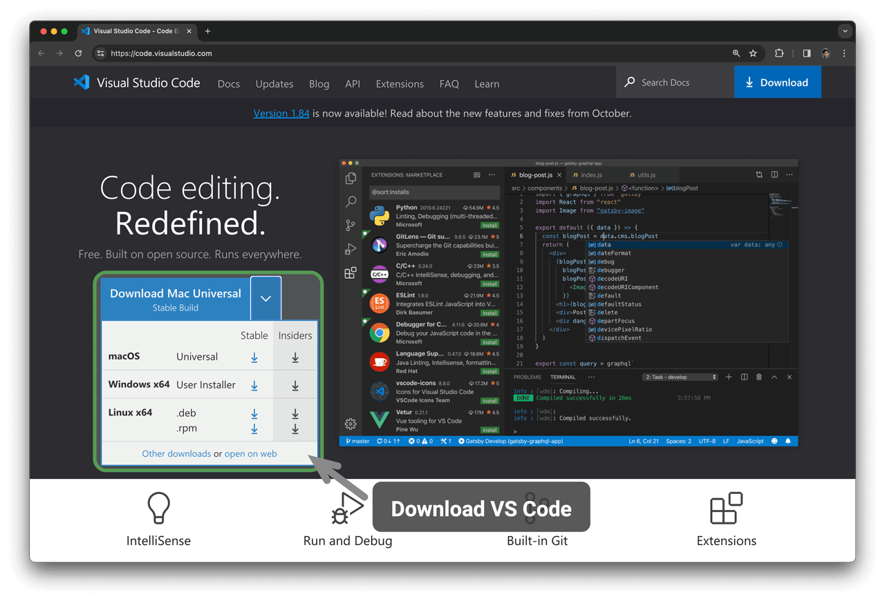

# Установка среды программирования

## Установка IDE

В качестве локальной интегрированной среды разработки (IDE) рекомендуется использовать открытую и легковесную VS Code. Перейдите на [официальный сайт VS Code](https://code.visualstudio.com/), выберите версию для своей операционной системы и установите ее.

VS Code обладает мощной экосистемой расширений и поддерживает запуск и отладку большинства языков программирования. Например, после установки расширения "Python Extension Pack" можно отлаживать код на Python. Процесс установки показан на рисунке ниже.

## Установка языковой среды

### Среда Python

1. Загрузите и установите [Miniconda3](https://docs.conda.io/en/latest/miniconda.html), требуется Python 3.10 или более новая версия.
2. В магазине расширений VS Code найдите `python` и установите Python Extension Pack.
3. (Необязательно) Введите в командной строке `pip install black`, чтобы установить инструмент форматирования кода.

### Среда C/C++

1. В Windows требуется установить [MinGW](https://sourceforge.net/projects/mingw-w64/files/) ([руководство по настройке](https://blog.csdn.net/qq_33698226/article/details/129031241)); в macOS Clang уже установлен по умолчанию.
2. В магазине расширений VS Code найдите `c++` и установите C/C++ Extension Pack.
3. (Необязательно) Откройте страницу Settings, найдите параметр форматирования `Clang_format_fallback Style` и задайте значение `{ BasedOnStyle: Microsoft, BreakBeforeBraces: Attach }`.

### Среда Java

1. Загрузите и установите [OpenJDK](https://jdk.java.net/18/) (требуемая версия: > JDK 9).
2. В магазине расширений VS Code найдите `java` и установите Extension Pack for Java.

### Среда C#

1. Загрузите и установите [.Net 8.0](https://dotnet.microsoft.com/en-us/download).
2. В магазине расширений VS Code найдите `C# Dev Kit` и установите C# Dev Kit ([руководство по настройке](https://code.visualstudio.com/docs/csharp/get-started)).
3. Также можно использовать Visual Studio ([руководство по установке](https://learn.microsoft.com/zh-cn/visualstudio/install/install-visual-studio?view=vs-2022)).

### Среда Go

1. Загрузите и установите [go](https://go.dev/dl/).
2. В магазине расширений VS Code найдите `go` и установите Go.
3. Нажмите `Ctrl + Shift + P`, чтобы открыть командную палитру, введите `go`, выберите `Go: Install/Update Tools`, отметьте все инструменты и установите их.

### Среда Swift

1. Загрузите и установите [Swift](https://www.swift.org/download/).
2. В магазине расширений VS Code найдите `swift` и установите [Swift for Visual Studio Code](https://marketplace.visualstudio.com/items?itemName=sswg.swift-lang).

### Среда JavaScript

1. Загрузите и установите [Node.js](https://nodejs.org/en/).
2. (Необязательно) В магазине расширений VS Code найдите `Prettier` и установите инструмент форматирования кода.

### Среда TypeScript

1. Выполните те же шаги, что и для среды JavaScript.
2. Установите [TypeScript Execute (tsx)](https://github.com/privatenumber/tsx?tab=readme-ov-file#global-installation).
3. В магазине расширений VS Code найдите `typescript` и установите [Pretty TypeScript Errors](https://marketplace.visualstudio.com/items?itemName=yoavbls.pretty-ts-errors).

### Среда Dart

1. Загрузите и установите [Dart](https://dart.dev/get-dart).
2. В магазине расширений VS Code найдите `dart` и установите [Dart](https://marketplace.visualstudio.com/items?itemName=Dart-Code.dart-code).

### Среда Rust

1. Загрузите и установите [Rust](https://www.rust-lang.org/tools/install).
2. В магазине расширений VS Code найдите `rust` и установите [rust-analyzer](https://marketplace.visualstudio.com/items?itemName=rust-lang.rust-analyzer).
