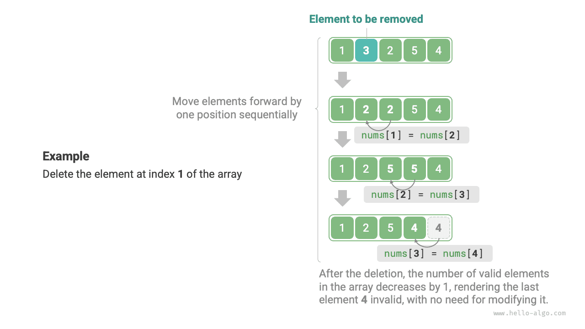

# Массив

<u>Массив (array)</u> - это линейная структура данных, которая хранит элементы одного типа в непрерывной области памяти. Положение элемента в массиве называется его <u>индексом (index)</u>. На рисунке ниже показаны основные понятия, связанные с массивом, и способ его хранения.


## Основные операции с массивом

### Инициализация массива

В зависимости от задачи мы можем выбрать один из двух способов инициализации массива: без начальных значений или с заданными начальными значениями. Если начальные значения не указаны, большинство языков программирования инициализируют элементы массива значением $0$ :

=== "Python"

    ```python title="array.py"
    # Инициализация массива
    arr: list[int] = [0] * 5  # [ 0, 0, 0, 0, 0 ]
    nums: list[int] = [1, 3, 2, 5, 4]
    ```

=== "C++"

    ```cpp title="array.cpp"
    /* Инициализация массива */
    // Хранится в стеке
    int arr[5];
    int nums[5] = { 1, 3, 2, 5, 4 };
    // Хранится в куче (требуется ручное освобождение памяти)
    int* arr1 = new int[5];
    int* nums1 = new int[5] { 1, 3, 2, 5, 4 };
    ```

=== "Java"

    ```java title="array.java"
    /* Инициализация массива */
    int[] arr = new int[5]; // { 0, 0, 0, 0, 0 }
    int[] nums = { 1, 3, 2, 5, 4 };
    ```

=== "C#"

    ```csharp title="array.cs"
    /* Инициализация массива */
    int[] arr = new int[5]; // [ 0, 0, 0, 0, 0 ]
    int[] nums = [1, 3, 2, 5, 4];
    ```

=== "Go"

    ```go title="array.go"
    /* Инициализация массива */
    var arr [5]int
    // В Go указание длины ([5]int) создает массив, а отсутствие длины ([]int) - срез
    // Поскольку длина массива в Go определяется на этапе компиляции, для задания длины можно использовать только константы
    // Чтобы упростить реализацию метода extend(), ниже будем рассматривать срезы (Slice) как массивы (Array)
    nums := []int{1, 3, 2, 5, 4}
    ```

=== "Swift"

    ```swift title="array.swift"
    /* Инициализация массива */
    let arr = Array(repeating: 0, count: 5) // [0, 0, 0, 0, 0]
    let nums = [1, 3, 2, 5, 4]
    ```

=== "JS"

    ```javascript title="array.js"
    /* Инициализация массива */
    var arr = new Array(5).fill(0);
    var nums = [1, 3, 2, 5, 4];
    ```

=== "TS"

    ```typescript title="array.ts"
    /* Инициализация массива */
    let arr: number[] = new Array(5).fill(0);
    let nums: number[] = [1, 3, 2, 5, 4];
    ```

=== "Dart"

    ```dart title="array.dart"
    /* Инициализация массива */
    List<int> arr = List.filled(5, 0); // [0, 0, 0, 0, 0]
    List<int> nums = [1, 3, 2, 5, 4];
    ```

=== "Rust"

    ```rust title="array.rs"
    /* Инициализация массива */
    let arr: [i32; 5] = [0; 5]; // [0, 0, 0, 0, 0]
    let slice: &[i32] = &[0; 5];
    // В Rust указание длины ([i32; 5]) создает массив, а отсутствие длины (&[i32]) - срез
    // Поскольку длина массива в Rust определяется на этапе компиляции, для задания длины можно использовать только константы
    // Vector в Rust обычно используется как динамический массив
    // Чтобы упростить реализацию метода extend(), ниже будем рассматривать vector как массив (array)
    let nums: Vec<i32> = vec![1, 3, 2, 5, 4];
    ```

=== "C"

    ```c title="array.c"
    /* Инициализация массива */
    int arr[5] = { 0 }; // { 0, 0, 0, 0, 0 }
    int nums[5] = { 1, 3, 2, 5, 4 };
    ```

=== "Kotlin"

    ```kotlin title="array.kt"
    /* Инициализация массива */
    var arr = IntArray(5) // { 0, 0, 0, 0, 0 }
    var nums = intArrayOf(1, 3, 2, 5, 4)
    ```

=== "Ruby"

    ```ruby title="array.rb"
    # Инициализация массива
    arr = Array.new(5, 0)
    nums = [1, 3, 2, 5, 4]
    ```

??? pythontutor "Визуализация выполнения"

    https://pythontutor.com/render.html#code=%23%20%D0%98%D0%BD%D0%B8%D1%86%D0%B8%D0%B0%D0%BB%D0%B8%D0%B7%D0%B8%D1%80%D0%BE%D0%B2%D0%B0%D1%82%D1%8C%20%D0%BC%D0%B0%D1%81%D1%81%D0%B8%D0%B2%0Aarr%20%3D%20%5B0%5D%20%2A%205%20%20%23%20%5B%200%2C%200%2C%200%2C%200%2C%200%20%5D%0Anums%20%3D%20%5B1%2C%203%2C%202%2C%205%2C%204%5D&cumulative=false&curInstr=0&heapPrimitives=nevernest&mode=display&origin=opt-frontend.js&py=311&rawInputLstJSON=%5B%5D&textReferences=false

### Доступ к элементам

Элементы массива хранятся в непрерывной области памяти, а это означает, что вычислить адрес любого элемента очень просто. Зная адрес массива в памяти (то есть адрес первого элемента) и индекс некоторого элемента, мы можем по формуле с рисунка ниже вычислить адрес этого элемента и напрямую обратиться к нему.


Если посмотреть на рисунок выше, можно заметить, что индекс первого элемента массива равен $0$ , и это кажется не слишком интуитивным, ведь естественнее было бы начинать счет с $1$ . Однако с точки зрения формулы адресации **индекс по сути является смещением относительно адреса памяти**. Смещение первого элемента равно $0$ , поэтому индекс $0$ вполне логичен.

Доступ к элементам массива очень эффективен: любой элемент массива можно получить за $O(1)$ времени.

```src
[file]{array}-[class]{}-[func]{random_access}
```

### Вставка элемента

Элементы массива в памяти расположены "вплотную" друг к другу, и между ними нет места для размещения новых данных. Как показано на рисунке ниже, если мы хотим вставить элемент в середину массива, то все элементы после этой позиции нужно сдвинуть на одну позицию вправо, а затем записать новое значение в освободившийся индекс.


Стоит отметить, что длина массива фиксирована, поэтому вставка нового элемента неизбежно приведет к "потере" элемента на конце массива. Решение этой проблемы мы оставим для обсуждения в разделе о "списках".

```src
[file]{array}-[class]{}-[func]{insert}
```

### Удаление элемента

Аналогично, как показано на рисунке ниже, если нужно удалить элемент по индексу $i$ , то все элементы после индекса $i$ необходимо сдвинуть на одну позицию влево.



Обрати внимание: после удаления исходный последний элемент становится "бессмысленным", поэтому специально изменять его не требуется.

```src
[file]{array}-[class]{}-[func]{remove}
```

В целом операции вставки и удаления в массиве имеют следующие недостатки.

- **Высокая временная сложность**: средняя временная сложность и вставки, и удаления равна $O(n)$ , где $n$ - длина массива.
- **Потеря элементов**: поскольку длина массива неизменяема, после вставки элементы, выходящие за пределы длины массива, будут потеряны.
- **Потери памяти**: можно заранее инициализировать более длинный массив и использовать только его переднюю часть; тогда "теряемые" при вставке элементы на конце не будут нести смысла, но такой подход приводит к лишнему расходу памяти.

### Обход массива

В большинстве языков программирования массив можно обходить как по индексу, так и напрямую перебирая каждый элемент:

```src
[file]{array}-[class]{}-[func]{traverse}
```

### Поиск элемента

Чтобы найти заданный элемент в массиве, нужно пройти по массиву и на каждой итерации проверять, совпадает ли значение; если совпадает, вернуть соответствующий индекс.

Поскольку массив - это линейная структура данных, такая операция поиска называется "линейным поиском".

```src
[file]{array}-[class]{}-[func]{find}
```

### Расширение массива

В сложной системной среде программа не может гарантировать, что память сразу после массива доступна, поэтому безопасно расширить емкость массива невозможно. Поэтому в большинстве языков программирования **длина массива неизменяема**.

Если мы хотим расширить массив, нужно заново создать больший массив и затем по одному скопировать в него элементы исходного массива. Это операция с временной сложностью $O(n)$ , и при больших массивах она очень затратна. Соответствующий код показан ниже:

```src
[file]{array}-[class]{}-[func]{extend}
```

## Преимущества и ограничения массива

Массив хранится в непрерывной области памяти, и все его элементы имеют один и тот же тип. Такой подход содержит много априорной информации, которую система может использовать для оптимизации эффективности операций со структурой данных.

- **Высокая пространственная эффективность**: массив выделяет для данных непрерывный блок памяти без дополнительного структурного накладного расхода.
- **Поддержка произвольного доступа**: массив позволяет обращаться к любому элементу за $O(1)$ времени.
- **Локальность кэша**: при обращении к элементу массива компьютер загружает не только сам элемент, но и соседние данные, что позволяет использовать кэш для ускорения последующих операций.

Хранение в непрерывной области памяти - палка о двух концах, и у него есть следующие ограничения.

- **Низкая эффективность вставки и удаления**: когда элементов в массиве много, вставка и удаление требуют сдвига большого количества элементов.
- **Неизменяемая длина**: после инициализации длина массива фиксирована; расширение массива требует копирования всех данных в новый массив, что стоит дорого.
- **Потери памяти**: если выделенный массив больше, чем реально необходимо, лишнее пространство пропадает впустую.

## Типичные применения массива

Массив - это базовая и очень распространенная структура данных. Он часто используется как в различных алгоритмах, так и при реализации более сложных структур данных.

- **Произвольный доступ**: если мы хотим случайным образом выбирать некоторые образцы, можно сохранить их в массиве и сгенерировать случайную последовательность индексов для выборки.
- **Сортировка и поиск**: массив - самая распространенная структура данных для алгоритмов сортировки и поиска. Быстрая сортировка, сортировка слиянием, бинарный поиск и многие другие алгоритмы в основном работают именно с массивами.
- **Таблица поиска**: когда нужно быстро находить элемент или его соответствие, массив можно использовать как lookup table. Например, если мы хотим реализовать отображение символов в коды ASCII, можно использовать значение ASCII как индекс, а соответствующий элемент хранить по этой позиции массива.
- **Машинное обучение**: в нейронных сетях широко используются операции линейной алгебры над векторами, матрицами и тензорами, и все эти данные строятся в форме массивов. Массив - самая часто используемая структура данных в программировании нейросетей.
- **Реализация структур данных**: массивы можно использовать для реализации стеков, очередей, хеш-таблиц, куч, графов и других структур данных. Например, матрица смежности графа по сути является двумерным массивом.
