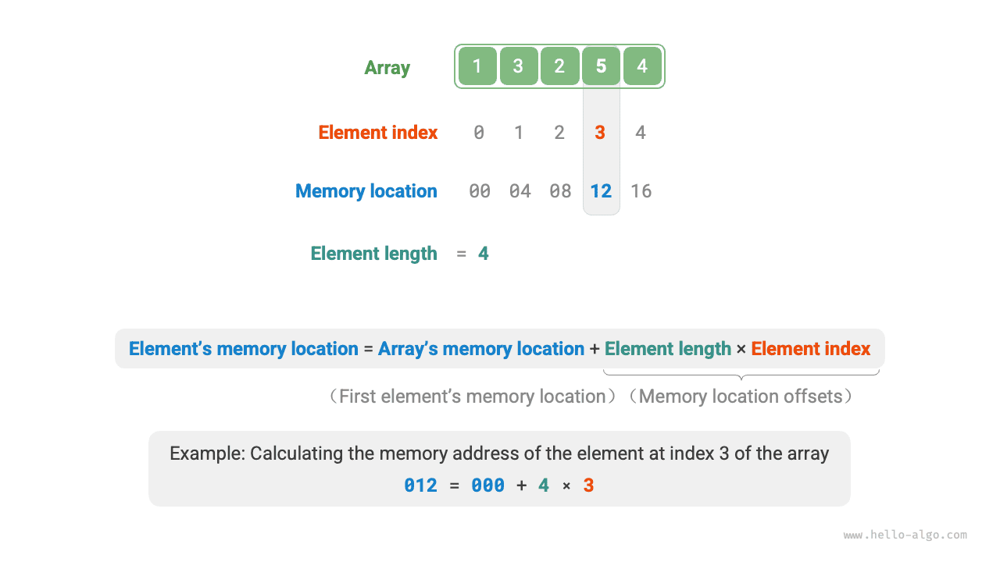
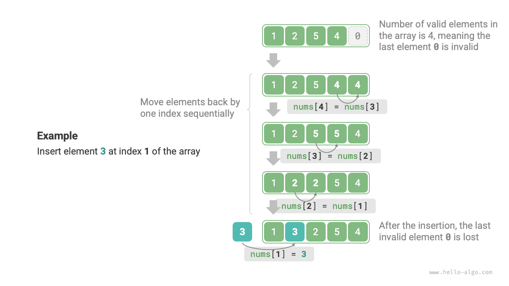

# Массив

<u>Массив (array)</u> представляет собой линейную структуру данных, в которой элементы одного типа хранятся в непрерывной области памяти. Положение элемента в массиве называется его <u>индексом (index)</u>. На рисунке ниже изображены основные поня- тия и способ хранения массивов.


## Основные операции с массивом

### Инициализация массива

Существует два способа инициализации массива: без начальных значений и с заданными начальными значениями. Если начальные значения не указаны, большинство языков программирования инициализируют элементы массива нулями:

=== "Python"

    ```python title="array.py"
    # Инициализация массива
    arr: list[int] = [0] * 5  # [ 0, 0, 0, 0, 0 ]
    nums: list[int] = [1, 3, 2, 5, 4]
    ```

=== "C++"

    ```cpp title="array.cpp"
    /* Инициализация массива */
    // Хранится в стеке
    int arr[5];
    int nums[5] = { 1, 3, 2, 5, 4 };
    // Хранится в куче (требуется ручное освобождение памяти)
    int* arr1 = new int[5];
    int* nums1 = new int[5] { 1, 3, 2, 5, 4 };
    ```

=== "Java"

    ```java title="array.java"
    /* Инициализация массива */
    int[] arr = new int[5]; // { 0, 0, 0, 0, 0 }
    int[] nums = { 1, 3, 2, 5, 4 };
    ```

=== "C#"

    ```csharp title="array.cs"
    /* Инициализация массива */
    int[] arr = new int[5]; // [ 0, 0, 0, 0, 0 ]
    int[] nums = [1, 3, 2, 5, 4];
    ```

=== "Go"

    ```go title="array.go"
    /* Инициализация массива */
    var arr [5]int
    // В Go указание длины ([5]int) создает массив, а отсутствие длины ([]int) - срез
    // Поскольку длина массива в Go определяется на этапе компиляции, для задания длины можно использовать только константы
    // Чтобы упростить реализацию метода extend(), ниже будем рассматривать срезы (Slice) как массивы (Array)
    nums := []int{1, 3, 2, 5, 4}
    ```

=== "Swift"

    ```swift title="array.swift"
    /* Инициализация массива */
    let arr = Array(repeating: 0, count: 5) // [0, 0, 0, 0, 0]
    let nums = [1, 3, 2, 5, 4]
    ```

=== "JS"

    ```javascript title="array.js"
    /* Инициализация массива */
    var arr = new Array(5).fill(0);
    var nums = [1, 3, 2, 5, 4];
    ```

=== "TS"

    ```typescript title="array.ts"
    /* Инициализация массива */
    let arr: number[] = new Array(5).fill(0);
    let nums: number[] = [1, 3, 2, 5, 4];
    ```

=== "Dart"

    ```dart title="array.dart"
    /* Инициализация массива */
    List<int> arr = List.filled(5, 0); // [0, 0, 0, 0, 0]
    List<int> nums = [1, 3, 2, 5, 4];
    ```

=== "Rust"

    ```rust title="array.rs"
    /* Инициализация массива */
    let arr: [i32; 5] = [0; 5]; // [0, 0, 0, 0, 0]
    let slice: &[i32] = &[0; 5];
    // В Rust указание длины ([i32; 5]) создает массив, а отсутствие длины (&[i32]) - срез
    // Поскольку длина массива в Rust определяется на этапе компиляции, для задания длины можно использовать только константы
    // Vector в Rust обычно используется как динамический массив
    // Чтобы упростить реализацию метода extend(), ниже будем рассматривать vector как массив (array)
    let nums: Vec<i32> = vec![1, 3, 2, 5, 4];
    ```

=== "C"

    ```c title="array.c"
    /* Инициализация массива */
    int arr[5] = { 0 }; // { 0, 0, 0, 0, 0 }
    int nums[5] = { 1, 3, 2, 5, 4 };
    ```

=== "Kotlin"

    ```kotlin title="array.kt"
    /* Инициализация массива */
    var arr = IntArray(5) // { 0, 0, 0, 0, 0 }
    var nums = intArrayOf(1, 3, 2, 5, 4)
    ```

=== "Ruby"

    ```ruby title="array.rb"
    # Инициализация массива
    arr = Array.new(5, 0)
    nums = [1, 3, 2, 5, 4]
    ```

??? pythontutor "Визуализация выполнения"

    https://pythontutor.com/render.html#code=%23%20%D0%98%D0%BD%D0%B8%D1%86%D0%B8%D0%B0%D0%BB%D0%B8%D0%B7%D0%B8%D1%80%D0%BE%D0%B2%D0%B0%D1%82%D1%8C%20%D0%BC%D0%B0%D1%81%D1%81%D0%B8%D0%B2%0Aarr%20%3D%20%5B0%5D%20%2A%205%20%20%23%20%5B%200%2C%200%2C%200%2C%200%2C%200%20%5D%0Anums%20%3D%20%5B1%2C%203%2C%202%2C%205%2C%204%5D&cumulative=false&curInstr=0&heapPrimitives=nevernest&mode=display&origin=opt-frontend.js&py=311&rawInputLstJSON=%5B%5D&textReferences=false

### Доступ к элементам массива

Элементы массива хранятся в непрерывной области памяти, что упрощает вычисление их адресов. Зная адрес массива (адрес первого элемента) и индекс элемента, можно вычислить адрес этого элемента по формуле, показанной на рис. 4.2, и получить к нему доступ.



Как видно из рисунки выше, индекс первого элемента массива равен $0$ , что может показаться неочевидным, так как отсчет с $1$ кажется более естественным. Однако с точки зрения формулы вычисления адреса **индекс является смещением адреса в памяти**. Смещение адреса первого элемента равно $0$ , поэтому и его индекс равен $0$.

Доступ к элементам массива осуществляется очень эффективно, так как позволяет за время $O(1)$ произвольно обращаться к любому элементу.

```src
[file]{array}-[class]{}-[func]{random_access}
```  

### Вставка элемента

Элементы массива в памяти расположены вплотну, между ними нет места для хранения других данных. Для вставки элемента в середину массива не- обходимо сдвинуть все  последующие элементы на  одну  позицию вправо,  а затем присвоить значение элементу по заданному индексу, как показано на рисунке ниже.



Стоит отметить, что длина массива фиксирована, поэтому вставка элемента неизбежно приведет к потере элемента на конце массива. Решение этой проблемы будет рассмотрено в разделе «Списки».

```src
[file]{array}-[class]{}-[func]{insert}
``` 

### Удаление элемента

Аналогично для удаления элемента по индексу $i$ необходимо сдвинуть все по- следующие элементы на одну позицию влево, как показано на рисунке ниже.


Обратите внимание, что после удаления элемента последний элемент ста- новится бессмысленным, поэтому его можно не изменять.

```src
[file]{array}-[class]{}-[func]{remove}
```  

В целом операции вставки и удаления в массиве имеют следующие недостатки.

- **Высокая временная сложность**: средняя временная сложность операций вставки и удаления в массиве составляет $O(n)$ , где $n$ - длина массива.
- **Потеря элементов**: так как длина массива фиксирована, при вставке элемента элементы, выходящие за пределы длины массива, теряются.
- **Расточительность памяти**: можно инициализировать длинный массив и использовать только его часть, но это приведет к потере памяти, так как неиспользуемые элементы в конце массива будут бессмысленными.

### Обход массива

В большинстве языков программирования массив можно обходить как по индексам, так и непосредственно по элементам.

```src
[file]{array}-[class]{}-[func]{traverse}
```  

### Поиск элемента

Для поиска заданного элемента в массиве необходимо обойти массив и на каждой итерации проверить, совпадает ли значение элемента с искомым. Если совпадает, вывести соответствующий индекс. Поскольку массив яв- ляется линейной структурой данных, этот процесс называется линейным поиском.

```src
[file]{array}-[class]{}-[func]{find}
```

### Расширение массива

В сложных системных средах нельзя гарантировать, что ячейки памяти, расположенные после массива, являются свободными. Это делает невоз- можным безопасное расширение его размера. Поэтому в большинстве язы- ков программирования **длина массива фиксирована**.

Если необходимо уве- личить массив, нужно создать новый, больший массив и последовательно скопировать в него элементы исходного массива. Эта операция имеет слож- ность $O(n)$ и при больших массивах занимает много времени. Пример кода представлен ниже.

```src
[file]{array}-[class]{}-[func]{extend}
```  

## Преимущества и ограничения массива

Массивы хранятся в непрерывном пространстве памяти, а его элементы име- ют одинаковый тип. Этот подход содержит богатую априорную информацию, которую система может использовать для оптимизации эффективности опе- раций с данной структурой данных.

- **Высокая эффективность использования пространства**: массивы выделяют непрерывные блоки памяти для данных без дополнительных структурных затрат.
- **Поддержка произвольного доступа**: массивы позволяют получить до- ступ к любому элементу за время $O(1)$.
- **Локальность кеширования**: при доступе к элементам массива компью- тер загружает не только его, но и кеширует окружающие данные, что позволяет ускорить выполнение последующих операций за счет использования высокоскоростного кеша.

Непрерывное хранение в пространстве – это палка о двух концах, имеющая следующие ограничения.

- **Низкая эффективность вставки и удаления**: при большом количестве элементов в массиве операции вставки и удаления требуют перемеще- ния множества элементов.
- **Неизменная длина**: после инициализации длина массива фиксируется, а увеличение массива требует копирования всех данных в новый массив, что влечет за собой значительные затраты.
- **Расточительность пространства**: если размер выделенного массива превышает фактические потребности, избыточное пространство оказы- вается потраченным впустую.

## Типичные сценарии применения массивов

Массивы – это базовая и распространенная структура данных, часто исполь- зуемая в различных алгоритмах и для реализации сложных структур данных.

- **Произвольный доступ**: если требуется случайный выбор элементов, можно использовать массив для хранения и генерации случайной по- следовательности, осуществляя случайную выборку по индексу.
- **Сортировка и поиск**: массивы являются наиболее часто используемой структурой данных для алгоритмов сортировки и поиска. Быстрая сорти- ровка, сортировка слиянием, двоичный поиск и другие алгоритмы в ос- новном работают с массивами.
- **Таблица поиска**: когда необходимо быстро найти элемент или его со- ответствие, можно использовать массив в качестве таблицы поиска. На- пример, для реализации отображения символов в ASCII-коды можно использовать значение ASCII-кода символа в качестве индекса, а соот- ветствующий элемент хранить в соответствующем месте массива.
- **Машинное обучение**: в нейронных сетях широко используются опе- рации линейной алгебры между векторами, матрицами и тензорами, которые реализуются в виде массивов. Массивы являются наиболее часто используемой структурой данных в программировании ней- ронных сетей.
- **Реализация структур данных**: массивы могут использоваться для ре- ализации стека, очереди, хеш-таблицы, кучи, графа и других структур данных. Например, представление графа в виде матрицы смежности фактически является двумерным массивом.
