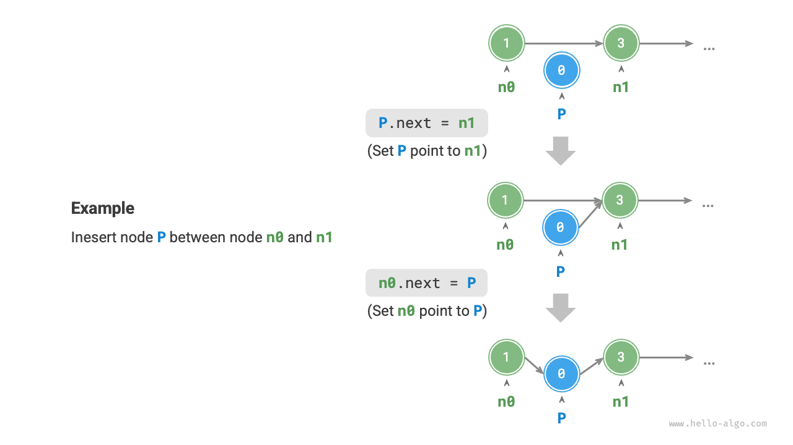
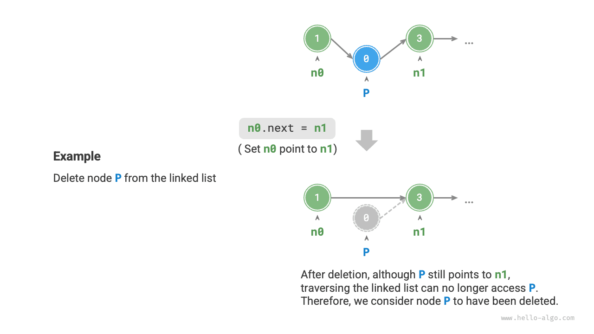

# Связные списки

Память -- это общий ресурс всех программ, и в сложной системной среде выполнения участки свободной памяти могут быть разбросаны по всему пространству памяти. Нам уже известно, что память для хранения массива должна быть непрерывной, и когда массив очень велик, в памяти может не оказаться столь большого непрерывного участка. В этом случае проявляется преимущество гибкости связного списка.

<u>Связный список（linked list）</u> -- это линейная структура данных, в которой каждый элемент является объектом-узлом. При этом узлы соединяются друг с другом с помощью ссылок. В ссылке хранится адрес памяти следующего узла, по которому можно перейти от текущего узла к следующему.

Структура связного списка позволяет узлам храниться в различных местах памяти, а их адреса памяти не обязаны быть последовательными.


【comments from yuyan】 此处出现图4.5，是否需要修改为“以上图片”
На рис. 4.5 изображена структура связного списка. Составным элементом является объект <u>узла (node)</u>. Каждый узел содержит две части данных: значение узла и ссылку на следующий узел.

- Первый узел связного списка называется головным узлом, а последний узел -- хвостовым узлом.
- Хвостовой узел указывает на пустое значение, которое в Java, C++ и Python обозначается как  `null`,`nullptr` и `None` соответственно.
- В языках, поддерживающих указатели, таких как C, C++, Go и Rust, вышеупомянутая ссылка заменена на указатель.

В следующем примере кода показано, что узел связного списка `ListNode`, помимо значения, должен дополнительно хранить ссылку (указатель). Поэтому при одинаковом объеме данных **связный список занимает больше памяти, чем массив**.

=== "Python"

    ```python title=""
    class ListNode:
        """Класс узла связного списка"""
        def __init__(self, val: int):
            self.val: int = val               # Значение узла
            self.next: ListNode | None = None # Ссылка на следующий узел
    ```

=== "C++"

    ```cpp title=""
    /* Структура узла связного списка */
    struct ListNode {
        int val;         // Значение узла
        ListNode *next;  // Указатель на следующий узел
        ListNode(int x) : val(x), next(nullptr) {}  // Конструктор
    };
    ```

=== "Java"

    ```java title=""
    /* Класс узла связного списка */
    class ListNode {
        int val;        // Значение узла
        ListNode next;  // Ссылка на следующий узел
        ListNode(int x) { val = x; }  // Конструктор
    }
    ```

=== "C#"

    ```csharp title=""
    /* Класс узла связного списка */
    class ListNode(int x) {  // Конструктор
        int val = x;         // Значение узла
        ListNode? next;      // Ссылка на следующий узел
    }
    ```

=== "Go"

    ```go title=""
    /* Структура узла связного списка */
    type ListNode struct {
        Val  int       // Значение узла
        Next *ListNode // Указатель на следующий узел
    }

    // Конструктор NewListNode, создает новый связный список
    func NewListNode(val int) *ListNode {
        return &ListNode{
            Val:  val,
            Next: nil,
        }
    }
    ```

=== "Swift"

    ```swift title=""
    /* Класс узла связного списка */
    class ListNode {
        var val: Int // Значение узла
        var next: ListNode? // Ссылка на следующий узел

        init(x: Int) { // Конструктор
            val = x
        }
    }
    ```

=== "JS"

    ```javascript title=""
    /* Класс узла связного списка */
    class ListNode {
        constructor(val, next) {
            this.val = (val === undefined ? 0 : val);       // Значение узла
            this.next = (next === undefined ? null : next); // Ссылка на следующий узел
        }
    }
    ```

=== "TS"

    ```typescript title=""
    /* Класс узла связного списка */
    class ListNode {
        val: number;
        next: ListNode | null;
        constructor(val?: number, next?: ListNode | null) {
            this.val = val === undefined ? 0 : val;        // Значение узла
            this.next = next === undefined ? null : next;  // Ссылка на следующий узел
        }
    }
    ```

=== "Dart"

    ```dart title=""
    /* Класс узла связного списка */
    class ListNode {
      int val; // Значение узла
      ListNode? next; // Ссылка на следующий узел
      ListNode(this.val, [this.next]); // Конструктор
    }
    ```

=== "Rust"

    ```rust title=""
    use std::rc::Rc;
    use std::cell::RefCell;
    /* Класс узла связного списка */
    #[derive(Debug)]
    struct ListNode {
        val: i32, // Значение узла
        next: Option<Rc<RefCell<ListNode>>>, // Указатель на следующий узел
    }
    ```

=== "C"

    ```c title=""
    /* Структура узла связного списка */
    typedef struct ListNode {
        int val;               // Значение узла
        struct ListNode *next; // Указатель на следующий узел
    } ListNode;

    /* Конструктор */
    ListNode *newListNode(int val) {
        ListNode *node;
        node = (ListNode *) malloc(sizeof(ListNode));
        node->val = val;
        node->next = NULL;
        return node;
    }
    ```

=== "Kotlin"

    ```kotlin title=""
    /* Класс узла связного списка */
    // Конструктор
    class ListNode(x: Int) {
        val _val: Int = x          // Значение узла
        val next: ListNode? = null // Ссылка на следующий узел
    }
    ```

=== "Ruby"

    ```ruby title=""
    # Класс узла связного списка
    class ListNode
      attr_accessor :val  # Значение узла
      attr_accessor :next # Ссылка на следующий узел

      def initialize(val=0, next_node=nil)
        @val = val
        @next = next_node
      end
    end
    ```

## Основные операции со связным списком

### Инициализация связного списка

Создание связного списка состоит из двух этапов: первый этап -- инициализация каждого объекта узла, второй этап -- построение ссылочных отношений между узлами. После завершения инициализации можно начать с головного узла связного списка и последовательно посетить все узлы через ссылку `next`.

=== "Python"

    ```python title="linked_list.py"
    # Инициализация связного списка 1 -> 3 -> 2 -> 5 -> 4
    # Инициализация каждого узла
    n0 = ListNode(1)
    n1 = ListNode(3)
    n2 = ListNode(2)
    n3 = ListNode(5)
    n4 = ListNode(4)
    # Построение ссылок между узлами
    n0.next = n1
    n1.next = n2
    n2.next = n3
    n3.next = n4
    ```

=== "C++"

    ```cpp title="linked_list.cpp"
    /* Инициализация связного списка 1 -> 3 -> 2 -> 5 -> 4 */
    // Инициализация каждого узла
    ListNode* n0 = new ListNode(1);
    ListNode* n1 = new ListNode(3);
    ListNode* n2 = new ListNode(2);
    ListNode* n3 = new ListNode(5);
    ListNode* n4 = new ListNode(4);
    // Построение ссылок между узлами
    n0->next = n1;
    n1->next = n2;
    n2->next = n3;
    n3->next = n4;
    ```

=== "Java"

    ```java title="linked_list.java"
    /* Инициализация связного списка 1 -> 3 -> 2 -> 5 -> 4 */
    // Инициализация каждого узла
    ListNode n0 = new ListNode(1);
    ListNode n1 = new ListNode(3);
    ListNode n2 = new ListNode(2);
    ListNode n3 = new ListNode(5);
    ListNode n4 = new ListNode(4);
    // Построение ссылок между узлами
    n0.next = n1;
    n1.next = n2;
    n2.next = n3;
    n3.next = n4;
    ```

=== "C#"

    ```csharp title="linked_list.cs"
    /* Инициализация связного списка 1 -> 3 -> 2 -> 5 -> 4 */
    // Инициализация каждого узла
    ListNode n0 = new(1);
    ListNode n1 = new(3);
    ListNode n2 = new(2);
    ListNode n3 = new(5);
    ListNode n4 = new(4);
    // Построение ссылок между узлами
    n0.next = n1;
    n1.next = n2;
    n2.next = n3;
    n3.next = n4;
    ```

=== "Go"

    ```go title="linked_list.go"
    /* Инициализация связного списка 1 -> 3 -> 2 -> 5 -> 4 */
    // Инициализация каждого узла
    n0 := NewListNode(1)
    n1 := NewListNode(3)
    n2 := NewListNode(2)
    n3 := NewListNode(5)
    n4 := NewListNode(4)
    // Построение ссылок между узлами
    n0.Next = n1
    n1.Next = n2
    n2.Next = n3
    n3.Next = n4
    ```

=== "Swift"

    ```swift title="linked_list.swift"
    /* Инициализация связного списка 1 -> 3 -> 2 -> 5 -> 4 */
    // Инициализация каждого узла
    let n0 = ListNode(x: 1)
    let n1 = ListNode(x: 3)
    let n2 = ListNode(x: 2)
    let n3 = ListNode(x: 5)
    let n4 = ListNode(x: 4)
    // Построение ссылок между узлами
    n0.next = n1
    n1.next = n2
    n2.next = n3
    n3.next = n4
    ```

=== "JS"

    ```javascript title="linked_list.js"
    /* Инициализация связного списка 1 -> 3 -> 2 -> 5 -> 4 */
    // Инициализация каждого узла
    const n0 = new ListNode(1);
    const n1 = new ListNode(3);
    const n2 = new ListNode(2);
    const n3 = new ListNode(5);
    const n4 = new ListNode(4);
    // Построение ссылок между узлами
    n0.next = n1;
    n1.next = n2;
    n2.next = n3;
    n3.next = n4;
    ```

=== "TS"

    ```typescript title="linked_list.ts"
    /* Инициализация связного списка 1 -> 3 -> 2 -> 5 -> 4 */
    // Инициализация каждого узла
    const n0 = new ListNode(1);
    const n1 = new ListNode(3);
    const n2 = new ListNode(2);
    const n3 = new ListNode(5);
    const n4 = new ListNode(4);
    // Построение ссылок между узлами
    n0.next = n1;
    n1.next = n2;
    n2.next = n3;
    n3.next = n4;
    ```

=== "Dart"

    ```dart title="linked_list.dart"
    /* Инициализация связного списка 1 -> 3 -> 2 -> 5 -> 4 */
    // Инициализация каждого узла
    ListNode n0 = ListNode(1);
    ListNode n1 = ListNode(3);
    ListNode n2 = ListNode(2);
    ListNode n3 = ListNode(5);
    ListNode n4 = ListNode(4);
    // Построение ссылок между узлами
    n0.next = n1;
    n1.next = n2;
    n2.next = n3;
    n3.next = n4;
    ```

=== "Rust"

    ```rust title="linked_list.rs"
    /* Инициализация связного списка 1 -> 3 -> 2 -> 5 -> 4 */
    // Инициализация каждого узла
    let n0 = Rc::new(RefCell::new(ListNode { val: 1, next: None }));
    let n1 = Rc::new(RefCell::new(ListNode { val: 3, next: None }));
    let n2 = Rc::new(RefCell::new(ListNode { val: 2, next: None }));
    let n3 = Rc::new(RefCell::new(ListNode { val: 5, next: None }));
    let n4 = Rc::new(RefCell::new(ListNode { val: 4, next: None }));

    // Построение ссылок между узлами
    n0.borrow_mut().next = Some(n1.clone());
    n1.borrow_mut().next = Some(n2.clone());
    n2.borrow_mut().next = Some(n3.clone());
    n3.borrow_mut().next = Some(n4.clone());
    ```

=== "C"

    ```c title="linked_list.c"
    /* Инициализация связного списка 1 -> 3 -> 2 -> 5 -> 4 */
    // Инициализация каждого узла
    ListNode* n0 = newListNode(1);
    ListNode* n1 = newListNode(3);
    ListNode* n2 = newListNode(2);
    ListNode* n3 = newListNode(5);
    ListNode* n4 = newListNode(4);
    // Построение ссылок между узлами
    n0->next = n1;
    n1->next = n2;
    n2->next = n3;
    n3->next = n4;
    ```

=== "Kotlin"

    ```kotlin title="linked_list.kt"
    /* Инициализация связного списка 1 -> 3 -> 2 -> 5 -> 4 */
    // Инициализация каждого узла
    val n0 = ListNode(1)
    val n1 = ListNode(3)
    val n2 = ListNode(2)
    val n3 = ListNode(5)
    val n4 = ListNode(4)
    // Построение ссылок между узлами
    n0.next = n1;
    n1.next = n2;
    n2.next = n3;
    n3.next = n4;
    ```

=== "Ruby"

    ```ruby title="linked_list.rb"
    # Инициализация связного списка 1 -> 3 -> 2 -> 5 -> 4
    # Инициализация каждого узла
    n0 = ListNode.new(1)
    n1 = ListNode.new(3)
    n2 = ListNode.new(2)
    n3 = ListNode.new(5)
    n4 = ListNode.new(4)
    # Построение ссылок между узлами
    n0.next = n1
    n1.next = n2
    n2.next = n3
    n3.next = n4
    ```

??? pythontutor "Визуализация выполнения"

    https://pythontutor.com/render.html#code=class%20ListNode%3A%0A%20%20%20%20%22%22%22%E9%93%BE%E8%A1%A8%E8%8A%82%E7%82%B9%E7%B1%BB%22%22%22%0A%20%20%20%20def%20__init__%28self,%20val%3A%20int%29%3A%0A%20%20%20%20%20%20%20%20self.val%3A%20int%20%3D%20val%20%20%23%20%E8%8A%82%E7%82%B9%E5%80%BC%0A%20%20%20%20%20%20%20%20self.next%3A%20ListNode%20%7C%20None%20%3D%20None%20%20%23%20%E5%90%8E%E7%BB%A7%E8%8A%82%E7%82%B9%E5%BC%95%E7%94%A8%0A%0A%22%22%22Driver%20Code%22%22%22%0Aif%20__name__%20%3D%3D%20%22__main__%22%3A%0A%20%20%20%20%23%20%E5%88%9D%E5%A7%8B%E5%8C%96%E9%93%BE%E8%A1%A8%201%20-%3E%203%20-%3E%202%20-%3E%205%20-%3E%204%0A%20%20%20%20%23%20%E5%88%9D%E5%A7%8B%E5%8C%96%E5%90%84%E4%B8%AA%E8%8A%82%E7%82%B9%0A%20%20%20%20n0%20%3D%20ListNode%281%29%0A%20%20%20%20n1%20%3D%20ListNode%283%29%0A%20%20%20%20n2%20%3D%20ListNode%282%29%0A%20%20%20%20n3%20%3D%20ListNode%285%29%0A%20%20%20%20n4%20%3D%20ListNode%284%29%0A%20%20%20%20%23%20%E6%9E%84%E5%BB%BA%E8%8A%82%E7%82%B9%E4%B9%8B%E9%97%B4%E7%9A%84%E5%BC%95%E7%94%A8%0A%20%20%20%20n0.next%20%3D%20n1%0A%20%20%20%20n1.next%20%3D%20n2%0A%20%20%20%20n2.next%20%3D%20n3%0A%20%20%20%20n3.next%20%3D%20n4&cumulative=false&curInstr=3&heapPrimitives=nevernest&mode=display&origin=opt-frontend.js&py=311&rawInputLstJSON=%5B%5D&textReferences=false

Массив в целом является переменной, например массив `nums` содержит элементы `nums[0]` и `nums[1]` и т.д., в то время как связный список состоит из множества независимых объектов-узлов. **Обычно головной узел рассматривается как представитель связного списка**, например, в приведенном выше коде связный список можно обозначить как связный список `n0`.

【comments from yuyan】 以下章节AI均未识别出，手动校准格式，同理，出现图4.6等说法，是否需要按照中文版改为“如下图所示”
### Вставка узла

Процесс вставки узла в  связный список очень прост. Предположим, что необходимо вставить новый узел `P` между двумя соседними узлами `n0` и `n1`, **для этого достаточно изменить две ссылки (указателя)**, а  время выполнения составит $O(1)$, см. рис. 4.6.

Напомним, что вставка элемента в массив имеет временную сложность O(n),что менее эффективно при больших объемах данных.



【comments from yuyan】 下列多个代码和中文版一致，但是和俄语版不一致。例如433行代码为# === File: linked_list.py ===def insert(n0: ListNode, P: ListNode):""" Вставка узла P после узла n0 в связный список."""n1 = n0.nextP.next = n1n0.next = ，是否需要按照俄语版整理
```src
[file]{linked_list}-[class]{}-[func]{insert}
```

### Удаление узла

Удаление узла в связном списке также является очень простой операцией, как показано на рис. 4.7. **Достаточно изменить всего одну ссылку (указатель)**.

Обратите внимание, что, хотя после завершения операции удаления узел `P` все еще указывает на узел `n1`, фактически при обходе этого связного списка доступ к `P` уже невозможен. То есть фактически `P` больше не принадлежит этому списку.



【comments from yuyan】 问题同433行
```src
[file]{linked_list}-[class]{}-[func]{remove}
```

### Доступ к узлу
【comments from yuyan】 “访问链表的第 $i$ 个节点需要循环 $i - 1$ 轮，时间复杂度为 $O(n)$”这句话中“访问第$i$个节点”被翻译为“доступа к $i-му$ узлу”，му这个词尾是变格无法避免，处理为$i-му$，不知是否妥当

**Эффективность доступа к узлам в связном списке ниже.** Как упоминалось в предыдущем разделе, доступ к любому элементу массива можно получить за время $O(1)$. В случае связного списка программа должна начать с головного узла и последовательно проходить по узлам, пока не будет найден целевой узел. Это означает, что для доступа к $i-му$ узлу связного списка необходимо выполнить $i – 1$ итераций, что соответствует временной сложности $O(n)$.

【comments from yuyan】 问题同433行，不再赘述
```src
[file]{linked_list}-[class]{}-[func]{access}
```

### Поиск узла

Поиск узла заключается в обходе связного списка для поиска узла со значением `target` и выводе его индекса в списке. Этот процесс также является линейным поиском. Ниже приведен пример кода.

```src
[file]{linked_list}-[class]{}-[func]{find}
```

##  Сравнение массивов и связных списков

В табл.  4.1 приведены характеристики массивов и  связных списков, а также сравнение эффективности операций с  ними. Поскольку они используют две противоположные стратегии хранения, их свойства и эффективность операций также имеют противоположные характеристики.

<p align="center"> Таблица <id> &nbsp; Сравнение эффективности массивов и связных списков </p>

|                      | Массив                                                                     | Связный список                       |
| -------------------- | -------------------------------------------------------------------------- | ------------------------------------ |
| Способ хранения      | Непрерывное пространство памяти                                            | Распределенное пространство памяти   |
| Расширение емкости   | Длина фиксирована                                                          | Возможность гибкого расширения       |
| Эффективность памяти | Элементы занимают меньше памяти, но могут расходовать пространство впустую | Элементы занимают больше памяти      |
| Доступ к элементу    | $O(1)$                                                                     | $O(n)$                               |
| Добавление элемента  | $O(n)$                                                                     | $O(1)$                               |
| Удаление элемента    | $O(n)$                                                                     | $O(1)$                               |

## Основные типы связных списков

Существуют три основных типа связных списков (см. рис. 4.8).

- **Односвязный список**: это обычный связный список, описанный ранее. Узлы однонаправленного связного списка содержат значение и ссылку на следующий узел. Первый узел называется головным, а последний – хвостовым, хвостовой узел указывает на пустое значение `None`.
- **Кольцевой (циклический) список**: если сделать так, чтобы хвостовой узел односвязного списка указывал на головной узел (соединение начала и конца), получится кольцевой список. В кольцевом списке любой узел можно рассматривать как головной.
- **Двусвязный список**: в  отличие от односвязного двусвязный список хранит ссылки в двух направлениях. Определение узла двусвязного списка включает ссылки (указатели) на следующий и  предыдущий узлы. По  сравнению с  односвязным списком двусвязный список обладает большей гибкостью, позволяя обходить список в  обоих направлениях, но требует больше памяти.

【comments from yuyan】 想知道以下代码在俄语出版书中是否有对应的部分，暂时没有找到，参考其他部分的翻译处理
=== "Python"

    ```python title=""
    class ListNode:
        """Класс узла двусвязного списка"""
        def __init__(self, val: int):
            self.val: int = val                # Значение узла
            self.next: ListNode | None = None  # Ссылка на следующий узел
            self.prev: ListNode | None = None  # Ссылка на предыдущий узел
    ```

=== "C++"

    ```cpp title=""
    /* Структура узла двусвязного списка */
    struct ListNode {
        int val;         // Значение узла
        ListNode *next;  // Указатель на следующий узел
        ListNode *prev;  // Указатель на предыдущий узел
        ListNode(int x) : val(x), next(nullptr), prev(nullptr) {}  // Конструктор
    };
    ```

=== "Java"

    ```java title=""
    /* Класс узла двусвязного списка */
    class ListNode {
        int val;        // Значение узла
        ListNode next;  // Ссылка на следующий узел
        ListNode prev;  // Ссылка на предыдущий узел
        ListNode(int x) { val = x; }  // Конструктор
    }
    ```

=== "C#"

    ```csharp title=""
    /* Класс узла двусвязного списка */
    class ListNode(int x) {  // Конструктор
        int val = x;    // Значение узла
        ListNode next;  // Ссылка на следующий узел
        ListNode prev;  // Ссылка на предыдущий узел
    }
    ```

=== "Go"

    ```go title=""
    /* Структура узла двусвязного списка */
    type DoublyListNode struct {
        Val  int             // Значение узла
        Next *DoublyListNode // Указатель на следующий узел
        Prev *DoublyListNode // Указатель на предыдущий узел

    // Инициализация конструктора NewDoublyListNode
    func NewDoublyListNode(val int) *DoublyListNode {
        return &DoublyListNode{
            Val:  val,
            Next: nil,
            Prev: nil,
        }
    }
    ```

=== "Swift"

    ```swift title=""
    /* Класс узла двусвязного списка */
    class ListNode {
        var val: Int // Значение узла
        var next: ListNode? // Ссылка на следующий узел
        var prev: ListNode? // Ссылка на предыдущий узел

        init(x: Int) { // Конструктор
            val = x
        }
    }
    ```

=== "JS"

    ```javascript title=""
    /* Класс узла двусвязного списка */
    class ListNode {
        constructor(val, next, prev) {
            this.val = val  ===  undefined ? 0 : val;        // Значение узла
            this.next = next  ===  undefined ? null : next;  // Ссылка на следующий узел
            this.prev = prev  ===  undefined ? null : prev;  // Ссылка на предыдущий узел
        }
    }
    ```

=== "TS"

    ```typescript title=""
    /* Класс узла двусвязного списка */
    class ListNode {
        val: number;
        next: ListNode | null;
        prev: ListNode | null;
        constructor(val?: number, next?: ListNode | null, prev?: ListNode | null) {
            this.val = val  ===  undefined ? 0 : val;        // Значение узла
            this.next = next  ===  undefined ? null : next;  // Ссылка на следующий узел
            this.prev = prev  ===  undefined ? null : prev;  // Ссылка на предыдущий узел
        }
    }
    ```

=== "Dart"

    ```dart title=""
    /* Класс узла двусвязного списка */
    class ListNode {
        int val;        // Значение узла
        ListNode? next;  // Ссылка на следующий узел
        ListNode? prev;  // Ссылка на предыдущий узел
        ListNode(this.val, [this.next, this.prev]);  // Конструктор
    }
    ```

=== "Rust"

    ```rust title=""
    use std::rc::Rc;
    use std::cell::RefCell;

    /* Класс узла двусвязного списка */
    #[derive(Debug)]
    struct ListNode {
        val: i32, // Значение узла
        next: Option<Rc<RefCell<ListNode>>>, // Указатель на следующий узел
        prev: Option<Rc<RefCell<ListNode>>>, // Указатель на предыдущий узел
    }

    /* Конструктор */
    impl ListNode {
        fn new(val: i32) -> Self {
            ListNode {
                val,
                next: None,
                prev: None,
            }
        }
    }
    ```

=== "C"

    ```c title=""
    /* Класс узла двусвязного списка */
    typedef struct ListNode {
        int val;               // Значение узла
        struct ListNode *next; // Указатель на следующий узел
        struct ListNode *prev; // Указатель на предыдущий узел
    } ListNode;

    /* Конструктор */
    ListNode *newListNode(int val) {
        ListNode *node;
        node = (ListNode *) malloc(sizeof(ListNode));
        node->val = val;
        node->next = NULL;
        node->prev = NULL;
        return node;
    }
    ```

=== "Kotlin"

    ```kotlin title=""
    /* Класс узла двусвязного списка */
    // Конструктор
    class ListNode(x: Int) {
        val _val: Int = x           // Значение узла
        val next: ListNode? = null  // Ссылка на следующий узел
        val prev: ListNode? = null  // Ссылка на предыдущий узел
    }
    ```

=== "Ruby"

    ```ruby title=""
    # Класс узла двусвязного списка
    class ListNode
      attr_accessor :val    # Значение узла
      attr_accessor :next   # Ссылка на следующий узел
      attr_accessor :prev   # Ссылка на предыдущий узел

      def initialize(val=0, next_node=nil, prev_node=nil)
        @val = val
        @next = next_node
        @prev = prev_node
      end
    end
    ```


## Типичные сценарии применения списков

Односвязные списки обычно используются для реализации таких структур данных, как стек, очередь, хеш-таблица и граф.

- **Стек и очередь**: когда операции вставки и удаления выполняются с одного конца списка, он ведет себя как стек (принцип «последний пришел – первый вышел»). Когда операция вставки выполняется с  одного конца, а операция удаления – с другого, он ведет себя как очередь (принцип «первый пришел – первый вышел»).
- **Хеш-таблица**: метод цепочек является одним из основных способов решения коллизий в хеш-таблицах, при котором все конфликтующие элементы помещаются в один список.
- **Граф**: списки смежности – это распространенный способ представления графов, где каждая вершина графа связана со списком, элементы которого представляют другие вершины, соединенные с данной.

Двусвязные списки часто используются в ситуациях, где требуется быстрое нахождение предыдущего и следующего элемента.

- **Расширенные структуры данных**: например, в  красно-черных деревьях и B-деревьях необходимо иметь доступ к родительскому узлу, что можно реализовать, сохраняя ссылку на родительский узел аналогично двусвязному списку.
- **История браузера**: в веб-браузере, когда пользователь нажимает кнопки Вперед или Назад, браузеру необходимо знать предыдущую и следующую страницы. Свойства двусвязного списка упрощают выполнение таких операций.
- **Алгоритм LRU**: в алгоритме вытеснения из кеша (LRU) необходимо быстро находить наименее используемые данные, а также поддерживать быстрое добавление и удаление узлов. В этом случае идеально подходит двусвязный список.

Кольцевые списки часто применяются в  ситуациях, требующих циклических операций, например в планировании ресурсов операционной системы.

- **Алгоритм циклического планирования**: в операционных системах алгоритм циклического планирования  – это распространенный алгоритм планирования процессорного времени, который требует циклического обхода группы процессов. Каждому процессу назначается временной квант,и по егоистечениипроцессорпереключаетсяна следующийпроцесс.Такие циклические операции можно реализовать с помощью кольцевого списка.
- **Буфер данных**: в некоторых реализациях буферов данных также может использоваться кольцевой список. Например, в аудио- и видеоплеерах потокданных можетразделяться на несколько буферных блоков и помещаться в кольцевой список для обеспечения непрерывного воспроизведения.