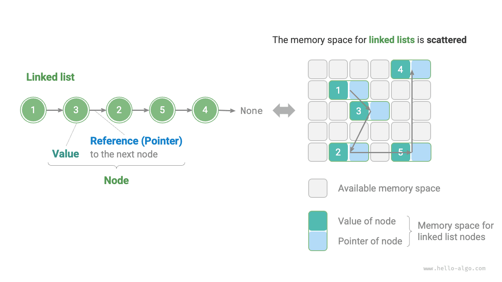

# 4.2 &nbsp; Связный список

Память является общим ресурсом для всех программ, и в сложной среде выполнения свободные участки памяти могут быть разбросаны по всему адресу памяти. Мы знаем, что память для хранения массива должна быть непрерывной, а если массив очень велик, память может не суметь предоставить столь большой непрерывный блок. Именно здесь проявляется преимущество гибкости связного списка.

<u>Связный список (linked list)</u> - это линейная структура данных, в которой каждый элемент представляет собой объект-узел, а сами узлы соединены между собой через "ссылки". Ссылка хранит адрес памяти следующего узла, благодаря чему из текущего узла можно получить доступ к следующему.

Конструкция связного списка позволяет хранить отдельные узлы в разных местах памяти, и их адреса вовсе не обязаны быть непрерывными.

{ class="animation-figure" }

<p align="center"> Рисунок 4-5 &nbsp; Определение связного списка и способ хранения </p>

Если посмотреть на рисунок 4-5, можно заметить, что базовой единицей связного списка является объект <u>узел (node)</u>. Каждый узел содержит две части данных: "значение" узла и "ссылку" на следующий узел.

- Первый узел связного списка называется "головным узлом", а последний - "хвостовым узлом".
- Хвостовой узел указывает на "пусто", что в Java, C++ и Python обозначается как `null` , `nullptr` и `None` соответственно.
- В языках, поддерживающих указатели, таких как C, C++, Go и Rust, упомянутую выше "ссылку" следует заменить на "указатель".

Как показано в коде ниже, узел связного списка `ListNode` хранит не только значение, но и дополнительную ссылку (указатель). Поэтому **при одинаковом объеме данных связный список занимает больше памяти, чем массив**.

=== "Python"

    ```python title=""
    class ListNode:
        """Класс узла связного списка"""
        def __init__(self, val: int):
            self.val: int = val               # Значение узла
            self.next: ListNode | None = None # Ссылка на следующий узел
    ```

=== "C++"

    ```cpp title=""
    /* Структура узла связного списка */
    struct ListNode {
        int val;         // Значение узла
        ListNode *next;  // Указатель на следующий узел
        ListNode(int x) : val(x), next(nullptr) {}  // Конструктор
    };
    ```

=== "Java"

    ```java title=""
    /* Класс узла связного списка */
    class ListNode {
        int val;        // Значение узла
        ListNode next;  // Ссылка на следующий узел
        ListNode(int x) { val = x; }  // Конструктор
    }
    ```

=== "C#"

    ```csharp title=""
    /* Класс узла связного списка */
    class ListNode(int x) {  // Конструктор
        int val = x;         // Значение узла
        ListNode? next;      // Ссылка на следующий узел
    }
    ```

=== "Go"

    ```go title=""
    /* Структура узла связного списка */
    type ListNode struct {
        Val  int       // Значение узла
        Next *ListNode // Указатель на следующий узел
    }

    // NewListNode Конструктор, создает новый связный список
    func NewListNode(val int) *ListNode {
        return &ListNode{
            Val:  val,
            Next: nil,
        }
    }
    ```

=== "Swift"

    ```swift title=""
    /* Класс узла связного списка */
    class ListNode {
        var val: Int // Значение узла
        var next: ListNode? // Ссылка на следующий узел

        init(x: Int) { // Конструктор
            val = x
        }
    }
    ```

=== "JS"

    ```javascript title=""
    /* Класс узла связного списка */
    class ListNode {
        constructor(val, next) {
            this.val = (val === undefined ? 0 : val);       // Значение узла
            this.next = (next === undefined ? null : next); // Ссылка на следующий узел
        }
    }
    ```

=== "TS"

    ```typescript title=""
    /* Класс узла связного списка */
    class ListNode {
        val: number;
        next: ListNode | null;
        constructor(val?: number, next?: ListNode | null) {
            this.val = val === undefined ? 0 : val;        // Значение узла
            this.next = next === undefined ? null : next;  // Ссылка на следующий узел
        }
    }
    ```

=== "Dart"

    ```dart title=""
    /* Класс узла связного списка */
    class ListNode {
      int val; // Значение узла
      ListNode? next; // Ссылка на следующий узел
      ListNode(this.val, [this.next]); // Конструктор
    }
    ```

=== "Rust"

    ```rust title=""
    use std::rc::Rc;
    use std::cell::RefCell;
    /* Класс узла связного списка */
    #[derive(Debug)]
    struct ListNode {
        val: i32, // Значение узла
        next: Option<Rc<RefCell<ListNode>>>, // Указатель на следующий узел
    }
    ```

=== "C"

    ```c title=""
    /* Структура узла связного списка */
    typedef struct ListNode {
        int val;               // Значение узла
        struct ListNode *next; // Указатель на следующий узел
    } ListNode;

    /* Конструктор */
    ListNode *newListNode(int val) {
        ListNode *node;
        node = (ListNode *) malloc(sizeof(ListNode));
        node->val = val;
        node->next = NULL;
        return node;
    }
    ```

=== "Kotlin"

    ```kotlin title=""
    /* Класс узла связного списка */
    // Конструктор
    class ListNode(x: Int) {
        val _val: Int = x          // Значение узла
        val next: ListNode? = null // Ссылка на следующий узел
    }
    ```

=== "Ruby"

    ```ruby title=""
    # Класс узла связного списка
    class ListNode
      attr_accessor :val  # Значение узла
      attr_accessor :next # Ссылка на следующий узел

      def initialize(val=0, next_node=nil)
        @val = val
        @next = next_node
      end
    end
    ```

## 4.2.1 &nbsp; Основные операции со связным списком

### 1. &nbsp; Инициализация связного списка

Построение связного списка состоит из двух шагов: сначала нужно инициализировать объекты всех узлов, затем установить связи-ссылки между ними. После завершения инициализации мы можем, начиная с головы списка, последовательно проходить все узлы по ссылке `next`.

=== "Python"

    ```python title="linked_list.py"
    # Инициализация связного списка 1 -> 3 -> 2 -> 5 -> 4
    # Инициализация отдельных узлов
    n0 = ListNode(1)
    n1 = ListNode(3)
    n2 = ListNode(2)
    n3 = ListNode(5)
    n4 = ListNode(4)
    # Построение ссылок между узлами
    n0.next = n1
    n1.next = n2
    n2.next = n3
    n3.next = n4
    ```

=== "C++"

    ```cpp title="linked_list.cpp"
    /* Инициализация связного списка 1 -> 3 -> 2 -> 5 -> 4 */
    // Инициализация отдельных узлов
    ListNode* n0 = new ListNode(1);
    ListNode* n1 = new ListNode(3);
    ListNode* n2 = new ListNode(2);
    ListNode* n3 = new ListNode(5);
    ListNode* n4 = new ListNode(4);
    // Построение ссылок между узлами
    n0->next = n1;
    n1->next = n2;
    n2->next = n3;
    n3->next = n4;
    ```

=== "Java"

    ```java title="linked_list.java"
    /* Инициализация связного списка 1 -> 3 -> 2 -> 5 -> 4 */
    // Инициализация отдельных узлов
    ListNode n0 = new ListNode(1);
    ListNode n1 = new ListNode(3);
    ListNode n2 = new ListNode(2);
    ListNode n3 = new ListNode(5);
    ListNode n4 = new ListNode(4);
    // Построение ссылок между узлами
    n0.next = n1;
    n1.next = n2;
    n2.next = n3;
    n3.next = n4;
    ```

=== "C#"

    ```csharp title="linked_list.cs"
    /* Инициализация связного списка 1 -> 3 -> 2 -> 5 -> 4 */
    // Инициализация отдельных узлов
    ListNode n0 = new(1);
    ListNode n1 = new(3);
    ListNode n2 = new(2);
    ListNode n3 = new(5);
    ListNode n4 = new(4);
    // Построение ссылок между узлами
    n0.next = n1;
    n1.next = n2;
    n2.next = n3;
    n3.next = n4;
    ```

=== "Go"

    ```go title="linked_list.go"
    /* Инициализация связного списка 1 -> 3 -> 2 -> 5 -> 4 */
    // Инициализация отдельных узлов
    n0 := NewListNode(1)
    n1 := NewListNode(3)
    n2 := NewListNode(2)
    n3 := NewListNode(5)
    n4 := NewListNode(4)
    // Построение ссылок между узлами
    n0.Next = n1
    n1.Next = n2
    n2.Next = n3
    n3.Next = n4
    ```

=== "Swift"

    ```swift title="linked_list.swift"
    /* Инициализация связного списка 1 -> 3 -> 2 -> 5 -> 4 */
    // Инициализация отдельных узлов
    let n0 = ListNode(x: 1)
    let n1 = ListNode(x: 3)
    let n2 = ListNode(x: 2)
    let n3 = ListNode(x: 5)
    let n4 = ListNode(x: 4)
    // Построение ссылок между узлами
    n0.next = n1
    n1.next = n2
    n2.next = n3
    n3.next = n4
    ```

=== "JS"

    ```javascript title="linked_list.js"
    /* Инициализация связного списка 1 -> 3 -> 2 -> 5 -> 4 */
    // Инициализация отдельных узлов
    const n0 = new ListNode(1);
    const n1 = new ListNode(3);
    const n2 = new ListNode(2);
    const n3 = new ListNode(5);
    const n4 = new ListNode(4);
    // Построение ссылок между узлами
    n0.next = n1;
    n1.next = n2;
    n2.next = n3;
    n3.next = n4;
    ```

=== "TS"

    ```typescript title="linked_list.ts"
    /* Инициализация связного списка 1 -> 3 -> 2 -> 5 -> 4 */
    // Инициализация отдельных узлов
    const n0 = new ListNode(1);
    const n1 = new ListNode(3);
    const n2 = new ListNode(2);
    const n3 = new ListNode(5);
    const n4 = new ListNode(4);
    // Построение ссылок между узлами
    n0.next = n1;
    n1.next = n2;
    n2.next = n3;
    n3.next = n4;
    ```

=== "Dart"

    ```dart title="linked_list.dart"
    /* Инициализация связного списка 1 -> 3 -> 2 -> 5 -> 4 */\
    // Инициализация отдельных узлов
    ListNode n0 = ListNode(1);
    ListNode n1 = ListNode(3);
    ListNode n2 = ListNode(2);
    ListNode n3 = ListNode(5);
    ListNode n4 = ListNode(4);
    // Построение ссылок между узлами
    n0.next = n1;
    n1.next = n2;
    n2.next = n3;
    n3.next = n4;
    ```

=== "Rust"

    ```rust title="linked_list.rs"
    /* Инициализация связного списка 1 -> 3 -> 2 -> 5 -> 4 */
    // Инициализация отдельных узлов
    let n0 = Rc::new(RefCell::new(ListNode { val: 1, next: None }));
    let n1 = Rc::new(RefCell::new(ListNode { val: 3, next: None }));
    let n2 = Rc::new(RefCell::new(ListNode { val: 2, next: None }));
    let n3 = Rc::new(RefCell::new(ListNode { val: 5, next: None }));
    let n4 = Rc::new(RefCell::new(ListNode { val: 4, next: None }));

    // Построение ссылок между узлами
    n0.borrow_mut().next = Some(n1.clone());
    n1.borrow_mut().next = Some(n2.clone());
    n2.borrow_mut().next = Some(n3.clone());
    n3.borrow_mut().next = Some(n4.clone());
    ```

=== "C"

    ```c title="linked_list.c"
    /* Инициализация связного списка 1 -> 3 -> 2 -> 5 -> 4 */
    // Инициализация отдельных узлов
    ListNode* n0 = newListNode(1);
    ListNode* n1 = newListNode(3);
    ListNode* n2 = newListNode(2);
    ListNode* n3 = newListNode(5);
    ListNode* n4 = newListNode(4);
    // Построение ссылок между узлами
    n0->next = n1;
    n1->next = n2;
    n2->next = n3;
    n3->next = n4;
    ```

=== "Kotlin"

    ```kotlin title="linked_list.kt"
    /* Инициализация связного списка 1 -> 3 -> 2 -> 5 -> 4 */
    // Инициализация отдельных узлов
    val n0 = ListNode(1)
    val n1 = ListNode(3)
    val n2 = ListNode(2)
    val n3 = ListNode(5)
    val n4 = ListNode(4)
    // Построение ссылок между узлами
    n0.next = n1;
    n1.next = n2;
    n2.next = n3;
    n3.next = n4;
    ```

=== "Ruby"

    ```ruby title="linked_list.rb"
    # Инициализация связного списка 1 -> 3 -> 2 -> 5 -> 4
    # Инициализация отдельных узлов
    n0 = ListNode.new(1)
    n1 = ListNode.new(3)
    n2 = ListNode.new(2)
    n3 = ListNode.new(5)
    n4 = ListNode.new(4)
    # Построение ссылок между узлами
    n0.next = n1
    n1.next = n2
    n2.next = n3
    n3.next = n4
    ```

??? pythontutor "Визуализация выполнения"

    https://pythontutor.com/render.html#code=class%20ListNode%3A%0A%20%20%20%20%22%22%22%D1%81%D0%B2%D1%8F%D0%B7%D0%BD%D1%8B%D0%B9%20%D1%81%D0%BF%D0%B8%D1%81%D0%BE%D0%BA%D1%83%D0%B7%D0%B5%D0%BB%D0%BA%D0%BB%D0%B0%D1%81%D1%81%22%22%22%0A%20%20%20%20def%20__init__%28self%2C%20val%3A%20int%29%3A%0A%20%20%20%20%20%20%20%20self.val%3A%20int%20%3D%20val%20%20%23%20%D0%97%D0%BD%D0%B0%D1%87%D0%B5%D0%BD%D0%B8%D0%B5%20%D1%83%D0%B7%D0%BB%D0%B0%0A%20%20%20%20%20%20%20%20self.next%3A%20ListNode%20%7C%20None%20%3D%20None%20%20%23%20%D0%A1%D1%81%D1%8B%D0%BB%D0%BA%D0%B0%20%D0%BD%D0%B0%20%D1%81%D0%BB%D0%B5%D0%B4%D1%83%D1%8E%D1%89%D0%B8%D0%B9%20%D1%83%D0%B7%D0%B5%D0%BB%0A%0A%22%22%22Driver%20Code%22%22%22%0Aif%20__name__%20%3D%3D%20%22__main__%22%3A%0A%20%20%20%20%23%20%D0%98%D0%BD%D0%B8%D1%86%D0%B8%D0%B0%D0%BB%D0%B8%D0%B7%D0%B8%D1%80%D0%BE%D0%B2%D0%B0%D1%82%D1%8C%20%D1%81%D0%B2%D1%8F%D0%B7%D0%BD%D1%8B%D0%B9%20%D1%81%D0%BF%D0%B8%D1%81%D0%BE%D0%BA%201%20-%3E%203%20-%3E%202%20-%3E%205%20-%3E%204%0A%20%20%20%20%23%20%D0%98%D0%BD%D0%B8%D1%86%D0%B8%D0%B0%D0%BB%D0%B8%D0%B7%D0%B8%D1%80%D0%BE%D0%B2%D0%B0%D1%82%D1%8C%20%D0%BA%D0%B0%D0%B6%D0%B4%D1%8B%D0%B9%20%D1%83%D0%B7%D0%B5%D0%BB%0A%20%20%20%20n0%20%3D%20ListNode%281%29%0A%20%20%20%20n1%20%3D%20ListNode%283%29%0A%20%20%20%20n2%20%3D%20ListNode%282%29%0A%20%20%20%20n3%20%3D%20ListNode%285%29%0A%20%20%20%20n4%20%3D%20ListNode%284%29%0A%20%20%20%20%23%20%D0%9F%D0%BE%D1%81%D1%82%D1%80%D0%BE%D0%B8%D1%82%D1%8C%20%D1%81%D1%81%D1%8B%D0%BB%D0%BA%D0%B8%20%D0%BC%D0%B5%D0%B6%D0%B4%D1%83%20%D1%83%D0%B7%D0%BB%D0%B0%D0%BC%D0%B8%0A%20%20%20%20n0.next%20%3D%20n1%0A%20%20%20%20n1.next%20%3D%20n2%0A%20%20%20%20n2.next%20%3D%20n3%0A%20%20%20%20n3.next%20%3D%20n4&cumulative=false&curInstr=3&heapPrimitives=nevernest&mode=display&origin=opt-frontend.js&py=311&rawInputLstJSON=%5B%5D&textReferences=false

Массив в целом - это одна переменная: например, массив `nums` содержит элементы `nums[0]` , `nums[1]` и т.д. Связный список же состоит из множества независимых объектов-узлов. **Обычно в качестве обозначения всего связного списка используют головной узел**; например, в приведенном выше коде связный список можно обозначить как список `n0` .

### 2. &nbsp; Вставка узла

Вставить узел в связный список очень легко. Как показано на рисунке 4-6, предположим, что мы хотим вставить новый узел `P` между двумя соседними узлами `n0` и `n1` ; **для этого нужно изменить всего две ссылки (указателя)**, а временная сложность будет равна $O(1)$ .

Для сравнения: временная сложность вставки элемента в массив составляет $O(n)$ , и при большом объеме данных это неэффективно.

{ class="animation-figure" }

<p align="center"> Рисунок 4-6 &nbsp; Пример вставки узла в связный список </p>

=== "Python"

    ```python title="linked_list.py"
    def insert(n0: ListNode, P: ListNode):
        """Вставить узел P после узла n0 в связном списке"""
        n1 = n0.next
        P.next = n1
        n0.next = P
    ```

=== "C++"

    ```cpp title="linked_list.cpp"
    /* Вставить узел P после узла n0 в связном списке */
    void insert(ListNode *n0, ListNode *P) {
        ListNode *n1 = n0->next;
        P->next = n1;
        n0->next = P;
    }
    ```

=== "Java"

    ```java title="linked_list.java"
    /* Вставить узел P после узла n0 в связном списке */
    void insert(ListNode n0, ListNode P) {
        ListNode n1 = n0.next;
        P.next = n1;
        n0.next = P;
    }
    ```

=== "C#"

    ```csharp title="linked_list.cs"
    /* Вставить узел P после узла n0 в связном списке */
    void Insert(ListNode n0, ListNode P) {
        ListNode? n1 = n0.next;
        P.next = n1;
        n0.next = P;
    }
    ```

=== "Go"

    ```go title="linked_list.go"
    /* Вставить узел P после узла n0 в связном списке */
    func insertNode(n0 *ListNode, P *ListNode) {
        n1 := n0.Next
        P.Next = n1
        n0.Next = P
    }
    ```

=== "Swift"

    ```swift title="linked_list.swift"
    /* Вставить узел P после узла n0 в связном списке */
    func insert(n0: ListNode, P: ListNode) {
        let n1 = n0.next
        P.next = n1
        n0.next = P
    }
    ```

=== "JS"

    ```javascript title="linked_list.js"
    /* Вставить узел P после узла n0 в связном списке */
    function insert(n0, P) {
        const n1 = n0.next;
        P.next = n1;
        n0.next = P;
    }
    ```

=== "TS"

    ```typescript title="linked_list.ts"
    /* Вставить узел P после узла n0 в связном списке */
    function insert(n0: ListNode, P: ListNode): void {
        const n1 = n0.next;
        P.next = n1;
        n0.next = P;
    }
    ```

=== "Dart"

    ```dart title="linked_list.dart"
    /* Вставить узел P после узла n0 в связном списке */
    void insert(ListNode n0, ListNode P) {
      ListNode? n1 = n0.next;
      P.next = n1;
      n0.next = P;
    }
    ```

=== "Rust"

    ```rust title="linked_list.rs"
    /* Вставить узел P после узла n0 в связном списке */
    #[allow(non_snake_case)]
    pub fn insert<T>(n0: &Rc<RefCell<ListNode<T>>>, P: Rc<RefCell<ListNode<T>>>) {
        let n1 = n0.borrow_mut().next.take();
        P.borrow_mut().next = n1;
        n0.borrow_mut().next = Some(P);
    }
    ```

=== "C"

    ```c title="linked_list.c"
    /* Вставить узел P после узла n0 в связном списке */
    void insert(ListNode *n0, ListNode *P) {
        ListNode *n1 = n0->next;
        P->next = n1;
        n0->next = P;
    }
    ```

=== "Kotlin"

    ```kotlin title="linked_list.kt"
    /* Вставить узел P после узла n0 в связном списке */
    fun insert(n0: ListNode?, p: ListNode?) {
        val n1 = n0?.next
        p?.next = n1
        n0?.next = p
    }
    ```

=== "Ruby"

    ```ruby title="linked_list.rb"
    ### Вставка узла _p после узла n0 в связном списке ###
    # В Ruby `p` — встроенная функция, а `P` — константа, поэтому вместо этого можно использовать `_p`
    def insert(n0, _p)
      n1 = n0.next
      _p.next = n1
      n0.next = _p
    end
    ```

??? pythontutor "Визуализация кода"

    <div style="height: 549px; width: 100%;"><iframe class="pythontutor-iframe" src="https://pythontutor.com/iframe-embed.html#code=class%20ListNode%3A%0A%20%20%20%20%22%22%22%D0%9A%D0%BB%D0%B0%D1%81%D1%81%20%D1%83%D0%B7%D0%BB%D0%B0%20%D1%81%D0%B2%D1%8F%D0%B7%D0%BD%D0%BE%D0%B3%D0%BE%20%D1%81%D0%BF%D0%B8%D1%81%D0%BA%D0%B0%22%22%22%0A%20%20%20%20def%20__init__%28self%2C%20val%3A%20int%29%3A%0A%20%20%20%20%20%20%20%20self.val%3A%20int%20%3D%20val%20%20%23%20%D0%97%D0%BD%D0%B0%D1%87%D0%B5%D0%BD%D0%B8%D0%B5%20%D1%83%D0%B7%D0%BB%D0%B0%0A%20%20%20%20%20%20%20%20self.next%3A%20ListNode%20%7C%20None%20%3D%20None%20%20%23%20%D0%A1%D1%81%D1%8B%D0%BB%D0%BA%D0%B0%20%D0%BD%D0%B0%20%D1%83%D0%B7%D0%B5%D0%BB-%D0%BF%D1%80%D0%B5%D0%B5%D0%BC%D0%BD%D0%B8%D0%BA%0A%0Adef%20insert%28n0%3A%20ListNode%2C%20P%3A%20ListNode%29%3A%0A%20%20%20%20%22%22%22%D0%92%D1%81%D1%82%D0%B0%D0%B2%D0%B8%D1%82%D1%8C%20%D1%83%D0%B7%D0%B5%D0%BB%20P%20%D0%BF%D0%BE%D1%81%D0%BB%D0%B5%20%D1%83%D0%B7%D0%BB%D0%B0%20n0%20%D0%B2%20%D1%81%D0%B2%D1%8F%D0%B7%D0%BD%D0%BE%D0%BC%20%D1%81%D0%BF%D0%B8%D1%81%D0%BA%D0%B5%22%22%22%0A%20%20%20%20n1%20%3D%20n0.next%0A%20%20%20%20P.next%20%3D%20n1%0A%20%20%20%20n0.next%20%3D%20P%0A%0A%22%22%22Driver%20Code%22%22%22%0Aif%20__name__%20%3D%3D%20%22__main__%22%3A%0A%20%20%20%20%23%20%D0%98%D0%BD%D0%B8%D1%86%D0%B8%D0%B0%D0%BB%D0%B8%D0%B7%D0%B0%D1%86%D0%B8%D1%8F%20%D1%81%D0%B2%D1%8F%D0%B7%D0%BD%D0%BE%D0%B3%D0%BE%20%D1%81%D0%BF%D0%B8%D1%81%D0%BA%D0%B0%0A%20%20%20%20%23%20%D0%98%D0%BD%D0%B8%D1%86%D0%B8%D0%B0%D0%BB%D0%B8%D0%B7%D0%B0%D1%86%D0%B8%D1%8F%20%D0%B2%D1%81%D0%B5%D1%85%20%D1%83%D0%B7%D0%BB%D0%BE%D0%B2%0A%20%20%20%20n0%20%3D%20ListNode%281%29%0A%20%20%20%20n1%20%3D%20ListNode%283%29%0A%20%20%20%20n2%20%3D%20ListNode%282%29%0A%20%20%20%20n3%20%3D%20ListNode%285%29%0A%20%20%20%20n4%20%3D%20ListNode%284%29%0A%20%20%20%20%23%20%D0%9F%D0%BE%D1%81%D1%82%D1%80%D0%BE%D0%B8%D1%82%D1%8C%20%D1%81%D1%81%D1%8B%D0%BB%D0%BA%D0%B8%20%D0%BC%D0%B5%D0%B6%D0%B4%D1%83%20%D1%83%D0%B7%D0%BB%D0%B0%D0%BC%D0%B8%0A%20%20%20%20n0.next%20%3D%20n1%0A%20%20%20%20n1.next%20%3D%20n2%0A%20%20%20%20n2.next%20%3D%20n3%0A%20%20%20%20n3.next%20%3D%20n4%0A%0A%20%20%20%20%23%20%D0%92%D1%81%D1%82%D0%B0%D0%B2%D0%BA%D0%B0%20%D1%83%D0%B7%D0%BB%D0%B0%0A%20%20%20%20p%20%3D%20ListNode%280%29%0A%20%20%20%20insert%28n0%2C%20p%29&codeDivHeight=472&codeDivWidth=350&cumulative=false&curInstr=39&heapPrimitives=nevernest&origin=opt-frontend.js&py=311&rawInputLstJSON=%5B%5D&textReferences=false"> </iframe></div>
    <div style="margin-top: 5px;"><a href="https://pythontutor.com/iframe-embed.html#code=class%20ListNode%3A%0A%20%20%20%20%22%22%22%D0%9A%D0%BB%D0%B0%D1%81%D1%81%20%D1%83%D0%B7%D0%BB%D0%B0%20%D1%81%D0%B2%D1%8F%D0%B7%D0%BD%D0%BE%D0%B3%D0%BE%20%D1%81%D0%BF%D0%B8%D1%81%D0%BA%D0%B0%22%22%22%0A%20%20%20%20def%20__init__%28self%2C%20val%3A%20int%29%3A%0A%20%20%20%20%20%20%20%20self.val%3A%20int%20%3D%20val%20%20%23%20%D0%97%D0%BD%D0%B0%D1%87%D0%B5%D0%BD%D0%B8%D0%B5%20%D1%83%D0%B7%D0%BB%D0%B0%0A%20%20%20%20%20%20%20%20self.next%3A%20ListNode%20%7C%20None%20%3D%20None%20%20%23%20%D0%A1%D1%81%D1%8B%D0%BB%D0%BA%D0%B0%20%D0%BD%D0%B0%20%D1%83%D0%B7%D0%B5%D0%BB-%D0%BF%D1%80%D0%B5%D0%B5%D0%BC%D0%BD%D0%B8%D0%BA%0A%0Adef%20insert%28n0%3A%20ListNode%2C%20P%3A%20ListNode%29%3A%0A%20%20%20%20%22%22%22%D0%92%D1%81%D1%82%D0%B0%D0%B2%D0%B8%D1%82%D1%8C%20%D1%83%D0%B7%D0%B5%D0%BB%20P%20%D0%BF%D0%BE%D1%81%D0%BB%D0%B5%20%D1%83%D0%B7%D0%BB%D0%B0%20n0%20%D0%B2%20%D1%81%D0%B2%D1%8F%D0%B7%D0%BD%D0%BE%D0%BC%20%D1%81%D0%BF%D0%B8%D1%81%D0%BA%D0%B5%22%22%22%0A%20%20%20%20n1%20%3D%20n0.next%0A%20%20%20%20P.next%20%3D%20n1%0A%20%20%20%20n0.next%20%3D%20P%0A%0A%22%22%22Driver%20Code%22%22%22%0Aif%20__name__%20%3D%3D%20%22__main__%22%3A%0A%20%20%20%20%23%20%D0%98%D0%BD%D0%B8%D1%86%D0%B8%D0%B0%D0%BB%D0%B8%D0%B7%D0%B0%D1%86%D0%B8%D1%8F%20%D1%81%D0%B2%D1%8F%D0%B7%D0%BD%D0%BE%D0%B3%D0%BE%20%D1%81%D0%BF%D0%B8%D1%81%D0%BA%D0%B0%0A%20%20%20%20%23%20%D0%98%D0%BD%D0%B8%D1%86%D0%B8%D0%B0%D0%BB%D0%B8%D0%B7%D0%B0%D1%86%D0%B8%D1%8F%20%D0%B2%D1%81%D0%B5%D1%85%20%D1%83%D0%B7%D0%BB%D0%BE%D0%B2%0A%20%20%20%20n0%20%3D%20ListNode%281%29%0A%20%20%20%20n1%20%3D%20ListNode%283%29%0A%20%20%20%20n2%20%3D%20ListNode%282%29%0A%20%20%20%20n3%20%3D%20ListNode%285%29%0A%20%20%20%20n4%20%3D%20ListNode%284%29%0A%20%20%20%20%23%20%D0%9F%D0%BE%D1%81%D1%82%D1%80%D0%BE%D0%B8%D1%82%D1%8C%20%D1%81%D1%81%D1%8B%D0%BB%D0%BA%D0%B8%20%D0%BC%D0%B5%D0%B6%D0%B4%D1%83%20%D1%83%D0%B7%D0%BB%D0%B0%D0%BC%D0%B8%0A%20%20%20%20n0.next%20%3D%20n1%0A%20%20%20%20n1.next%20%3D%20n2%0A%20%20%20%20n2.next%20%3D%20n3%0A%20%20%20%20n3.next%20%3D%20n4%0A%0A%20%20%20%20%23%20%D0%92%D1%81%D1%82%D0%B0%D0%B2%D0%BA%D0%B0%20%D1%83%D0%B7%D0%BB%D0%B0%0A%20%20%20%20p%20%3D%20ListNode%280%29%0A%20%20%20%20insert%28n0%2C%20p%29&codeDivHeight=800&codeDivWidth=600&cumulative=false&curInstr=39&heapPrimitives=nevernest&origin=opt-frontend.js&py=311&rawInputLstJSON=%5B%5D&textReferences=false" target="_blank" rel="noopener noreferrer">Во весь экран ></a></div>

### 3. &nbsp; Удаление узла

Как показано на рисунке 4-7, удалить узел из связного списка тоже очень удобно: **нужно изменить всего одну ссылку (указатель)**.

Обрати внимание: хотя после завершения операции удаления узел `P` все еще указывает на `n1` , при обходе связного списка до `P` уже нельзя добраться, а значит `P` больше не принадлежит данному списку.

{ class="animation-figure" }

<p align="center"> Рисунок 4-7 &nbsp; Удаление узла из связного списка </p>

=== "Python"

    ```python title="linked_list.py"
    def remove(n0: ListNode):
        """Удалить первый узел после узла n0 в связном списке"""
        if not n0.next:
            return
        # n0 -> P -> n1
        P = n0.next
        n1 = P.next
        n0.next = n1
    ```

=== "C++"

    ```cpp title="linked_list.cpp"
    /* Удалить первый узел после узла n0 в связном списке */
    void remove(ListNode *n0) {
        if (n0->next == nullptr)
            return;
        // n0 -> P -> n1
        ListNode *P = n0->next;
        ListNode *n1 = P->next;
        n0->next = n1;
        // Освободить память
        delete P;
    }
    ```

=== "Java"

    ```java title="linked_list.java"
    /* Удалить первый узел после узла n0 в связном списке */
    void remove(ListNode n0) {
        if (n0.next == null)
            return;
        // n0 -> P -> n1
        ListNode P = n0.next;
        ListNode n1 = P.next;
        n0.next = n1;
    }
    ```

=== "C#"

    ```csharp title="linked_list.cs"
    /* Удалить первый узел после узла n0 в связном списке */
    void Remove(ListNode n0) {
        if (n0.next == null)
            return;
        // n0 -> P -> n1
        ListNode P = n0.next;
        ListNode? n1 = P.next;
        n0.next = n1;
    }
    ```

=== "Go"

    ```go title="linked_list.go"
    /* Удалить первый узел после узла n0 в связном списке */
    func removeItem(n0 *ListNode) {
        if n0.Next == nil {
            return
        }
        // n0 -> P -> n1
        P := n0.Next
        n1 := P.Next
        n0.Next = n1
    }
    ```

=== "Swift"

    ```swift title="linked_list.swift"
    /* Удалить первый узел после узла n0 в связном списке */
    func remove(n0: ListNode) {
        if n0.next == nil {
            return
        }
        // n0 -> P -> n1
        let P = n0.next
        let n1 = P?.next
        n0.next = n1
    }
    ```

=== "JS"

    ```javascript title="linked_list.js"
    /* Удалить первый узел после узла n0 в связном списке */
    function remove(n0) {
        if (!n0.next) return;
        // n0 -> P -> n1
        const P = n0.next;
        const n1 = P.next;
        n0.next = n1;
    }
    ```

=== "TS"

    ```typescript title="linked_list.ts"
    /* Удалить первый узел после узла n0 в связном списке */
    function remove(n0: ListNode): void {
        if (!n0.next) {
            return;
        }
        // n0 -> P -> n1
        const P = n0.next;
        const n1 = P.next;
        n0.next = n1;
    }
    ```

=== "Dart"

    ```dart title="linked_list.dart"
    /* Удалить первый узел после узла n0 в связном списке */
    void remove(ListNode n0) {
      if (n0.next == null) return;
      // n0 -> P -> n1
      ListNode P = n0.next!;
      ListNode? n1 = P.next;
      n0.next = n1;
    }
    ```

=== "Rust"

    ```rust title="linked_list.rs"
    /* Удалить первый узел после узла n0 в связном списке */
    #[allow(non_snake_case)]
    pub fn remove<T>(n0: &Rc<RefCell<ListNode<T>>>) {
        // n0 -> P -> n1
        let P = n0.borrow_mut().next.take();
        if let Some(node) = P {
            let n1 = node.borrow_mut().next.take();
            n0.borrow_mut().next = n1;
        }
    }
    ```

=== "C"

    ```c title="linked_list.c"
    /* Удалить первый узел после узла n0 в связном списке */
    // Внимание: stdio.h уже использует ключевое слово remove
    void removeItem(ListNode *n0) {
        if (!n0->next)
            return;
        // n0 -> P -> n1
        ListNode *P = n0->next;
        ListNode *n1 = P->next;
        n0->next = n1;
        // Освободить память
        free(P);
    }
    ```

=== "Kotlin"

    ```kotlin title="linked_list.kt"
    /* Удалить первый узел после узла n0 в связном списке */
    fun remove(n0: ListNode?) {
        if (n0?.next == null)
            return
        // n0 -> P -> n1
        val p = n0.next
        val n1 = p?.next
        n0.next = n1
    }
    ```

=== "Ruby"

    ```ruby title="linked_list.rb"
    ### Удаление первого узла после узла n0 в связном списке ###
    def remove(n0)
      return if n0.next.nil?

      # n0 -> remove_node -> n1
      remove_node = n0.next
      n1 = remove_node.next
      n0.next = n1
    end
    ```

??? pythontutor "Визуализация кода"

    <div style="height: 549px; width: 100%;"><iframe class="pythontutor-iframe" src="https://pythontutor.com/iframe-embed.html#code=class%20ListNode%3A%0A%20%20%20%20%22%22%22%D0%9A%D0%BB%D0%B0%D1%81%D1%81%20%D1%83%D0%B7%D0%BB%D0%B0%20%D1%81%D0%B2%D1%8F%D0%B7%D0%BD%D0%BE%D0%B3%D0%BE%20%D1%81%D0%BF%D0%B8%D1%81%D0%BA%D0%B0%22%22%22%0A%20%20%20%20def%20__init__%28self%2C%20val%3A%20int%29%3A%0A%20%20%20%20%20%20%20%20self.val%3A%20int%20%3D%20val%20%20%23%20%D0%97%D0%BD%D0%B0%D1%87%D0%B5%D0%BD%D0%B8%D0%B5%20%D1%83%D0%B7%D0%BB%D0%B0%0A%20%20%20%20%20%20%20%20self.next%3A%20ListNode%20%7C%20None%20%3D%20None%20%20%23%20%D0%A1%D1%81%D1%8B%D0%BB%D0%BA%D0%B0%20%D0%BD%D0%B0%20%D1%83%D0%B7%D0%B5%D0%BB-%D0%BF%D1%80%D0%B5%D0%B5%D0%BC%D0%BD%D0%B8%D0%BA%0A%0Adef%20remove%28n0%3A%20ListNode%29%3A%0A%20%20%20%20%22%22%22%D0%A3%D0%B4%D0%B0%D0%BB%D0%B8%D1%82%D1%8C%20%D0%BF%D0%B5%D1%80%D0%B2%D1%8B%D0%B9%20%D1%83%D0%B7%D0%B5%D0%BB%20%D0%BF%D0%BE%D1%81%D0%BB%D0%B5%20%D1%83%D0%B7%D0%BB%D0%B0%20n0%20%D0%B2%20%D1%81%D0%B2%D1%8F%D0%B7%D0%BD%D0%BE%D0%BC%20%D1%81%D0%BF%D0%B8%D1%81%D0%BA%D0%B5%22%22%22%0A%20%20%20%20if%20not%20n0.next%3A%0A%20%20%20%20%20%20%20%20return%0A%20%20%20%20%23%20n0%20-%3E%20P%20-%3E%20n1%0A%20%20%20%20P%20%3D%20n0.next%0A%20%20%20%20n1%20%3D%20P.next%0A%20%20%20%20n0.next%20%3D%20n1%0A%0A%22%22%22Driver%20Code%22%22%22%0Aif%20__name__%20%3D%3D%20%22__main__%22%3A%0A%20%20%20%20%23%20%D0%98%D0%BD%D0%B8%D1%86%D0%B8%D0%B0%D0%BB%D0%B8%D0%B7%D0%B0%D1%86%D0%B8%D1%8F%20%D1%81%D0%B2%D1%8F%D0%B7%D0%BD%D0%BE%D0%B3%D0%BE%20%D1%81%D0%BF%D0%B8%D1%81%D0%BA%D0%B0%0A%20%20%20%20%23%20%D0%98%D0%BD%D0%B8%D1%86%D0%B8%D0%B0%D0%BB%D0%B8%D0%B7%D0%B0%D1%86%D0%B8%D1%8F%20%D0%B2%D1%81%D0%B5%D1%85%20%D1%83%D0%B7%D0%BB%D0%BE%D0%B2%0A%20%20%20%20n0%20%3D%20ListNode%281%29%0A%20%20%20%20n1%20%3D%20ListNode%283%29%0A%20%20%20%20n2%20%3D%20ListNode%282%29%0A%20%20%20%20n3%20%3D%20ListNode%285%29%0A%20%20%20%20n4%20%3D%20ListNode%284%29%0A%20%20%20%20%23%20%D0%9F%D0%BE%D1%81%D1%82%D1%80%D0%BE%D0%B8%D1%82%D1%8C%20%D1%81%D1%81%D1%8B%D0%BB%D0%BA%D0%B8%20%D0%BC%D0%B5%D0%B6%D0%B4%D1%83%20%D1%83%D0%B7%D0%BB%D0%B0%D0%BC%D0%B8%0A%20%20%20%20n0.next%20%3D%20n1%0A%20%20%20%20n1.next%20%3D%20n2%0A%20%20%20%20n2.next%20%3D%20n3%0A%20%20%20%20n3.next%20%3D%20n4%0A%0A%20%20%20%20%23%20%D0%A3%D0%B4%D0%B0%D0%BB%D0%B5%D0%BD%D0%B8%D0%B5%20%D1%83%D0%B7%D0%BB%D0%B0%0A%20%20%20%20remove%28n0%29&codeDivHeight=472&codeDivWidth=350&cumulative=false&curInstr=34&heapPrimitives=nevernest&origin=opt-frontend.js&py=311&rawInputLstJSON=%5B%5D&textReferences=false"> </iframe></div>
    <div style="margin-top: 5px;"><a href="https://pythontutor.com/iframe-embed.html#code=class%20ListNode%3A%0A%20%20%20%20%22%22%22%D0%9A%D0%BB%D0%B0%D1%81%D1%81%20%D1%83%D0%B7%D0%BB%D0%B0%20%D1%81%D0%B2%D1%8F%D0%B7%D0%BD%D0%BE%D0%B3%D0%BE%20%D1%81%D0%BF%D0%B8%D1%81%D0%BA%D0%B0%22%22%22%0A%20%20%20%20def%20__init__%28self%2C%20val%3A%20int%29%3A%0A%20%20%20%20%20%20%20%20self.val%3A%20int%20%3D%20val%20%20%23%20%D0%97%D0%BD%D0%B0%D1%87%D0%B5%D0%BD%D0%B8%D0%B5%20%D1%83%D0%B7%D0%BB%D0%B0%0A%20%20%20%20%20%20%20%20self.next%3A%20ListNode%20%7C%20None%20%3D%20None%20%20%23%20%D0%A1%D1%81%D1%8B%D0%BB%D0%BA%D0%B0%20%D0%BD%D0%B0%20%D1%83%D0%B7%D0%B5%D0%BB-%D0%BF%D1%80%D0%B5%D0%B5%D0%BC%D0%BD%D0%B8%D0%BA%0A%0Adef%20remove%28n0%3A%20ListNode%29%3A%0A%20%20%20%20%22%22%22%D0%A3%D0%B4%D0%B0%D0%BB%D0%B8%D1%82%D1%8C%20%D0%BF%D0%B5%D1%80%D0%B2%D1%8B%D0%B9%20%D1%83%D0%B7%D0%B5%D0%BB%20%D0%BF%D0%BE%D1%81%D0%BB%D0%B5%20%D1%83%D0%B7%D0%BB%D0%B0%20n0%20%D0%B2%20%D1%81%D0%B2%D1%8F%D0%B7%D0%BD%D0%BE%D0%BC%20%D1%81%D0%BF%D0%B8%D1%81%D0%BA%D0%B5%22%22%22%0A%20%20%20%20if%20not%20n0.next%3A%0A%20%20%20%20%20%20%20%20return%0A%20%20%20%20%23%20n0%20-%3E%20P%20-%3E%20n1%0A%20%20%20%20P%20%3D%20n0.next%0A%20%20%20%20n1%20%3D%20P.next%0A%20%20%20%20n0.next%20%3D%20n1%0A%0A%22%22%22Driver%20Code%22%22%22%0Aif%20__name__%20%3D%3D%20%22__main__%22%3A%0A%20%20%20%20%23%20%D0%98%D0%BD%D0%B8%D1%86%D0%B8%D0%B0%D0%BB%D0%B8%D0%B7%D0%B0%D1%86%D0%B8%D1%8F%20%D1%81%D0%B2%D1%8F%D0%B7%D0%BD%D0%BE%D0%B3%D0%BE%20%D1%81%D0%BF%D0%B8%D1%81%D0%BA%D0%B0%0A%20%20%20%20%23%20%D0%98%D0%BD%D0%B8%D1%86%D0%B8%D0%B0%D0%BB%D0%B8%D0%B7%D0%B0%D1%86%D0%B8%D1%8F%20%D0%B2%D1%81%D0%B5%D1%85%20%D1%83%D0%B7%D0%BB%D0%BE%D0%B2%0A%20%20%20%20n0%20%3D%20ListNode%281%29%0A%20%20%20%20n1%20%3D%20ListNode%283%29%0A%20%20%20%20n2%20%3D%20ListNode%282%29%0A%20%20%20%20n3%20%3D%20ListNode%285%29%0A%20%20%20%20n4%20%3D%20ListNode%284%29%0A%20%20%20%20%23%20%D0%9F%D0%BE%D1%81%D1%82%D1%80%D0%BE%D0%B8%D1%82%D1%8C%20%D1%81%D1%81%D1%8B%D0%BB%D0%BA%D0%B8%20%D0%BC%D0%B5%D0%B6%D0%B4%D1%83%20%D1%83%D0%B7%D0%BB%D0%B0%D0%BC%D0%B8%0A%20%20%20%20n0.next%20%3D%20n1%0A%20%20%20%20n1.next%20%3D%20n2%0A%20%20%20%20n2.next%20%3D%20n3%0A%20%20%20%20n3.next%20%3D%20n4%0A%0A%20%20%20%20%23%20%D0%A3%D0%B4%D0%B0%D0%BB%D0%B5%D0%BD%D0%B8%D0%B5%20%D1%83%D0%B7%D0%BB%D0%B0%0A%20%20%20%20remove%28n0%29&codeDivHeight=800&codeDivWidth=600&cumulative=false&curInstr=34&heapPrimitives=nevernest&origin=opt-frontend.js&py=311&rawInputLstJSON=%5B%5D&textReferences=false" target="_blank" rel="noopener noreferrer">Во весь экран ></a></div>

### 4. &nbsp; Доступ к узлу

**Доступ к узлам в связном списке менее эффективен**. Как уже обсуждалось в предыдущем разделе, к любому элементу массива можно обратиться за $O(1)$ времени. Со связным списком это не так: программе нужно стартовать от головного узла и последовательно двигаться дальше, пока не будет найден целевой узел. То есть для доступа к $i$ -му узлу списка нужно выполнить $i - 1$ итераций, а временная сложность составляет $O(n)$ .

=== "Python"

    ```python title="linked_list.py"
    def access(head: ListNode, index: int) -> ListNode | None:
        """Доступ к узлу связного списка по индексу index"""
        for _ in range(index):
            if not head:
                return None
            head = head.next
        return head
    ```

=== "C++"

    ```cpp title="linked_list.cpp"
    /* Доступ к узлу связного списка по индексу index */
    ListNode *access(ListNode *head, int index) {
        for (int i = 0; i < index; i++) {
            if (head == nullptr)
                return nullptr;
            head = head->next;
        }
        return head;
    }
    ```

=== "Java"

    ```java title="linked_list.java"
    /* Доступ к узлу связного списка по индексу index */
    ListNode access(ListNode head, int index) {
        for (int i = 0; i < index; i++) {
            if (head == null)
                return null;
            head = head.next;
        }
        return head;
    }
    ```

=== "C#"

    ```csharp title="linked_list.cs"
    /* Доступ к узлу связного списка по индексу index */
    ListNode? Access(ListNode? head, int index) {
        for (int i = 0; i < index; i++) {
            if (head == null)
                return null;
            head = head.next;
        }
        return head;
    }
    ```

=== "Go"

    ```go title="linked_list.go"
    /* Доступ к узлу связного списка по индексу index */
    func access(head *ListNode, index int) *ListNode {
        for i := 0; i < index; i++ {
            if head == nil {
                return nil
            }
            head = head.Next
        }
        return head
    }
    ```

=== "Swift"

    ```swift title="linked_list.swift"
    /* Доступ к узлу связного списка по индексу index */
    func access(head: ListNode, index: Int) -> ListNode? {
        var head: ListNode? = head
        for _ in 0 ..< index {
            if head == nil {
                return nil
            }
            head = head?.next
        }
        return head
    }
    ```

=== "JS"

    ```javascript title="linked_list.js"
    /* Доступ к узлу связного списка по индексу index */
    function access(head, index) {
        for (let i = 0; i < index; i++) {
            if (!head) {
                return null;
            }
            head = head.next;
        }
        return head;
    }
    ```

=== "TS"

    ```typescript title="linked_list.ts"
    /* Доступ к узлу связного списка по индексу index */
    function access(head: ListNode | null, index: number): ListNode | null {
        for (let i = 0; i < index; i++) {
            if (!head) {
                return null;
            }
            head = head.next;
        }
        return head;
    }
    ```

=== "Dart"

    ```dart title="linked_list.dart"
    /* Доступ к узлу связного списка по индексу index */
    ListNode? access(ListNode? head, int index) {
      for (var i = 0; i < index; i++) {
        if (head == null) return null;
        head = head.next;
      }
      return head;
    }
    ```

=== "Rust"

    ```rust title="linked_list.rs"
    /* Доступ к узлу связного списка по индексу index */
    pub fn access<T>(head: Rc<RefCell<ListNode<T>>>, index: i32) -> Option<Rc<RefCell<ListNode<T>>>> {
        fn dfs<T>(
            head: Option<&Rc<RefCell<ListNode<T>>>>,
            index: i32,
        ) -> Option<Rc<RefCell<ListNode<T>>>> {
            if index <= 0 {
                return head.cloned();
            }

            if let Some(node) = head {
                dfs(node.borrow().next.as_ref(), index - 1)
            } else {
                None
            }
        }

        dfs(Some(head).as_ref(), index)
    }
    ```

=== "C"

    ```c title="linked_list.c"
    /* Доступ к узлу связного списка по индексу index */
    ListNode *access(ListNode *head, int index) {
        for (int i = 0; i < index; i++) {
            if (head == NULL)
                return NULL;
            head = head->next;
        }
        return head;
    }
    ```

=== "Kotlin"

    ```kotlin title="linked_list.kt"
    /* Доступ к узлу связного списка по индексу index */
    fun access(head: ListNode?, index: Int): ListNode? {
        var h = head
        for (i in 0..<index) {
            if (h == null)
                return null
            h = h.next
        }
        return h
    }
    ```

=== "Ruby"

    ```ruby title="linked_list.rb"
    ### Доступ к узлу связного списка по индексу index ###
    def access(head, index)
      for i in 0...index
        return nil if head.nil?
        head = head.next
      end

      head
    end
    ```

??? pythontutor "Визуализация кода"

    <div style="height: 549px; width: 100%;"><iframe class="pythontutor-iframe" src="https://pythontutor.com/iframe-embed.html#code=class%20ListNode%3A%0A%20%20%20%20%22%22%22%D0%9A%D0%BB%D0%B0%D1%81%D1%81%20%D1%83%D0%B7%D0%BB%D0%B0%20%D1%81%D0%B2%D1%8F%D0%B7%D0%BD%D0%BE%D0%B3%D0%BE%20%D1%81%D0%BF%D0%B8%D1%81%D0%BA%D0%B0%22%22%22%0A%20%20%20%20def%20__init__%28self%2C%20val%3A%20int%29%3A%0A%20%20%20%20%20%20%20%20self.val%3A%20int%20%3D%20val%20%20%23%20%D0%97%D0%BD%D0%B0%D1%87%D0%B5%D0%BD%D0%B8%D0%B5%20%D1%83%D0%B7%D0%BB%D0%B0%0A%20%20%20%20%20%20%20%20self.next%3A%20ListNode%20%7C%20None%20%3D%20None%20%20%23%20%D0%A1%D1%81%D1%8B%D0%BB%D0%BA%D0%B0%20%D0%BD%D0%B0%20%D1%83%D0%B7%D0%B5%D0%BB-%D0%BF%D1%80%D0%B5%D0%B5%D0%BC%D0%BD%D0%B8%D0%BA%0A%0Adef%20access%28head%3A%20ListNode%2C%20index%3A%20int%29%20-%3E%20ListNode%20%7C%20None%3A%0A%20%20%20%20%22%22%22%D0%94%D0%BE%D1%81%D1%82%D1%83%D0%BF%20%D0%BA%20%D1%83%D0%B7%D0%BB%D1%83%20%D1%81%D0%B2%D1%8F%D0%B7%D0%BD%D0%BE%D0%B3%D0%BE%20%D1%81%D0%BF%D0%B8%D1%81%D0%BA%D0%B0%20%D0%BF%D0%BE%20%D0%B8%D0%BD%D0%B4%D0%B5%D0%BA%D1%81%D1%83%20index%22%22%22%0A%20%20%20%20for%20_%20in%20range%28index%29%3A%0A%20%20%20%20%20%20%20%20if%20not%20head%3A%0A%20%20%20%20%20%20%20%20%20%20%20%20return%20None%0A%20%20%20%20%20%20%20%20head%20%3D%20head.next%0A%20%20%20%20return%20head%0A%0A%22%22%22Driver%20Code%22%22%22%0Aif%20__name__%20%3D%3D%20%22__main__%22%3A%0A%20%20%20%20%23%20%D0%98%D0%BD%D0%B8%D1%86%D0%B8%D0%B0%D0%BB%D0%B8%D0%B7%D0%B0%D1%86%D0%B8%D1%8F%20%D1%81%D0%B2%D1%8F%D0%B7%D0%BD%D0%BE%D0%B3%D0%BE%20%D1%81%D0%BF%D0%B8%D1%81%D0%BA%D0%B0%0A%20%20%20%20%23%20%D0%98%D0%BD%D0%B8%D1%86%D0%B8%D0%B0%D0%BB%D0%B8%D0%B7%D0%B0%D1%86%D0%B8%D1%8F%20%D0%B2%D1%81%D0%B5%D1%85%20%D1%83%D0%B7%D0%BB%D0%BE%D0%B2%0A%20%20%20%20n0%20%3D%20ListNode%281%29%0A%20%20%20%20n1%20%3D%20ListNode%283%29%0A%20%20%20%20n2%20%3D%20ListNode%282%29%0A%20%20%20%20n3%20%3D%20ListNode%285%29%0A%20%20%20%20n4%20%3D%20ListNode%284%29%0A%20%20%20%20%23%20%D0%9F%D0%BE%D1%81%D1%82%D1%80%D0%BE%D0%B8%D1%82%D1%8C%20%D1%81%D1%81%D1%8B%D0%BB%D0%BA%D0%B8%20%D0%BC%D0%B5%D0%B6%D0%B4%D1%83%20%D1%83%D0%B7%D0%BB%D0%B0%D0%BC%D0%B8%0A%20%20%20%20n0.next%20%3D%20n1%0A%20%20%20%20n1.next%20%3D%20n2%0A%20%20%20%20n2.next%20%3D%20n3%0A%20%20%20%20n3.next%20%3D%20n4%0A%0A%20%20%20%20%23%20%D0%94%D0%BE%D1%81%D1%82%D1%83%D0%BF%20%D0%BA%20%D1%83%D0%B7%D0%BB%D1%83%0A%20%20%20%20node%20%3D%20access%28n0%2C%203%29%0A%20%20%20%20print%28%22%D0%97%D0%BD%D0%B0%D1%87%D0%B5%D0%BD%D0%B8%D0%B5%20%D1%83%D0%B7%D0%BB%D0%B0%20%D0%BF%D0%BE%20%D0%B8%D0%BD%D0%B4%D0%B5%D0%BA%D1%81%D1%83%203%20%D0%B2%20%D1%81%D0%B2%D1%8F%D0%B7%D0%BD%D0%BE%D0%BC%20%D1%81%D0%BF%D0%B8%D1%81%D0%BA%D0%B5%20%3D%20%7B%7D%22.format%28node.val%29%29&codeDivHeight=472&codeDivWidth=350&cumulative=false&curInstr=34&heapPrimitives=nevernest&origin=opt-frontend.js&py=311&rawInputLstJSON=%5B%5D&textReferences=false"> </iframe></div>
    <div style="margin-top: 5px;"><a href="https://pythontutor.com/iframe-embed.html#code=class%20ListNode%3A%0A%20%20%20%20%22%22%22%D0%9A%D0%BB%D0%B0%D1%81%D1%81%20%D1%83%D0%B7%D0%BB%D0%B0%20%D1%81%D0%B2%D1%8F%D0%B7%D0%BD%D0%BE%D0%B3%D0%BE%20%D1%81%D0%BF%D0%B8%D1%81%D0%BA%D0%B0%22%22%22%0A%20%20%20%20def%20__init__%28self%2C%20val%3A%20int%29%3A%0A%20%20%20%20%20%20%20%20self.val%3A%20int%20%3D%20val%20%20%23%20%D0%97%D0%BD%D0%B0%D1%87%D0%B5%D0%BD%D0%B8%D0%B5%20%D1%83%D0%B7%D0%BB%D0%B0%0A%20%20%20%20%20%20%20%20self.next%3A%20ListNode%20%7C%20None%20%3D%20None%20%20%23%20%D0%A1%D1%81%D1%8B%D0%BB%D0%BA%D0%B0%20%D0%BD%D0%B0%20%D1%83%D0%B7%D0%B5%D0%BB-%D0%BF%D1%80%D0%B5%D0%B5%D0%BC%D0%BD%D0%B8%D0%BA%0A%0Adef%20access%28head%3A%20ListNode%2C%20index%3A%20int%29%20-%3E%20ListNode%20%7C%20None%3A%0A%20%20%20%20%22%22%22%D0%94%D0%BE%D1%81%D1%82%D1%83%D0%BF%20%D0%BA%20%D1%83%D0%B7%D0%BB%D1%83%20%D1%81%D0%B2%D1%8F%D0%B7%D0%BD%D0%BE%D0%B3%D0%BE%20%D1%81%D0%BF%D0%B8%D1%81%D0%BA%D0%B0%20%D0%BF%D0%BE%20%D0%B8%D0%BD%D0%B4%D0%B5%D0%BA%D1%81%D1%83%20index%22%22%22%0A%20%20%20%20for%20_%20in%20range%28index%29%3A%0A%20%20%20%20%20%20%20%20if%20not%20head%3A%0A%20%20%20%20%20%20%20%20%20%20%20%20return%20None%0A%20%20%20%20%20%20%20%20head%20%3D%20head.next%0A%20%20%20%20return%20head%0A%0A%22%22%22Driver%20Code%22%22%22%0Aif%20__name__%20%3D%3D%20%22__main__%22%3A%0A%20%20%20%20%23%20%D0%98%D0%BD%D0%B8%D1%86%D0%B8%D0%B0%D0%BB%D0%B8%D0%B7%D0%B0%D1%86%D0%B8%D1%8F%20%D1%81%D0%B2%D1%8F%D0%B7%D0%BD%D0%BE%D0%B3%D0%BE%20%D1%81%D0%BF%D0%B8%D1%81%D0%BA%D0%B0%0A%20%20%20%20%23%20%D0%98%D0%BD%D0%B8%D1%86%D0%B8%D0%B0%D0%BB%D0%B8%D0%B7%D0%B0%D1%86%D0%B8%D1%8F%20%D0%B2%D1%81%D0%B5%D1%85%20%D1%83%D0%B7%D0%BB%D0%BE%D0%B2%0A%20%20%20%20n0%20%3D%20ListNode%281%29%0A%20%20%20%20n1%20%3D%20ListNode%283%29%0A%20%20%20%20n2%20%3D%20ListNode%282%29%0A%20%20%20%20n3%20%3D%20ListNode%285%29%0A%20%20%20%20n4%20%3D%20ListNode%284%29%0A%20%20%20%20%23%20%D0%9F%D0%BE%D1%81%D1%82%D1%80%D0%BE%D0%B8%D1%82%D1%8C%20%D1%81%D1%81%D1%8B%D0%BB%D0%BA%D0%B8%20%D0%BC%D0%B5%D0%B6%D0%B4%D1%83%20%D1%83%D0%B7%D0%BB%D0%B0%D0%BC%D0%B8%0A%20%20%20%20n0.next%20%3D%20n1%0A%20%20%20%20n1.next%20%3D%20n2%0A%20%20%20%20n2.next%20%3D%20n3%0A%20%20%20%20n3.next%20%3D%20n4%0A%0A%20%20%20%20%23%20%D0%94%D0%BE%D1%81%D1%82%D1%83%D0%BF%20%D0%BA%20%D1%83%D0%B7%D0%BB%D1%83%0A%20%20%20%20node%20%3D%20access%28n0%2C%203%29%0A%20%20%20%20print%28%22%D0%97%D0%BD%D0%B0%D1%87%D0%B5%D0%BD%D0%B8%D0%B5%20%D1%83%D0%B7%D0%BB%D0%B0%20%D0%BF%D0%BE%20%D0%B8%D0%BD%D0%B4%D0%B5%D0%BA%D1%81%D1%83%203%20%D0%B2%20%D1%81%D0%B2%D1%8F%D0%B7%D0%BD%D0%BE%D0%BC%20%D1%81%D0%BF%D0%B8%D1%81%D0%BA%D0%B5%20%3D%20%7B%7D%22.format%28node.val%29%29&codeDivHeight=800&codeDivWidth=600&cumulative=false&curInstr=34&heapPrimitives=nevernest&origin=opt-frontend.js&py=311&rawInputLstJSON=%5B%5D&textReferences=false" target="_blank" rel="noopener noreferrer">Во весь экран ></a></div>

### 5. &nbsp; Поиск узла

Выполни обход связного списка, найди в нем узел со значением `target` и верни индекс этого узла в списке. Этот процесс тоже относится к линейному поиску. Код выглядит следующим образом:

=== "Python"

    ```python title="linked_list.py"
    def find(head: ListNode, target: int) -> int:
        """Найти в связном списке первый узел со значением target"""
        index = 0
        while head:
            if head.val == target:
                return index
            head = head.next
            index += 1
        return -1
    ```

=== "C++"

    ```cpp title="linked_list.cpp"
    /* Найти в связном списке первый узел со значением target */
    int find(ListNode *head, int target) {
        int index = 0;
        while (head != nullptr) {
            if (head->val == target)
                return index;
            head = head->next;
            index++;
        }
        return -1;
    }
    ```

=== "Java"

    ```java title="linked_list.java"
    /* Найти в связном списке первый узел со значением target */
    int find(ListNode head, int target) {
        int index = 0;
        while (head != null) {
            if (head.val == target)
                return index;
            head = head.next;
            index++;
        }
        return -1;
    }
    ```

=== "C#"

    ```csharp title="linked_list.cs"
    /* Найти в связном списке первый узел со значением target */
    int Find(ListNode? head, int target) {
        int index = 0;
        while (head != null) {
            if (head.val == target)
                return index;
            head = head.next;
            index++;
        }
        return -1;
    }
    ```

=== "Go"

    ```go title="linked_list.go"
    /* Найти в связном списке первый узел со значением target */
    func findNode(head *ListNode, target int) int {
        index := 0
        for head != nil {
            if head.Val == target {
                return index
            }
            head = head.Next
            index++
        }
        return -1
    }
    ```

=== "Swift"

    ```swift title="linked_list.swift"
    /* Найти в связном списке первый узел со значением target */
    func find(head: ListNode, target: Int) -> Int {
        var head: ListNode? = head
        var index = 0
        while head != nil {
            if head?.val == target {
                return index
            }
            head = head?.next
            index += 1
        }
        return -1
    }
    ```

=== "JS"

    ```javascript title="linked_list.js"
    /* Найти в связном списке первый узел со значением target */
    function find(head, target) {
        let index = 0;
        while (head !== null) {
            if (head.val === target) {
                return index;
            }
            head = head.next;
            index += 1;
        }
        return -1;
    }
    ```

=== "TS"

    ```typescript title="linked_list.ts"
    /* Найти в связном списке первый узел со значением target */
    function find(head: ListNode | null, target: number): number {
        let index = 0;
        while (head !== null) {
            if (head.val === target) {
                return index;
            }
            head = head.next;
            index += 1;
        }
        return -1;
    }
    ```

=== "Dart"

    ```dart title="linked_list.dart"
    /* Найти в связном списке первый узел со значением target */
    int find(ListNode? head, int target) {
      int index = 0;
      while (head != null) {
        if (head.val == target) {
          return index;
        }
        head = head.next;
        index++;
      }
      return -1;
    }
    ```

=== "Rust"

    ```rust title="linked_list.rs"
    /* Найти в связном списке первый узел со значением target */
    pub fn find<T: PartialEq>(head: Rc<RefCell<ListNode<T>>>, target: T) -> i32 {
        fn find<T: PartialEq>(head: Option<&Rc<RefCell<ListNode<T>>>>, target: T, idx: i32) -> i32 {
            if let Some(node) = head {
                if node.borrow().val == target {
                    return idx;
                }
                return find(node.borrow().next.as_ref(), target, idx + 1);
            } else {
                -1
            }
        }

        find(Some(head).as_ref(), target, 0)
    }
    ```

=== "C"

    ```c title="linked_list.c"
    /* Найти в связном списке первый узел со значением target */
    int find(ListNode *head, int target) {
        int index = 0;
        while (head) {
            if (head->val == target)
                return index;
            head = head->next;
            index++;
        }
        return -1;
    }
    ```

=== "Kotlin"

    ```kotlin title="linked_list.kt"
    /* Найти в связном списке первый узел со значением target */
    fun find(head: ListNode?, target: Int): Int {
        var index = 0
        var h = head
        while (h != null) {
            if (h._val == target)
                return index
            h = h.next
            index++
        }
        return -1
    }
    ```

=== "Ruby"

    ```ruby title="linked_list.rb"
    ### Поиск первого узла со значением target в связном списке ###
    def find(head, target)
      index = 0
      while head
        return index if head.val == target
        head = head.next
        index += 1
      end

      -1
    end
    ```

??? pythontutor "Визуализация кода"

    <div style="height: 549px; width: 100%;"><iframe class="pythontutor-iframe" src="https://pythontutor.com/iframe-embed.html#code=class%20ListNode%3A%0A%20%20%20%20%22%22%22%D0%9A%D0%BB%D0%B0%D1%81%D1%81%20%D1%83%D0%B7%D0%BB%D0%B0%20%D1%81%D0%B2%D1%8F%D0%B7%D0%BD%D0%BE%D0%B3%D0%BE%20%D1%81%D0%BF%D0%B8%D1%81%D0%BA%D0%B0%22%22%22%0A%20%20%20%20def%20__init__%28self%2C%20val%3A%20int%29%3A%0A%20%20%20%20%20%20%20%20self.val%3A%20int%20%3D%20val%20%20%23%20%D0%97%D0%BD%D0%B0%D1%87%D0%B5%D0%BD%D0%B8%D0%B5%20%D1%83%D0%B7%D0%BB%D0%B0%0A%20%20%20%20%20%20%20%20self.next%3A%20ListNode%20%7C%20None%20%3D%20None%20%20%23%20%D0%A1%D1%81%D1%8B%D0%BB%D0%BA%D0%B0%20%D0%BD%D0%B0%20%D1%83%D0%B7%D0%B5%D0%BB-%D0%BF%D1%80%D0%B5%D0%B5%D0%BC%D0%BD%D0%B8%D0%BA%0A%0Adef%20find%28head%3A%20ListNode%2C%20target%3A%20int%29%20-%3E%20int%3A%0A%20%20%20%20%22%22%22%D0%9D%D0%B0%D0%B9%D1%82%D0%B8%20%D0%B2%20%D1%81%D0%B2%D1%8F%D0%B7%D0%BD%D0%BE%D0%BC%20%D1%81%D0%BF%D0%B8%D1%81%D0%BA%D0%B5%20%D0%BF%D0%B5%D1%80%D0%B2%D1%8B%D0%B9%20%D1%83%D0%B7%D0%B5%D0%BB%20%D1%81%D0%BE%20%D0%B7%D0%BD%D0%B0%D1%87%D0%B5%D0%BD%D0%B8%D0%B5%D0%BC%20target%22%22%22%0A%20%20%20%20index%20%3D%200%0A%20%20%20%20while%20head%3A%0A%20%20%20%20%20%20%20%20if%20head.val%20%3D%3D%20target%3A%0A%20%20%20%20%20%20%20%20%20%20%20%20return%20index%0A%20%20%20%20%20%20%20%20head%20%3D%20head.next%0A%20%20%20%20%20%20%20%20index%20%2B%3D%201%0A%20%20%20%20return%20-1%0A%0A%22%22%22Driver%20Code%22%22%22%0Aif%20__name__%20%3D%3D%20%22__main__%22%3A%0A%20%20%20%20%23%20%D0%98%D0%BD%D0%B8%D1%86%D0%B8%D0%B0%D0%BB%D0%B8%D0%B7%D0%B0%D1%86%D0%B8%D1%8F%20%D1%81%D0%B2%D1%8F%D0%B7%D0%BD%D0%BE%D0%B3%D0%BE%20%D1%81%D0%BF%D0%B8%D1%81%D0%BA%D0%B0%0A%20%20%20%20%23%20%D0%98%D0%BD%D0%B8%D1%86%D0%B8%D0%B0%D0%BB%D0%B8%D0%B7%D0%B0%D1%86%D0%B8%D1%8F%20%D0%B2%D1%81%D0%B5%D1%85%20%D1%83%D0%B7%D0%BB%D0%BE%D0%B2%0A%20%20%20%20n0%20%3D%20ListNode%281%29%0A%20%20%20%20n1%20%3D%20ListNode%283%29%0A%20%20%20%20n2%20%3D%20ListNode%282%29%0A%20%20%20%20n3%20%3D%20ListNode%285%29%0A%20%20%20%20n4%20%3D%20ListNode%284%29%0A%20%20%20%20%23%20%D0%9F%D0%BE%D1%81%D1%82%D1%80%D0%BE%D0%B8%D1%82%D1%8C%20%D1%81%D1%81%D1%8B%D0%BB%D0%BA%D0%B8%20%D0%BC%D0%B5%D0%B6%D0%B4%D1%83%20%D1%83%D0%B7%D0%BB%D0%B0%D0%BC%D0%B8%0A%20%20%20%20n0.next%20%3D%20n1%0A%20%20%20%20n1.next%20%3D%20n2%0A%20%20%20%20n2.next%20%3D%20n3%0A%20%20%20%20n3.next%20%3D%20n4%0A%0A%20%20%20%20%23%20%D0%9F%D0%BE%D0%B8%D1%81%D0%BA%20%D1%83%D0%B7%D0%BB%D0%B0%0A%20%20%20%20index%20%3D%20find%28n0%2C%202%29%0A%20%20%20%20print%28%22%D0%98%D0%BD%D0%B4%D0%B5%D0%BA%D1%81%20%D1%83%D0%B7%D0%BB%D0%B0%20%D1%81%D0%BE%20%D0%B7%D0%BD%D0%B0%D1%87%D0%B5%D0%BD%D0%B8%D0%B5%D0%BC%202%20%D0%B2%20%D1%81%D0%B2%D1%8F%D0%B7%D0%BD%D0%BE%D0%BC%20%D1%81%D0%BF%D0%B8%D1%81%D0%BA%D0%B5%20%3D%20%7B%7D%22.format%28index%29%29&codeDivHeight=472&codeDivWidth=350&cumulative=false&curInstr=34&heapPrimitives=nevernest&origin=opt-frontend.js&py=311&rawInputLstJSON=%5B%5D&textReferences=false"> </iframe></div>
    <div style="margin-top: 5px;"><a href="https://pythontutor.com/iframe-embed.html#code=class%20ListNode%3A%0A%20%20%20%20%22%22%22%D0%9A%D0%BB%D0%B0%D1%81%D1%81%20%D1%83%D0%B7%D0%BB%D0%B0%20%D1%81%D0%B2%D1%8F%D0%B7%D0%BD%D0%BE%D0%B3%D0%BE%20%D1%81%D0%BF%D0%B8%D1%81%D0%BA%D0%B0%22%22%22%0A%20%20%20%20def%20__init__%28self%2C%20val%3A%20int%29%3A%0A%20%20%20%20%20%20%20%20self.val%3A%20int%20%3D%20val%20%20%23%20%D0%97%D0%BD%D0%B0%D1%87%D0%B5%D0%BD%D0%B8%D0%B5%20%D1%83%D0%B7%D0%BB%D0%B0%0A%20%20%20%20%20%20%20%20self.next%3A%20ListNode%20%7C%20None%20%3D%20None%20%20%23%20%D0%A1%D1%81%D1%8B%D0%BB%D0%BA%D0%B0%20%D0%BD%D0%B0%20%D1%83%D0%B7%D0%B5%D0%BB-%D0%BF%D1%80%D0%B5%D0%B5%D0%BC%D0%BD%D0%B8%D0%BA%0A%0Adef%20find%28head%3A%20ListNode%2C%20target%3A%20int%29%20-%3E%20int%3A%0A%20%20%20%20%22%22%22%D0%9D%D0%B0%D0%B9%D1%82%D0%B8%20%D0%B2%20%D1%81%D0%B2%D1%8F%D0%B7%D0%BD%D0%BE%D0%BC%20%D1%81%D0%BF%D0%B8%D1%81%D0%BA%D0%B5%20%D0%BF%D0%B5%D1%80%D0%B2%D1%8B%D0%B9%20%D1%83%D0%B7%D0%B5%D0%BB%20%D1%81%D0%BE%20%D0%B7%D0%BD%D0%B0%D1%87%D0%B5%D0%BD%D0%B8%D0%B5%D0%BC%20target%22%22%22%0A%20%20%20%20index%20%3D%200%0A%20%20%20%20while%20head%3A%0A%20%20%20%20%20%20%20%20if%20head.val%20%3D%3D%20target%3A%0A%20%20%20%20%20%20%20%20%20%20%20%20return%20index%0A%20%20%20%20%20%20%20%20head%20%3D%20head.next%0A%20%20%20%20%20%20%20%20index%20%2B%3D%201%0A%20%20%20%20return%20-1%0A%0A%22%22%22Driver%20Code%22%22%22%0Aif%20__name__%20%3D%3D%20%22__main__%22%3A%0A%20%20%20%20%23%20%D0%98%D0%BD%D0%B8%D1%86%D0%B8%D0%B0%D0%BB%D0%B8%D0%B7%D0%B0%D1%86%D0%B8%D1%8F%20%D1%81%D0%B2%D1%8F%D0%B7%D0%BD%D0%BE%D0%B3%D0%BE%20%D1%81%D0%BF%D0%B8%D1%81%D0%BA%D0%B0%0A%20%20%20%20%23%20%D0%98%D0%BD%D0%B8%D1%86%D0%B8%D0%B0%D0%BB%D0%B8%D0%B7%D0%B0%D1%86%D0%B8%D1%8F%20%D0%B2%D1%81%D0%B5%D1%85%20%D1%83%D0%B7%D0%BB%D0%BE%D0%B2%0A%20%20%20%20n0%20%3D%20ListNode%281%29%0A%20%20%20%20n1%20%3D%20ListNode%283%29%0A%20%20%20%20n2%20%3D%20ListNode%282%29%0A%20%20%20%20n3%20%3D%20ListNode%285%29%0A%20%20%20%20n4%20%3D%20ListNode%284%29%0A%20%20%20%20%23%20%D0%9F%D0%BE%D1%81%D1%82%D1%80%D0%BE%D0%B8%D1%82%D1%8C%20%D1%81%D1%81%D1%8B%D0%BB%D0%BA%D0%B8%20%D0%BC%D0%B5%D0%B6%D0%B4%D1%83%20%D1%83%D0%B7%D0%BB%D0%B0%D0%BC%D0%B8%0A%20%20%20%20n0.next%20%3D%20n1%0A%20%20%20%20n1.next%20%3D%20n2%0A%20%20%20%20n2.next%20%3D%20n3%0A%20%20%20%20n3.next%20%3D%20n4%0A%0A%20%20%20%20%23%20%D0%9F%D0%BE%D0%B8%D1%81%D0%BA%20%D1%83%D0%B7%D0%BB%D0%B0%0A%20%20%20%20index%20%3D%20find%28n0%2C%202%29%0A%20%20%20%20print%28%22%D0%98%D0%BD%D0%B4%D0%B5%D0%BA%D1%81%20%D1%83%D0%B7%D0%BB%D0%B0%20%D1%81%D0%BE%20%D0%B7%D0%BD%D0%B0%D1%87%D0%B5%D0%BD%D0%B8%D0%B5%D0%BC%202%20%D0%B2%20%D1%81%D0%B2%D1%8F%D0%B7%D0%BD%D0%BE%D0%BC%20%D1%81%D0%BF%D0%B8%D1%81%D0%BA%D0%B5%20%3D%20%7B%7D%22.format%28index%29%29&codeDivHeight=800&codeDivWidth=600&cumulative=false&curInstr=34&heapPrimitives=nevernest&origin=opt-frontend.js&py=311&rawInputLstJSON=%5B%5D&textReferences=false" target="_blank" rel="noopener noreferrer">Во весь экран ></a></div>

## 4.2.2 &nbsp; Сравнение массива и связного списка

В таблице 4-1 обобщаются свойства массива и связного списка, а также сравнивается эффективность соответствующих операций. Поскольку они используют противоположные стратегии хранения, их свойства и эффективность операций тоже во многом противоположны.

<p align="center"> Таблица 4-1 &nbsp; Сравнение эффективности массива и связного списка </p>

<div class="center-table" markdown>

|               | Массив                                         | Связный список          |
| ------------- | ---------------------------------------------- | ----------------------- |
| Способ хранения | Непрерывная область памяти                   | Разрозненная область памяти |
| Расширение емкости | Длина неизменяема                          | Гибкое расширение       |
| Эффективность памяти | Элементы занимают меньше памяти, но возможны потери пространства | Элементы занимают больше памяти |
| Доступ к элементу | $O(1)$                                      | $O(n)$                  |
| Добавление элемента | $O(n)$                                    | $O(1)$                  |
| Удаление элемента | $O(n)$                                     | $O(1)$                  |

</div>

## 4.2.3 &nbsp; Основные типы связных списков

Как показано на рисунке 4-8, существует три распространенных типа связных списков.

- **Односвязный список**: это обычный связный список, рассмотренный выше. Узел односвязного списка содержит значение и ссылку на следующий узел. Первый узел называется головным, последний - хвостовым, и хвост указывает на пусто `None` .
- **Циклический список**: если заставить хвостовой узел односвязного списка указывать на головной (то есть соединить хвост с головой), получится циклический список. В циклическом списке любой узел можно рассматривать как головной.
- **Двусвязный список**: по сравнению с односвязным списком двусвязный хранит ссылки в двух направлениях. Определение узла двусвязного списка включает как ссылку на следующий узел, так и ссылку на предыдущий узел. По сравнению с односвязным списком двусвязный более гибок и позволяет проходить список в обе стороны, но за это приходится платить дополнительной памятью.

=== "Python"

    ```python title=""
    class ListNode:
        """Класс узла двусвязного списка"""
        def __init__(self, val: int):
            self.val: int = val                # Значение узла
            self.next: ListNode | None = None  # Ссылка на следующий узел
            self.prev: ListNode | None = None  # Ссылка на предыдущий узел
    ```

=== "C++"

    ```cpp title=""
    /* Структура узла двусвязного списка */
    struct ListNode {
        int val;         // Значение узла
        ListNode *next;  // Указатель на следующий узел
        ListNode *prev;  // Указатель на предыдущий узел
        ListNode(int x) : val(x), next(nullptr), prev(nullptr) {}  // Конструктор
    };
    ```

=== "Java"

    ```java title=""
    /* Класс узла двусвязного списка */
    class ListNode {
        int val;        // Значение узла
        ListNode next;  // Ссылка на следующий узел
        ListNode prev;  // Ссылка на предыдущий узел
        ListNode(int x) { val = x; }  // Конструктор
    }
    ```

=== "C#"

    ```csharp title=""
    /* Класс узла двусвязного списка */
    class ListNode(int x) {  // Конструктор
        int val = x;    // Значение узла
        ListNode next;  // Ссылка на следующий узел
        ListNode prev;  // Ссылка на предыдущий узел
    }
    ```

=== "Go"

    ```go title=""
    /* Структура узла двусвязного списка */
    type DoublyListNode struct {
        Val  int             // Значение узла
        Next *DoublyListNode // Указатель на следующий узел
        Prev *DoublyListNode // Указатель на предыдущий узел
    }

    // NewDoublyListNode Инициализация
    func NewDoublyListNode(val int) *DoublyListNode {
        return &DoublyListNode{
            Val:  val,
            Next: nil,
            Prev: nil,
        }
    }
    ```

=== "Swift"

    ```swift title=""
    /* Класс узла двусвязного списка */
    class ListNode {
        var val: Int // Значение узла
        var next: ListNode? // Ссылка на следующий узел
        var prev: ListNode? // Ссылка на предыдущий узел

        init(x: Int) { // Конструктор
            val = x
        }
    }
    ```

=== "JS"

    ```javascript title=""
    /* Класс узла двусвязного списка */
    class ListNode {
        constructor(val, next, prev) {
            this.val = val  ===  undefined ? 0 : val;        // Значение узла
            this.next = next  ===  undefined ? null : next;  // Ссылка на следующий узел
            this.prev = prev  ===  undefined ? null : prev;  // Ссылка на предыдущий узел
        }
    }
    ```

=== "TS"

    ```typescript title=""
    /* Класс узла двусвязного списка */
    class ListNode {
        val: number;
        next: ListNode | null;
        prev: ListNode | null;
        constructor(val?: number, next?: ListNode | null, prev?: ListNode | null) {
            this.val = val  ===  undefined ? 0 : val;        // Значение узла
            this.next = next  ===  undefined ? null : next;  // Ссылка на следующий узел
            this.prev = prev  ===  undefined ? null : prev;  // Ссылка на предыдущий узел
        }
    }
    ```

=== "Dart"

    ```dart title=""
    /* Класс узла двусвязного списка */
    class ListNode {
        int val;        // Значение узла
        ListNode? next;  // Ссылка на следующий узел
        ListNode? prev;  // Ссылка на предыдущий узел
        ListNode(this.val, [this.next, this.prev]);  // Конструктор
    }
    ```

=== "Rust"

    ```rust title=""
    use std::rc::Rc;
    use std::cell::RefCell;

    /* Тип узла двусвязного списка */
    #[derive(Debug)]
    struct ListNode {
        val: i32, // Значение узла
        next: Option<Rc<RefCell<ListNode>>>, // Указатель на следующий узел
        prev: Option<Rc<RefCell<ListNode>>>, // Указатель на предыдущий узел
    }

    /* Конструктор */
    impl ListNode {
        fn new(val: i32) -> Self {
            ListNode {
                val,
                next: None,
                prev: None,
            }
        }
    }
    ```

=== "C"

    ```c title=""
    /* Структура узла двусвязного списка */
    typedef struct ListNode {
        int val;               // Значение узла
        struct ListNode *next; // Указатель на следующий узел
        struct ListNode *prev; // Указатель на предыдущий узел
    } ListNode;

    /* Конструктор */
    ListNode *newListNode(int val) {
        ListNode *node;
        node = (ListNode *) malloc(sizeof(ListNode));
        node->val = val;
        node->next = NULL;
        node->prev = NULL;
        return node;
    }
    ```

=== "Kotlin"

    ```kotlin title=""
    /* Класс узла двусвязного списка */
    // Конструктор
    class ListNode(x: Int) {
        val _val: Int = x           // Значение узла
        val next: ListNode? = null  // Ссылка на следующий узел
        val prev: ListNode? = null  // Ссылка на предыдущий узел
    }
    ```

=== "Ruby"

    ```ruby title=""
    # Класс узла двусвязного списка
    class ListNode
      attr_accessor :val    # Значение узла
      attr_accessor :next   # Ссылка на следующий узел
      attr_accessor :prev   # Ссылка на предыдущий узел

      def initialize(val=0, next_node=nil, prev_node=nil)
        @val = val
        @next = next_node
        @prev = prev_node
      end
    end
    ```

{ class="animation-figure" }

<p align="center"> Рисунок 4-8 &nbsp; Распространенные типы связных списков </p>

## 4.2.4 &nbsp; Типичные применения связных списков

Односвязные списки обычно используются для реализации стеков, очередей, хеш-таблиц и графов.

- **Стеки и очереди**: если операции вставки и удаления выполняются на одном конце связного списка, он проявляет свойства LIFO, соответствующие стеку; если вставка происходит на одном конце, а удаление на другом, он проявляет свойства FIFO, соответствующие очереди.
- **Хеш-таблицы**: метод цепочек - один из основных способов разрешения коллизий в хеш-таблицах. В этом подходе все конфликтующие элементы помещаются в связный список.
- **Графы**: список смежности - это распространенный способ представления графа, при котором каждой вершине графа соответствует связный список, а каждый элемент этого списка представляет другую вершину, соединенную с данной.

Двусвязные списки обычно используются там, где нужен быстрый доступ как к предыдущему, так и к следующему элементу.

- **Продвинутые структуры данных**: например, в красно-черных деревьях и B-деревьях нам нужен доступ к родительскому узлу; этого можно добиться, сохранив в узле ссылку на родителя, по аналогии с двусвязным списком.
- **История браузера**: когда пользователь в браузере нажимает кнопки "вперед" или "назад", браузеру нужно знать предыдущую и следующую веб-страницы, которые он посещал. Свойства двусвязного списка делают такую операцию простой.
- **Алгоритм LRU**: в алгоритмах вытеснения из кэша (LRU) нужно быстро находить наименее недавно использованные данные, а также быстро добавлять и удалять узлы. Для этого двусвязный список подходит очень хорошо.

Циклические списки часто применяются в сценариях, требующих периодических операций, например при планировании ресурсов в операционной системе.

- **Алгоритм циклического распределения кванта времени**: в операционных системах round-robin scheduling - это распространенный алгоритм планирования CPU, который циклически обходит набор процессов. Каждому процессу выделяется квант времени, и когда он исчерпан, CPU переключается на следующий процесс. Такую циклическую операцию удобно реализовать с помощью кольцевого списка.
- **Буферы данных**: в некоторых реализациях буферов данных также могут использоваться циклические списки. Например, в аудио- и видеоплеерах поток данных может делиться на несколько буферных блоков и помещаться в кольцевой список для обеспечения непрерывного воспроизведения.
