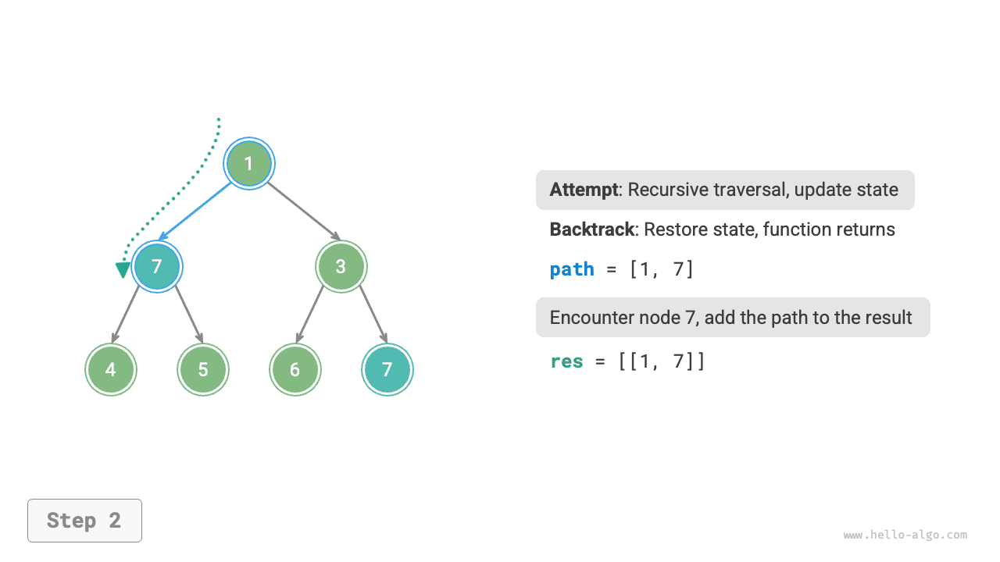
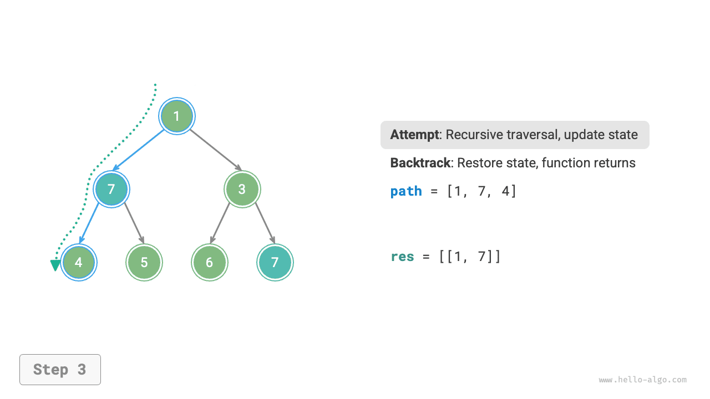
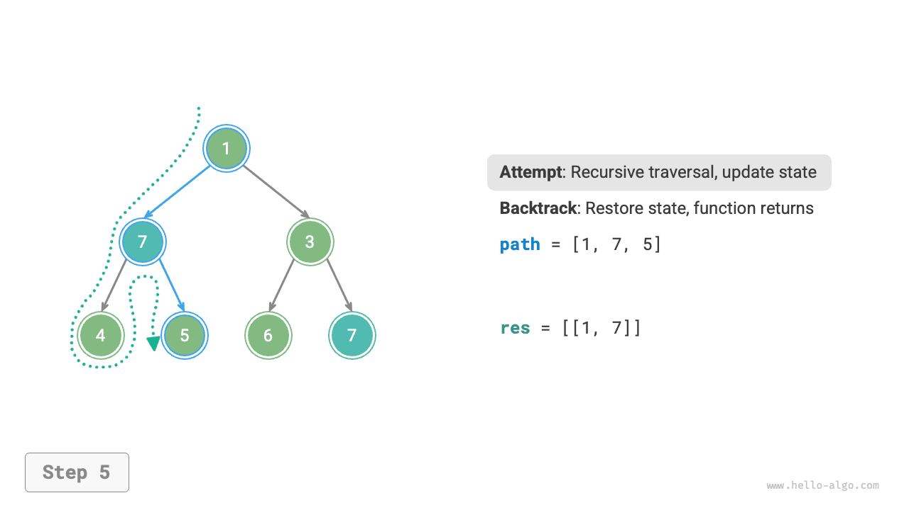
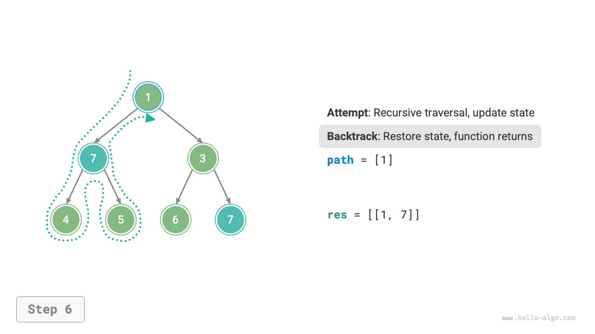
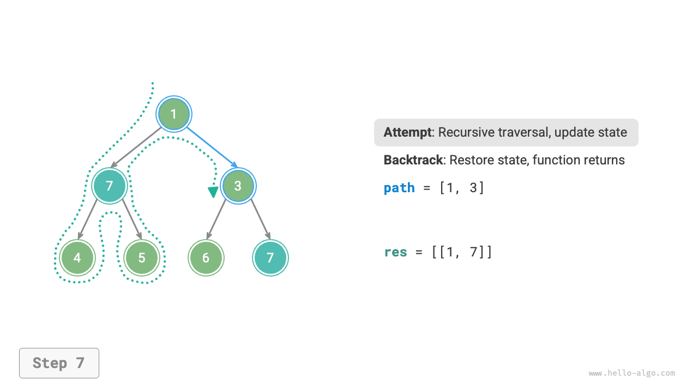
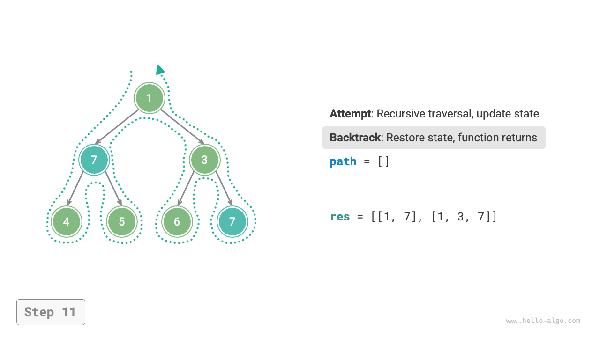
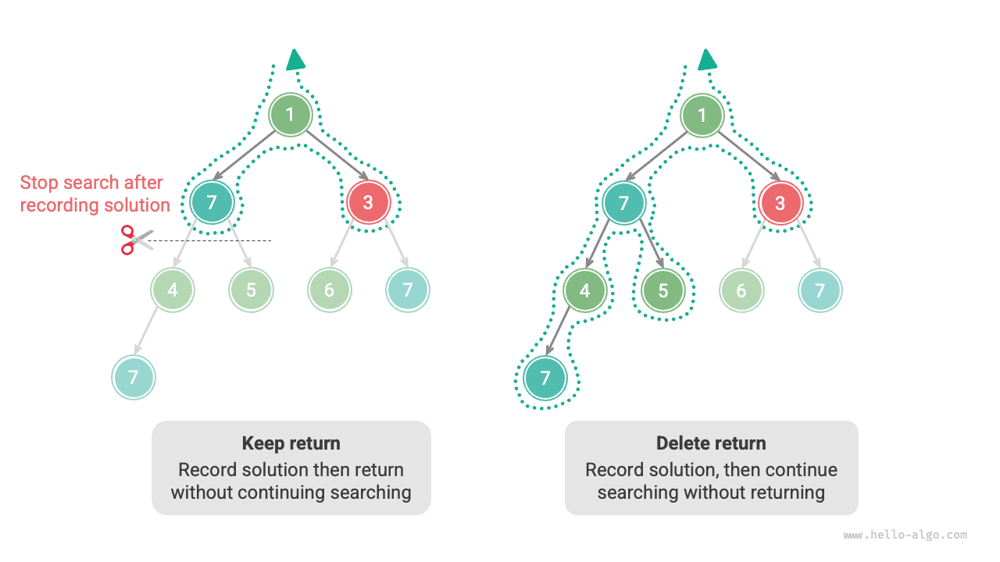

# Алгоритм поиска с возвратом

<u>Алгоритм поиска с возвратом (backtracking algorithm)</u> - это метод решения задач путем полного перебора. Его основная идея состоит в том, чтобы, начиная с некоторого исходного состояния, грубо перебрать все возможные решения, записывать корректные решения и продолжать поиск до тех пор, пока решение не будет найдено или пока не будут исчерпаны все возможные варианты.

Обычно алгоритмы поиска с возвратом используют "поиск в глубину" для обхода пространства решений. В главе "Бинарные деревья" мы уже упоминали, что прямой, симметричный и обратный обходы относятся к поиску в глубину. Теперь мы на основе прямого обхода построим задачу backtracking и постепенно разберем принцип работы этого алгоритма.

!!! question "Пример 1"

    Дано двоичное дерево. Найдите и запишите все узлы со значением $7$ ; верните список этих узлов.

Для этой задачи мы выполняем прямой обход дерева и проверяем, равно ли значение текущего узла $7$ ; если да, то добавляем значение этого узла в список результатов `res` . Соответствующий процесс показан на рисунке ниже и в коде:

```src
[file]{preorder_traversal_i_compact}-[class]{}-[func]{pre_order}
```


## Попытка и откат

**Алгоритм называется backtracking, потому что при поиске в пространстве решений он использует стратегию "попытка" и "откат"**. Когда в процессе поиска алгоритм приходит в состояние, из которого нельзя двигаться дальше или нельзя получить удовлетворяющее условиям решение, он отменяет предыдущий выбор, возвращается к более раннему состоянию и пробует другие возможные варианты.

Для примера 1 посещение каждого узла представляет собой "попытку", а прохождение листового узла или возврат к родителю через `return` означает "откат".

Важно понимать, что **откат не сводится только к возврату из функции**. Чтобы показать это, слегка расширим пример 1.

!!! question "Пример 2"

    Найдите в двоичном дереве все узлы со значением $7$ и **верните пути от корня до этих узлов**.

Взяв за основу код примера 1, добавим список `path` для записи пути посещенных узлов. Когда встречается узел со значением $7$ , мы копируем `path` и добавляем его в список результатов `res` . После завершения обхода именно `res` будет содержать все решения. Код приведен ниже:

```src
[file]{preorder_traversal_ii_compact}-[class]{}-[func]{pre_order}
```

В каждой "попытке" мы добавляем текущий узел в `path` , чтобы записать путь; а перед "откатом" нам нужно удалить этот узел из `path` , **чтобы восстановить состояние, существовавшее до текущей попытки**.

Если посмотреть на процесс, изображенный на рисунке ниже, **то попытку и откат можно понимать как "движение вперед" и "отмену"**: это два взаимно противоположных действия.

=== "<1>"
    

=== "<2>"
    

=== "<3>"
    

=== "<4>"
    

=== "<5>"
    

=== "<6>"
    

=== "<7>"
    

=== "<8>"
    

=== "<9>"
    

=== "<10>"
    

=== "<11>"
    

## Обрезка

Сложные задачи backtracking обычно содержат одно или несколько ограничений, **которые часто можно использовать для "обрезки"**.

!!! question "Пример 3"

    Найдите в двоичном дереве все узлы со значением $7$ , верните пути от корня до этих узлов, **причем путь не должен содержать узлы со значением $3$**.

Чтобы выполнить это ограничение, **нам нужно добавить операцию обрезки**: во время поиска, если встречается узел со значением $3$ , мы сразу возвращаемся и не продолжаем дальнейший поиск. Код выглядит так:

```src
[file]{preorder_traversal_iii_compact}-[class]{}-[func]{pre_order}
```

Термин "обрезка" очень нагляден. Как показано на рисунке ниже, во время поиска **мы "срезаем" ветви поиска, не удовлетворяющие ограничениям** , тем самым избегая множества бессмысленных попыток и повышая эффективность поиска.


## Каркас кода

Теперь попробуем извлечь общий каркас из действий "попытка", "откат" и "обрезка", чтобы сделать код более универсальным.

В следующем каркасе кода `state` обозначает текущее состояние задачи, а `choices` - список выборов, доступных в текущем состоянии:

=== "Python"

    ```python title=""
    def backtrack(state: State, choices: list[choice], res: list[state]):
        """Каркас алгоритма поиска с возвратом"""
        # Проверка, является ли текущее состояние решением
        if is_solution(state):
            # Запись решения
            record_solution(state, res)
            # Дальше не продолжаем поиск
            return
        # Перебор всех возможных выборов
        for choice in choices:
            # Обрезка: проверка допустимости выбора
            if is_valid(state, choice):
                # Попытка: сделать выбор и обновить состояние
                make_choice(state, choice)
                backtrack(state, choices, res)
                # Откат: отменить выбор и восстановить предыдущее состояние
                undo_choice(state, choice)
    ```

=== "C++"

    ```cpp title=""
    /* Каркас алгоритма поиска с возвратом */
    void backtrack(State *state, vector<Choice *> &choices, vector<State *> &res) {
        // Проверка, является ли текущее состояние решением
        if (isSolution(state)) {
            // Запись решения
            recordSolution(state, res);
            // Дальше не продолжаем поиск
            return;
        }
        // Перебор всех возможных выборов
        for (Choice choice : choices) {
            // Обрезка: проверка допустимости выбора
            if (isValid(state, choice)) {
                // Попытка: сделать выбор и обновить состояние
                makeChoice(state, choice);
                backtrack(state, choices, res);
                // Откат: отменить выбор и восстановить предыдущее состояние
                undoChoice(state, choice);
            }
        }
    }
    ```

=== "Java"

    ```java title=""
    /* Каркас алгоритма поиска с возвратом */
    void backtrack(State state, List<Choice> choices, List<State> res) {
        // Проверка, является ли текущее состояние решением
        if (isSolution(state)) {
            // Запись решения
            recordSolution(state, res);
            // Дальше не продолжаем поиск
            return;
        }
        // Перебор всех возможных выборов
        for (Choice choice : choices) {
            // Обрезка: проверка допустимости выбора
            if (isValid(state, choice)) {
                // Попытка: сделать выбор и обновить состояние
                makeChoice(state, choice);
                backtrack(state, choices, res);
                // Откат: отменить выбор и восстановить предыдущее состояние
                undoChoice(state, choice);
            }
        }
    }
    ```

=== "C#"

    ```csharp title=""
    /* Каркас алгоритма поиска с возвратом */
    void Backtrack(State state, List<Choice> choices, List<State> res) {
        // Проверка, является ли текущее состояние решением
        if (IsSolution(state)) {
            // Запись решения
            RecordSolution(state, res);
            // Дальше не продолжаем поиск
            return;
        }
        // Перебор всех возможных выборов
        foreach (Choice choice in choices) {
            // Обрезка: проверка допустимости выбора
            if (IsValid(state, choice)) {
                // Попытка: сделать выбор и обновить состояние
                MakeChoice(state, choice);
                Backtrack(state, choices, res);
                // Откат: отменить выбор и восстановить предыдущее состояние
                UndoChoice(state, choice);
            }
        }
    }
    ```

=== "Go"

    ```go title=""
    /* Каркас алгоритма поиска с возвратом */
    func backtrack(state *State, choices []Choice, res *[]State) {
        // Проверка, является ли текущее состояние решением
        if isSolution(state) {
            // Запись решения
            recordSolution(state, res)
            // Дальше не продолжаем поиск
            return
        }
        // Перебор всех возможных выборов
        for _, choice := range choices {
            // Обрезка: проверка допустимости выбора
            if isValid(state, choice) {
                // Попытка: сделать выбор и обновить состояние
                makeChoice(state, choice)
                backtrack(state, choices, res)
                // Откат: отменить выбор и восстановить предыдущее состояние
                undoChoice(state, choice)
            }
        }
    }
    ```

=== "Swift"

    ```swift title=""
    /* Каркас алгоритма поиска с возвратом */
    func backtrack(state: inout State, choices: [Choice], res: inout [State]) {
        // Проверка, является ли текущее состояние решением
        if isSolution(state: state) {
            // Запись решения
            recordSolution(state: state, res: &res)
            // Дальше не продолжаем поиск
            return
        }
        // Перебор всех возможных выборов
        for choice in choices {
            // Обрезка: проверка допустимости выбора
            if isValid(state: state, choice: choice) {
                // Попытка: сделать выбор и обновить состояние
                makeChoice(state: &state, choice: choice)
                backtrack(state: &state, choices: choices, res: &res)
                // Откат: отменить выбор и восстановить предыдущее состояние
                undoChoice(state: &state, choice: choice)
            }
        }
    }
    ```

=== "JS"

    ```javascript title=""
    /* Каркас алгоритма поиска с возвратом */
    function backtrack(state, choices, res) {
        // Проверка, является ли текущее состояние решением
        if (isSolution(state)) {
            // Запись решения
            recordSolution(state, res);
            // Дальше не продолжаем поиск
            return;
        }
        // Перебор всех возможных выборов
        for (let choice of choices) {
            // Обрезка: проверка допустимости выбора
            if (isValid(state, choice)) {
                // Попытка: сделать выбор и обновить состояние
                makeChoice(state, choice);
                backtrack(state, choices, res);
                // Откат: отменить выбор и восстановить предыдущее состояние
                undoChoice(state, choice);
            }
        }
    }
    ```

=== "TS"

    ```typescript title=""
    /* Каркас алгоритма поиска с возвратом */
    function backtrack(state: State, choices: Choice[], res: State[]): void {
        // Проверка, является ли текущее состояние решением
        if (isSolution(state)) {
            // Запись решения
            recordSolution(state, res);
            // Дальше не продолжаем поиск
            return;
        }
        // Перебор всех возможных выборов
        for (let choice of choices) {
            // Обрезка: проверка допустимости выбора
            if (isValid(state, choice)) {
                // Попытка: сделать выбор и обновить состояние
                makeChoice(state, choice);
                backtrack(state, choices, res);
                // Откат: отменить выбор и восстановить предыдущее состояние
                undoChoice(state, choice);
            }
        }
    }
    ```

=== "Dart"

    ```dart title=""
    /* Каркас алгоритма поиска с возвратом */
    void backtrack(State state, List<Choice>, List<State> res) {
      // Проверка, является ли текущее состояние решением
      if (isSolution(state)) {
        // Запись решения
        recordSolution(state, res);
        // Дальше не продолжаем поиск
        return;
      }
      // Перебор всех возможных выборов
      for (Choice choice in choices) {
        // Обрезка: проверка допустимости выбора
        if (isValid(state, choice)) {
          // Попытка: сделать выбор и обновить состояние
          makeChoice(state, choice);
          backtrack(state, choices, res);
          // Откат: отменить выбор и восстановить предыдущее состояние
          undoChoice(state, choice);
        }
      }
    }
    ```

=== "Rust"

    ```rust title=""
    /* Каркас алгоритма поиска с возвратом */
    fn backtrack(state: &mut State, choices: &Vec<Choice>, res: &mut Vec<State>) {
        // Проверка, является ли текущее состояние решением
        if is_solution(state) {
            // Запись решения
            record_solution(state, res);
            // Дальше не продолжаем поиск
            return;
        }
        // Перебор всех возможных выборов
        for choice in choices {
            // Обрезка: проверка допустимости выбора
            if is_valid(state, choice) {
                // Попытка: сделать выбор и обновить состояние
                make_choice(state, choice);
                backtrack(state, choices, res);
                // Откат: отменить выбор и восстановить предыдущее состояние
                undo_choice(state, choice);
            }
        }
    }
    ```

=== "C"

    ```c title=""
    /* Каркас алгоритма поиска с возвратом */
    void backtrack(State *state, Choice *choices, int numChoices, State *res, int numRes) {
        // Проверка, является ли текущее состояние решением
        if (isSolution(state)) {
            // Запись решения
            recordSolution(state, res, numRes);
            // Дальше не продолжаем поиск
            return;
        }
        // Перебор всех возможных выборов
        for (int i = 0; i < numChoices; i++) {
            // Обрезка: проверка допустимости выбора
            if (isValid(state, &choices[i])) {
                // Попытка: сделать выбор и обновить состояние
                makeChoice(state, &choices[i]);
                backtrack(state, choices, numChoices, res, numRes);
                // Откат: отменить выбор и восстановить предыдущее состояние
                undoChoice(state, &choices[i]);
            }
        }
    }
    ```

=== "Kotlin"

    ```kotlin title=""
    /* Каркас алгоритма поиска с возвратом */
    fun backtrack(state: State?, choices: List<Choice?>, res: List<State?>?) {
        // Проверка, является ли текущее состояние решением
        if (isSolution(state)) {
            // Запись решения
            recordSolution(state, res)
            // Дальше не продолжаем поиск
            return
        }
        // Перебор всех возможных выборов
        for (choice in choices) {
            // Обрезка: проверка допустимости выбора
            if (isValid(state, choice)) {
                // Попытка: сделать выбор и обновить состояние
                makeChoice(state, choice)
                backtrack(state, choices, res)
                // Откат: отменить выбор и восстановить предыдущее состояние
                undoChoice(state, choice)
            }
        }
    }
    ```

=== "Ruby"

    ```ruby title=""
    ### Каркас алгоритма поиска с возвратом ###
    def backtrack(state, choices, res)
        # Проверка, является ли текущее состояние решением
        if is_solution?(state)
            # Запись решения
            record_solution(state, res)
            return
        end

        # Перебор всех возможных выборов
        for choice in choices
            # Обрезка: проверка допустимости выбора
            if is_valid?(state, choice)
                # Попытка: сделать выбор и обновить состояние
                make_choice(state, choice)
                backtrack(state, choices, res)
                # Откат: отменить выбор и восстановить предыдущее состояние
                undo_choice(state, choice)
            end
        end
    end
    ```

Теперь, опираясь на этот каркас, решим пример 3. Состояние `state` здесь - это путь обхода узлов, выбор `choices` - левый и правый потомки текущего узла, а результат `res` - список путей:

```src
[file]{preorder_traversal_iii_template}-[class]{}-[func]{backtrack}
```

Согласно условию задачи, после нахождения узла со значением $7$ мы должны продолжать поиск, **поэтому оператор `return` после записи решения нужно удалить**. На рисунке ниже сравниваются процессы поиска в случаях, когда `return` сохраняется и когда он удаляется.



По сравнению с реализацией на основе прямого обхода, версия на основе общего каркаса backtracking выглядит более громоздкой, но при этом обладает лучшей универсальностью. На практике **многие задачи backtracking можно решать в рамках этого каркаса**. Для этого нужно лишь определить `state` и `choices` под конкретную задачу и реализовать соответствующие методы каркаса.

## Часто используемые термины

Чтобы яснее анализировать алгоритмические задачи, подытожим значения часто используемых терминов backtracking и сопоставим их с примером 3, как показано в таблице ниже.

<p align="center"> Таблица <id> &nbsp; Часто используемые термины алгоритма backtracking </p>

| Термин                   | Определение                                                                | Пример 3                                                              |
| ------------------------ | -------------------------------------------------------------------------- | --------------------------------------------------------------------- |
| Решение (solution)       | Решение - это ответ, удовлетворяющий условиям задачи; решений может быть одно или несколько | Все пути от корня до узла $7$ , удовлетворяющие ограничениям          |
| Ограничение (constraint) | Ограничение определяет допустимость решения и обычно используется для обрезки | Путь не содержит узлы со значением $3$                                |
| Состояние (state)        | Состояние описывает ситуацию задачи в некоторый момент времени, включая уже сделанные выборы | Текущий путь посещенных узлов, то есть список узлов `path`            |
| Попытка (attempt)        | Попытка - это исследование пространства решений на основе доступных выборов, включая выбор, обновление состояния и проверку, является ли состояние решением | Рекурсивный переход к левому или правому потомку, добавление узла в `path` и проверка, равно ли значение узла $7$ |
| Откат (backtracking)     | Откат означает отмену предыдущих выборов и возврат к более раннему состоянию при встрече состояния, не удовлетворяющего ограничениям | Завершение поиска при проходе через лист, окончании посещения узла или встрече узла со значением $3$ , то есть возврат из функции |
| Обрезка (pruning)        | Обрезка - это способ избегать бессмысленных путей поиска на основе свойств задачи и ее ограничений, повышающий эффективность | При встрече узла со значением $3$ поиск по этой ветви прекращается    |

!!! tip

    Такие понятия, как задача, решение и состояние, являются общими и встречаются не только в backtracking, но и в divide and conquer, динамическом программировании, жадных алгоритмах и других темах.

## Преимущества и ограничения

Алгоритм поиска с возвратом по своей сути является алгоритмом поиска в глубину, который перебирает все возможные решения, пока не найдет удовлетворяющее условиям. Преимущество этого подхода в том, что он позволяет находить все возможные решения и при разумной обрезке может работать весьма эффективно.

Однако при работе с большими или сложными задачами **эффективность backtracking может оказаться неприемлемой**.

- **Время**: backtracking обычно требует обхода всех возможных состояний пространства состояний, и его временная сложность может достигать экспоненциального или факториального порядка.
- **Память**: при рекурсивных вызовах нужно хранить текущее состояние (например, путь, вспомогательные переменные для обрезки и т.д.), поэтому при большой глубине рекурсии потребность в памяти может стать значительной.

Тем не менее **backtracking по-прежнему остается лучшим решением для некоторых поисковых задач и задач удовлетворения ограничений**. В таких задачах заранее невозможно предсказать, какие выборы приведут к эффективному решению, поэтому приходится перебирать все возможные варианты. В этой ситуации **ключевым становится вопрос оптимизации эффективности** , и для этого обычно используют две стратегии.

- **Обрезка**: избегать поиска по тем путям, которые заведомо не приведут к решению, тем самым экономя время и память.
- **Эвристический поиск**: вводить во время поиска дополнительные стратегии или оценки, чтобы в первую очередь исследовать пути, наиболее вероятно ведущие к эффективному решению.

## Типичные задачи backtracking

Алгоритм поиска с возвратом можно использовать для решения множества поисковых задач, задач удовлетворения ограничений и задач комбинаторной оптимизации.

**Поисковые задачи**: целью таких задач является поиск решений, удовлетворяющих определенным условиям.

- Задача о перестановках: дано множество, требуется найти все возможные перестановки его элементов.
- Задача о сумме подмножеств: даны множество и целевая сумма; нужно найти все подмножества, сумма элементов которых равна целевой.
- Задача о Ханойской башне: даны три стержня и набор дисков разного размера; требуется перенести все диски с одного стержня на другой, перемещая за раз только один диск и не помещая больший диск на меньший.

**Задачи удовлетворения ограничений**: целью таких задач является поиск решений, удовлетворяющих всем ограничениям.

- Задача о $n$ ферзях: разместить $n$ ферзей на шахматной доске размера $n \times n$ так, чтобы они не атаковали друг друга.
- Судоку: заполнить сетку $9 \times 9$ числами от $1$ до $9$ так, чтобы в каждой строке, каждом столбце и каждом блоке $3 \times 3$ числа не повторялись.
- Задача раскраски графа: дан неориентированный граф; требуется раскрасить его вершины минимальным числом цветов так, чтобы соседние вершины имели разные цвета.

**Задачи комбинаторной оптимизации**: целью таких задач является поиск оптимального решения в некотором комбинаторном пространстве при заданных ограничениях.

- Задача о рюкзаке 0-1: даны набор предметов и рюкзак; у каждого предмета есть ценность и вес, и нужно выбрать предметы так, чтобы при ограниченной вместимости рюкзака суммарная ценность была максимальной.
- Задача коммивояжера: начиная из некоторой вершины графа, требуется посетить все остальные вершины ровно по одному разу и вернуться в исходную вершину, найдя при этом кратчайший путь.
- Задача о максимальной клике: дан неориентированный граф; требуется найти в нем максимальный полный подграф, то есть подграф, в котором любая пара вершин соединена ребром.

Обратите внимание: для многих задач комбинаторной оптимизации backtracking не является оптимальным способом решения.

- Задача о рюкзаке 0-1 обычно решается с помощью динамического программирования, что дает более высокую временную эффективность.
- Задача коммивояжера является известной NP-Hard задачей; для ее решения часто используют генетические алгоритмы, муравьиные алгоритмы и другие методы.
- Задача о максимальной клике является классической задачей теории графов и может решаться жадными и другими эвристическими алгоритмами.
