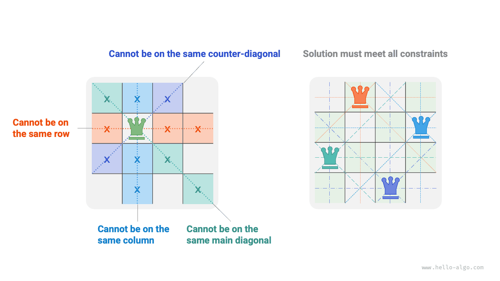

# Задача о n ферзях

!!! question

    Согласно правилам шахмат ферзь может атаковать фигуры, находящиеся с ним на одной строке, в одном столбце или на одной диагонали. Даны $n$ ферзей и шахматная доска размера $n \times n$ ; требуется найти такие расстановки, при которых ни одна пара ферзей не может атаковать друг друга.

Как показано на рисунке ниже, при $n = 4$ существует два решения. С точки зрения backtracking доска размера $n \times n$ содержит $n^2$ клеток, которые образуют все возможные выборы `choices` . По мере поочередного размещения ферзей состояние доски непрерывно меняется, и текущее содержимое доски образует состояние `state` .


На рисунке ниже показаны три ограничения этой задачи: **несколько ферзей не могут находиться на одной строке, в одном столбце или на одной диагонали**. При этом нужно помнить, что диагонали бывают двух типов: главная `\` и побочная `/` .



### Построчная стратегия размещения

Число ферзей и число строк доски одинаково и равно $n$ , поэтому легко получить следующий вывод: **в каждой строке доски разрешено и нужно разместить ровно одного ферзя**.

Иначе говоря, можно использовать построчную стратегию: начиная с первой строки, размещать по одному ферзю в каждой строке, пока не будет достигнута последняя.

На рисунке ниже показан процесс построчного размещения для задачи о 4 ферзях. Из-за ограничений размера изображения на нем раскрыта только одна ветвь поиска для первой строки, а все варианты, не удовлетворяющие ограничениям по столбцам и диагоналям, были отсечены.


По своей сути **построчная стратегия сама по себе выполняет роль обрезки** , потому что заранее исключает все ветви поиска, в которых в одной строке оказалось бы несколько ферзей.

### Обрезка по столбцам и диагоналям

Чтобы удовлетворить ограничению по столбцам, можно использовать булев массив `cols` длины $n$ , который записывает, есть ли ферзь в каждом столбце. Перед каждым размещением мы используем `cols` для отсечения столбцов, уже занятых ферзями, а затем динамически обновляем состояние `cols` во время отката.

!!! tip

    Обратите внимание: начало координат матрицы находится в левом верхнем углу, при этом индексы строк растут сверху вниз, а индексы столбцов - слева направо.

Как теперь обработать ограничения по диагоналям? Пусть клетка на доске имеет координаты $(row, col)$ . Выбрав некоторую главную диагональ в матрице, можно заметить, что разность индексов строки и столбца одинакова для всех клеток этой диагонали, **то есть для всех клеток главной диагонали значение $row - col$ постоянно**.

Это означает, что если для двух клеток выполняется равенство $row_1 - col_1 = row_2 - col_2$ , то они обязательно лежат на одной и той же главной диагонали. Используя это правило, можно с помощью массива `diags1` , показанного на рисунке ниже, отмечать наличие ферзя на каждой главной диагонали.

Аналогично **для всех клеток побочной диагонали значение $row + col$ является постоянным**. Поэтому для обработки ограничений по побочным диагоналям можно использовать еще один массив `diags2` .


### Реализация кода

Заметим, что в квадратной матрице размера $n$ диапазон значений $row - col$ равен $[-n + 1, n - 1]$ , а диапазон значений $row + col$ равен $[0, 2n - 2]$ . Следовательно, число главных и побочных диагоналей равно $2n - 1$ , а значит, длины массивов `diags1` и `diags2` тоже равны $2n - 1$ .

```src
[file]{n_queens}-[class]{}-[func]{n_queens}
```

Если размещать ферзей построчно $n$ раз, учитывая ограничение по столбцам, то начиная с первой строки и заканчивая последней мы получаем соответственно $n$, $n-1$, $\dots$, $2$, $1$ вариантов выбора, что дает $O(n!)$ времени. При записи решения нужно скопировать матрицу `state` и добавить ее в `res` , а копирование требует $O(n^2)$ времени. Следовательно, **общая временная сложность равна $O(n! \cdot n^2)$** . На практике обрезка по диагональным ограничениям дополнительно сильно уменьшает пространство поиска, поэтому фактическая эффективность часто лучше этой оценки.

Массив `state` использует $O(n^2)$ пространства, а массивы `cols` , `diags1` и `diags2` используют по $O(n)$ пространства. Максимальная глубина рекурсии равна $n$ , что требует $O(n)$ памяти стека. Следовательно, **пространственная сложность равна $O(n^2)$** .
