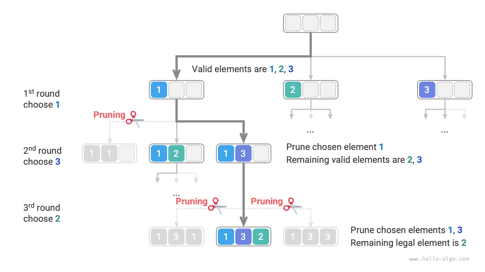
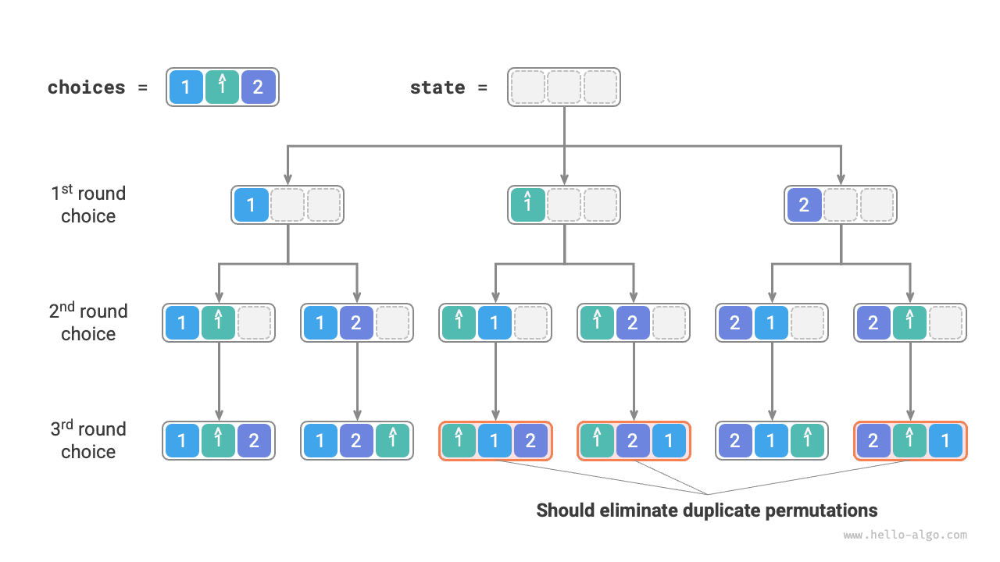

# Задача о перестановках

Задача о перестановках является типичным применением алгоритма поиска с возвратом. Ее определение состоит в том, чтобы для данного множества элементов (например, массива или строки) найти все возможные перестановки этих элементов.

В таблице ниже приведено несколько примеров входных массивов и соответствующих им перестановок.

<p align="center"> Таблица <id> &nbsp; Примеры перестановок </p>

| Входной массив | Все перестановки                                                   |
| :------------- | :----------------------------------------------------------------- |
| $[1]$          | $[1]$                                                              |
| $[1, 2]$       | $[1, 2], [2, 1]$                                                   |
| $[1, 2, 3]$    | $[1, 2, 3], [1, 3, 2], [2, 1, 3], [2, 3, 1], [3, 1, 2], [3, 2, 1]$ |

## Случай без равных элементов

!!! question

    Дан массив целых чисел, в котором нет повторяющихся элементов. Верните все возможные перестановки.

С точки зрения backtracking **процесс построения перестановок можно представить как результат последовательности выборов**. Пусть входной массив равен $[1, 2, 3]$ ; если мы сначала выберем $1$ , затем $3$ , а потом $2$ , то получим перестановку $[1, 3, 2]$ . Откат означает отмену одного из выборов с последующей попыткой других вариантов.

С точки зрения кода backtracking множество кандидатов `choices` состоит из всех элементов входного массива, а состояние `state` - из элементов, уже выбранных к текущему моменту. Обратите внимание, что каждый элемент разрешено выбирать только один раз, **поэтому все элементы в `state` должны быть уникальны**.

Как показано на рисунке ниже, процесс поиска можно развернуть в дерево рекурсии, где каждый узел представляет текущее состояние `state` . Начиная от корня, после трех раундов выбора мы попадаем в листья, и каждый лист соответствует одной перестановке.


### Обрезка повторного выбора

Чтобы гарантировать, что каждый элемент выбирается только один раз, введем булев массив `selected` , где `selected[i]` обозначает, был ли уже выбран `choices[i]` , и на его основе выполним следующую обрезку.

- После того как сделан выбор `choice[i]` , мы присваиваем `selected[i]` значение $\text{True}$ , тем самым отмечая, что этот элемент уже выбран.
- При обходе списка вариантов `choices` пропускаем все уже выбранные элементы, то есть выполняем обрезку.

Как показано на рисунке ниже, если в первом раунде мы выберем 1 , во втором - 3 , а в третьем - 2 , то во втором раунде нужно отсечь ветвь элемента 1 , а в третьем - ветви элементов 1 и 3 .



Из рисунка видно, что такая обрезка уменьшает размер пространства поиска с $O(n^n)$ до $O(n!)$ .

### Реализация кода

После прояснения всей логики можно просто "заполнить пропуски" в шаблоне backtracking. Чтобы сократить общий объем кода, мы не будем отдельно реализовывать каждую функцию из каркаса, а раскроем их прямо внутри `backtrack()` :

```src
[file]{permutations_i}-[class]{}-[func]{permutations_i}
```

## Учет равных элементов

!!! question

    Дан массив целых чисел, **который может содержать повторяющиеся элементы**. Верните все неповторяющиеся перестановки.

Пусть входной массив равен $[1, 1, 2]$ . Чтобы различать два одинаковых элемента $1$ , будем обозначать второй из них как $\hat{1}$ .

Как показано на рисунке ниже, описанный выше метод создаст результат, половина которого окажется дублирующейся.



Как же убрать повторяющиеся перестановки? Самый прямолинейный способ - воспользоваться хеш-множеством и удалить дубликаты уже после генерации результата. Но это не слишком изящно, **потому что ветви поиска, порождающие дубликаты, вообще не нужно посещать: их следует распознавать заранее и отсекать**, что дополнительно повышает эффективность алгоритма.

### Обрезка равных элементов

Посмотрите на рисунок ниже: в первом раунде выбрать $1$ или выбрать $\hat{1}$ - это одно и то же, а значит, все перестановки, полученные из этих двух выборов, будут дублироваться. Поэтому ветвь $\hat{1}$ нужно отсечь.

Точно так же, если в первом раунде выбрать $2$ , то во втором раунде выборы $1$ и $\hat{1}$ снова создадут дублирующиеся ветви, поэтому и в этом случае ветвь $\hat{1}$ нужно отсечь.

По своей сути **наша цель заключается в том, чтобы на каждом раунде выбора каждый из нескольких равных элементов выбирался только один раз**.


### Реализация кода

На основе решения из предыдущей задачи можно на каждом раунде выбора заводить хеш-множество `duplicated` , которое будет записывать элементы, уже встречавшиеся в этом раунде, и отсекать повторы:

```src
[file]{permutations_ii}-[class]{}-[func]{permutations_ii}
```

Если предположить, что все элементы попарно различны, то из $n$ элементов можно получить $n!$ перестановок; при записи результата требуется копировать список длины $n$ , что занимает $O(n)$ времени. **Следовательно, временная сложность равна $O(n!n)$** .

Максимальная глубина рекурсии равна $n$ , что требует $O(n)$ стековой памяти. Массив `selected` занимает $O(n)$ пространства. Одновременно может существовать до $n$ хеш-множеств `duplicated` , что дает $O(n^2)$ памяти. **Следовательно, пространственная сложность равна $O(n^2)$** .

### Сравнение двух видов обрезки

Обратите внимание: хотя и `selected` , и `duplicated` используются для обрезки, их цели различаются.

- **Обрезка повторного выбора**: во всем процессе поиска существует только один `selected` . Он записывает, какие элементы уже входят в текущее состояние, и нужен для того, чтобы один и тот же элемент не появлялся в `state` дважды.
- **Обрезка равных элементов**: каждый раунд выбора (каждый вызов `backtrack`) содержит собственный `duplicated` . Он записывает, какие элементы уже выбирались в текущем раунде (`for` цикле), и нужен для того, чтобы равные элементы выбирались только один раз.

На рисунке ниже показана область действия двух условий обрезки. Помните, что каждый узел дерева соответствует одному выбору, а путь от корня до листа образует одну перестановку.


