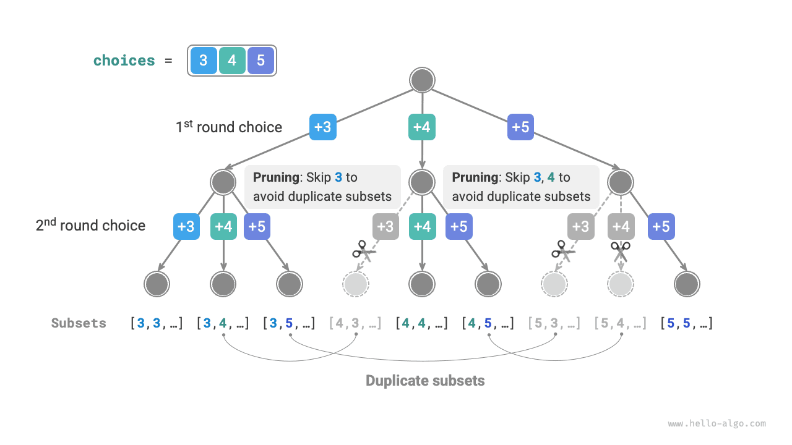
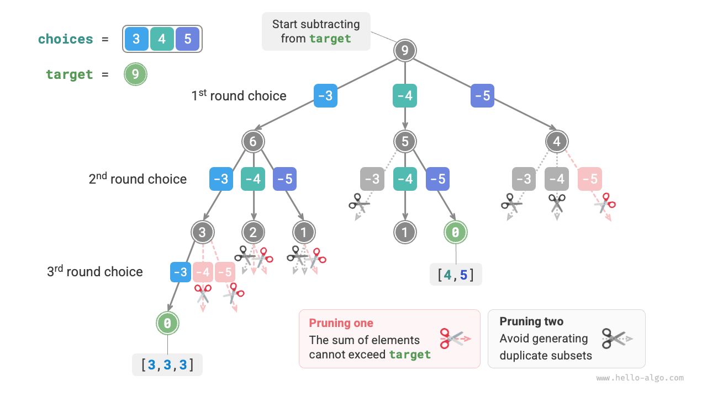

# Задача о сумме подмножеств

## Случай без повторяющихся элементов

!!! question

    Дан массив положительных целых чисел `nums` и целое положительное значение `target` . Найдите все возможные комбинации, сумма элементов которых равна `target` . Во входном массиве нет повторяющихся элементов, и каждый элемент можно выбирать неограниченное число раз. Верните эти комбинации в виде списка; в результате не должно быть повторяющихся комбинаций.

Например, для входного множества $\{3, 4, 5\}$ и целевого значения $9$ решениями будут $\{3, 3, 3\}$ и $\{4, 5\}$ . При этом нужно обратить внимание на два обстоятельства.

- Элементы входного множества можно выбирать повторно неограниченное число раз.
- Подмножество не различает порядок элементов, поэтому $\{4, 5\}$ и $\{5, 4\}$ считаются одним и тем же подмножеством.

### Отталкиваемся от решения задачи о перестановках

Как и в задаче о перестановках, можно представлять построение подмножеств как результат последовательности выборов и во время выбора динамически обновлять "сумму элементов"; когда эта сумма становится равной `target` , соответствующее подмножество записывается в список результатов.

Однако в отличие от задачи о перестановках **в этой задаче элементы множества можно выбирать неограниченное число раз**, поэтому нам не нужен булев список `selected` для записи того, был ли выбран элемент. Можно слегка изменить код для перестановок и получить первоначальную версию решения:

```src
[file]{subset_sum_i_naive}-[class]{}-[func]{subset_sum_i_naive}
```

Если подать на этот код массив $[3, 4, 5]$ и целевое значение $9$ , то на выходе мы получим $[3, 3, 3], [4, 5], [5, 4]$ . **Хотя все подмножества с суммой $9$ успешно найдены, среди них все же присутствуют дубликаты: $[4, 5]$ и $[5, 4]$** .

Причина в том, что процесс поиска различает порядок выбора, тогда как для подмножеств порядок не важен. Как показано на рисунке ниже, сначала выбрать $4$ , а затем $5$ , и сначала выбрать $5$ , а затем $4$ - это разные ветви поиска, но им соответствует одно и то же подмножество.


Чтобы убрать повторяющиеся подмножества, **одна из прямых идей - удалить дубликаты уже из итогового списка результатов**. Но это решение малоэффективно по двум причинам.

- Когда массив содержит много элементов, а особенно когда `target` велик, процесс поиска порождает огромное число повторяющихся подмножеств.
- Сравнение подмножеств (то есть массивов) само по себе довольно затратно: сначала приходится сортировать массивы, а затем поэлементно сравнивать их.

### Обрезка повторяющихся подмножеств

**Поэтому стоит выполнять устранение дубликатов прямо во время поиска, с помощью обрезки**. Посмотрите на рисунок ниже: повторяющиеся подмножества возникают тогда, когда элементы массива выбираются в разном порядке, например так.

1. Если в первом и втором раундах выбрать соответственно $3$ и $4$ , то будут сгенерированы все подмножества, содержащие эти два элемента, и их можно обозначить как $[3, 4, \dots]$ .
2. После этого, если в первом раунде выбрать $4$ , **то во втором раунде нужно пропустить $3$** , потому что подмножества $[4, 3, \dots]$ полностью дублируют подмножества, уже построенные на шаге `1.` .

Во время поиска выборы на каждом уровне пробуются по одному слева направо, поэтому чем правее ветвь, тем больше ветвей оказывается отсечено.

1. В первых двух раундах выбираются $3$ и $5$ , что дает подмножества $[3, 5, \dots]$ .
2. В первых двух раундах выбираются $4$ и $5$ , что дает подмножества $[4, 5, \dots]$ .
3. Если же в первом раунде выбрать $5$ , **то во втором раунде нужно пропустить $3$ и $4$** , потому что подмножества $[5, 3, \dots]$ и $[5, 4, \dots]$ полностью дублируют случаи, описанные в шагах `1.` и `2.` .



В общем виде, если входной массив имеет вид $[x_1, x_2, \dots, x_n]$ , а последовательность выборов в ходе поиска равна $[x_{i_1}, x_{i_2}, \dots, x_{i_m}]$ , то она должна удовлетворять условию $i_1 \leq i_2 \leq \dots \leq i_m$ ; **все последовательности выборов, не удовлетворяющие этому условию, приводят к дубликатам и должны отсекаться**.

### Реализация кода

Чтобы реализовать такую обрезку, инициализируем переменную `start` , которая будет указывать начальную точку обхода. **После выбора элемента $x_i$ следующий раунд начинается с индекса $i$**. Благодаря этому последовательность выборов всегда удовлетворяет условию $i_1 \leq i_2 \leq \dots \leq i_m$ , а значит, каждое подмножество создается только один раз.

Помимо этого, мы внесем в код еще два улучшения.

- Перед началом поиска отсортируем массив `nums` . Тогда при обходе всех вариантов **можно сразу прервать цикл, как только сумма подмножества превысит `target`** , потому что все последующие элементы будут еще больше и их сумма тоже превысит `target` .
- Откажемся от отдельной переменной суммы `total` и **будем учитывать сумму через вычитание из `target`** ; когда `target` станет равным $0$ , решение фиксируется.

```src
[file]{subset_sum_i}-[class]{}-[func]{subset_sum_i}
```

На рисунке ниже показан полный процесс backtracking для массива $[3, 4, 5]$ и целевого значения $9$ .



## Учет повторяющихся элементов

!!! question

    Дан массив положительных целых чисел `nums` и целое положительное значение `target` . Найдите все возможные комбинации, сумма элементов которых равна `target` . **Во входном массиве могут присутствовать повторяющиеся элементы, и каждый элемент разрешено выбирать только один раз**. Верните эти комбинации в виде списка; в результате не должно быть повторяющихся комбинаций.

По сравнению с предыдущей задачей **во входном массиве теперь могут присутствовать повторяющиеся элементы**, и это создает новую проблему. Например, если дан массив $[4, \hat{4}, 5]$ и целевое значение $9$ , то существующий код вернет результат $[4, 5], [\hat{4}, 5]$ , то есть с повторяющимся подмножеством.

**Причина появления дублей в том, что равные элементы выбираются несколько раз в одном и том же раунде**. На рисунке ниже в первом раунде существует три варианта выбора, и два из них равны $4$ ; из-за этого появляются две дублирующиеся ветви поиска и, соответственно, повторяющиеся подмножества. Точно так же два элемента $4$ во втором раунде тоже порождают дубликаты.


### Обрезка равных элементов

Чтобы решить эту проблему, **нужно ограничить выбор равных элементов так, чтобы в каждом раунде каждый из них выбирался только один раз**. Реализуется это довольно изящно: поскольку массив отсортирован, равные элементы стоят рядом. Значит, если в текущем раунде текущий элемент равен соседнему слева, то этот вариант уже был рассмотрен, и текущий элемент нужно пропустить.

Одновременно **по условию этой задачи каждый элемент массива можно выбрать только один раз**. К счастью, это ограничение тоже можно реализовать через переменную `start` : после выбора элемента $x_i$ следующий раунд начинается с индекса $i + 1$ . Так мы одновременно убираем повторяющиеся подмножества и исключаем повторный выбор одного и того же элемента.

### Реализация кода

```src
[file]{subset_sum_ii}-[class]{}-[func]{subset_sum_ii}
```

На рисунке ниже показан процесс backtracking для массива $[4, 4, 5]$ и целевого значения $9$ . В нем используются четыре вида обрезки. Попробуйте сопоставить рисунок с комментариями в коде, чтобы понять полный процесс поиска и то, как работает каждый тип обрезки.


