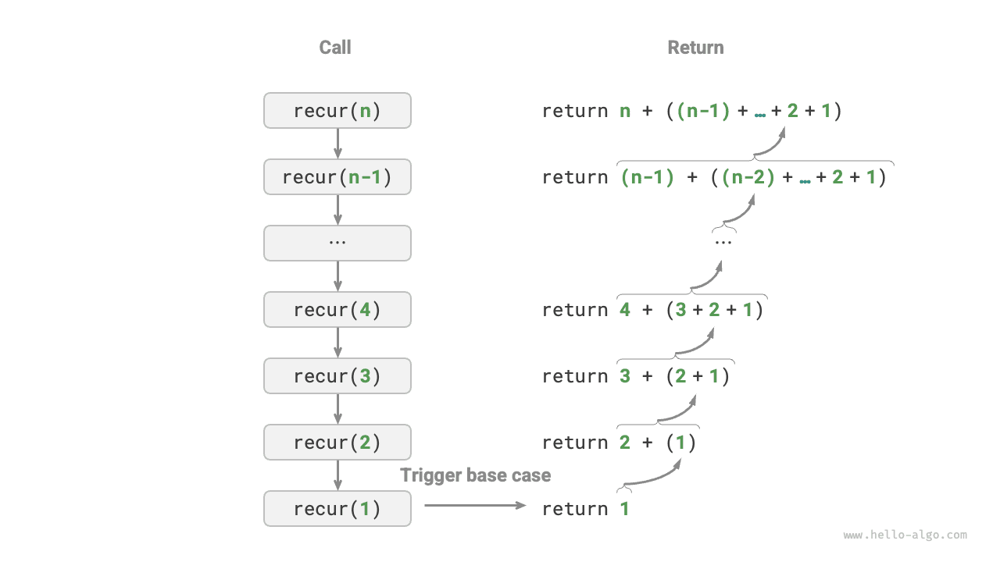
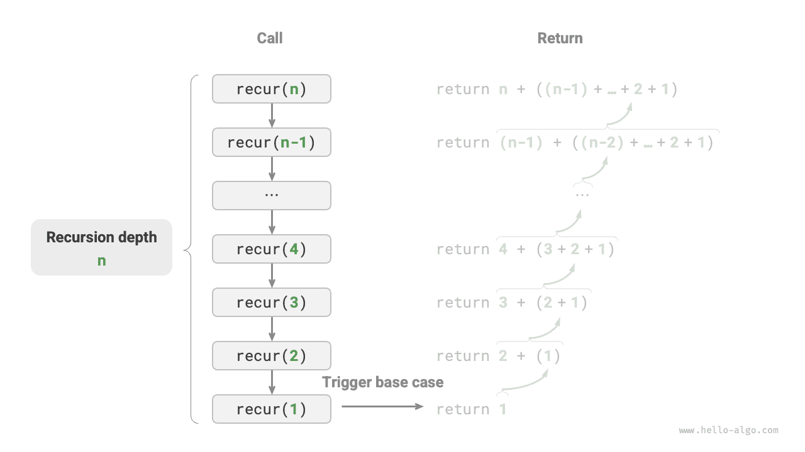
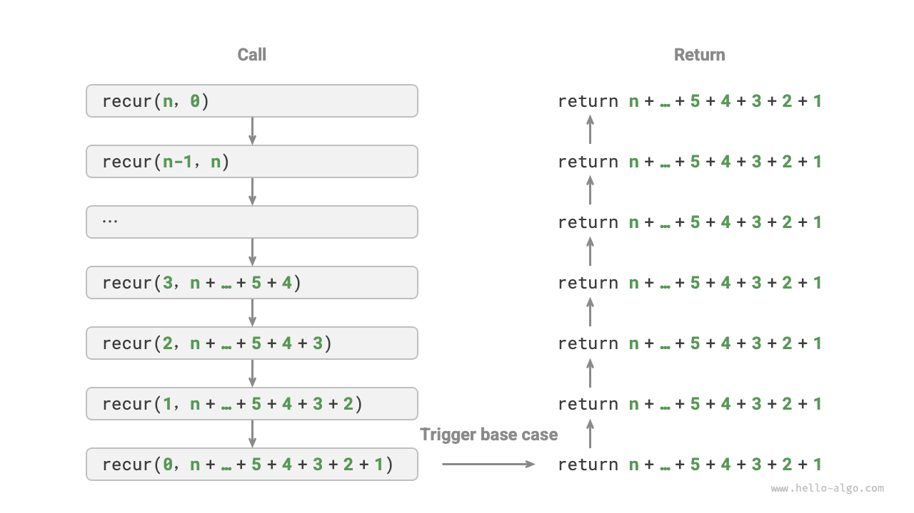
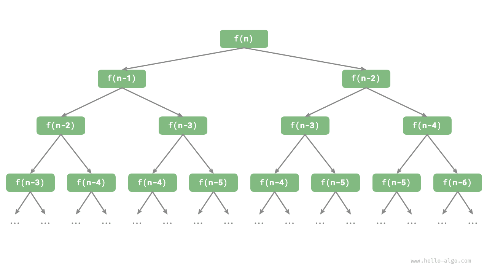

# Итерация и рекурсия

В алгоритмах очень часто приходится многократно выполнять одну и ту же задачу, и это тесно связано с анализом сложности. Поэтому, прежде чем переходить к временной и пространственной сложности, давай сначала разберемся, как в программах организуется повторяющееся выполнение задач, то есть с двумя базовыми управляющими структурами: итерацией и рекурсией.

## Итерация

<u>Итерация (iteration)</u> - это управляющая структура, предназначенная для многократного выполнения некоторой задачи. При итерации программа повторно выполняет определенный фрагмент кода при соблюдении некоторого условия, пока это условие не перестанет выполняться.

### Цикл for

Цикл `for` - одна из самых распространенных форм итерации, **она хорошо подходит в тех случаях, когда число повторений известно заранее**.

Следующая функция реализует вычисление суммы $1 + 2 + \dots + n$ на основе цикла `for` , а результат сохраняется в переменной `res` . Обрати внимание, что в Python `range(a, b)` соответствует "лево-замкнутому, право-открытому" интервалу, то есть перебираются значения $a, a + 1, \dots, b-1$ :

```src
[file]{iteration}-[class]{}-[func]{for_loop}
```

На рисунке ниже показана блок-схема этой функции суммирования.


Число операций в этой функции суммирования пропорционально размеру входных данных $n$ , то есть между ними существует "линейная зависимость". На самом деле **временная сложность как раз и описывает такую "линейную зависимость"**. Соответствующий материал будет подробно разобран в следующем разделе.

### Цикл while

Подобно циклу `for` , цикл `while` тоже является способом реализации итерации. В цикле `while` программа в каждом раунде сначала проверяет условие: если условие истинно, выполнение продолжается, иначе цикл завершается.

Ниже мы используем цикл `while` для реализации суммы $1 + 2 + \dots + n$ :

```src
[file]{iteration}-[class]{}-[func]{while_loop}
```

**Цикл `while` обладает большей свободой, чем цикл `for` **. В цикле `while` мы можем свободно задавать шаги инициализации и обновления условной переменной.

Например, в следующем коде условная переменная $i$ обновляется два раза за один проход, и такой случай уже не слишком удобно выражать через цикл `for` :

```src
[file]{iteration}-[class]{}-[func]{while_loop_ii}
```

В целом **код с `for` обычно компактнее, а `while` более гибок**; обе конструкции позволяют реализовывать итерационные структуры. Выбор между ними должен определяться требованиями конкретной задачи.

### Вложенные циклы

Мы можем вкладывать одну циклическую структуру в другую; ниже показан пример на основе цикла `for` :

```src
[file]{iteration}-[class]{}-[func]{nested_for_loop}
```

На рисунке ниже показана блок-схема такого вложенного цикла.


В этом случае число операций функции пропорционально $n^2$ , то есть время работы алгоритма и размер входных данных $n$ находятся в "квадратичной зависимости".

Мы можем продолжать добавлять вложенные циклы, и каждое новое вложение будет означать очередное "повышение размерности", увеличивая временную сложность до "кубической зависимости", "зависимости четвертой степени" и так далее.

## Рекурсия

 <u>Рекурсия (recursion)</u> - это алгоритмическая стратегия, в которой функция решает задачу, вызывая саму себя. В основном она включает две фазы.

1. **Спуск**: программа все глубже вызывает саму себя, обычно передавая меньшие или более упрощенные параметры, пока не достигнет "условия завершения".
2. **Подъем**: после срабатывания "условия завершения" программа начинает возвращаться от самой глубокой рекурсивной функции вверх, собирая результаты с каждого уровня.

С точки зрения реализации рекурсивный код в основном состоит из трех элементов.

1. **Условие завершения**: определяет момент перехода от "спуска" к "подъему".
2. **Рекурсивный вызов**: соответствует "спуску", когда функция вызывает саму себя, обычно с меньшими или более упрощенными параметрами.
3. **Возврат результата**: соответствует "подъему", когда результат текущего уровня рекурсии передается предыдущему.

Посмотри на следующий код: нам достаточно вызвать функцию `recur(n)`  , чтобы вычислить $1 + 2 + \dots + n$ :

```src
[file]{recursion}-[class]{}-[func]{recur}
```

На рисунке ниже показан рекурсивный процесс этой функции.



Хотя с вычислительной точки зрения итерация и рекурсия могут давать один и тот же результат, **они представляют собой две совершенно разные парадигмы мышления и решения задач**.

- **Итерация**: решает задачу "снизу вверх". Мы начинаем с самых базовых шагов, а затем многократно повторяем или накапливаем их, пока задача не будет завершена.
- **Рекурсия**: решает задачу "сверху вниз". Исходная задача разбивается на более мелкие подзадачи той же формы. Затем эти подзадачи продолжают разбиваться еще дальше, пока не будет достигнут базовый случай (для которого решение уже известно).

Возьмем в качестве примера указанную выше функцию суммирования и обозначим задачу как $f(n) = 1 + 2 + \dots + n$ .

- **Итерация**: в цикле моделируется процесс суммирования от $1$ до $n$ , и на каждом шаге выполняется операция сложения, в результате чего получается $f(n)$ .
- **Рекурсия**: задача раскладывается на подзадачу $f(n) = n + f(n-1)$ , а затем продолжает раскладываться (рекурсивно) до базового случая $f(1) = 1$ .

### Стек вызовов

Каждый раз, когда рекурсивная функция вызывает сама себя, система выделяет память для нового экземпляра функции, чтобы хранить локальные переменные, адрес возврата и другую информацию. Это приводит к двум последствиям.

- Контекстные данные функции хранятся в области памяти, называемой "пространством кадра стека", и освобождаются только после возврата функции. Поэтому **рекурсия обычно требует больше памяти, чем итерация**.
- Вызов рекурсивной функции создает дополнительный накладной расход. **Поэтому рекурсия обычно уступает циклам по временной эффективности**.

Как показано на рисунке ниже, до срабатывания условия завершения одновременно существует $n$ еще не завершившихся рекурсивных вызовов, а **глубина рекурсии равна $n$** .



На практике разрешенная языком программирования глубина рекурсии обычно ограничена, и слишком глубокая рекурсия может привести к ошибке переполнения стека.

### Хвостовая рекурсия

Интересно, что **если функция выполняет рекурсивный вызов в самом последнем действии перед возвратом** , то компилятор или интерпретатор может оптимизировать такую функцию так, чтобы по использованию памяти она была сопоставима с итерацией. Такой случай называется <u>хвостовой рекурсией (tail recursion)</u>.

- **Обычная рекурсия**: когда функция возвращается на предыдущий уровень, ей все еще нужно продолжать выполнять код, поэтому системе приходится сохранять контекст вызова предыдущего уровня.
- **Хвостовая рекурсия**: рекурсивный вызов - это последняя операция перед возвратом, а значит, после возвращения на предыдущий уровень не требуется выполнять дополнительных действий, и системе не нужно сохранять контекст предыдущей функции.

На примере вычисления $1 + 2 + \dots + n$ можно сделать переменную результата `res` параметром функции и тем самым реализовать хвостовую рекурсию:

```src
[file]{recursion}-[class]{}-[func]{tail_recur}
```

Процесс выполнения хвостовой рекурсии показан на рисунке ниже. Если сравнить обычную рекурсию и хвостовую рекурсию, то видно, что точка выполнения операции суммирования у них различается.

- **Обычная рекурсия**: операция суммирования выполняется в процессе "подъема", то есть после возврата с каждого уровня еще нужно выполнить очередное сложение.
- **Хвостовая рекурсия**: операция суммирования выполняется в процессе "спуска", а сам "подъем" сводится лишь к последовательному возврату.



!!! tip

    Обрати внимание: многие компиляторы и интерпретаторы не поддерживают оптимизацию хвостовой рекурсии. Например, Python по умолчанию такую оптимизацию не выполняет, поэтому даже функция в хвостово-рекурсивной форме все равно может привести к переполнению стека.

### Дерево рекурсии

При решении алгоритмических задач, связанных с "разделяй и властвуй", рекурсия часто дает более интуитивный способ рассуждения и более читаемый код, чем итерация. Возьмем в качестве примера "последовательность Фибоначчи".

!!! question

    Дана последовательность Фибоначчи $0, 1, 1, 2, 3, 5, 8, 13, \dots$ ; найди $n$-й элемент этой последовательности.

Обозначим $n$-й элемент последовательности Фибоначчи как $f(n)$ . Тогда нетрудно получить два вывода.

- Первые два числа последовательности равны $f(1) = 0$ и $f(2) = 1$ .
- Каждое последующее число равно сумме двух предыдущих, то есть $f(n) = f(n - 1) + f(n - 2)$ .

Следуя рекуррентному соотношению и используя первые два числа как условия завершения, мы можем написать рекурсивный код. Вызов `fib(n)` даст нам $n$-й элемент последовательности Фибоначчи:

```src
[file]{recursion}-[class]{}-[func]{fib}
```

Если посмотреть на приведенный код, внутри функции выполняются два рекурсивных вызова, **а это означает, что один вызов рождает две ветви вызова**. Как показано на рисунке ниже, при таком продолжении рекурсивных вызовов в итоге получается <u>дерево рекурсии (recursion tree)</u> глубиной $n$ .



По своей сути рекурсия воплощает парадигму "разбиения задачи на более мелкие подзадачи", и именно поэтому стратегия разделяй-и-властвуй столь важна.

- С точки зрения алгоритмов многие важнейшие стратегии, такие как поиск, сортировка, бэктрекинг, разделяй-и-властвуй и динамическое программирование, прямо или косвенно используют такой образ мышления.
- С точки зрения структур данных рекурсия естественным образом подходит для решения задач, связанных со связными списками, деревьями и графами, потому что они хорошо поддаются анализу через идеи разделения задачи.

## Сравнение двух подходов

Обобщая все сказанное выше, можно представить различия между итерацией и рекурсией с точки зрения реализации, производительности и применимости в следующей таблице.

<p align="center"> Таблица <id> &nbsp; Сравнение характеристик итерации и рекурсии </p>

|          | Итерация                               | Рекурсия                                                     |
| -------- | -------------------------------------- | ------------------------------------------------------------ |
| Реализация | Циклическая структура                  | Функция вызывает сама себя                                   |
| Временная эффективность | Обычно выше, так как нет накладных расходов на вызовы функций | Каждый вызов функции создает накладные расходы               |
| Использование памяти | Обычно требуется фиксированный объем памяти | Накопление вызовов функции может занимать много места в кадрах стека |
| Подходящие задачи | Хорошо подходит для простых циклических задач, код интуитивен и легко читается | Хорошо подходит для разложения на подзадачи, например для деревьев, графов, разделяй-и-властвуй, бэктрекинга и т. д.; код при этом получается компактным и ясным |

!!! tip

    Если тебе сложно понять дальнейшее содержание, можешь вернуться к нему после чтения главы о "стеке".

Какова же внутренняя связь между итерацией и рекурсией? Если снова взять рекурсивную функцию выше, операция суммирования выполняется в фазе "подъема" рекурсии. Это означает, что функция, вызванная первой, на самом деле завершает сложение последней, **и такой механизм очень похож на принцип стека "последним пришел - первым ушел"**.

На самом деле такие термины рекурсии, как "стек вызовов" и "пространство кадра стека", уже прямо намекают на тесную связь между рекурсией и стеком.

1. **Спуск**: когда вызывается функция, система выделяет для нее новый кадр стека в "стеке вызовов", чтобы хранить локальные переменные, параметры, адрес возврата и другие данные.
2. **Подъем**: когда функция завершает выполнение и возвращается, соответствующий кадр стека удаляется из "стека вызовов", а среда выполнения предыдущей функции восстанавливается.

Поэтому **мы можем использовать явный стек для имитации поведения стека вызовов** и тем самым преобразовать рекурсию в итеративную форму:

```src
[file]{recursion}-[class]{}-[func]{for_loop_recur}
```

Если посмотреть на приведенный выше код, видно, что после преобразования рекурсии в итерацию код становится сложнее. Хотя во многих случаях итерация и рекурсия действительно могут быть преобразованы друг в друга, это не всегда стоит делать по двум причинам.

- Преобразованный код может стать труднее для понимания и менее читаемым.
- Для некоторых сложных задач имитация поведения системного стека вызовов может оказаться очень трудной.

Итак, **выбор между итерацией и рекурсией зависит от природы конкретной задачи**. В практическом программировании крайне важно взвешивать плюсы и минусы обоих подходов и выбирать подходящий метод с учетом контекста.
