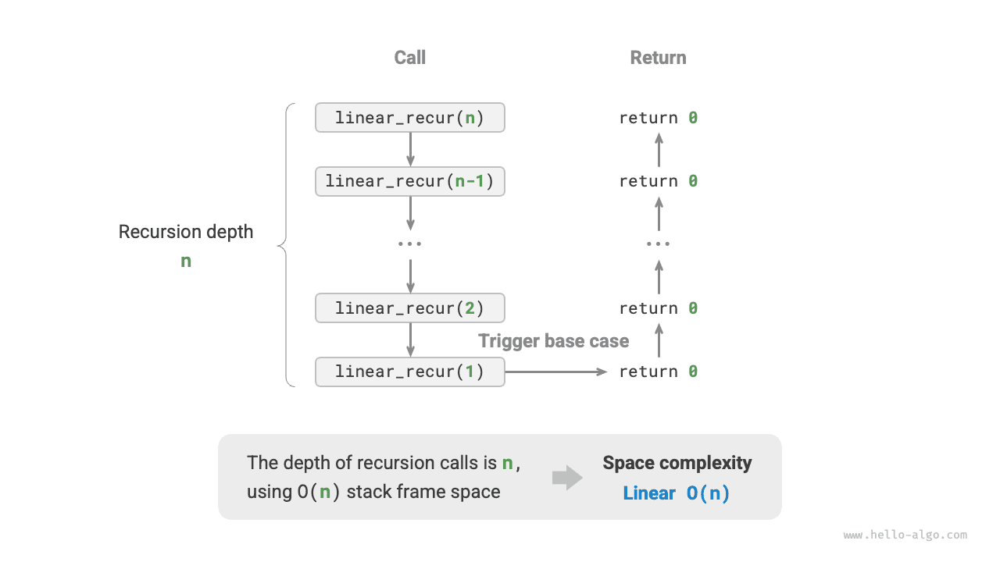

# Пространственная сложность

<u>Пространственная сложность (space complexity)</u> используется для оценки того, как меняется объем памяти, занимаемой алгоритмом, по мере роста объема данных. Это понятие очень похоже на временную сложность, только вместо "времени выполнения" мы рассматриваем "объем используемой памяти".

## Пространство, связанное с алгоритмом

Память, которую использует алгоритм во время работы, в основном включает несколько следующих частей.

- **Входное пространство**: используется для хранения входных данных алгоритма.
- **Временное пространство**: используется для хранения переменных, объектов, контекста функций и других данных, возникающих во время выполнения алгоритма.
- **Выходное пространство**: используется для хранения выходных данных алгоритма.

В общем случае при анализе пространственной сложности в расчет включают "временное пространство" и "выходное пространство".

Временное пространство можно дополнительно разделить на три части.

- **Временные данные**: используются для хранения различных констант, переменных, объектов и т.д., возникающих во время выполнения алгоритма.
- **Пространство кадров стека**: используется для хранения контекстных данных вызываемых функций. Система при каждом вызове функции создает на вершине стека новый кадр; после возврата функции пространство этого кадра освобождается.
- **Пространство инструкций**: используется для хранения скомпилированных инструкций программы и в реальном подсчете обычно не учитывается.

При анализе пространственной сложности программы **мы обычно учитываем три части: временные данные, пространство кадров стека и выходные данные**, как показано на рисунке ниже.


Соответствующий код выглядит следующим образом:

=== "Python"

    ```python title=""
    class Node:
        """Класс"""
        def __init__(self, x: int):
            self.val: int = x              # Значение узла
            self.next: Node | None = None  # Ссылка на следующий узел

    def function() -> int:
        """Функция"""
        # Выполнить некоторые операции...
        return 0

    def algorithm(n) -> int:  # Входные данные
        A = 0                 # Временные данные (константа, обычно обозначается заглавной буквой)
        b = 0                 # Временные данные (переменная)
        node = Node(0)        # Временные данные (объект)
        c = function()        # Пространство кадра стека (вызов функции)
        return A + b + c      # Выходные данные
    ```

=== "C++"

    ```cpp title=""
    /* Структура */
    struct Node {
        int val;
        Node *next;
        Node(int x) : val(x), next(nullptr) {}
    };

    /* Функция */
    int func() {
        // Выполнить некоторые операции...
        return 0;
    }

    int algorithm(int n) {        // Входные данные
        const int a = 0;          // Временные данные (константа)
        int b = 0;                // Временные данные (переменная)
        Node* node = new Node(0); // Временные данные (объект)
        int c = func();           // Пространство кадра стека (вызов функции)
        return a + b + c;         // Выходные данные
    }
    ```

=== "Java"

    ```java title=""
    /* Класс */
    class Node {
        int val;
        Node next;
        Node(int x) { val = x; }
    }
    
    /* Функция */
    int function() {
        // Выполнить некоторые операции...
        return 0;
    }
    
    int algorithm(int n) {        // Входные данные
        final int a = 0;          // Временные данные (константа)
        int b = 0;                // Временные данные (переменная)
        Node node = new Node(0);  // Временные данные (объект)
        int c = function();       // Пространство кадра стека (вызов функции)
        return a + b + c;         // Выходные данные
    }
    ```

=== "C#"

    ```csharp title=""
    /* Класс */
    class Node(int x) {
        int val = x;
        Node next;
    }

    /* Функция */
    int Function() {
        // Выполнить некоторые операции...
        return 0;
    }

    int Algorithm(int n) {        // Входные данные
        const int a = 0;          // Временные данные (константа)
        int b = 0;                // Временные данные (переменная)
        Node node = new(0);       // Временные данные (объект)
        int c = Function();       // Пространство кадра стека (вызов функции)
        return a + b + c;         // Выходные данные
    }
    ```

=== "Go"

    ```go title=""
    /* Структура */
    type node struct {
        val  int
        next *node
    }

    /* Создать структуру node */
    func newNode(val int) *node {
        return &node{val: val}
    }
    
    /* Функция */
    func function() int {
        // Выполнить некоторые операции...
        return 0
    }

    func algorithm(n int) int { // Входные данные
        const a = 0             // Временные данные (константа)
        b := 0                  // Временные данные (переменная)
        newNode(0)              // Временные данные (объект)
        c := function()         // Пространство кадра стека (вызов функции)
        return a + b + c        // Выходные данные
    }
    ```

=== "Swift"

    ```swift title=""
    /* Класс */
    class Node {
        var val: Int
        var next: Node?

        init(x: Int) {
            val = x
        }
    }

    /* Функция */
    func function() -> Int {
        // Выполнить некоторые операции...
        return 0
    }

    func algorithm(n: Int) -> Int { // Входные данные
        let a = 0             // Временные данные (константа)
        var b = 0             // Временные данные (переменная)
        let node = Node(x: 0) // Временные данные (объект)
        let c = function()    // Пространство кадра стека (вызов функции)
        return a + b + c      // Выходные данные
    }
    ```

=== "JS"

    ```javascript title=""
    /* Класс */
    class Node {
        val;
        next;
        constructor(val) {
            this.val = val === undefined ? 0 : val; // Значение узла
            this.next = null;                       // Ссылка на следующий узел
        }
    }

    /* Функция */
    function constFunc() {
        // Выполнить некоторые операции
        return 0;
    }

    function algorithm(n) {       // Входные данные
        const a = 0;              // Временные данные (константа)
        let b = 0;                // Временные данные (переменная)
        const node = new Node(0); // Временные данные (объект)
        const c = constFunc();    // Пространство кадра стека (вызов функции)
        return a + b + c;         // Выходные данные
    }
    ```

=== "TS"

    ```typescript title=""
    /* Класс */
    class Node {
        val: number;
        next: Node | null;
        constructor(val?: number) {
            this.val = val === undefined ? 0 : val; // Значение узла
            this.next = null;                       // Ссылка на следующий узел
        }
    }

    /* Функция */
    function constFunc(): number {
        // Выполнить некоторые операции
        return 0;
    }

    function algorithm(n: number): number { // Входные данные
        const a = 0;                        // Временные данные (константа)
        let b = 0;                          // Временные данные (переменная)
        const node = new Node(0);           // Временные данные (объект)
        const c = constFunc();              // Пространство кадра стека (вызов функции)
        return a + b + c;                   // Выходные данные
    }
    ```

=== "Dart"

    ```dart title=""
    /* Класс */
    class Node {
      int val;
      Node next;
      Node(this.val, [this.next]);
    }

    /* Функция */
    int function() {
      // Выполнить некоторые операции...
      return 0;
    }

    int algorithm(int n) {  // Входные данные
      const int a = 0;      // Временные данные (константа)
      int b = 0;            // Временные данные (переменная)
      Node node = Node(0);  // Временные данные (объект)
      int c = function();   // Пространство кадра стека (вызов функции)
      return a + b + c;     // Выходные данные
    }
    ```

=== "Rust"

    ```rust title=""
    use std::rc::Rc;
    use std::cell::RefCell;
    
    /* Структура */
    struct Node {
        val: i32,
        next: Option<Rc<RefCell<Node>>>,
    }

    /* Создать структуру Node */
    impl Node {
        fn new(val: i32) -> Self {
            Self { val: val, next: None }
        }
    }

    /* Функция */
    fn function() -> i32 {      
        // Выполнить некоторые операции...
        return 0;
    }

    fn algorithm(n: i32) -> i32 {       // Входные данные
        const a: i32 = 0;               // Временные данные (константа)
        let mut b = 0;                  // Временные данные (переменная)
        let node = Node::new(0);        // Временные данные (объект)
        let c = function();             // Пространство кадра стека (вызов функции)
        return a + b + c;               // Выходные данные
    }
    ```

=== "C"

    ```c title=""
    /* Функция */
    int func() {
        // Выполнить некоторые операции...
        return 0;
    }

    int algorithm(int n) { // Входные данные
        const int a = 0;   // Временные данные (константа)
        int b = 0;         // Временные данные (переменная)
        int c = func();    // Пространство кадра стека (вызов функции)
        return a + b + c;  // Выходные данные
    }
    ```

=== "Kotlin"

    ```kotlin title=""
    /* Класс */
    class Node(var _val: Int) {
        var next: Node? = null
    }

    /* Функция */
    fun function(): Int {
        // Выполнить некоторые операции...
        return 0
    }

    fun algorithm(n: Int): Int { // Входные данные
        val a = 0                // Временные данные (константа)
        var b = 0                // Временные данные (переменная)
        val node = Node(0)       // Временные данные (объект)
        val c = function()       // Пространство кадра стека (вызов функции)
        return a + b + c         // Выходные данные
    }
    ```

=== "Ruby"

    ```ruby title=""
    ### Класс ###
    class Node
        attr_accessor :val      # Значение узла
        attr_accessor :next     # Ссылка на следующий узел

        def initialize(x)
            @val = x
        end
    end

    ### Функция ###
    def function
        # Выполнить некоторые операции...
        0
    end

    ### Алгоритм ###
    def algorithm(n)        # Входные данные
        a = 0               # Временные данные (константа)
        b = 0               # Временные данные (переменная)
        node = Node.new(0)  # Временные данные (объект)
        c = function        # Пространство кадра стека (вызов функции)
        a + b + c           # Выходные данные
    end
    ```

## Метод вывода

Метод вывода пространственной сложности в целом аналогичен временному анализу: меняется только объект подсчета, с "количества операций" на "размер используемого пространства".

В отличие от временной сложности, **обычно мы рассматриваем только худшую пространственную сложность**. Это связано с тем, что память является жестким ограничением: нам нужно гарантировать, что для любых входных данных у программы будет достаточно памяти.

Рассмотрим следующий код. Слово "худшая" в "худшей пространственной сложности" имеет два значения.

1. **Ориентир на худшие входные данные**: когда $n < 10$ , пространственная сложность равна $O(1)$ ; но когда $n > 10$ , инициализированный массив `nums` занимает $O(n)$ пространства, поэтому худшая пространственная сложность равна $O(n)$ .
2. **Ориентир на пиковое потребление памяти во время выполнения алгоритма**: например, до выполнения последней строки программа занимает $O(1)$ пространства; при инициализации массива `nums` она занимает $O(n)$ пространства, поэтому худшая пространственная сложность равна $O(n)$ .

=== "Python"

    ```python title=""
    def algorithm(n: int):
        a = 0               # O(1)
        b = [0] * 10000     # O(1)
        if n > 10:
            nums = [0] * n  # O(n)
    ```

=== "C++"

    ```cpp title=""
    void algorithm(int n) {
        int a = 0;               // O(1)
        vector<int> b(10000);    // O(1)
        if (n > 10)
            vector<int> nums(n); // O(n)
    }
    ```

=== "Java"

    ```java title=""
    void algorithm(int n) {
        int a = 0;                   // O(1)
        int[] b = new int[10000];    // O(1)
        if (n > 10)
            int[] nums = new int[n]; // O(n)
    }
    ```

=== "C#"

    ```csharp title=""
    void Algorithm(int n) {
        int a = 0;                   // O(1)
        int[] b = new int[10000];    // O(1)
        if (n > 10) {
            int[] nums = new int[n]; // O(n)
        }
    }
    ```

=== "Go"

    ```go title=""
    func algorithm(n int) {
        a := 0                      // O(1)
        b := make([]int, 10000)     // O(1)
        var nums []int
        if n > 10 {
            nums := make([]int, n)  // O(n)
        }
        fmt.Println(a, b, nums)
    }
    ```

=== "Swift"

    ```swift title=""
    func algorithm(n: Int) {
        let a = 0 // O(1)
        let b = Array(repeating: 0, count: 10000) // O(1)
        if n > 10 {
            let nums = Array(repeating: 0, count: n) // O(n)
        }
    }
    ```

=== "JS"

    ```javascript title=""
    function algorithm(n) {
        const a = 0;                   // O(1)
        const b = new Array(10000);    // O(1)
        if (n > 10) {
            const nums = new Array(n); // O(n)
        }
    }
    ```

=== "TS"

    ```typescript title=""
    function algorithm(n: number): void {
        const a = 0;                   // O(1)
        const b = new Array(10000);    // O(1)
        if (n > 10) {
            const nums = new Array(n); // O(n)
        }
    }
    ```

=== "Dart"

    ```dart title=""
    void algorithm(int n) {
      int a = 0;                            // O(1)
      List<int> b = List.filled(10000, 0);  // O(1)
      if (n > 10) {
        List<int> nums = List.filled(n, 0); // O(n)
      }
    }
    ```

=== "Rust"

    ```rust title=""
    fn algorithm(n: i32) {
        let a = 0;                              // O(1)
        let b = [0; 10000];                     // O(1)
        if n > 10 {
            let nums = vec![0; n as usize];     // O(n)
        }
    }
    ```

=== "C"

    ```c title=""
    void algorithm(int n) {
        int a = 0;               // O(1)
        int b[10000];            // O(1)
        if (n > 10)
            int nums[n] = {0};   // O(n)
    }
    ```

=== "Kotlin"

    ```kotlin title=""
    fun algorithm(n: Int) {
        val a = 0                    // O(1)
        val b = IntArray(10000)      // O(1)
        if (n > 10) {
            val nums = IntArray(n)   // O(n)
        }
    }
    ```

=== "Ruby"

    ```ruby title=""
    def algorithm(n)
        a = 0                           # O(1)
        b = Array.new(10000)            # O(1)
        nums = Array.new(n) if n > 10   # O(n)
    end
    ```

**В рекурсивных функциях необходимо учитывать пространство кадров стека**. Рассмотрим следующий код:

=== "Python"

    ```python title=""
    def function() -> int:
        # Выполнить некоторые операции
        return 0

    def loop(n: int):
        """Пространственная сложность цикла равна O(1)"""
        for _ in range(n):
            function()

    def recur(n: int):
        """Пространственная сложность рекурсии равна O(n)"""
        if n == 1:
            return
        return recur(n - 1)
    ```

=== "C++"

    ```cpp title=""
    int func() {
        // Выполнить некоторые операции
        return 0;
    }
    /* Пространственная сложность цикла равна O(1) */
    void loop(int n) {
        for (int i = 0; i < n; i++) {
            func();
        }
    }
    /* Пространственная сложность рекурсии равна O(n) */
    void recur(int n) {
        if (n == 1) return;
        recur(n - 1);
    }
    ```

=== "Java"

    ```java title=""
    int function() {
        // Выполнить некоторые операции
        return 0;
    }
    /* Пространственная сложность цикла равна O(1) */
    void loop(int n) {
        for (int i = 0; i < n; i++) {
            function();
        }
    }
    /* Пространственная сложность рекурсии равна O(n) */
    void recur(int n) {
        if (n == 1) return;
        recur(n - 1);
    }
    ```

=== "C#"

    ```csharp title=""
    int Function() {
        // Выполнить некоторые операции
        return 0;
    }
    /* Пространственная сложность цикла равна O(1) */
    void Loop(int n) {
        for (int i = 0; i < n; i++) {
            Function();
        }
    }
    /* Пространственная сложность рекурсии равна O(n) */
    int Recur(int n) {
        if (n == 1) return 1;
        return Recur(n - 1);
    }
    ```

=== "Go"

    ```go title=""
    func function() int {
        // Выполнить некоторые операции
        return 0
    }
    
    /* Пространственная сложность цикла равна O(1) */
    func loop(n int) {
        for i := 0; i < n; i++ {
            function()
        }
    }
    
    /* Пространственная сложность рекурсии равна O(n) */
    func recur(n int) {
        if n == 1 {
            return
        }
        recur(n - 1)
    }
    ```

=== "Swift"

    ```swift title=""
    @discardableResult
    func function() -> Int {
        // Выполнить некоторые операции
        return 0
    }

    /* Пространственная сложность цикла равна O(1) */
    func loop(n: Int) {
        for _ in 0 ..< n {
            function()
        }
    }

    /* Пространственная сложность рекурсии равна O(n) */
    func recur(n: Int) {
        if n == 1 {
            return
        }
        recur(n: n - 1)
    }
    ```

=== "JS"

    ```javascript title=""
    function constFunc() {
        // Выполнить некоторые операции
        return 0;
    }
    /* Пространственная сложность цикла равна O(1) */
    function loop(n) {
        for (let i = 0; i < n; i++) {
            constFunc();
        }
    }
    /* Пространственная сложность рекурсии равна O(n) */
    function recur(n) {
        if (n === 1) return;
        return recur(n - 1);
    }
    ```

=== "TS"

    ```typescript title=""
    function constFunc(): number {
        // Выполнить некоторые операции
        return 0;
    }
    /* Пространственная сложность цикла равна O(1) */
    function loop(n: number): void {
        for (let i = 0; i < n; i++) {
            constFunc();
        }
    }
    /* Пространственная сложность рекурсии равна O(n) */
    function recur(n: number): void {
        if (n === 1) return;
        return recur(n - 1);
    }
    ```

=== "Dart"

    ```dart title=""
    int function() {
      // Выполнить некоторые операции
      return 0;
    }
    /* Пространственная сложность цикла равна O(1) */
    void loop(int n) {
      for (int i = 0; i < n; i++) {
        function();
      }
    }
    /* Пространственная сложность рекурсии равна O(n) */
    void recur(int n) {
      if (n == 1) return;
      recur(n - 1);
    }
    ```

=== "Rust"

    ```rust title=""
    fn function() -> i32 {
        // Выполнить некоторые операции
        return 0;
    }
    /* Пространственная сложность цикла равна O(1) */
    fn loop(n: i32) {
        for i in 0..n {
            function();
        }
    }
    /* Пространственная сложность рекурсии равна O(n) */
    fn recur(n: i32) {
        if n == 1 {
            return;
        }
        recur(n - 1);
    }
    ```

=== "C"

    ```c title=""
    int func() {
        // Выполнить некоторые операции
        return 0;
    }
    /* Пространственная сложность цикла равна O(1) */
    void loop(int n) {
        for (int i = 0; i < n; i++) {
            func();
        }
    }
    /* Пространственная сложность рекурсии равна O(n) */
    void recur(int n) {
        if (n == 1) return;
        recur(n - 1);
    }
    ```

=== "Kotlin"

    ```kotlin title=""
    fun function(): Int {
        // Выполнить некоторые операции
        return 0
    }
    /* Пространственная сложность цикла равна O(1) */
    fun loop(n: Int) {
        for (i in 0..<n) {
            function()
        }
    }
    /* Пространственная сложность рекурсии равна O(n) */
    fun recur(n: Int) {
        if (n == 1) return
        return recur(n - 1)
    }
    ```

=== "Ruby"

    ```ruby title=""
    def function
        # Выполнить некоторые операции
        0
    end

    ### Пространственная сложность цикла равна O(1) ###
    def loop(n)
        (0...n).each { function }
    end

    ### Пространственная сложность рекурсии равна O(n) ###
    def recur(n)
        return if n == 1
        recur(n - 1)
    end
    ```

Функции `loop()` и `recur()` имеют временную сложность $O(n)$ , но их пространственная сложность различается.

- Функция `loop()` вызывает `function()` в цикле $n$ раз; на каждой итерации `function()` возвращается и освобождает пространство своего кадра стека, поэтому пространственная сложность по-прежнему равна $O(1)$ .
- Рекурсивная функция `recur()` во время выполнения одновременно содержит $n$ еще не завершившихся экземпляров `recur()` , поэтому занимает $O(n)$ пространства кадров стека.

## Распространенные типы

Пусть размер входных данных равен $n$ . На рисунке ниже показаны распространенные типы пространственной сложности (в порядке от меньшей к большей).

$$
\begin{aligned}
O(1) < O(\log n) < O(n) < O(n^2) < O(2^n) \newline
\text{Постоянная} < \text{Логарифмическая} < \text{Линейная} < \text{Квадратичная} < \text{Экспоненциальная}
\end{aligned}
$$


### Постоянная сложность $O(1)$

Постоянная сложность часто встречается у констант, переменных и объектов, количество которых не зависит от размера входных данных $n$ .

Следует заметить, что память, занятая инициализацией переменных или вызовом функций внутри цикла, освобождается при переходе к следующей итерации, поэтому она не накапливается, и пространственная сложность по-прежнему остается $O(1)$ :

```src
[file]{space_complexity}-[class]{}-[func]{constant}
```

### Линейная сложность $O(n)$

Линейная сложность часто встречается у массивов, связных списков, стеков, очередей и других структур, число элементов в которых пропорционально $n$ :

```src
[file]{space_complexity}-[class]{}-[func]{linear}
```

Как показано на рисунке ниже, глубина рекурсии этой функции равна $n$ , то есть одновременно существует $n$ еще не завершившихся функций `linear_recur()` , которые используют $O(n)$ пространства кадров стека:

```src
[file]{space_complexity}-[class]{}-[func]{linear_recur}
```



### Квадратичная сложность $O(n^2)$

Квадратичная сложность часто встречается у матриц и графов, где число элементов связано с $n$ квадратичной зависимостью:

```src
[file]{space_complexity}-[class]{}-[func]{quadratic}
```

Как показано на рисунке ниже, глубина рекурсии этой функции равна $n$ , и в каждой рекурсивной функции инициализируется массив длины $n$ , $n-1$ , $\dots$ , $2$ , $1$ ; его средняя длина равна $n / 2$ , поэтому в сумме используется $O(n^2)$ пространства:

```src
[file]{space_complexity}-[class]{}-[func]{quadratic_recur}
```


### Экспоненциальная сложность $O(2^n)$

Экспоненциальная сложность часто встречается у бинарных деревьев. Обрати внимание на рисунок ниже: "полное бинарное дерево" с $n$ уровнями содержит $2^n - 1$ узлов и занимает $O(2^n)$ пространства:

```src
[file]{space_complexity}-[class]{}-[func]{build_tree}
```


### Логарифмическая сложность $O(\log n)$

Логарифмическая сложность часто встречается в алгоритмах "разделяй и властвуй". Например, при сортировке слиянием входной массив длины $n$ на каждом шаге рекурсии делится пополам по середине, образуя рекурсивное дерево высоты $\log n$ и используя $O(\log n)$ пространства кадров стека.

Еще один пример - преобразование числа в строку. Если задано положительное целое число $n$ , то количество его цифр равно $\lfloor \log_{10} n \rfloor + 1$ , то есть длина соответствующей строки тоже равна $\lfloor \log_{10} n \rfloor + 1$ , следовательно, пространственная сложность составляет $O(\log_{10} n + 1) = O(\log n)$ .

## Компромисс между временем и пространством

В идеале нам хотелось бы, чтобы и временная, и пространственная сложность алгоритма были оптимальными. Однако на практике одновременно оптимизировать и время, и память обычно очень трудно.

**Снижение временной сложности обычно достигается ценой увеличения пространственной сложности, и наоборот**. Подход, при котором мы жертвуем памятью ради ускорения работы алгоритма, называется "обмен пространства на время"; обратный подход называется "обмен времени на пространство".

Выбор между этими двумя идеями зависит от того, что для нас важнее. В большинстве случаев время ценнее памяти, поэтому стратегия "обмена пространства на время" используется чаще. Но при очень больших объемах данных контроль пространственной сложности тоже становится крайне важным.
