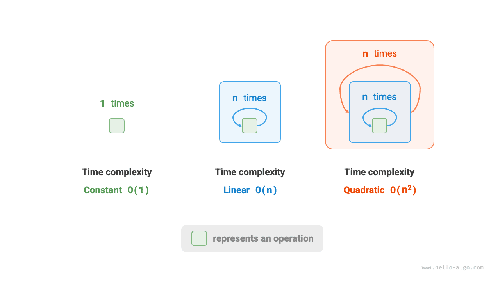
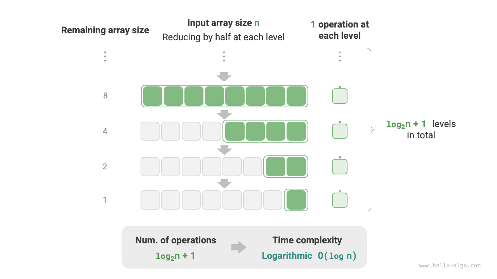

# Временная сложность

Время выполнения может наглядно и точно отражать эффективность алгоритма. Если мы хотим точно оценить время работы некоторого фрагмента кода, как это сделать?

1. **Определить платформу выполнения**, включая конфигурацию оборудования, язык программирования, системную среду и т.д., поскольку все эти факторы влияют на эффективность выполнения кода.
2. **Оценить время выполнения различных вычислительных операций**, например операция сложения `+` требует 1 нс , операция умножения `*` требует 10 нс , операция вывода `print()` требует 5 нс и т.д.
3. **Подсчитать все вычислительные операции в коде** и суммировать время выполнения всех операций, чтобы получить общее время работы.

Например, в следующем коде размер входных данных равен $n$ :

=== "Python"

    ```python title=""
    # На некоторой платформе выполнения
    def algorithm(n: int):
        a = 2      # 1 нс
        a = a + 1  # 1 нс
        a = a * 2  # 10 нс
        # Цикл выполняется n раз
        for _ in range(n):  # 1 нс
            print(0)        # 5 нс
    ```

=== "C++"

    ```cpp title=""
    // На некоторой платформе выполнения
    void algorithm(int n) {
        int a = 2;  // 1 нс
        a = a + 1;  // 1 нс
        a = a * 2;  // 10 нс
        // Цикл выполняется n раз
        for (int i = 0; i < n; i++) {  // 1 нс
            cout << 0 << endl;         // 5 нс
        }
    }
    ```

=== "Java"

    ```java title=""
    // На некоторой платформе выполнения
    void algorithm(int n) {
        int a = 2;  // 1 нс
        a = a + 1;  // 1 нс
        a = a * 2;  // 10 нс
        // Цикл выполняется n раз
        for (int i = 0; i < n; i++) {  // 1 нс
            System.out.println(0);     // 5 нс
        }
    }
    ```

=== "C#"

    ```csharp title=""
    // На некоторой платформе выполнения
    void Algorithm(int n) {
        int a = 2;  // 1 нс
        a = a + 1;  // 1 нс
        a = a * 2;  // 10 нс
        // Цикл выполняется n раз
        for (int i = 0; i < n; i++) {  // 1 нс
            Console.WriteLine(0);      // 5 нс
        }
    }
    ```

=== "Go"

    ```go title=""
    // На некоторой платформе выполнения
    func algorithm(n int) {
        a := 2     // 1 нс
        a = a + 1  // 1 нс
        a = a * 2  // 10 нс
        // Цикл выполняется n раз
        for i := 0; i < n; i++ {  // 1 нс
            fmt.Println(a)        // 5 нс
        }
    }
    ```

=== "Swift"

    ```swift title=""
    // На некоторой платформе выполнения
    func algorithm(n: Int) {
        var a = 2 // 1 нс
        a = a + 1 // 1 нс
        a = a * 2 // 10 нс
        // Цикл выполняется n раз
        for _ in 0 ..< n { // 1 нс
            print(0) // 5 нс
        }
    }
    ```

=== "JS"

    ```javascript title=""
    // На некоторой платформе выполнения
    function algorithm(n) {
        var a = 2; // 1 нс
        a = a + 1; // 1 нс
        a = a * 2; // 10 нс
        // Цикл выполняется n раз
        for(let i = 0; i < n; i++) { // 1 нс
            console.log(0); // 5 нс
        }
    }
    ```

=== "TS"

    ```typescript title=""
    // На некоторой платформе выполнения
    function algorithm(n: number): void {
        var a: number = 2; // 1 нс
        a = a + 1; // 1 нс
        a = a * 2; // 10 нс
        // Цикл выполняется n раз
        for(let i = 0; i < n; i++) { // 1 нс
            console.log(0); // 5 нс
        }
    }
    ```

=== "Dart"

    ```dart title=""
    // На некоторой платформе выполнения
    void algorithm(int n) {
      int a = 2; // 1 нс
      a = a + 1; // 1 нс
      a = a * 2; // 10 нс
      // Цикл выполняется n раз
      for (int i = 0; i < n; i++) { // 1 нс
        print(0); // 5 нс
      }
    }
    ```

=== "Rust"

    ```rust title=""
    // На некоторой платформе выполнения
    fn algorithm(n: i32) {
        let mut a = 2;      // 1 нс
        a = a + 1;          // 1 нс
        a = a * 2;          // 10 нс
        // Цикл выполняется n раз
        for _ in 0..n {     // 1 нс
            println!("{}", 0);  // 5 нс
        }
    }
    ```

=== "C"

    ```c title=""
    // На некоторой платформе выполнения
    void algorithm(int n) {
        int a = 2;  // 1 нс
        a = a + 1;  // 1 нс
        a = a * 2;  // 10 нс
        // Цикл выполняется n раз
        for (int i = 0; i < n; i++) {   // 1 нс
            printf("%d", 0);            // 5 нс
        }
    }
    ```

=== "Kotlin"

    ```kotlin title=""
    // На некоторой платформе выполнения
    fun algorithm(n: Int) {
        var a = 2 // 1 нс
        a = a + 1 // 1 нс
        a = a * 2 // 10 нс
        // Цикл выполняется n раз
        for (i in 0..<n) {  // 1 нс
            println(0)      // 5 нс
        }
    }
    ```

=== "Ruby"

    ```ruby title=""
    # На некоторой платформе выполнения
    def algorithm(n)
        a = 2       # 1 нс
        a = a + 1   # 1 нс
        a = a * 2   # 10 нс
        # Цикл выполняется n раз
        (0...n).each do # 1 нс
            puts 0      # 5 нс
        end
    end
    ```

Согласно приведенному выше методу, время работы алгоритма равно $(6n + 12)$ нс :

$$
1 + 1 + 10 + (1 + 5) \times n = 6n + 12
$$

Но на практике **подсчитывать реальное время выполнения алгоритма и неразумно, и нереалистично**. Во-первых, мы не хотим привязывать оценку времени к конкретной платформе, потому что алгоритм должен запускаться на самых разных платформах. Во-вторых, нам трудно узнать время выполнения каждого типа операций, а это сильно усложняет оценку.

## Подсчет тенденции роста времени

Анализ временной сложности оценивает не само время выполнения алгоритма, **а тенденцию роста этого времени по мере увеличения объема данных**.

Понятие "тенденции роста времени" довольно абстрактно, поэтому разберем его на примере. Предположим, размер входных данных равен $n$ , и даны три алгоритма `A` , `B` и `C` :

=== "Python"

    ```python title=""
    # Временная сложность алгоритма A: постоянная
    def algorithm_A(n: int):
        print(0)
    # Временная сложность алгоритма B: линейная
    def algorithm_B(n: int):
        for _ in range(n):
            print(0)
    # Временная сложность алгоритма C: постоянная
    def algorithm_C(n: int):
        for _ in range(1000000):
            print(0)
    ```

=== "C++"

    ```cpp title=""
    // Временная сложность алгоритма A: постоянная
    void algorithm_A(int n) {
        cout << 0 << endl;
    }
    // Временная сложность алгоритма B: линейная
    void algorithm_B(int n) {
        for (int i = 0; i < n; i++) {
            cout << 0 << endl;
        }
    }
    // Временная сложность алгоритма C: постоянная
    void algorithm_C(int n) {
        for (int i = 0; i < 1000000; i++) {
            cout << 0 << endl;
        }
    }
    ```

=== "Java"

    ```java title=""
    // Временная сложность алгоритма A: постоянная
    void algorithm_A(int n) {
        System.out.println(0);
    }
    // Временная сложность алгоритма B: линейная
    void algorithm_B(int n) {
        for (int i = 0; i < n; i++) {
            System.out.println(0);
        }
    }
    // Временная сложность алгоритма C: постоянная
    void algorithm_C(int n) {
        for (int i = 0; i < 1000000; i++) {
            System.out.println(0);
        }
    }
    ```

=== "C#"

    ```csharp title=""
    // Временная сложность алгоритма A: постоянная
    void AlgorithmA(int n) {
        Console.WriteLine(0);
    }
    // Временная сложность алгоритма B: линейная
    void AlgorithmB(int n) {
        for (int i = 0; i < n; i++) {
            Console.WriteLine(0);
        }
    }
    // Временная сложность алгоритма C: постоянная
    void AlgorithmC(int n) {
        for (int i = 0; i < 1000000; i++) {
            Console.WriteLine(0);
        }
    }
    ```

=== "Go"

    ```go title=""
    // Временная сложность алгоритма A: постоянная
    func algorithm_A(n int) {
        fmt.Println(0)
    }
    // Временная сложность алгоритма B: линейная
    func algorithm_B(n int) {
        for i := 0; i < n; i++ {
            fmt.Println(0)
        }
    }
    // Временная сложность алгоритма C: постоянная
    func algorithm_C(n int) {
        for i := 0; i < 1000000; i++ {
            fmt.Println(0)
        }
    }
    ```

=== "Swift"

    ```swift title=""
    // Временная сложность алгоритма A: постоянная
    func algorithmA(n: Int) {
        print(0)
    }

    // Временная сложность алгоритма B: линейная
    func algorithmB(n: Int) {
        for _ in 0 ..< n {
            print(0)
        }
    }

    // Временная сложность алгоритма C: постоянная
    func algorithmC(n: Int) {
        for _ in 0 ..< 1_000_000 {
            print(0)
        }
    }
    ```

=== "JS"

    ```javascript title=""
    // Временная сложность алгоритма A: постоянная
    function algorithm_A(n) {
        console.log(0);
    }
    // Временная сложность алгоритма B: линейная
    function algorithm_B(n) {
        for (let i = 0; i < n; i++) {
            console.log(0);
        }
    }
    // Временная сложность алгоритма C: постоянная
    function algorithm_C(n) {
        for (let i = 0; i < 1000000; i++) {
            console.log(0);
        }
    }

    ```

=== "TS"

    ```typescript title=""
    // Временная сложность алгоритма A: постоянная
    function algorithm_A(n: number): void {
        console.log(0);
    }
    // Временная сложность алгоритма B: линейная
    function algorithm_B(n: number): void {
        for (let i = 0; i < n; i++) {
            console.log(0);
        }
    }
    // Временная сложность алгоритма C: постоянная
    function algorithm_C(n: number): void {
        for (let i = 0; i < 1000000; i++) {
            console.log(0);
        }
    }
    ```

=== "Dart"

    ```dart title=""
    // Временная сложность алгоритма A: постоянная
    void algorithmA(int n) {
      print(0);
    }
    // Временная сложность алгоритма B: линейная
    void algorithmB(int n) {
      for (int i = 0; i < n; i++) {
        print(0);
      }
    }
    // Временная сложность алгоритма C: постоянная
    void algorithmC(int n) {
      for (int i = 0; i < 1000000; i++) {
        print(0);
      }
    }
    ```

=== "Rust"

    ```rust title=""
    // Временная сложность алгоритма A: постоянная
    fn algorithm_A(n: i32) {
        println!("{}", 0);
    }
    // Временная сложность алгоритма B: линейная
    fn algorithm_B(n: i32) {
        for _ in 0..n {
            println!("{}", 0);
        }
    }
    // Временная сложность алгоритма C: постоянная
    fn algorithm_C(n: i32) {
        for _ in 0..1000000 {
            println!("{}", 0);
        }
    }
    ```

=== "C"

    ```c title=""
    // Временная сложность алгоритма A: постоянная
    void algorithm_A(int n) {
        printf("%d", 0);
    }
    // Временная сложность алгоритма B: линейная
    void algorithm_B(int n) {
        for (int i = 0; i < n; i++) {
            printf("%d", 0);
        }
    }
    // Временная сложность алгоритма C: постоянная
    void algorithm_C(int n) {
        for (int i = 0; i < 1000000; i++) {
            printf("%d", 0);
        }
    }
    ```

=== "Kotlin"

    ```kotlin title=""
    // Временная сложность алгоритма A: постоянная
    fun algoritm_A(n: Int) {
        println(0)
    }
    // Временная сложность алгоритма B: линейная
    fun algorithm_B(n: Int) {
        for (i in 0..<n){
            println(0)
        }
    }
    // Временная сложность алгоритма C: постоянная
    fun algorithm_C(n: Int) {
        for (i in 0..<1000000) {
            println(0)
        }
    }
    ```

=== "Ruby"

    ```ruby title=""
    # Временная сложность алгоритма A: постоянная
    def algorithm_A(n)
        puts 0
    end

    # Временная сложность алгоритма B: линейная
    def algorithm_B(n)
        (0...n).each { puts 0 }
    end

    # Временная сложность алгоритма C: постоянная
    def algorithm_C(n)
        (0...1_000_000).each { puts 0 }
    end
    ```

На рисунке ниже показана временная сложность трех функций алгоритмов выше.

- У алгоритма `A` есть только 1 операция вывода, и время его работы не растет с увеличением $n$ . Мы называем такую временную сложность "постоянной".
- В алгоритме `B` операция вывода выполняется в цикле $n$ раз, поэтому время работы растет линейно по мере увеличения $n$ . Такая временная сложность называется "линейной".
- В алгоритме `C` операция вывода выполняется $1000000$ раз; хотя время работы велико, оно не зависит от размера входных данных $n$ . Поэтому временная сложность `C` такая же, как у `A` , и тоже является "постоянной".


Какие особенности имеет анализ временной сложности по сравнению с непосредственным измерением времени работы алгоритма?

- **Временная сложность позволяет эффективно оценивать эффективность алгоритма**. Например, время работы алгоритма `B` растет линейно: при $n > 1$ он медленнее алгоритма `A` , а при $n > 1000000$ медленнее алгоритма `C` . На самом деле, если размер входных данных $n$ достаточно велик, алгоритм с "постоянной" сложностью обязательно лучше алгоритма с "линейной" сложностью. В этом и состоит смысл тенденции роста времени.
- **Метод вывода временной сложности проще**. Очевидно, что платформа выполнения и тип вычислительных операций не влияют на тенденцию роста времени работы алгоритма. Поэтому в анализе временной сложности мы можем считать время выполнения всех вычислительных операций одинаковым "единичным временем" и тем самым упростить "подсчет времени выполнения операций" до "подсчета количества операций", что существенно снижает сложность оценки.
- **У временной сложности есть и определенные ограничения**. Например, хотя временная сложность алгоритмов `A` и `C` одинакова, их реальное время выполнения сильно различается. Точно так же, хотя временная сложность `B` выше, чем у `C` , при малых $n$ алгоритм `B` явно лучше `C` . В таких случаях нам часто трудно судить об эффективности алгоритма, опираясь только на временную сложность. Тем не менее, несмотря на эти ограничения, анализ сложности все равно остается самым эффективным и самым распространенным способом оценки алгоритмов.

## Асимптотическая верхняя граница функции

Для функции с входным размером $n$ :

=== "Python"

    ```python title=""
    def algorithm(n: int):
        a = 1      # +1
        a = a + 1  # +1
        a = a * 2  # +1
        # Цикл выполняется n раз
        for i in range(n):  # +1
            print(0)        # +1
    ```

=== "C++"

    ```cpp title=""
    void algorithm(int n) {
        int a = 1;  // +1
        a = a + 1;  // +1
        a = a * 2;  // +1
        // Цикл выполняется n раз
        for (int i = 0; i < n; i++) { // +1 (каждый раз выполняется i ++)
            cout << 0 << endl;    // +1
        }
    }
    ```

=== "Java"

    ```java title=""
    void algorithm(int n) {
        int a = 1;  // +1
        a = a + 1;  // +1
        a = a * 2;  // +1
        // Цикл выполняется n раз
        for (int i = 0; i < n; i++) { // +1 (каждый раз выполняется i ++)
            System.out.println(0);    // +1
        }
    }
    ```

=== "C#"

    ```csharp title=""
    void Algorithm(int n) {
        int a = 1;  // +1
        a = a + 1;  // +1
        a = a * 2;  // +1
        // Цикл выполняется n раз
        for (int i = 0; i < n; i++) {   // +1 (каждый раз выполняется i ++)
            Console.WriteLine(0);   // +1
        }
    }
    ```

=== "Go"

    ```go title=""
    func algorithm(n int) {
        a := 1      // +1
        a = a + 1   // +1
        a = a * 2   // +1
        // Цикл выполняется n раз
        for i := 0; i < n; i++ {   // +1
            fmt.Println(a)         // +1
        }
    }
    ```

=== "Swift"

    ```swift title=""
    func algorithm(n: Int) {
        var a = 1 // +1
        a = a + 1 // +1
        a = a * 2 // +1
        // Цикл выполняется n раз
        for _ in 0 ..< n { // +1
            print(0) // +1
        }
    }
    ```

=== "JS"

    ```javascript title=""
    function algorithm(n) {
        var a = 1; // +1
        a += 1; // +1
        a *= 2; // +1
        // Цикл выполняется n раз
        for(let i = 0; i < n; i++){ // +1 (каждый раз выполняется i ++)
            console.log(0); // +1
        }
    }
    ```

=== "TS"

    ```typescript title=""
    function algorithm(n: number): void{
        var a: number = 1; // +1
        a += 1; // +1
        a *= 2; // +1
        // Цикл выполняется n раз
        for(let i = 0; i < n; i++){ // +1 (каждый раз выполняется i ++)
            console.log(0); // +1
        }
    }
    ```

=== "Dart"

    ```dart title=""
    void algorithm(int n) {
      int a = 1; // +1
      a = a + 1; // +1
      a = a * 2; // +1
      // Цикл выполняется n раз
      for (int i = 0; i < n; i++) { // +1 (каждый раз выполняется i ++)
        print(0); // +1
      }
    }
    ```

=== "Rust"

    ```rust title=""
    fn algorithm(n: i32) {
        let mut a = 1;   // +1
        a = a + 1;      // +1
        a = a * 2;      // +1

        // Цикл выполняется n раз
        for _ in 0..n { // +1 (каждый раз выполняется i ++)
            println!("{}", 0); // +1
        }
    }
    ```

=== "C"

    ```c title=""
    void algorithm(int n) {
        int a = 1;  // +1
        a = a + 1;  // +1
        a = a * 2;  // +1
        // Цикл выполняется n раз
        for (int i = 0; i < n; i++) {   // +1 (каждый раз выполняется i ++)
            printf("%d", 0);            // +1
        }
    }
    ```

=== "Kotlin"

    ```kotlin title=""
    fun algorithm(n: Int) {
        var a = 1 // +1
        a = a + 1 // +1
        a = a * 2 // +1
        // Цикл выполняется n раз
        for (i in 0..<n) { // +1 (каждый раз выполняется i ++)
            println(0) // +1
        }
    }
    ```

=== "Ruby"

    ```ruby title=""
    def algorithm(n)
        a = 1       # +1
        a = a + 1   # +1
        a = a * 2   # +1
        # Цикл выполняется n раз
        (0...n).each do # +1
            puts 0      # +1
        end
    end
    ```

Пусть количество операций алгоритма является функцией от размера входных данных $n$ и обозначается как $T(n)$ ; тогда для приведенной выше функции число операций равно:

$$
T(n) = 3 + 2n
$$

$T(n)$ - линейная функция, а это означает, что тенденция роста времени работы линейна, следовательно, ее временная сложность является линейной.

Линейную временную сложность мы записываем как $O(n)$ ; этот математический символ называется <u>нотацией Big $O$ (big-$O$ notation)</u> и обозначает <u>асимптотическую верхнюю границу (asymptotic upper bound)</u> функции $T(n)$ .

По сути анализ временной сложности - это вычисление асимптотической верхней границы "количества операций $T(n)$", и у него есть строгое математическое определение.

!!! note "Асимптотическая верхняя граница функции"

    Если существуют положительное действительное число $c$ и действительное число $n_0$ , такие что для всех $n > n_0$ выполняется $T(n) \leq c \cdot f(n)$ , то можно считать, что $f(n)$ задает асимптотическую верхнюю границу для $T(n)$ ; это записывается как $T(n) = O(f(n))$ .

Как показано на рисунке ниже, вычислить асимптотическую верхнюю границу - значит найти такую функцию $f(n)$ , что при стремлении $n$ к бесконечности функции $T(n)$ и $f(n)$ имеют один и тот же порядок роста и отличаются только постоянным коэффициентом $c$.


## Метод вывода

Математическое определение асимптотической верхней границы выглядит довольно формально, и если ты понял его не до конца, переживать не стоит. Сначала можно освоить сам метод вывода, а в процессе дальнейшей практики постепенно почувствовать его математический смысл.

Согласно определению, после того как мы определили $f(n)$ , мы можем получить временную сложность $O(f(n))$ . Но как определить саму асимптотическую верхнюю границу $f(n)$ ? В целом процесс состоит из двух шагов: сначала подсчитать количество операций, затем определить асимптотическую верхнюю границу.

### Шаг 1: подсчет количества операций

Для кода это можно делать построчно сверху вниз. Однако, поскольку в выражении $c \cdot f(n)$ выше постоянный коэффициент $c$ может быть сколь угодно большим, **различные коэффициенты и постоянные члены в числе операций $T(n)$ можно игнорировать**. Исходя из этого принципа, можно сформулировать следующие упрощающие приемы подсчета.

1. **Игнорировать константы в $T(n)$**. Они не зависят от $n$ , а значит не влияют на временную сложность.
2. **Опускать все коэффициенты**. Например, циклы на $2n$ раз или $5n + 1$ раз можно упростить до $n$ раз, потому что коэффициент перед $n$ не влияет на временную сложность.
3. **При вложенных циклах использовать умножение**. Общее число операций равно произведению числа операций внешнего и внутреннего циклов; при этом для каждого уровня цикла по-прежнему можно применять приемы из пунктов `1.` и `2.` .

Для заданной функции мы можем использовать перечисленные выше приемы и подсчитать число операций:

=== "Python"

    ```python title=""
    def algorithm(n: int):
        a = 1      # +0 (прием 1)
        a = a + n  # +0 (прием 1)
        # +n (прием 2)
        for i in range(5 * n + 1):
            print(0)
        # +n*n (прием 3)
        for i in range(2 * n):
            for j in range(n + 1):
                print(0)
    ```

=== "C++"

    ```cpp title=""
    void algorithm(int n) {
        int a = 1;  // +0 (прием 1)
        a = a + n;  // +0 (прием 1)
        // +n (прием 2)
        for (int i = 0; i < 5 * n + 1; i++) {
            cout << 0 << endl;
        }
        // +n*n (прием 3)
        for (int i = 0; i < 2 * n; i++) {
            for (int j = 0; j < n + 1; j++) {
                cout << 0 << endl;
            }
        }
    }
    ```

=== "Java"

    ```java title=""
    void algorithm(int n) {
        int a = 1;  // +0 (прием 1)
        a = a + n;  // +0 (прием 1)
        // +n (прием 2)
        for (int i = 0; i < 5 * n + 1; i++) {
            System.out.println(0);
        }
        // +n*n (прием 3)
        for (int i = 0; i < 2 * n; i++) {
            for (int j = 0; j < n + 1; j++) {
                System.out.println(0);
            }
        }
    }
    ```

=== "C#"

    ```csharp title=""
    void Algorithm(int n) {
        int a = 1;  // +0 (прием 1)
        a = a + n;  // +0 (прием 1)
        // +n (прием 2)
        for (int i = 0; i < 5 * n + 1; i++) {
            Console.WriteLine(0);
        }
        // +n*n (прием 3)
        for (int i = 0; i < 2 * n; i++) {
            for (int j = 0; j < n + 1; j++) {
                Console.WriteLine(0);
            }
        }
    }
    ```

=== "Go"

    ```go title=""
    func algorithm(n int) {
        a := 1     // +0 (прием 1)
        a = a + n  // +0 (прием 1)
        // +n (прием 2)
        for i := 0; i < 5 * n + 1; i++ {
            fmt.Println(0)
        }
        // +n*n (прием 3)
        for i := 0; i < 2 * n; i++ {
            for j := 0; j < n + 1; j++ {
                fmt.Println(0)
            }
        }
    }
    ```

=== "Swift"

    ```swift title=""
    func algorithm(n: Int) {
        var a = 1 // +0 (прием 1)
        a = a + n // +0 (прием 1)
        // +n (прием 2)
        for _ in 0 ..< (5 * n + 1) {
            print(0)
        }
        // +n*n (прием 3)
        for _ in 0 ..< (2 * n) {
            for _ in 0 ..< (n + 1) {
                print(0)
            }
        }
    }
    ```

=== "JS"

    ```javascript title=""
    function algorithm(n) {
        let a = 1;  // +0 (прием 1)
        a = a + n;  // +0 (прием 1)
        // +n (прием 2)
        for (let i = 0; i < 5 * n + 1; i++) {
            console.log(0);
        }
        // +n*n (прием 3)
        for (let i = 0; i < 2 * n; i++) {
            for (let j = 0; j < n + 1; j++) {
                console.log(0);
            }
        }
    }
    ```

=== "TS"

    ```typescript title=""
    function algorithm(n: number): void {
        let a = 1;  // +0 (прием 1)
        a = a + n;  // +0 (прием 1)
        // +n (прием 2)
        for (let i = 0; i < 5 * n + 1; i++) {
            console.log(0);
        }
        // +n*n (прием 3)
        for (let i = 0; i < 2 * n; i++) {
            for (let j = 0; j < n + 1; j++) {
                console.log(0);
            }
        }
    }
    ```

=== "Dart"

    ```dart title=""
    void algorithm(int n) {
      int a = 1; // +0 (прием 1)
      a = a + n; // +0 (прием 1)
      // +n (прием 2)
      for (int i = 0; i < 5 * n + 1; i++) {
        print(0);
      }
      // +n*n (прием 3)
      for (int i = 0; i < 2 * n; i++) {
        for (int j = 0; j < n + 1; j++) {
          print(0);
        }
      }
    }
    ```

=== "Rust"

    ```rust title=""
    fn algorithm(n: i32) {
        let mut a = 1;     // +0 (прием 1)
        a = a + n;        // +0 (прием 1)

        // +n (прием 2)
        for i in 0..(5 * n + 1) {
            println!("{}", 0);
        }

        // +n*n (прием 3)
        for i in 0..(2 * n) {
            for j in 0..(n + 1) {
                println!("{}", 0);
            }
        }
    }
    ```

=== "C"

    ```c title=""
    void algorithm(int n) {
        int a = 1;  // +0 (прием 1)
        a = a + n;  // +0 (прием 1)
        // +n (прием 2)
        for (int i = 0; i < 5 * n + 1; i++) {
            printf("%d", 0);
        }
        // +n*n (прием 3)
        for (int i = 0; i < 2 * n; i++) {
            for (int j = 0; j < n + 1; j++) {
                printf("%d", 0);
            }
        }
    }
    ```

=== "Kotlin"

    ```kotlin title=""
    fun algorithm(n: Int) {
        var a = 1   // +0 (прием 1)
        a = a + n   // +0 (прием 1)
        // +n (прием 2)
        for (i in 0..<5 * n + 1) {
            println(0)
        }
        // +n*n (прием 3)
        for (i in 0..<2 * n) {
            for (j in 0..<n + 1) {
                println(0)
            }
        }
    }
    ```

=== "Ruby"

    ```ruby title=""
    def algorithm(n)
        a = 1       # +0 (прием 1)
        a = a + n   # +0 (прием 1)
        # +n (прием 2)
        (0...(5 * n + 1)).each do { puts 0 }
        # +n*n (прием 3)
        (0...(2 * n)).each do
            (0...(n + 1)).each do { puts 0 }
        end
    end
    ```

Следующая формула показывает результаты подсчета до и после использования перечисленных выше приемов; в обоих случаях выводимая временная сложность равна $O(n^2)$ .

$$
\begin{aligned}
T(n) & = 2n(n + 1) + (5n + 1) + 2 & \text{полный подсчет (-.-|||)} \newline
& = 2n^2 + 7n + 3 \newline
T(n) & = n^2 + n & \text{ленивый подсчет (o.O)}
\end{aligned}
$$

### Шаг 2: определение асимптотической верхней границы

**Временная сложность определяется старшим по степени членом в $T(n)$ **. Это связано с тем, что при стремлении $n$ к бесконечности именно старший член начинает доминировать, а влиянием остальных членов можно пренебречь.

В таблице ниже приведены несколько примеров. Некоторые значения специально сделаны преувеличенными, чтобы подчеркнуть вывод: "коэффициент не способен изменить порядок". Когда $n$ стремится к бесконечности, эти константы становятся несущественными.

<p align="center"> Таблица <id> &nbsp; Временная сложность, соответствующая разному количеству операций </p>

| Число операций $T(n)$ | Временная сложность $O(f(n))$ |
| ---------------------- | -------------------- |
| $100000$               | $O(1)$               |
| $3n + 2$               | $O(n)$               |
| $2n^2 + 3n + 2$        | $O(n^2)$             |
| $n^3 + 10000n^2$       | $O(n^3)$             |
| $2^n + 10000n^{10000}$ | $O(2^n)$             |

## Распространенные типы

Пусть размер входных данных равен $n$ ; распространенные типы временной сложности показаны на рисунке ниже (в порядке от меньшей к большей).

$$
\begin{aligned}
O(1) < O(\log n) < O(n) < O(n \log n) < O(n^2) < O(2^n) < O(n!) \newline
\text{Постоянная} < \text{Логарифмическая} < \text{Линейная} < \text{Линейно-логарифмическая} < \text{Квадратичная} < \text{Экспоненциальная} < \text{Факториальная}
\end{aligned}
$$


### Постоянная сложность $O(1)$

Число операций при постоянной сложности не зависит от размера входных данных $n$ , то есть не изменяется вместе с изменением $n$ .

В следующей функции, хотя число операций `size` может быть большим, оно не зависит от размера входных данных $n$ , поэтому временная сложность по-прежнему равна $O(1)$ :

```src
[file]{time_complexity}-[class]{}-[func]{constant}
```

### Линейная сложность $O(n)$

Число операций при линейной сложности растет линейно относительно размера входных данных $n$ . Линейная сложность обычно встречается в одноуровневых циклах:

```src
[file]{time_complexity}-[class]{}-[func]{linear}
```

Операции обхода массива и обхода связного списка имеют временную сложность $O(n)$ , где $n$ - длина массива или списка:

```src
[file]{time_complexity}-[class]{}-[func]{array_traversal}
```

Стоит отметить, что **размер входных данных $n$ нужно определять конкретно в зависимости от типа входа**. Например, в первом примере переменная $n$ сама является размером входных данных; во втором примере размером данных служит длина массива $n$ .

### Квадратичная сложность $O(n^2)$

Число операций при квадратичной сложности растет квадратично относительно размера входных данных $n$ . Квадратичная сложность обычно встречается во вложенных циклах: временная сложность внешнего и внутреннего циклов равна $O(n)$ , поэтому общая временная сложность составляет $O(n^2)$ :

```src
[file]{time_complexity}-[class]{}-[func]{quadratic}
```

На рисунке ниже сравниваются три временные сложности: постоянная, линейная и квадратичная.



Возьмем в качестве примера пузырьковую сортировку: внешний цикл выполняется $n - 1$ раз, внутренний цикл выполняется $n-1$ , $n-2$ , $\dots$ , $2$ , $1$ раз, в среднем это $n / 2$ раз, поэтому временная сложность равна $O((n - 1) n / 2) = O(n^2)$ :

```src
[file]{time_complexity}-[class]{}-[func]{bubble_sort}
```

### Экспоненциальная сложность $O(2^n)$

Типичный пример экспоненциального роста в биологии - "деление клеток": в начальном состоянии есть 1 клетка, после одного деления их становится 2, после двух делений - 4 и так далее; после $n$ раундов деления клеток становится $2^n$ .

На рисунке ниже и в следующем коде моделируется процесс деления клеток; временная сложность равна $O(2^n)$ . Обрати внимание, что входное значение $n$ обозначает число раундов деления, а возвращаемое значение `count` обозначает общее число делений.

```src
[file]{time_complexity}-[class]{}-[func]{exponential}
```


В реальных алгоритмах экспоненциальная сложность также часто встречается в рекурсивных функциях. Например, в следующем коде процесс рекурсивно делится надвое и останавливается после $n$ разбиений:

```src
[file]{time_complexity}-[class]{}-[func]{exp_recur}
```

Экспоненциальный рост происходит очень быстро и часто встречается в переборных методах (грубая сила, backtracking и т.д.). Для задач большого масштаба экспоненциальная сложность неприемлема, и обычно приходится применять динамическое программирование, жадные алгоритмы и другие подходы.

### Логарифмическая сложность $O(\log n)$

В противоположность экспоненциальной, логарифмическая сложность описывает ситуацию "каждый раунд уменьшение вдвое". Пусть размер входных данных равен $n$ ; так как на каждом шаге размер уменьшается вдвое, число итераций равно $\log_2 n$ , то есть является обратной функцией к $2^n$ .

На рисунке ниже и в следующем коде моделируется процесс "каждый раунд уменьшение вдвое"; временная сложность равна $O(\log_2 n)$ и кратко записывается как $O(\log n)$ :

```src
[file]{time_complexity}-[class]{}-[func]{logarithmic}
```



Подобно экспоненциальной сложности, логарифмическая также часто встречается в рекурсивных функциях. Следующий код формирует рекурсивное дерево высотой $\log_2 n$ :

```src
[file]{time_complexity}-[class]{}-[func]{log_recur}
```

Логарифмическая сложность часто встречается в алгоритмах, основанных на стратегии "разделяй и властвуй", и отражает идеи "разделить одно на много" и "упростить сложное". Она растет медленно и является идеальной временной сложностью, уступающей только постоянной.

!!! tip "Каково основание у $O(\log n)$ ?"

    Точнее говоря, "разделение на $m$ частей" соответствует временной сложности $O(\log_m n)$ . А по формуле перехода к другому основанию логарифма мы получаем равные по сложности выражения с разными основаниями:

    $$
    O(\log_m n) = O(\log_k n / \log_k m) = O(\log_k n)
    $$

    Иными словами, основание $m$ можно менять без влияния на сложность. Поэтому мы обычно опускаем основание $m$ и напрямую записываем логарифмическую сложность как $O(\log n)$ .

### Линейно-логарифмическая сложность $O(n \log n)$

Линейно-логарифмическая сложность часто встречается во вложенных циклах, когда временная сложность двух уровней соответственно равна $O(\log n)$ и $O(n)$ . Соответствующий код выглядит следующим образом:

```src
[file]{time_complexity}-[class]{}-[func]{linear_log_recur}
```

На рисунке ниже показано, как возникает линейно-логарифмическая сложность. Общее число операций на каждом уровне бинарного дерева равно $n$ , а дерево имеет $\log_2 n + 1$ уровней, поэтому временная сложность равна $O(n \log n)$ .


Временная сложность основных алгоритмов сортировки обычно равна $O(n \log n)$ , например у быстрой сортировки, сортировки слиянием, пирамидальной сортировки и т.д.

### Факториальная сложность $O(n!)$

Факториальная сложность соответствует математической задаче "все перестановки". Если даны $n$ попарно различных элементов, то число всех возможных перестановок равно:

$$
n! = n \times (n - 1) \times (n - 2) \times \dots \times 2 \times 1
$$

Факториал обычно реализуют через рекурсию. Как показано на рисунке ниже и в следующем коде, на первом уровне происходит ветвление на $n$ подзадач, на втором - на $n - 1$ и так далее, пока на $n$ -м уровне ветвление не прекращается:

```src
[file]{time_complexity}-[class]{}-[func]{factorial_recur}
```


Обрати внимание: поскольку при $n \geq 4$ всегда выполняется $n! > 2^n$ , факториальная сложность растет еще быстрее, чем экспоненциальная, и при больших $n$ также неприемлема.

## Худшая, лучшая и средняя временная сложность

**Временная эффективность алгоритма часто не фиксирована, а зависит от распределения входных данных**. Предположим, на вход подается массив `nums` длины $n$ , состоящий из чисел от $1$ до $n$ , каждое из которых встречается ровно один раз; при этом порядок элементов случайно перемешан. Задача состоит в том, чтобы вернуть индекс элемента $1$ . Тогда можно сделать следующие выводы.

- Когда `nums = [?, ?, ..., 1]` , то есть когда последний элемент равен $1$ , нужно полностью пройти по массиву, **что дает худшую временную сложность $O(n)$** .
- Когда `nums = [1, ?, ?, ...]` , то есть когда первый элемент равен $1$ , независимо от длины массива продолжать обход не нужно, **что дает лучшую временную сложность $\Omega(1)$** .

"Худшая временная сложность" соответствует асимптотической верхней границе функции и обозначается нотацией Big $O$ . Соответственно, "лучшая временная сложность" соответствует асимптотической нижней границе функции и обозначается символом $\Omega$ :

```src
[file]{worst_best_time_complexity}-[class]{}-[func]{find_one}
```

Стоит отметить, что на практике мы редко используем лучшую временную сложность, поскольку обычно она достигается лишь с очень малой вероятностью и может вводить в заблуждение. **Худшая временная сложность гораздо практичнее, потому что задает безопасную оценку эффективности** и позволяет уверенно использовать алгоритм.

Из приведенного выше примера видно, что худшая и лучшая временные сложности возникают только при "особых распределениях данных"; вероятность таких случаев может быть низкой, и они не всегда реально отражают эффективность алгоритма. Напротив, **средняя временная сложность способна показать эффективность алгоритма на случайных входных данных** и обозначается символом $\Theta$ .

Для некоторых алгоритмов мы можем относительно просто вывести средний случай при случайном распределении данных. Например, в приведенном выше примере входной массив перемешан, а значит вероятность появления элемента $1$ на любом индексе одинакова; следовательно, среднее число итераций алгоритма равно половине длины массива, то есть $n / 2$ , а средняя временная сложность равна $\Theta(n / 2) = \Theta(n)$ .

Но для более сложных алгоритмов вычислить среднюю временную сложность часто непросто, потому что трудно проанализировать полное математическое ожидание на заданном распределении данных. В таких случаях мы обычно используем худшую временную сложность как критерий оценки эффективности алгоритма.

!!! question "Почему символ $\Theta$ встречается так редко?"

    Возможно, потому что символ $O$ звучит слишком привычно, и мы часто используем его для обозначения средней временной сложности. Но строго говоря, это некорректно. В этой книге и в других материалах, если встретится выражение вроде "средняя временная сложность $O(n)$", просто понимай его как $\Theta(n)$ .
