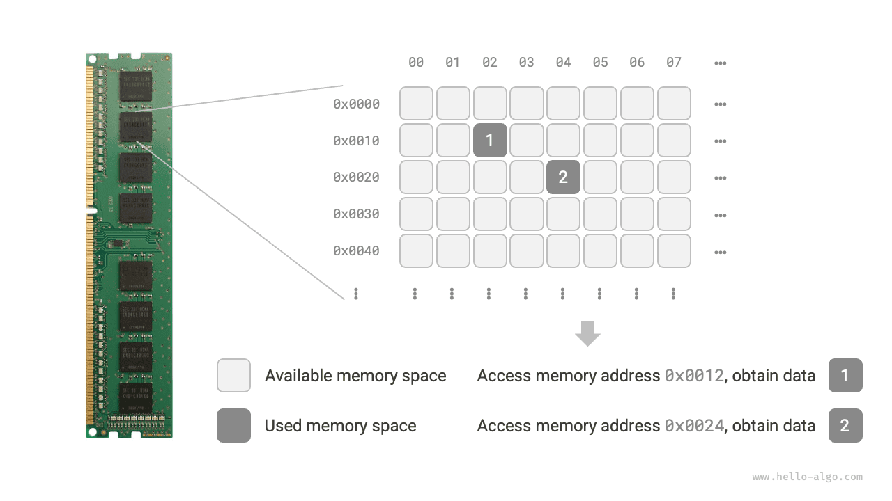

# Классификация структур данных

К распространенным структурам данных относятся массивы, связные списки, стеки, очереди, хеш-таблицы, деревья, кучи и графы; их можно классифицировать по двум измерениям: "логическая структура" и "физическая структура".

## Логическая структура: линейная и нелинейная

**Логическая структура раскрывает логические связи между элементами данных**. В массивах и связных списках данные располагаются в определенном порядке, отражая линейные отношения между элементами; в деревьях данные иерархически располагаются сверху вниз, проявляя производные отношения между "предками" и "потомками"; графы состоят из вершин и ребер и отражают сложные сетевые связи.

Как показано на рисунке ниже, логические структуры можно разделить на два больших класса: "линейные" и "нелинейные". Линейные структуры более интуитивны и означают, что данные логически выстроены в линию; нелинейные структуры, напротив, располагаются нелинейно.

- **Линейные структуры данных**: массивы, связные списки, стеки, очереди, хеш-таблицы; между элементами существует отношение "один к одному".
- **Нелинейные структуры данных**: деревья, кучи, графы, хеш-таблицы.

Нелинейные структуры данных можно дополнительно разделить на древовидные и сетевые.

- **Древовидные структуры**: деревья, кучи, хеш-таблицы; между элементами существует отношение "один ко многим".
- **Сетевые структуры**: графы; между элементами существует отношение "многие ко многим".

## Физическая структура: непрерывная и разрозненная

**Во время выполнения алгоритма обрабатываемые данные в основном хранятся в памяти**. На рисунке ниже показана планка памяти компьютера, где каждый черный блок содержит некоторый участок памяти. Мы можем представить память как огромную таблицу Excel, в которой каждая ячейка способна хранить данные определенного размера.

**Система обращается к данным по адресу памяти соответствующей позиции**. Как показано на рисунке ниже, компьютер по определенному правилу присваивает каждой ячейке в этой таблице номер, чтобы у каждого участка памяти был уникальный адрес. Имея эти адреса, программа может получать доступ к данным, находящимся в памяти.

!!! tip

    Стоит отметить, что сравнение памяти с таблицей Excel - это упрощенная аналогия; реальный механизм работы памяти гораздо сложнее и включает такие понятия, как адресное пространство, управление памятью, кэш-механизмы, виртуальная и физическая память.

Память - общий ресурс для всех программ. Когда некоторый участок памяти занят одной программой, другие программы обычно не могут использовать его одновременно. **Поэтому при проектировании структур данных и алгоритмов память является важным фактором**. Например, пиковое потребление памяти алгоритмом не должно превышать доступную свободную память системы; если непрерывного крупного блока памяти недостаточно, выбранная структура данных должна уметь храниться в разрозненных областях памяти.

Как показано на рисунке ниже, **физическая структура отражает способ хранения данных в памяти компьютера**; ее можно разделить на хранение в непрерывном пространстве (массивы) и хранение в разрозненном пространстве (связные списки). Физическая структура на нижнем уровне определяет способы доступа к данным, их обновления, вставки и удаления; эти два типа физических структур взаимно дополняют друг друга по временной и пространственной эффективности.

Стоит отметить, что **все структуры данных реализуются на основе массивов, связных списков или их комбинации**. Например, стеки и очереди можно реализовать как с помощью массивов, так и с помощью связных списков; а реализация хеш-таблицы может одновременно содержать массивы и связные списки.

- **Можно реализовать на основе массивов**: стеки, очереди, хеш-таблицы, деревья, кучи, графы, матрицы, тензоры (массивы размерности $\geq 3$ ) и т.д.
- **Можно реализовать на основе связных списков**: стеки, очереди, хеш-таблицы, деревья, кучи, графы и т.д.

После инициализации длину связного списка все еще можно изменять во время выполнения программы, поэтому его также называют "динамической структурой данных". Длина массива после инициализации неизменна, поэтому его также называют "статической структурой данных". Стоит заметить, что массив может менять длину за счет повторного выделения памяти, тем самым приобретая определенную "динамичность".

!!! tip

    Если тебе пока трудно понять физическую структуру, рекомендуется сначала прочитать следующую главу, а затем вернуться к этому разделу.
