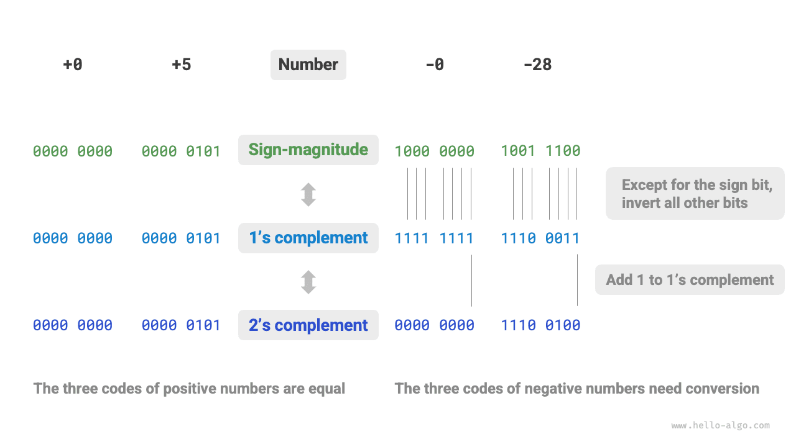

# Кодирование чисел *

!!! tip

    В этой книге разделы, помеченные символом `*`, относятся к дополнительному чтению. Если у тебя мало времени или материал кажется трудным, можно сначала пропустить их и вернуться после изучения обязательных разделов.

## Прямой, обратный и дополнительный коды

В таблице из предыдущего раздела мы заметили, что все целочисленные типы могут представлять на одно отрицательное число больше, чем положительных. Например, диапазон `byte` равен $[-128, 127]$ . Это явление выглядит не слишком интуитивно, и его внутренняя причина связана с прямым, обратным и дополнительным кодами.

Прежде всего нужно отметить, что **числа хранятся в компьютере в форме "дополнительного кода"**. Прежде чем разбирать причины такого решения, сначала дадим определения всем трем способам представления.

- **Прямой код**: старший бит двоичного представления числа рассматривается как знаковый, где $0$ означает положительное число, а $1$ - отрицательное; остальные биты представляют значение числа.
- **Обратный код**: для положительного числа обратный код совпадает с прямым; для отрицательного числа он получается инверсией всех битов прямого кода, кроме знакового бита.
- **Дополнительный код**: для положительного числа дополнительный код совпадает с прямым; для отрицательного числа он получается добавлением $1$ к его обратному коду.

На рисунке ниже показаны способы преобразования между прямым, обратным и дополнительным кодами.

<u>Прямой код (sign-magnitude)</u>, хотя и является самым наглядным, имеет определенные ограничения. С одной стороны, **прямой код отрицательных чисел нельзя напрямую использовать в вычислениях**. Например, при вычислении $1 + (-2)$ в прямом коде результатом будет $-3$ , что, очевидно, неверно.

$$
\begin{aligned}
& 1 + (-2) \newline
& \rightarrow 0000 \; 0001 + 1000 \; 0010 \newline
& = 1000 \; 0011 \newline
& \rightarrow -3
\end{aligned}
$$

Чтобы решить эту проблему, компьютеры ввели <u>обратный код (1's complement)</u>. Если сначала преобразовать прямой код в обратный и выполнить вычисление $1 + (-2)$ в обратном коде, а затем перевести результат обратно в прямой код, то получится правильный результат $-1$ .

$$
\begin{aligned}
& 1 + (-2) \newline
& \rightarrow 0000 \; 0001 \; \text{(прямой код)} + 1000 \; 0010 \; \text{(прямой код)} \newline
& = 0000 \; 0001 \; \text{(обратный код)} + 1111  \; 1101 \; \text{(обратный код)} \newline
& = 1111 \; 1110 \; \text{(обратный код)} \newline
& = 1000 \; 0001 \; \text{(прямой код)} \newline
& \rightarrow -1
\end{aligned}
$$

С другой стороны, **в прямом коде у нуля есть два представления: $+0$ и $-0$ **. Это означает, что числу ноль соответствуют два разных двоичных кода, что может приводить к неоднозначности. Например, если в условном выражении не различать положительный и отрицательный ноль, можно получить ошибочный результат. А если специально обрабатывать такую неоднозначность, придется вводить дополнительные проверки, что может снизить вычислительную эффективность компьютера.

$$
\begin{aligned}
+0 & \rightarrow 0000 \; 0000 \newline
-0 & \rightarrow 1000 \; 0000
\end{aligned}
$$

Как и прямой код, обратный код тоже страдает от неоднозначности положительного и отрицательного нуля, поэтому компьютеры ввели <u>дополнительный код (2's complement)</u>. Сначала посмотрим на процесс преобразования отрицательного нуля из прямого кода в обратный, а затем в дополнительный:

$$
\begin{aligned}
-0 \rightarrow \; & 1000 \; 0000 \; \text{(прямой код)} \newline
= \; & 1111 \; 1111 \; \text{(обратный код)} \newline
= 1 \; & 0000 \; 0000 \; \text{(дополнительный код)} \newline
\end{aligned}
$$

При добавлении $1$ к обратному коду отрицательного нуля возникает перенос, но длина типа `byte` составляет всего 8 бит, поэтому переполнившаяся в 9-й бит единица отбрасывается. Иными словами, **дополнительный код отрицательного нуля равен $0000 \; 0000$ и совпадает с дополнительным кодом положительного нуля**. Значит, в представлении дополнительного кода существует только один ноль, и проблема неоднозначности положительного и отрицательного нуля тем самым устраняется.

Остается последний вопрос: диапазон типа `byte` равен $[-128, 127]$ , откуда берется лишнее отрицательное число $-128$ ? Мы замечаем, что у всех целых чисел из интервала $[-127, +127]$ есть соответствующие прямой, обратный и дополнительный коды, а прямой и дополнительный коды можно преобразовывать друг в друга.

Однако **дополнительный код $1000 \; 0000$ является исключением: у него нет соответствующего прямого кода**. Согласно правилу преобразования, прямой код для этого дополнительного кода должен быть равен $0000 \; 0000$ . Это, очевидно, противоречие, потому что такой прямой код обозначает число $0$ , а его дополнительный код должен совпадать с ним самим. Компьютер просто определяет, что этот особый дополнительный код $1000 \; 0000$ представляет число $-128$ . На самом деле результат вычисления $(-1) + (-127)$ в дополнительном коде как раз и равен $-128$ .

$$
\begin{aligned}
& (-127) + (-1) \newline
& \rightarrow 1111 \; 1111 \; \text{(прямой код)} + 1000 \; 0001 \; \text{(прямой код)} \newline
& = 1000 \; 0000 \; \text{(обратный код)} + 1111  \; 1110 \; \text{(обратный код)} \newline
& = 1000 \; 0001 \; \text{(дополнительный код)} + 1111  \; 1111 \; \text{(дополнительный код)} \newline
& = 1000 \; 0000 \; \text{(дополнительный код)} \newline
& \rightarrow -128
\end{aligned}
$$

Ты, вероятно, уже заметил, что все приведенные выше вычисления были операциями сложения. Это намекает на важный факт: **аппаратные схемы внутри компьютера в основном проектируются на основе операций сложения**. Причина в том, что сложение по сравнению с другими операциями (например умножением, делением и вычитанием) проще реализуется на аппаратном уровне, легче распараллеливается и выполняется быстрее.

Обрати внимание: это не означает, что компьютер умеет только складывать. **Комбинируя сложение с некоторыми базовыми логическими операциями, компьютер может реализовать и другие математические операции**. Например, вычитание $a - b$ можно преобразовать в сложение $a + (-b)$ ; умножение и деление можно свести к многократному сложению или вычитанию.

Теперь можно подвести итог, почему компьютеры используют дополнительный код: с представлением в дополнительном коде компьютер может использовать одни и те же схемы и операции для сложения положительных и отрицательных чисел, без необходимости проектировать специальные аппаратные схемы для вычитания, и без особой обработки неоднозначности положительного и отрицательного нуля. Это значительно упрощает аппаратную архитектуру и повышает эффективность вычислений.

Идея дополнительного кода очень изящна; из-за ограничений по объему мы на этом остановимся. Если тебе интересно, стоит изучить эту тему глубже.

## Кодирование чисел с плавающей точкой

Внимательный читатель может заметить: `int` и `float` имеют одинаковую длину, по 4 байта , но почему диапазон значений у `float` намного больше, чем у `int` ? Это выглядит парадоксально, ведь `float` должен еще представлять дробные числа, а значит диапазон вроде бы должен быть меньше.

На самом деле **это связано с тем, что число с плавающей точкой `float` использует другой способ представления**. Обозначим двоичное число длиной 32 бита как:

$$
b_{31} b_{30} b_{29} \ldots b_2 b_1 b_0
$$

Согласно стандарту IEEE 754, 32-битный `float` состоит из следующих трех частей.

- Бит знака $\mathrm{S}$ : занимает 1 бит и соответствует $b_{31}$ .
- Биты экспоненты $\mathrm{E}$ : занимают 8 бит и соответствуют $b_{30} b_{29} \ldots b_{23}$ .
- Биты мантиссы $\mathrm{N}$ : занимают 23 бита и соответствуют $b_{22} b_{21} \ldots b_0$ .

Формула вычисления значения, соответствующего двоичному числу `float`, имеет вид:

$$
\text {val} = (-1)^{b_{31}} \times 2^{\left(b_{30} b_{29} \ldots b_{23}\right)_2-127} \times\left(1 . b_{22} b_{21} \ldots b_0\right)_2
$$

Если перейти к десятичной записи, формула вычисления будет такой:

$$
\text {val}=(-1)^{\mathrm{S}} \times 2^{\mathrm{E} -127} \times (1 + \mathrm{N})
$$

Диапазоны значений соответствующих частей таковы:

$$
\begin{aligned}
\mathrm{S} \in & \{ 0, 1\}, \quad \mathrm{E} \in \{ 1, 2, \dots, 254 \} \newline
(1 + \mathrm{N}) = & (1 + \sum_{i=1}^{23} b_{23-i} 2^{-i}) \subset [1, 2 - 2^{-23}]
\end{aligned}
$$

Посмотрим на рисунок выше: если взять пример $\mathrm{S} = 0$ , $\mathrm{E} = 124$ , $\mathrm{N} = 2^{-2} + 2^{-3} = 0.375$ , то получим:

$$
\text { val } = (-1)^0 \times 2^{124 - 127} \times (1 + 0.375) = 0.171875
$$

Теперь мы можем ответить на исходный вопрос: **в представлении `float` присутствуют биты экспоненты, поэтому его диапазон значений намного больше, чем у `int`**. Согласно приведенным выше вычислениям, максимально возможное положительное число для `float` равно $2^{254 - 127} \times (2 - 2^{-23}) \approx 3.4 \times 10^{38}$ ; если изменить бит знака, получим минимальное отрицательное число.

**Хотя число с плавающей точкой `float` расширяет диапазон значений, побочным эффектом становится потеря точности**. Целочисленный тип `int` использует все 32 бита для представления числа, и числа распределены равномерно; а из-за существования битов экспоненты у `float` чем больше число, тем больше обычно становится разница между двумя соседними представимыми значениями.

Как показано в таблице ниже, значения экспоненты $\mathrm{E} = 0$ и $\mathrm{E} = 255$ имеют специальный смысл и **используются для представления нуля, бесконечности, $\mathrm{NaN}$ и т.д.**

 Таблица <id> &nbsp; Значение поля экспоненты 

| Поле экспоненты E   | Поле мантиссы $\mathrm{N} = 0$ | Поле мантиссы $\mathrm{N} \ne 0$ | Формула вычисления                                                      |
| ------------------- | ------------------------------ | -------------------------------- | ----------------------------------------------------------------------- |
| $0$                 | $\pm 0$                        | Денормализованное число          | $(-1)^{\mathrm{S}} \times 2^{-126} \times (0.\mathrm{N})$               |
| $1, 2, \dots, 254$  | Нормализованное число          | Нормализованное число            | $(-1)^{\mathrm{S}} \times 2^{(\mathrm{E} -127)} \times (1.\mathrm{N})$  |
| $255$               | $\pm \infty$                   | $\mathrm{NaN}$                   |                                                                         |

Стоит отметить, что денормализованные числа заметно повышают точность чисел с плавающей точкой. Наименьшее положительное нормализованное число равно $2^{-126}$ , а наименьшее положительное денормализованное число равно $2^{-126} \times 2^{-23}$ .

Двойная точность `double` использует способ представления, аналогичный `float` , поэтому здесь мы не будем подробно останавливаться на нем.
