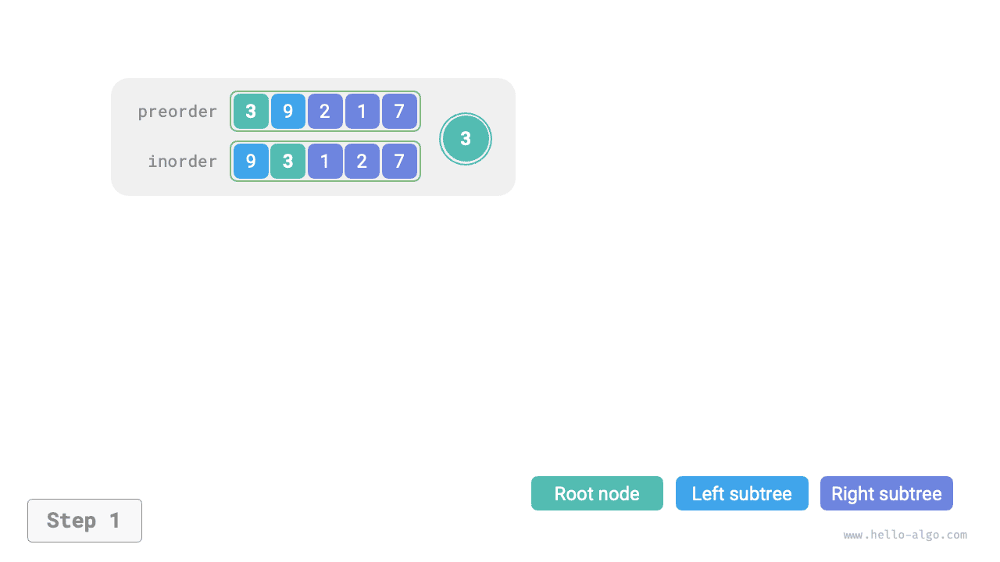
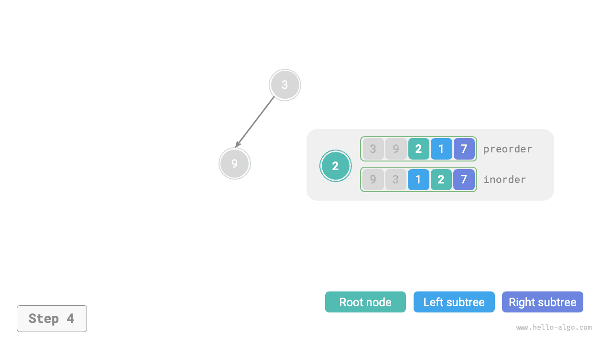
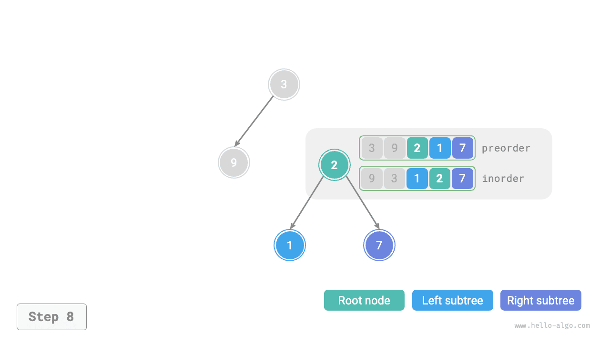
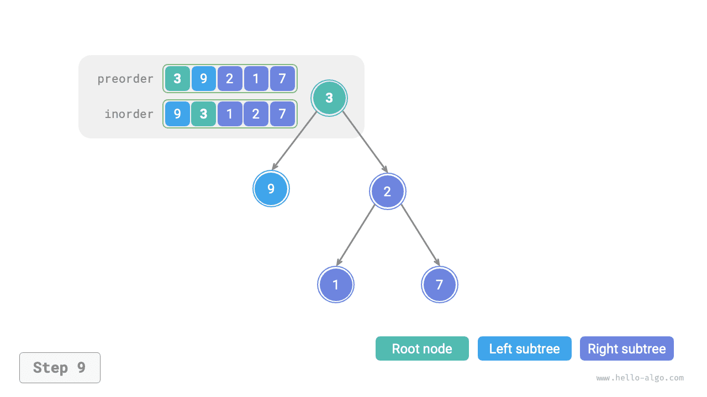

# Задача построения двоичного дерева

!!! question

    Даны прямой обход `preorder` и симметричный обход `inorder` некоторого двоичного дерева. Постройте по ним двоичное дерево и верните его корневой узел. Предполагается, что в дереве нет узлов с одинаковыми значениями (как показано на рисунке ниже).


### Проверка, является ли это задачей divide and conquer

Исходная задача - построить двоичное дерево по `preorder` и `inorder` - является типичной задачей divide and conquer.

- **Задача раскладывается на части**: если смотреть с точки зрения divide and conquer, исходную задачу можно разбить на две подзадачи: построение левого поддерева и построение правого поддерева, плюс одно действие: инициализация корневого узла. Для каждого поддерева (подзадачи) можно использовать тот же способ разбиения, пока не будет достигнута наименьшая подзадача (пустое поддерево).
- **Подзадачи независимы**: левое и правое поддеревья независимы друг от друга и не пересекаются. При построении левого поддерева нам нужно смотреть только на ту часть прямого и симметричного обходов, которая соответствует левому поддереву. Для правого поддерева рассуждение аналогично.
- **Решения подзадач можно объединить**: когда левое и правое поддеревья (решения подзадач) уже построены, их можно присоединить к корневому узлу и тем самым получить решение исходной задачи.

### Как разделить поддеревья

Из анализа выше видно, что эта задача действительно решается через divide and conquer, **но как именно, имея прямой обход `preorder` и симметричный обход `inorder`, разделить левое и правое поддеревья**?

По определению и `preorder` , и `inorder` можно разбить на три части.

- Прямой обход: `[ корневой узел | левое поддерево | правое поддерево ]` , например для дерева на рисунке выше это `[ 3 | 9 | 2 1 7 ]` .
- Симметричный обход: `[ левое поддерево | корневой узел | правое поддерево ]` , например для дерева на рисунке выше это `[ 9 | 3 | 1 2 7 ]` .

На примере данных с рисунка можно получить результат разбиения по следующим шагам.

1. Первый элемент прямого обхода, равный 3, является значением корневого узла.
2. Найти индекс корневого узла 3 в `inorder` ; используя этот индекс, можно разбить `inorder` на `[ 9 | 3 | 1 2 7 ]` .
3. По результату разбиения `inorder` нетрудно определить, что число узлов в левом и правом поддеревьях равно 1 и 3 соответственно, а значит, `preorder` можно разбить как `[ 3 | 9 | 2 1 7 ]` .


### Описание интервалов поддеревьев через переменные

Согласно описанному выше способу разбиения, **мы уже получили интервалы индексов корневого узла, левого и правого поддеревьев в `preorder` и `inorder`**. Чтобы описывать эти интервалы, нам понадобится несколько указателей-переменных.

- Обозначим индекс корневого узла текущего дерева в `preorder` через $i$ .
- Обозначим индекс корневого узла текущего дерева в `inorder` через $m$ .
- Обозначим интервал индексов текущего дерева в `inorder` через $[l, r]$ .

Как показано в таблице ниже, этих переменных достаточно для описания индекса корневого узла в `preorder` и интервалов поддеревьев в `inorder` .

<p align="center"> Таблица <id> &nbsp; Индексы корневого узла и поддеревьев в прямом и симметричном обходах </p>

|                  | Индекс корневого узла в `preorder` | Интервал индексов поддерева в `inorder` |
| ---------------- | ---------------------------------- | ---------------------------------------- |
| Текущее дерево   | $i$                                | $[l, r]$                                 |
| Левое поддерево  | $i + 1$                            | $[l, m-1]$                               |
| Правое поддерево | $i + 1 + (m - l)$                  | $[m+1, r]$                               |

Обратите внимание, что $(m-l)$ в индексе корневого узла правого поддерева означает "число узлов в левом поддереве"; лучше всего понимать это выражение вместе с рисунком ниже.


### Реализация кода

Чтобы ускорить поиск $m$ , мы используем хеш-таблицу `hmap` для хранения отображения значений массива `inorder` в индексы:

```src
[file]{build_tree}-[class]{}-[func]{build_tree}
```

На рисунке ниже показан рекурсивный процесс построения двоичного дерева: каждый узел создается в фазе "спуска", а каждое ребро (ссылка) формируется в фазе "подъема".

=== "<1>"
    

=== "<2>"
    

=== "<3>"
    

=== "<4>"
    

=== "<5>"
    

=== "<6>"
    

=== "<7>"
    

=== "<8>"
    

=== "<9>"
    

Результаты разбиения `preorder` и `inorder` внутри каждого рекурсивного вызова показаны на рисунке ниже.


Пусть число узлов дерева равно $n$ ; инициализация каждого узла (то есть выполнение одного рекурсивного вызова `dfs()` ) занимает $O(1)$ времени. **Следовательно, общая временная сложность равна $O(n)$** .

Хеш-таблица хранит отображение значений `inorder` в индексы, поэтому ее пространственная сложность равна $O(n)$ . В худшем случае, когда двоичное дерево вырождается в связный список, глубина рекурсии достигает $n$ и требует $O(n)$ памяти стека. **Следовательно, общая пространственная сложность также равна $O(n)$** .
