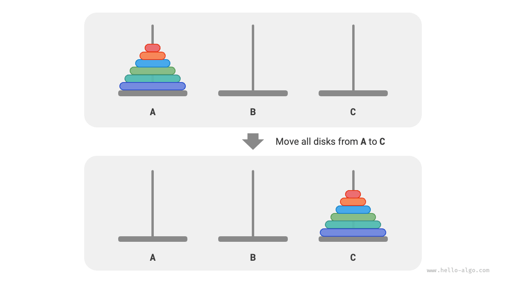
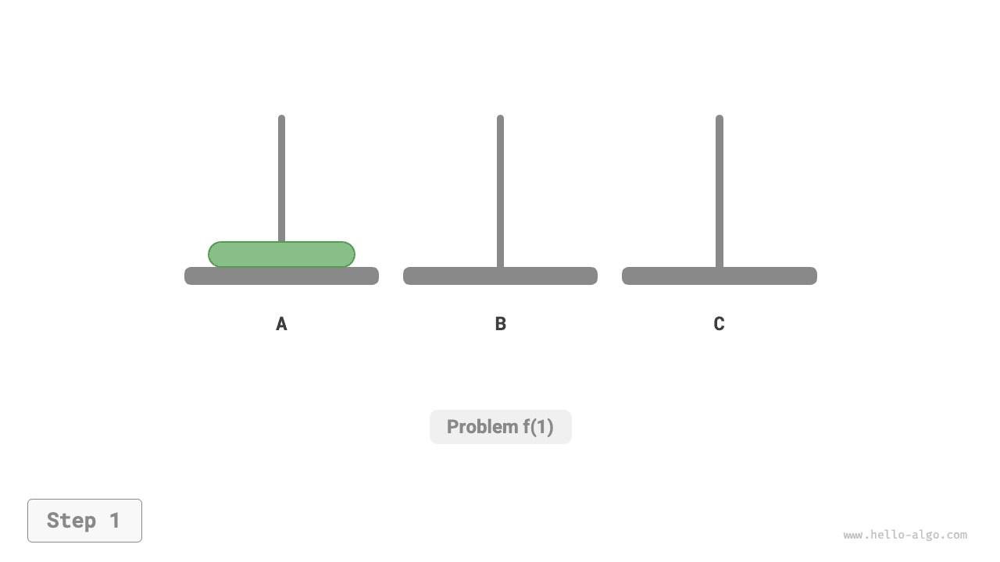
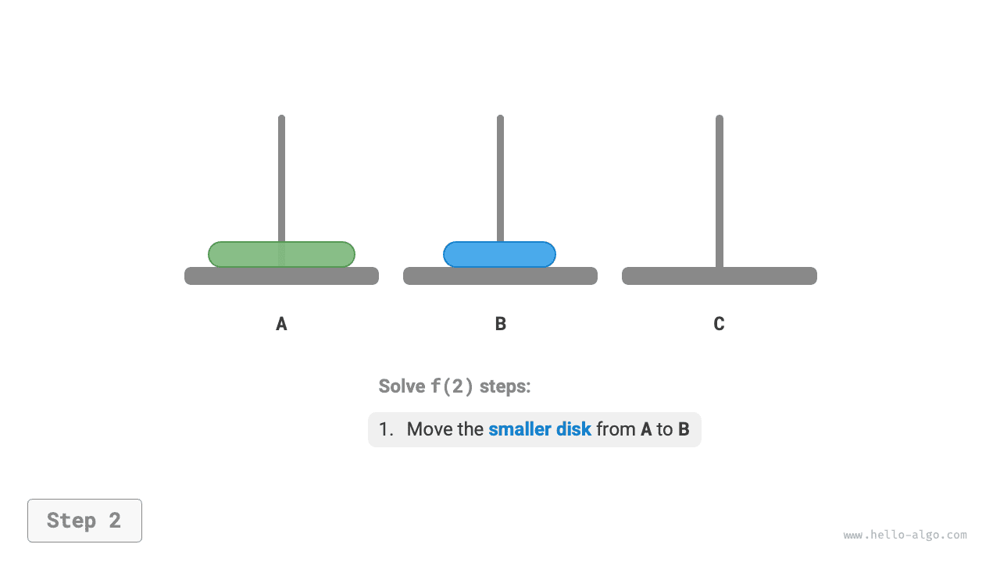
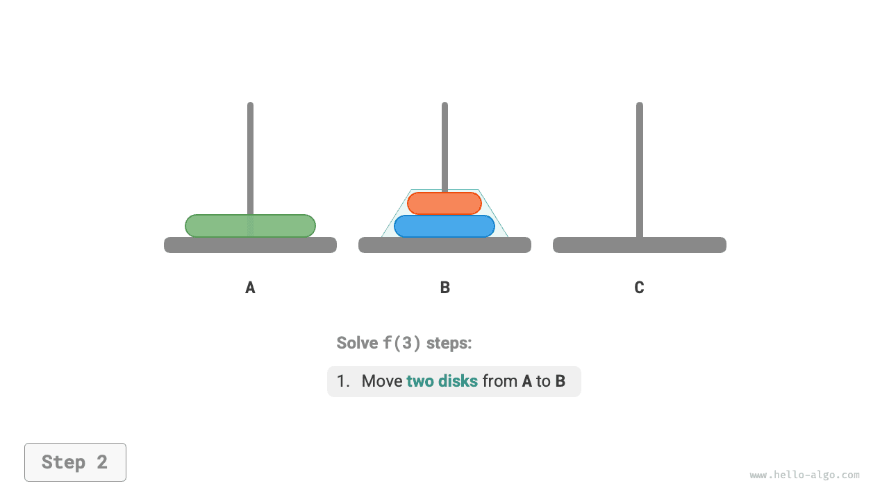
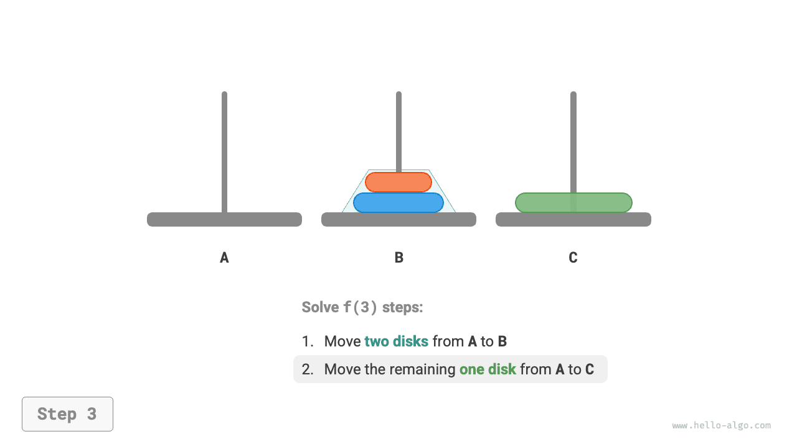
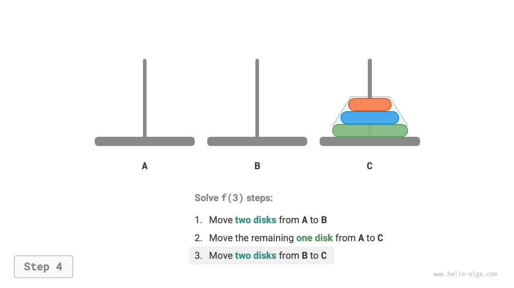
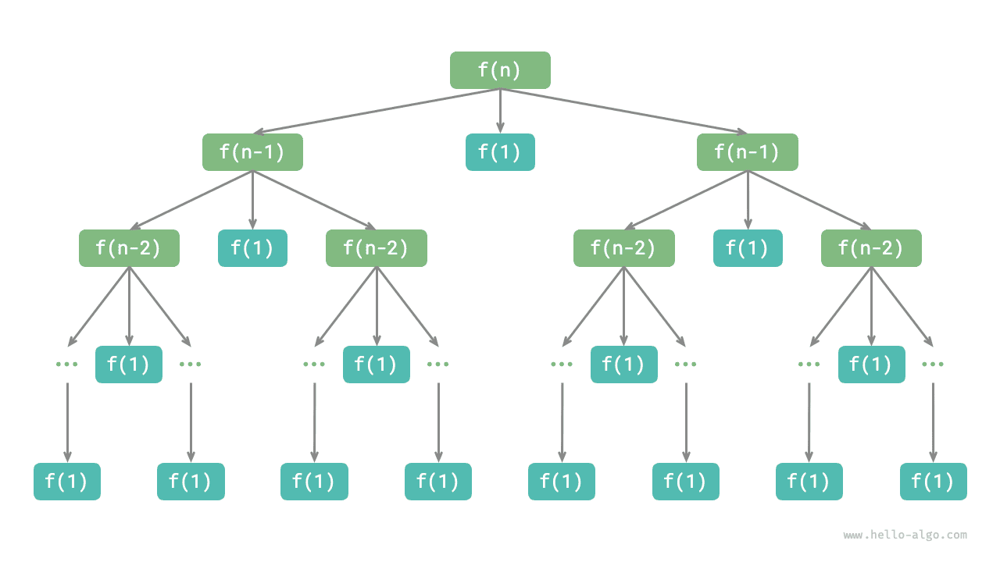

# Задача о Ханойской башне

В задачах сортировки слиянием и построения двоичного дерева мы делили исходную задачу на две подзадачи, каждая из которых имела размер, равный примерно половине исходной задачи. Однако для задачи о Ханойской башне используется другая стратегия разбиения.

!!! question

    Даны три стержня, обозначенные как `A` , `B` и `C` . В начальном состоянии на стержне `A` находятся $n$ дисков, расположенных сверху вниз в порядке от меньшего к большему. Нужно переместить эти $n$ дисков на стержень `C` , сохранив их исходный порядок (как показано на рисунке ниже). Во время перемещения дисков необходимо соблюдать следующие правила.
    
    1. Диск можно снять только с вершины одного стержня и положить только на вершину другого стержня.
    2. За один раз можно перемещать только один диск.
    3. Меньший диск всегда должен лежать на большем.



**Обозначим задачу о Ханойской башне размера $i$ как $f(i)$** . Например, $f(3)$ означает задачу перемещения 3 дисков со стержня `A` на стержень `C` .

### Рассмотрим базовые случаи

Как показано на рисунке ниже, для задачи $f(1)$ , то есть когда имеется только один диск, достаточно просто переместить его напрямую со стержня `A` на стержень `C` .

=== "<1>"
    

=== "<2>"
    

Как показано на рисунке ниже, для задачи $f(2)$ , то есть когда есть два диска, **поскольку меньший диск все время должен лежать на большем, приходится использовать `B` как вспомогательный стержень**.

1. Сначала переместить верхний маленький диск с `A` на `B` .
2. Затем переместить большой диск с `A` на `C` .
3. Наконец, переместить маленький диск с `B` на `C` .

=== "<1>"
    

=== "<2>"
    

=== "<3>"
    

=== "<4>"
    

Процесс решения задачи $f(2)$ можно кратко описать так: **переместить два диска с `A` на `C` с помощью `B`** . Здесь `C` называется целевым стержнем, а `B` - буферным стержнем.

### Разбиение на подзадачи

Для задачи $f(3)$ , то есть когда имеется три диска, ситуация становится немного сложнее.

Поскольку решения $f(1)$ и $f(2)$ уже известны, можно подойти к задаче с точки зрения divide and conquer и **рассматривать два верхних диска на `A` как единое целое**, выполняя шаги, показанные на рисунке ниже. Так три диска успешно перемещаются с `A` на `C` .

1. Сделать `B` целевым стержнем, а `C` буферным, и переместить два диска с `A` на `B` .
2. Переместить оставшийся один диск с `A` напрямую на `C` .
3. Сделать `C` целевым стержнем, а `A` буферным, и переместить два диска с `B` на `C` .

=== "<1>"
    

=== "<2>"
    

=== "<3>"
    

=== "<4>"
    

По своей сути **мы разбиваем задачу $f(3)$ на две подзадачи $f(2)$ и одну подзадачу $f(1)$** . Если последовательно решить эти три подзадачи, исходная задача тоже будет решена. Это показывает, что подзадачи независимы и что их решения можно объединить.

Таким образом, можно сформулировать показанную на рисунке ниже стратегию divide and conquer для задачи о Ханойской башне: исходная задача $f(n)$ разбивается на две подзадачи $f(n-1)$ и одну подзадачу $f(1)$ , которые затем решаются в следующем порядке.

1. Переместить $n-1$ дисков с `A` на `B` с помощью `C` .
2. Переместить оставшийся $1$ диск напрямую с `A` на `C` .
3. Переместить $n-1$ дисков с `B` на `C` с помощью `A` .

Для двух подзадач $f(n-1)$ **можно применять тот же способ рекурсивного разбиения**, пока не будет достигнута наименьшая подзадача $f(1)$ . А решение для $f(1)$ уже известно и требует всего одного перемещения.


### Реализация кода

В коде мы объявляем рекурсивную функцию `dfs(i, src, buf, tar)` , которая перемещает $i$ верхних дисков со стержня `src` на целевой стержень `tar` с помощью буферного стержня `buf` :

```src
[file]{hanota}-[class]{}-[func]{solve_hanota}
```

Как показано на рисунке ниже, задача о Ханойской башне формирует дерево рекурсии высоты $n$ , в котором каждый узел представляет подзадачу и соответствует одному открытому вызову `dfs()` ; **поэтому временная сложность равна $O(2^n)$ , а пространственная сложность равна $O(n)$** .



!!! quote

    Задача о Ханойской башне происходит из древней легенды. В одном из храмов древней Индии монахи имели три высоких алмазных стержня и $64$ золотых диска разного размера. Монахи непрерывно перекладывали диски и верили, что в тот момент, когда последний диск будет правильно перенесен, мир подойдет к концу.

    Однако даже если бы монахи перемещали по одному диску в секунду, им понадобилось бы примерно $2^{64} \approx 1.84×10^{19}$ секунд, то есть около $585$ миллиардов лет, что намного превышает текущую оценку возраста Вселенной. Поэтому, если легенда и верна, нам, вероятно, пока не о чем беспокоиться.
