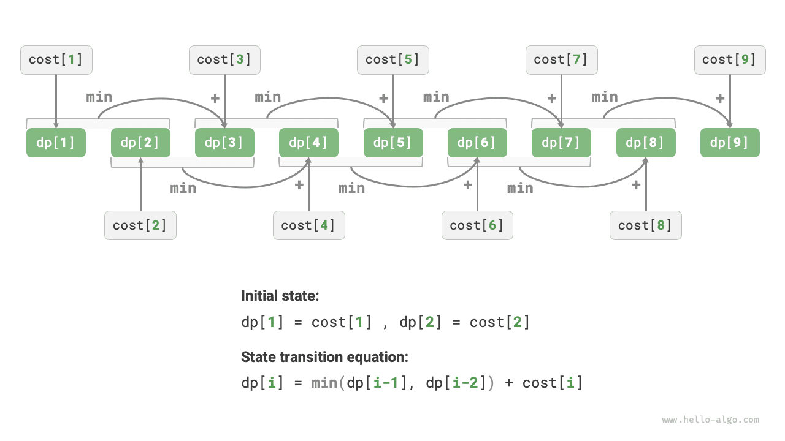
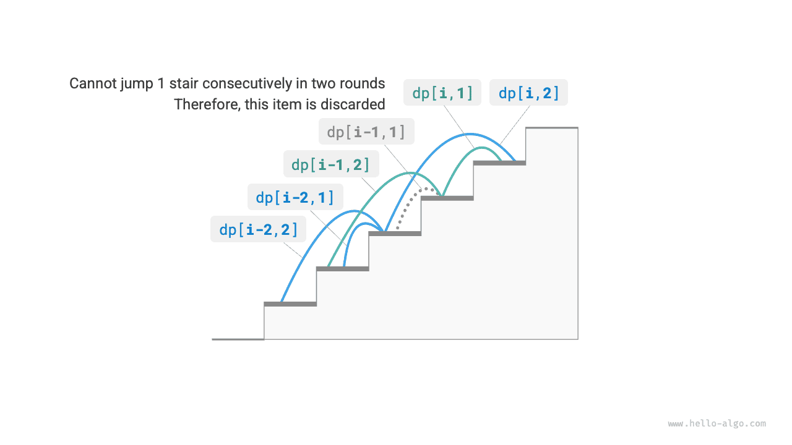

# Свойства задач динамического программирования

В предыдущем разделе мы увидели, как динамическое программирование решает исходную задачу через разложение на подзадачи. На самом деле разложение на подзадачи - это общий алгоритмический подход, но в divide and conquer, динамическом программировании и backtracking акценты расставлены по-разному.

- Алгоритмы divide and conquer рекурсивно раскладывают исходную задачу на несколько независимых подзадач, пока не будет достигнута наименьшая подзадача, а затем в процессе возврата объединяют решения подзадач в решение исходной задачи.
- Динамическое программирование тоже раскладывает задачу рекурсивно, но его главное отличие от divide and conquer в том, что подзадачи здесь зависят друг от друга и в процессе разложения возникает много перекрывающихся подзадач.
- Алгоритм backtracking перебирает все возможные решения через попытки и откат и с помощью обрезки избегает ненужных ветвей поиска. Решение исходной задачи состоит из последовательности решений, и подзадачей можно считать префикс этой последовательности решений.

На практике динамическое программирование часто применяется для задач оптимизации. Такие задачи не только содержат перекрывающиеся подзадачи, но и обладают еще двумя важными свойствами: оптимальной подструктурой и отсутствием последствий.

## Оптимальная подструктура

Немного изменим задачу о подъеме по лестнице, чтобы нагляднее показать понятие оптимальной подструктуры.

!!! question "Минимальная стоимость подъема по лестнице"

    Дана лестница, по которой можно подниматься на $1$ или на $2$ ступени за раз. На каждой ступени указано неотрицательное целое число, обозначающее цену попадания на эту ступень. Дан массив неотрицательных целых чисел $cost$ , где $cost[i]$ - это цена для ступени $i$ , а $cost[0]$ соответствует земле (начальной позиции). Найдите минимальную суммарную стоимость, необходимую для достижения вершины.

Как показано на рисунке ниже, если цены для ступеней $1$ , $2$ и $3$ равны соответственно $1$ , $10$ и $1$ , то минимальная стоимость подъема с земли на третью ступень равна $2$ .


Пусть $dp[i]$ обозначает накопленную стоимость подъема на ступень $i$ . Поскольку на ступень $i$ можно прийти только со ступени $i - 1$ или со ступени $i - 2$ , значение $dp[i]$ может быть либо $dp[i - 1] + cost[i]$ , либо $dp[i - 2] + cost[i]$ . Чтобы минимизировать стоимость, нужно выбрать меньший из этих двух вариантов:

$$
dp[i] = \min(dp[i-1], dp[i-2]) + cost[i]
$$

Отсюда и возникает смысл оптимальной подструктуры: **оптимальное решение исходной задачи строится из оптимальных решений подзадач**.

Очевидно, что эта задача обладает оптимальной подструктурой: мы берем лучшее из двух оптимальных решений подзадач $dp[i-1]$ и $dp[i-2]$ и на его основе строим оптимальное решение исходной задачи $dp[i]$ .

А обладает ли оптимальной подструктурой исходная задача о числе способов подъема по лестнице из прошлого раздела? Формально она не про оптимум, а про подсчет количества. Но если переформулировать ее как "найдите максимальное количество способов", мы неожиданно увидим, что **хотя исходная задача осталась по сути той же, оптимальная подструктура стала явной**: максимальное число способов добраться до ступени $n$ равно сумме максимальных чисел способов добраться до ступеней $n-1$ и $n-2$ . То есть объяснение оптимальной подструктуры в разных задачах может быть довольно гибким.

Зная уравнение перехода состояния, а также начальные состояния $dp[1] = cost[1]$ и $dp[2] = cost[2]$ , мы можем сразу написать код динамического программирования:

```src
[file]{min_cost_climbing_stairs_dp}-[class]{}-[func]{min_cost_climbing_stairs_dp}
```

На рисунке ниже показан процесс динамического программирования для этой задачи.



В этой задаче тоже можно оптимизировать пространство, сжав одномерное состояние в нулевое измерение и тем самым уменьшив пространственную сложность с $O(n)$ до $O(1)$ :

```src
[file]{min_cost_climbing_stairs_dp}-[class]{}-[func]{min_cost_climbing_stairs_dp_comp}
```

## Отсутствие последствий

Отсутствие последствий - одно из ключевых свойств, благодаря которому динамическое программирование вообще может эффективно работать. Его определение таково: **если текущее состояние задано однозначно, то его дальнейшее развитие зависит только от него самого и не зависит от всей истории предыдущих состояний**.

Для примера снова рассмотрим задачу о лестнице. Если дано состояние $i$ , то из него можно перейти в состояния $i+1$ и $i+2$ , соответствующие прыжкам на $1$ и на $2$ ступени. Чтобы сделать один из этих выборов, не нужно знать, какими были состояния до $i$ ; на будущее влияет только текущее состояние $i$ .

Однако если добавить в задачу дополнительное ограничение, ситуация изменится.

!!! question "Подъем по лестнице с ограничением"

    Дана лестница из $n$ ступеней. За один шаг можно подняться на $1$ или на $2$ ступени, **но нельзя два раунда подряд прыгать на $1$ ступень**. Сколькими способами можно добраться до вершины?

Как показано на рисунке ниже, на третью ступень теперь существует только $2$ допустимых способа добраться: вариант с тремя последовательными прыжками на $1$ не удовлетворяет ограничению и потому отбрасывается.


В этой задаче, если в предыдущем раунде был сделан прыжок на $1$ ступень, то в следующем раунде уже обязательно нужно прыгнуть на $2$ ступени. Иными словами, **следующий выбор уже нельзя определить только по текущему состоянию (текущему номеру ступени) - он зависит еще и от предыдущего состояния (с какой ступени мы пришли в прошлый раз)**.

Нетрудно заметить, что в таком виде задача больше не удовлетворяет свойству отсутствия последствий, а уравнение перехода состояния $dp[i] = dp[i-1] + dp[i-2]$ перестает работать, потому что $dp[i-1]$ соответствует прыжку на $1$ ступень, но при этом включает множество вариантов, где предыдущий раунд тоже был прыжком на $1$ ступень. Такие варианты уже нельзя напрямую учитывать в $dp[i]$ , если мы хотим соблюдать ограничение.

Поэтому нам нужно расширить определение состояния: **состояние $[i, j]$ означает, что мы находимся на ступени $i$ и в предыдущем раунде прыгнули на $j$ ступеней**, где $j \in \{1, 2\}$ . Такое определение состояния эффективно различает, был ли в прошлом раунде прыжок на $1$ или на $2$ ступени, и позволяет корректно определить, откуда произошло текущее состояние.

- Если в предыдущем раунде был прыжок на $1$ ступень, то в раунде перед ним мог быть только прыжок на $2$ ступени, то есть $dp[i, 1]$ может перейти только из $dp[i-1, 2]$ .
- Если в предыдущем раунде был прыжок на $2$ ступени, то еще шагом раньше можно было прыгнуть либо на $1$ , либо на $2$ ступени, то есть $dp[i, 2]$ может переходить из $dp[i-2, 1]$ или из $dp[i-2, 2]$ .

Как показано на рисунке ниже, при таком определении $dp[i, j]$ обозначает число способов для состояния $[i, j]$ . Тогда уравнение перехода состояния имеет вид:

$$
\begin{cases}
dp[i, 1] = dp[i-1, 2] \\
dp[i, 2] = dp[i-2, 1] + dp[i-2, 2]
\end{cases}
$$



В конце достаточно вернуть $dp[n, 1] + dp[n, 2]$ ; эта сумма и представляет общее число способов добраться до ступени $n$ :

```src
[file]{climbing_stairs_constraint_dp}-[class]{}-[func]{climbing_stairs_constraint_dp}
```

В этом примере достаточно дополнительно учитывать только одно предыдущее состояние, поэтому после расширения определения состояния задача снова начинает удовлетворять свойству отсутствия последствий. Однако в некоторых задачах "зависимость от прошлого" бывает гораздо серьезнее.

!!! question "Подъем по лестнице с порождением препятствий"

    Дана лестница из $n$ ступеней. За один шаг можно подняться на $1$ или на $2$ ступени. **При этом, если вы попали на ступень $i$ , система автоматически создает препятствие на ступени $2i$ , и на всех последующих шагах становиться на ступень $2i$ уже нельзя**. Например, если в первых двух раундах вы попали на ступени $2$ и $3$ , то после этого нельзя будет попадать на ступени $4$ и $6$ . Сколько существует способов добраться до вершины?

В этой задаче следующий прыжок зависит от всех предыдущих состояний, потому что каждый прыжок порождает новое препятствие на более высокой ступени и тем самым влияет на все будущие прыжки. Для задач такого типа динамическое программирование обычно оказывается непригодным.

Вообще, многие сложные задачи комбинаторной оптимизации (например, задача коммивояжера) не обладают свойством отсутствия последствий. Для таких задач обычно выбирают другие методы - например, эвристический поиск, генетические алгоритмы, обучение с подкреплением и т.д., - чтобы за ограниченное время получить пригодное локально оптимальное решение.
