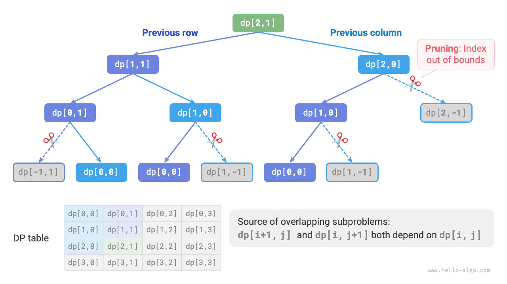
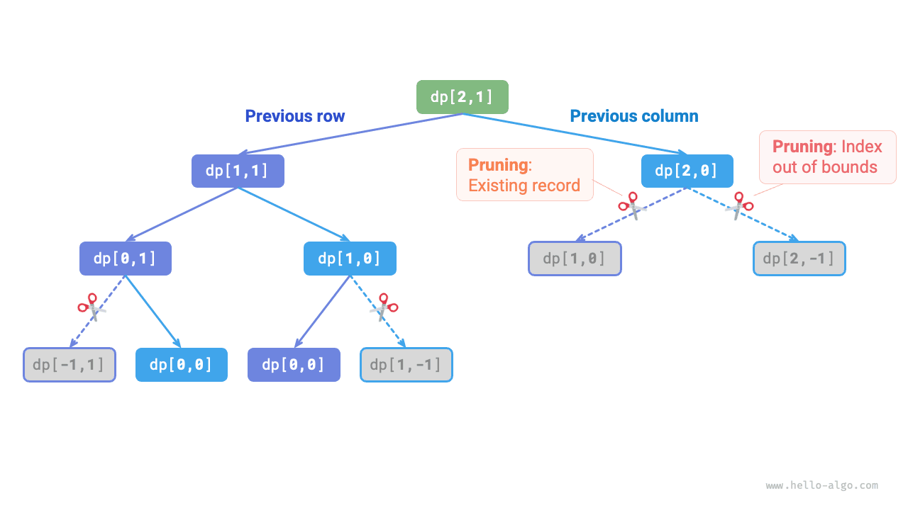
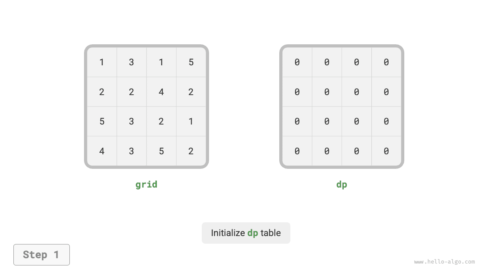
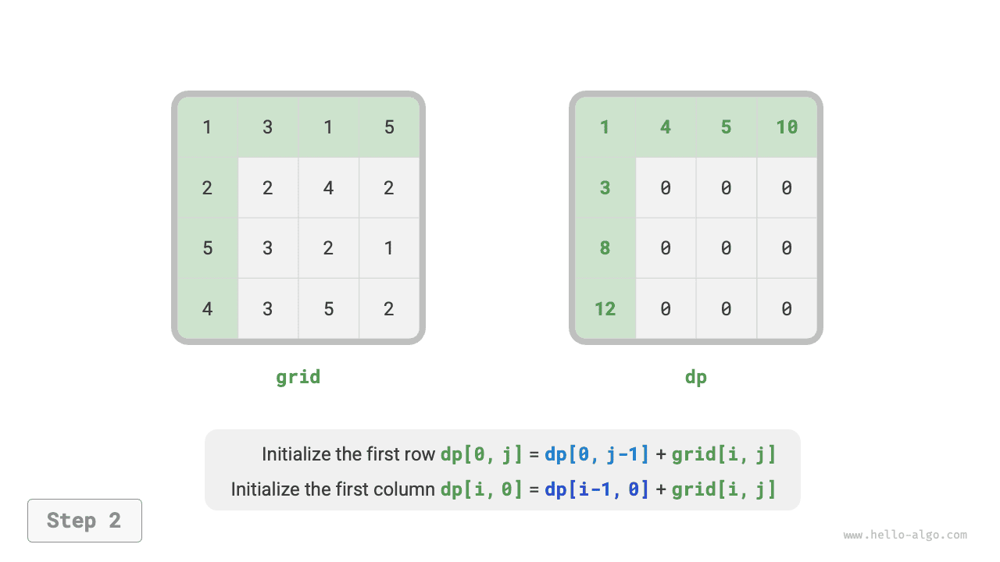
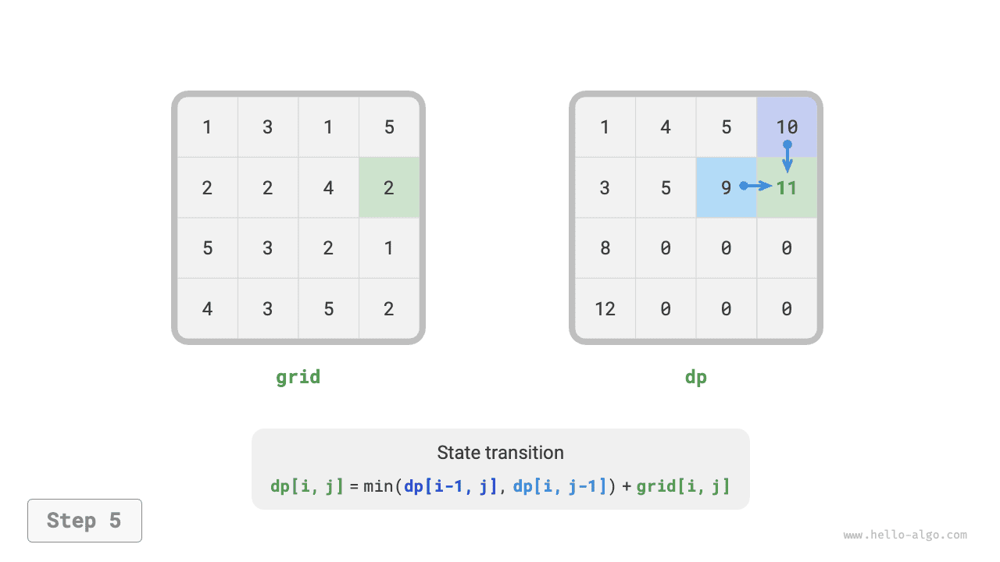
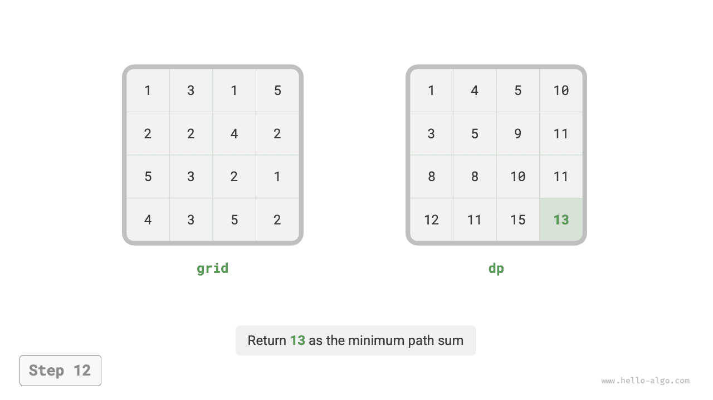

# Подход к решению задач динамического программирования

В двух предыдущих разделах были рассмотрены основные свойства задач динамического программирования. Теперь исследуем два более практических вопроса.

1. Как определить, является ли некоторая задача задачей динамического программирования?
2. С чего начинать решение такой задачи и как выглядит полный процесс решения?

## Определение задачи

В целом, если задача содержит перекрывающиеся подзадачи, оптимальную подструктуру и удовлетворяет свойству отсутствия последствий, то она обычно подходит для решения с помощью динамического программирования. Однако извлечь все эти свойства напрямую из формулировки задачи бывает трудно. Поэтому на практике мы обычно ослабляем требования и **сначала смотрим, подходит ли задача для решения методом backtracking (полного перебора)**.

**Задачи, подходящие для backtracking, обычно удовлетворяют "модели дерева решений"**. Такие задачи можно описать деревом, где каждый узел представляет одно решение, а каждый путь представляет последовательность решений.

Иначе говоря, если в задаче есть четко выраженные решения и ответ порождается последовательностью таких решений, то она удовлетворяет модели дерева решений и обычно допускает решение через backtracking.

Поверх этого у задач динамического программирования есть и некоторые дополнительные "плюсы".

- В условии задачи фигурируют слова "максимальный", "минимальный", "наибольший", "наименьший" и другие формулировки оптимизации.
- Состояния задачи можно описать списком, многомерной матрицей или деревом, и между состоянием и соседними состояниями существует рекуррентная зависимость.

Соответственно, существуют и некоторые "минусы".

- Цель задачи состоит в поиске всех возможных решений, а не одного оптимального решения.
- В формулировке явно присутствуют признаки комбинаторного перечисления, и требуется вернуть сразу много конкретных вариантов.

Если задача удовлетворяет модели дерева решений и имеет достаточно явные "плюсы", мы можем предположить, что это задача динамического программирования, а затем проверить это предположение уже в процессе решения.

## Этапы решения задачи

Конкретный процесс решения задач динамического программирования зависит от природы и сложности задачи, но обычно включает следующие шаги: описание решений, определение состояний, построение таблицы $dp$ , вывод уравнения перехода состояния, определение граничных условий и порядка переходов.

Чтобы нагляднее показать этот процесс, рассмотрим классическую задачу "минимальная сумма пути".

!!! question

    Дана двумерная сетка `grid` размера $n \times m$ , в каждой клетке которой записано неотрицательное целое число, означающее стоимость прохождения через эту клетку. Робот стартует из левой верхней клетки и за один шаг может двигаться только вправо или вниз, пока не достигнет правой нижней клетки. Верните минимальную сумму пути от левой верхней клетки до правой нижней.

На рисунке ниже показан пример, в котором минимальная сумма пути равна $13$ .


**Шаг 1: понять решения на каждом раунде, определить состояние и тем самым получить таблицу $dp$**

В этой задаче на каждом раунде решение состоит в том, чтобы из текущей клетки сделать один шаг вниз или вправо. Пусть индексы строки и столбца текущей клетки равны $[i, j]$ ; тогда после шага вниз или вправо индексы становятся равными $[i+1, j]$ или $[i, j+1]$ . Значит, состояние должно включать два переменных индекса: строки и столбца, то есть состояние обозначается как $[i, j]$ .

Подзадача, соответствующая состоянию $[i, j]$ , такова: минимальная сумма пути от стартовой клетки $[0, 0]$ до клетки $[i, j]$ . Ее решение обозначается через $dp[i, j]$ .

На этом этапе мы получаем двумерную матрицу $dp$ , показанную на рисунке ниже, размер которой совпадает с размером входной сетки `grid` .


!!! note

    Как в динамическом программировании, так и в backtracking, решение задачи можно описать как последовательность решений, а состояние образуется всеми переменными решений. Оно должно содержать всю информацию, достаточную для вывода следующего состояния.
    
    Каждому состоянию соответствует некоторая подзадача, и для хранения решений всех подзадач мы определяем таблицу $dp$ ; каждая независимая переменная состояния становится одним измерением таблицы $dp$ . По сути таблица $dp$ - это отображение от состояния к решению соответствующей подзадачи.

**Шаг 2: найти оптимальную подструктуру и на ее основе вывести уравнение перехода состояния**

Для состояния $[i, j]$ возможны только два источника: клетка сверху $[i-1, j]$ и клетка слева $[i, j-1]$ . Следовательно, оптимальная подструктура выглядит так: минимальная сумма пути до $[i, j]$ определяется меньшим из двух значений - минимальной суммы пути до $[i-1, j]$ и минимальной суммы пути до $[i, j-1]$ .

По этому рассуждению получается уравнение перехода состояния, показанное на рисунке ниже:

$$
dp[i, j] = \min(dp[i-1, j], dp[i, j-1]) + grid[i, j]
$$


!!! note

    Опираясь на уже определенную таблицу $dp$ , нужно продумать отношение между исходной задачей и подзадачами и найти способ построить оптимальное решение исходной задачи из оптимальных решений подзадач, то есть найти оптимальную подструктуру.

    Как только оптимальная подструктура найдена, на ее основе можно построить уравнение перехода состояния.

**Шаг 3: определить граничные условия и порядок переходов**

В этой задаче состояния в первой строке могут переходить только из клетки слева, а состояния в первом столбце - только из клетки сверху, поэтому первая строка $i = 0$ и первый столбец $j = 0$ образуют граничные условия.

Как показано на рисунке ниже, поскольку каждая клетка получается из клетки слева и клетки сверху, мы можем проходить матрицу циклами: внешний цикл по строкам, внутренний - по столбцам.


!!! note

    В динамическом программировании граничные условия используются для инициализации таблицы $dp$ , а в поиске - для обрезки.
    
    Смысл порядка перехода состояния в том, чтобы к моменту вычисления текущей подзадачи все более мелкие подзадачи, от которых она зависит, уже были вычислены корректно.

После этого анализа мы уже можем напрямую написать код динамического программирования. Однако разложение на подзадачи - это мышление "сверху вниз", поэтому с точки зрения мышления более естественно реализовывать задачу в порядке "полный перебор $\rightarrow$ поиск с мемоизацией $\rightarrow$ динамическое программирование".

### Метод 1: полный перебор

Начав со состояния $[i, j]$ , мы непрерывно раскладываем его на меньшие состояния $[i-1, j]$ и $[i, j-1]$ . Рекурсивная функция при этом имеет следующие элементы.

- **Параметры рекурсии**: состояние $[i, j]$ .
- **Возвращаемое значение**: минимальная сумма пути до $[i, j]$ , то есть $dp[i, j]$ .
- **Условие завершения**: когда $i = 0$ и $j = 0$ , возвращается стоимость $grid[0, 0]$ .
- **Обрезка**: если $i < 0$ или $j < 0$ , индекс выходит за границы, и в этом случае возвращается стоимость $+\infty$ , обозначающая невозможность.

Код реализации:

```src
[file]{min_path_sum}-[class]{}-[func]{min_path_sum_dfs}
```

На рисунке ниже показано дерево рекурсии с корнем в $dp[2, 1]$ ; в нем содержатся перекрывающиеся подзадачи, и их число будет резко расти вместе с размером сетки `grid` .

По своей сути причина появления перекрывающихся подзадач такова: **существует много разных путей от левого верхнего угла до одной и той же клетки**.



У каждого состояния есть два выбора - вниз и вправо, а от левого верхнего угла до правого нижнего нужно сделать всего $m + n - 2$ шагов, поэтому худшая временная сложность равна $O(2^{m + n})$ , где $n$ и $m$ - число строк и столбцов сетки соответственно. Заметим, что в этой оценке не учитывается близость к границам сетки: у граничных клеток остается только один выбор, так что фактическое число путей будет несколько меньше.

### Метод 2: поиск с мемоизацией

Введем список памяти `mem` того же размера, что и сетка `grid` , для хранения решений всех подзадач и отсечения перекрывающихся подзадач:

```src
[file]{min_path_sum}-[class]{}-[func]{min_path_sum_dfs_mem}
```

Как показано на рисунке ниже, после добавления мемоизации решение каждой подзадачи вычисляется только один раз, поэтому временная сложность определяется общим числом состояний, то есть равна $O(nm)$ .



### Метод 3: динамическое программирование

Итеративная реализация динамического программирования выглядит так:

```src
[file]{min_path_sum}-[class]{}-[func]{min_path_sum_dp}
```

На рисунке ниже показан процесс переходов состояний в задаче о минимальной сумме пути. Он проходит по всей сетке, **поэтому временная сложность равна $O(nm)$** .

Размер массива `dp` равен $n \times m$ , **поэтому пространственная сложность равна $O(nm)$** .

=== "<1>"
    

=== "<2>"
    

=== "<3>"
    

=== "<4>"
    

=== "<5>"
    

=== "<6>"
    

=== "<7>"
    

=== "<8>"
    

=== "<9>"
    

=== "<10>"
    

=== "<11>"
    

=== "<12>"
    

### Оптимизация пространства

Поскольку каждая клетка зависит только от клетки слева и клетки сверху, таблицу $dp$ можно реализовать с помощью одномерного массива, соответствующего одной строке.

Обратите внимание: поскольку массив `dp` теперь может представлять только одну строку состояний, мы не можем заранее инициализировать состояния первого столбца, а должны обновлять их по мере обхода каждой строки:

```src
[file]{min_path_sum}-[class]{}-[func]{min_path_sum_dp_comp}
```
