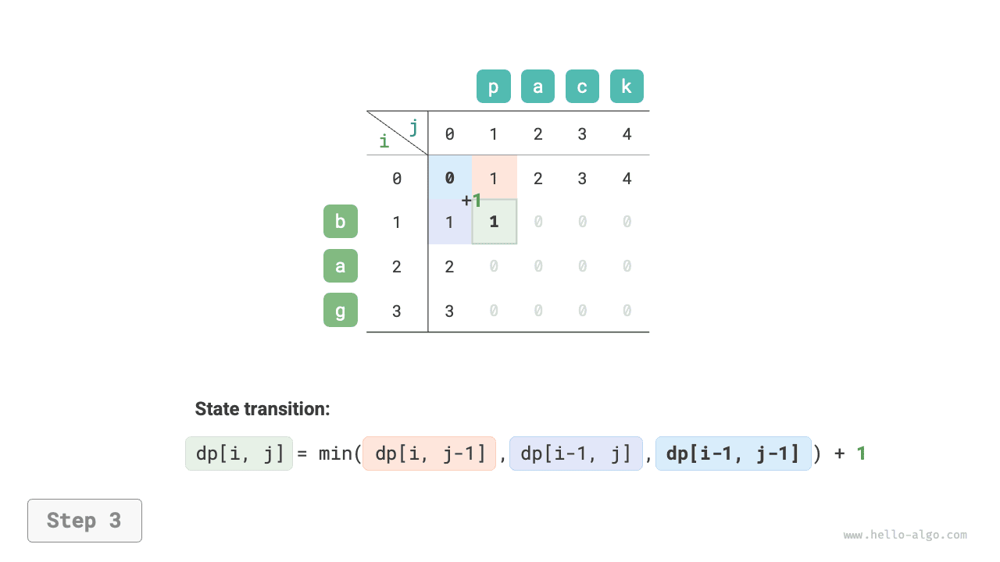
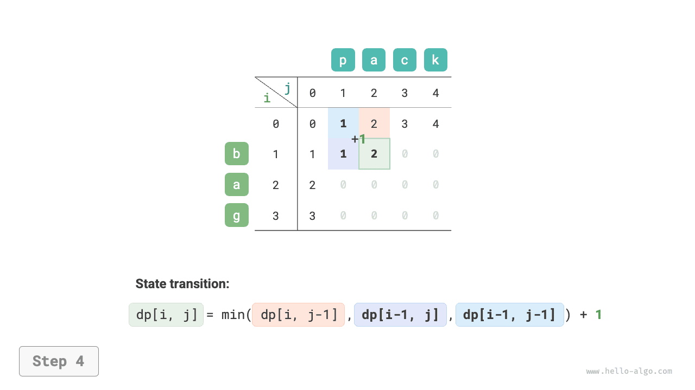
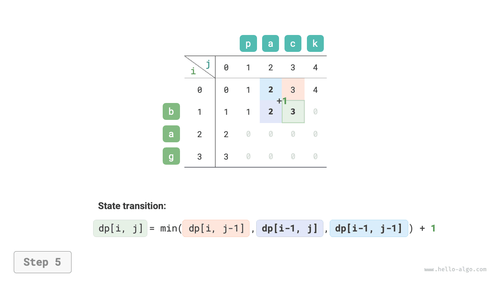
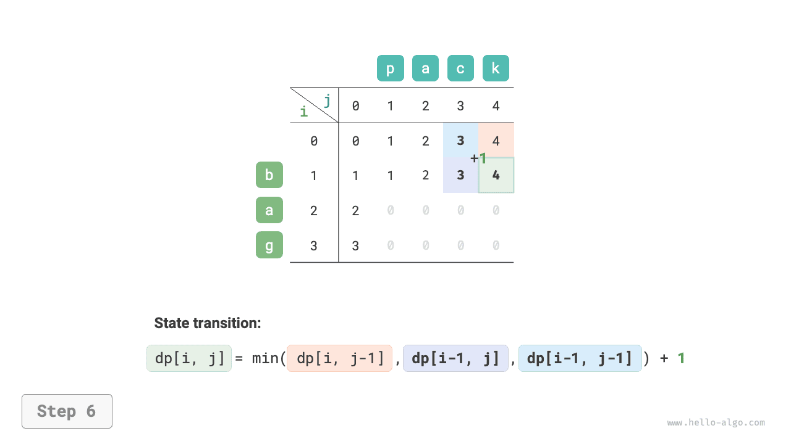
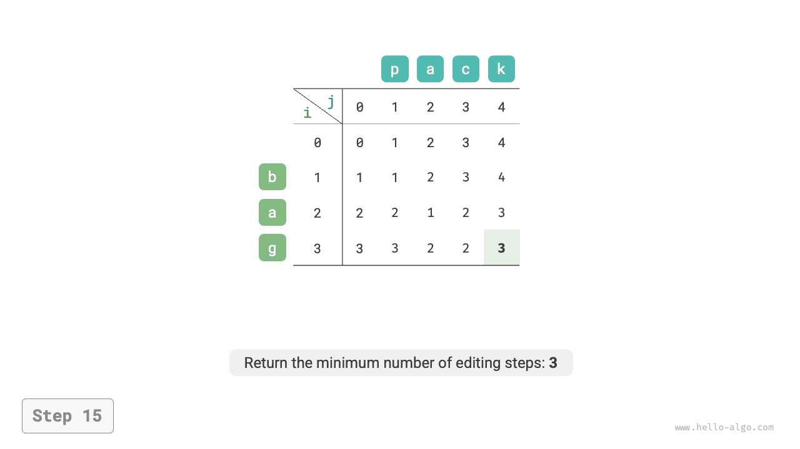

# Задача о расстоянии редактирования

Расстояние редактирования, также называемое расстоянием Левенштейна, обозначает минимальное число правок, необходимых для взаимного преобразования двух строк. Обычно оно используется для измерения сходства двух последовательностей в информационном поиске и обработке естественного языка.

!!! question

    Даны две строки $s$ и $t$ . Верните минимальное число шагов редактирования, необходимое для преобразования $s$ в $t$ .
    
    Для строки допускаются три операции редактирования: вставка одного символа, удаление одного символа и замена одного символа на произвольный другой символ.

Как показано на рисунке ниже, для преобразования `kitten` в `sitting` требуется 3 шага редактирования: 2 операции замены и 1 операция вставки; для преобразования `hello` в `algo` также требуется 3 шага: 2 замены и 1 удаление.


**Задачу о расстоянии редактирования можно очень естественно описать через модель дерева решений**. Строки соответствуют узлам дерева, а один раунд решения (одна операция редактирования) соответствует одному ребру дерева.

Как показано на рисунке ниже, если не ограничивать число операций, то каждый узел может порождать множество ребер, и каждое из них соответствует одному из вариантов преобразования. Это означает, что преобразовать `hello` в `algo` можно множеством разных путей.

С точки зрения дерева решений цель этой задачи - найти кратчайший путь между узлом `hello` и узлом `algo` .


### Идея динамического программирования

**Шаг 1: продумать решения на каждом раунде, определить состояние и тем самым получить таблицу $dp$**

На каждом раунде решение состоит в выполнении одной операции редактирования над строкой $s$ .

Нам нужно, чтобы в ходе выполнения операций размер задачи постепенно уменьшался; только тогда можно строить подзадачи. Пусть длины строк $s$ и $t$ равны соответственно $n$ и $m$ ; сначала рассмотрим последние символы этих строк, то есть $s[n-1]$ и $t[m-1]$ .

- Если $s[n-1]$ и $t[m-1]$ совпадают, их можно просто пропустить и сразу перейти к сравнению $s[n-2]$ и $t[m-2]$ .
- Если $s[n-1]$ и $t[m-1]$ различны, нужно выполнить над $s$ одну операцию редактирования (вставку, удаление или замену), чтобы последние символы стали одинаковыми, после чего можно перейти к задаче меньшего размера.

Иначе говоря, каждое решение (операция редактирования), которое мы выполняем над строкой $s$ , меняет те символы, которые еще остаются несопоставленными в строках $s$ и $t$ . Поэтому состояние определяется текущими позициями рассматриваемых символов в $s$ и $t$ , то есть состоянием $[i, j]$ .

Подзадача, соответствующая состоянию $[i, j]$ , такова: **минимальное число операций редактирования, необходимое для преобразования первых $i$ символов строки $s$ в первые $j$ символов строки $t$**.

Отсюда получается двумерная таблица $dp$ размера $(i+1) \times (j+1)$ .

**Шаг 2: найти оптимальную подструктуру и на ее основе вывести уравнение перехода состояния**

Рассмотрим подзадачу $dp[i, j]$ . Ее последние символы - это $s[i-1]$ и $t[j-1]$ . В зависимости от операции редактирования возможны три случая, показанные на рисунке ниже.

1. Вставить после $s[i-1]$ символ $t[j-1]$ ; тогда остается подзадача $dp[i, j-1]$ .
2. Удалить $s[i-1]$ ; тогда остается подзадача $dp[i-1, j]$ .
3. Заменить $s[i-1]$ на $t[j-1]$ ; тогда остается подзадача $dp[i-1, j-1]$ .


Согласно этому анализу оптимальная подструктура такова: минимальное число шагов редактирования для $dp[i, j]$ равно минимуму из трех значений - $dp[i, j-1]$ , $dp[i-1, j]$ и $dp[i-1, j-1]$ - плюс цена текущей операции редактирования $1$ . Значит, уравнение перехода состояния имеет вид:

$$
dp[i, j] = \min(dp[i, j-1], dp[i-1, j], dp[i-1, j-1]) + 1
$$

Заметим, что **если символы $s[i-1]$ и $t[j-1]$ совпадают, то редактировать текущий символ не нужно**. В этом случае уравнение перехода состояния имеет вид:

$$
dp[i, j] = dp[i-1, j-1]
$$

**Шаг 3: определить граничные условия и порядок переходов**

Когда обе строки пусты, число операций редактирования равно $0$ , то есть $dp[0, 0] = 0$ . Когда строка $s$ пуста, а строка $t$ непуста, минимальное число операций равно длине строки $t$ , то есть вся первая строка инициализируется как $dp[0, j] = j$ . Когда строка $s$ непуста, а строка $t$ пуста, минимальное число операций равно длине строки $s$ , то есть весь первый столбец инициализируется как $dp[i, 0] = i$ .

Из уравнения перехода видно, что решение $dp[i, j]$ зависит от значений слева, сверху и слева сверху, поэтому всю таблицу $dp$ можно обходить двумя вложенными циклами в прямом порядке.

### Реализация кода

```src
[file]{edit_distance}-[class]{}-[func]{edit_distance_dp}
```

Как показано на рисунке ниже, процесс переходов состояния в задаче о расстоянии редактирования очень похож на процесс в задачах о рюкзаке: в обоих случаях это заполнение двумерной сетки.

=== "<1>"
    

=== "<2>"
    

=== "<3>"
    

=== "<4>"
    

=== "<5>"
    

=== "<6>"
    

=== "<7>"
    

=== "<8>"
    

=== "<9>"
    

=== "<10>"
    

=== "<11>"
    

=== "<12>"
    

=== "<13>"
    

=== "<14>"
    

=== "<15>"
    

### Оптимизация пространства

Поскольку $dp[i,j]$ зависит от значения сверху $dp[i-1, j]$ , слева $dp[i, j-1]$ и слева сверху $dp[i-1, j-1]$ , прямой обход после оптимизации памяти теряет значение слева сверху, а обратный обход не позволяет заранее построить значение слева $dp[i, j-1]$ . Значит, оба наивных варианта обхода здесь непригодны.

Чтобы решить эту проблему, можно использовать переменную `leftup` для временного сохранения значения слева сверху $dp[i-1, j-1]$ ; после этого остается учитывать только верхнее и левое значения. Тогда ситуация становится эквивалентной задаче о полном рюкзаке, и можно выполнять прямой обход. Код приведен ниже:

```src
[file]{edit_distance}-[class]{}-[func]{edit_distance_dp_comp}
```
